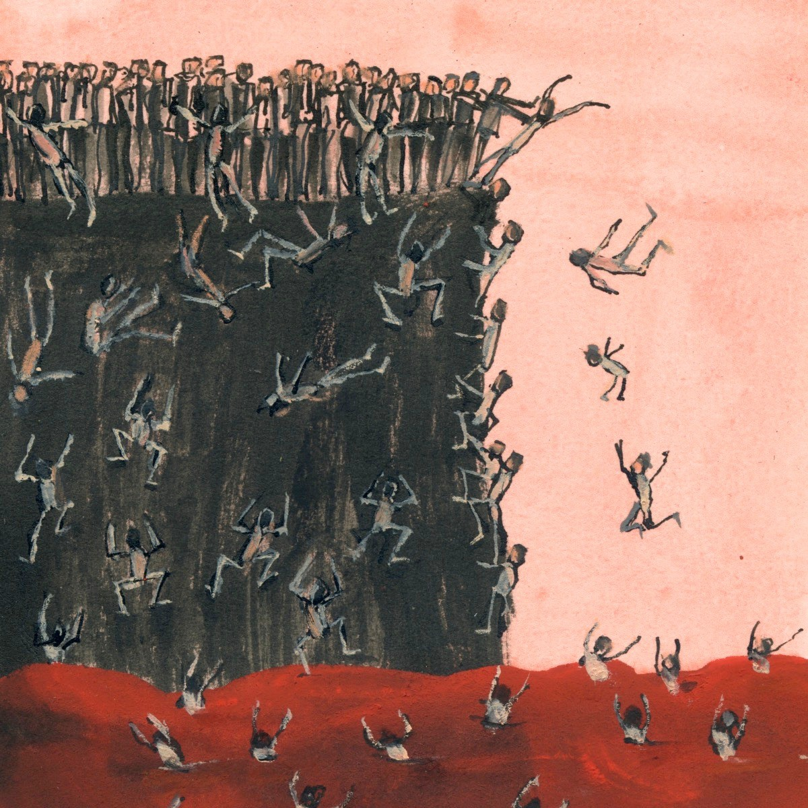
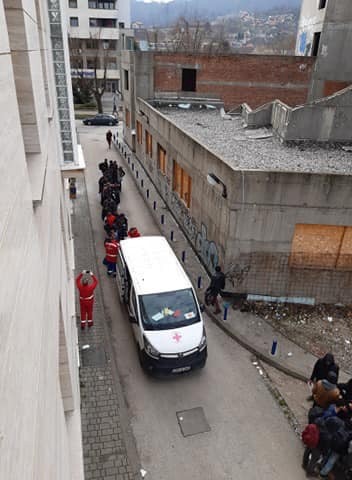
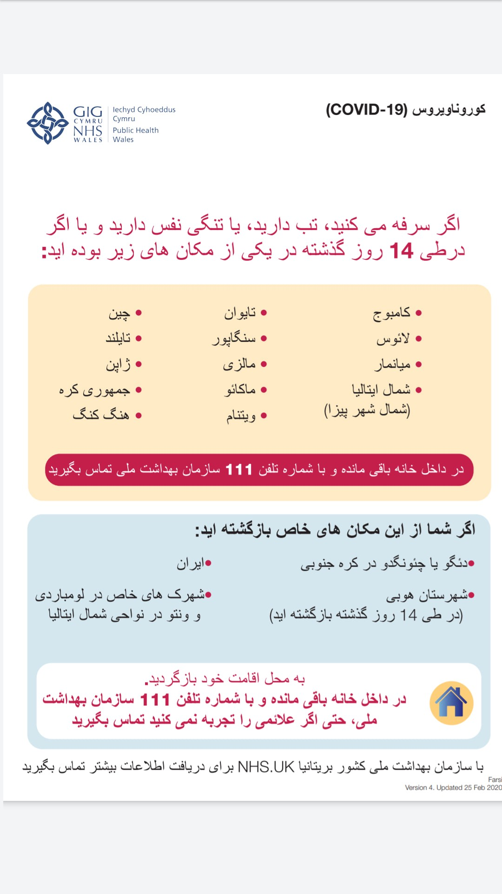

### AYS Daily Digest 10/3/20: Greece — What happens to the people?
#### “Greece should immediately reverse this draconian policy, properly receive these people in safe and decent conditions, and allow them to lodge asylum claims\.” — HRW / Serbia’s south after fascist attacks / People sleeping rough in Tuzla to a camp near Sarajevo / & more news

#### FEATURED
### Summarily and forcibly returned without respecting the right to seek asylum

People interdicted by the Greek Coast Guard since March 1, 2020 have been held on the ship docked in the Mytilene Harbor in Lesbos\. Local authorities refused Human Rights Watch requests to enter the dock area where the women, men, and children are being detained during the day or to board the naval vessel where they stay at night, HRW reports\.

451 people were detained, many of whom are children and women\. Reportedly, the people asked the Greek authorities to let them lodge asylum claims but were told that they would not be allowed to do so\. The Greek decision may amount to an arbitrary deprivation of liberty, HRW [said\.](https://www.hrw.org/news/2020/03/10/greece/eu-allow-new-arrivals-claim-asylum)
### ‘Black sites’

Prominent media have reported about the Greek government detaining potential asylum seekers at a secret extrajudicial location before expelling them to Turkey without due process, documenting in detail the location and process, calling it “one of several hard\-line measures taken to [seal the borders to Europe](https://www.nytimes.com/2020/03/04/world/europe/europe-migrants-turkey-greece.html) that experts say violate international law\.” People have witnessed of being captured, stripped of their belongings, beaten and expelled from Greece without being given a chance to claim asylum or speak to a lawyer\.
Find the entire story [here](https://www.nytimes.com/2020/03/10/world/europe/greece-migrants-secret-site.html?fbclid=IwAR2g3DhH-3F0xXQPEvwmz1QFqTmvUSqJhZXZvjz58uPK-AMHAN5R4QbAWps) \.
### 2 cases of Covid\-19 on Chios

A 45\-year\-old Cyprus resident was found in quarantine at Chios Hospital at 16:00 on Tuesday with her 20\-year\-old son, who is a student on the island\. According to Greek sources, the woman, who came to the hospital with symptoms of pharyngitis, had contacted a confirmed case in Cyprus, where she works as a nurse permanently\. Both were sampled to be sent to the Pasteur Institute for analysis and are **expected to answer by tomorrow** **whether they are positive or negative** for the coronavirus\. 
The hospital was given instructions to restrict them from home, as the mother has mild symptoms so far while her son is in extreme health without any symptoms at all\. It is needless to stress how important these findings will be for the people stuck in the island, in precarious conditions\.
Previously, the news of a [confirmed case](https://www.theguardian.com/global-development/2020/mar/11/lesbos-coronavirus-case-sparks-fears-for-refugee-camp-moria?fbclid=IwAR1_7H6giy_DCa63BBGRmwdxP9wqwoUWLSuCfi6OLQK2CUnrDAeX8vzYV9k) of Covid\-19 on Lesbos has sparked fears of the impact of an outbreak at the overcrowded Moria camp\. Unfortunately, doctors are among those being attacked by the locals, and also by the gathered fascist groups spreading across the islands\.

_See more information and instructions for those with suspicion on the presence o coronavirus, in English, Arabic and Persian, at the bottom of this News Digest\._
### Neo\-Nazi current against the people on the islands

In the meantime, the intervention of the Attorney General of the Supreme Court, Vasilis Pliotas, caused press [reports](https://l.facebook.com/l.php?u=https%3A%2F%2Fastraparis.gr%2Fparemvasi-toy-eisaggelea-toy-a-p-gia-to-akrodexio-pogkrom-se-evro-kai-nisia%2F%3Ffbclid%3DIwAR3ueXJ4frvvp-NoRUJeIOyK5bFFCeMDahu4mIL1Gr6WXK3wfEXtdAZujPs&h=AT0_TAxm8cklK3LdkArAySxL-7T6RJkEEBZFNUp49fQipsLrsh8dSD5WeMzcLdOhiKvyuH1ITQKIgjZq2N4SM-7uP-JxMeY1lnfrVb0yQ-4LhAUfz5mKu0KGJ-BoUKHlCHQ1OnmqljUl3Q) about the emergence of German neo\-Nazis in Evros and the islands, as well as the fire that broke out in the daily structure of refugees and migrants in Lesvos\. According to the neo\-Nazi presence in question, it seems that they have appeared both in the Aegean islands and in Evros, playing the role of an informal “militia”, chasing immigrants or all background, solidarity people, NGO members and even reporters\. The High Public Prosecutor, by ordering the local competent prosecutors, requests that the complaints be established and that they take all necessary steps to fully investigate these cases\.

■■■■■■■■■■■■■■ 
> **[John T Psaropoulos](https://twitter.com/JTPsaropoulos) @ Twitter Says:** 

> > In the shanty town that is #Moria, an Afghan #refugee father has made this wildflower garden for his children. https://t.co/ucwKBox96V 

> **Tweeted at [2020-03-09 12:50:41](https://twitter.com/jtpsaropoulos/status/1236997835788337152).** 

■■■■■■■■■■■■■■ 

### Unaccompanied minors

The non\-existent concrete solidarity from the members in the European Union towards Greece has so far only exacerbated social tensions and further fraying of a strained economy and limbo for tens of thousands of people on the move seeking safety and a chance to start living again\. 
Now, apart from sending financial support and police officers to their borders, some of the EU Member states also claim they would accept unaccompanied minors from Greece\. Portugal, Luxembourg, France, Finland and Germany are so far the EU\-countries who have definitely agreed to it\.

Sweden [will not accept](https://www.aftonbladet.se/nyheter/a/OpAEr3/sverige-tar-inte-emot-barn-fran-migrantlager?fbclid=IwAR09zc_TWzWVTPuyNzKOjcLHPJyHXwpxsB2xvGgnwVBR6Tqj2BOWCV7Isjk) any unaccompanied minors from Greece\. Morgan Johansson, minister of Migration declined an interview with the Swedish new agency TT and wrote in a comment that he thinks that it is good that the EU is discussing the relocation of especially vulnerable children\. He also wrote that Sweden will not accept any refugee children under a temporary mechanism, but that the government is looking into in what other ways they can help Greece\. He referred to that Sweden already has taken in a lot of people during the height of the “crisis”, back in 2015\.

Austria would be sending group of its own policemen to the Evros border to help in EU border patrol efforts there, it was confirmed at the bilateral meeting that the prime ministers of these two countries held in Vienna\.

Croatian policemen have also been sent to the Greek border, while at the same time the Croatian PM and the Minister of Interior have both claimed Croatia intends to welcome the minors from Greece\. Still, their intentions seem unclear, as is their knowledge of how the reception of unaccompanied minors takes place in Croatia at the moment\. While wishing to cherry\-pick those they find to be the “real refugees” and “real children”, at the same time their police officers are beating, humiliating and stipping of their belongings, shoes and rights to claim for asylum at the second gates to the EU, the Croatian border\. This populist announcement is so far still just that, and a hypocrite stance in the face of thousands who are experiencing torture from the official hands of Europe\.
#### GREECE
### March 11th at 3 pm Greek time Mare Liberum docks in the port of Mytilene

> We finally have the permission to do so by the local port authorities\. We’ll hold a short press conference on arrival\. We need a safe port to be able to prepare for our next mission in human rights monitoring\. Until now these preparations were not possible, because we were forced to spent eight days at sea as the Greek authorities couldn’t assign a safe port to us\. 

> Since March 2nd, when we were forced to leave port because of a fascist attack, we are anchoring offshore\. We made several unsuccessful attempts to dock in other ports: They were blocked by gathering mobs and the authorities claiming they couldn‘t guarantee for our security, with the generally unsafe situation on the island and the high presence of local and international fascist\. 

> In this current climate it is more important than ever that independent monitoring, documentation and reporting are taking place\. We are here to do that, for the rights of people on the move and in support of the solidary people on the island — we will not leave the island to the fascists\! 

### Athens — No middle ground\. Either with fascists or with humans: Solidarity protest

[!["No middle ground. Either with fascists or with humans": Solidarity to migrants protest [Greece]](assets/d8dfb774e0eb/34b5_hqdefault.jpg ""No middle ground. Either with fascists or with humans": Solidarity to migrants protest [Greece]")](https://www.youtube.com/watch?v=9CxdXKOdCys)

> Greece, the edge of “Fortress Europe”, where since the 28th of February 2020 a brutal and inhuman geopolitical “game” has been at play\. On the one side Turkey’s Erdogan, that tricked tens of thousands of migrants into believing that the borders to Europe, through Greece, are open for them to enter, in order for Turkey to blackmail the EU into supporting his terror campaign against the Kurds in Syria\. 

> On the other side, Greece, that in order for the far right wing government to extract money from the European Union, for prison like concentration camps for migrants and for defense purposes, sealed the borders arresting anyone that manages to cross them\. 

> And in no man’s land, thousands of refugees, used like pawns by both governments and the EU, being pushed by turkish forces that throw tear gas grenades and fire rubber bullets at the greek side of Evros and the greek forces throwing teargas grenades and using water cannons\. Several reports from the turkish side say that migrants have been killed by bullets fired from the greek side, remaining unknown whether it is by the military or by nationalist vigilante militias\. 

> Greek vigilante groups in Evros are roaming freely the borders, terrorising and arresting groups of migrants that manage to find a hole through the fence, while in the greek island of Lesbos vigilante groups act like a mob that has set check points at the edges and the centre of Mytilene town \(the capital of Lesbos island\), verbally abuse any migrants in dinghies that reach the greek shores, attack and terrorize volunteers or NGO workers aiding migrants, smash their cars or violently beat them\. Fascists from several european countries have flown to Lesbos island to take part in the mob that attacks anyone not speaking greek, migrants, NGO workers or tourists\. A school for refugee children has also been burnt to the ground by this right wing racist mob\. Tourists, volunteers and NGO workers are fleeing Lesbos island because it’s not safe for anyone not speaking greek, except of foreign fascists and nationalists aiding the vigilante mobs\. 

> And while you would think that these despicable acts would be condoned by the majority at least of the people, the contrary happens\. Racists, nationalists, conservative, neoliberals, right wingers, social democrats, even some self\-proclaimed lefties, have united in a front, backing these acts or turning a blind eye on them\.
 

> \(…\) 

> On Saturday, March 7, 2020, thousands of anarchists, anti\-authoritarians, antifascists and people in solidarity in Athens chose to speak out, in defence of humanity against fascism, in defence of a world without borders, in defence of those who don’t have a voice because it has been choked by the teargas, the guns and the barbed wire fences at the edge of “Fortress Europe” 

— [Perseus999](https://www.facebook.com/Perseus999/)
#### BULGARIA
### Bulgaria has not received a request from Greece to release the Ivaylovgrad Dam

News has been circulating that Bulgaria has opened its dams and water levels began to rise, making the crossing of the Evros river even more life\-threatening\. However, Bulgaria has not received a request from Greece to release the Ivaylovgrad Dam, the official sources from the Ministry confirmed\. 
“Over the past days and at the moment, a high wave is observed in the river valleys of Vacha and Arda\. Both rivers flow into the Maritza River\. 
HPP Ivaylovgrad will operate at full capacity from 5:00 pm to 24:00 pm on 10/03/2020\. hours and from 5:00 pm to 11:00 pm\. 
**No overflow of the Ivaylovgrad dam is allowed and it is not expected in the coming days\.** No one approached NEK with a request for a controlled discharge of water\. 
According to NIMH data from an automatic station on the Maritza River near the town of Svilengrad, no increase in the river level has been observed in recent days\. Water quantities fluctuate between 60–75 m3 / sec\. The MoEW is obliged to notify the Ministry of Foreign Affairs \(MFA\), Southeast Europe Directorate, in case of unforeseen and/or exceptional circumstances or upon information received from NIMH about significant precipitation in the transboundary watercourses of the Arda, Maritza, Tundzha, Dospat rivers\.

Places and Struma, and in establishing a high probability of water quantities for the Arda River after the Ivaylovgrad Dam — 300 m3 / sec, for the Maritza River near Svilengrad — 600 m3 / sec, for the Tundzha River near Elhovo — 100 m3 / sec, for the Dospat River after the Dospat Dam — 36 m3 / sec, for the Mesta River near Hadzhidimovo — 100 m3 / sec, and for the Struma River at Marino Pole — 300 m3 / sec\.” 
Given the state of the transboundary rivers, no notification is currently required, the Ministry reported\.
### Asking for additional funds to equip the border

Bulgaria’s Prime Minister Boyko Borissov has announced that the Bulgarian government will ask the European Commission for the sum of 130 million euros for purchasing additional police equipment in the event of a severe migration crisis\. Direct assistance from Germany will also be sought, the prime minister said at a cabinet meeting and Bulgarian media [reported](https://bnr.bg/en/post/101238580/bulgaria-to-request-eur-130-mln-assistance-for-police-equipment) \.
#### SERBIA
### Šid

The local team of [No Name Kitchen](https://www.facebook.com/NoNameKitchenBelgrade/?__tn__=kC-R&eid=ARC33tNAzxTdKh373wU4BGRZQtDzAMcRxfVs4LNV0VYYPo9ECrD85fTxp902rA8wUCpxgQGNRfelGyza&hc_ref=ARR01UNXKWzI1wl1VXgtk1bzSth5atC-z7EFxAafoXNnuBWET-OLlPJhxIJDA2hMLVs&fref=nf&__xts__%5B0%5D=68.ARAMVZemIlRAlxnnHyWuRw2KrRacRnuJOVQ9x9zBP26KD77VbLht_11EdErvxO_-TuviYllsFAKSLCsBMjSoOh2kFYGpG4OPYGqtg_yjusibdGBfxFfFItSvemD96TshsmX-I3FFK-WCyC6JiUVhPISPtMND6vvUMjCKVKNdWky8dCbKiUD1_199chQj2EWHp2wP_TExa2qaUSfj1C44HNhckibAuITJu2WASIpzuKSzmHCUoEKX_0LGT4b-72KpK_ef-0xx87KicTorVAISy3UDCFBu9m0oYFqDl6cG2LE8d9TbStKIllZ1bQOAqPRixnm-r0mRnzmwaC-Mg1G4LkSha9Q0ZopRNfxBwBmLmaRhRABqUQ) in Šid reported:

“Special police forces continue to be in Šid for more than a week now\. With several police cars and vans patrolling the streets daily, there currently seem to be more police men than people on the move present in town\. We have observed in the last couple of nights, that police awaits trains from Belgrade arriving in Šid, and then catches people coming out of the trains to put them directly in camps\.

The other day a small fight erupted in the family camp\. Instantly around ten police officers appeared, already waving their sticks upon exiting their cars, unnecessarily scaring everyone around\.

People on the move in Šid, both those inside and outside of official camp systems, are being deprived of the last bits of normalcy and security\. Every taxi drive or walk to the shop is attached to a high risk of being caught by police, possibly being humiliated or robbed of one’s money, too\. At the same time, going on game currently is all the more complicated, on some days even impossible, which adds to the sense of ultimately being trapped at the border\.”
#### BOSNIA AND HERZEGOVINA
### People taken from the Tuzla station with repressive measures

After not having done anything to help with solving the issues of both the people in tranzit and those in solidarity with them across Tuzla, the authorities have now organized an urgent police action to take those who were staying outside, in the streets and around the bus station of Tuzla, as well as those in the private accommodation who were not officially registered there, to a camp in the Sarajevo area, where previously people from Vučjak were being taken after the dismantlement of the camp there\. The camp Blažuj should have all the basic amenities that should be enough to satisfy the minimum standard requirements\.
However, the way this was done just reflects the real intentions, official stance, the incompetence, but also the silent approval of the agencies, given the way this was carried out\.

Armed special forces entering people’s sleeping areas and violently telling them to get out from there, afterwards taking them in cordons through the city, in a humiliating and frightening way — if this was done in coordination with the international agencies \(and it had to have been\), they have just the same amount of responsibility for the fear and mounted feeling of insecurity these young people have now, being taken away with no prior consent, information and organisation with the affected community\.

We are open to everyone wishing to give their reflection or update of this action\.

So far, we know that there are new people arriving in Tuzla, as they have been all this time, and lines are already forming in front of the Office for foreigners…

#### GERMANY

[Sächsischer Flüchtlingsrat e\.V\.](https://www.facebook.com/saxfrev/?__tn__=%2CdkCH-R-R&eid=ARBgifuM9vp8ip0qKaUvVhMDBi4hAKVZ8QCeD-7BM2pKNel3XSLTKLXMrJ-1uPbVEZONKS016WQQzx-P&hc_ref=ARSJTcY0PLQkR8EZuw3o6ZkrI2lU199yotwmVPzEmytmr99s3GB_XTEAVD9pDFDZniw&fref=nf&hc_location=group) warns of new deportations that are to take place in Leipzig/Halle\. Please, follow their page for more information on that and updates on the possible new deportations from German airports\.

 ‎](assets/d8dfb774e0eb/1*P-BZ4-Z07UZFJ_NiF2oujQ.jpeg)

News in English, Arabic and Persian provided by [Matthew Wright](https://www.facebook.com/matthew.wright.1428?fref=gs&__tn__=%2Cd%2AF%2AF-R&eid=ARDBBPylnY9fNf6taOVqej9BoJSzRVetfFou2j_791jWYz9x296vsK8pIR-a7Wu2xOuCvRkovIDwWnaS&tn-str=%2AF&dti=1667894290115570&hc_location=group_dialog) ‎

Arabic

Persian

_Converted [Medium Post](https://medium.com/are-you-syrious/ays-daily-digest-10-3-20-greece-what-happens-to-the-people-d8dfb774e0eb) by [ZMediumToMarkdown](https://github.com/ZhgChgLi/ZMediumToMarkdown)._
