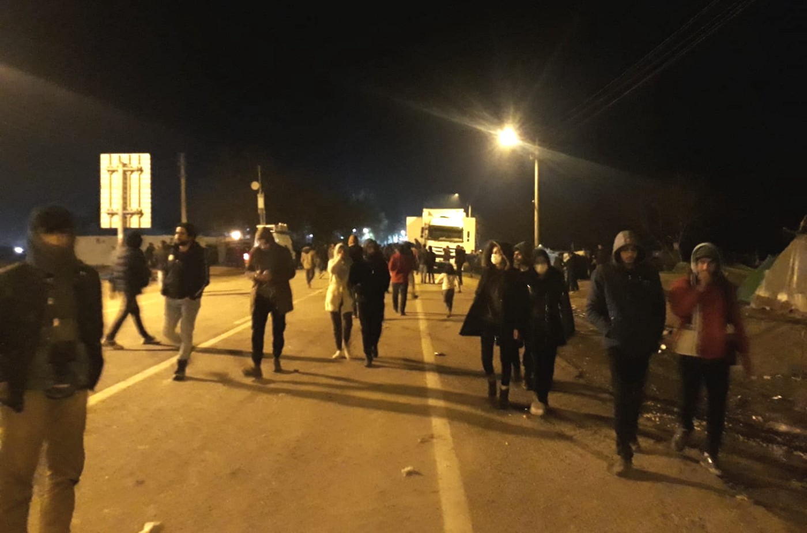
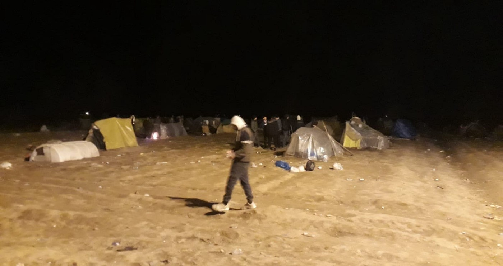
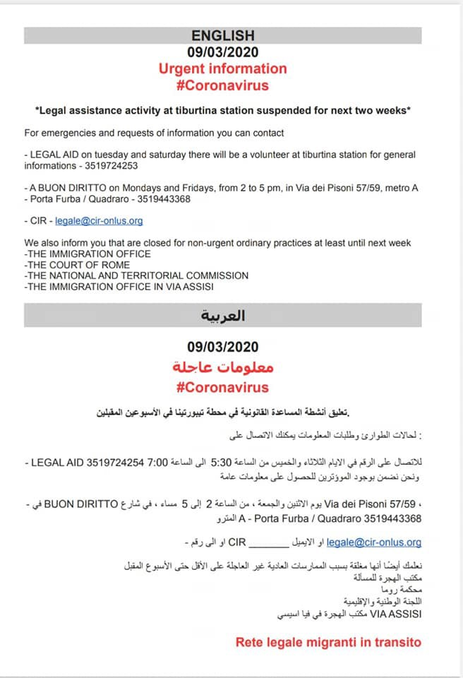
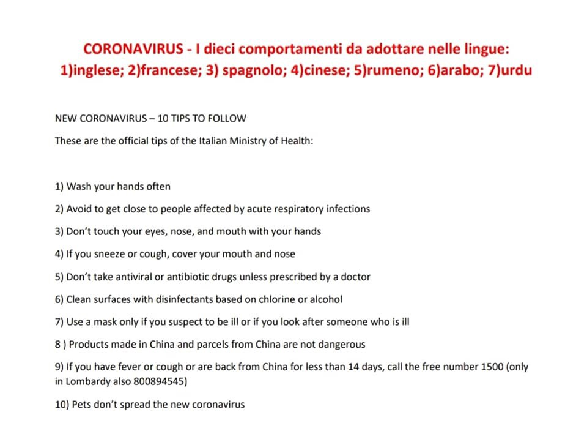
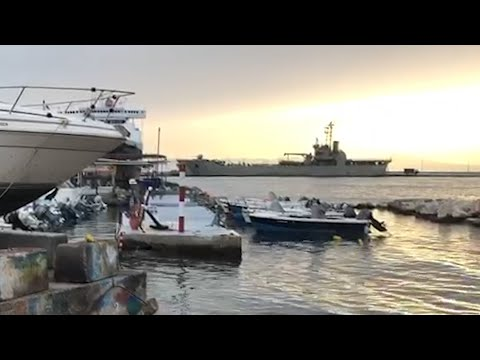

### AYS Daily Digest 11/03/2020: Updates from the ground in Edirne

New aggression between Turkey and Greece // Information on measures against spread of corona in Italy and Greece // Still 500 people held on naval vessel in Greece without access to asylum system and in inhumane conditions // Deportation from Germany to Afghanistan

People are still struggling to understand if and when they are able to exit the camp\. Photo: AYS
### FEATURE I: NEWS FROM EDIRNE CAMP

From different sources we got some insights in what seems to be going on in the camp in Edirne at the Turkish\-Greek border, where approximately 9,000–20,000 people are stuck at the moment\. The camp itself is not accessible for volunteers, as a small AYS team on the ground reports\. Three different checkpoints with police and military police are blocking the way\. It seems to be the goal of the Turkish government to make the lives of the people in the camp even worse and to raise their level of frustration even further\.

> “A journalist from Germany got arrested today by military for the attempt to enter the border camp illegally\. That’s what they gave as a reason\. They caught him when he was standing with refugees outside camp talking to them\. Not while sneaking in or something\. Funny though for questioning and detaining him 4\.5 hrs they took him into the camp\. But they try to keep everyone except refugees as far as possible from the camp \- for that he was already too close\. It's like different security zones\. Not yet sure if we know the full system\. But they also stop volunteers sadly\. \. \. The colleague and I were told that police doesn't let refugees out of camp daily\. I was told every three days they are allowed in border town area \(small part of Edirne only\), the colleague was told once a week\. A third colleague wasn't told anything about that topic yet, so we are in between two numbers", an AYS member on the ground told us when we first talked to them\. 

Our team member explains that the military police confiscated tents that volunteers wanted to distribute in the camp, as many people are without any shelter\. According to the first information, the conditions at the camp are horrendous; many people do not have any tents and got soaking wet when it rained the other night\. There seems to be some kind of food distribution but people have to wait for about four hours until it is their turn\. Toilets are extremely dirty and the overall hygienic situation is described as terrible\.

Many don’t have proper tents, but the military police won’t allow volunteers to distribure them\. Photo: AYS

In addition, rumours are spreading that the borders are closed due to a fear of the corona virus and not due to sheer unwillingness of the European Union to protect the rights of these people that Erdogan is using as an instrument in his sinister game\. As we were told by a high\-rank medical official, due to political complications big international medical organizations are not able to organize interventions in Edirne, and civil society is also blocked from doing so\. We received a report that one person was injured in the hand and the Turkish clinic where he went told him to go to the Greek clinic instead\. As we heard from different sources, the Turkish police seem to encourage people to fight and riot against the Greek border police, which is in turned answering with tear gas and shooting\. It is not clear though if rubber bullets or live ammunition are being used\. Information we received from inside the camp suggested two more death cases among the most vulnerable residents, but we chose not to share details until further proof is available\.

In the meantime aggression between the two long\-time enemies and neighbouring countries of Greece and Turkey is on the rise again\. According to a [Greek news article](http://www.ekathimerini.com/250489/article/ekathimerini/news/turkish-special-forces-officers-fired-over-greek-military-vehicle-at-border-kathimerini-learns?fbclid=IwAR1E_hS9x3Id_jiwbvlzWlwGlvqZRThoiUpmOiibmx0JSNB13Kqbl-HvwyQ) , officers of Turkey’s special forces fired over a Greek military vehicle that had been stationed on the Greek side of the border\. Turkish fighter jets have been flying over the Evros\-border region\. In addition to this, a Turkish speedboat rammed a Greek Coast Guard boat off of the island of Kos on Tuesday evening\.
### FEATURE II: CORONA UPDATES

Various European countries took measures in order to contain and/or slow the spread of the SARS\-CoV\-2 Virus which causes COVID\-19\. These measures also heavily affect the live of refugees and people on the move throughout Europe\. Some updates and information on the situation in Greece and Italy:
### Facilities inside camps shut down for two weeks

In Greece, all schools, youth centers, universities, and education facilities inside and outside of camps are shut down for two weeks, as part of precautionary measures against the spread of the Corona virus\. 
An emergency alert has been sent to mobile phones in both Greek and English\.

In Moria, a Corona Awareness team has been set up in the camp with the support of Stand by Me Lesvos and Waves of Hope\. The team consists of Farsi, Arab, French, Somali and Dari speakers and teachers, pharmacists, and community leaders manage it\. Its main goal is to spread awareness amongst the people in the camp and built up emergency spots\. It closely cooperates with medical emergency teams that have been set up by the Greek organization Katrinos\. They already put handwritten information sheets in Farsi, Arabic, English and French with basic hygienic information up all over the camp\. 
Of course the standard advice is ironic for the people at the camp\. How to keep social distance from each other in a completely overcrowded camp? How to stay at home when the home is nothing but a small tent? How to regularly wash hands when the sanitary infrastructure is not provided? 
On the ‘Refugee — Corona Information Resource’ Facebook page, information is provided in Farsi, English, Arabic and French\.

Giulia from the Still Rise NGO offers insight into how the residents at the camp in Samos and the NGO deal with the situation:

There is no need for panic in Greece at the moment\. **The measures taken are precautionary** , since everybody knows how dramatic an actual pandemic in Greece would be, especially affecting the refugees who live without adequate sanitary infrastructures and access to medical support\.
### All of Italy is under quarantine

Since 10 March the whole of Italy is under quarantine, probably until 3 April\. Travel is banned unless it is certified as justified on professional or health grounds\. Prime Minister Giuseppe Conte has now ordered all shops except for pharmacies and food stores to stay closed until 25 March\. The NGO Medici per I Diritti Umani \(MEDU\) published a Decree of the President of the Council of Ministers with information relevant for refugees and people on the move\.

> ENGLISH: 

> Decree of the President of the Council of Ministers
 

> 03/09/2020
 

> To counter and contain the COVID\-19 virus
 

> 1\) avoid leaving the municipality of residence, if not for work, for situations of necessity or for health reasons
 

> 2\) the Police will increase the controls to control displacements, ask for the general information and the signature of a sheet stating the reasons for the displacement
 

> 3\) those who move from one place to another must carry a self\-certification to explain the reason for the move \(form attached to this message\)
 

> 4\) who has a fever higher than 37\.5 C must stay at home, avoid meeting people and notify their doctor
 

> Renewal of documents:
 

> 1\) The immigration office will be closed until 10 April
 

> 2\) until 10 April 2020, renewals of residence permits are suspended
 

> 3\) until 10 April 2020, the invitations to appear at the court are canceled
 

> 4\) hearings are suspended, therefore it is recommended to contact your lawyer 

> FRENCH: 

> Décret du président du Conseil des ministres
 

> 09/03/2020
 

> Pour contrer et contenir le virus COVID\-19
 

> 1\) éviter de quitter la commune de résidence, sinon pour le travail, pour des situations de nécessité ou pour des raisons de santé
 

> 2\) la police augmentera les contrôles pour contrôler les mouvements, demandera les informations générales et la signature d’une feuille dans laquelle les raisons du mouvement seront indiquées
 

> 3\) ceux qui se déplacent d’un endroit à un autre doivent porter une auto\-certification pour expliquer la raison du déménagement \(formulaire joint à ce message\)
 

> 4\) qui a une fièvre supérieure à 37,5 C doit rester à la maison, éviter de rencontrer des gens et informer son médecin
 

> renouvellement des documents:
 

> 1\) Les Commissariats seront fermés jusqu’au 10 avril
 

> 2\) jusqu’au 10 avril 2020, les renouvellements de permis de séjour sont suspendus
 

> 3\) jusqu’au 10 avril 2020, les invitations à comparaître au Commissariat sont annulées
 

> 4\) les audiences sont suspendues, il est donc recommandé de contacter votre avocat 

Audiofiles of Mandinka and Arabic verison can be provided upon request\.

The Baobab Experience, an association that has been providing support to refugees in Rome since 2015, suspended its legal assistance at the Tiburtina station\. Emergency contacts are provided on their Facebook page \(Baobab 4 Jobs\) \. They also published 10 tips to follow in English, French, Spanish, Chinese, Romanian, Arabic and Urdu\.

copyrights: Baobab 4 Jobs
#### GREECE
### People held at the old port on Kos island, refugees not allowed to ask for asylum

European Commission President Ursula von der Leyen will be traveling to Athens again on Thursday 12 March\. It is anticipated that her visit will focus on the situation of unaccompanied minors, of whom there are about 5500 on the Greek islands at the moment\. It is von der Leyen’s second visit to Athens within 10 days\.

Apparently dozens of people who arrived on the Island of Kos over the last days are being held in an infrastructure in the old port\. About 500 people are still held on board a naval ship without access to the asylum system:

■■■■■■■■■■■■■■ 
> **[PRO ASYL](https://twitter.com/ProAsyl) @ Twitter Says:** 

> > In #Griechenland werden seit Tagen ~500 Geflüchtete auf einem Kriegsschiff festgehalten. Ihnen droht die Abschiebung ohne Asylverfahren. Das ist erschütternd &amp; eine unglaubliche Verletzung der Menschenrechte! Unsere Anwält*innen vor Ort sind aktiv &amp; vertreten einige Betroffene. 

> **Tweeted at [2020-03-11 09:35:50](https://twitter.com/proasyl/status/1237673576750342144).** 

■■■■■■■■■■■■■■ 

Legal Centre Lesvos gives a very shocking account of the situation on board and the legal situation of the people:

> “The Greek government has refused to allow these people to make applications for asylum, and has instead spoken of its plans for their “immediate deportation without registration, where possible, to their countries of origin or transit\.” This is in clear violation of Greece’s regional and international obligations towards migrants, and puts these individuals at grave risk of refoulement\.” 

The report speaks further about the sanitary situation on board:

> “There are only eight portable toilets — five of which were delivered a week after detainees arrived — shared between the whole population\. The toilets do not have running water, toilet paper, or soap\. During the time that people have been detained in the port, the toilets have not been serviced\. The obvious sanitation risk that this poses is exacerbated by the fact there are no showers — meaning that people have not had the opportunity to wash for more than ten days\. In brief, people are not able to wipe themselves after using the toilet, wash their hands, or bathe\. They are detained in conditions that can only be described as a violent assault on human dignity\.” 

A legal basis for the detention is missing, not to speak about the conditions of the detention\. It is recommended to read the full report on their Facebook page: Legal Centre Lesvos\.

See also this video report by Human Rights Watch:

#### GERMANY
### Additional proof against deportations to Afghanistan published

According to the Afghanistan Migrants Advice and Support Organisation \(AMASO\), a flight from Germany to Kabul with an unconfirmed number of deportees is expected to arrive in Kabul this morning\. Just yesterday AMASO also recommended an experts report on the return of Hazaras to Afghanistan, written by Professor William Maley\. In the report, Maley sharply rejects the position that different attacks against Hazaras in the last years could be regarded as isolated acts\. He lists various attacks by the Taliban and ISIS against Hazaras in Afghanistan, also in areas that are often pictured as ‘safe areas’ by western politicians\. He also challenges the claim that through the new agreement between the Trump Administration and the Taliban, the country will be more stable and secure in the future\. He states that:

> “It \[the agreement\] was not, however, a ‘peace agreement’ in any meaningful sense of the term, but rather a withdrawal agreement\. Specifically, the agreement contained no provision for a permanent and comprehensive ceasefire in the country; \[…\] withdrawal provision was not conditioned on any progress being made in intra\-Afghan negotiations, or on any Taliban commitment to protect human rights or democratic processes\. Rather, it was exclusively conditioned on the Taliban honouring Part Two of the agreement which dealt only with preventing the use of ‘the soil of Afghanistan to threaten the security of the United States and its allies’\. The agreement arguably created an incentive for the Taliban to escalate violent attack on Afghan targets as a way of enhancing their bargaining position in any ‘intra\-Afghan negotiations’\. The signing of the agreement, and the withdrawal of US and allied forces for which it provides, is likely to lead to a heightened risk of instability in Afghanistan, which would add to the risks that Hazaras face\.” 

The full article can be found [here](https://amasosite.wordpress.com/2020/03/10/on-the-return-of-hazaras-to-afghanistan-an-expert-report-by-professor-william-maley/?fbclid=IwAR0MYY28fTVWjTEKDnj2rw8uxvri5-G-pgexvNULdUTzRhcwipmk-r3tHnQ) \. It can be used in courts in order to help prove the point that Afghanistan is not a safe place to be returned to\.

**Find daily updates and special reports on our [Medium page](https://medium.com/are-you-syrious) \.**

**If you wish to contribute, either by writing a report or a story, or by joining the info gathering team, please let us know\.**

**We strive to echo correct news from the ground through collaboration and fairness\. Every effort has been made to credit organisations and individuals with regard to the supply of information, video, and photo material \(in cases where the source wanted to be accredited\) \. Please notify us regarding corrections\.**

**If there’s anything you want to share or comment, contact us through Facebook, Twitter or write to: areyousyrious@gmail\.com**

_Converted [Medium Post](https://medium.com/are-you-syrious/ays-daily-digest-11-03-2020-updates-from-the-ground-in-edirne-5af5bc8d25db) by [ZMediumToMarkdown](https://github.com/ZhgChgLi/ZMediumToMarkdown)._
