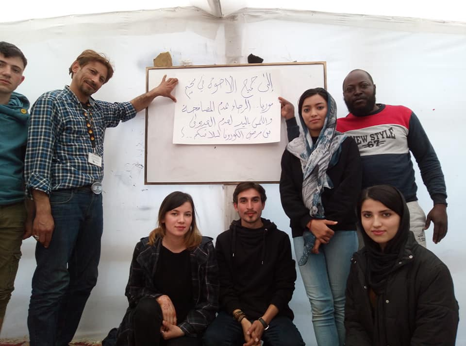

### Daily Digest 12/03/20: Cover\-up of disappearing Vietnamese asylum seekers

Dutch government refusal to support unaccompanied children / fast\-tracking of deportations in Cyrpus / IOMs €2,000 bribe / Frontex operations lack ‘proper legal basis’

](assets/6a306b08c3d2/1*L_J_4VmXmjh80Kx4_uvTsQ.jpeg)

Photo Credit: Jose Gomez [Unsplash](https://unsplash.com/s/photos/children-shadow?utm_source=unsplash&utm_medium=referral&utm_content=creditCopyText)
### Feature:

[Documents obtained by investigative](https://www.vpro.nl/argos/lees/nieuws/2020/vietnamese-children-dissapeared-from-protected-shelters-and-our-government-knew.html?fbclid=IwAR3y7_iCvJZXeERmFLL3Ug9bjyu2bUUaZyPYOU-qe5F9FwZs2KLFpEA9Jb8) journalist network Argos and Lost in Europe show that for over five years, the Dutch government have known that Vietnamese minors have been going missing from protected shelters\.

Dutch healthcare organisation Jade Zorggroep, who was responsible for the management of a protected shelter for underage asylum seekers who were at high risk of becoming human trafficking victims or had already become victims, had routinely reported signs of human smuggling and trafficking of underage Vietnamese girls and their subsequent disappearance from the shelters\.

According to Jade Care Group reports from the second quarter of 2015, shortly after employees of the shelter noticed clear signs of human trafficking; brown suitcases of the same brand, lots of cash, phones without suitcases, four Vietnamese girls went missing\.

In a subsequent quarterly report, the Jade Care Group continued to focus their reporting on the disappearance of Vietnamese minors and reported on the continued presence of people smugglers that even were spotted on the centre’s doorsteps:

> ‘The report describes a particular day when a car drove from the bushes onto the lawn in front of the shelter\. Two girls got in\. It happened so fast that ‘the mentor and neighbour of the care home weren’t able to catch the license plate’\. The license plate of another car did get noted\. In it were three Asian people\. The police even pulled this car over and looked at the navigation system\. ‘In it they saw 2 addresses: of \[location of protected reception centre in the north of Holland\] and Xonar \(the protected reception centre in Limburg, ST\) \.’ 

Despite the continued reporting of the disappearance of minors and the authorities having been previously alerted, statements made by former secular of former Secretary of Justice and Security Mark Harbers claimed that there was no known information suggesting that a network of smugglers was involved in the disappearance of underage Vietnamese migrants\. He further claims that previous investigations into the matter did not prove _‘any punishable acts’_ being committed\.

Following these statements, Habers also stated in subsequent debates within the house of repressive that there was _‘not enough indications for further investigation’ of human trafficking and human smuggling’_ despite the continued publication of quarterly reports from the specialist care organisation in which the girls were taken from and a previous police report that highlighted that _‘human smuggling is apparent’\._

In March of 2019, the entire House of Representatives requested an investigation into the disappearances of Vietnamese children from the protected reception centres\. Throughout this investigation and continuing to present, Vietnamese minors have continued to go missing\. Reports show that in the second quarter of 2019 three Vietnamese boys had gone missing after getting into a taxi to afterschool care\. In August and October, a total of 5 Vietnamese \(three boys and two girls\) disappeared from a shelter in Limburg\. It has been identified that one of the missing Vietnamese boys from Limburg was one of the 39 Vietnamese that were found dead in a refrigerated lorry in Essex, Uk\.
### Greece

Non\-profit [Stand by me Lesvos](https://www.facebook.com/www.standbymelesvos.gr/posts/589982368261456?hc_location=ufi&comment_id=Y29tbWVudDoyNDQ2NzExMTY4ODc5NTc1XzI0NDY3MzM2Njg4NzczMjU%3D) in partnership with Waves of Hope has created a Corona Awareness Team to operate in the Moria Camp\. The team consists of Farsi, Arab, French, Somali and Dari speakers and teachers, pharmacists, with community leaders managing the program\. The team will work in cooperation with Greek organisation Kitrinos and others who set up the medical emergency teams\.

Photo Credit: Stand by me Lesvos

[MSF is calling for the immediate evacuation](https://www.msf.org/urgent-evacuation-squalid-camps-greece-needed-over-covid-19-fears?fbclid=IwAR3uri1nYDcjo-GS8xXgDy5DpbgrWJWgb2xRbfMmuMuKhbDDW_py2CbEPSw) of migrants and asylum seekers in the Greek island camps citing growing concerns over COVID\-19\. The unhygienic and cramped living conditions that people are forced to endure means that the threat of an outbreak amongst the camp population is very real, with MSF criticising the failure to put in place an epidemic response plan\.

Dr Hilde Vochten, MSF’s Medical Coordinator in Greece stated that “In some parts of Moria camp there is just one water tap for every 1,300 people and no soap available\. Families of five or six have to sleep in spaces of no more than 3m2,” further explaining that “This means that recommended measures such as frequent hand washing and social distancing to prevent the spread of the virus are just impossible\.”

Despite the ongoing work of MSF to coordinate actions with the national public health organisation, and to assist with case management for residents and asylum seekers they still affirm that it would be impossible to contain an outbreak in camps such as Lesbos, Chios, Samos, Leros and Kos\.

> MSF stated that there are 42,000 asylum seekers trapped on the five hotspots on the Greek islands\. Whilst the idea of calling for their evacuation during a time of pandemic may seem frightening, forcing people to live in overcrowded camps, unprotected, is negligent\. 

Reports from grassroots organisation indicate that have been instructed to pause all educational indoor activities in the camps\. Activities outdoors \(educational or psychosocial\) can continue in small groups\. Health activities are continuing as normal \(inside\) \. This also goes for things like legal and one on one psychology sessions \(inside\) \. Info sessions have been broken down into smaller groups and are being held outside\. And all NGOs continue to have site access\.

[In a statement shared by the Greek government](http://immigration.gov.gr/documents/20182/66773/egg12540_20200311.pdf/c19fcfc0-4d12-4c94-9159-c5a1d7b96c3f?fbclid=IwAR01QH2JXhqsmDhaCdQae6dO-_mmIGuULM7SITMBAB66AsvGjJBTEYYJfEs) , they announced the closure of all Immigration Services for a month due to the coronavirus

> By order of the Ministry of Immigration and Asylum, the Department of Migration Policy of the Ministry, as well as all Immigration Services of the Decentralized Administrations will be closed to the public from Thursday 12/03/2020 until Friday 10/04/2020, as a precautionary measure against the spread of the coronavirus \(COVID\-19\) \. According to the Ministry’s announcement, all residence permits, residence cards, permanent residence cards and application forms \(blue certificate\) as well as special legal residence certificates expiring within this period will be extended\. What is more, no deportation decisions due to the expiry of a residence permit will be issued during this time period\. Furthermore, those who have entered the country with an entry visa or any other visa, with which they can apply for a residence permit, but are not able to due to these measures, will be able to apply as soon as the services have resumed operations\. 

### The Netherlands

[The Dutch government have again confirmed](https://www.dutchnews.nl/news/2020/03/minister-again-says-no-to-ad-hoc-greece-child-refugee-plea/?fbclid=IwAR246gOvRo4XU1GlUTmsQ4kCuxrAZCBYVZULHcPn7kRuiIlPri3xeHJerKc) their refusal to support vulnerable unaccompanied children being forced to ensure the brutality of the overcrowded and unsanitary conditions of the Greek refugee camps\. Citing past agreements in which they previously accepted 1,750, Dutch officials said they are only prepared to do more if all 26 member states agree to take in their fair share\. Despite the unwillingness by the central government to accept calls from refugee organizations to ‘show leadership and generosity’, the cities of Leiden, Amsterdam and The Hague announced that they are prepared to make beds available if necessary for unaccompanied children\.
### Cyprus

This week [Cyprus has announced](https://www.infomigrants.net/en/post/23364/cyprus-unveils-new-measures-to-curtail-migrant-influx?fbclid=IwAR3vTvub0x7Ze1fj36EHWhOvHWQQJK7avGeK4ia17YN30XCWV9LNCWYk7pI) several new measures to curtail the growing number of migrants within the region\.

Interior Minister Nicos Nouris announced that the Cypriot government will process the asylum claims from individual originating from countries previously deemed ‘safe’ within 10 days, and will have only three days to appeal any immediate deportation orders they are presented with\. These measures of shortened application deadlines and the fast\-tracking of deportations are being supported through the doubling of the number of officers carrying out the vetting process\. In 2019, Cyprus was listed by the EU statistic agency as the highest in terms of filed asylum requests with 3,305 requests per 1 million residents\. As part of its ongoing rehaul of the asylum system, it was also announced that in addition to the new rules, new facilities will also be introduced\. The government announced that a large reception centre with a capacity of 600 people will be built to house people during the processing of their applications, and further claimed that its seeking EU funds to finance the construction of additional facilities\.
### EU

EU Commissioner Ylva Johansson announced today that the IOM will offer migrants on the Greek islands €2,000 \(five times the normal sum offered\) to leave the island and return to their country of origin under the IOMs voluntary returns scheme\. In a speech by the Commissioner following a meeting with the Greek Minister for Migration and Asylum, she announced that this new additional sum provided under voluntary return scheme will be only open for 1 month and be available for people who arrived before the 1st of January\. Whilst tanding with the Greek minister she claimed that:

> ‘we have shown now during the last two weeks that the European Commission and the member states have been able to show a very quick response of solidarity and strength to protect the borders and help people\. so I must say when it comes to migration we are better prepared than in 2015, but we are not well repaired enough\. We are still lacking a common policy for European migration and asylum”\. 

Throughout the press conference, she was notably silent on the ongoing human rights violations occurring at the greek borders despite having previously claimed that she would raise the issue of the ‘black sites’ being used to house migrants and refugees [stating:](https://www.theguardian.com/world/2020/mar/12/greece-warned-by-eu-it-must-uphold-the-right-to-asylum?fbclid=IwAR2TktaWySYjRZPLxoIy2qXDKmawpoC5Qv2thFdNnVPIXxDnHu2f1MkpEQk)

> “These kind of temporary detentions that they have set up — is one of the things I would like to know more about … Of course you can have detention for some period of people that have come, but of course you can’t beat them,” she said\. 

■■■■■■■■■■■■■■ 
> **[EC AV Service](https://twitter.com/EC_AVService) @ Twitter Says:** 

> > 📢 Remarks by Commissioner @[YlvaJohansson](https://twitter.com/YlvaJohansson) in Athens following her meeting with Greek Minister for Migration and Asylum @[nmitarakis](https://twitter.com/nmitarakis)
@[EUHomeAffairs](https://twitter.com/EUHomeAffairs) @[EEAthina](https://twitter.com/EEAthina)  

🎥 Watch the video here ⬇️
[europa.eu/!ny83fm](https://europa.eu/!ny83fm) 

> **Tweeted at [2020-03-12 12:03:17](https://twitter.com/ec_avservice/status/1238073073896652800).** 

■■■■■■■■■■■■■■ 

### Frontex

The recent announcement by Frontex to deploy reinforcements to Evros from March 11th has been deemed by some legal experts as lacking ‘proper legal basis’ due to the previous decision by Greece to suspend the reception of asylum applications for one month\.

Article 80 of Frontex’s own regulation states that it has to operate while respecting European and human rights law\. Simply, Frontexs own stature cannot be fulfilled if migrants cannot apply for asylum\.

The Fundamental Rights Officer for Frontex, who provides independent advice on all fundamental rights matters stated that _“officers deployed by Frontex have to ensure access to asylum procedures of persons in need of international protection”\._

In response to a question put to them by [Euronews,](https://www.euronews.com/2020/03/10/frontex-border-operation-in-greece-lacks-legal-basis-after-greece-suspends-asylum-law?fbclid=IwAR1cK_YomaUVW8MTppyKewrTNucERfdMbHI1jMaBvi4ykwd2NjPJP3G_Kvw) Frontex stated “ _Frontex is not in charge of asylum procedures\. The European Commission is currently in discussions with Greece about this matter\. We continue to refer all asylum requests to national authorities as required by law”\._
### Afghanistan

Yesterday, despite the ongoing instability and deteriorating security situation in the region, 39 asylum seekers arrived back in Afghanistan after being deported from Germany\. Additionally, it’s also been reported that at least 2 Afghan asylum seekers are expected to be deported from Finland on Friday\.
### Bosnia

Local association in Tuzla have questioned the legitimacy of the most recent decision of the mayor to prohibit any food or NFI disruption newly arrived, people\. M [irko Bakramovic](https://www.facebook.com/vijestiztuzle/posts/2818001561582844) , director of the association of the country of children Tuzla posted an open letter on Facebook pleading with the local authorities to reconsider the basis of an order prohibiting the distribution of food and water\. Discussing the order, Bakramovi said that despite the concerns over Covid\-19 international and domestic protection rules for children on the move should still be upheld and followed in Tuzla\.

Grassroots NGO No Name Kitchen is calling for volunteers volunteer staff at Velika Kladuša from the end of March\. They require a minimum 21 days stay for anyone interested or interested\.

### Turkey

Following our reports yesterday on the deployment of two AYS volunteer to the region, we can provide new personal updates from the field\. The two extracts below highlight the continued insecurity within the region, the growing police presence and the vulnerability of all people who are currently stuck there\.

Volunteer 1:
“We went distributing donations where we were yesterday and clicked some photos from people with backside and donations\. Suddenly police in everyday clothes asked for my passport, passport of the Turkish volunteer with me and the refugee next to us\. It took ages for checking my passport\. Later they checked passports of volunteers and told them to stop distributing donations\. Suddenly it’s illegal\.”

Volunteer 2:
“Turkish police just came to my hotel and took all Arabs with them\. Hotel guy is saying they are doing this all over Edirne at the moment\. So if you know anyone please warn them\!”

Additionally, we have been asked to warn people of a number of false information being shared regarding the current situation, and to remind people to only share information from trusted sources\.

**Find daily updates and special reports on our [Medium page](https://medium.com/are-you-syrious) \.**

**If you wish to contribute, either by writing a report or a story, or by joining the info gathering team, please let us know\.**

**We strive to echo correct news from the ground through collaboration and fairness\. Every effort has been made to credit organisations and individuals with regard to the supply of information, video, and photo material \(in cases where the source wanted to be accredited\) \. Please notify us regarding corrections\.**

**If there’s anything you want to share or comment, contact us through Facebook, Twitter or write to: areyousyrious@gmail\.com**

_Converted [Medium Post](https://areyousyrious.medium.com/daily-digest-12-03-20-coverup-of-disappearing-vietnamese-asylum-seekers-6a306b08c3d2) by [ZMediumToMarkdown](https://github.com/ZhgChgLi/ZMediumToMarkdown)._
