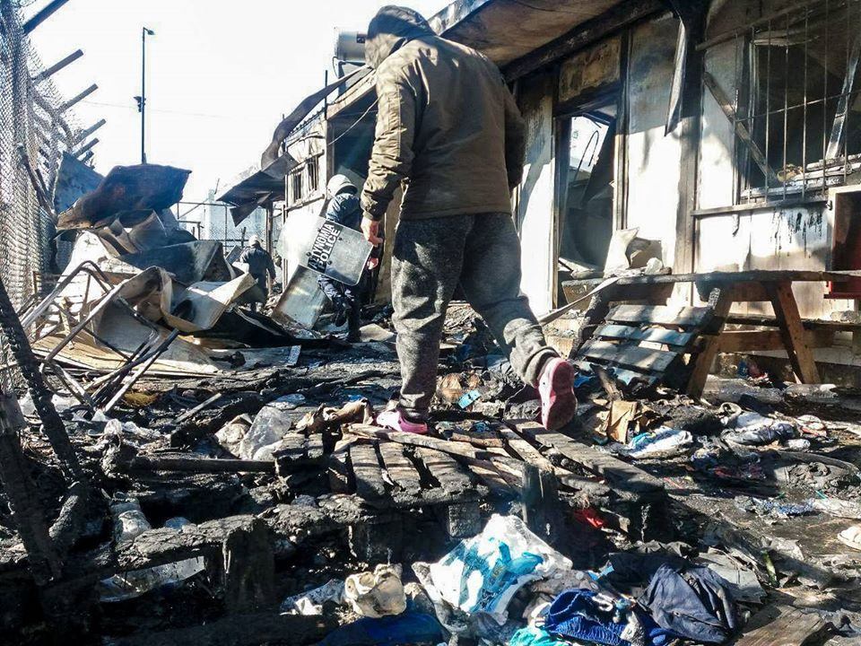

### AYS Daily Digest 17/03/2020 Greek Gov\. announces COVID\-19 measures for camps

_49 people returned to Libya after reaching Maltese waters // emergency shelters will be provided in the Netherlands // measures to restrict movement of refugees in Serbia // and more…_

 that broke out in Moria on Sunday, which killed one child, might be a gas cooking stove, state firefighters\. Authorities are still investigating\. Photos by [Refocus Media Labs](https://www.facebook.com/OHFLesvos/posts/887825988327958?hc_location=ufi)](assets/df0355f7541/1*N-eA8OzBe51Buxxd5EbNVA.jpeg)

[The cause of the fire](http://www.ekathimerini.com/250715/article/ekathimerini/news/cooker-seen-behind-deadly-blaze-at-moria-camp?fbclid=IwAR0BtkiJd6JdTBPUJgdWVoXLQk91bE58VyBOgoc7ChzpuzUdrnZS_F9gqV0) that broke out in Moria on Sunday, which killed one child, might be a gas cooking stove, state firefighters\. Authorities are still investigating\. Photos by [Refocus Media Labs](https://www.facebook.com/OHFLesvos/posts/887825988327958?hc_location=ufi)
#### FEATURE
### The Greek government announced on Tuesday the measures it’s taking to stop the outbreak of COVID\-19 in camps:

1\) [All new arrivals](https://greece.greekreporter.com/2020/03/17/greece-adopts-emergency-measures-to-prevent-coronavirus-outbreak-in-migrant-camps/) will have mandatory health checks

2\) The camps will be receiving two daily updates with instructions “announced in English, French, Greek, Arabic, Farsi and any other languages that are understood by the residents of each of the facilities\.”

3\) All visits by individuals or organizations and entities will be suspended for at least fourteen days from Tuesday

4\) Entry will only be permitted into the camps to carry out authorized work

5\) All informal educational activities and all indoor activities usually offered to camp residents will be suspended

6\) People will only be allowed to leave the camp “in an organized and timely manner between 7 o’clock in the morning and 7 o’clock in the evening”

7\) More medical facilities will be set up in the camps

 [\#refugee](https://www.facebook.com/hashtag/refugee?epa=HASHTAG) [\#camp](https://www.facebook.com/hashtag/camp?epa=HASHTAG) in [\#mytilini](https://www.facebook.com/hashtag/mytilini?epa=HASHTAG) on [\#Lesvos](https://www.facebook.com/hashtag/lesvos?epa=HASHTAG) But today is last of any [\#freedomofmovement](https://www.facebook.com/hashtag/freedomofmovement?epa=HASHTAG) with only essential staff allowed to enter and just one member per family allowed to leave under police escort from 7am\-7pm\. [\#Greece](https://www.facebook.com/hashtag/greece?epa=HASHTAG) has now officially locked down to all non\-EU citizens, yet still no preventive measures put in action to protect [\#asylumseekers](https://www.facebook.com/hashtag/asylumseekers?epa=HASHTAG) from [\#covid\_19](https://www.facebook.com/hashtag/covid_19?epa=HASHTAG) 
Photo: student of @refocusmedialabs” Decription by [Douglas Herman](https://www.facebook.com/photo.php?fbid=10157871027625813&set=p.10157871027625813&type=3&theater)](assets/df0355f7541/1*m6AZScccluIuSaYMdtWiTw.jpeg)

“ Any Given Tuesday on food line in [\#Moria](https://www.facebook.com/hashtag/moria?epa=HASHTAG) [\#refugee](https://www.facebook.com/hashtag/refugee?epa=HASHTAG) [\#camp](https://www.facebook.com/hashtag/camp?epa=HASHTAG) in [\#mytilini](https://www.facebook.com/hashtag/mytilini?epa=HASHTAG) on [\#Lesvos](https://www.facebook.com/hashtag/lesvos?epa=HASHTAG) But today is last of any [\#freedomofmovement](https://www.facebook.com/hashtag/freedomofmovement?epa=HASHTAG) with only essential staff allowed to enter and just one member per family allowed to leave under police escort from 7am\-7pm\. [\#Greece](https://www.facebook.com/hashtag/greece?epa=HASHTAG) has now officially locked down to all non\-EU citizens, yet still no preventive measures put in action to protect [\#asylumseekers](https://www.facebook.com/hashtag/asylumseekers?epa=HASHTAG) from [\#covid\_19](https://www.facebook.com/hashtag/covid_19?epa=HASHTAG) 
Photo: student of @refocusmedialabs” Decription by [Douglas Herman](https://www.facebook.com/photo.php?fbid=10157871027625813&set=p.10157871027625813&type=3&theater)

In an update after the fire and in response to the Greek government’s announcment, [One Happy Family Community Centre](https://www.facebook.com/OHFLesvos/posts/887825988327958?hc_location=ufi) said:

> “Today, instead of evacuating the enormously overcrowded camps on the aegean Islands, the Ministry of Migration announced, that they will put the camps on lockdown\. People will be forced to stay within the camp with nowhere to go\. In a camp, which described as one of the worst refugee camps in the world\. In a camp where basic human rights are not granted, where humanitarian standards are not even close to be met and where the physical and psychological wellbeing, the safety and security of everyone is in danger\. Ekatherimi reports, that ‘Camp residents will \[…\] be discouraged from venturing outside the facilities — even for getting supplies’” 

[So far](https://www.infomigrants.net/en/post/23496/greek-islands-migrant-camps-new-restrictions-to-contain-coronavirus?fbclid=IwAR2ZsENFsUTSX8AjGmRjZi4uiL_lC2eq8lBV4h0_xWg2l8vL80ykB8hAxUk) there aren’t any reported cases of COVID\-19 in any of the camps on the islands, but many fear that it is only a matter of time due to the severe lack of access to sanitation and overcrowding\. Last week, Doctor’s Without Borders urged for immediate evacuation of the camps\.

■■■■■■■■■■■■■■ 
> **[RSA](https://twitter.com/rspaegean) @ Twitter Says:** 

> > According to media, the municipality of #Kos have put an information stand in front of the hotspot in #Pyli telling to the #refugeesgr that they cannot go to the village or elsewhere + that they have to harmonize themselves with the protection measures announced against #COVID19 

> **Tweeted at [2020-03-17 22:08:43](https://twitter.com/rspaegean/status/1240037374333157378).** 

■■■■■■■■■■■■■■ 

#### GREECE

Human Rights Watch published their new report and findings about state violence against refugees and asylum seekers on the Greek\-Turkish border\. They emphasize that **_“Greek security forces and unidentified armed men at the Greece\-Turkey land border have detained, assaulted, sexually assaulted, robbed, and stripped asylum seekers and migrants, then forced them back to Turkey”_** while receiving praise and funds from the EU\.

> “The European Union is hiding behind a shield of Greek security force abuse instead of helping Greece protect asylum seekers and relocate them safely throughout the EU,” said [Nadia Hardman](https://www.hrw.org/about/people/nadia-hardman) , refugee rights researcher and advocate at Human Rights Watch\. “The EU should protect people in need rather than support forces who beat, rob, strip, and dump asylum seekers and migrants back across the river\.” 

HRW makes clear that Greece should immediately reverse its [March 1 decision](https://www.hrw.org/news/2020/03/10/greece/eu-allow-new-arrivals-claim-asylum) , which included suspending access to asylum for people for one month and deporting anyone entering\. The Greek Parliament and Frontex need to monitor and investigate any state acts of violence on the border\.

 ; Photo by © 2020 Belal Khaled](assets/df0355f7541/1*YEYJZoeOB3FhIDs3GcMKHA.jpeg)

“An asylum seeker in northern Turkey at the Greek border on March 6 shows injuries he says Greek security forces inflicted after he had crossed the Evros River into Greece\.” Quote by [HRW](https://www.hrw.org/news/2020/03/17/greece-violence-against-asylum-seekers-border?fbclid=IwAR2dQryoANtz-ySu2SuSYRjRbXj59Eu-SkJIew8rLsMufGidYYkzaED03lc#) ; Photo by © 2020 Belal Khaled

**HRW found these examples of state violence from the 21 asylum seekers they interviewed between March 7th and 9th, who tried to enter Greece after Turkey’s announcement of no longer controlling the border on February 27th:**

→ “The Greek government reinforced its border with police, army, and special forces, which fired teargas and [reportedly](https://www.nytimes.com/2020/03/02/world/europe/migrant-death-greece.html?auth=login-google) rubber bullets at people who approached the Pazarkule crossing\. Two asylum seekers who spoke to Human Rights Watch said that Greek security forces also used live fire to push people back\. One of these people, interviewed in a hospital where he was getting treatment, said he was shot in the leg\.”

→ All those interviewed said that everyone in every migration group was intercepted by law enforcement or even people in civilian clothes who detained them in “official or informal detention centers, or on the roadside, and stole their money, mobile phones, and bags before summarily pushing them back to Turkey\.”

→ “Seventeen described how the men assaulted them and others, including women and children, through electric shocks, beating with wooden or metal rods, prolonged beating of the soles of feet, punching, kicking, and stomping\.”

→ One interviewee detailed a **sexual assault** “They \[Greek security forces\] tried to search my wife and touched her breasts\. Then they tried to take off her headscarf and her trousers\. When I tried to stop them, they beat me really badly with their fists, feet, a heavy plastic rod, and a metal stick\. They hit my 2\-year\-old daughter with a heavy plastic stick on the head so that she still has a bruise\.” Human Rights Watch saw this bruise on her head\.

→ “In most cases, the interviewees, said that armed men stripped them down to their underwear, including some women, and forced them across the Evros river back to Turkey\. Many said that they were passed between various groups, suggesting coordination between police or soldiers and the unidentified men\.”

Read the full report [here](https://www.hrw.org/news/2020/03/17/greece-violence-against-asylum-seekers-border?fbclid=IwAR2dQryoANtz-ySu2SuSYRjRbXj59Eu-SkJIew8rLsMufGidYYkzaED03lc#) \.

According to the **The Council of Europe’s European Committee for the Prevention of Torture \(CPT\)** , they have _“just completed a five\-day rapid reaction visit to Greece to examine the way in which persons attempting to enter the country and apprehended by the Hellenic Police or Coast Guard have been treated, notably since 1 March 2020, when inter alia the processing of asylum requests was suspended\. The visit took place between 13 and 17 March 2020\.”_ Preliminary findings will be announced _“shortly\.”_
#### MALTA

On Sunday, a boat with [49 people](https://euobserver.com/migration/147768?fbclid=IwAR1fIl8SuMI-0VwOYAYjfD1ecvuJEc-1AFlPtbpGhusK2Su3_16SHaqyTlU) was returned to Libya by the Libyan Coast Guard after reaching Maltese waters, a clear breach in International Law\. When the boat became stranded due to engine failure, Malta supposedly did nothing while the LCG picked them up\. [Safa Msehli](https://www.theguardian.com/world/2020/mar/17/migration-un-agency-decries-return-of-boat-with-49-people-to-libya?fbclid=IwAR1YMcBXoAbgKhkXT-TuYrGib12pyXMi87ot1TQU_MK4ImZp_CoEy1jTfXc) from IOM said:

> “Libya is not a safe port and that is recognised by the UN and other European states\. The return of people from Maltese waters — of which we have **confirmation from various sources** — is a breach of international law and we would like to remind states of their responsibility towards vulnerable people that are fleeing abuse and violence in Libya\.” 

The LCG has returned at least 2,500 people to it’s shores since the start of 2020\. They returned to civil war, probable detention and trafficking\. [The EU](https://www.theguardian.com/world/2020/mar/17/migration-un-agency-decries-return-of-boat-with-49-people-to-libya?fbclid=IwAR1YMcBXoAbgKhkXT-TuYrGib12pyXMi87ot1TQU_MK4ImZp_CoEy1jTfXc) needs to set up a mechanism where people rescued at sea are able to safely and quickly disembark in the EU and apply for asylum\. It’s a matter of life or death/torture\.
#### SERBIA

The [new government order](https://balkaninsight.com/2020/03/17/serbia-restricts-movement-for-migrants-asylum-seekers/?fbclid=IwAR31dcb-qosfJo2f3GFynlKwdv8xXeQLvizZxqjzTah8EL4IRGVHDz95is8) on Monday severely restricting the movement of refugees in asylum centers \(they can only go out if they have special permission, like to see a doctor\):

> “In order to protect against the spread of infectious diseases on the territory of the Republic of Serbia, to prevent the uncontrolled movement of persons who may be carriers of viruses and arbitrarily leave asylum centres and reception centres, the movement of asylum\-seekers and irregular migrants housed in asylum centres and reception centres in the Republic of Serbia is temporarily restricted and enhanced surveillance and security of these facilities is in place\.” 

There are no restrictions on citizens’ movements as of yet\.
#### GERMANY

In a press briefing on Tuesday, UNHCR spokesman Andrej Mahecic said:

> “As of this morning, we understand there are 10 confirmed cases in Germany…who are either refugees or asylum seekers\.” 

The cases are in Munich, Berlin and Heidelberg\. He emphasized that the authorities need to treat refugees with COVID\-19 the same as they would treat their country’s citizenry\. These are the only confirmed cases at the time of this writing, but it must be said that many more refugees will get sick as the number of cases of the general population also increases\. This is all the information news organizations seem to have on the cases right now, but AYS will certainly keep following this news\.
#### THE NETHERLANDS

In a clarification since Sunday’s announcement that asylum seekers arriving in the Netherlands would not be registered with official camps due to COVID\-19 fears, the government is now saying that emergency accommodation will be provided to new comers\. These shelters will most likely be tents and marqees\. The location of the emergency shelters has not been made public as of this writing\. More [here](https://www.dutchnews.nl/news/2020/03/new-asylum-seekers-will-be-put-up-in-tents-justice-ministry-officials-say/?fbclid=IwAR2x-aYNjiBn0hZK2IpvNuJmZvRJrBS5gA28zRBZWxBGafQ6qHdNWfOw0p0) \.
#### THE EU

The scheduled transfers of many child refugees from living in camps where they are extremely vulnerable will be hindering by EU border closings\. Many countries agreed to take unaccompanied minors form Greece following the outcry at the Turkish border last week\. Afshan Khan, Special Coordinator for the Refugee and Migrant response in Europe said:

> “The temporary shutdown of cross\-border movement within the EU will inevitably impact when and how vulnerable children in Greece are relocated to Germany, Finland and other states…\(countries should explore\) all possible measures to expedite the transfer of these children, so they can begin moving as soon as the borders reopen”\. 

**Find daily updates and special reports on our [Medium page](https://medium.com/are-you-syrious) \.**

**If you wish to contribute, either by writing a report or a story, or by joining the info gathering team, please let us know\.**

**We strive to echo correct news from the ground through collaboration and fairness\. Every effort has been made to credit organisations and individuals with regard to the supply of information, video, and photo material \(in cases where the source wanted to be accredited\) \. Please notify us regarding corrections\.**

**If there’s anything you want to share or comment, contact us through Facebook, Twitter or write to: areyousyrious@gmail\.com**

_Converted [Medium Post](https://medium.com/are-you-syrious/ays-daily-digest-17-03-2020-greek-gov-announces-covid-19-measures-for-camps-df0355f7541) by [ZMediumToMarkdown](https://github.com/ZhgChgLi/ZMediumToMarkdown)._
