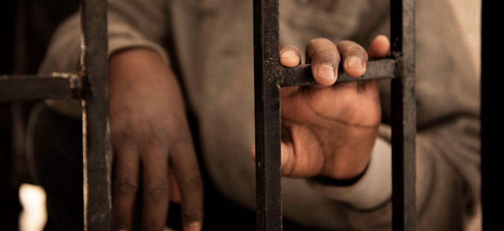
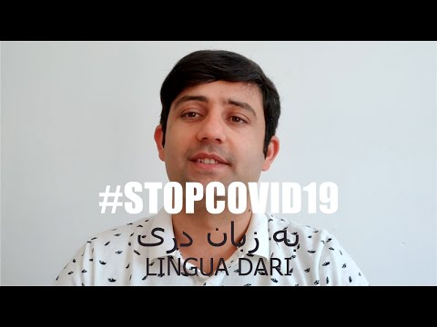

### AYS DAILY DIGEST 20/03/20: 85% of Libyan arrivals subjected to Torture\.

MEDU report into the torture of Libyan refugees // Sweden to continue deportations to Afghanistan // First\-hand accounts from Serbia’s state of emergency

### Feature

A recent report from [Doctors For Human Rights \(MEDU\)](https://mediciperidirittiumani.org/en/29831/) on the treatment of more than 3,000 migrants and refugees who had reached Italy from Libya between the years of 2014 and 2020 found that 85% had been subjected to torture in Libya\.

Exposing the brutal reality of the treatment of these refugees and the injustice of the international community’s cooperation with the Libyan authorities, the report finds: 
\- that 85% of those migrants and refugees had been subjected to “ _torture, violence and inhumane and degrading treatment_ ”
\- Two\-thirds had reportedly been detained 
\- Almost 50% had been kidnapped or nearly died 
\- Nine out of ten said they had watched someone die, be killed, or tortured
\- and a high number of people had been subjected to forced labour or slavery for months or years\.

](assets/7342fbf7914e/1*2lU6svZ2S8cIpMVXlTBX3A.png)

[https://mediciperidirittiumani\.org/medu/wp\-content/uploads/2020/03/ing\_maps\_web\-3\.pdf](https://mediciperidirittiumani.org/medu/wp-content/uploads/2020/03/ing_maps_web-3.pdf)

In July 2019, the UN called on the EU to stop migrant returns to Libya, with Dominik Bartsch, the German head of the UNHCR, stating that:

> “People rescued by the Libyan coastguard in the Mediterranean should, under no circumstances, be brought back to the detention camps in Libya’\. 

> When describing the life for refugees in Libya he continued by stating ‘The humanitarian situation of the people in the camps is devastating…There is a lack of food, water and many urgently need medical help\. In addition, the detention camps in the capital Tripoli are caught in the crossfire of the armed groups\.” 

Despite the growing evidence of the appalling treatment that refugees from Libya face, organisations such as Frontex, the Maltese search and rescue coordinators RCC and the so\-called ‘Libyan Coast Guard’ have [consistently been accused](https://www.infomigrants.net/en/post/23448/over-400-migrants-returned-to-libya-over-weekend) of working together to push back migrants attempting to cross the Mediterranean\. In a press release this month by NGO Alarm Phone, they allege that the Maltese RCC coordinated with Frontex to abduct and push back 49 migrants from the European search and rescue \(SAR\) zones — a grave violation of international law and the principle of non\-refoulement\.

The [European Commission](https://euobserver.com/migration/145369) has dismissed all previous calls from the international community to halt the return to Libya of people ‘rescued at sea’\. The European Commission, who provides assistance with the funding of the so\-called ‘Libyan Coast Guard’ through its $45million Emergency Trust Fund for Africa said it is up to Libyans to rescue people within their own territorial waters “as we have no access”\.
### Sweden

[Despite the unprecedented](https://tidningensyre.se/2020/19-mars/ingen-tillats-resa-forutom-till-afghanistan/) travel ban into the EU and Schengen zone, with further restrictions on free movement being progressively enacted across the globe, the Swedish Migration agency appears to be continuing with their programme of deportations to Afghanistan\.

The Ministry of Foreign Affairs is advising against all unnecessary travel abroad stating:

> **“Due to the widespread of the new coronavirus and the rapidly changing and uncertain situation that exists for travellers, the Ministry of Foreign Affairs discourages unnecessary travel to all countries”\.** This travel advice by the government is seemingly not applicable if you are an asylum seeker\. 

In a press email sent to Syre, the migration board wrote:

> “The Swedish Migration Board works with self\-return, and that work continues as far as possible\. The work is affected by cancelled trips and fewer available transports, but the authority has not stopped the return”\. 

Yesterday morning the Migration Agency sent a text to a rejected asylum seeker\.

> “ **Hi, your trip is booked from Copenhagen to Kabul via Dubai on March 23, 2020\. You will come to Agnesfridsvägen 111 in Malmö at\. 11\.30\. You are allowed to bring 30 kilos in luggage\. Yours sincerely, /the name of the officer/, the Migration Agency”** , the message said\. 

It is as yet unclear whether the deportation orders will be able to be fulfilled, as the Afghan authorities have said that in order to stop the coronavirus they will refuse entry to their country to anyone coming from Europe\. A recent police statement echoed this claim and stated that it will be more difficult to carry out deportations both because of the limited flight schedule and a growing list of countries which are refusing to accept the return of their citizens from Europe and Sweden, citing concerns over the coronavirus\.

The migration agency has refused to answer any questions regarding the text message sent and has referred all media questions to their official press service\.
### Serbia

First\-hand accounts emerging from Serbia are highlighting how the current state of emergency is being used to continue the discriminatory targeting and harassment of refugees and asylum seekers\.

It was reported that today the Ministry of Internal Affairs of Serbia accosted a group of migrants who had arrived in Belgrade, clearly unaware of the state of emergency or the government measures that have been put in place\. Without any translator present, the eight young people were pinned against the wall with their hands raised, as if they had been caught carrying out a bank robbery\. In addition to the targeting of the migrants, a young student described in the first\-hand account as ‘dark\-skinned’ was pulled from a nearby self\-service shop and forced to join the lineup\. Even though the student explained to the police in Serbian that he was a student, it still did not deter the MoI team from targeting him\.

■■■■■■■■■■■■■■ 
> **[Miloje Stronky](https://twitter.com/helmutdukadam86) @ Twitter Says:** 

> > 1.Danas sam bio svedok nepotrebno brutalne, diskriminatorne akcije MUPSrbije protiv grupe migranata koja je stigla u Beograd, koja ne zna sta je vanredno stanje ni sta su mere Vlade. Bez prevodioca/kulturnog medijatora 8 mladih ljudi je ponizavajuce drzano prislonjeno uza zid... 

> **Tweeted at [2020-03-20 18:36:55](https://twitter.com/gordanpaunovic/status/1241071235372593153).** 

■■■■■■■■■■■■■■ 

### Greece

The cause of the tragic fire that destroyed the One Happy Family centre has been identified\. Lesvosnews reports that after an investigation by the Mytilene Security Subdivision, with the assistance of the Department for Collection and Management of Information of the North Sea General Regional Police Directorate, three people have been identified and criminal charges have been filed against them\.

[Human rights watch](https://www.hrw.org/news/2020/03/20/greece-grant-asylum-access-new-arrivals?fbclid=IwAR1CwviWJvy_rF30PH9nuvNJcesEyh-jXpYmXqGapi2D0ei0w_jMBVB4YtY) has confirmed today that between March 1st and 18th, the Greek authorities denied the right to seek asylum to at least 625 people who had arrived on the island of Lesbos\. Of these 625, the authorities are detaining 189 of the new arrivals in unacceptable conditions with HRW claiming that:

> “For up to two weeks, the authorities have been holding women, men, and children — many of them fleeing war and persecution — in the open in cold temperatures, denying their right to seek asylum and preventing them from getting the humanitarian and legal assistance they need and are entitled to,” 

Belkis Willie, senior crisis and conflict research at HRW affirmed that:

> “Greece may be facing challenges on many fronts, from the coronavirus to a surge in arrivals, but it does not mean it can suspend fundamental rights or humane treatment\.” 

Today’s report highlighted that since March 17th, when it announced that as part of its response to the COVID\-19 virus it would transfer those in detention and others who had arrived on the island after March 1st to the mainland, the Greek authorities are continuing to restrict the movement of migrants and keep guard over them in _de facto_ detention in inhumane conditions\.

Citing first\-hand accounts of humanitarian aid workers on the island, HRW reports that:

> “A group of 42 people, including at least 15 children, arrived by boat on Lesbos on March 5 in an area called Aghios Dimitrios\. As of March 19, the Greek Coast Guard and police were still detaining them there, in the garden of a nearby chapel…\. Witnesses said that authorities provided the new arrivals with two large tents, but that there was not enough room for the whole group to sleep inside\. The witnesses did not see any toilets, showers, or even access to running water”\. 

Refugee Support Aegean has produced two timelines:
\- The first timeline focuses on a series of key developments in relation to the Greek authorities’ approach vis\-à\-vis the decongestion of the refugee camps on the Aegean islands, the creation of closed facilities and the responses of the island’s residents, including a series of protests\. 
\- The second is a timeline of the spate of attacks against volunteers, members of humanitarian organizations, journalists and shelters on the Eastern Aegean islands in late February and March 2020\.

Both timelines are recommended for anyone interested in gaining a chronological overview of the policy decisions by the Greek authorities or the continued attacks on humanitarian organisations\.

### Italy

The non\-profit organisation APS Cambalache has set out to assist some of the 300,000 refugees and migrants currently in Italy by providing them with language assistance and a chance to connect to other people during the current coronavirus outbreak\. Many of the refugees and asylum seekers do not speak Italian, so to address this growing knowledge gap within this community on what to do during the outbreak, the organisation is providing essential information in different languages and by giving them a chance to connect to other people\. Through the campaign \#NONSEISOLO \(‘You are not alone’\), infographics and videos will be shared addressing issues such as: S _hould I avoid shaking hands? What do I do if I have been in contact with a person who is infected? How can I cope with stress?_

Ilaria Leccardi, who works for APS Cambalache said “We wanted a campaign to help them in this difficult period because a lot of them don’t know what they have to do,”

In addition to APS Cambalache, a number of other organisations have developed services to help the refugee and migrant community in Italy during this period\. Il Grande Colibri, an NGO that supports LGBTI\+ refugees and migrants, and NGOs Camera a Sud and Arca di Noe have also developed video material\.

These organisations have also identified that these communities also need other support mechanisms and networks and so have set up multilingual telephone services or WhatsApp accounts to answer any questions individuals may have\.

> “Many are isolated due to xenophobia and growing homophobia, and our meetings represent an important moment to build and maintain interpersonal bonds,” — Ginevra Campaini, executive board member of the volunteer association Grande Colibri speaking to Thomson Reuters\. 

For APS Camblache this service is available through Monday — Friday from 11 am — 1 pm in Italian, English and French\. The number is \( **\+39\)** **351 0901647\.**

To find a list of available videos please visit: [https://www\.arcacoop\.com/stopcovid19\-campagna\-multilingue](https://www.arcacoop.com/stopcovid19-campagna-multilingue)
### Sea

Aegean Boat Report are reporting that the transfer of 1,513 people will occur on Friday 20th and Saturday 21st\. Of these, 794 people will be taken to the Klidi site in Sintiki Sèrres in northern Greece, and 719 will be taken to Malakasa, north of Athens\. In total over 2,000 people, many of them children will be locked up behind barbed wire until they are deported to their countries of origin

The [forced removal](http://www.ekathimerini.com/250864/article/ekathimerini/news/another-604-migrants-bound-for-deportation-to-be-transferred-to-the-mainland?fbclid=IwAR08LCdZlBUB8vOTu3XUiTFK1P0gME1kY738zdpY5DRy2nzvO-G66eBef0s) of refugees and asylums seekers from the Greek island to the mainland is becoming commonplace\. On Saturday 14th, 500 people who had arrived after March 1st and were being detained on Lesvos had their right to seek asylum denied and were transported to the detention centre in Malakasa to await deportation\.

**Find daily updates and special reports on our [Medium page](https://medium.com/are-you-syrious) \.**

**If you wish to contribute, either by writing a report or a story, or by joining the info gathering team, please let us know\.**

**We strive to echo correct news from the ground through collaboration and fairness\. Every effort has been made to credit organisations and individuals with regard to the supply of information, video, and photo material \(in cases where the source wanted to be accredited\) \. Please notify us regarding corrections\.**

**If there’s anything you want to share or comment, contact us through Facebook, Twitter or write to: areyousyrious@gmail\.com**

_Converted [Medium Post](https://medium.com/are-you-syrious/ays-daily-digest-20-03-20-85-of-libyan-arrivals-subjected-to-torture-7342fbf7914e) by [ZMediumToMarkdown](https://github.com/ZhgChgLi/ZMediumToMarkdown)._
