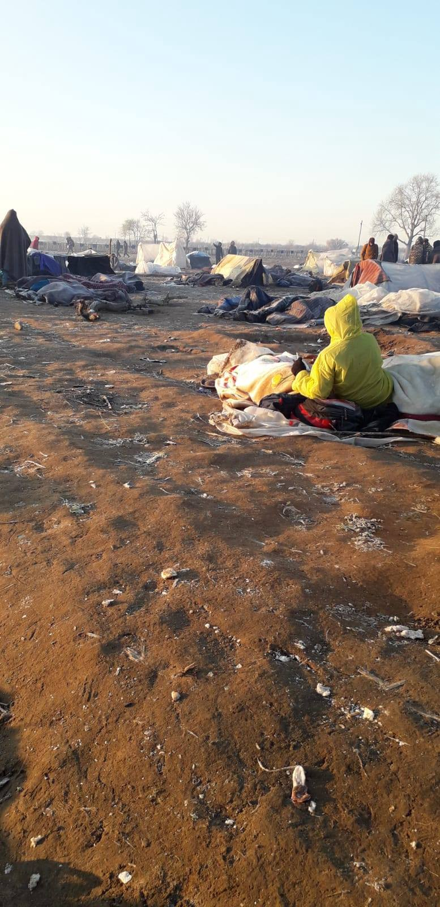
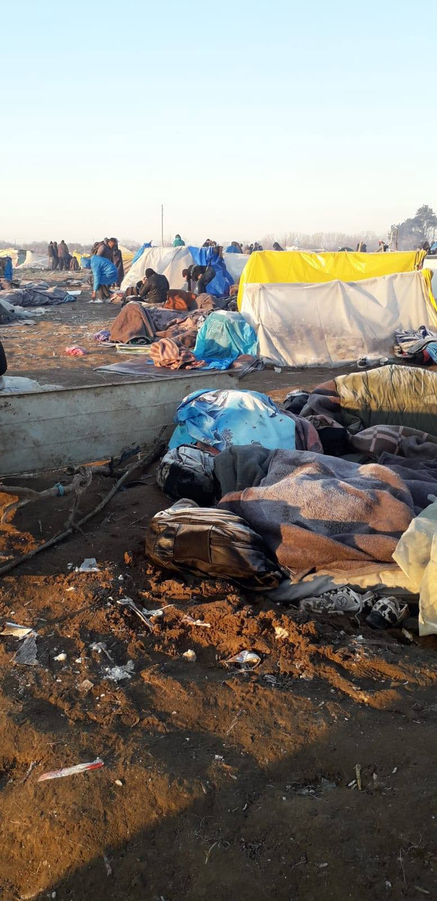
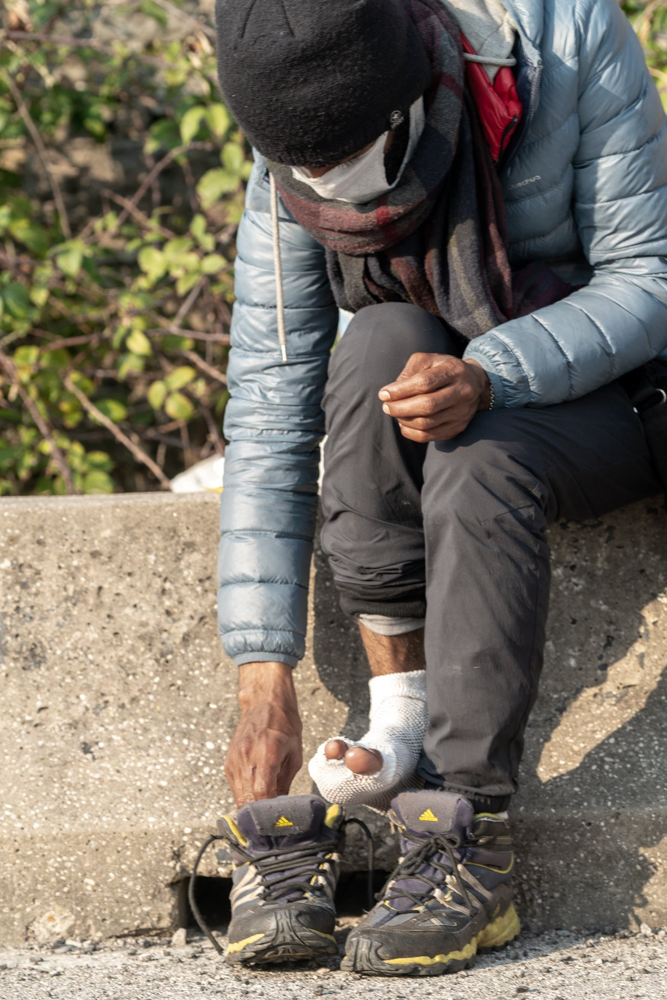

### AYS Weekend Digest 21–22/3/2020 France: More people in detention despite pandemic measures

Greece in total lockdown from Monday 23rd\. Report from Turkish/Bulgarian border\. Concerns over healthcare access for people on the move in Bosnia\. Police chase homeless people in Brussels\.

![On Sunday morning a 5\.3 magnitude earthquake hit Zagreb, causing widespread damage and the evacuation of hospitals\. A 15\-year\-old is in a critical condition and 16 others were injured as a result of the quake\. More tremors followed and are still shaking the earth\. This is a message from AYS: “Dear friends, we hope everyone is ok after this morning’s earthquake\.
Please, be mindful about the security measures regarding coronavirus NOW more than ever\.
Also, you might receive different messages and information that might not be true\. The only correct information about the earthquake and coronavirus will come from [THIS](https://civilna-zastita.gov.hr/vijesti/vijesti/poziv-gradjanima/2284?fbclid=IwAR2obWGj1Ko5OXXwx6KteO4F8YmLraR2aLn2ZqmK9srSeeTvpmUhDOMvl_Q) and [THIS](https://www.koronavirus.hr/) source\. If you have friends who are seeking asylum in Croatia or have protection status in the country, they can join [Asylum Croatia](https://www.facebook.com/groups/1590635127930744/) , a platform for sharing information on the situation\. Be aware, keep updated, remain patient and stay safe to the best of your ability\! \(Photo by [Branimir Balogović](https://unsplash.com/@brandaohh?utm_source=unsplash&utm_medium=referral&utm_content=creditCopyText) \)](assets/82936c0ad8ee/1*6MiE_pqLEcsiakSqDyR88Q.jpeg)

On Sunday morning a 5\.3 magnitude earthquake hit Zagreb, causing widespread damage and the evacuation of hospitals\. A 15\-year\-old is in a critical condition and 16 others were injured as a result of the quake\. More tremors followed and are still shaking the earth\. This is a message from AYS: “Dear friends, we hope everyone is ok after this morning’s earthquake\.
Please, be mindful about the security measures regarding coronavirus NOW more than ever\.
Also, you might receive different messages and information that might not be true\. The only correct information about the earthquake and coronavirus will come from [THIS](https://civilna-zastita.gov.hr/vijesti/vijesti/poziv-gradjanima/2284?fbclid=IwAR2obWGj1Ko5OXXwx6KteO4F8YmLraR2aLn2ZqmK9srSeeTvpmUhDOMvl_Q) and [THIS](https://www.koronavirus.hr/) source\. If you have friends who are seeking asylum in Croatia or have protection status in the country, they can join [Asylum Croatia](https://www.facebook.com/groups/1590635127930744/) , a platform for sharing information on the situation\. Be aware, keep updated, remain patient and stay safe to the best of your ability\! \(Photo by [Branimir Balogović](https://unsplash.com/@brandaohh?utm_source=unsplash&utm_medium=referral&utm_content=creditCopyText) \)
#### Feature story: FRANCE — More people are being sent to detention centres despite lockdown measures warning against it

[La Cabane Juridique / Legal Shelter published a document](https://www.facebook.com/legalsheltercalais/photos/a.143075789488394/869885010140798/?type=3&theater) denouncing the situation in the CRA \(Administrative Detention Centre\) of Coquelles, Northern France\.

By the 17th of March 2020, 65 people had already been imprisoned in the detention centre with a capacity of 51 places\. Additional mattresses have been installed in one of the common rooms to fit more people\. No precautions appear to have been taken to prevent the spread of Covid\-19 inside the centre\. No protective equipment distributed: no gloves, no masks, no availability of sanitising gel or extra soap, whether for the detainees, medical and cleaning staff, or the guards\.

While the ban on external visits was announced, no further communication has been made\. The legal support groups had to physically withdraw from the centre as a health precaution\. They try to ensure, as much as they can, a remote service, but the effective exercise of rights is greatly affected\. In the case of an emergency, the detainees are abandoned two times: if they can no longer have access to their rights due to the coronavirus emergency, they are all the more exposed to the dangers, forced into an overcrowded space, without the possibility of applying individual protective measures\.

Since Monday, March 16, 2 people detained in the centre have been taken to the hospital following the detection of symptoms similar to those of the coronavirus\. One of them was declared healthy and readmitted to the cell he was sharing with three other detainees\. One week later, authorities have not yet released any update about the second detainee’s condition\.

On March 17, around ten people started a hunger strike in the centre to denounce the lack of information and measures about the pandemic\. One of them passed out after 48 hours, while others were forcibly fed: “if we don’t eat, they won’t give us our medicines”\.

> That’s the only measure applied: limit the access to drugs to end a disturbing hunger strike in order to hide the current situation\. 

Between the 14th and 20th of March, while many countries had already closed their borders with Europe and France, an additional 18 people were placed in the detention centre in Coquelles\. And yet, by March 16, the Court of Appeal in Paris had already cleared a path for the release of the detainees, by adopting a decision based on the difficulties posed by border closures to the deportation of the detainees and on the “increased risk of contamination” in overcrowded detention structures\.

Local authorities in Pas\-de\-Calais have decided instead to appeal this decision\. **What’s worse, they won this appeal, as the court in Douai recognised the detention centre as a “lockdown space” fit for the current health crisis\.**

Even more, the fear of contagion did not prevent France from deporting 2 people of Algerian nationality and one person of Congolese \(DRC\) nationality to their countries of origin at the beginning of the week\. The closure of the European borders did not stop France from using charter planes to deport people\.

Administrative detention is in itself an inhumane practice\. Even more so in a context in which the very rules that support its existence are suspended\. As the Contrôleure Générale des Lieux de Privation de Liberté recently stated, in a context of drastic reduction in international flights, the prospect of removing people from national soil is slim or even illusory, and therefore recommended “the temporary closure of the Administrative Retention Centres and facilities”\.

Follow the situation in French CRAs [HERE](https://abaslescra.noblogs.org/) \(in French\), and Read more about detention and contagion [HERE](https://www-liberation-fr.cdn.ampproject.org/c/s/www.liberation.fr/amphtml/debats/2020/03/18/l-inegalite-des-vies-en-temps-d-epidemie_1782169?fbclid=IwAR0KdLOIR2C9Eagdjs7Tvh41OkTuhrThEGlSa7-pMEpSokL583HKlRn2unA) \(also in French\) \.

TURKEY
#### It’s still winter at the border

\(Photo Credit: Anonymous\)

Updates from the ground at Pazarkule, on the Turkish side of the border, suggest that they are transporting whoever wants to leave the area, but that people are determined to stay\. As you can see from the photos above, the living conditions are extremely difficult and people wake with frost upon their blankets\. There is little food and people are going hungry\.

Some reports suggest that there are still some 13,000 people there, but this number is not confirmed and other reports put the figure closer to 2,000\.

It’s all very reminiscent of the camp which existed in Idomeni in northern Greece in 2015/2016 and what does this tell us? That the EU has learnt nothing other than how to push their self made ‘problems’ further and further away\.

GREECE
#### Greece is in lockdown since Monday 23rd

On Sunday, the Greek government announced that from Monday March 23rd, at 6AM, a total lockdown will be imposed and the movement of individuals will be restricted in order to contain the spread of coronavirus\.

People can still go outside in order to cover basic needs such as going to work, purchasing food and medicine, visiting doctors and hospitals, accompanying another person to the doctor or walking a pet\. A permit is required every time you are outside, as well as your ID/White paper\. It is likely that police controls will be increased\. Be careful\!

This is a short multi\-language text explaining the situation and how to get a permit to go outside \(English, Arabic, French, Farsi, Bengali, Urdu\) \. Please share it widely\.

English:

> Traffic ban from Monday 23/3 to 6/4\. You can go out only for the following reasons: 

> 6 reasons: 

> 1\. visit to pharmacy or doctor 

> 2\. going to a supermarket 

> 3\. bank 

> 4\. going to help someone in need 

> 5\. going to a ceremony 

> 6\. physical exercise or walking with a pet 

> To be able to go outside: 

> Write in a paper with name and reason 

> or 

> 2\.SMS 13033: YOUR NAME 1–6 \(Depending on the reason you go out\) and write your home address\. 

Arabic:

> من يوم الاثنين ٢٣/٣ وحتي يوم ٦/٤ ينفذ منع التجول \. يمكن التنقل فقط في للاسباب التالية: 

> ٦اسباب 

> ١\. للصيدلية او لزيارة الطبيب 

> ٢\.للذهاب الى السوبرماركت 

> ٣\. الذهاب البنك 

> ٤\. التحرك لاسباب تقديم مساعدة 

> ٥\. التحرك لمناسبة \(جنازة\) 

> ٧\. الرياضة الشخصية او إخراج الحيوان المنزلى لنزهة 

> ورقة بيضاء مكتوبة عليها الاسم واسم العائلة او رساله على الرقم ١٣٠٣٣ واكتب الرقم ١ الى ٦\(بحسب السبب التي تريد الخروج\) فراغ الاسم واسم العائله وعنوان السكن 

French:

> Interdiction de circulation du lundi 23/3 au 6/4\. Vous pouvais circuler que pour les 6 raisons suivantes: 

> 1\. visite d’une pharmacie ou d’un médecin, 

> 2\. aller dans un supermarché, 

> 3\. aller dans une banque, 

> 4\. aller pour aider quelqu’un au besoin d’aide, 

> 5\. aller à une cérémonie, 

> 6\. exercice physique ou promenade avec un animal 

> Vous pouvais apporter une fiche blanque avec votre nom, l’ adresse de votre maison et la raison pou laquelle vous sortez 

> Ou autrement 

> Envoyez SMS sur 13033: 1–6 \(selon la raison pour laquelle vous sortez\) ESPACE nom et adresse de votre maison 

Farsi/Dari:

> ممنوعیت تردد از تاریخ 23/3/2020 

> الی 6/4/2020 

> تردد فقد به دلیل های زیر مجاز میباشد 

> 6 دلیل 

> ۱ داروخانه یا ملاقات با دکتر 

> ۲ رفتن به سوپر مارکت 

> ۳ رفتن به بانک 

> ۴ گشت و گذار فقط برایه ارایه کمک به شخصی 

> ۵ رفتن به مراسم 

> ۶ ورزش بدنی و گشت گذار با حیوان خانگی 

> در کاغذ سفید نام و نام فامیلی 

> یا به شماره 13033 SMS 

> میفرستید و مطابق به کاری که بیرون خواهیم رفت 

> از ۶ دلیل یکی را بیان میکنید با نام ونام خانوادگی 

> و آدرس محل زندگی 

Bengali:

> সোমবার থেকে 33/3 থেকে 6/4 পর্যন্ত ট্র্যাফিক নিষিদ্ধ আপনি নিম্নলিখিত কারণগুলির জন্য শুধুমাত্র বাইরে যেতে পারেন: 

> 6 কারণ: 

> 1\. ফার্মেসি বা ডাক্তারের কাছে যান 

> 2\. একটি সুপারমার্কেটের দিকে যান 

> 3\. ব্যাঙ্ক 

> 4\. প্রয়োজনে কেউ সাহায্য করতে যাচ্ছে 

> 5\. একটি অনুষ্ঠান যাচ্ছে 

> 6\. শারীরিক অনুশীলন বা পোষা প্রাণীর সাথে হাঁটা 

> নাম এবং যুক্তি সহ কাগজে সাদা বা 

> SMS 13033 আপনার নাম 1–6 \(আপনার বাইরে থাকা কারণের উপর নির্ভর করে\) আপনার বাড়ির ঠিকানা লিখুন 

Urdu:

> پیر کو 23/3 سے 6/4 سے ٹریفک کی پابندی\. آپ صرف مندرجہ ذیل وجوہات کے لۓ باہر جا سکتے ہیں: 

> 6 وجوہات: 

> 1\. فارمیسی یا ڈاکٹر کا دورہ کریں\. 

> 2۔ ایک سپر مارکیٹ میں جائیں 3\. بینک 

> 4\. کسی کو مدد کرنے کے لئے 

> جارہے ہیں 

> 5\. ایک تقریب میں جا رہے ہیں\. 

> 6\. جسمانی مشق یا ایک پالتو جانور کے ساتھ چلنا 

> سفید کاغذ پر نام اور وجہ کا لکھا ہونا 

> 13033 آپ کا نام 1–6 \(آپ کے باہر جانے کی وجہ پر منحصر \) اسپیس اور اپنے گھر کا پتہ لکھیں 

You can find more information and download additional forms [HERE](https://forma.gov.gr/) \.

We’ll update this information in the next digests\!
#### Asylum Service launches a new facebook page to share information about coronavirus

The Greek Asylum Service has opened an official facebook page, and will soon launch an app for sharing information about its services and the measures taken to contain the coronavirus outbreak\.

Despite such announcements, we are pretty confident that mass detention in overcrowded structures on the islands and the mainland, lack of access to basic healthcare, and unhygienic conditions are definitely not the answer\.

From [Together For Better Days](https://www.facebook.com/betterdays.ngo/photos/a.1029162060481865/3074218069309577/?type=3&theater) about Moria:

> What was previously an unsafe environment in Moria is even more so now\. 

> The hygiene conditions in Moria camp are practically nonexistent\. Its residents suffer from poor sanitation and nutrition, lack of access to water, severe cases of scabies and lice, untreated or inadequately treated chronic conditions, and limited access to medical aid\. 

> With over 20,000 people in Moria camp and easily half that number living in tents in the olive groves, residents are packed so closely together there is little chance for social isolation or distancing to be successful at reducing an outbreak\. 

> And yet, there is an inadequate response to manage the effects of a potential outbreak in Moria\. 

> Following the relevant official government instructions to take all necessary measures and actions for the protection of the population against coronavirus, the Ministry of Migration and Asylum recently announced the following new security measures to counteract virus threats in all RIC areas on the islands\. 

> \- The suspension of all visits of individuals and entities, as well as their actions within the Reception and Identification Centers and hosting structures for at least 14 days\. Only those who have a job can now enter\. 

> \- Requesting compliance with general hygiene rules with daily cleaning of indoor communal areas with detergents and disinfectants as well as continuous disinfection of the doorknobs of these public areas\. 

> This means that only skeleton crews remain in the camp as of March 16th, a wholly inadequate NGO and governmental presence\. The above measures are alarmingly weak as a response to a pandemic and require serious reconsideration\. 

To learn about Better Days’ emergency response program for unaccompanied children in Moria and to support our work visit:
[https://www\.globalgiving\.org/projects/emergency\-support\-refugee\-minors\-lesvos/](https://www.globalgiving.org/projects/emergency-support-refugee-minors-lesvos/?fbclid=IwAR3EH_74RQu-ChYwTB0srDXBxh8zVqGHk0Lsq__2LqjyR9-FTGkeIp6jqfc)

■■■■■■■■■■■■■■ 
> **[Niamh Keady-Tabbal](https://twitter.com/NiamhKTabbal) @ Twitter Says:** 

> > "There is no plan if the virus reaches the camp… there’s one army doctor who comes in the morning and now he doesn’t come.”

@izzytomicoellis interviewed asylum seekers, activists, aid workers, academics and journalists about recent developments in Greece. #refugeesgr #Covid_19 

> **Tweeted at [2020-03-21 12:36:12](https://twitter.com/niamhktabbal/status/1241342848101998595).** 

■■■■■■■■■■■■■■ 

■■■■■■■■■■■■■■ 
> **[Epoca Libera](https://twitter.com/epocalibera) @ Twitter Says:** 

> > #Greece: #OpenBorders activists defy #coronavirus lockdown and demonstrate in #Athens demanding from the government to open the borders for #migrants. 21 March 2020.
#covid19Gr #Covid_19 #COVIDー19 #Refugeesgr https://t.co/TMvvabJ014 

> **Tweeted at [2020-03-21 16:10:50](https://twitter.com/epocalibera/status/1241396861178654721).** 

■■■■■■■■■■■■■■ 

#### NATIONAL PUBLIC HEALTH INFO ON WHATSAPP

You can receive information on the Coronavirus outbreak and public health in Greece on Whatsapp\. You can reach the service via this official share link:

[http://bit\.ly/who\-covid\-19\-share](https://bit.ly/who-covid-19-share?fbclid=IwAR0f3zInB5dRpeB-DMWkrtZO95M5DQH4AJqjsMbSgpn30lQ4c9YPvu5kntI) —Reply 0 to access the Menu\.

The service is available only in Greek\.

BULGARIA
#### Report from the border

Border Monitoring Bulgaria has written a [short report](https://bulgaria.bordermonitoring.eu/2020/03/20/bulgarias-responsibility-at-the-eus-borders-with-turkey/?fbclid=IwAR2xrRMUbPi5bUKs7iwWO8riQkHjf_m4MoJ2K7GrjvUYHiEXv9bj3O71UJ0) questioning Bulgaria’s role in the situation at the Turkish border\. Although they have already received 300 million Euros from the EU they are requesting a further 150 million despite maintaining their closed border policy of push backs\. Yet, Bulgaria’s reception capacity is currently 5,160 with an occupancy rate of 7%\.

If only we knew of somewhere that was really overcrowded from which people desperately needed to be relocated…\.

BOSNIA AND HERZEGOVINA

People on the move will now face unprecedented competition for emergency medical resources, as organisations like Doctors Without Borders, which usually assists the world’s most vulnerable, send teams to places like Italy\. In the competition for global health resources, refugees are likely to lose\. Together with the physical vulnerability of being unable to self\-isolate while living with a lack of health and hygiene facilities, refugees also face an incredible stigma from the citizens, politicians and even within the official policies of large organisations\.

As people on the move are often scapegoats amid a crisis, in Bosnia and Herzegovina the situation is hard to explain to an outsider\. As the health system of the country struggles to even treat their own population, it’s very possible that the refugee population will be deprioritised\. Worries that the people on the move who are currently trapped inside BiH will not be treated in the country’s hospitals if they do catch the virus are also well founded as they are already discriminated against on all grounds, including access to basic health security and protection\.

Most aid organisations have canceled all ‘nonessential programming’ , reportedly only continuing work related to health, hygiene, and food, with the goal of limiting the number of people entering the camps in a number of countries\. In practice, this turns out to be placing posters with warnings for people who are largely unaware of the severity of the situation or who can’t read, distributing masks that are used with no precautions and wasted due to improper use, and ultimately closing people up in what is much less than a minimum standard in the given situation\. Many have not even stepped up the distribution of soap, water, and information about the virus\.

It’s not that camps have weak health systems, but that they have no health systems at all, whatever the reports justifying the financial side of the story might say\. People across the Western Balkans are additionally stressed and intimidated by the oppressive systems that are taking over in this situation, without prioritising timely and proper information, let alone plans for a transfer to more humane and ultimately safer accommodation for everybody\.

Civil society now also has to act with added precautions, as noted in a [recent article](https://foreignpolicy.com/2020/03/20/you-cant-do-social-distancing-if-youre-a-refugee/) :

> There is a risk that well\-intentioned humanitarians could bring the virus to vulnerable populations, especially considering the alarming rates of asymptotic transmission\. 

> The U\.N\. and aid agencies are now training staff on safety and prevention for the coronavirus, but last week one aid worker who had visited the refugees in Lebanon’s Bekaa Valley tested positive for the virus, raising concern\. 

Meanwhile, [No Name Kitchen are reporting](https://www.facebook.com/NoNameKitchenBelgrade/photos/a.312076942523930/941851592879792/?type=3&eid=ARCy-MGkVPWkbGUXg6Z1sG-aqghXXI9DCnFvbkeQI7J_wzeTg1kNnTzFZNaJHkJDHFimrGTnSU4eYKfr&ifg=1) that the Bosnian police have not stopped their violent border push backs\. The resultant injuries are being treated by private doctors with fundraised money because people cannot gain access to hospitals\. During a pandemic this policy seems beyond irresponsible\.

ITALY
#### Trieste Solidarity

 \)](assets/82936c0ad8ee/1*vAIfSfmHzTPSCk1CDzVTFA.jpeg)

\(Photo credit: [Francesco Cibati](https://www.facebook.com/francesco.cib?__tn__=K-R&eid=ARB2xXZonnniLNdNLHJA1M2j0-TdfNDguQYivjLgGgHU2TKXVNetS_8CsjpFzjqfFp7s-8WLcPYtWJFp&__xts__%5B0%5D=68.ARCAPCArzotL1-bdTMuQRSzhfY_s4Osl0Cdj4lg6RpO-IqWbx1giPTseK9LYHsXk-rd0PwU37l02QUTE_XiW92G5FTIwDqZTwkqf8ycHcLZOMOQR-gBi3kWtWOcVedfJy5O2lszkePuMahHyYL7PanT7tvi8S84ngUimQei0Ys7AtGKXay4C5Pp22v9VxdeZ6k2T821Iiytnqkig) \)

[Solidarity groups in Trieste](https://www.facebook.com/lorena.fornasir/posts/2783087298475016) are still supporting people living on the street\.

> Far from sight, migrants don’t exist\. If they don’t exist, maybe someone thinks that there is no such thing as a virus crown\. We are in the old port area, we continue to distribute clothes, food, care\. We collect their stories, admire their dignity\. Homeless and workers forced to live on the streets, are fixed guests\. 

To get involved or to support them find more info \(largely in Italian\) [HERE](https://www.facebook.com/lineadombraODV/?__tn__=K-R&eid=ARC6RctJNB0SK40FPrSRDWpzO_f_pDD3b0A2l0Aj3JDqdn1CsFgp5qv4yhsc-l4sbvyFqywTk7cM6fqO&fref=tag) \.

FRANCE
#### Open structures in Paris

[Solinum](http://www.solinum.org/) posted a list of the open structures in Paris\. It includes daytime reception centres, food distribution, storage facilities, freeshops and social groceries, and other services\. Check it out [HERE](http://www.solinum.org/coronavirus-structures-ouvertes-paris-75/?fbclid=IwAR0h3KnUjE4-hq878LPuKMXW3IC6njA8Ha6QhwQ4Ub0AzLVdgyDi7HRHEDo) \.

BELGIUM
#### No lockdown provisions for vulnerable people

**Find daily updates and special reports on our [Medium page](https://medium.com/are-you-syrious) \.**

**If you wish to contribute, either by writing a report or a story, or by joining the info gathering team, please let us know\.**

**We strive to echo correct news from the ground through collaboration and fairness\. Every effort has been made to credit organisations and individuals with regard to the supply of information, video, and photo material \(in cases where the source wanted to be accredited\) \. Please notify us regarding corrections\.**

**If there’s anything you want to share or comment, contact us through Facebook, Twitter or write to: areyousyrious@gmail\.com**

_Converted [Medium Post](https://medium.com/are-you-syrious/ays-weekend-digest-21-22-3-2020-france-more-people-in-detention-despite-pandemic-measures-82936c0ad8ee) by [ZMediumToMarkdown](https://github.com/ZhgChgLi/ZMediumToMarkdown)._
