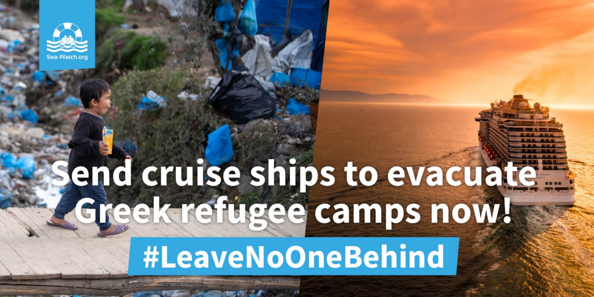
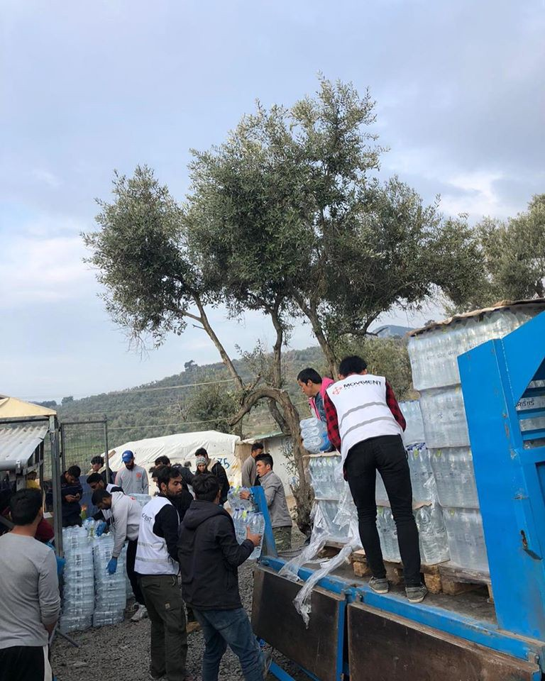
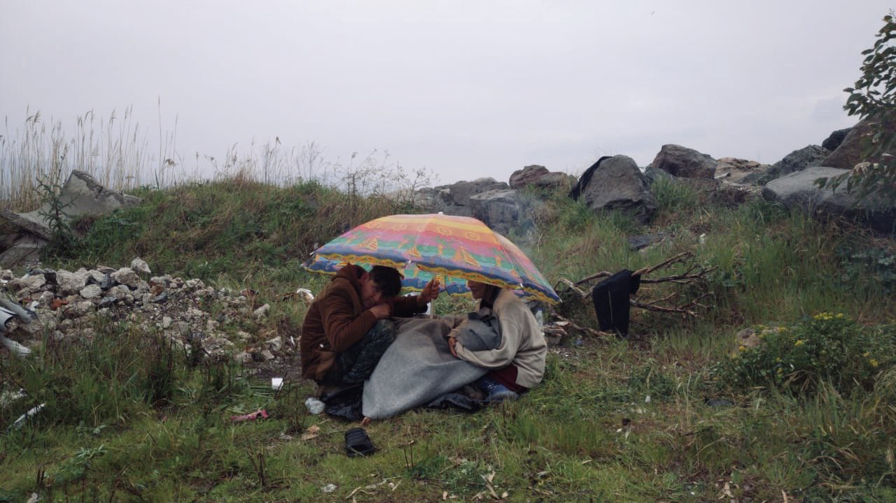

### AYS Daily Digest 23/03/2020 EU should use decommissioned cruise ships to evacuate camps, says Sea\-Watch

_Calais abandoned during COVID\-19 // Lesvos and others in Greece during new curfew // Testing for COVID\-19 in Idlib soon // Prime Minister Orban seeking unlimited power in new pandemic bill // and more…_

](assets/e52d9427ebd6/1*ZLI7r6gZqMW30_o_oDjrdw.jpeg)

Photo by [Abdulhkeem Alshater](https://www.facebook.com/abdulhkeem.alshater?__tn__=%2Cd%2AF%2AF-R&eid=ARBRX1ovVDB98nsw-DqxIZ6bAZh2H_eJymJhnrZ7_z9QoSJ1HuRqm-NYb0WEdD5d1-xESliAsCASb9sF&tn-str=%2AF&hc_location=group_dialog)
### FEATURE: Sea\-Watch makes the case for the EU to use decommissioned cruise ships to evacuate camps in Greece

Photo by Sea\-Watch

Scary, unprecedented times calls for creative solutions\. In a statement a Monday, [Sea\-Watch](https://sea-watch.org/en/send-cruise-ships-to-evacuate/) stated:

> “Due to the Corona pandemic, leading cruise operators have already suspended their cruises until at least April\. The majority of the ships offer sufficient space for several thousand people and have comparatively well\-equipped medical stations\. The ships provide space for measures to prevent infection, for the rapid identification of cases, as well as for the isolation and initial treatment of patients and general quarantine precautions\. 

> Due to their local isolation and mobility, the cruise ships are ideally suited to quickly relieve regions such as Lesbos, Chios, Samos, Leros or Kos in the short time window that remains, before a catastrophic outbreak of COVID\-19 can no longer be contained\. The local medical infrastructure is already barely sufficient to provide for the local population and will inevitably collapse when faced with an outbreak in the camps\.” 

Johannes Bayer, Chairman of Sea\-Watch notes especially:

> “More than 140 German cities and municipalities have declared their willingness to take part, 40,000 free places are available in the German federal states alone\. With current loans of over 8 billion euros, the German state is one of the leading financiers of cruise ships on the one side, and on the other, Germany was one of the mastermind states behind the devastation of the Greek health system in the wake of the financial crisis of 2007\. Anyone who fails to ensure that people are evacuated now will be complicit in the possible death of hundreds…” 

#### SYRIA

[In an update](https://www.facebook.com/groups/PeopletoPeopleSolidaritySouthernSEEurope/permalink/1320121578185505/) on Assad’s repsonse to COVID\-19:

> “The Assad regime today officially admits that a girl has contracted the Corona virus\. It is worth noting that it is certain that more than 300 people are infected with Syria with the Coronavirus, but the Assad regime is concealing these figures\. The Assad regime, A week ago, closed all schools, universities and government institutions, and called on the Syrians to abide by their homes, even though it confirmed that there was no infection with the Corona virus in Syria\.” 

On Monday [WHO spokesman Hedinn Halldorsson](https://news.yahoo.com/coronavirus-testing-start-within-days-nw-syria-151822044.html?guccounter=1&guce_referrer=aHR0cHM6Ly93d3cuZ29vZ2xlLmNvbS8&guce_referrer_sig=AQAAANDGjHgHHwhMybNGVZSxo6FqGU4wSrx9Cel0naXD5DKyQ3qRsakmF68X-PkBdiJ1Laq-OSAJzHA4aya0Y2hSAuo_zCW_dNP_0-otBedAMAMzObFthkrGBRBX78Y7U6E8Tu1Wfpi86XO36tbnBsTJRLKcxCZlFPBS5UZmu--Lxs-0) said “Testing will be available in Idlib in two days\.” This is desperately needed, due to many people’s fear of the catastrophic results a COVID\-19 outbreak in the North Western part of the country would bring\.
#### LIBYA

■■■■■■■■■■■■■■ 
> **[Sally Hayden](https://twitter.com/sallyhayd) @ Twitter Says:** 

> > UN Refugee Agency launches #coronavirus funding appeal, while at the same time suspending help to refugees in Libya because of COVID-19. Many of those now cut off were forced to leave the UNHCR GDF centre earlier this year. [twitter.com/UNHCRLibya/sta…](https://twitter.com/UNHCRLibya/status/1240220921195048961?s=20) https://t.co/Cv2heq5FJi 

> **Tweeted at [2020-03-18 18:47:43](https://twitter.com/sallyhayd/status/1240349178074746880).** 

■■■■■■■■■■■■■■ 

#### GREECE
### The islands need to be evacuated in order to stop the spread of COVID\-19 in the camps\.

On Monday, [Juan Fernando López Aguilar](https://www.politico.eu/article/senior-mep-juan-fernando-lopez-aguilar-calls-for-eu-action-to-stop-coronavirus-spreading-to-greek-migrant-camps/) \(Spanish Socialist MEP\) wrote in a [letter](https://app.slack.com/client/T087F9KNW/CUDFJAELB/thread/CUDFJAELB-1584973541.229300) to Janez Lenarčič, the European commissioner for crisis management:

> “One of the main issues to be addressed to avoid the quick and wide spread of COVID\-19 on the Greek islands is the urgent preventive evacuation of the overcrowded camps\. Many of those in the camps \(42,000 people in total\) are already in a precarious health situation and, despite the measures taken by the Greek authorities, the overcrowding and the dire living conditions make it difficult to contain COVID\-19…There is no chance of isolation or social distancing, nor is it possible to ensure appropriate hygienic conditions … **There are only six intensive care beds available on the island of Lesvos** … and the necessary health equipment is not at present available on the islands\.” 

You can sign an open\-letter from grassroots advocacy group ‘Europe Must Act’, which calls on EU leaders to Immediately Decongest the Aegean Islands” [here](https://www.change.org/p/charles-michel-europe-must-act-now-for-the-immediate-decongestion-of-the-aegean-islands-37ac8a88-cf7e-4ce2-9a98-1b2969f1bda4?lang=en-GB&fbclid=IwAR2CoU44h3B6QZjy3VG71LZFreRJvUNBpPo8aFNhRzYIo2aXyZFGu8DgqVQ) \.
### The curfew from Monday 23/3 to 6/4\. You can only go out for the following 6 reasons:

1\. To visit a pharmacy or doctor
2\. To go to a supermarket
3\. To visit your bank
4\. To provide aid to someone in need
5\. To go to a formal ceremony \(such as a wedding or a funeral\)
6\. For physical exercise or to walk a pet

Here are the actions you must take before going out to avoid a € 150 fine from the police:
1. Write on a piece of paper; your full name, the reason why you are going out 1–6 and your address\.

or

2\. Send an SMS to 1303, with the number of the reason you are going out \(1–6\) space your full name space your home address\.

Please keep sharing this → [\(find the Arabic, Farsi, Urdu, Bengali, and French lists here\)](https://www.facebook.com/groups/1508309029486384/permalink/2515906165393327/?hc_location=ufi)

The children who other EU countries recently agreed to evacuate from Greece and provide safe refuge aren’t going anywhere due to COVID\-19\. Administers are saying it is “impossible to provide them safe conditions at this time\.” More [here](https://www.infomigrants.net/en/post/23597/coronavirus-strands-refugee-children?fbclid=IwAR3mhif8Lf28cDL8skyelfvSHNUaN-6SvoG8W_ThhBfnn72WKiwLsRsXJEQ) \.

](assets/e52d9427ebd6/1*BXiRTWRAs0j4siyfav-fEA.jpeg)

Photo by [NoBorder’s Greece](https://twitter.com/Refugees_Gr/status/1242207138170245122?s=19&fbclid=IwAR2wm0QFdUYZDZgp_aSD2Gl9_noMJcB_9FTWmEl_2fJ-868CtC_6Be7_GSw)

The UN Special Rapporteur on the human rights of migrants is still very concerned about the violence taking place on the Greek\-Turkish border and says that Greece must take immediate action and reverse its decision to suspend new asylum applications\. Read his statement [here](https://www.ohchr.org/EN/NewsEvents/Pages/DisplayNews.aspx?NewsID=25736&LangID=E) \.

](assets/e52d9427ebd6/1*WYJNla5jjCLDIVgfNn_QjQ.jpeg)

Photo by [AFP](https://twitter.com/UN_SPExperts/status/1242035926412468224?fbclid=IwAR0l_zjTKp_k54q6fV5Vgcbx1KqUCSBuj3JLUnBGBN_HULx9ILTgjF34GHk)

Since the asylum suspension, Human Rights Watch is reporting that Greece denied at least 625 people the right to asylum on Lesvos from March 1st\-18th\. HRW said that _“authorities are detaining 189 new arrivals on the island of Lesbos in unacceptable conditions\. The other 436 were transported to a closed center in Malakassa, north of Athens, in conditions that are as yet unknown\.”_ More [here\.](https://www.infomigrants.net/en/post/23609/greece-625-denied-right-to-seek-asylum-in-march-hrw?fbclid=IwAR2RFUtSGEii4z0IKqQxPs0zHY97cetdTonevQl5-ba898x5f8dnsstby0E)

Update in from [the Moria Corona Awareness Team](https://www.facebook.com/MoriaCoronaAwarenessTeam/posts/115350160094163?hc_location=ufi) earlier on Monday \(you can find the French, Farsi and Arabic here as well:
“ **_Second confirmed case of coronavirus today in Lesvos\._** _He is a man of about 70 years, a resident of the town of Mytilene, who returned from Thailand, where he had gone on holiday with his wife\.”_

> “The patient is in good health and remains at home under supervision\. But with flu symptoms, his wife, who also traveled to Thailand, is hospitalized at Mytilene Hospital, a sample of which will be sent to Athens for examination today\. 

> Reportedly, the Mytilene couple did not come into contact with people immediately after their arrival on the island\. 

> The rest of the samples of suspicious cases sent to Athens yesterday received negative responses\. Among them is the sample of the first patient from Plomari, who is leaving the Healthy Hospital\.” 

**Later on Monday [a third case](https://stonisi.gr/post/7898/trith-asthenhs-me-koronoio#.XnjYbCjmfCM.facebook) of an elderly Greek woman who had recently traveled to Athens, was reported\.**

 camp \( \) due to increased tensions on Lesvos and new lockdown measurements in relation to [\#COVID19](https://www.facebook.com/hashtag/covid19?source=feed_text&epa=HASHTAG) , the food line inside Moria camp has become increasingly more tense and chaotic\. As one of the few NGO’s still operating in and around Moria camp during these uncertain times, we decided to to relieve some of the food line\-related pressures by setting up a new food distribution point in Zone 9 of our Olive Grove [\#campUs](https://www.facebook.com/hashtag/campus?source=feed_text&epa=HASHTAG) outside Moria camp\. This new food line means we can now feed approximately 700 residents daily, and in combination with our existing food line in Zone 6, we can now safely feed around 1,500 people\. While this number is only a fraction of the total population of Moria camp, we hold hope that in the future we will be able to help feed many more residents\.” Photo by [Ali Shams Eddin](https://www.facebook.com/ali.mular.1/posts/855822968225029?hc_location=ufi)](assets/e52d9427ebd6/1*29cLk876bqer4Hf9gVvPgw.jpeg)

“For the residents of [\#Moria](https://www.facebook.com/hashtag/moria?source=feed_text&epa=HASHTAG) camp \( \) due to increased tensions on Lesvos and new lockdown measurements in relation to [\#COVID19](https://www.facebook.com/hashtag/covid19?source=feed_text&epa=HASHTAG) , the food line inside Moria camp has become increasingly more tense and chaotic\. As one of the few NGO’s still operating in and around Moria camp during these uncertain times, we decided to to relieve some of the food line\-related pressures by setting up a new food distribution point in Zone 9 of our Olive Grove [\#campUs](https://www.facebook.com/hashtag/campus?source=feed_text&epa=HASHTAG) outside Moria camp\. This new food line means we can now feed approximately 700 residents daily, and in combination with our existing food line in Zone 6, we can now safely feed around 1,500 people\. While this number is only a fraction of the total population of Moria camp, we hold hope that in the future we will be able to help feed many more residents\.” Photo by [Ali Shams Eddin](https://www.facebook.com/ali.mular.1/posts/855822968225029?hc_location=ufi)

In an update on the lockdown taking an effect on Lesvos from [No Border Lesvos Kitchen](https://www.facebook.com/NBKLesvos/photos/a.722860677853724/1686034644869651/?type=1&theater) :

> “ **As of this \(Monday\) morning, 6am, Greece is offically on Lockdown** \. All of the regulations that are either now being enforced or be very soon will be in other nation\-states are implemeted\. For now, being outside without a reason is a reason to receive a fine of E150\. 

> Also in Moria, the measures are intensified\. Going out for shopping is now no longer considered urgent enough to leave the camp\. This means people are completely reliant on the military for nutrition\. Up until now people are not receiving extra food, sanitary products or water\. In the part of the camp that is used for detention the water has been completely cut off\. In addition to this, extra private security was hired to enforce the measures\. Surrounded by uniformed bulldogs, in a place with not enough food, drinking water or safety\. No security, depended on a nation\-state that has made it increasingly clear that they do not want them here\. 

> Meanwhile, a new closed camp has been approved quietly in the midst of this corona crisis\. Without any protest\. Without any consideration\. Without any empathy\. After this crisis is over, the world will be a different place…For us, it is very clear that the future for the people on this Island who are locked inside the tragedy that is Moria, things will get worse…” 

](assets/e52d9427ebd6/1*s9Xlob8XJFhe6PCzh1maZQ.jpeg)

Photo by [No Border Kitchen Lesvos](https://www.facebook.com/NBKLesvos/photos/a.722860677853724/1686034644869651/?type=1&theater)

](assets/e52d9427ebd6/1*6RI804BNCfUGDgYOBVSg-w.jpeg)

**57 new arrivals to Lesvos** on Monday; trying to stay warm\. Photos by 
[Franziska Grillmeier](https://twitter.com/FranziEire/status/1242103809796685825?fbclid=IwAR214uo7F4NNmyqhNHS8c6fqsGRkPle-RFd5v3Qi3Hsb-V1zwcdoACuYaIQ)

■■■■■■■■■■■■■■ 
> **[RSA](https://twitter.com/rspaegean) @ Twitter Says:** 

> > "The last days residents of the island attack verbally and physically refugees from the hotspot. Because of that, no one from us goes alone outside. We move in groups in order to protect ourselves", says A. from Iraq who lives in the hotspot of #Kos. #RefugeesGr 

> **Tweeted at [2020-03-23 18:22:35](https://twitter.com/rspaegean/status/1242154791670820865).** 

■■■■■■■■■■■■■■ 

#### CYPRUS

In an update on sea rescue, Info Migrants reports: _“After authorities from EU member state Cyprus refused to let a migrant boat dock due to the corona crisis, police in the northern part of the island, which is under Turkish control, said they **rescued over 170 migrants a day later** \. Ethnically divided Cyprus, split by a demarcation line not recognized as a border, has become a popular destination for migrants in recent years\.”_ The group included 69 children: more [here _\._](https://www.infomigrants.net/en/post/23615/north-cyprus-rescues-syrians-turned-away-by-republic-of-cyprus)
#### ITALY

](assets/e52d9427ebd6/1*vMKrab3pn0H6MNUNhWBUGA.jpeg)

“TRIESTE \(Italy\)
Volunteers have moved to the old port area \(zona “porto vecchio”\) and there they continue to distribute clothes food care to refugees arriving tired injured and hungry from the Balkan route\.” \(translation\)Photos by [L’ ALTRA VOCE](https://www.facebook.com/permalink.php?story_fbid=2866122606814020&id=1245970425495921)
#### BOSNIA AND HERZEGOVINA

![“We have concerns regarding the health of refugees at Bihac Bihac Bira Camp\. Lines were made on the ground to outline the distance between one person and another during the distribution of meals\. What we don’t understand is: what exactly are they for? People in the field still sleep attacked in containers, eating attacked\. The times for food distribution are endless and many times it is not fed to everyone\. There are more important things that should be weighed to\. Lines are nothing, these kid’s health is in danger anyway\.” \(translation\) Photo by [L’ ALTRA VOCE](https://www.facebook.com/permalink.php?story_fbid=2865020653590882&id=1245970425495921&hc_location=ufi)](assets/e52d9427ebd6/1*3HATrbUNNoCFHOjkj4H9Gg.jpeg)

“We have concerns regarding the health of refugees at Bihac Bihac Bira Camp\. Lines were made on the ground to outline the distance between one person and another during the distribution of meals\. What we don’t understand is: what exactly are they for? People in the field still sleep attacked in containers, eating attacked\. The times for food distribution are endless and many times it is not fed to everyone\. There are more important things that should be weighed to\. Lines are nothing, these kid’s health is in danger anyway\.” \(translation\) Photo by [L’ ALTRA VOCE](https://www.facebook.com/permalink.php?story_fbid=2865020653590882&id=1245970425495921&hc_location=ufi)

[In an editorial](https://balkaninsight.com/2020/03/23/migrants-in-bosnia-more-vulnerable-to-infection-despite-lockdown/?fbclid=IwAR3S_d1wlEpSnr8eTpT540QdVvxUVQfnJtTLa_Jtn8_VlCqTA6zMzSd2TYI) , Anja Vladisavljevic and Danijel Kovacevic convey that while Bosnians are able to self isolate at home, refugees living in squalor do not have the same privileges:

> “ **There have so far been no indications of coronavirus symptoms at temporary reception centres for migrants in Bosnia and Herzegovina, according to the International Organisation for Migration, IOM** \. ‘Preventive measures are being implemented in reception centres in cooperation with the World Health Organisation, the Danish Refugee Council, DRC, and the Institute for Public Health of the Sarajevo Canton,’ Edita Selimbegovic, a public information officer at the IOM, told BIRN\. 

> But migrants who are living in squatted accommodation or on the streets rather than in temporary reception centres pose a different problem\. A significant number of them are in Tuzla in eastern Bosnia, and in the west of the country in the Una\-Sana Canton, close to Croatia\. 

> The contruction of tent camp on the “Lipa” site, between Bihac and Bosanski Petrovac, began on Saturday, and it is expected to accommodate migrants and refugees who are on the streets\. ‘…The primary goal of everything we do is the protect of epidemiological and health situation in the town, but also to find more humane accommodation for these people,’ Bihac mayor Suhret Fazlic said on Saturday\. 

> ‘Migrants inside the camps do not understand what is going on, at the moment they are more confused than angry,’ ISPIA told BIRN\. Migrants trying to get to EU countries also do not know that coronavirus\-related restrictions on movement are in force there too, ISPIA added\.” 

[Help for People on the Move in Bosnia](https://www.facebook.com/groups/144469886266984/permalink/532607610786541/?hc_location=ufi) wrote on Monday:

> “We feel an commitment to share the information with you we received today: people contact us from various camps\-camps in Bosnia and Herzegovina \(which is LED by the partners and who are located in Sarajevo, running and big kladuši\) and say that they are getting less and less food \. Already in some camp\-camps people got only breakfast and they were shared with some bread and a couple of jam instead of lunch and dinner, and in other camps, there are still small amount of meals still reduced \(with the fact that they still receive three meals\) \. 

> We remind you that this information should be seen in the context of the fact that people are banned from moving and leaving the camps\-Camp, and that they are not able to buy some extra meal\.” 

#### SERBIA

](assets/e52d9427ebd6/1*SeLmspgOhJoi2OCmOkXi3Q.jpeg)

“BALKANIC ROKE — Sombor camp \(Serbia\)
Now there are lots of people in this camp, maybe about 1000, and they keep moving more here from various camps and squats\. More than 600 live in tents \(and it’s snowing right now\) \. Food is not enough for everyone, you have to line up and wait a couple hours… sometimes for nothing\. Even blankets are scarce\. There is a doctor who visits one or two hours a day\. Too little\.” \(translation\) Photo by [L’ ALTRA VOCE](https://www.facebook.com/1245970425495921/photos/a.1266360583456905/2865425873550360/?type=3&theater)
#### HUNGARY
### Prime Minister Orban is “seeking indefinite power” in new COVID\-19 response bill drafted on Friday

The bill states that the government can _“suspend the application of certain laws, derogate from legal provisions, and take extraordinary measures in the interest of guaranteeing the stabilisation of the lives, health, personal and material security of citizens, as well as the economy\.”_

Anyone “who interferes with the operation of a quarantine or isolation order” could possibly be facing 8 years in prison…more [here](https://euobserver.com/coronavirus/147834?fbclid=IwAR2bf6thIH-tnDqiWxceBtJWvY8hU28xoPQfgkDYoEZLCNfP6w7FZh8uhTs) \.
#### GERMANY
### Germany is now halting asylum interviews due to COVID\-19

This includes in person interviews, but written applications for asylum will still be processed, according to Germany’s Federal Office for Migration and Refugees \(BAMF\) \. This is a temporary measure that will only extend to however long the crisis lasts, says BAMF\. More [here](https://www.infomigrants.net/en/post/23605/germany-halts-asylum-interviews-due-to-coronavirus?fbclid=IwAR2bIk4CEDrmyjImGNjG2h-G5RBQxXBJlL8HENZeUrVe6OZf8sf36hb4Dr0) \.

According to Pro Asyl’s new ticker for Germany news on COVID\-19 and refugees:

**_“23\.03\.2020, collective deportation to Afghanistan canceled in April_**
- _According to our information, the collective deportation to Kabul planned for the second week of April was canceled\._
- _In other European countries, returns are adjusted to Afghanistan: the Swedish police issued a [message](https://polisen.se/aktuellt/nyheter/2020/mars/dialog-med-afghanska-myndigheter-gallande-verkstallighetsarenden/) , from which it appears that the Afghan authorities take no returnees from Sweden more\._

[**_23\.03\.2020, Federal Office temporarily suspends Dublin transfers_**](https://www.proasyl.de/wp-content/uploads/23.04.2020-Bundesamt-stellt-Dublin-%C3%9Cberstellungen-zeitweise-ein.pdf)
- _As has become known from ongoing Dublin proceedings, the Federal Office decided on March 18, 2020 to temporarily suspend all Dublin transfers to and from Germany until April 19, 2020\._
- _The reason for this are numerous border closures and travel bans within Europe\._
- _Current transfer periods are thus interrupted for an initially indefinite period \(Section 80 \(4\) VwGO in conjunction with Article 27 \(4\) Dublin III Regulation\) \. Subsequent transfer deadlines continue\.”_

Follow the news outlet for daily info [here](https://www.proasyl.de/hintergrund/newsticker-coronavirus-informationen-fuer-gefluechtete-unterstuetzerinnen/?fbclid=IwAR2ppJlCNlMKq336vsCY8XiuiZUZ-lt0c51bFTF37yR-hMlQ9MKYcbbRUZY) \.
#### FRANCE
### Refugees in Calais are abandoned while facing COVID\-19

There are reported cases so far in the area, but tests have yet to be conducted\. People are forced by confinement not to leave the camp, but evictions in the field are continuing\. More [here](https://reporterre.net/Les-migrants-de-Calais-abandonnes-face-au-coronavirus?fbclid=IwAR1z9SjjngkfoA2tSHP9GdxZ5GyxVm3Wxlvxo7BwkYAYp92Jojk4ojsCirw) \.

![“\[PARIS \* FOOD HELP\] Hello the capital, if possible, spread the message to people in need of food aid you meet: we organize in partnership with the City of Paris and the state and from Tuesday the daily distribution of 5000 Packed baskets from 9 am to 14 pm, in 3 neighborhoods of Paris including the Great Neighbors\! More sites will be opening soon\! Below the details” \(translation\) Photo by [William Dufourcq](https://www.facebook.com/photo.php?fbid=10158334755429225&set=a.10152525937979225&type=3&theater&ifg=1)](assets/e52d9427ebd6/1*Qui0QvMwo2XzIWB5SLE3Nw.jpeg)

“\[PARIS \* FOOD HELP\] Hello the capital, if possible, spread the message to people in need of food aid you meet: we organize in partnership with the City of Paris and the state and from Tuesday the daily distribution of 5000 Packed baskets from 9 am to 14 pm, in 3 neighborhoods of Paris including the Great Neighbors\! More sites will be opening soon\! Below the details” \(translation\) Photo by [William Dufourcq](https://www.facebook.com/photo.php?fbid=10158334755429225&set=a.10152525937979225&type=3&theater&ifg=1)
#### GENERAL
### A global ceasefire during COVID\-19 would not only protect current refugees and IDPs, but would hopefully suspend the displacement of new people:

■■■■■■■■■■■■■■ 
> **[United Nations](https://twitter.com/UN) @ Twitter Says:** 

> > WATCH LIVE: @[antonioguterres](https://twitter.com/antonioguterres) calls for a global ceasefire amid #COVID19 crisis. [pscp.tv/w/cUeHHDFxTFFH…](https://www.pscp.tv/w/cUeHHDFxTFFHWUFvQldqSlp8MWpNS2dRQU5Nb0FKTAq7cr8haXxlDpbzZSetX6YYWLegEsEJr96RdQzYHm_Y?t=1m8s) 

> **Tweeted at [2020-03-23 16:18:24](https://twitter.com/un/status/1242123541778137089).** 

■■■■■■■■■■■■■■ 

Lighthouse Relief created this helpful list of things you can still do while social distancing and staying at home: \(find all the details of each point [here](https://medium.com/@LighthouseRR/how-to-help-during-the-coronavirus-pandemic-da3ca772ab60) \)
1. **Find ways to support your community\!**
2. **Donate to NGOs on the ground\!**
3. **Volunteer online to support asylum seekers & refugees\!**
4. **Contact your representatives\!**
5. **Raise awareness\!**

 Photo by Stacy Brown](assets/e52d9427ebd6/1*bRG4WGcmsVmuSNGTgoUvmg.jpeg)

[Details here\.](https://www.facebook.com/photo.php?fbid=10218541954353232&set=gm.1378406739033436&type=3&theater&ifg=1) Photo by Stacy Brown
#### Here is is helpful [COVID\-19 RESOURCE GUIDE BY DISTRIBUTE AID](https://www.facebook.com/groups/AthensVolunteersInformation/permalink/2027102594088694/?hc_location=ufi)

_“Distribute Aid connects grassroots refugee aid groups across Europe through a single online platform\. Their technology allows groups to connect, collaborate, match available supplies to areas of need, and organize aid shipments\. They have been working on a resource guide to help communities and volunteers plan and prepare themselves in this current world crisis that we are faced with\.”_

IRC’s statement about handling COVID\-19 while maintaining protection for refugees:

> “In this crisis situation,EU Member States need to ensure that while they exercise their right to manage external borders and carry out health screenings, their response to COVID\-19 never compromises the protection and health needs of refugees and asylum seekers\. This includes ensuring meaningful access to health facilities and sanitation services, and safeguarding the right to seek asylum\. 

> While travel restrictions may be an unavoidable response in the immediate term to help to curtail the spread of the coronavirus, we urge Member States to ensure these measures are indeed temporary, remaining in place only as long as absolutely justified by public health reasons\.” 

#### **Find daily updates and special reports on our [Medium page](https://medium.com/are-you-syrious) \.**

**If you wish to contribute, either by writing a report or a story, or by joining the info gathering team, please let us know\.**

**We strive to echo correct news from the ground through collaboration and fairness\. Every effort has been made to credit organisations and individuals with regard to the supply of information, video, and photo material \(in cases where the source wanted to be accredited\) \. Please notify us regarding corrections\.**

**If there’s anything you want to share or comment, contact us through Facebook, Twitter or write to: areyousyrious@gmail\.com**

_Converted [Medium Post](https://medium.com/are-you-syrious/ays-daily-digest-23-03-2020-eu-should-use-decommissioned-cruise-ships-to-evacuate-camps-says-e52d9427ebd6) by [ZMediumToMarkdown](https://github.com/ZhgChgLi/ZMediumToMarkdown)._
