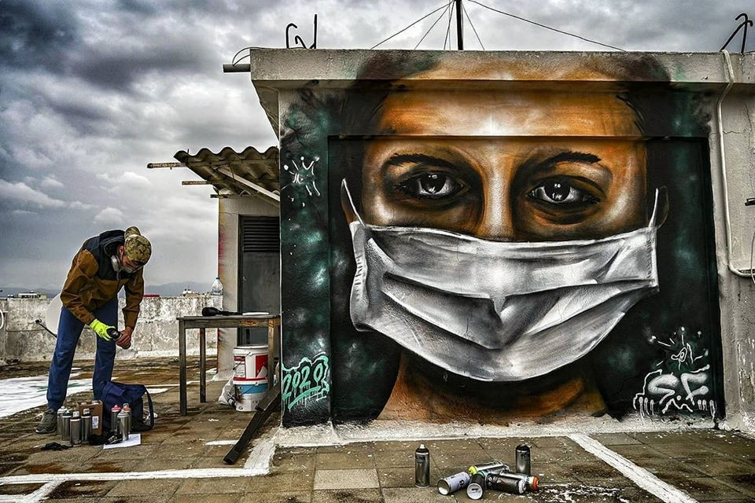
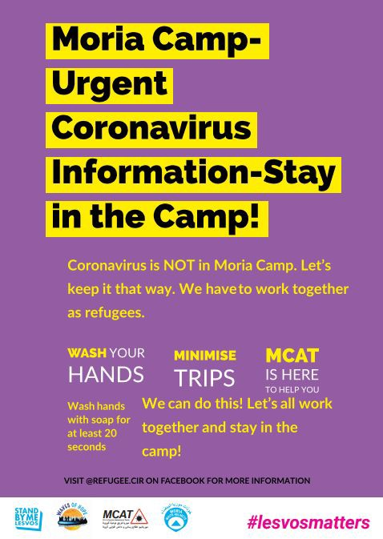
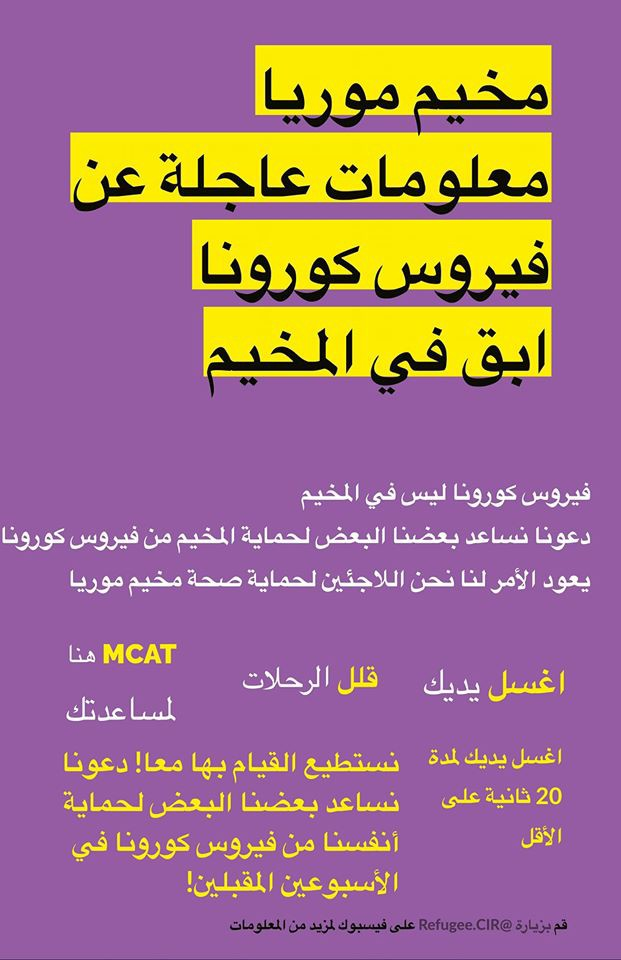
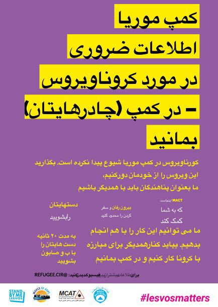
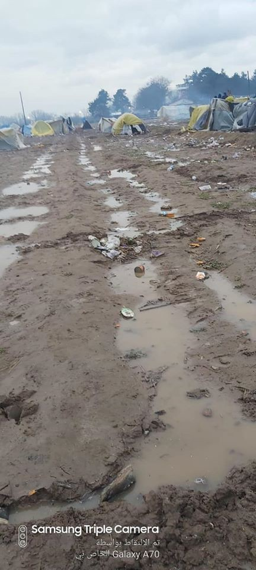
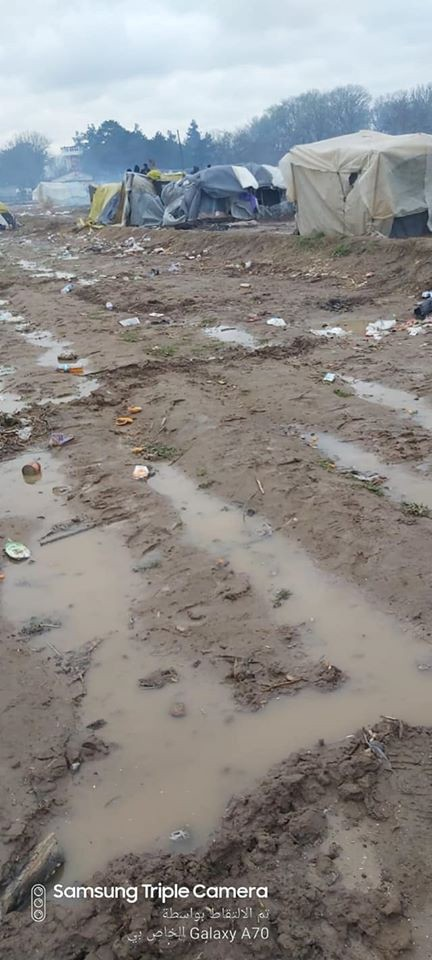

### AYS Daily Digest: 24/03/20: Situation of People on the Move while Europe is in lock\-down
#### Fourth case of Corona Infection on Lesvos, no cases in the camps yet // various calls to evacuate the camps now // Images from the Greek\-Turkish border // Snow and Protests against new camp in Bosnia and Herzegovina // Evacuation of a camp in France // Vulnerable people suffer the most from lock\-down in Spain

Copyright: Aris Messinis
### FEATURE
#### GREECE, CORONA and EUROPE

21 human rights and humanitarian organizations called for the Greek government to immediately reduce congestion of the camps on the Greek islands:

> “Thousands of people, including older people, those with chronic diseases, children — including very young and unaccompanied children –, pregnant women, new mothers, and people with disabilities, are trapped in dangerously overcrowded, deplorable conditions on the islands amid the COVID\-19 pandemic\. Forcing asylum seekers to remain in conditions that violate their rights and are harmful to their well\-being, health, and dignity cannot be justified on grounds of public health, the organizations said\.
 

> International human rights law requires that the health needs of asylum seekers and migrants be addressed and, in the context of the COVID\-19 pandemic, any restrictions on rights for reasons of public health or national emergency be lawful, necessary, and proportionate as well as nondiscriminatory\.” 

See: Lesvos Legal Center

**Four case of corona infection have been reported from Lesvos in total\. The four people are all Greek nationals\. Until now the virus has not yet reached the camps\.**

The Moria Corona Awareness Team designed posters that will be attached in the whole camp in order to raise awareness and try to keep the virus outside of the camp\.

Copyright: Stand by me Lesvos

Information about Covid\-19 provided by IOM can be accessed here in:
English, French, Wolof, Igbo, Edo, Arabic, Oussa, Pidgin, Bambara, Urdu, Esan\-Ishan, Soninke, Yoruba, Bengali, Mandinka, Somalo, Fula, Tigrino, Amarico, Spanish, Italian\.

The Health Point Foundation that provides medical care in Moria is looking for doctors and nurses that are already on the island to support the team\. Please message [medical@healthpointfoundation\.org](mailto:medical@healthpointfoundation.org) for more information\.

Another call for action has been released by doctors from the Netherlands\. They call to doctors from all of Europe to sign the distress call\.

> “If Europe looks away now, this situation could escalate to become a medical disaster and this would represent a serious violation of the norms and values of European healthcare\.” 

### TURKEY

Images from Pazarkule close to Edirne and right next to the border crossing to Greece after it rained for the second day in a row\. Rumours say that Turkish authorities still try to force people to riot against Greek border guards\.

Copyright: Antonis Repanas
### BOSNIA AND HERZEGOVINA

In the village of Lipa some 30 kilometres away from Bihac, a tent settlement is supposed to be opened soon in order to house some of the up to 3000 refugees that are sleeping rough in and around the area of Bihac\. Bosnia and Herzegovina is in lock\-down\. In order to stop the coronavirus from spreading, settlements for refugees are being built, finally\. Protest comes from representatives of Serbs who returned to Bosnia’s Federation entity, after they left their homes during the war\. Not many of them who fled did return, and many of the returnees live under tough conditions\. They fear that their situation will worsen through the construction of the new camp for refugees\. Old resentments and precarious living conditions foster racist and islamophobic hostilities\.
Read more about it in English here:

In Bosnia and Herzegovina the situation for people on the move is worsened by winter weather with snowfall and temperatures below zero\. In this situation, thousands of them are without a roof above their head which makes them obviously even more vulnerable to infection due to an already stressed immune system\.
### ITALY

Some team members of No Names Kitchen, an organization that has been active on the Balkan route for years, started distribution of food for people stranded in Trieste\. Most of people on the move that arrive to Trieste come from Bosnia, from where they started the dangerous and strenuous journey that is called “the game”\. In Trieste they usually apply for asylum or try to find a way to continue to other European countries, but with the asylum offices being closed, no trains running and borders to other European countries closed, they are trapped in Trieste\. No Name Kitchen tries to support them:

> “Now, with other volunteers, they \[two members of No Name Kitchen\] go out every night to distribute food\. Yesterday they distributed dinner for 100 people living in the streets of Trieste\. They are doing this with the town hall’s authorization — as if\!… they are actually doing a task that the town hall should be doing — and trying to meet all the sanitary norms required so that no one else gets infected\. 

> A municipal night shelter is expected to open soon so that these people can stay somewhere away from the streets, but Linea d’Ombra ODV will keep working to alleviate the situation\. The organization will keep distributing blankets and food and whatever they can to improve people’s lives\. For this reason, donating money to this organization in Trieste is a great idea and much\-needed\. 

> It is possible by PayPal: paypal\.me/lineadombra or Bank account: LINEA D’OMBRA ODV, BCC di Staranzano e Villesse, IBAN IT23V0887702202000000355222” 

From Facebook: No Name Kitchen
### FRANCE

According to the organization Solidarité Migrants Wilson the camp Aubervilliers has been evacuated by the authorities on the morning of the 24th of March\. People are probably brought to sport halls although it is not yet sure to which ones\. The organization is never the less keeping up its work which includes the distribution of food\. People who want to help are required to provide a certificate from the organization in order to leave the house\. Find helpful information on how to support the group on their faebook page: Solidarité migrants Wilson\.
### SPAIN

In Spain as in other countries, the lock\-down especially hits the people that live in precarious circumstances anyways\. 
The two Spanish enclave cities Ceuta and Melilla are closed and isolated since the 17th of March\. Not only did Morocco close its borders with the cities, also the passenger ferries and planes from Spain were halted\. Only merchant ships are allowed entrance at the port in order to guarantee the supply of food and medical equipment\. The situation of young migrants and refugees in the two cities has not been addressed until recently\. Since many of them have been living in the streets, proper hygiene measures are almost impossible to maintain\. Many youngsters have now been accommodated in communal infrastructures, but of course they are often overcrowded and not suiting\. 
During the first days of alert, the police in Ceuta seem to have been responding to the situation by pushing youngsters out of the city and forced them to remain isolated on the rocks of a jetty without access to information or food\. This has been reported by Maakum, an NGO working with minors in Ceuta\.
Also the situation of cross\-border workers, mainly women, is dire following the closure of the borders\. About 8000 women were crossing the border from Morocco to Ceuta or Melilla on a daily basis in order to work in households as care\-takers or domestic workers\. Many of them were working informal and without any contracts, which makes the situation even more precarious now\. 
On the Spanish mainland, the situation of the fieldworkers in Huelva is especially alarming\. The Andalusian Union of Workers has received more than 400 complaints to agricultural companies that do not respect the protection measures required by the state of alarm for the coronavirus\.
People are still working side by side without the possibility to keep distance and without access to any protection\. Most of them do not have the choice to stay at home in order to protect themselves or others from infection, since they would be fired immediately and are without any social security\. But staying at home would also not help much, since these people live in shacks, often without running water and space to isolate oneself from others\. A minimum action to protect these people would be to provide access to running water on the fields and in the shanty towns\. 
For more information in Spanish, see:

**Find daily updates and special reports on our [Medium page](https://medium.com/are-you-syrious) \.**

**If you wish to contribute, either by writing a report or a story, or by joining the info gathering team, please let us know\.**

**We strive to echo correct news from the ground through collaboration and fairness\. Every effort has been made to credit organisations and individuals with regard to the supply of information, video, and photo material \(in cases where the source wanted to be accredited\) \. Please notify us regarding corrections\.**

**If there’s anything you want to share or comment, contact us through Facebook, Twitter or write to: areyousyrious@gmail\.com**

_Converted [Medium Post](https://medium.com/are-you-syrious/ays-daily-digest-14-03-20-situation-of-people-on-the-move-while-europe-is-in-lock-down-507edda836fb) by [ZMediumToMarkdown](https://github.com/ZhgChgLi/ZMediumToMarkdown)._
