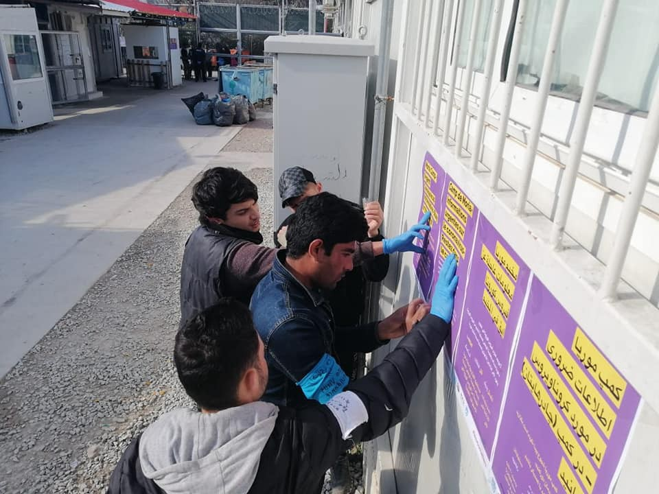
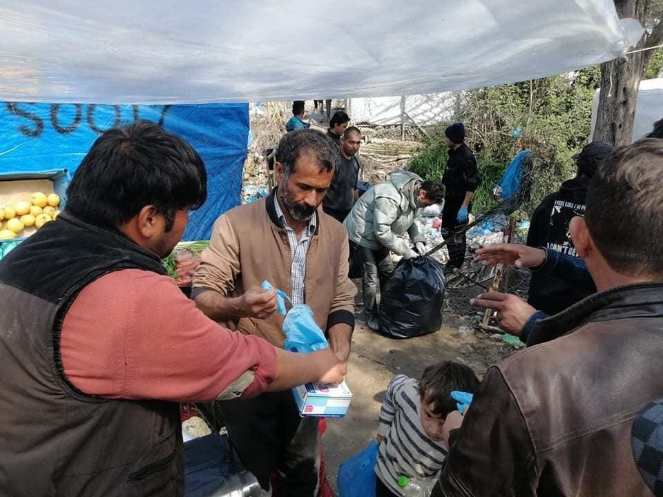
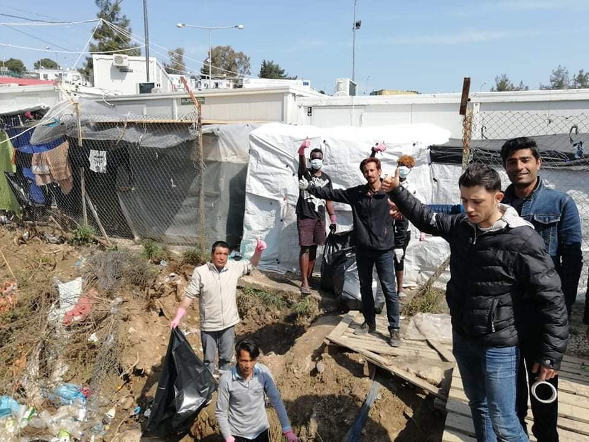

### AYS Daily Digest 25/03/20: Possible catastrophe: Hear from a few aid workers still in Greece
#### _Swedish lawyers worry about outbreak for refugees // Hunger strike in Italy ongoing // Donate for emergency medical building in Lesvos // Far right trying to deny healthcare to refugees in Spain during pandemic // and more…_

](assets/90b4c2cec6d0/1*w-jBPj_3lk1MLcqyv_Sqqw.jpeg)

“This message is for everyone raising awareness for refugees around the world, working on the ground, donating or simply spreading the Hashtag \#LeaveNoOneBehind\. A woman living in \#Moria Camp on \#Lesvos sent it to me today” Photo by [Raphael Knipping](https://twitter.com/RaphaelKnipping/status/1242911462403817473)
### FEATURE: Many humanitarian aid workers on the islands have had to leave because of the pandemic and legal situation in Greece, leaving a deepening shortage of volunteers\.

Three among those who [remain](https://www.spiegel.de/politik/ausland/corona-angst-auf-lesbos-die-kinder-fragen-ob-sie-an-dem-virus-sterben-werden-a-104f11f4-6be8-4632-a504-c081a0de6f86?fbclid=IwAR04tpU9pykKlS8tTzShlY5xnCwLh4BDhT0Hv67Ws8wOm1oHaFEnLp-ISk0) on Lesvos told [German news media](https://www.spiegel.de/politik/ausland/corona-angst-auf-lesbos-die-kinder-fragen-ob-sie-an-dem-virus-sterben-werden-a-104f11f4-6be8-4632-a504-c081a0de6f86) their observations, mostly concerning the feeling of a ticking time bomb:

**Amanda Muñoz de Toro,** lawyer and director of the Fenix legal organization:

> “Because of the corona danger, we now had to halve our team; only those who have experience of crises are allowed to stay\. We have around 2000 clients, so a lot to do\. We take care of women who have experienced sexual violence while fleeing or at camp, the family repatriations of unaccompanied minors and we prepare vulnerable cases for their interviews, since many do not even know their rights\. 

> Due to the danger of a pandemic, **even the catering company did not dare to come into the camp** last Friday to bring the water to the food distribution line\. The military, which is normally responsible for monitoring the distribution, was not present\. Most of the inhabitants did not get drinking water that day\. Sometimes the food is not enough which leads to fights\. In some cases, this affects the food distribution for children too\. These problems are not new\. They have existed for years, but now they are getting worse\.” 

**Andrew Foley,** co\-leader of the Better Days organization for unaccompanied minors:

> “Now we are in constant phone contact with our students, some of whom we have known for years\. **Some ask when school will start again\. Others whether they will die from the virus\.** Everyone is writing to us, we shouldn’t worry, they’ll take care of themselves\. 

> We have just ordered thousands of vitamin C tablets for the kids at the camp\. Above all, the immune system needs to be strengthened as much as possible, which is not always easy on cold nights and wet days\. In addition to the risk of corona, there is also flu, scabies and meningitis\. We are now trying to support the doctors and to prepare ourselves as best we can for an emergency\.” 

**Lisa Papadimitriou,** advocacy manager for Doctor’s Without Borders:

> “We are currently trying to delay an outbreak as long as possible\. **For this we need tests in order to isolate possible cases as quickly as possible\.** We would have to evacuate at least the elderly and the chronically ill to empty hotels or apartments immediately\. There is no place in the camp to quarantine\. 

> We also need better hygienic care\. In the camp there is only one water tap for 1300 people — and almost no soap\. It keeps blowing up the pipes and feces run down the street\. The leaflets do not help much with protective measures that we distribute to the camp residents\. And the most important thing from my point of view: We urgently need a humanitarian corridor so that we can catch up when the pandemic breaks out\.” 

#### SYRIA
### IRC is warning of a potential catastrophic outbreak in Syria of COVID\-19\.

Misty Buswell, Regional Policy and Advocacy Director for the IRC in the Middle East, said:

> “Conditions in Idlib are ripe for a spread of the disease\. A lack of food, clean water and exposure to cold weather have already left hundreds of thousands of people in poor health, making them even more vulnerable to a disease that can spread as quickly as COVID\-19\. Although there have so far been no confirmed cases in Idlib, it is not yet clear where testing will be carried out, and it is possible that the disease is already making its way through the population\. 

> “We know that it has already caused havoc in countries with strong health systems, so the devastation it will cause in Idlib is unimaginable, where 85 attacks on health facilities took place last year, and the majority of the hospitals that remain open are unable to cope with the needs that already exist\.” 

Only three hospitals in northwestern Syria have been confirmed to be able to take care of cases\. Fifteen more hospitals are set to be upgraded, but will probably be terribly low on supplies\. More [here\.](https://www.rescue.org/press-release/covid-19-syria-could-lead-one-most-severe-outbreaks-world-warns-irc?fbclid=IwAR1juY87s2uLQCbvnjElIPjybUSUESbWog0fO7I8yRf2g4FRn_-ZllZIsdY)
#### TURKEY

People are stuck in Pazarkule and not allowed to exit the jungle due to Corona and the risk of infections, volunteers on the ground say\. As no one is allowed to enter, there is a lack of food especially for men\. “We can’t do anything”, an AYS source says\. We will continue reporting on this situation\.
#### LIBYA

![“Receiving Desperate Messages from \#Zawiyah ‘official’ \#detention centre: “We don’t have food, water\. We are really suffering by starvation\. We have patients, they take medicine for \#TB\. If they don’t got enough food they don’t tolerate the medicine\.” This is the food they are forced to share among six persons\. The \#EU\-funded Libyan \#police\-traffickers are still \#torturing migrants in the other hangar whose families cannot pay the ransom money\. In the meantime \#refugees \#homeless in \#Tripoli are exposed to daily violence, robberies, kidnapping, hunger and a lack of sanitation\. After the first case of \#Covid19 in Libya was confirmed yesterday, vulnerable migrants and refugees, whether detained or homeless in Tripoli, have been abandoned and are vulnerable to high risks of infection and illness\.” Photo and message by [Giulia Tranchina](https://www.facebook.com/photo.php?fbid=10157494854958621&set=a.10150438475713621&type=3&theater)](assets/90b4c2cec6d0/1*tpCBgbDJ7kORpkbptnRIdA.jpeg)

“Receiving Desperate Messages from \#Zawiyah ‘official’ \#detention centre: “We don’t have food, water\. We are really suffering by starvation\. We have patients, they take medicine for \#TB\. If they don’t got enough food they don’t tolerate the medicine\.” This is the food they are forced to share among six persons\. The \#EU\-funded Libyan \#police\-traffickers are still \#torturing migrants in the other hangar whose families cannot pay the ransom money\. In the meantime \#refugees \#homeless in \#Tripoli are exposed to daily violence, robberies, kidnapping, hunger and a lack of sanitation\. After the first case of \#Covid19 in Libya was confirmed yesterday, vulnerable migrants and refugees, whether detained or homeless in Tripoli, have been abandoned and are vulnerable to high risks of infection and illness\.” Photo and message by [Giulia Tranchina](https://www.facebook.com/photo.php?fbid=10157494854958621&set=a.10150438475713621&type=3&theater)
#### GREECE

](assets/90b4c2cec6d0/1*opa2e4gPq__u_y1pBGvYOQ.jpeg)

Photo by [LOUISA GOULIAMAKI / AFP](https://www.spiegel.de/politik/ausland/corona-angst-auf-lesbos-die-kinder-fragen-ob-sie-an-dem-virus-sterben-werden-a-104f11f4-6be8-4632-a504-c081a0de6f86?fbclid=IwAR04tpU9pykKlS8tTzShlY5xnCwLh4BDhT0Hv67Ws8wOm1oHaFEnLp-ISk0)
### Call for volunteers still in Greece from NoNameKitchen\!

[Contact them here\.](https://www.facebook.com/groups/AthensVolunteersInformation/permalink/2022742994524654/?hc_location=ufi)

> “If you are a volunteer, you are already in Greece and your organisation shut down its activities due to the virus, this might be a plan B for you\. 

> We are NoNameKitchen and our project here in Patras is still operating\!
 

> Like elsewhere, most international volunteers left to go back to their countries, so by next week we will remain with two people trying to manage the situation on the ground\. The situation regarding the restrictions for our work is unclear and we can’t estimate what will happen, but we will try to keep supporting the people as much as possible in this situation\.
 

> **We are currently providing food, medical and social support for over 200 vulnerable people, and we are planning to continue at least providing 2x meals a day\.** We are expecting restrictions at some point, but we will find a way to continue supporting the people in a safe way\. All together we can manage to keep the wheels of the kitchen turning\! Especially if you have any medical background and reference you are most welcome\!” 

](assets/90b4c2cec6d0/1*tAeJvb-lzF1xopRev_-52g.jpeg)

Photo by [R4R](https://www.gofundme.com/f/support-r4r039s-covid19-emergency-response)
### Help support Refugee 4 Refugees is preparing for an outbreak of COVID\-19 on Lesvos and Samos\. They are building:
1. An emergency medical shelter on Lesvos: “Construction has started, and upon completion will provide 20 rooms with a total of 80 beds to be used as a quarantine space in the event of an outbreak\.”
2. Preparing a warehouse on Samos for creating emergency hygiene packs for families

[In supporting this p](https://www.gofundme.com/f/support-r4r039s-covid19-emergency-response) roject, you are helping to raise funds DIRECTLY for:
- “Wood and other materials to construct emergency medical shelter
- Construction tools to be used by our teams and the camp community
- Bedding to be provided to individuals who are quarantined
- Wiring to ensure electricity is provided to each room
- Essential hygiene items to be distributed on Lesvos & Samos”

### Some Moria Updates

![“Yesterday we discussed what to do with three Greek people who have come down with the coronavirus on the island,,\. \. And what we can do to remain safe from the coronavirus\. And with Stand By Me Lesvos we ask for posters to stay in your tents and get some posters for us yesterday…… We thank our Iranian and Syrian and Belgian and German friends, and friends from all of the world for helping us make these posters very quickly\. We thank everyone for supporting us fighting the coronavirus\. We are very hopeful that this will make a difference,\. \.and that we remain safe from the virus…Today we started hanging up posters that people need to stay in camp\. They are written in Arabic, Farsi English, and also French\! \! Please stay in tents because overcrowding is the most problem with Moria and the coronavirus
Please stay in the camp\! Please limit your movement in Moria community…\.MCAT is here to help you\!” Photos by [Muhannad Al\-Mandeel](https://www.facebook.com/MoriaCoronaAwarenessTeam/posts/116387123323800?hc_location=ufi)](assets/90b4c2cec6d0/1*EZ89Zub7EfktX8C8Q3JcMw.jpeg)

“Yesterday we discussed what to do with three Greek people who have come down with the coronavirus on the island,,\. \. And what we can do to remain safe from the coronavirus\. And with Stand By Me Lesvos we ask for posters to stay in your tents and get some posters for us yesterday…… We thank our Iranian and Syrian and Belgian and German friends, and friends from all of the world for helping us make these posters very quickly\. We thank everyone for supporting us fighting the coronavirus\. We are very hopeful that this will make a difference,\. \.and that we remain safe from the virus…Today we started hanging up posters that people need to stay in camp\. They are written in Arabic, Farsi English, and also French\! \! Please stay in tents because overcrowding is the most problem with Moria and the coronavirus
Please stay in the camp\! Please limit your movement in Moria community…\.MCAT is here to help you\!” Photos by [Muhannad Al\-Mandeel](https://www.facebook.com/MoriaCoronaAwarenessTeam/posts/116387123323800?hc_location=ufi)

**In an update from [Lifeline](https://www.facebook.com/seenotrettung/posts/763259157413959) :**

> “For children and adolescents, the food supply is now reduced to 1000 kcal / day\. Per family, bottled drinking water is reduced to nine liters per day — also for families with more than six people\.” 

](assets/90b4c2cec6d0/1*3KOiAZpNbojAV0BXkee7XQ.jpeg)

“Photos from the Moria Corona Awareness Team, people today in an effort to protect their community & clean the most dirty concentration camp in history, not just in terms of garbage, but mostly ’because of lack of political consciousness” Photos by [NoBorders](https://twitter.com/Refugees_Gr/status/1242925040016003083)

Please also confirm any reports about COVID\-19 on Lesvos with Moria Corona Awareness Team\. Apparently there was some fake news spread today\. Please refer to [this video](https://www.facebook.com/MoriaCoronaAwarenessTeam/videos/869415613520415/?__xts__[0]=68.ARCNtELxOF4eLZrzStIbAz6l_LM4UUO6NDKH9HJ-Xe3OWVkluvdVcxVB7hvW2relR2wyTIQGbHGCwULfNN-ySXK12MmXyutYr3xemZh9BpLkIrYa480IimEapWb6k7whQSewFjtS0ZfYYK1qrygMKTzKWEDmQmgISBpdD2LVVpa9yY59--7lgtIqp01FHQ-q1fTPl1c4EgoYJgwv7qQ6INMxWGdZDsNOFkwi7o8Li1JhycLGXaqlAMpme8QPZBLckIE77NAVhdAVoLLTatJ0n0VTH6Ic7Vrwr3t2uXxAA0sFzLtiCuyWcfLptk-RarmneNlBbFLKKfXvIrkzZ2V3A0kCLAkq2tsXFfw&__tn__=-R) \.

If everything happening wasn’t enough, the Greek weather service issued a weather warning for heavy rainfall and intense thunderstorms for the weekend, even snow in the highlands\. Brace yourselves\!

**Lastly, need an lockdown movement permit in English? Find it [here](https://www.keeptalkinggreece.com/2020/03/23/greece-lockdown-movement-permits-also-in-english/) \.**

In a letter signed by 121 organizations, posted by [Legal Center Lesvos](http://legalcentrelesvos.org/2020/03/25/protect-the-most-vulnerable-to-ensure-protection-for-everyone-restore-legality-to-protect-refugees-and-the-society-at-large-amidst-the-pandemic/?fbclid=IwAR35Hjd6G5xFy2v1kw06iuxa8pKE4iBBuykjBRgYd83SDQGdrdkOXd2wWy8) , detailing the plight of Greece’s decision to suspend asylum, they address the President, Prime Minister, and other heads of state:
- **“To immediately protect public health with steps designed to protect those residing in camps, camp employees and society at large\. The first step should be to urgently decongest the islands** , by prioritizing the transfer of those asylum seekers who are most at risk to the Greek mainland or to other EU Member States, in a manner that will protect the health of all involved, as well as public health\.
- **To rescind the E\.L\.D** , which is due to expire on 2 April 2020; **to clarify that refugees who have entered Greece after 1 March 2020 will be granted protection and to suspend deportation decisions that, especially during the pandemic, jeopardize the lives, health, freedom and basic rights of returnees** \. Reinstating access to asylum, and in particular respecting the principle of _non\-refoulement_ , will restore the state of legality\.
- **To implement alternatives to detention for all administrative detainees throughout Greece,** and to prevent ongoing arrests by the police authorities on account of the lack of legal documents for the duration of the pandemic\.
- **To take all necessary measures to ensure that, even under these emergency conditions, everyone wishing to apply for asylum will be able to do so before the Greek Asylum Service,** in a way that safeguards the health of asylum seekers and employees alike\.”

### Amnesty International also made their call with 20 other organizations on Wednesday for the evacuation of the islands\. For some more specific calls:

→” [Move people](https://www.amnesty.eu/news/greece-move-asylum-seekers-migrants-to-safety/) **out of the reception centers to appropriate, small\-scale centers on the mainland, such as hotels and apartments** , taking necessary precautions for safe transport\. This will enable the government to carry out the guidelines against the spread of the coronavirus\. Priority should be given to older people, people with chronic diseases and serious underlying medical conditions, people with disabilities, pregnant women, new mothers and their children, and children, including those who are unaccompanied\.

→Supply the reception centers with adequate sanitary and hygiene products and **ensure continuous running water** so that residents can follow the guidelines of the National Public Health Organization and the World Health Organization \(WHO\) regarding protection from COVID\-19\. Ensure frequent disinfection of common areas, bathrooms, and toilets, as well as timely collection and removal of waste\.

→Provide information in a wide range of languages, including ones that are less frequently used, to all residents of the reception centers about \(a\) how to prevent COVID\-19 and \(b\) what to do and how to get help if they experience symptoms of COVID\-19\.”

**We are all in this together:**

■■■■■■■■■■■■■■ 
> **[Katy Fallon](https://twitter.com/katymfallon) @ Twitter Says:** 

> > I’m speaking to people living in Kos refugee camp daily over WhatsApp &amp; the situation there is also urgent.

Moria gets a lot of attention but all the camps need a watchful eye right now (which is harder than ever to do).

Lesvos is bad but so is Kos, so is Samos, Chios &amp; Leros. 

> **Tweeted at [2020-03-25 17:39:13](https://twitter.com/katymfallon/status/1242868653579808769).** 

■■■■■■■■■■■■■■ 

■■■■■■■■■■■■■■ 
> **[Katy Fallon](https://twitter.com/katymfallon) @ Twitter Says:** 

> > Yesterday I got this message from Kos about how everyone living in overspill outside was moved inside &amp; given little to no tents or sleeping bags. 

It is hard to verify all of this information but it is v concerning. https://t.co/4FQ9OJDNgW 

> **Tweeted at [2020-03-25 17:43:10](https://twitter.com/katymfallon/status/1242869651220115456).** 

■■■■■■■■■■■■■■ 

[Greek media](http://www.ekathimerini.com/251004/article/ekathimerini/news/migrant-shelters-to-come-under-state-control?fbclid=IwAR3SVuLARc_q8bLdbKtd6ZA-atnW9WlCs77aM4YRUK1N885GFcWdZ2ic34w) reports that:

> “More than two dozen shelters hosting asylum seekers on the Greek mainland will **come under the administrative control of the Migration and Asylum Ministry** as part of the effort to improve the operation of these facilities, many of which are currently operating under the authority of international organizations or nongovernmental organizations \(NGOs\) \. 

> The decision, which concerns 28 shelters and was announced on Wednesday, was a joint one by Migration Minister Notis Mitarakis and Deputy Finance Minister Theodoros Skylakakis\.” 

#### ITALY

[No CPR and no borders — FVG](https://www.facebook.com/nocprfvg/posts/850665325407798) gave important updates on the hunger strike happening in the red zone of the Gradisca CPR:

> “SOS: THE HUNGER STRIKE CONTINUES AND MORE PEOPLE JOIN IT” 

> “The HELP REQUEST from the Gradisca CPR is to spread as much as possible the will of the detained people on strike\. Therefore we ask everyone for help for maximum diffusion of this message\. 

> **Today, 25 March, the hunger strike continues in the Gradisca CPR, some people are going a third day without eating\. Yesterday some of their names were collected but so far they have not received any medical examination\.** 

> The strike has now extended, current estimates are of roughly 50 people on strike\. The demands to be freed are made stronger to the complaints declared yesterday \(rotten food that creates intestinal problems and the absence of soaps and clothes\) \. 

> The people in the CPR reiterate that they are neither animals nor criminals, that they have been placed in the CPR due to problems with the documents that they cannot resolve by being closed in the CPR\. They declare that CPR is even worse than a prison and that if the virus enters they will all get sick\. They are afraid that nobody will help them and will let them die there\. The detainees also stopped eating also for fear that the food would be infected as both the guards of the facility and the workers, who deliver the food to them under the bars of the cages, leave and enter the center and may be carriers of the virus\. 

> The people inside the CPR know that in other parts there are CPRs that have closed and ask to be released as well in order to return to their homes\. The request to those outside is to help the wills of their protest be heard\. As a non\-CPR assembly, we ask everyone to do something to help them\.” 

[The reasons for the strike are](https://www.facebook.com/nocprfvg/posts/849967312144266?hc_location=ufi) :

1\. “The poor quality of the food, probably expired, which has been causing intestinal problems for all inmates for days;
2\. The hygienic conditions of the CPR and the impossibility of having clean clothes and sheets and personal hygiene products \(such as shampoo\);
3\. The fear of the spread of the Corona virus within the center: up to 5 days ago, new people continued to be brought in, despite having reached the capacity limit\. All the people who enter the center, including the operators and catering personnel, could be virus carriers\.
4\. The request of leaving the CPR in order to go back to their homes\.”

> “We, the No CPR — no borders \(FVG\) assembly, believe that the Coronavirus emergency makes living in detention centers for undocumented people, as well as inside all the other prisons, even more unbearable\. In the face of hundreds of lives at risk, we call for the immediate release of all inmates in CPRs and prisons \. \.” 

#### SPAIN

The far right wing party [Vox in Spain](https://elpais.com/espana/2020-03-24/vox-pide-quitar-la-sanidad-gratuita-a-los-inmigrantes-irregulares-durante-el-estado-de-alarma.html?fbclid=IwAR3jCZNeY9fNQPJ4a_2PFY8hZbONLzYv4qWSLib0f1h0NdYjN2kbP8T1R-0) wants to take COVID\-19 as an opportunity to end universal healthcare and make “irregular” refugees and migrants pay for virus testing\. If put into law, many people would be too scared to then not seek out healthcare, the virus would continue to spread and more people would inevitably die\. Vox always wants detention centers to hold people for indefinitely until the state of emergency is over \(the law only says they can be detained for 60 days\) \. After detention, they would then be forced to leave the country\. The vote was set for Wednesday, and as of this writing we don’t know the outcome, but AYS will continue following this development\.
#### GERMANY

The government is turning to refugee and migrant doctors and medical professionals during the pandemic, even if they haven’t yet given them a medical license to practice in Germany\. NYT reports:

> “In Saxony, the heartland of the nationalist Alternative for Germany \(AfD\), the regional medical board is advertising for migrant doctors to help tackle an expected rise in cases\. ‘Foreign doctors who are in Saxony but do not yet have a license to practice medicine can help with corona\(virus\) care,’ read a Facebook appeal\.” 

[At least 300 volunteers responded to the advertisement](https://www.nytimes.com/reuters/2020/03/25/world/europe/25reuters-health-coronavirus-germany-refugees.html?fbclid=IwAR0nE7kd3LFYkzZYLK4FltOX3tzcml0eqSiwmZxvdjMlwCKxyHx4oETqaDc) \. Even in a place where refugees receive some of the worst hate in the country, many doctors \(who weren’t seen as qualified enough before COVID\-19\) are willing to risk their lives to fight this disease\.
#### SWEDEN

Lawyers are warning that there is cause for alarm that COVID\-19 could easily spread on the Migrant Board premises, where there are still large crowds of people, everyone using the same restroom facilities, and there is not enough signage about the disease\. Refugees who don’t speak English or Swedish are getting very little information in general about the disease\. Learn more [here](https://www.expressen.se/nyheter/advokater-larmar-smittorisk-i-migrationsverkets-lokaler/?fbclid=IwAR0YEHF9HrLL-XlTzFHeigWtwZ1SexRrtzwraeUqG9__8LdTG2Nz6jPDTGw) \.
#### Find daily updates and special reports on our [Medium page](https://medium.com/are-you-syrious) \.

**If you wish to contribute, either by writing a report or a story, or by joining the info gathering team, please let us know\.**

**We strive to echo correct news from the ground through collaboration and fairness\. Every effort has been made to credit organisations and individuals with regard to the supply of information, video, and photo material \(in cases where the source wanted to be accredited\) \. Please notify us regarding corrections\.**

**If there’s anything you want to share or comment, contact us through Facebook, Twitter or write to: areyousyrious@gmail\.com**

_Converted [Medium Post](https://medium.com/are-you-syrious/ays-daily-digest-25-03-2020-possible-catastrophe-hear-from-a-few-aid-workers-still-in-greece-90b4c2cec6d0) by [ZMediumToMarkdown](https://github.com/ZhgChgLi/ZMediumToMarkdown)._
