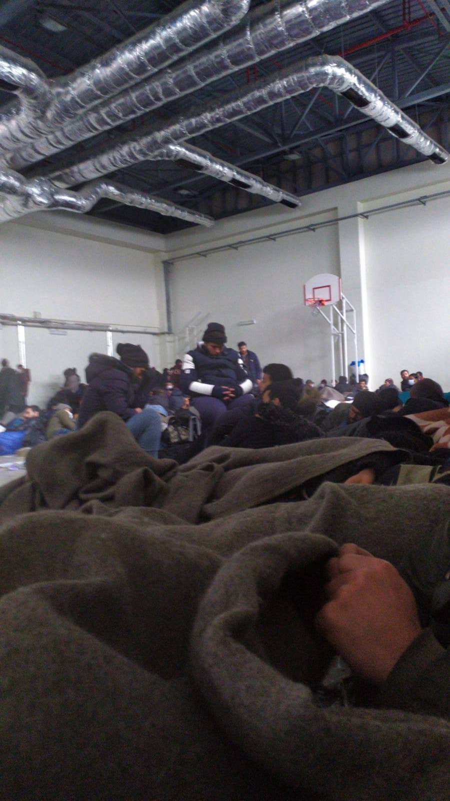

### AYS Daily Digest 27/03/2020: The end of a cynical game
#### Turkish authorities evict poeple from Pazarkule // Inhumane punishment in Bosnia // Greece introduces measures to tackle Covid\-19 and ignores human rights // The number of attacks on protected people remains on a high level in 2019

](assets/3c42cd42b56d/1*t6LHgBSJKpOXhvPs2BbMcg.jpeg)

The Pazarkule jungle has been evicted\. Photo: Twitter/ [@AntonisRepanas](https://twitter.com/AntonisRepanas/status/1243214942968446977)
### Feature: The end of a cynical game

The jungle camp of Pazarkule is history\. Last night, the remaining people were transferred either to Istanbul or to nearby camps to be held in quarantine for the next two weeks\. Reportedly, in the end there were between 1,500 and 5,800 people\. Several sources, including direct contacts of AYS, described the procedure as inhumane, after they had suffered from hunger over the last several days due to the absence of any NGOs or volunteers\. During the eviction, police burned down the tents\.

The AYS source writes:

> If we enter the rooms they take the phones from us and everything\. 

People cannot understand what is happening to them and why they have now been imprisoned after being misused for a cynical political game\. “We told them we wouldn’t do anything\. We came to the border with your will\. Why do you do this to us,” is one of the messages AYS was sent\. From officials the people hear that even they do not know what to do now\. Reportedly the Turkish interior minister said that after the risk of being infected is over they are free to go back to the border\.

One of the new shelters\. Source: Private

Refererring to Germany’s Federal Intelligence Service \(BND\), Spiegel [reports](https://www.spiegel.de/politik/deutschland/fluechtlinge-tuerkei-steuerte-laut-bnd-ansturm-auf-griechenlands-grenze-a-00000000-0002-0001-0000-000170213666) that clashes between people and border guards at the Turkish\-Greek border were organized by the Turkish authorities\. Reportedly they forced people in buses to go to the border\. It is also said that Turkish forces were among the crowd\. While Turkish representatives deny such accusations, AYS has also received footage suggesting that Turkish people were directly involved in the scenes, encouraging people to be violent, at a time when no one was allowed to enter the site\.
### Bosnia

Following the transfer of several people to a tent camp in Lipa without proper care, Amnesty’s Europe Deputy Director Massimo Moratti criticized the action: “Confining people in potentially harmful conditions cannot be justified on the grounds of public health\.”

Additionally, there are [reports](https://www.facebook.com/permalink.php?story_fbid=1141705329516781&id=100010319738101) , that IOM in Bira does not provide food for some people as punishment\. At the same time, people are not allowed to enter local shops to buy food\. In other camps, freedom of movement is restricted with limited access for volunteers, officially due to Covid\-19\.

### Greece

The Greek government has announced six new measures to tackle the Coronavirus in camps on the Aegean islands, journalist Giorgos Christides [reports](https://twitter.com/g_christides/status/1243519304080994306?fbclid=IwAR3CZAw7N75wzgrrU1282Y32gv4DsXjtj027Y1UBPe0i20fsFiwhocrEceQ) :
- ATMs to be installed within camps; payment of monthly allowance to asylum seekers postponed until this happens
- Vendors selling essentials to asylum seekers to be set up within the camps, in order to further restrict the need for movement
- Twelve health stations installed in camps on Lesvos, Chios and Samos\. Kos and Leros to follow with two each
- Special quarantine areas have been designated in case of a coronavirus outbreak
- Health stations to be bolstered with equipment and personnel
- Movements outside the camps due to final asylum decision will be suspended until May 31

However, the conditions in the camp itself remain dire and inhumane\. Several organisations are urging the government to close the camps and take especially vulnerable people and risk groups to a safer space\.

■■■■■■■■■■■■■■ 
> **[MSF Sea](https://twitter.com/MSF_Sea) @ Twitter Says:** 

> > "There are no realistic #COVID_19 prevention or response plans for us, our brothers &amp; sisters living in the camps on the islands &amp; mainland. We are worried."-Survivors² is a self-advocacy group of asylum seekers living in Greece &amp; have experienced torture.
[msf.gr/en/node/6409?f…](https://msf.gr/en/node/6409?fbclid=IwAR2wYGyEDm43GzacmRRZWHU8gkLbTQCp-aPPGHWhkmPcOkqOiJ1QfP-izzk) 

> **Tweeted at [2020-03-27 16:25:35](https://twitter.com/msf_sea/status/1243574901073641472).** 

■■■■■■■■■■■■■■ 

Volunteers of Movement On The Ground set up dispensers in the Samos camp to improve hygiene there and highlighted the importance of clean hands to the residents\.

### Europe

The European Commissioner for Human Rights has [called](https://www.coe.int/en/web/commissioner/-/commissioner-calls-for-release-of-immigration-detainees-while-covid-19-crisis-continues) on the member states of the Council of Europe to release as many rejected asylum seekers as possible in the face of the Covid\-19 pandemic: “Many member states have had to suspend forced returns of persons no longer authorised to stay on their territories, including so\-called Dublin returns, and it is unclear when these might be resumed\. Under human rights law, immigration detention for the purpose of such returns can only be lawful as long as it is feasible that return can indeed take place\.

Meanwhile, the EU member states have replaced Operation Sophia with a monitoring mission\. Instead of rescueing people from shipwrecks, they now only want to control the UN arms embargo on Libya\. This “marks the continuation of a worrying trend whereby surveillance & border control is prioritised over saving lives”, [comments](https://twitter.com/MSF_Sea/status/1243587693344325634?fbclid=IwAR0vuEXYqShnxiTDjYtlp4J8_NEYQpMAWiBMrmRLjUV4C6ILYSTrFsCfp7Q) MSF\.
### Malta

■■■■■■■■■■■■■■ 
> **[Alarm Phone](https://twitter.com/alarm_phone) @ Twitter Says:** 

> > Today we launch the Free #ElHiblu3 campaign! 3 teenagers are accused of several crimes, incl. terrorism, for protesting the return of 108 migrants to inhumane conditions in #Libya. #Malta drop all charges! Resisting illegal #push-backs is not a crime! 

🔶[elhiblu3.info](https://elhiblu3.info/) https://t.co/RFRJl42cJx 

> **Tweeted at [2020-03-27 08:57:59](https://twitter.com/alarm_phone/status/1243462260544192512).** 

■■■■■■■■■■■■■■ 

### Italy

No Cpr e no frontiere — FVG [published](https://www.facebook.com/groups/1652972374920129/permalink/2458513814365977/) a video showing the horrific conditions at the CPR Gradisca, where a first Corona infection occurred recently\. There are rumours of a second case, of a person who has been in contact with other inmates\.

■■■■■■■■■■■■■■ 
> **[InfoMigrants](https://twitter.com/InfoMigrants) @ Twitter Says:** 

> > Dozens of Italian NGOs have published an open letter, urging the government to adopt measures to protect migrants, asylum seekers, and the homeless during the #COVID19 emergency. 

One of their requests: To shut down large reception centers. 
[infomigrants.net/en/post/23715/…](https://www.infomigrants.net/en/post/23715/coronavirus-in-italy-ngos-want-more-protection-for-migrants) 

> **Tweeted at [2020-03-27 16:57:00](https://twitter.com/infomigrants/status/1243582806074130433).** 

■■■■■■■■■■■■■■ 

Certificates such as residence permits or citizenship requests that were supposed to expire between January 31 and April 15 will have their validity extended until June 15 amid the [\#coronavirus](https://www.facebook.com/hashtag/coronavirus?hc_location=ufi) emergency, InfoMigrants [reports](https://twitter.com/InfoMigrants/status/1243549838903357441?fbclid=IwAR0fdkq21eHNdGnUT7baD3ZNQhnCI5YzGAea6X0nvqEz7uXdUw14TTY8Id8) \.

### France

Volunteers have published a map with current food distribution points in Paris\.

### Germany

The number of attacks on people under protection in Germany is high, [according](https://www.dw.com/en/germany-more-than-1600-crimes-targeted-refugees-and-asylum-seekers/a-52935715) to DW\. Authorities speak of 1,600 cases in 2019, including children, and 229 people were injured\. In some 130 cases, a shelter itself was attacked\. The greatest number of crimes by far were committed by right\-wing people\.

**Find daily updates and special reports on our [Medium page](https://medium.com/are-you-syrious) \.**

**If you wish to contribute, either by writing a report or a story, or by joining the info gathering team, please let us know\.**

**We strive to echo correct news from the ground through collaboration and fairness\. Every effort has been made to credit organisations and individuals with regard to the supply of information, video, and photo material \(in cases where the source wanted to be accredited\) \. Please notify us regarding corrections\.**

**If there’s anything you want to share or comment, contact us through Facebook, Twitter or write to: areyousyrious@gmail\.com**

_Converted [Medium Post](https://medium.com/are-you-syrious/ays-daily-digest-27-03-2020-the-end-of-a-cynical-game-3c42cd42b56d) by [ZMediumToMarkdown](https://github.com/ZhgChgLi/ZMediumToMarkdown)._
