### **AYS Special from Lesvos: COVID\-19 and an island bursting at the seams**
#### COVID\-19 reaches Greece with Lesvos at a breaking point\. In the face of a pandemic, it is essential for authorities, local communities, asylum seekers, and NGOs to work together closely in order to contain the risk of transmission\. Absent productive collaboration between them, an outbreak could visit untold damage on the island\.

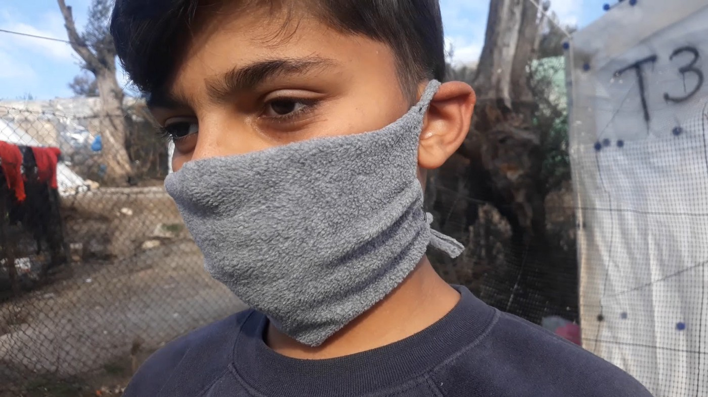

A Moria resident wearing a makeshift face mask made from a UNHCR blanket in late March\. Photo: Milad Ebrahimi, ReFOCUS Media Labs

On Saturday, March 7, after weeks of rising tension against NGOs on the Greek island of Lesvos, a [fire ripped through the One Happy Family](http://www.ekathimerini.com/250368/article/ekathimerini/news/fire-destroys-warehouse-at-lesvos-migrant-center) community center, [destroying the School of Peace](https://www.facebook.com/InternationalSchoolOfPeace/posts/1246924999031035) and [damaging OHF’s main hall](https://www.facebook.com/OHFLesvos/posts/881383135638910) \. The weeks since this incident have passed like a whirlwind\. COVID\-19 took the world by storm, threatening people worldwide but especially those living unsanitary places, such as urban slums or [overcrowded refugee camps](https://www.npr.org/sections/goatsandsoda/2020/03/11/814473308/opinion-refugees-are-especially-vulnerable-to-covid-19-dont-ignore-their-needs) where density and poor sanitation make social distancing and handwashing [all but impossible](https://www.nytimes.com/2020/03/19/world/middleeast/syria-coronavirus-idlib-tents.html) \. Additionally, on March 16, as fear of COVID\-19 was taking hold in Lesvos, yet another fire broke out in the Moria refugee camp, [killing a child](https://www.theguardian.com/world/2020/mar/16/child-killed-in-lesbos-refugee-camp-fire) \.

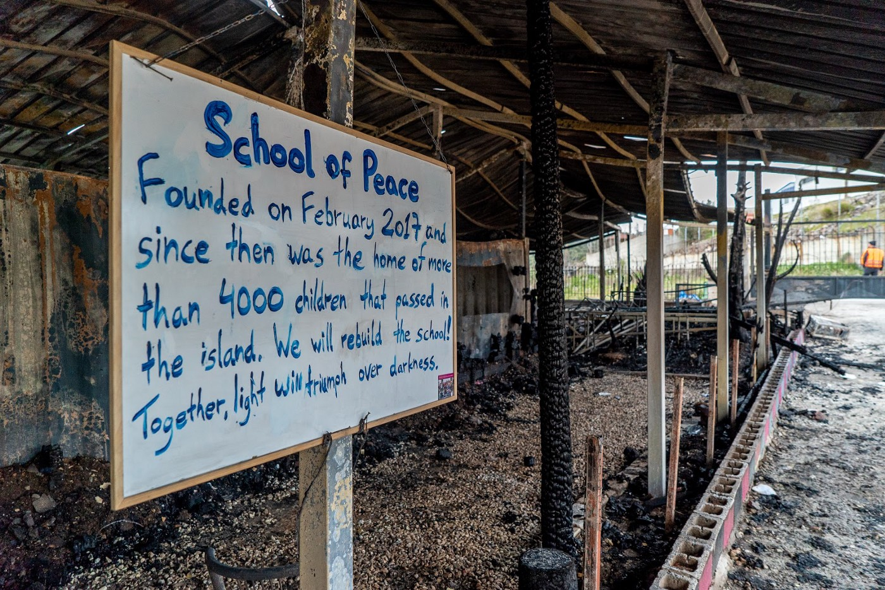

The School of Peace the morning after the fire\. Photo: Douglas F\. Herman

COVID\-19 reaches Greece with Lesvos at a breaking point\. In the face of a pandemic, it is essential for authorities, local communities, asylum seekers, and NGOs to work together closely in order to contain the risk of transmission\. Absent productive collaboration between them, an outbreak could visit untold damage on the island\.
### _Escalation_

Since the beginning of 2020, tensions have risen dramatically in Lesvos\. After promising to overhaul the country’s migration policy and relieve its heavily burdened Aegean islands, Greece’s new government has struggled to deliver\. It promised 10\.000 deportations within a year, but has carried out [less than 500](https://data2.unhcr.org/en/situations/mediterranean/location/5179) \. It promised to decongest the islands, but under its watch their asylum seeker population doubled from [20\.000](https://data2.unhcr.org/en/documents/download/70445) to [42\.000](https://data2.unhcr.org/en/documents/download/74693) \. It promised greater solidarity from the EU, but after [months of stonewalling](https://apnews.com/2f1c762f41c143e9833aa00619c13715) received [only negligible](https://www.reuters.com/article/us-syria-security-greece-berlin/berlin-to-take-in-children-from-greek-refugee-camps-rtl-idUSKBN20X0RF) — and [ultimately rescinded](https://www.dw.com/en/coronavirus-strands-refugee-children/a-52864442?maca=en-Twitter-sharing) — relocation commitments\.

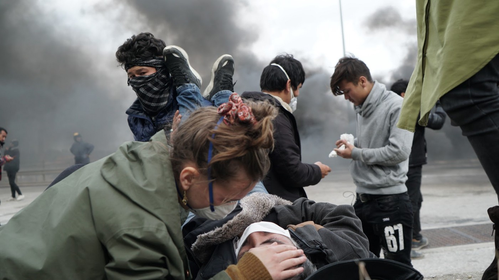

Asylum seekers being tear\-gassed outside of Mytilene during a demonstration February 3\. Photo: Douglas F\. Herman

Five years of frustrations [finally erupted in Lesvos in February 2020](ays-special-lesvos-well-beyond-the-brink-this-is-what-we-know-so-far-7c11873e12f8) , with Greek authorities, local islanders, and asylum seekers and NGOs all diagnosing the same problem, but demanding different and incompatible solutions\. At the end of the month, Turkey [struck a match on dry kindling](https://www.aljazeera.com/indepth/features/greek-refugee-hotspot-breaking-point-turkey-opens-gate-200303171005788.html) when it announced that it would [open its borders to asylum seekers trying to enter Europe](https://www.independent.co.uk/news/world/middle-east/turkey-border-open-refugees-migrants-greece-europe-syria-strike-a9364696.html) \. As arrivals spiked at Greece’s land and sea borders, tensions spiked as well\. Locals set up roadblocks around Lesvos, blocking access to Moria to aid workers, journalists, and even Greek authorities\.

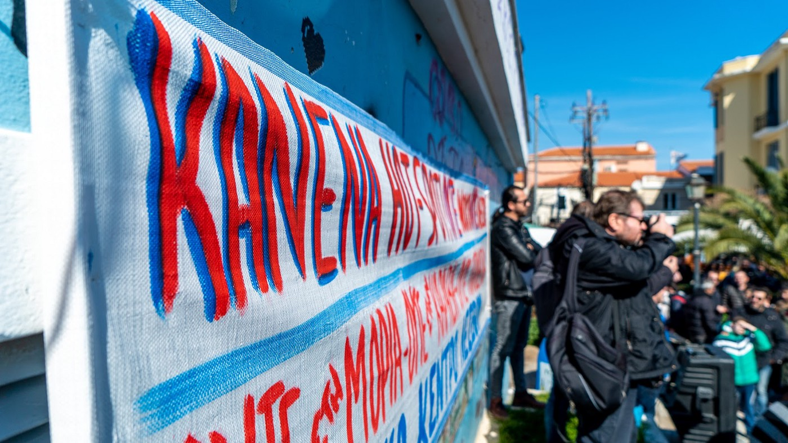

Community members demonstrating at Sappho Square during a general strike in late February\. Photo: Douglas F\. Herman

Though the individuals manning these roadblocks were diverse and many held valid grievances, their resistance was quickly hijacked by extremist groups [targeting aid workers and journalists](https://www.spiegel.de/politik/ausland/rechte-gewalt-auf-lesbos-wir-wurden-verpruegelt-gejagt-schikaniert-a-84a7667a-703a-46cc-9a06-92cdb0222edc?sara_ecid=soci_upd_KsBF0AFjflf0DZCxpPYDCQgO1dEMph) with chilling acts of violence\. In the following weeks, individuals at checkpoints were quoted [celebrating that they had taken back control](https://www.nytimes.com/2020/03/07/world/europe/greece-turkey-migrants.html?referringSource=articleShare) and hoping that as a result NGOs would leave and asylum seekers would stop coming\.

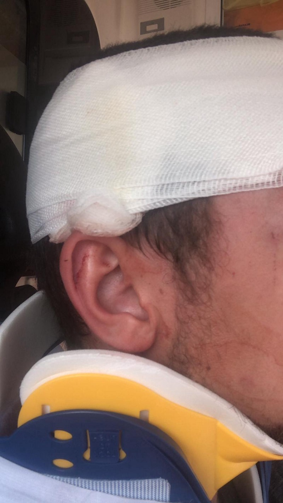

Head wound sustained by a journalist attacked while reporting in Lesvos in early March\. Photo submitted anonymously by the victim\. Damage to a car rented by volunteers in Lesvos and assaulted in late February\. Photo submitted anonymously by the aggrieved party\.

This violence was far from universal or representative of Lesvos\. Indeed, as tensions rose, the [municipal council of Skala Sikaminea](https://www.lesvosnews.net/articles/news-categories/koinonia/apo-ti-sykamnia-dynato-minyma-anthropismoy-gia-ti-diaheirisi-toy) in northern Lesvos and the [Union of Medical Professionals of Lesvos](https://www.lesvosnews.net/articles/news-categories/anakoinoseis-foreon/oi-giatroi-esy-lesboy-gia-tin-apanthropi-symperifora) denounced the climate of fear and violence that had gripped the island\. Yet the damage was done\. Fearing for their safety, multiple NGOs evacuated from Lesvos in late February\. Though OHF and the School of Peace stayed put, they soon had to shut down anyway due to COVID\-19 concerns\.
### _One Happy Family and the School of Peace_

One Happy Family is one of the [longest\-standing community centers in Lesvos](https://www.thenational.ae/world/europe/refugees-stranded-on-lesbos-find-solace-in-community-space-1.865895) \. Over the last three years, hundreds of asylum seekers have accessed myriad services there\. A barbershop\. A community garden\. A gym\. A kindergarten\. A library\. A legal clinic\. A women’s space\. A café\. The School of Peace, for its part, has [served thousands of children and adults](https://www.seedsofpeace.org/refugees-lesbos/) since its launch in February 2017, offering language, numeracy, and peace education\.

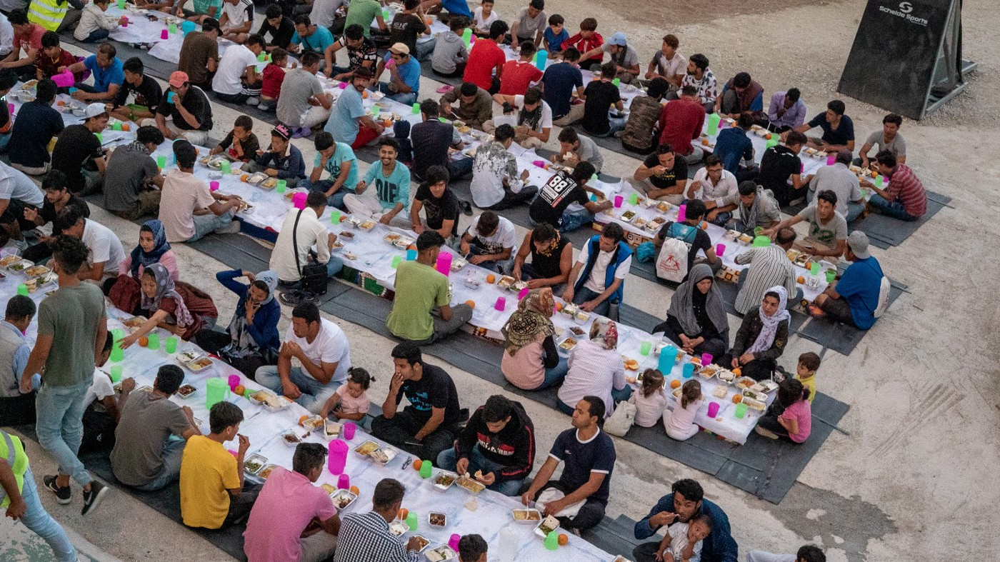

Ifthar dinner at OHF during Ramadan in May 2019\. Photo Credit: Mohammed Hennawi, ReFOCUS Media Labs

While [providing vital support to asylum seekers](https://www.youtube.com/watch?v=kAWIdvTxN-o&feature=youtu.be) , OHF and the School of Peace have also absorbed pressure from the rest of the island over the years\. This has yielded specific, numeric value to Lesvos: on any given day, 500 to 1\.000 asylum seekers spending their day at OHF, with no repercussion anywhere else on the island\. On any given day, 100 to 150 children learning, healing, and preparing themselves to transition to formal education as their asylum processes advance\.

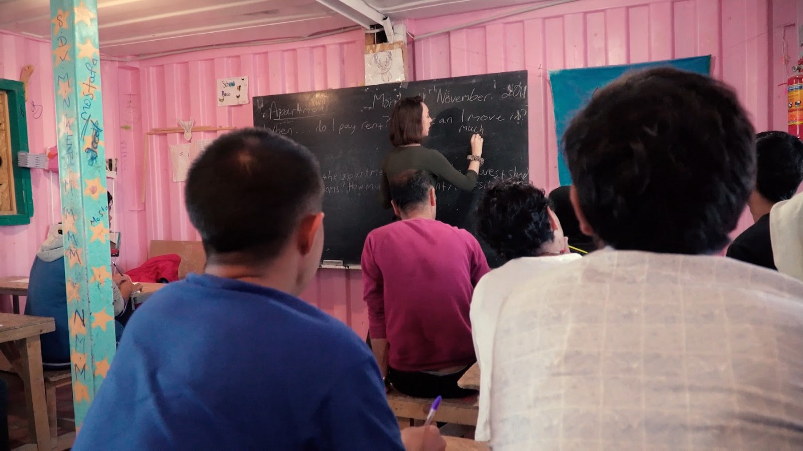

English lessons at the School of PeacePhoto Credit: @s\.ahmad\_ebrahimi, ReFOCUS Media Labs

It was unlikely that the School of Peace — a simple structure without high\-voltage electrical connections or gas mains — would ever burn down accidentally\. Indeed, on Saturday March 21, authorities [confirmed that the fire was an act of arson](https://www.swissinfo.ch/eng/one-happy-family_arrests-made-over-lesbos-refugee-centre-blaze/45633316) \. Amid frenzied COVID\-19 coverage, however, the news barely registered in the media\.

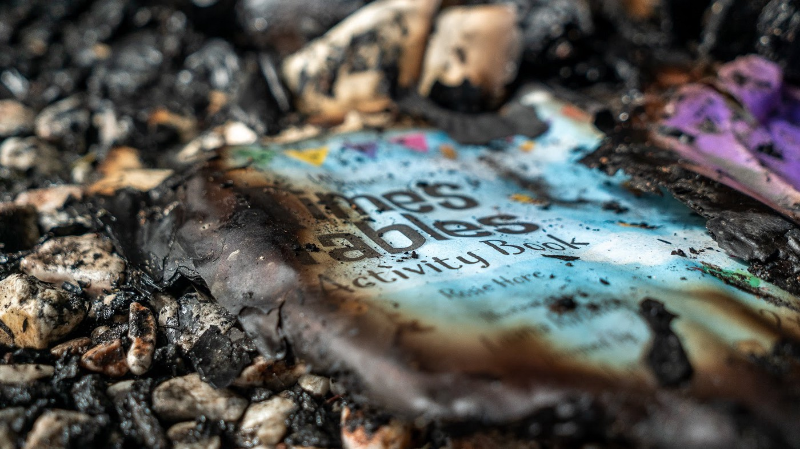

A children’s exercise book among the ashes of the School of Peace\. Photo: Douglas F\. Herman
### _COVID\-19 Arrives in Greece_

Greece’s [first COVID\-19 case](http://www.ekathimerini.com/249951/article/ekathimerini/news/greece-confirms-first-coronavirus-case-in-thessaloniki) was reported on February 26 in Thessaloniki\. As the disease spread, Greek authorities were quick to limit travel and impose social distancing measures\. These include measures to isolate refugee camps from local communities: as of March 18, [only 100 of Moria’s 20\.000 residents are allowed out of the camp at a time, and only between 7:00 and 19:00](http://legalcentrelesvos.org/2020/03/19/covid-19-paves-way-for-mass-detention-of-migrants/) \. NGOs and all non\-essential camp management personnel have been barred from entering the camp until further notice\.

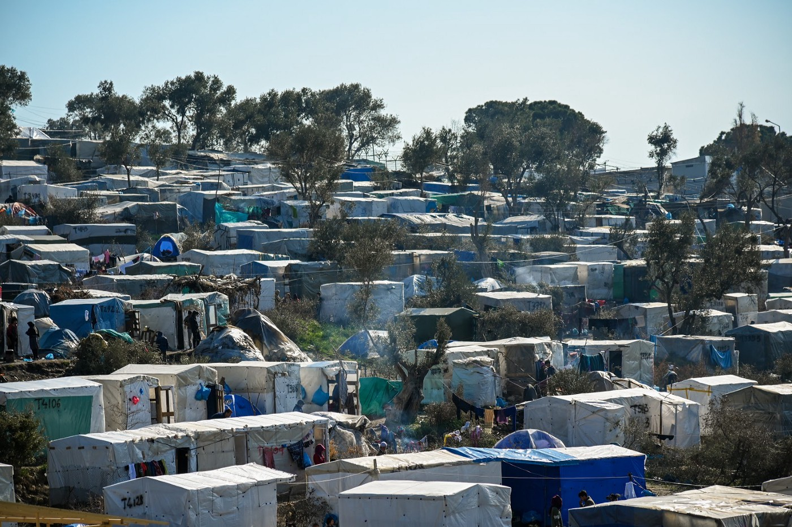

Makeshift housing in Moria’s overflow camp in the adjacent olive groves\. Photo : Ahmad Rezai, ReFOCUS Media Labs

Since February 27, Greece’s caseload has grown to over 1\.000\. This includes two known cases in Lesvos: a [supermarket employee in the town of Plomari](http://www.ekathimerini.com/250440/article/ekathimerini/news/lesvos-supermarket-closed-after-employee-tests-positive-for-covid-19) , and a [local resident recently returned from a holiday in Thailand](http://nealesvou.gr/deytero-epivevaiomeno-kroysma-koronoioy-sti-lesvo/?fbclid=IwAR0u5t0of4TI-drTJHyT0yTZwS4bC1a8hq4HdVq7qUw7Z-MtJi-NkMJumz4) \. Should COVID\-19 break out in Moria, its propagation in the camp is [all but certain](https://msf-seasia.org/news/18831) \. Despite renewed demands from [NGOs](https://www.hrw.org/news/2020/03/24/greece-move-asylum-seekers-migrants-safety) , [medical doctors](https://en.sosmoria.eu/) , and [public health experts](https://evacuate-moria.com/) that Moria be evacuated to prevent an outbreak, as of this writing no such measures have been announced\.

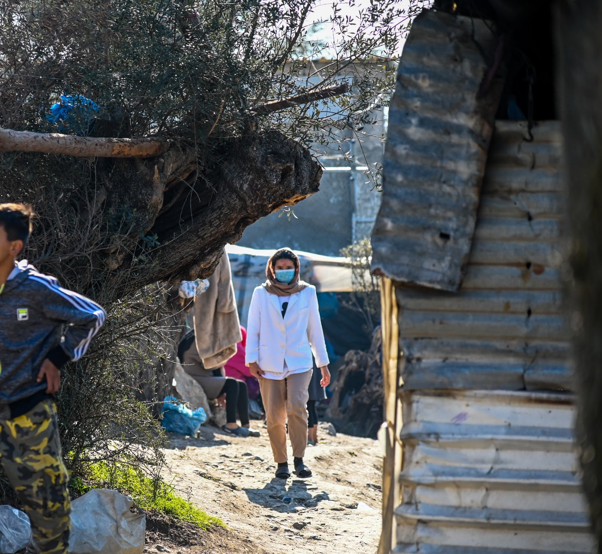

A resident of Moria walking through the Olive Grove in late March\. Photo Credit: Ahmad Rezai, ReFOCUS Media Labs\.

Moria hosts nearly 20\.000 people in an area about one square mile — roughly the same population density as Singapore — in [abysmal conditions](https://www.theguardian.com/global-development/2020/feb/11/un-calls-for-urgent-evacuation-of-lesbos-refugee-camp) \. In January of 2020 field researchers counted [90 toilets and 90 showers inside of Moria, and another 30 sanitation units](https://rsaegean.org/en/moria-nightmare/) in the adjacent overflow camps\. Food rations distributed [fall short of caloric needs, compromising the growth and immune systems](https://www.independent.co.uk/news/world/europe/greece-migrants-refugee-crisis-tourists-lesbos-greek-islands-a9355161.html) of its residents\. For years, doctors in Moria have struggled to contain a host of environmentally\-driven health issues: [respiratory illnesses, scabies, lice](https://www.theguardian.com/global-development/2020/mar/11/lesbos-coronavirus-case-sparks-fears-for-refugee-camp-moria) \. Moria was toxic before COVID\-19, and will remain toxic even if COVID\-19 passes it by\.

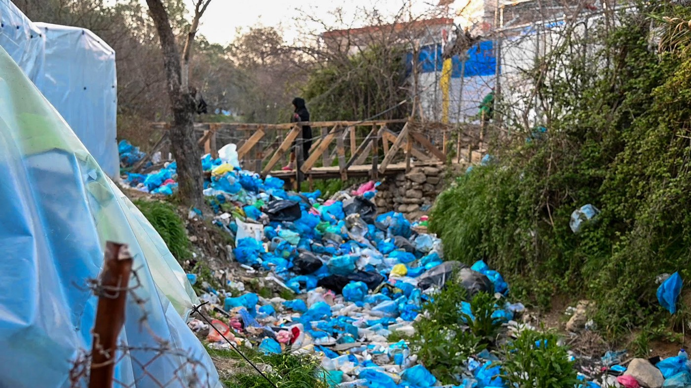

Accumulated garbage in a creek between the Moria camp and the overflow area\. Photo Credit: Ahmad Rezai, ReFOCUS Media Labs\.

On March 16, as Moria was bracing for COVID\-19, a [fire broke out in a family’s tent](https://www.reuters.com/article/us-europe-migrants-greece-lesbos-fire-idUSKBN213253) , burning two housing containers and several tents, and killing a 6\-year old girl\. Firefighters [struggled to reach the site](https://www.stonisi.gr/post/7681/fwtia-sto-kyt-realtime-video) as they could not maneuver their vehicles through the overcrowded camp\. This was the [second deadly fire in Moria](https://www.theguardian.com/world/2019/oct/05/the-truth-about-the-fire-in-greeces-notorious-refugee-camp) in less than six months\.

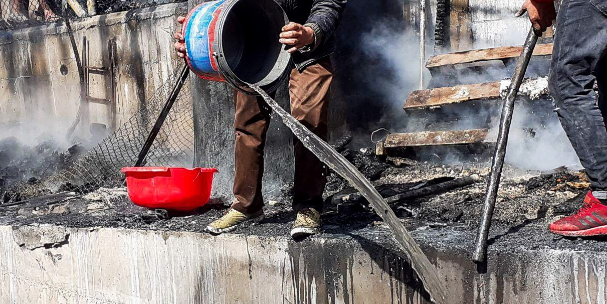

Residents of Moria putting out the last embers of the March 16 fire\. Photo Credit: A\.L\., ReFOCUS Media Labs

On March 28, local authorities in Lesvos declared that a 20\-year old Afghan man, who had been living in Moria for just over a year, [died of an overdose of sedatives](https://www.stonisi.gr/post/7982/pethainontas-sth-moria) \. As of this publication, authorities have not yet ruled whether his death was deliberate or accidental\. This is the fifth premature death in Moria this year, following [two fatal stabbings in January](http://www.ekathimerini.com/248573/article/ekathimerini/news/tension-at-moria-camp-following-second-death) , an [apparent suicide in Moria’s pre\-removal detention facility late January](http://legalcentrelesvos.org/2020/01/19/call-for-accountability-apparent-suicide-in-moria-detention-centre-followed-failure-by-greek-state-to-provide-obligated-care/) , and the the deadly fire of March 16\.

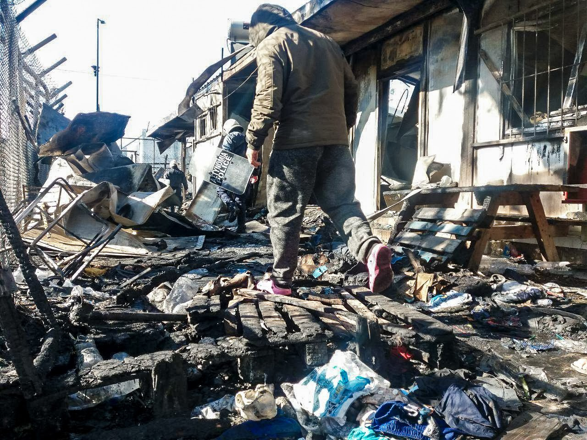

A resident of Moria walking through the site of the March 16 fire\. Photo Credit: M\.A\., ReFOCUS Media Labs

If COVID\-19 does reach Moria, it will reach a community whose physical and mental health are thoroughly compromised, whose [resilience could not stretch any thinner](https://www.irishtimes.com/news/world/europe/european-doctors-warn-of-covid-19-disaster-for-refugees-on-lesbos-1.4214187) \.
### _Bursting at the Seams_

For years, [aid workers](https://opentheislands.wordpress.com/statement/) , [public health agencies](https://www.independent.co.uk/news/world/europe/moria-refugee-camp-closure-greece-lesbos-deadline-waste-dangerous-public-health-a8531746.html) , [local authorities](http://www.ekathimerini.com/224330/article/ekathimerini/news/lesvos-mayor-files-suit-over-conditions-at-moria-migrant-camp) , and [EU officials](https://www.theguardian.com/commentisfree/2019/dec/18/europe-humanitarian-crisis-brussels-refugees) have been denouncing conditions in Greece’s island ‘hotspots\.’ For years, they have called for decongesting the islands, for swifter refugee status determination proceedings, for more support to the Greek asylum service, and for the relocation of asylum seekers across Europe\.

For years, EU leaders have [failed to step up](https://www.dw.com/en/coronavirus-strands-refugee-children/a-52864442?maca=en-Twitter-sharing) , leaving the task of providing for asylum seekers to Greece’s austerity\-battered authorities, and to a loose coalition of NGOs\. In the event of a COVID\-19 outbreak, capable and experienced providers will be more needed than ever\. Cooperation between authorities and local communities, and NGOs and asylum seekers, will be crucial\.

However, COVID\-19 catches Lesvos with its seams already close to bursting\.

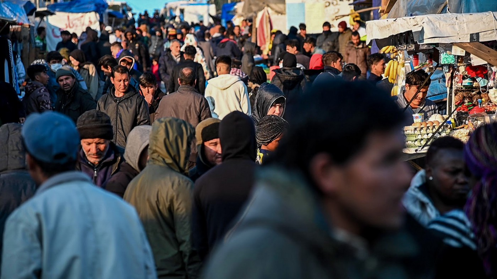

Crowding at Moria camp\. Photo Credit: Ahmad Rezai, ReFOCUS Media Labs

Mainstream epidemiology tells us that only 20% of those who become ill with COVID\-19 will require hospitalization\. COVID\-19’s fatality rate is not just a function of the disease itself, but also of the pre\-existing health of those who catch it, and of the availability of hospital beds and respirators for those who require hospitalization\.

Health services in Moria, however, are [woefully insufficient for a COVID\-19 outbreak](https://www.theguardian.com/world/2020/feb/09/moria-refugee-camp-doctors-story-lesbos-greece) \. The camp is served by 3 daytime walk\-in clinics, with only standby capacity at night and on weekends\. There are only [six intensive care beds in Lesvos](https://www.greens-efa.eu/files/assets/docs/d_2020_11153_lopez_aguliar_crisis_coordination_committee_on_grece_covid.pdf) \. In normal times, Mytilene’s hospital and ambulance services can [hardly keep up](https://rsaegean.org/en/serious-gaps-in-the-care-of-refugees-in-greek-hotspots-vulnerability-assessment-system-is-breaking-down/) with the Moria population’s health needs\.

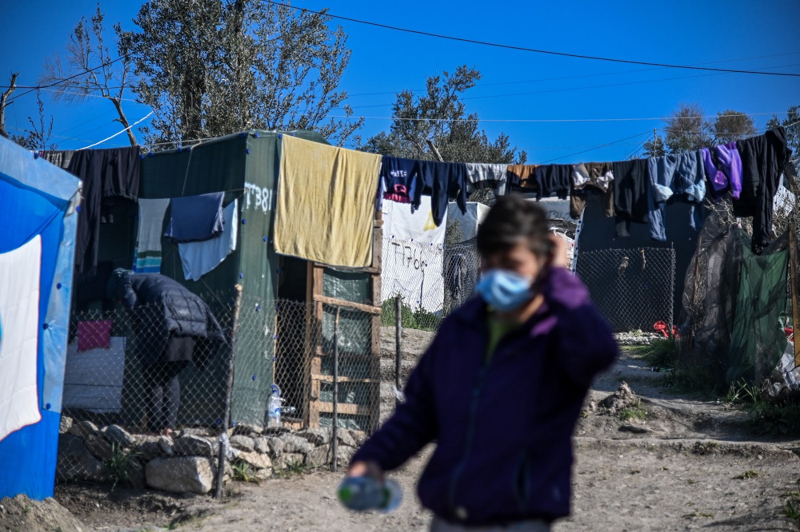

A Moria resident walking through the overflow camp\. Photo Ahmad Rezai, ReFOCUS Media Labs

This is dangerous not just for Moria’s residents, but for the whole of Lesvos\. Should COVID\-19 break out in Moria, it could easily spread back to the island’s population as camp management employees or police officers enforcing mobility limits come into contact with virus carriers\.

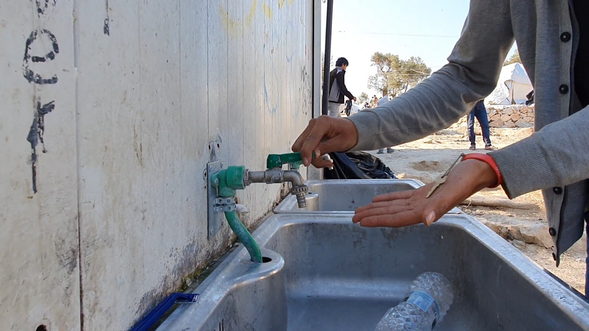

An open water tap in Moria, but no water spewing forth\. Photo : Mustafa Nadri, ReFOCUS Media Labs

Though NGOs are distributing hygiene products as best as they can — as this article is being written, _Because We Carry_ , working with _Movement on the Ground_ and _EuroRelief,_ are [distributing soap](https://www.facebook.com/Becausewecarry/posts/1238934786305126) to everyone in Moria, while _Attika Human Support_ is preparing an additional distribution of 20\.000 bars of soap — water provision in Moria is insufficient, and the available taps do not operate predictably\. Should COVID\-19 fester in Moria, it could extend the amount of time it takes for Lesvos’ overall population to overcome an outbreak\.

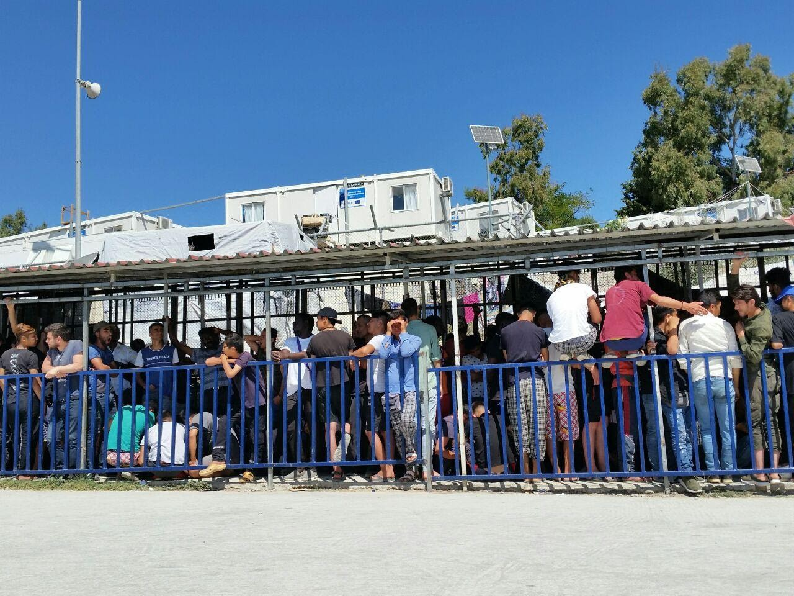

Crowding in line for food distribution in Moria\. Photo Credit: Photo Credit: Mustafa Nadri, ReFOCUS Media Labs

As for those living in Moria, the potential outcomes are frightening\. Though any outbreak would be a challenge, its scale would hinge on whether an outbreak in Moria emulated [Ireland’s fatality rate of ~1%, or Italy’s rate of ~10%](https://ourworldindata.org/coronavirus#what-do-we-know-about-the-risk-of-dying-from-covid-19) — out of a population of 20\.000\.
### _Taking Stock and Moving Forward_

The situation in Lesvos was dire before COVID\-19 arrived in Greece\. In the shadow of a pandemic, it could [become catastrophic](https://slate.com/news-and-politics/2020/03/refugees-coronavirus-greece.html) \. If COVID\-19 reaches Moria, close collaboration between NGOs on the island and local medical services will be absolutely essential — which is why it is essential to reflect on the reasons for the recent tension and violence on the island\.

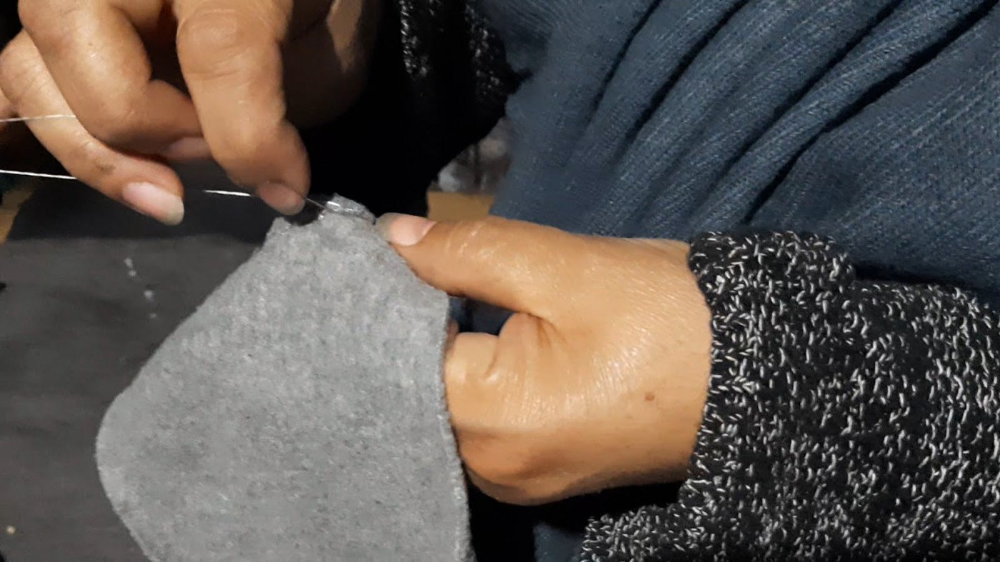

A Moria resident sewing a makeshift face mask from UNHCR blankets in late March\. Photo: Yaser A\., ReFOCUS Media Labs

If two months of escalating tensions have shown us anything, it is that we can neither condemn, nor denounce, nor destroy our way out of the grievous situation in Lesvos\. Instead, we must try to understand our way out of it\. It is understandable for communities in Lesvos to feel abandoned by the European Union\. It is understandable for them to yearn for the security and predictability of their lives prior to 2015\.

Yet channelling this abandonment and yearning into intimidating aid workers — the sole European constituency that has not abandoned these communities — solves nothing\. It was never the purpose of OHF or the School of Peace to resolve Europe’s migration crisis\. Resource\-limited NGOs cannot provide the solutions that the EU owes to Lesvos\. They can only alleviate the suffering of asylum seekers and moderate their impact on local communities\.

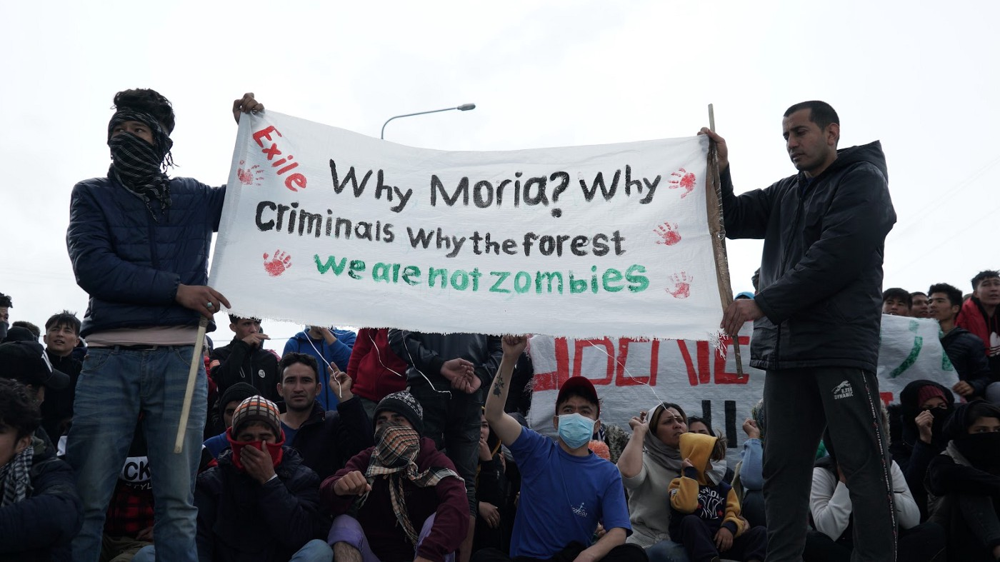

Moria residents protesting outside of the camp on February 3\. Photo Credit: Douglas F\. Herman

Indeed, should aid workers all leave at once, asylum seekers will have nowhere to turn for support but to local communities — and no experienced responders to moderate the exchange\. In the short term, hustling NGOs out of Lesvos may satisfy the anger of the island’s most combative elements\. In the long term, however, it will only increase the already heavy burden they bear, at a time when COVID\-19 [threatens to multiply](https://www.bmj.com/content/368/bmj.m1213.full?ijkey=Q5HCsYyxFFc8Eyy&keytype=ref) the weight of this burden\.

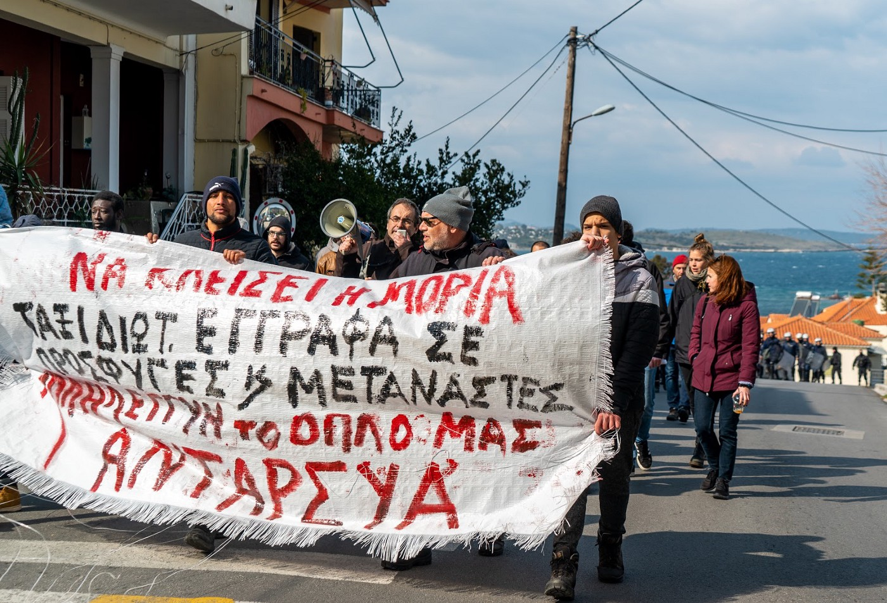

Local community members protesting during a February general strike\. Photo Credit: Douglas F\. Herman

If COVID\-19 breaks out in Moria, the consequences will be severe\. If Lesvos’ NGOs are excluded or disempowered from managing an outbreak, the consequences will be unimaginable\. If necessity is the mother of invention, then now is the moment to invent what just a few weeks ago seemed impossible: for Lesvos’ authorities, communities, and asylum seekers and NGOs to find common ground and contain COVID\-19 together\.

**_This special report is written by Joel Hernàndez, who serves as the Head of Advocacy and Development at Refugee Trauma Initiative, an NGO providing psychosocial support to displaced families in Greece\._**

**Find daily updates and special reports on our [Medium page](https://medium.com/are-you-syrious) \.**

**If you wish to contribute, either by writing a report or a story, or by joining the info gathering team, please let us know\.**

**We strive to echo correct news from the ground through collaboration and fairness\. Every effort has been made to credit organisations and individuals with regard to the supply of information, video, and photo material \(in cases where the source wanted to be accredited\) \. Please notify us regarding corrections\.**

**If there’s anything you want to share or comment, contact us through Facebook, Twitter or write to: areyousyrious@gmail\.com**

_Converted [Medium Post](https://medium.com/are-you-syrious/ays-special-from-lesvos-covid-19-and-an-island-bursting-at-the-seams-691475481680) by [ZMediumToMarkdown](https://github.com/ZhgChgLi/ZMediumToMarkdown)._
