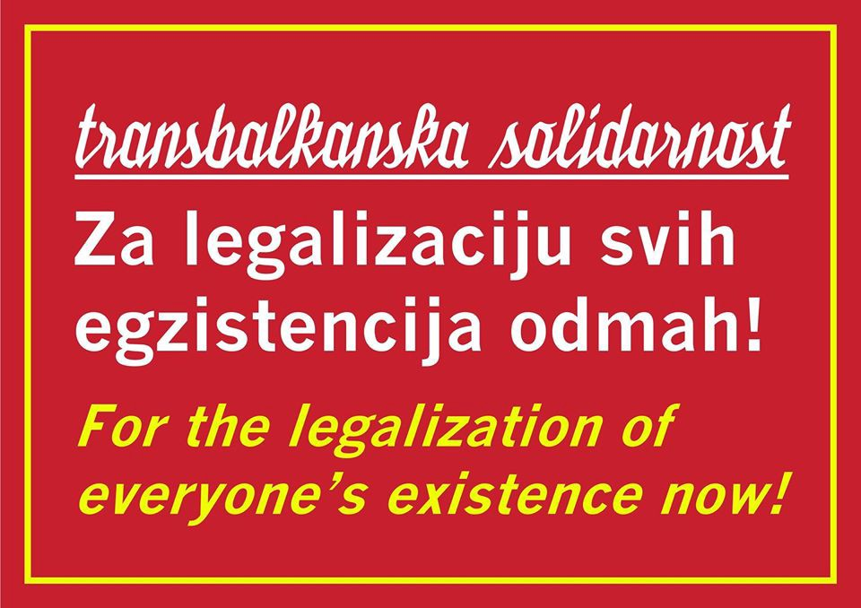
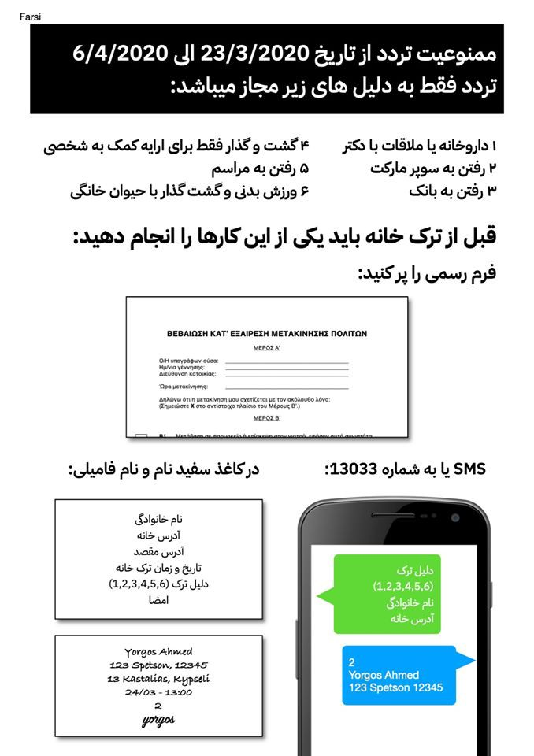
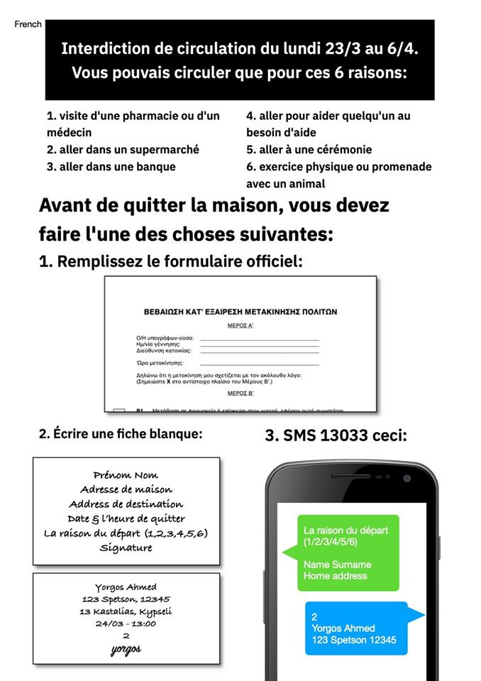
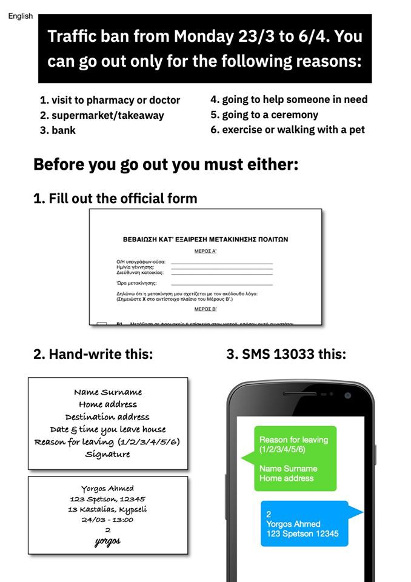
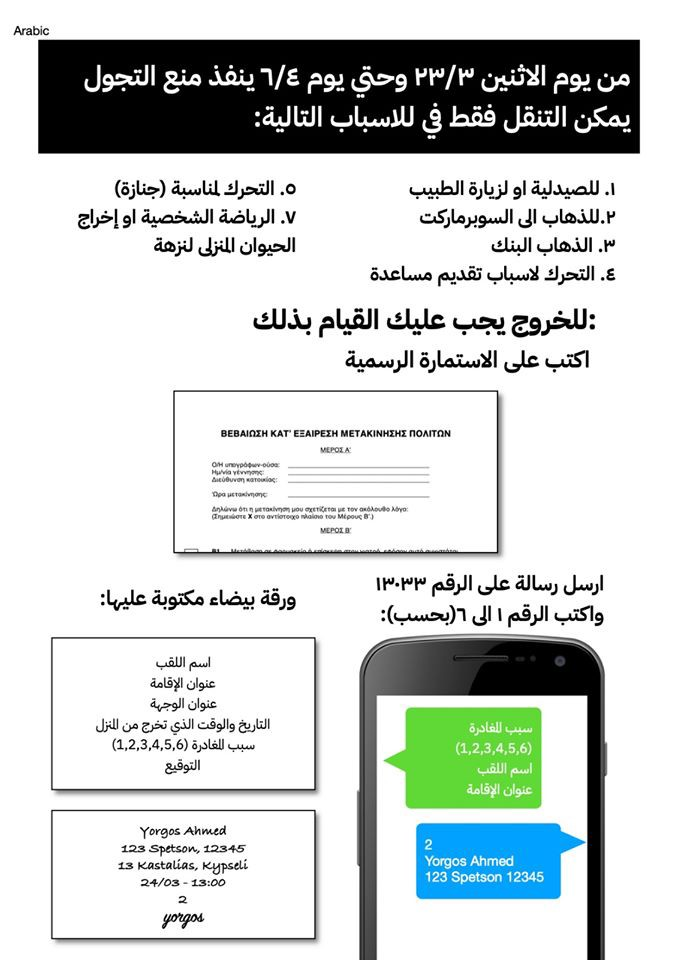
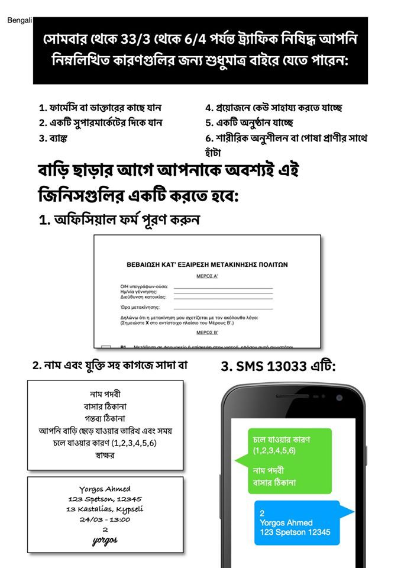

### AYS Daily Digest 30/03/20 — Experts Funded by EU Sharply Criticise EU\-Policies

Corona\-Updates from Afghanistan, Libya, Syria // Embarkation of ALAN KURDI // Updates from Lesvos & Chios // Deportations from Germany to Afghanistan Suspended

### FEATURE

More than fifty researchers that work in projects funded by the European Commission to improve migration governance, border crossing, and the treatment of refugees in the European Union, sent an open letter to the European Commission to call for an immediate action and radical revision of current EU policies on mobility and migration governance\.

> “For as researchers, it seems contradictory, to fund with public money big research projects that aim to improve migration governance and enhance the protection of refugees, and then completely disregard their findings and knowledge building about humane, forward\-looking, and sustainable options, when drafting crucial new policies\.” 

**To whom will the European Commission listen, if not to its own experts?**

The researchers make the failure of the EU very clear:

> “Current EU policies, in combination with increased measures towards the ‘securitization of migration’ taken by member states, go on exposing the displaced border crossers to grave dangers\. The recent situation in the EU\-Turkish land and sea borders is testimony of the negative effects that these policies have had both on asylum seekers and the local societies\. The militarization of the refugee issue, the marketization of border control technology, and the 
 

> ill\-treatment of asylum seekers have all led to the normalization of violence and in certain instances to the suspension of the right to asylum\. Under these conditions, the safety of people in camps is neglected, the humanitarian regime is under attack, and an enormous protection gap is emerging\. In the context of the recent COVID\-19 epidemic in the EU, we are on the brink of a humanitarian disaster that may unnecessarily cost many lives\.
 

> **As experts, who have been given the task to study these complex realities, we find the course taken by the EU doubly disturbing\.** First, it is evident that much expert knowledge, which we have been working hard to produce, and which is funded by taxpayers in the EU, is being outright disregarded by decision makers\. Second, on the ground, politicians and policymakers push for policies that fail to meet minimal human rights standards or live up to the EU Charter of Fundamental Rights\.” 

The researches call on the EU to evacuate the camps and treat refugees similar to EU citizens, to move away from a policy of containment and deterrence and of putting an inappropriate burden on the southern border states, to move towards acting in accordance with the EU\-Charter of Fundamental Rights and to create schemes for evident\-based policy making\.

For the full letter, see:

### GENERAL

A webinar legal training covering an introduction to refugee law will be held today, Tuesday, at 5 p\.m\. \(UTC\+01:00\) \. It will focus on the Genevan Refugee Convention, the role of UNHCR and IOM,the Dublin Agreement and the EU\-Turkey deal\. It will be held by Lea Hungerbühler, founder of AsyLex\.

Register here:

### AFGHANISTAN

The Johns Hopkins University indicates 120 cases of corona infection for Afghanistan \(as of March 30, 4:00 p\.m\. \) but these figures are suspected to be much higher\. Last Saturday a three week curfew was enforced\. 
The Afghan health system is not prepared to properly handle a corona pandemic in the country\. Some hospitals in Kabul do not even have clean water for doctors and nurses to wash their hands \(See [here](https://www.aljazeera.com/news/2020/03/war-ravaged-afghanistan-battles-threat-coronavirus-200316135224827.html) \) \.

Since the outbreak of the pandemic in the neighbour country Iran \- one of the epicentres of the current crisis \- thousands of Afghan nationals have crossed the border to Afghanistan\. There are serious concerns that these people who flee from the virus to their home country could in fact bring the virus with them and help to spread it further

within Afghanistan\.
### LIBYA

The Johns Hopkins University indicates that there has been eight cases of coronavirus infection in Libya \(March 31, 9:30 a\.m\. \) \.
### SYRIA

The Johns Hopkins University indicates that there have been two deaths due to coronavirus infection and ten cases of coronavirus infection in Syria \(March 31, 10:30 p\.m\. \) \. It is feared that actual numbers are much higher, as widespread testing for the virus has not been undertaken\. A lockdown is in place in the government controlled part of the country\. Kurdish authorities also put in place measures to stop the virus from spreading in the territories they control\. 
There have not been any cases confirmed in the northwest of Syria, yet\. This region has been under attack by the government in the recent months with nearly a million displaced people living in crowded camps with very restricted access to sanitary infrastructure\.

For more information see:

### SEA

The Sea Eye ship ALAN KURDI is back in the Mediterranean for a new rescue mission, after it spent eight weeks in a shipyard\. The ALAN KURDI will be the only rescue ship in the Mediterranean\. Due to travel restrictions other ships were not able get together a crew and embark\. Highest security health measures have been taken and an “outbreak management plan” is in place to prevent a tragedy on the ship in case of corona infections on board\.

> “Despite all the difficulties, my crew showed up, trained and is ready for action\. How could we stay in port now when not a single rescue vessel is currently present? As human beings, it is our duty to do everything reasonable to save other people’s lives ”, says Bärbel Beuse, captain of ALAN KURDI\. 

For the full press release see:

### TURKEY

In an article published in the Financial Times, the Greek Minister of Foreign Affairs Nikos Dendidas lays out his perspective on the conflict between Greece and Turkey in which refugees are being used, by both sides, as a political leverage to pursue contrary interests\. He calls on the Turkish Government to end its extortion diplomacy\.

For the full article see:

### GREECE

Aegean Boat Report posted updates on the situation of the poeple who arrived recently:

■■■■■■■■■■■■■■ 
> **[Aegean Boat Report](https://twitter.com/ABoatReport) @ Twitter Says:** 

> > On 22 and 23 March, a total of 117 people arrived on #Lesvos. Since then, they've been living in miserable conditions on arrival locations; on beaches, ports and hillsides.

Pictures by @[stonisigr](https://twitter.com/stonisigr). 

#Greece #refugees #refugeesGR https://t.co/S9xYxFGiYV 

> **Tweeted at [2020-03-30 13:35:32](https://twitter.com/aboatreport/status/1244619268488081408).** 

■■■■■■■■■■■■■■ 

The **Legal Centre Lesvos** published a statement on the restrictions on movement, which apply differently for Greek nationals and refugees in Greece\. Greek nationals are supposed to carry a paper or send an SMS stating a specific purpose for leaving the dwelling in which they isolating themselves in\. Meanwhile, special restrictions apply for the people living in Moria and Kara Tepe\. Here, only one person per family is allowed to leave the camp per week\. Preventive healthcare measures have not been taken\. It is still not possible to practice social distancing and appropriate personal hygiene or to access appropriate medical care\.

> “In Kara Tepe camp, residents must request permission from camp security to leave the site, which will be granted for an allotted time — for example only one hour is allowed to leave the camp for shopping for food\. Trips to a specified supermarket \(located outside of Mytiline\) are allowed every seven days; those who need to visit a pharmacy in town must show their prescription, before they are allowed to leave; and those who wish to see a doctor or visit the hospital have been told that, instead, they will be treated in the camp’s clinic\. Those who have a fever and who visit the camp’s clinic are reportedly given paracetamol, and told to return to their containers\.” 

For the full statement, see:

Information on what to do if one wants to leave the house:

Copyrights: Khora
#### CHIOS

An Update from Salvamento Maritimo Humanitario, an NGO on the ground in Vial camp, Chios:

An incident of police brutality has been testified to us by a person who is currently in Chios\. We are not able to gather further verification on this incident; nevertheless the event described appears to fit in the general picture of the atmosphere in Greece and beyond\.

> “Chios, Monday 30th of March\. 

> It is Monday 30th of March 2020\. Greece has been on lockdown for a week now\. This morning, at round 11am, I caught sight, from my balcony, of two police men checking people’s declarations of public movement in Chios town\. Everything seemed normal until the police stopped one man, who they addressed in English\. He was not Greek, probably not European either\. He gave them a couple of papers and showed to them something on his phone\. I heard one of the police men shouting at him “You need an authorisation to go out\!”\. The man remained silent, looking down\. They read through his documents for about five minutes when suddenly one of the police men pushed him against the wall, handcuffed him and kicked him to the knees to make him sit on the pavement\. The man
 

> remained quiet and did not respond to the aggressiveness of the police officer\. They kept him seated there for about ten minutes, making phone calls in the meantime\. 

> People were passing by, starring at the man sitting on the floor\. The police were not checking people’s authorisations anymore\. They became too busy watching over a handcuffed man sitting on the pavement\. Eventually a police car arrived to take the man, still handcuffed, presumably to the police station\. The two police men continue their walk in town\. 

> Though I do not know whether this man had the necessary authorisation with him, that is not the matter here\. It was absolutely unnecessary for the police to brutalize him the way they did\. As far as I am aware, the Greek government said whoever goes out on the streets without an official authorisation will receive a fine\. As far as I am aware, the Greek government did not say whoever goes out on the streets without an official authorisation will face police brutality through condescending speech, push against a wall, handcuffing, kicks to the knees and boarding a police car\. Am I mistaken? As much as I understand the necessity of imposing strict measures on citizens movements during a time of pandemic, these measures must not become another excuse to allow even more violence from the Greek police towards those who do not count as Greek
 

> citizens\.” 

### CROATIA

Information on how to receive money from the social centre for people who have Asylum in Croatia and lost their jobs due to corona:

> “For those who HAVE ASYLUM, lost job and wants to apply for geting money from social centre \(probably you know, if you dont work, you have right for this money\) 

> I called social centre Črnomerec to ask how application goes now, with corona\. 

> Here is what they said: 

> You need to fill document for application \(I put link bellow\), for ONE PERSON in family\. If you are family and you didnt get social money until now, fill it for person that get fired now\. 

> 2\. paper from the bank that shows all money you recieve until now — FOR ALL MEMBERS OF HOUSEHOLD THAT HAVE BANK ACCOUNT\. — This you can do after your boss send you LAST salary\. 

> 3\. Paper from job centre \(HZZ\) that you are not working anymore — FOR ALL MEMBERS OF HOUSEHOLD that can work — you can ask for this online\. 

> 4\. Confirmation from your job that you get fired 

> You can start with this procedure AFTER you get last salary\. Social centre Črnomerece told me that some documents that they usualy ask \(about your apartment \) they will find alone because this offices are closed now\. 

> All this documents you can send online, best is to call your social centre and ask for email on which you can send and ask is all this info are correct because maybe other social centre have different practice\. 

### SLOVENIA

European Council on Refugees and Exiles published an updated version of the Slovenia Country Report\. The report documents developments in the area of asylum procedures, reception conditions, detention of asylum seekers and content of international protection in 2019\. Find the report here:

### GERMANY

Deportations from Germany to Afghanistan will be suspended for the time being, the Interior Ministry has announced\. These deportations have been taking place since 2016\. They are organized by the federal government, while states provide them with lists of the names of thepeople who are subject to deportation\. The deportations are suspended for the time being, now since the Afghan government will not process reception requests during the corona crisis\. 
On March 11th a last deportation of Afghan men took place from the state of Saxony\. One of them has been an actor in a theatre play that challenged the European Asylum System\. He has been deported just three days before the opening night\. 
The German newspaper _Focus_ reported that asylum seekers will be rejected at German borders\. Until recently, asylum seekers did not fall under the entry restrictions that have been put in place in the wake of the corona pandemic\.

The Federal Office for Migration and Refugees will not issue negative results of asylum claims, since under current conditions the right to lodge an appeal cannot be guaranteed\.

A refugee centre \(so called ‘Ankerzentrum’\) in Bavaria, which currently hosts 600 residents, has been put under quarantine\. The measures have been taken after seven residents and one external employee tested positive for the coronavirus\. The infected persons are isolated from the rest of the residents\. The residents are not allowed to leave the centre or receive visitors\. Within the premises they are allowed to move around freely\.

For more information see:

### UK

Due to the lack of, or restricted access to council services, healthcare, and housing, refugees and people with unclear migration status are particularly at risk during the corona crisis\. [This document](https://docs.google.com/document/d/11cKMCy08ebN-lJQsP1jvsTcSfwC6YeE8FYrmAZCoZ1w/edit?fbclid=IwAR3BZY73eFdsbU13yqPQfuyHvr0RSSVfYvRB8XyNWXOolP1mj7a9qOuU51o) gives a very helpful overview on the different groups on the ground and how to best support people at risk\.

Doctors of the World published the latest NHS Guidelines on Coronavirus advice in 35 languages\.

The paper includes the current legal restrictions, information on who’s at special risk and how to protect oneself if one is at special risk, an isolation guidance, and information on when and how to contact NHS\.

See here:

**Find daily updates and special reports on our [Medium page](https://medium.com/are-you-syrious) \.**

**If you wish to contribute, either by writing a report or a story, or by joining the info gathering team, please let us know\.**

**We strive to echo correct news from the ground through collaboration and fairness\. Every effort has been made to credit organisations and individuals with regard to the supply of information, video, and photo material \(in cases where the source wanted to be accredited\) \. Please notify us regarding corrections\.**

**If there’s anything you want to share or comment, contact us through Facebook, Twitter or write to: areyousyrious@gmail\.com**

_Converted [Medium Post](https://medium.com/are-you-syrious/ays-daily-digest-30-03-20-experts-funded-by-eu-sharply-criticise-eu-policies-f2afa57bba5d) by [ZMediumToMarkdown](https://github.com/ZhgChgLi/ZMediumToMarkdown)._
