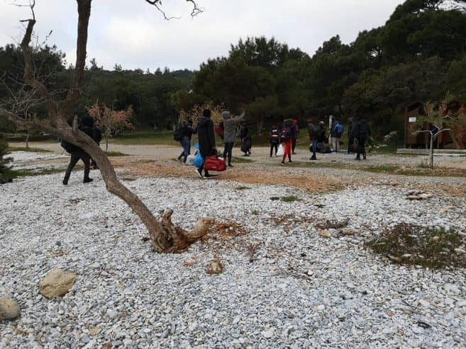

### AYS Daily Digest 01/04/2020: Greek camp in 14\-day coronavirus lockdown

Greek Prime Minister response to asylum shutdown / Belgium NGOs step up to address government failures / The continued detention of asylum seekers and refugees during the COVID\-19 crisis

Arrivals Samos Mourtia Beach\. Source \(facebook\.com/AegeanBoatReport\)
### Feature

[It has been reported](https://www.infomigrants.net/en/post/23797/first-case-of-coronavirus-in-greek-migrant-camp?fbclid=IwAR3TwmfH1M1wgkdHeANuszMKV8qlwofYhyWBamc6Tf98jy7FVMmB6K5eloA) that a woman living in Ritsona, a Greek refugee camp north of the capital, has tested positive for the coronavirus after giving birth in an Athens hospital\. This is the first case of COVID\-19 from within a camp\.

In response to the announcement, the migration ministry claimed that “The public health organization is already tracking the contacts of this case in recent days, and taking all necessary measures to protect \(camp\) residents and staff\.

It’s reported that following the positive test of one of the camp residents, the National Public Health Organisation conducted a check for coronavirus on 63 people\. Of the 63 tested, [20 people have since tested positive for COVID\-19](https://twitter.com/g_christides/status/1245591757892366338?fbclid=IwAR2JVfR7lBs23N0NYmgfh3Nmmj0K7PIKkaHHBvVnuNxpY05006KgPI5m3AQ) , prompting the authorities to mandate a 14\-day lockdown for the camp\. It is estimated that the camp currently houses 3,000 people, so whilst testing within refugee camps is welcome, currently tests were only given to 2\.1% of all people currently housed within the camp\.

The overcrowded and unhygienic conditions of many of these camps that thousands upon thousands of migrants and refugees are forced to endure, will likely only exacerbate this situation\.
### Greece

[The AEGEAN Boat Report](https://www.facebook.com/AegeanBoatReport/posts/802766616913111?hc_location=ufi) today reported that on Wednesday morning a boat carrying 39 people landed on Korakas\. The new arrivals will be quarantined for the next 14 days at the Agios Vlasios chapel, but as previously reported the chapel is already overcrowded and thus these people will be forced to sleep outside\.

](assets/6de7a60811cf/1*qEQT8YKLppBxmldeeSRc9A.jpeg)

[https://aegeanboatreport\.com/?fbclid=IwAR0NFW7ePgAE328uVzWuovSu\_giFDaLQjTtRQKmLySVL0P\_PIXU8ROeBHlA](https://aegeanboatreport.com/?fbclid=IwAR0NFW7ePgAE328uVzWuovSu_giFDaLQjTtRQKmLySVL0P_PIXU8ROeBHlA)

The NGO claims that since these people are arriving in April the current restriction on seeking asylum will not apply, but since asylum services have been cancelled due to the COVID\-19 crisis, it is unclear if or when they will be able to make a request for asylum **\.**

When questioned on the suspension of asylum application Greek Prime Minister Kyriakos Mitsotakis had this to say:

■■■■■■■■■■■■■■ 
> **[Daphne Tolis](https://twitter.com/daphnetoli) @ Twitter Says:** 

> > Greek PM confirms that the 1-month suspension of asylum applications, that has led to the arbitrary detention of nearly 2000 asylum seekers, expired today. "I expect a return to a full normality when it comes to asylum applications." 

#refugeesGR 

> **Tweeted at [2020-04-01 18:59:17](https://twitter.com/daphnetoli/status/1245425520545878016).** 

■■■■■■■■■■■■■■ 

Within the interview, Prime Minister Mitsotakis was presented with evidence from Human Rights Watch that his government’s decision over the last month led to the arbitrary detention of over 2000 migrants and refugees\. When referring to the continued lack of housing and sanitary facilities across many of the refugee camps in Greece, Mr Mitsotakis claimed that this was “less than ideal”\.

The non\-profit organisation Statewatch founded to monitor the state and civil liberties in the European Union have published a new analysis regarding the situation at the Greek\-Turkish border\.

In the report Statewatch affirms that the Greek government is complicit in this violence against volunteers and refugees either indirectly, through its _“campaign to scrutinize NGOs for their humanitarian operations, stirring suspicion over their motives and activities — or directly, through the deployment of border guards, police officers and troops who are known to beat, intimidate and harass people attempting to cross the border”\._

To read the full report please go to : [http://www\.statewatch\.org/analyses/no\-359\-crisis\-not\-averted\.pdf](http://www.statewatch.org/analyses/no-359-crisis-not-averted.pdf)

■■■■■■■■■■■■■■ 
> **[RSA](https://twitter.com/rspaegean) @ Twitter Says:** 

> > Till today and while there is a covid-19 pandemic, over 57 % of the mainland camps' population did not have access to free health care. Finally from today, the Government will restore this access by granting temporary health care numbers #refugeesGR https://t.co/g9120omv5D 

> **Tweeted at [2020-04-01 13:39:12](https://twitter.com/rspaegean/status/1245344969432449025).** 

■■■■■■■■■■■■■■ 

■■■■■■■■■■■■■■ 
> **[RSA](https://twitter.com/rspaegean) @ Twitter Says:** 

> > Over 25,000 individuals reside in the mainland. Statistics show that majority of population are from countries with high refugee profile #RefugeeGR https://t.co/0ELcR1QBrB 

> **Tweeted at [2020-04-01 12:23:43](https://twitter.com/rspaegean/status/1245325971047297026).** 

■■■■■■■■■■■■■■ 

### Belgium

In the wake of the current COVID\-19 health crisis, Belgian migrant aid associations have spoken out over the continued lack of government measures in place to protect migrants from the outbreak\.

The recent implementation of measures related to COVID\-19 has been detrimental to the rights of migrants within the country\. The closure of the Office for Foreigners on 18 March has meant that it is now impossible to currently apply for asylum in Belgium\. This additionally means that all state assistance for new asylum seekers has effectively been withdrawn including assistance with finances, housing and medical care\.

Due to the continued lack of state support, NGOs within the country have had to increase their services\. The Citizens’ Platform centre at Porte d’Ulysse is now open 24 hours a day and is operating at full capacity\. The platform has also established a network to facilitate the housing of migrants in hotels and private homes in Brussels, bring the total number of people that they have been able to assist with accommodation to 755\.

[Speaking to InfoMigrants](https://www.infomigrants.net/en/post/23804/belgian-government-is-doing-nothing-to-protect-migrants-from-coronavirus-ngos?preview=1585752319917&fbclid=IwAR2r6p2eW0ALwDrs7EvXRB0Nf2eTLV03rqRiVCQ9-gomKUOw9PRtCkDovqU) , the citizen platform In Support of Refugees said “nothing has been done at the federal level to protect migrants\. Since the beginning of the coronavirus epidemic, Maggie De Block \(Minister of Social Affairs, Public Health, Asylum and Migration\) has remained silent on matters of asylum\.”
### Spain

[It has been reported](https://www.europasur.es/campo-de-gibraltar/marroquies-cie-algeciras-huelga-hambre_0_1451555402.html) that three Moroccans detained within the Algeciras Centre for Internment of Foreigners \(CIE\) has started a hunger strike to demand their release from the centre\.

Due to the ongoing Crisis of COVID\-19, multiple judges within Spain have taken the decision to dramatically reduced the number of people housed within these detention facilities, with eight CIEs housing only 10% of its maximum person limit and three of them being completely empty\.

> EuropaSur reports that in the case of the CIE in Algeciras, the Association Pro Human Rights of Andalusia \(APDH\) affirms that the “judge who controls this department declared herself incompetent to decide on the release of all the inmates, so each of them had to resort to the court that ordered their internment to comply with the expulsion order” 

A 51\-year\-old man currently housed within the CIE in Algeciras was denied release from the centre because a Seville judge argued that the maximum period of 60 days of internment had not yet been met\. This decision not to grant the release of the 51\-year\-old man currently detained is believed to be the reason behind the decision to collectively participate in a hunger strike\.

The APDH confirmed that the decision within this case to continuously detained these people “ _ceases to make sense_ ” especially because the border with Morocco is closed and the current COVID\-19 crisis makes expulsion impossible\.

> NGO Alarm Phone has reported that at least seven boats have arrived on the Canary Islands in recent days\. It is believed that these boats were carrying approximately 200 people\. 

■■■■■■■■■■■■■■ 
> **[Alarm Phone](https://twitter.com/alarm_phone) @ Twitter Says:** 

> > Over the last 2 days, #AlarmPhone learned of at least 7 boat arrivals on the #Canary Islands, #Spain, carrying approx. 200 people. We were alerted to 1 boat in distress by relatives but never reached the 35 people. Fortunately, their rescue was confirmed to us by @[salvamentogob](https://twitter.com/salvamentogob). 

> **Tweeted at [2020-03-31 13:59:27](https://twitter.com/alarm_phone/status/1244987674739474433).** 

■■■■■■■■■■■■■■ 

### Italy

[Citing health concerns](https://www.infomigrants.net/en/post/23792/coronavirus-judges-order-migrants-to-be-released-from-italian-cprs?preview=1585736709509&fbclid=IwAR26pZnL1hSBBCdYZ9c0FbJF45q-N7og6751ZHQJVfuvBdtvYI9bKIafncQ) amid the global COVID\-19 emergency, in three separate cases, judges in Italy have ordered that rejected asylum seekers be released from so\-called ‘repatriation centres’\.

During one of the cases in question, the judge states that _“the deprivation of personal freedoms in restricted spaces would make it difficult to ensure the health of individuals\.” The judge argued that it was important to “create a balance between \(immigration\) regulations and the constitutional right to health that is also guaranteed by conventions to every person present in the country\.”_
### Denmark

In direct opposition to guidelines provided by the EU commissioner for human rights, the Danish government has confirmed that they have no plans to release asylum seekers currently detained in the country\. The commission states that in the face of the global COVID\-19 pandemic many countries have been forced to suspend their program of deportation, and under international human right law, immigration detention is only lawful as long as a feasible return can take place\. This is something that cannot be fulfilled under the current conditions\.

Despite countries such as the Netherlands, Belgium and Spain all actively releasing many of their detainees, Mattias Tesfaye, the Danish Foreign Affairs and Integration Minister, has confirmed he does not plan on following suit\.

[Speaking on the issue](https://nyheder.tv2.dk/politik/2020-04-01-regeringen-bremser-alle-udsendelser-af-afviste-asylansoegere-og-trodser?fbclid=IwAR02mEAU8bHtsLgCKi1Q5JC1Rnorez-soVRk2yRIo-Y70qFtk_Zkygn3M1w) , he said “as a starting point, we maintain the detention… however, as the law is today, ongoing assessments by the judicial system are being made as to whether detention can continue\. A judge may decide to release people if the prospect of release is not proportional to the consequences of being detained”\.

To read the full statement by the Commissioner for human rights please see:

[https://www\.coe\.int/en/web/commissioner/\-/commissioner\-calls\-for\-release\-of\-immigration\-detainees\-while\-covid\-19\-crisis\-continues?fbclid=IwAR3yB4SY4SG2k1dpApRgP0NX3pFMV8JtIl59qjnLNNecBpJek78vOBw6Crs](https://www.coe.int/en/web/commissioner/-/commissioner-calls-for-release-of-immigration-detainees-while-covid-19-crisis-continues?fbclid=IwAR3yB4SY4SG2k1dpApRgP0NX3pFMV8JtIl59qjnLNNecBpJek78vOBw6Crs)
### UK

It has been confirmed that despite the ongoing global health crisis and a positive COVID\-19 diagnosis in the facility, the British government is increasing its use of Yarlswood detention centre in Bedfordshire\.

Since the confirmed diagnosis of one person detained in Yarlswood on 22 March, at least five people have been sent there\. The government has faced continued criticism for its treatment of the women detained in Yarlswood, with one detainee telling the BBC news that the sanitation conditions at the centre were poor and some of the women being housed there had underlying health conditions\.

In the face of the growing criticism of the British government’s use of immigration detention centres during this current health crisis, they have claimed that they are following guidance from Public Health England\.

> [Talking to the BBC](https://www.bbc.com/news/uk-52121224?fbclid=IwAR3Aw6eMk7WA7hsrolzQ7LvP7ajPX9PC36Sief7jMldDx8D9qvTV1-qk8R4) , one woman currently detained in the centre said 
 

> “I am not a young woman and my health problems mean that I am at high risk\. I feel so afraid…\. I try to stay in my room but you have to go to the canteen for food\. Everyone is panicking” 

### France

■■■■■■■■■■■■■■ 
> **[Refugee Info Bus](https://twitter.com/RefugeeInfoBus) @ Twitter Says:** 

> > We are sad but not surprised to learn that 2 cases of #COVIDー19 have been detected in the camps in Calais. These people have been put into accommodation and are being looked after by a medical team. The rest of the refugee community must now be given appropriate shelter too. https://t.co/9vvemiBZkX 

> **Tweeted at [2020-04-01 14:14:29](https://twitter.com/refugeeinfobus/status/1245353847352184833).** 

■■■■■■■■■■■■■■ 

### Sweden

Many refugees and migrants may lose the right to family reunification due to the ongoing COVID\-19 health Crisis\. The Swedish Public Employment Office recorded high levels of notice and layoffs with national figures of job losses rising from [18,000 in March to 36,800 currently](https://www.svt.se/nyheter/inrikes/arbetsformedlingen-rekord-hog-takt-i-antalet-varsel?fbclid=IwAR3yuq0tgTOyFAOuqslzztC1tnqusrEZCyoJc4KoCR1UgGc3DnfvCLgtScE)) \. The ongoing job losses [related to the COVID\-19 crisis](https://sverigesradio.se/artikel/7437266?fbclid=IwAR0PH2S3CO3p3lgN_GHque9hMFXK6CjSN4KF9-4Z3aGbO8vKmezBJxJaNxQ) are especially impactful for anyone reliant on a steady income to fulfill family reunification requirements, residency requirements or to renew their work permits\.

Many asylum seekers are granted temporary residency permits\. Unless the [Migrancy Agency](https://sverigesradio.se/artikel/7437266) reaffirms their protection needs, upon expiry of the temporary residency permit all individuals are required to have employment if they want to stay in Sweden\.

For those with permanent residence permits, it will get more difficult, not to say impossible, to reunite with their family as the current rules state that the person needs to be able to provide for both themselves and the family members the person wishes to bring\. The amount of money that the person needs to have left after paying rent every month varies depending on the size of the family\.

It is yet no clear how many people will be affected, and what the consequences will be\. According to Per Ek, press chief at the Migration Agency, they have received plenty of questions from asylum seekers and holders of different kinds of residency permits since the beginning of the corona outbreak\. They are looking into the consequences it can have for individual cases — but it is not certain this will change or effect the decisions\.

Morgan Johansson, Minister of Migration, declined an interview with Swedish Radio but said that there is no plan to look into or change the current rules\.

**Find daily updates and special reports on our [Medium page](https://medium.com/are-you-syrious) \.**

**If you wish to contribute, either by writing a report or a story, or by joining the info gathering team, please let us know\.**

**We strive to echo correct news from the ground through collaboration and fairness\. Every effort has been made to credit organisations and individuals with regard to the supply of information, video, and photo material \(in cases where the source wanted to be accredited\) \. Please notify us regarding corrections\.**

**If there’s anything you want to share or comment, contact us through Facebook, Twitter or write to: areyousyrious@gmail\.com**

_Converted [Medium Post](https://medium.com/are-you-syrious/ays-daily-digest-01-04-2020-greek-camp-in-14-day-coronavirus-lockdown-6de7a60811cf) by [ZMediumToMarkdown](https://github.com/ZhgChgLi/ZMediumToMarkdown)._
