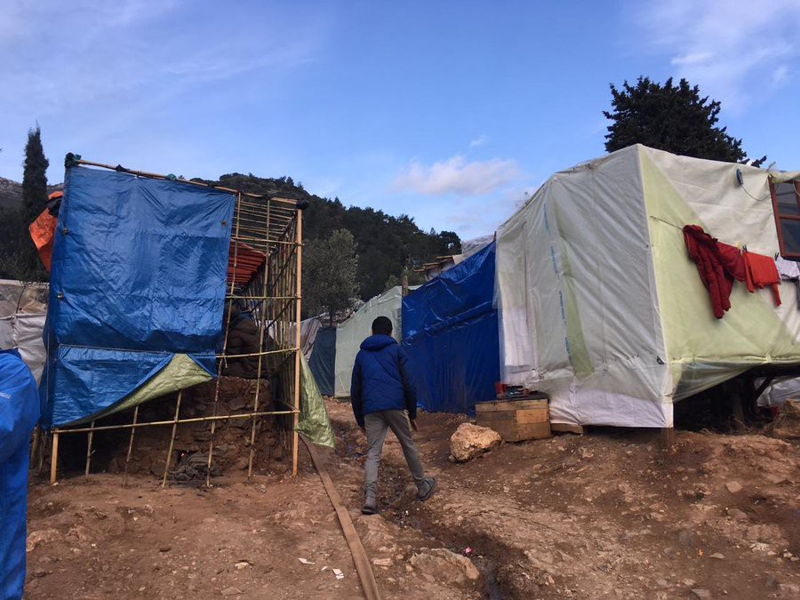

### AYS Daily Digest 3/4/20: No one is taking responsibility\.
#### Updates and news from Greece / “Allegations of violence must be promptly and impartially investigated” — updates from the Turkey\-Greek border / News from Syria, Hungary, Italy and France / About 800 people barely surviving in the north of France / & more news

Photo: RSA
#### FEATURED

In unimaginable circumstances, without heating in zero temperatures at night, without hot water, people have been brought in, including 50 children — from infants aged one month to 14 years — and unaccompanied minors\. The facility is two kilometres away from a village, “where we do not even put our animals\. No one can live there,“ stated the community leader of Promachonas Greece, Leonidas Spyrou\.

> The closed refugee centre set up by the government is located at Kleidi near Rupel Fortress\. Desperate, the president of the community of Promachonas explains that no one is responding to his appeals\. “I went there yesterday with the snow and I started crying\. Children freezing\. I have asked babies and pregnant women to go to hotels\. 

> The contractor had not finished fencing and had already left\. Anyone would have left if they could\. We said no to this closed structure from the beginning\. It is an inappropriate, inhumane place\. 

> No one is taking responsibility\. 

#### EU

“Never has the ‘leave no one behind’ pledge felt more urgent\. As nations around the world implement measures to control the spread of SARS\-CoV\-2, including lockdowns and restrictions on individuals’ movements, they must heed their global commitments\. When member states adopted the UN 2030 Agenda for Sustainable Development, they promised to ensure no one would be left behind\. Chief among the world’s most vulnerable people are refugees and migrants\. The COVID\-19 crisis puts these groups at enormous risk\. Yet global pandemic efforts have so far failed in their duty of care to refugees and migrants\.”

■■■■■■■■■■■■■■ 
> **[Seebrücke](https://twitter.com/_Seebruecke_) @ Twitter Says:** 

> > Seit dieser Woche läuft die neue EU-Marinemission EUNAVFOR MED IRINI, Nachfolgemission der Operation #SOPHIA. Vieles an der Mission klingt wie ein schlechter Aprilscherz - ist aber bitterer Ernst und Ausdruck der europäischen Abschottungspolitik.
Fotos: dpa/ANSA/Press Office https://t.co/v0ujsgJLdA 

> **Tweeted at [2020-04-03 18:02:57](https://twitter.com/_seebruecke_/status/1246136119013539842).** 

■■■■■■■■■■■■■■ 

The European Commission has confirmed that the eight EU Member States that will relocate 1,600 children are: Luxembourg, Germany, France, Portugal, Finland, Lithuania, Croatia and Ireland\.

Relocation is planned to begin this week\.
#### SYRIA

Many of the tents in the camps in northern Syria were flooded due to the storms that hit the area\. The White Helmets are working to respond to the situation and limit the damage, they reported\. Find more updates on their social media sites\.
#### TURKEY

At least two men have been killed at the Turkish\-Greek border, after thousands of people had been transferred to Pazarkule in February, according to Amnesty international research\. One woman is still missing after Greek forces fired live ammunition and tear gas against the people\. And more have been beaten and injured\.

> “Allegations of violence must be promptly and impartially investigated\. Everyone should be treated humanely, shielded from violence and be granted access to protection in the countries where they are seeking safety” said Massimo Moratti, Deputy Director of the Amnesty International Europe Regional Office\. 

Amnesty further reports about illegal pushbacks to Turkish territory\. Also sea patrols in the Aegean region were increased and prevented boats from arriving on the islands\. ”Everybody who had arrived after 1 March 2020 was arbitrarily held in port facilities and other areas, unable to claim asylum and at risk of return to Turkey or to countries of ‘origin or transit’”\. Meanwhile, the detained people have been transferred to the mainland to bigger detention centers, still unable to ask for asylum and at risk of being deported\.

> Greek border forces implemented a government policy to repel them instead of taking their asylum claims even after they had entered Greek territory\. This violates international human rights law, Amnesty r [eiterates](https://www.amnesty.org/en/latest/news/2020/04/greece-turkey-asylum-seekers-and-migrants-killed-and-abused-at-borders) 

The one\-month long suspension of asylum applications has ended now, but all asylum services will be closed for at least one more week due to the Corona pandemic, InfoMigrants reports\.

On the Turkish side, the jungle was evicted at the end of March and most of the people were transferred to Istanbul\. According to The Common Sense Initiative, the last people who arrived at the bus station have been moved into apartments now\.

■■■■■■■■■■■■■■ 
> **[TheCommonSenseInitiative](https://twitter.com/CSinIstanbul) @ Twitter Says:** 

> > Yesterday we successfully moved the remaining #migrants who arrived at the #Istanbul bus station from the Turkey/Greece border over the past several weeks into a starter apartment. Stay tuned for our upcoming initiative to support vulnerable migrant families during #coronavirus. https://t.co/mmdGT2lNQi 

> **Tweeted at [2020-04-01 20:22:34](https://twitter.com/csinistanbul/status/1245446479147393024).** 

■■■■■■■■■■■■■■ 

#### GREECE

As the situation in overcrowded Greek camps remains inhumane, the Greek Ministry of Migration and Asylum has eased the access to healthcare\.

■■■■■■■■■■■■■■ 
> **[Υπουργείο Μετανάστευσης & Ασύλου](https://twitter.com/migrationgovgr) @ Twitter Says:** 

> > Από σήμερα, τίθεται σε εφαρμογή η απόδοση του Προσωρινού Αριθμού Ασφάλισης και Υγειονομικής Περίθαλψης Αλλοδαπού σε όλους ανεξαιρέτως τους αιτούντες άσυλο, σε εφαρμογή της Κοινής Υπουργικής Απόφασης υπ’ αριθμόν 199/31-01-2020.

Διαβάστε περισσότερα: [bit.ly/2WX4DQr](https://bit.ly/2WX4DQr) 

> **Tweeted at [2020-04-01 07:04:21](https://twitter.com/migrationgovgr/status/1245245600603439109).** 

■■■■■■■■■■■■■■ 

At the same time, hotel owners on Lesvos refuse to host vulnerable groups\. Previously, the LIBE committee had offered to financially support the transfer\. This leaves almost 20,000 people in squalid conditions, where physical distance is almost impossible, as people need to gather on a small area, standing in line for hours for food\. Residents complain there is no prevention\. Meanwhile, eight EU member states have agreed to relocate 1,600 unaccompanied minors form Greece and the Greek authorities have identified some 2,000 children who have been age assessed and are ready to leave\.

■■■■■■■■■■■■■■ 
> **[Daphne Tolis](https://twitter.com/daphnetoli) @ Twitter Says:** 

> > The migration Minister of #Greece said that, during yesterday’s videoconference, the LIBE Committee offered to financially support the transfer of vulnerable refugees from #Moria to hotels on #Lesvos. However, the hotel owners refused, minister Notis Mitarachi said this morning. 

> **Tweeted at [2020-04-03 07:32:53](https://twitter.com/daphnetoli/status/1245977558690267138).** 

■■■■■■■■■■■■■■ 

“We have no masks or gloves\. There is no social distancing\. We still wait for hours in the line for our meals\. We experience this situation differently from the rest of the world\. There is no prevention” — Male asylum\-seeker from Africa, Vathy camp, Samos

■■■■■■■■■■■■■■ 
> **[RSA](https://twitter.com/rspaegean) @ Twitter Says:** 

> > Voices from Moria: “Social distancing is not possible here. We are 7 people in a tent and there are hundreds of tents around us. ... We try to stay inside our tents as much as possible” Afghan family, Moria camp, 2 April 2020 #refugeesGR https://t.co/X4JS7aEeVV 

> **Tweeted at [2020-04-03 09:10:39](https://twitter.com/rspaegean/status/1246002160321662976).** 

■■■■■■■■■■■■■■ 

■■■■■■■■■■■■■■ 
> **[Europe Must Act](https://twitter.com/EuropeMustAct) @ Twitter Says:** 

> > Dinner on Vial Camp. Refugees can't cook safely. Portions aren't sufficient. Food is cold. There's no freedom of choice.

The comfort in cooking, the power to feed your family, the memories connected to smells, the joy of flavour discovery, these aren't a refugee's reality 😞 https://t.co/V8gO8CH7Bt 

> **Tweeted at [2020-04-01 09:04:38](https://twitter.com/actmust/status/1245275872573247489).** 

■■■■■■■■■■■■■■ 

There are still free offers of psycho\-social support for volunteers\. Find out more details at the Information Point for Volunteers on Samos:

#### ITALY

According to Caritas in Italy, applications for stay permits after February 23 have been suspended until April 15\. Expired permits will be valid until June 15\. It is still possible to ask for asylum, but auditions are halted\. Appeals for rejections will be extended, as all procedures are suspended\.

Mayors and NGOs have warned about bad working conditions for farm workers, especially in Italy\.
#### HUNGARY
### Hungary starves 34th detainee in the transit zone

ECtHR granted the urgent request and ordered authorities to start providing food to the people detained in the Hungarian transit zones who are deprived of food\. Interim measures were issued under Rule 39 by the European Court of Human Rights to the Government of Hungary\.
#### FRANCE
### A health crisis in deplorable conditions in camps

Despite the Covid\-19 outbreak, a small number of our volunteers continue to act every day in Calais and Grande\-Synthe\.

“We do everything we can to guarantee their safety and that of the exiles we help\. In a context that further isolates migrant populations, our actions respond to essential needs and allow us to monitor the human rights situation\.
L’Auberge des migrants is reducing its activities, but solidarity continues\.

In Calais, at least 700 to 800 exiles survive\. The sub\-prefect has set up a health chain, but is still working on a shelter plan\. From Tuesday 31 March, containment spaces were to be proposed, but the operation is delayed… In conjunction with Médecins du Monde and the Red Cross, Civil Security offers coronavirus diagnostics and accommodation for patients who do not require hospitalization\. But there will remain many people in the camps, and at least two patients were tested positive in Covid 19 according to the press\.
In Grande\-Synthe, where 500 to 600 exiles survive, the sub\-prefecture also sets up a care chain, but no accommodation for the moment\.

Survival conditions have deteriorated\. In Calais, the Active Living \(state operator\) no longer distributes hot meals and does not recharge telephones, which are essential for contacting emergency services and communicating with associations\. At Grande\-Synthe, food distribution takes place only every two or three days, and the exiles say they are hungry\.

Daily evictions continue\! Law enforcement continues to dislodge people, most of the time without a solution to relocate\.

Humanitarian associations have seen a decrease in the number of their volunteers\. At our warehouse, from 50 to 60 volunteers, the number fell to about ten, plus a dozen who work from home\. We have closed our kitchen, operated by Refugee Community Kitchen, since March 25, and we no longer distribute hot meals in Calais or Grande\-Synthe\. The washing of the refugees’ clothes did not really start because it relies on the day reception of the Catholic Relief, which also had to be closed\. We continue to distribute tents with our partner Collective Aid, blankets and wood to heat and cook with Help Refugees\.
In this way, we focus on our core activities, within our capabilities, and especially on the safety of our volunteers and recipients\. We continue to alert human rights organizations to the situation on the ground,” [L’Auberge des Migrants](https://www.facebook.com/AubergeMigrants/?__tn__=%2CdkCH-R-R&eid=ARASTFBWVSghgI4zDF1vXoa2ETfTNoak2-WS2L_tPX3YOBCOXMKM046W3y46zZRShI17Cb6Zk8shCQQ1&hc_ref=ARQXsDwjyOkeiweaByr05vT72NzhDkDURpjfKIT7pHLzkg9-dxrExv843RedQhv5nQE&fref=nf&hc_location=group) reported\.
#### SEARCH AND RESCUE AT SEA

39 people went missing, two deceased found, 21 people were found safe, according to the Alarm Phone report\. Follow them for more updates on the currently less visible serious issue of the SAR actions in the mediterranean\.

■■■■■■■■■■■■■■ 
> **[Alarm Phone](https://twitter.com/alarm_phone) @ Twitter Says:** 

> > #AlarmPhone was alerted by the 175 people, including 69 children, in distress off the coast of #Cyprus. They were "pushed back in the middle of the sea by authorities in the government-controlled south." We fear their refoulement to #Syria! #Covid19 [aljazeera.com/news/2020/03/c…](https://www.aljazeera.com/news/2020/03/cyprus-pushes-syrian-refugees-sea-due-coronavirus-200330091614066.html) 

> **Tweeted at [2020-04-03 07:51:29](https://twitter.com/alarm_phone/status/1245982238375845888).** 

■■■■■■■■■■■■■■ 

#### SPAIN

The state of emergency stops the migration flow through the Strait of Gibraltar and the Alboran Sea, but not in the Canary Islands\. Of the 251 people arriving by boat in Spain in the second half of March, 247 arrived on the islands\.
### Worrying conditions in Melilla

This video shows the reality of residents at CETI \(Immigrants’ Temporary Stay Center\) in Melilla\. Marlaska says that measures would be taken “if it was necessary and essential” to guarantee the “health and well\-being” of those people\.

#### UK

■■■■■■■■■■■■■■ 
> **[Refugee Council 🧡](https://twitter.com/refugeecouncil) @ Twitter Says:** 

> > People seeking asylum receive just over £5 per day to live on - this isn't enough to stay healthy during #Covid_19. We urgently call on the govt to provide people seeking asylum with the same £20 weekly increase they've promised #universalcredit recipients [refugeecouncil.org.uk/wp-content/upl…](https://www.refugeecouncil.org.uk/wp-content/uploads/2020/04/Letter-to-Chancellor-and-Home-Secretary-FINAL.pdf?fbclid=IwAR0yzq3UDTB-DrF4rtQZqHzm7k1QyXo0cD4uRWAjPZWte2Wg2Di8oSQecp0) 

> **Tweeted at [2020-04-03 13:53:21](https://twitter.com/refugeecouncil/status/1246073306765070336).** 

■■■■■■■■■■■■■■ 

Limited access and lengthy asylum procedures, lack of reception conditions, de facto detention, limitation of rights of BIPs, COVIDー19 measures\. Find information on the recent developments in national asylum systems on the [Asylum Information Database](https://www.asylumineurope.org/news?fbclid=IwAR3QmZUNsIRMOZnHtoKa1BkYUuwAzhXxA1kmL-T3ICyqHBITEIwvQSEJeqA) \.

**Find daily updates and special reports on our [Medium page](https://medium.com/are-you-syrious) \.**

**If you wish to contribute, either by writing a report or a story, or by joining the info gathering team, please let us know\.**

**We strive to echo correct news from the ground through collaboration and fairness\. Every effort has been made to credit organisations and individuals with regard to the supply of information, video, and photo material \(in cases where the source wanted to be accredited\) \. Please notify us regarding corrections\.**

**If there’s anything you want to share or comment, contact us through Facebook, Twitter or write to: areyousyrious@gmail\.com**

_Converted [Medium Post](https://medium.com/are-you-syrious/ays-daily-digest-3-4-20-noone-is-taking-responsibility-2add07ad8bd1) by [ZMediumToMarkdown](https://github.com/ZhgChgLi/ZMediumToMarkdown)._
