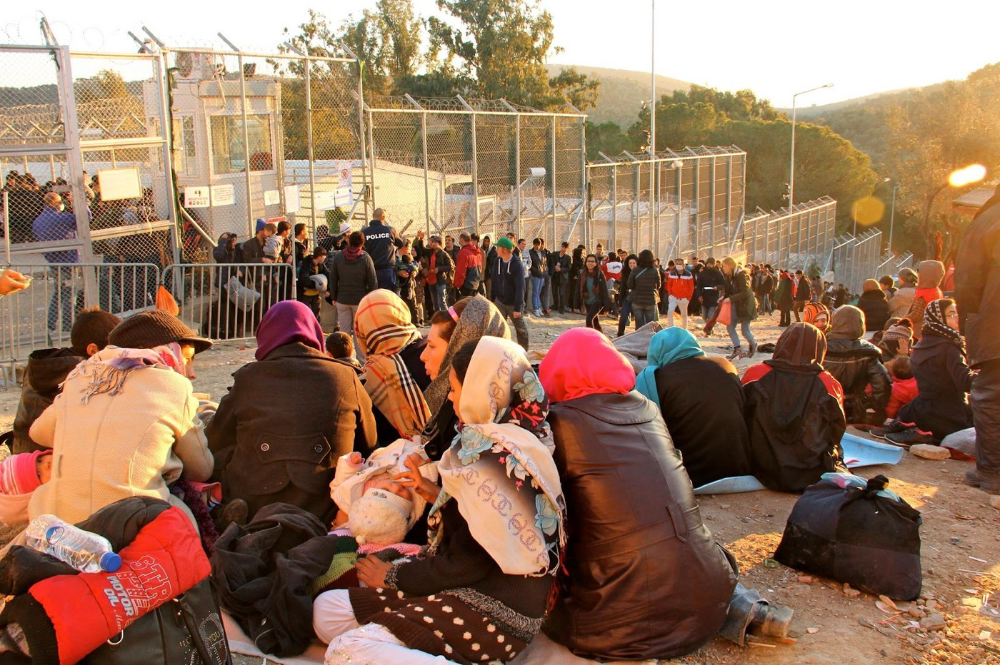
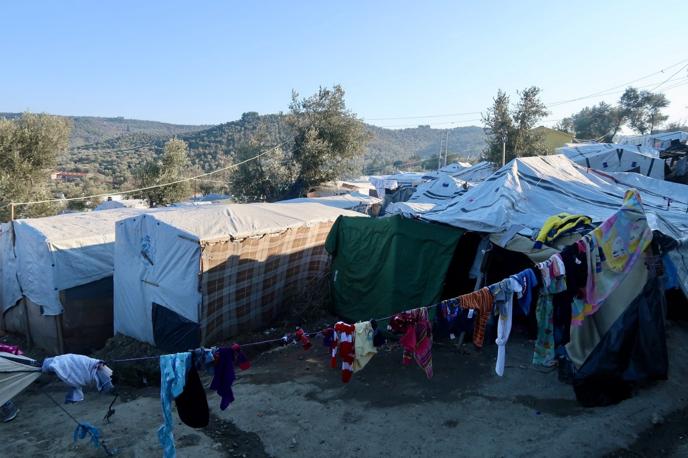
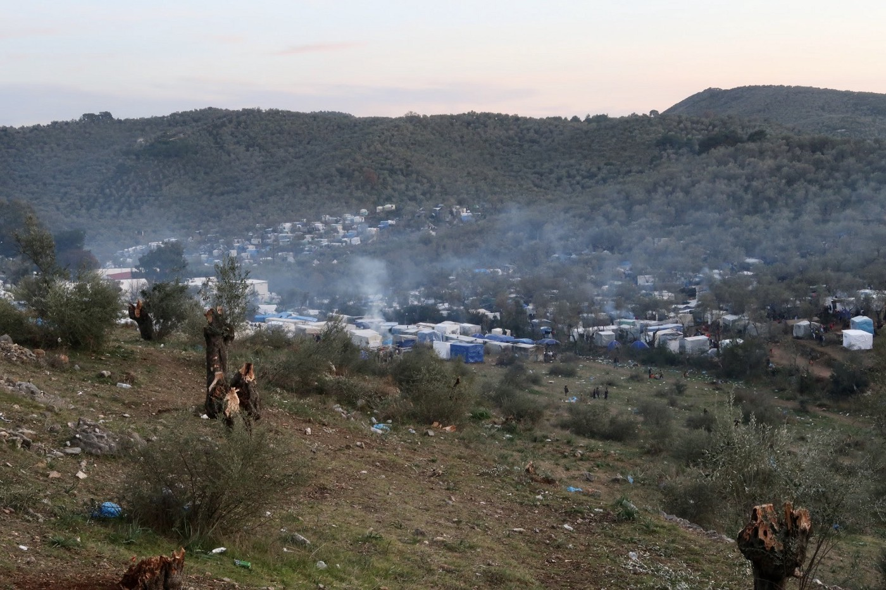
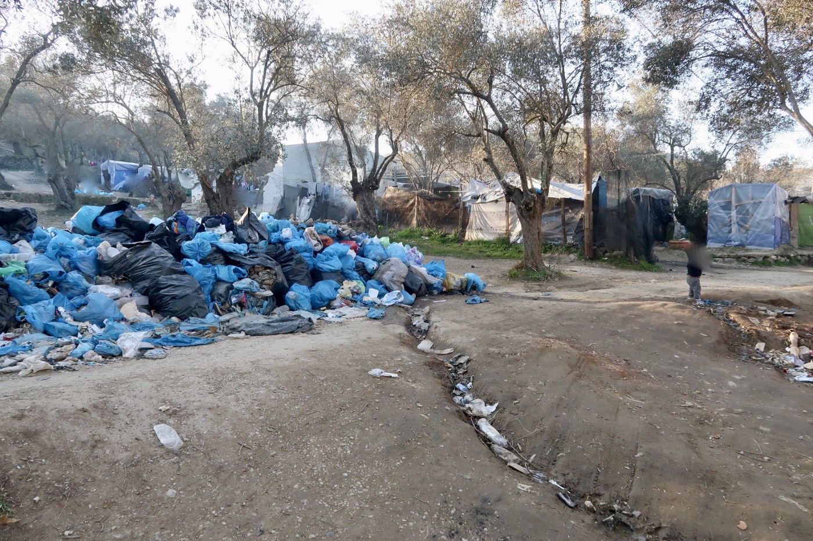
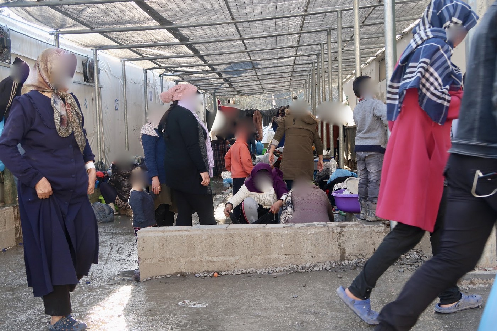
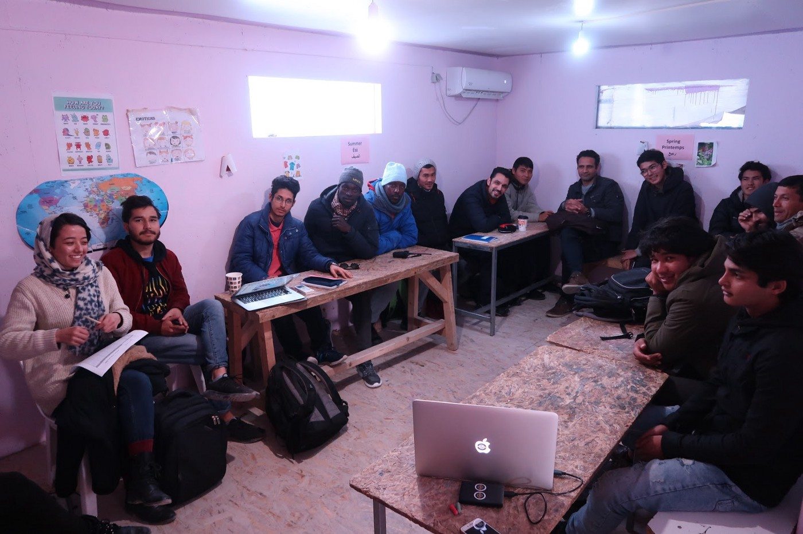
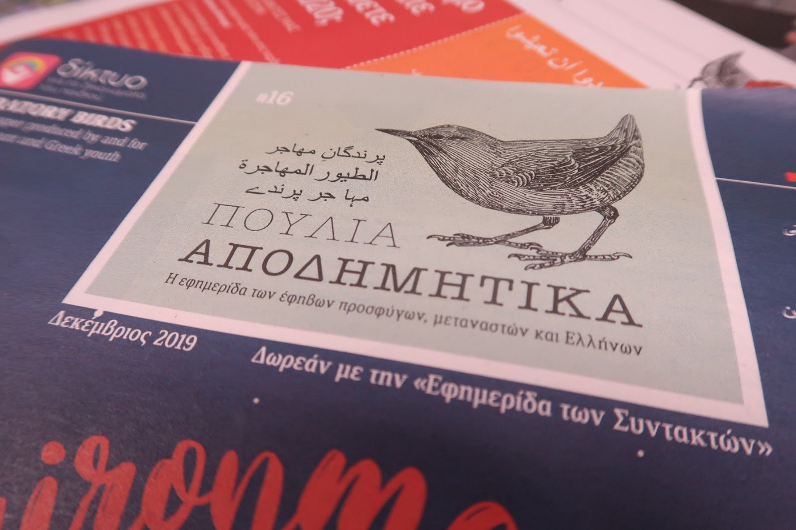
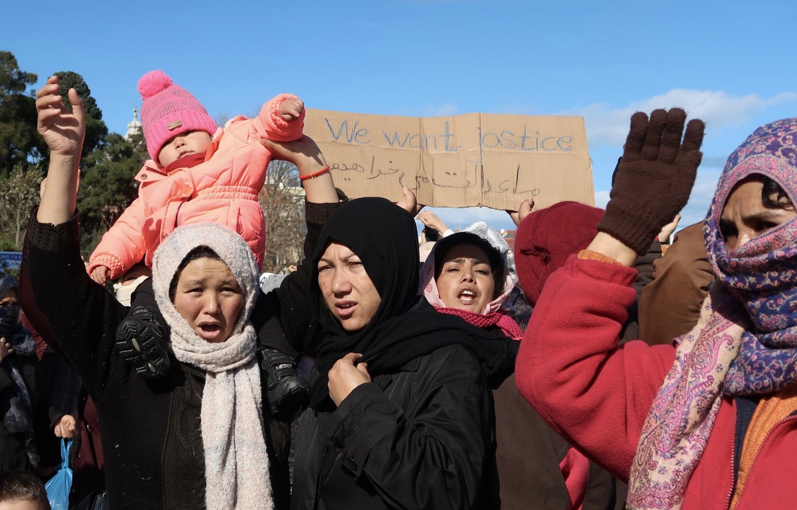

### Podcast: I **nterviews with refugees in Greek camps**
#### These stories come from Moria Camp on Lesvos, but also from in and around Athens\. All i **nterviews were recorded by Eric Maddox in a collaboration of AYS and the Latitude Adjustment Podcast\. They serve as a humble reminder to always pass the mic to those who mustn’t be left voiceless\.**

![Moria Camp, Lesvos\. Haifa is originally from Deir ez\-Zor, Syria but she worked in Damascus as a nurse\. She was in Idlib when she had to flee the fighting there two months ago, and she has been in Moria Refugee Camp ever since\. She says that the nights are cold here and there is no electricity\. They have to cook over wood fires and as a result her daughter’s leg was burned\. It’s also very difficult to access the toilet facilities, especially at night, because they are very far away\. She hopes for an update with their asylum application in a couple of weeks\. She would be happy to settle with her children anywhere in Europe that is safe\. Photo: Eriv Maddox, Latitude Adjustment Podcast\.](assets/b356c7a45a4f/0*t39iznL6xQtIBlq1)

Moria Camp, Lesvos\. Haifa is originally from Deir ez\-Zor, Syria but she worked in Damascus as a nurse\. She was in Idlib when she had to flee the fighting there two months ago, and she has been in Moria Refugee Camp ever since\. She says that the nights are cold here and there is no electricity\. They have to cook over wood fires and as a result her daughter’s leg was burned\. It’s also very difficult to access the toilet facilities, especially at night, because they are very far away\. She hopes for an update with their asylum application in a couple of weeks\. She would be happy to settle with her children anywhere in Europe that is safe\. Photo: Eriv Maddox, Latitude Adjustment Podcast\.

When I arrived in Lesvos in mid January of this year it was my first time returning to Greece, to the Island, and to Moria Refugee Camp since January of 2016\. Much had changed in the intervening years, and much has changed just in the 5 weeks since I left Greece\.

The focus and purpose of my recent trip was to gather a people’s perspective on the current situation, and so it’s the personal testimonies of refugees that form the basis of our [most recent episode of Latitude Adjustment Podcast](https://www.latitudeadjustmentpod.com/podcast/2020/3/31/episode-58-greece-refugees-tell-their-stories) :

These stories come from Moria Camp on Lesvos, but also from in and around Athens, where we discover that life for refugees on the Greek mainland is not free from deprivation and from the willful neglect of the international community\.

_All photos were taken in January and February of 2020, unless otherwise indicated\._

Malakasa Camp, about forty minutes by train from Athens\. February, 2020\. Photo: Eric Maddox, Latitude Adjustment Podcast
### Advocate, but Remember to Pass the Mic

This episode, the second of a three\-part series about the current situation in Greece, was inspired by one simple and urgent realization:

While it’s incumbent upon all of us to press forward with our advocacy on behalf of vulnerable populations we must balance the moral imperative to bear witness with the responsibility to step back and allow the vulnerable to occupy center stage whenever possible\.

All too often we as advocates have a tendency to mistake the indifference of Western ears for voicelessness on the part of refugees\. This dangerous conflation can have the unfortunate effect of reproducing the same paternalistic notions and power imbalances that are used to marginalize many of these populations in the first place\. Western voices must take care not to crowd out the voices of those we aim to help through this presumption that the vulnerable are somehow “voiceless”\.

Anyone who has been in the advocacy arena sincerely and for a substantial amount of time has seen the worst iterations of this phenomenon, i\.e\. when advocacy degenerates into self\-indulgence or even outright exploitation, with terrified children reduced to props for social media profiles and as little more than background in fundraising videos\. But there are more subtle and insidious iterations along the spectrum of good intentions that any one of us might contribute to unwittingly\. In the end we need to regularly pause and ask ourselves a simple question: Do I need to be the one talking right now?

Let’s remember that while many of these communities may be suffering from a lack of visibility and a shortage of platforms, they are rarely lacking in voices and they are fully capable of self\-advocacy\.

This podcast episode is in part my own ego\-check in this area, but it also requires a bit of an introduction\. Much has happened since I sat down to collect the personal testimonies of asylum seekers in Lesvos’ Moria Camp and from individuals who have made it to the Greek mainland\. And while their words are in many ways timeliness and in many ways reflective of the experiences of our own families and neighbors, it will be helpful to contextualize them against some of the pivotal events that took place both before and after our interviews in January and February of this year\.

![Moria Camp, Lesvos\. Tonton is from the Democratic Republic of the Congo and fled the country after coming under threat from a local military leader\. He’s been in Moria Camp for a week after spending 4 months in Turkey struggling to find a place to sleep every few days, relying on other people from the Congolese community\. He has a return appointment next month to see about the next stage in his asylum application\. He feels afraid much of the time in the camp because of knife attacks and theft and the general lack of security and says that life here is very difficult with long lines for bathrooms and poor quality food\. There is tension between the different communities which are all mixed together\. He has sought treatment several times for a lung infection but the medication he was given was ineffective and they gave him no details about the nature of his illness\. He would be happy to settle anywhere in the EU that is safe\. Photo: Eric Maddox, Latitude Adjustment Podcast](assets/b356c7a45a4f/0*AGHK1r0qQEYPdGPs)

Moria Camp, Lesvos\. Tonton is from the Democratic Republic of the Congo and fled the country after coming under threat from a local military leader\. He’s been in Moria Camp for a week after spending 4 months in Turkey struggling to find a place to sleep every few days, relying on other people from the Congolese community\. He has a return appointment next month to see about the next stage in his asylum application\. He feels afraid much of the time in the camp because of knife attacks and theft and the general lack of security and says that life here is very difficult with long lines for bathrooms and poor quality food\. There is tension between the different communities which are all mixed together\. He has sought treatment several times for a lung infection but the medication he was given was ineffective and they gave him no details about the nature of his illness\. He would be happy to settle anywhere in the EU that is safe\. Photo: Eric Maddox, Latitude Adjustment Podcast
### **Moria Then And Now:**

Moria camp already felt overwhelmed and chaotic when I left it in January of 2016, but now its function as a facility to temporarily accommodate 3,000 occupants has shifted to a semi\-permanent sprawling shanty town of roughly 20,000 long suffering souls\. Four years ago it wasn’t uncommon for people to board the ferry to Athens without spending a single night in Moria, clothes still wet from the crossing from Turkey\. These days it’s not uncommon to encounter residents who have been stuck in Moria Camp for years, often after spending their first few months in its infamous detention facility \(an experience described in harsh detail by one of our guests\) \. Many are then deported back to Turkey before being deported again to Afghanistan or to other violent locations where they face the very real prospect of imprisonment, torture, or death when they arrive\. Turkish Human rights attorney Deman Güler speaks more about this phenomena known as “chain deportation” and refoulement in [this previous special report from Latitude Adjustment Podcast](https://www.instagram.com/p/B-IRBFOA-sw/) \.

The barracks inside Moria Camp, which were exposed for being filthy and overcrowded even in early 2016, did however provide the minimal benefit of being securely gated off from the rest of the camp\. I know this because in December of 2015, within 30 minutes of my first arrival in Moria camp, I was handed a yellow vest and placed in charge of one of the main gates, presumably because I spoke some very limited Arabic and carried a Western passport\. This meant turning away single men, rationing out blankets, and the dual responsibility of guiding people to where they would be sleeping during their first night on European soil\. How I came to obtain so much power so quickly, and on such a razor thin pretext, has haunted me every time I reflect back on that first trip to Lesvos\. I’m not sure if I’ve ever been confronted with a more profound example of my own unearned privilege, either before or since\.

Moria Camp, Lesvos, in January of 2016\. Photo: Eric Maddox, Latitude Adjustment Podcast

Back then each row of box\-like dwellings inside the Moria compound was separated into blocks, each of them flanked by a wide belt of grass on a terraced hillside\. This is to say that there was a relatively large amount of empty space between the housing structures inside of the camp\. Once inside this gated compound, asylum seekers had only to follow me or another volunteer to a haphazardly assigned space on the floor\. This might offer the first opportunity families would have to try and regroup and assimilate all that had happened to them since departing the Turkish coastline\. Then it was off to sleep, head to foot and shoulder to shoulder, amongst strangers, amongst the mass of scabies\-infested blankets, babel of languages, and the reek of mildew, wet clothes, and overflowing bathrooms\. As loathsome as these conditions were it’s still imaginable that one might have been able to endure them for a few days prior to securing passage to the mainland\. This isn’t to excuse what I saw back then\. It’s just to say that I’ve witnessed vulnerable people who have survived worse\. Current conditions in Moria now call even this basic presumption of survival into question\.

Now this inner section of the camp is a suffocating architectural riot of flimsy tents and tarp dwellings fabricated from repurposed wooden pallets\. The more durable ISOBox structures are crammed so full that occupants are literally struggling for oxygen in their bunk beds\. Some of the hundreds of unaccompanied minors manage to make it into a special section of the camp reserved for the vulnerable, while the rest are left to fend for themselves in the sprawl of dwellings outside of the camp known as the Olive Grove\. Here, on the camp’s periphery, they are easy prey for thieves, sex traffickers, and all manner of opportunistic abuse\. Women endure similar horrors every time they venture out to use the restrooms at night\. For this reason, many women and children simply don’t venture out after dark\. Immediate survival takes priority over hygiene and personal comfort\. Though now these concerns have come into direct competition\. In the time of Coronavirus access to hygiene is a survival issue\.

![Moria Camp, Lesvos\. Yacub came from Kunduz, Afghanistan with his wife, 15\-year\-old son and six daughters\. They left Afghanistan because of the lack of security and because of the Taliban\. They are Shia Hazara and arrived in MoriaRefugeeCamp after traveling through Iran and Turkey\. At the time of this photo being taken \(about two weeks ago\) they had been in Greece for 45 days and had no Greek papers\. The mother was to have her interview in 9 days\. They receive 310€ per month in state assistance for their family of 9\. He says they have no electricity, everyone is sick, and they don’t feel safe because there are killings with knives at night\. Prior to their arrival they had very different expectations of what conditions in Greece would be like\. They didn’t expect to live in such primitive conditions\. They want a better future for their kids because in Afghanistan they had no opportunities for education\. He wants the international community to know that they want help improving facilities in the camp\. The biggest problem is the lack of access to healthcare\.](assets/b356c7a45a4f/0*5VCMIxPDCvU27kGs)

Moria Camp, Lesvos\. Yacub came from Kunduz, Afghanistan with his wife, 15\-year\-old son and six daughters\. They left Afghanistan because of the lack of security and because of the Taliban\. They are Shia Hazara and arrived in MoriaRefugeeCamp after traveling through Iran and Turkey\. At the time of this photo being taken \(about two weeks ago\) they had been in Greece for 45 days and had no Greek papers\. The mother was to have her interview in 9 days\. They receive 310€ per month in state assistance for their family of 9\. He says they have no electricity, everyone is sick, and they don’t feel safe because there are killings with knives at night\. Prior to their arrival they had very different expectations of what conditions in Greece would be like\. They didn’t expect to live in such primitive conditions\. They want a better future for their kids because in Afghanistan they had no opportunities for education\. He wants the international community to know that they want help improving facilities in the camp\. The biggest problem is the lack of access to healthcare\.

During the day, if the weather is nice, the Olive Grove is a maze of ad hoc shelters clinging to dusty hillsides surrounding the official camp\. It should be noted that the line between what constitutes official and unofficial is generally hard to find in Moria, but it’s most commonly expressed in the forms of barbed wire and long lines\. This spillover section of the camp is where most of the residents live\. It’s debatable which is preferable, the suffocating mass of dwellings inside of the camp gates, or the arguably less secure township that has taken root along its periphery\.

Moria Camp, Lesvos\. Photo: Eric Maddox, Latitude Adjustment Podcast\.

When the weather is bad, water, garbage, and filth swell the makeshift gutters that have been carved into the dirt\. When the weather is bad these gutters spill over into people’s sleeping and eating spaces before running down to a creek bed which is perpetually choked with garbage bags\. It’s not that nobody is cleaning up the trash, it’s that once the [trash is piled 2 or 3 meters high](https://www.youtube.com/watch?v=jQoteX1yE8o) there doesn’t appear to be any organized plan or capacity for the municipal sanitation services to dispose of it\. So inevitably these stacked up mountains of waste begin to tumble back to the ground where they seep into the noses and lungs of anyone walking by, and into the water table of nearby farms and villages\.

During the night all of these issues are compounded by the threat of stabbings, often to do with the theft of mobile phones\. These items are one of the few valuable possessions that many refugees manage to take with them, functioning as both a line of communication back home and as a way to navigate the sealed off routes ahead\.

Just as I had four years ago I made many visits to Moria during my month\-long stay, walking through the camp and the Olive Grove and speaking with the residents, often with the translation support and guidance of other residents\. Some residents invited us into their dwellings to share their food or their tea\. Most of them were sick\. Some were fighting life\-threatening illnesses even before they left\. This man was struggling with lung cancer\.

![Moria Camp, Lesvos\. Abdel is from Mazar\-e Sharif, Afghanistan\. He traveled to Lesvos through Iran and Turkey, and he lives in Moria Refugee Camp with his wife, 2 sons, and 3 daughters\. He has lung cancer and he left Afghanistan with his family for security reasons and because some men wanted to marry his daughters by force\. He was too weak to defend his family because of the cancer\. To protect his family he had no choice but to leave\. When they arrived in Moria Camp one month ago the NGO workers were nice, and he understands that it is hard to provide resources for everyone\. But conditions in the camp are bad\. There is no electricity\. Sanitation is poor\. It is hard to access water\. He came here to give his kids a future\. He just wants to live in security and peace with his family someplace in Europe\. He will go anywhere\. To the US he says that he wants them to bring peace\. “We have been victims for 40 years and because of this we have become refugees\.” He asks that the US or UN bring peace to Afghanistan\. Photo: Eric Maddox, Latitude Adjustment Podcast](assets/b356c7a45a4f/0*o3OvC3bJYo0H_E0Q)

Moria Camp, Lesvos\. Abdel is from Mazar\-e Sharif, Afghanistan\. He traveled to Lesvos through Iran and Turkey, and he lives in Moria Refugee Camp with his wife, 2 sons, and 3 daughters\. He has lung cancer and he left Afghanistan with his family for security reasons and because some men wanted to marry his daughters by force\. He was too weak to defend his family because of the cancer\. To protect his family he had no choice but to leave\. When they arrived in Moria Camp one month ago the NGO workers were nice, and he understands that it is hard to provide resources for everyone\. But conditions in the camp are bad\. There is no electricity\. Sanitation is poor\. It is hard to access water\. He came here to give his kids a future\. He just wants to live in security and peace with his family someplace in Europe\. He will go anywhere\. To the US he says that he wants them to bring peace\. “We have been victims for 40 years and because of this we have become refugees\.” He asks that the US or UN bring peace to Afghanistan\. Photo: Eric Maddox, Latitude Adjustment Podcast
### Every single one of them was terrified of the night\.

The majority of the people I spoke with had succumbed to some sort respiratory illness during their time in the camp, just as I had four years earlier as a volunteer\. It’s been that bad for that long\. Around sunset every night a toxic haze floats over Moria\. It’s the smoke from cooking fires as thousands of people try to supplement the meager offerings from the bread lines with whatever they can scavenge from makeshift entrepreneurial kiosks or from what they are able to afford at the shops in Mitilini\. One big change since I left Moria and since the emergence of the Coronavirus is the lockdown imposed on the camp’s residents\. At present only 100 residents are allowed out of the camp each day to go and purchase provisions\. That’s 100 out of more than 20,000 people who are locked together in a human petri dish, just waiting to get contaminated by a pandemic, while their immune systems are compromised by the dual shocks of malnutrition and poor hygiene\.

Smoke in the camp, and the remnants of olive trees on the periphery of Moria’s Olive Grove\. Photo: Eric Maddox, Latitude Adjustment Podcast

Fires are often started by burning what appears to be the camp’s second most abundant resource, garbage\. And the noxious effects are immediate and lasting\. Moria’s most abundant resources, fear and desperation, are manufactured around the clock by the Greek and EU authorities, a cynical ploy to dissuade others from attempting to cross over to Europe by turning Greece’s island outposts into approximations of the very places they are running from\. And when you see all of this, and when you smell all of this, and when you hear all of this; the children playing between mountains of trash and filthy latrines, the stink sweating from once idyllic pastureland and hillsides that are now covered in human shit, and the maddening cacophony of crying babies, music, prayers, and of axes converting olive trees into firewood, you begin to understand why it’s been said that literally anyone who spends more than 5 days in Moria could be categorized as vulnerable\. Moria is a factory\. Its outputs are sickness and repetitive trauma produced on an industrial scale\.

The Olive Grove, Moria Refugee Camp, Lesvos, Greece\. Photo: Eric Maddox, Latitude Adjustment Podcast

What’s more, vulnerability and trauma have themselves become commodities in an increasingly indifferent EU \(see interview with Nikos Gionakis from the Babel Day Center on [“Vulnerability and the Rationing of Human Rights”](https://babeldc.gr/en/an-interview-of-nikos-gionakis-the-scientific-associate-of-babel-day-center/) \)

If you have even the rudimentary elements of a functional conscience, upon witnessing all of this you will quickly find yourself assaulted by various expressions of confusion and rage, first directed inwards at whatever complicity we all share in this mess as citizens of Western nations, and then outwards at the absurd notion that the European Union, one of the most powerful economic blocs in the history of human civilization, with a population of nearly half a billion people, cannot fathom taking on the human and economic burden of 42,000 desperate people spread across the Greek islands, most of them willing and ready to work and to contribute wherever they might be placed\.

And this was before the rise in [right wing violence](ays-special-from-lesvos-right-wing-attacks-on-refugees-volunteers-and-locals-9f98779aef8e) , before the [arson attacks](http://www.ekathimerini.com/251179/article/ekathimerini/news/fire-destroys-refugee-ngos-facilities-on-lesvos) that have burned down NGOs and schools, before attempts by Athens to [force the construction of closed detention centers across the islands](ays-special-lesvos-well-beyond-the-brink-this-is-what-we-know-so-far-7c11873e12f8) , and before the end of February when [Ergodan told his border guards to stand down and when Turkish officials began bussing people towards the Turkish\-Greek land border](https://www.theguardian.com/world/2020/feb/29/erdogan-says-border-will-stay-open-as-greece-tries-to-repel-influx) \.

Athens responded to this last move by suspending asylum and by swiftly deporting anyone crossing its borders, a move condemned both in Europe and worldwide as a violation of Greek, EU, and international laws and legal instruments governing the rights of refugees\. On Thursday EU Commissioner for Home Affairs, Ylva Johansson stated that this policy has now been overturned, indicating that, [“all those who arrived in March in Greece will now be allowed to apply for asylum”\.](https://www.facebook.com/europemustact/photos/a.104489524497084/124893292456707/?type=3&theater) However the EU will be simultaneously increasing the militarization of its external borders and support for its FRONTEX border force\. In addition, the Greek government is already at work drafting [a news set of laws](https://www.efsyn.gr/node/237574) aimed at facilitating the rapid deportation of potentially vulnerable individuals\.

Riot police near Mitilini: riots exploded in January\. Photo: Eric Maddox

It’s noteworthy that the original inspiration for these treaties were the waves of European refugees created during and after the Second World War, and that it was Europeans who helped to draft them \( [first with the 1951 UN Convention on Refugees](https://www.unhcr.org/1951-refugee-convention.html) \), later extending those rights to citizens of all nations during the period of decolonization, [through the 1967 UN Protocols](https://legal.un.org/avl/ha/dta/dta.html) \.

And this was before COVID\-19\. Though there have miraculously been no reports of the virus penetrating the camps on the Greek islands, Ritsona Camp near Athens was placed under a two\-week quarantine on Thursday [after 21 cases were reported among camp residents\.](https://www.dw.com/en/coronavirus-surfaces-in-greek-migrant-camp/a-52999309) A case among the resident population was previously reported on Lesvos, and the [first cases of the virus on the islands of Mykonos and Kos](https://www.keeptalkinggreece.com/2020/04/02/coronavirus-mykonos-kos/#.XoYm_uNmXkc.facebook) were reported on Thursday\.

For a full treatment of the imminent threat that Coronavirus poses to Moria Camp, camps across the Greek isles, and to island residents, be sure to read [this detailed recent report\.](ays-special-from-lesvos-covid-19-and-an-island-bursting-at-the-seams-691475481680) And of course, refugees worldwide are among some of the most vulnerable to the spread of the pandemic\.

According to British medical journal, the Lancet: 
“ [The worst might be yet to come\. 80% of refugees live in low\-income and middle\-income countries, the sites of the expected fourth wave of COVID\-19 behind China, Europe, and the USA\. Already, these settings have weak health\-care systems, scarce protective equipment, and poor testing and treatment capacity\.](https://www.thelancet.com/journals/lancet/article/PIIS0140-6736(20)30758-3/fulltext?fbclid=IwAR2QyRbasnB9Wfq2bNa9D2KdxW0jfTxOm2Ak6FLFtaCc9H1eWNTi0SlUAQ4) ”

Communal washing area, Moria Camp, Lesvos\. Photo: Eric Maddox, Latitude Adjustment Podcast\.

Such was the status of Moria prior to my arrival in January, and such is its status now, since my departure in mid February\. The list of injustices and moral failings that have led us to where we are now, five years on from the world’s supposed awakening in 2015, is simply too long to enumerate\. Island residents are frustrated\. Greece as a whole is frustrated, and the migration situation across the islands and on the mainland figured prominently in the election of Greece’s current right wing government last summer\. The failures of this government to deliver on its most draconian promises of mass deportations and closed detention centers provides little relief to human rights organizations and to NGOs who still struggle to deliver basic services, hampered first by a policy of malign neglect and now by cynical demands that NGO’s be shut down for their failure to comply with hygiene standards that have been rendered impossible to follow by the state’s own policies:

“ [Local media noted that the Stand By Me Lesvos facility had been closed since mid\-February over a sanitation violation\.](http://www.ekathimerini.com/251179/article/ekathimerini/news/fire-destroys-refugee-ngos-facilities-on-lesvos) ”

And so it is unimaginable to me that any individual or community could endure these circumstances for any period of time and somehow emerge without any thoughts or words to share about their struggle\.
### **Time To Listen**

There are organizations on Lesvos that are committed to putting the narrative back in the hands of the people\. Among them, [Refocus Media Labs](https://www.facebook.com/refocusmedialabs/) has emerged as an indispensable resource for international media outlets precisely because its focus on training Moria’s residents in the skills of media production has made them the go\-to — and at present one of the only — media teams with access to Moria Camp due to the lockdown\.

Douglas Herman, co\-founder of Refocus Media Labs, teaches a media production class to students from Moria Camp\. This classroom, and the School of Peace, part of the One Happy Family NGO, was burned down in an apparent arson attack in March\. Photo: Eric Maddox, Latitude Adjustment Podcast

[Their contributions to a documentary short](https://www.bbc.com/news/video_and_audio/headlines/52095552/coronavirus-protecting-yourself-in-a-migrant-camp) from the BBC offers a critical view of current conditions that might not otherwise have been visible to the international community\. Not only are vulnerable communities in possession of a multitude of voices that can [be elevated through traditional media](https://www.youtube.com/watch?v=R598OkrhFM0&feature=youtu.be) , they are quite often the only reliable one\.

A podcast production class with Refocus Media Labs\. This classroom, and the School of Peace, part of the One Happy Family NGO, was burned down in an apparent arson attack in March\. Photo: Eric Maddox, Latitude Adjustment Podcast

Another organization doing similar work through print media is [Migratory Birds](https://www.facebook.com/migratorybirds.newspaper/) , an Athens\-based nonprofit that teaches adolescent refugees the principles of journalism, helping them to produce their own bi\-monthly newspaper in English, Greek, Arabic, Farsi, and Urdu\. Their publication is then inserted into a Greek daily newspaper to ensure mass circulation\.

Migratory Birds is based in Athens and its bi\-monthly newspaper is published in English, Greek, Arabic, Farsi, and Urdu\. Photo: Eric Maddox, Latitude Adjustment Podcast

There’s a common misconception about those who work at the intersections of media and human rights, namely that it is our role to “give voice to the voiceless”\. This episode of Latitude Adjustment, this collaboration with AYS, and this podcast more generally are in many ways dedicated to the annihilation of this proposition\. And it should be said that there are plenty of other independent media initiatives that share this philosophy\.

For my part, I have seen a lot of deprivation and struggles in my journeys over the years, but one thing that I have not found in my work and travels is a community without voices\. On the contrary, much of what I’ve learned about the world has come from conversations like those you will hear [in this episode](https://www.latitudeadjustmentpod.com/podcast/2020/3/31/episode-58-greece-refugees-tell-their-stories) , conversations with direct stakeholders articulating their needs, their grievances, and their demands with no filter or intermediary\. Every community has its members who are capable of advocating loudly and clearly for the body as a whole, and they are easy to find if we stop hogging the microphone and look for someone to pass it to\.

It’s on those who seek to elevate and to highlight these circumstances before the international community to shift not only our sympathies, our money, and our material supports in the form of food, medicine and housing resources to the NGO’s and to the stakeholders on the ground, but also to extend the necessary media training and equipment to these communities so that they can tell their own stories and break the cycle of ignorance\-crisis\-response\-ignorance that so often characterizes our relationship to refugee populations and to the Global South\. Having spent years running my own participant\-driven media initiatives across the Middle East and South Asia, I can testify first hand to the frustration that comes with trying to find resources that enable vulnerable communities to tell their own stories\.Such efforts are often regarded as a luxury, an add\-on, or even a diversion\. However, these initiatives are critical to educating the public and offer an early warning system so that future disasters might be averted\. They are also a critical component of accountability and oversight once the NGO’s and state actors have moved in to demand and allocate resources\.

Women’s March by Moria Camp Residents, Mitilini, Lesvos, January, 2020\. Photo: Eric Maddox, Latitude Adjustment Podcast

There are some compelling reasons why educating the public and empowering communities with communication tools remains such a low priority\. Some of them are understandable on the surface and others are symptomatic of the pathological culture around international aid and development\. On the one hand, food, medicine, housing, and education are self evident basic human needs, while the backstory for why these needs keep manifesting themselves in the form of crises requires more of an attention span and an appetite for nuance\. On the other hand, and far more cynically, crisis response is a big business, and it’s easier for private and international interests to cash in and to bypass nagging issues like state sovereignty, oversight, and popular will when states remain ill equipped to address their own problems and when elites can be incentivized to ignore the interests of their people\. Those interests in turn form powerful lobbies that have a financial stake in controlling the narrative about root causes, victims, and villains, and alliances between local elites and big business soon find fertile soil for raking in profits while addressing the actual problems remains a distant concern\.

In short, crisis can be a cash cow, and while honest individuals and NGOs realize that their primary objective is to focus on their mission and to put themselves out of work, many realize that there are financial rewards to be gained from staying on as long as possible and by expanding their missions to attract funds at the expense of effective service delivery\. Sadly, many organizations show up with good intentions and a strong work ethic and then slowly compromise their integrity along the way\. All of these factors underscore why we must root our understanding of people’s conditions in the words, images, and in the grassroots campaigns of the people themselves\. There will always be a place for traditional journalism, especially in the age of smartphones and social media, where the basic tools of dissemination and the volume of content consistently overwhelm our ability to verify its authenticity\. It’s also incumbent upon all volunteers and individuals to faithfully bear witness to what we have seen firsthand, but any reporting which treats the lived perspectives of the people on the ground as an afterthought or as adornments should be regarded with a deeply critical eye\. Speak out loudly wherever necessary, but don’t forget to make room on the stage and to pass the mic\.

![Bahar is from Herat, Afghanistan\. She has been in Moria Camp for one month\. Her husband passed away from an illness in Afghanistan and she traveled overland with four children through Iran and Turkey before reaching Greece\. They left Afghanistan because of the security situation there and to seek a better life for her children\. Life has been hard without her husband\. She has a sick 18\-year\-old son who has a heart condition but the medication they gave him here does not work\. She just wants a safe place to live with her kids where they can get an education, and asks the international community to please take better care of the refugees and to “save us from this hell” because they cannot sleep, there is a lot of noise and it is very crowded in the camp\.](assets/b356c7a45a4f/0*Xsa-RODulbDt0URe)

Bahar is from Herat, Afghanistan\. She has been in Moria Camp for one month\. Her husband passed away from an illness in Afghanistan and she traveled overland with four children through Iran and Turkey before reaching Greece\. They left Afghanistan because of the security situation there and to seek a better life for her children\. Life has been hard without her husband\. She has a sick 18\-year\-old son who has a heart condition but the medication they gave him here does not work\. She just wants a safe place to live with her kids where they can get an education, and asks the international community to please take better care of the refugees and to “save us from this hell” because they cannot sleep, there is a lot of noise and it is very crowded in the camp\.
### **What Can You Do While Social Distancing?**

For those who may be far removed from events on the ground in Europe, here are some ways that you can get involved in elevating the voices of these communities right at home:

1\. Share media that prioritizes and showcases the voices of vulnerable communities\. Grassroots campaigns need grassroots supports to be successful and to remain authentic\.

2\. Your community probably has resettled people in it\. While social distancing may not permit you to meet them in person at the moment you can still contact your local integration centers, religious centers, and advocacy organizations to ask questions and learn more about what is being at home to make a difference abroad\. Take an interest, and ask what resources they need in order to effectively support people camps or in transit\. People from sending countries will likely have direct lines of contact and a much better idea of what their relatives and home communities actually need and they’ll almost certainly welcome any opportunity to educate the public\.

3\. Join Social media groups\. I am an admin for [Refugee Relief Action Forum: Europe\-MENA](https://www.facebook.com/groups/refugeereliefactionforum/) , but there are many others that have been facilitating discussions and the allocation of supports and volunteer efforts for many years\. Here are a couple more to get you started:

[Information Point for Lesvos Volunteers](https://www.facebook.com/groups/informationpointforlesvosvolunteers/) 
[Information Point for Greece Volunteers](https://www.facebook.com/groups/greecevolinfopoint/)

4\. Follow the hashtags and campaigns for \#EuropeMustAct and \#LeaveNoOneBehind

Latitude Adjustment Podcast has presented the testimonies of individuals in Moria and on the Greek mainland along three different media tracks: in [this second podcast collaboration with AYS](https://www.latitudeadjustmentpod.com/podcast/2020/3/31/episode-58-greece-refugees-tell-their-stories) , through [a social media campaign](https://www.instagram.com/latitude_adjustment_podcast/) featuring videos and photo biographies, and finally through this and other written reports for Are You Syrious\.

_This report was written by Eric Maddox, host and producer of [Latitude Adjustment Podcast](https://www.latitudeadjustmentpod.com/podcast) , who is currently collaborating with AYS on a series of episodes documenting the conditions of refugees and communities in Greece and the Balkans\. [Latitude Adjustment Podcast](https://www.latitudeadjustmentpod.com/) is a weekly show that highlights underreported issues, places, and communities around the world, with a special focus on human rights\. He completed his graduate research in International Conflict Transformation in The West Bank, and spent 2012–2016 working on independent media projects across the Middle East and North Africa, for which he founded the Dutch nonprofit, [Open Roads Media](https://www.openroadsmedia.org/) \. You can follow the progress of his collaboration with AYS on Instagram: [latitude\_adjustment\_podcast](https://www.instagram.com/latitude_adjustment_podcast/)_

**Find daily updates and special reports on our [Medium page](https://medium.com/are-you-syrious) \.**

**If you wish to contribute, either by writing a report or a story, or by joining the info gathering team, please let us know\.**

**We strive to echo correct news from the ground through collaboration and fairness\. Every effort has been made to credit organisations and individuals with regard to the supply of information, video, and photo material \(in cases where the source wanted to be accredited\) \. Please notify us regarding corrections\.**

**If there’s anything you want to share or comment, contact us through Facebook, Twitter or write to: areyousyrious@gmail\.com**

_Converted [Medium Post](https://medium.com/are-you-syrious/podcast-interviews-with-refugees-in-greek-camps-b356c7a45a4f) by [ZMediumToMarkdown](https://github.com/ZhgChgLi/ZMediumToMarkdown)._
