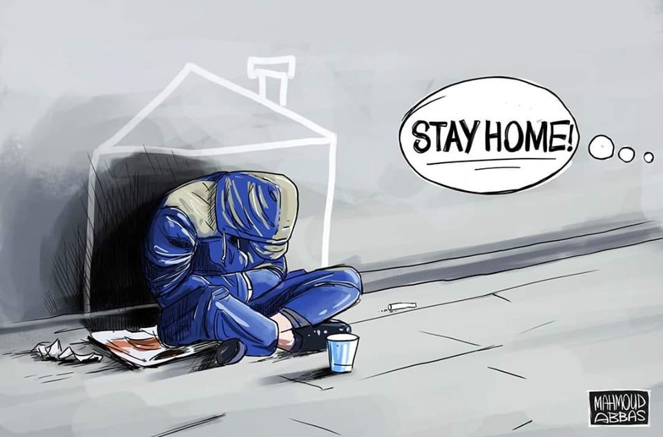
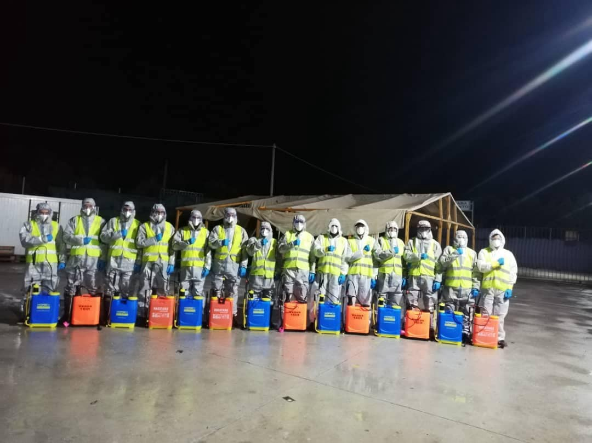
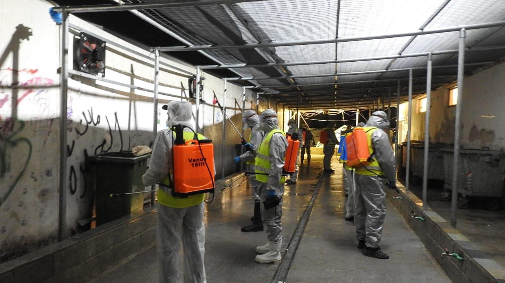
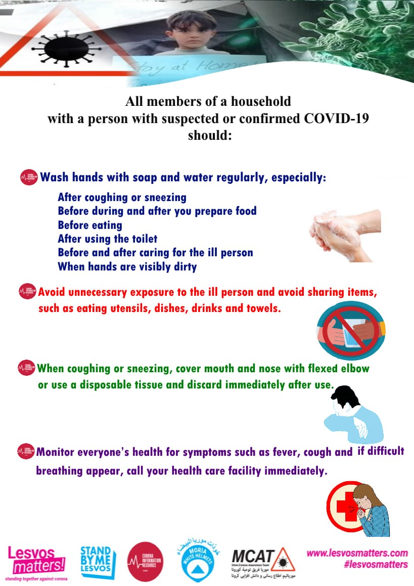
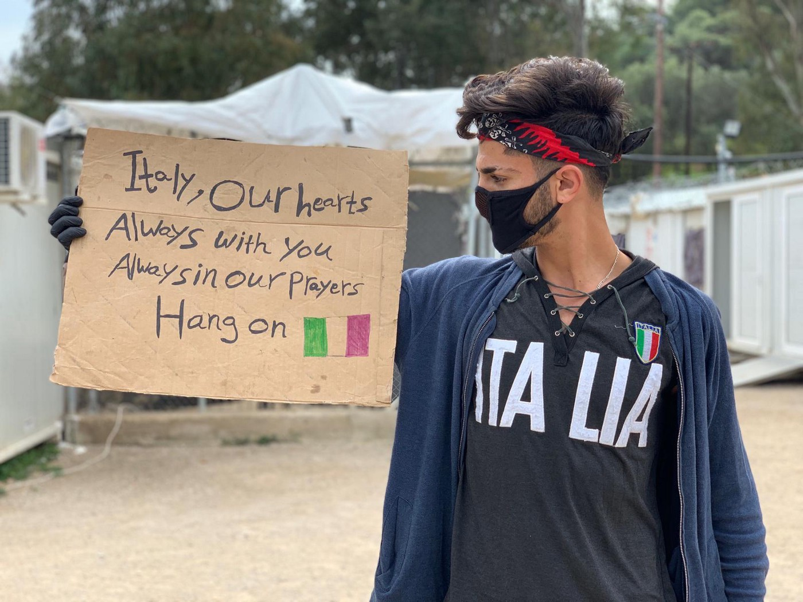
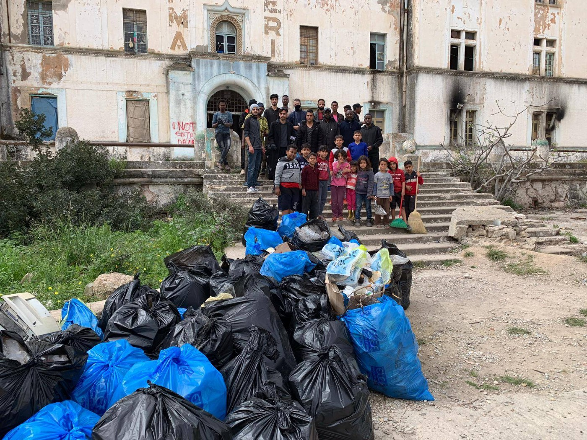
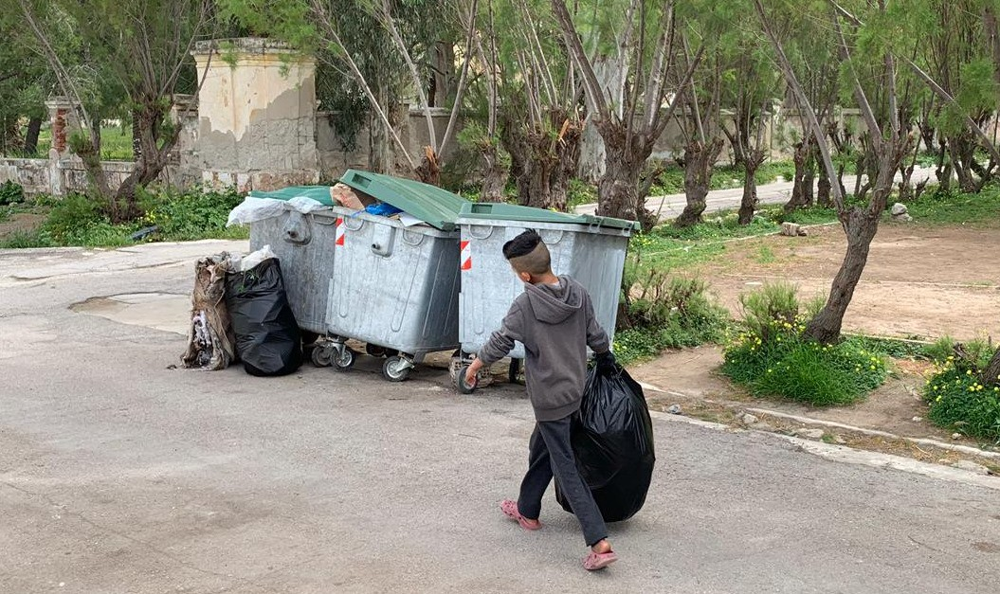
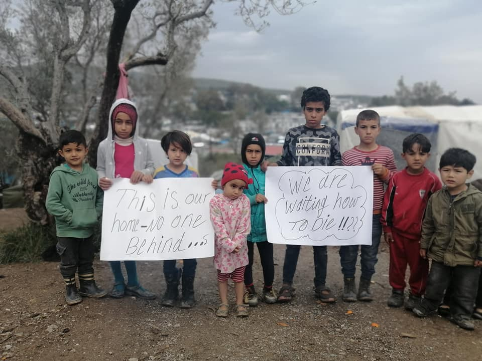

### AYS Weekend Digest 4–5/4/2020: Protests in German reception centres

Greece: Malakasa is the second camp in lockdown after one resident tested positive / Libya: people detained in Khoms left with no food / SEA: Rescues and returns in the Western Med / More from Germany, The Netherlands and Luxemburg

“Stay Home” by Mahmoud Abbas
#### FEATURE — Protests in German reception centres as more residents test positive

The numbers of confirmed COVID\-19 cases within refugee structures has continued to increase over the weekend, leading to rising tensions in camps all over the country, with many being put under quarantine\. Information for residents is scarce at best about the measures that have been taken\. The supply of food, NFIs and sanitary products is poor and the call for social distancing is completely impossible to achieve\.

■■■■■■■■■■■■■■ 
> **[Together we are Bremen #ShutDownLindenstraße NOW!](https://twitter.com/WeAreBremen) @ Twitter Says:** 

> > https://t.co/ZUNDBjhNF3 

> **Tweeted at [2020-04-02 07:26:27](https://twitter.com/wearebremen/status/1245613550770384896).** 

■■■■■■■■■■■■■■ 

A refugee centre in the German town of Halberstadt in Sachsen\-Anhalt has been under quarantine since Friday 27th March\. Up until the time of writing thirty people have been tested positive for the virus and have been isolated in another facility\. The centre accommodates more than 800 people who are now under quarantine\. The premises are police controlled, which effectively means people are locked in\. Rooms are shared between up to 6 people\. The canteen is now closed\. People must queue to receive the meagre food boxes instead\.

They have not been allowed to leave the premises for ten days now\. Frustration about the unsatisfactory food distribution, a lack of sanitary products, and the overall situation that does not allow the residents to practise physical distancing due to a lack of space increased during the week\. The sanitisers, soap and toilet paper provided are not enough\. From what we could gather, up to 50 people share a single toilet, which obviously highly increases the risk of infection\.

On Saturday, some of the residents started protesting against these conditions\. Around 100 started a hunger strike\. A fence, which had been put up between the different buildings in order to reduce contact among the residents, was eventually removed by the residents\. Security guards reacted aggressively\. An additional 50 police officers were transferred to the camp\. In the ensuing dispute between security forces and residents, a pregnant woman was affected\. She was later transferred to a hospital as a preventive measure, but was apparently released later on\. Members of the security forces and residents both filed complaints for alleged assault\.
The police did not actually intervene on a large scale, but pictures from the police operation appeared in a far right facebook group, fuelling the fear that the police is far from being neutral towards the residents\.

■■■■■■■■■■■■■■ 
> **[disturb_the_tristesse](https://twitter.com/monitor_mermore) @ Twitter Says:** 

> > #Solidarity to the protesting people in the #ZAst #Halberstadt! You are not alone! Stand together fight together win together! Keep on fighting! #solidarityistheanswer #LeaveNoOneBehind #onestruggle #onefight #stopracism #nocops #noauthority https://t.co/to32hsEYyv 

> **Tweeted at [2020-04-05 12:11:38](https://twitter.com/monitor_mermore/status/1246772482784268288).** 

■■■■■■■■■■■■■■ 

On Saturday evening, a meeting took place between residents and camp management\. Residents were reportedly promised an improvement of food, personal products and sanitary products\. Beside the lack of supply, the lack of information is an urgent topic in many different reception centres all over Germany\. Without proper information in different languages people become extremely scared and alarmed when the whole camp is put under quarantine\. Some infected people are being transferred and the employees will start to wear masks, yet still there is no real improvement in the situation with regard to the spreading of the virus within the camp\.

People in these centres are kept in extremely vulnerable living conditions\. So far, the only answer to reported cases of corona within a camp is to put the whole camp under quarantine and therefore to try to keep the virus from leaving the camp, while at the same time leaving the people in the camp to fend for themselves\.

LIBYA
#### IOM’s monthly report on Libya for March 2020

■■■■■■■■■■■■■■ 
> **[IOM Libya](https://twitter.com/IOM_Libya) @ Twitter Says:** 

> > IOM Libya's Monthly Update for the period of 1-31 March 2020 is out. https://t.co/zXsl5Upgr1 

> **Tweeted at [2020-04-04 18:24:55](https://twitter.com/iom_libya/status/1246504033772322824).** 

■■■■■■■■■■■■■■ 

Libya continues to register more cases of Covid\-19\. This poses a serious threat to thousands of displaced civilians and people on the move, especially those detained in overcrowded centres and with no access to health care\.

Giulia Tranchina reports about [people on the move in detention in Khoms](https://www.facebook.com/photo.php?fbid=10157527672498621&set=a.10150438475713621&type=3&theater) \. As in many other places, the coronavirus emergency has been used as an excuse for worsening living conditions, even where it is difficult to imagine how this is even possible\.

> Refugees in Khoms detention centre are starving\. The abusive Libyan authorities usually took them out and forced them to carry out hard labour\. Some days they would not pay them at all, some days they would give them 5dinars, which they would then be asked to pay to get a little food\. They often torture them and sell detainees to other traffickers\. 

> Now with the Covid19 lockdown they are not taking them out for forced labour, they are not giving them any food and they are not allowing them to go out to look for food\. [UN Refugee Agency](https://medium.com/u/75f2bdd89854) never brings food or water and last visited over three months ago, doing nothing to help\. They are now starving and many are already sick and malnourished\. About 46 of them are survivors of the horrible shipwreck of 25 July 2019, when about 300 people died\. 

> \[People\] have now been detained in Khoms for almost a year, enslaved and starved by the criminal EU\-funded Libyan authorities\. They are at breaking point\. 

> **They need immediate evacuation\. \#CriminalEurope \#EvacuateRefugeesFromLibya** 

SEA

Gorden Isler, of Sea eye, [report](https://twitter.com/gorden_isler/status/1246422269758488576) s that “almost 800 people departed from Libya in March\. A total of 43 disembarked in Italy, on the Sicilian island of Lampedusa, while about 155 have landed in Malta\. The rest were captured at sea by the Libyan coast guard and have been deported back to Libya\.”

A total of 19 people are still missing after the shipwreck of Friday, from which two people have been confirmed dead\.

[One boat](https://elfarodeceuta.es/rescate-personas-patera-naufragio-mortal/) , carrying 32 people, was intercepted by the Moroccan Navy while trying to reach the Canary islands\. They were returned and transferred to a centre in Dhakla\.

[Two more boats, with 56 people](https://twitter.com/txemita/status/1246511883793940480) , were located in distress south of Gran Canaria\. They were transferred to the Arguineguín Pier \(Mogán\) \. “Half a thousand people have come to the Islands since the Alarm State was decreed\.”

A fourth boat was [located](https://www.efe.com/efe/canarias/tribunales-y-sucesos/salvamento-traslada-al-sur-de-tenerife-a-27-inmigrantes-3-ellos-ninos/50001342-4213484) south of Tenerife\. It was transferred to the port of Los Cristianos on the island\. On board were 29 people, three of them children, as well as two women in an advanced state of pregnancy\.

GREECE

**The ongoing impact of ‘quarantine’ for new arrivals…**

■■■■■■■■■■■■■■ 
> **[Iasonas Apostolopoulos](https://twitter.com/Iasonas_Apost) @ Twitter Says:** 

> > Right now, 127 refugees, including babies and families, are left to stay for 14 days under the rain, without a shelter, because the greek state imposed a quarantine at the place of the boat landing.
The mayor of Western #Lesvos, Taxiarhis Verros, is keeping the UNHCR camp closed https://t.co/TmvdtbeM3t 

> **Tweeted at [2020-04-04 19:54:53](https://twitter.com/iasonas_apost/status/1246526674524688387).** 

■■■■■■■■■■■■■■ 

The same [local source states](https://web.facebook.com/iasonas.apos/posts/10163431253785385?hc_location=ufi) that from 23rd March, 127 people were abandoned to sleep in the countryside in valleys, mountainsides and beaches, including women with babies\.

> Why all this? 

> Immigration Minister Mitarakis has officially asked islands to indicate a place or hotels for the hospitality of refugees\. The answer of most mayors is “we don’t give hotels\-we don’t give anything, bring a boat from Athens and put them there”\. The boat hasn’t come, so people sleep in the countryside\. 

[Further reports](https://twitter.com/maledictus/status/1246488417871040512?fbclid=IwAR2dDZmldeuV72xLKpQ2XWaAqBL3Y-KVC2-87MY1VWAgL-en7UGSBiU1VnU) state that 25 people have been left to sleep and ‘quarantine’ on an old bus\. Even [people who were provided with tents by UNHCR](https://twitter.com/Iasonas_Apost/status/1246537341306634240) were not allowed to put them up in the village of Petra, leaving 54 people to make a camp under old boats\.

**Camp Residents and Team Humanity disinfect communal areas in Moria**

“Surely the state’s job?” I hear you ask, “aren’t they in charge of Moria? Didn’t you only [recently report](ays-daily-digest-02-04-2020-greek-ban-on-asylum-applications-overturned-774c42f072f0) that the EU were giving the Greek Government financial support to prevent the spread of COVID\-19 in camps?” Well… instead it is the residents themselves and [Team Humanity](https://web.facebook.com/sk.aldeen.3/posts/1654637514694738?hc_location=ufi) who have undertaken this task\.

 \)](assets/fb632f5ad5f8/1*LGq9qeflmRWWLMBqYUc7mA.jpeg)

\(Photo Credit: [Salam Aldeen](https://web.facebook.com/sk.aldeen.3/posts/1654637514694738?hc_location=ufi) \)

■■■■■■■■■■■■■■ 
> **[Mortaza](https://twitter.com/mortazabehboudi) @ Twitter Says:** 

> > Refugees are cleaning Moria camp this morning. “When the authority do nothing, we do clean the camp..” the health condition is terrible, no soaps, no water and no hygienic products. https://t.co/pYDiyMrs0m 

> **Tweeted at [2020-04-04 07:50:45](https://twitter.com/mortazabehboudi/status/1246344442501611520).** 

■■■■■■■■■■■■■■ 

[**Moria Corona Awareness Team**](https://web.facebook.com/MoriaCoronaAwarenessTeam/photos/a.113457933616719/121079319521247/?type=3&__tn__=-R&hc_location=ufi) **Posters for Camps**

**Leros Corona Awareness Team**

[Stand by me Lesvos](https://web.facebook.com/www.standbymelesvos.gr/posts/606119249981101?hc_location=ufi) have also started helping on Leros after camp residents contacted them:

> We have a lot of plans, but started with the most urgent issue: Cleaning up the camp\. With our help they were able to purchase plastic bags and other material and started\. 

> And they also wanted to express their solidarity with the people in Italy who are worst hit by the Corona crisis\. 

> Now posters, awareness material and many more supplies will follow as well as advice from MCAT and us\. 

> Please consider to also support them with your donation: [https://standbymelesvos\.gr/support\-us/](https://l.facebook.com/l.php?u=https%3A%2F%2Fstandbymelesvos.gr%2Fsupport-us%2F%3Ffbclid%3DIwAR29bxfpceVfyhS7vLEvrD95x8qPMtMJE6NLSdhNxx5hmCG3Uqk7VqUArak&h=AT1Q4OgS0Sw3IcBKZG2zJoyGjZ2m2gtXYftMGli5_NTGl-7uqLHfQketHBH28hSqB93E3izAeDIAsMvKNSzpaab4VbwJCRy4EISXFiKv0wqjXCaoSGgJ4LCpyAemRgOmj1JsDbGEuq5DiBK8WK2AMtKKWcC7pvMBdWeBhrMT3DjHhJOALwh4vPYRGT33bux8LKZDYP18wFzlI26LQqAXSaux1-6OUUkUkauJo3cb7Bwb7jX7wrFG6MjB5ZP3jcSm5qY5NNkJSFSeyW6eACvB3xis1iUidJeaUwsEcPlAQ_XUbo-fCsvO08f7KK5F7hC0_XEe2DsINCTGMlsiSdI5iFV5nQahBhyFwYmQcWd085JE1JjPcVUTkFY_XN0ylh3PSdgGM-TrDBoQfor87StFKvRS7nq_tQOpwEq2-ZxvIKpuPFh45ENPGoPYfNEGY7AJVl_iQdvuJhabHjAG1gub3CrKM-wSQatjKd9_4nDRhmtYuc0PmnMLa7uKg2HquiKBR4_MTjH8bR7gh054kRSAX4Rx86gSap6o2VC_-hEQij5l-MS5sWq1LoFiz_ztdPIAxCQezFYFuGhb6N9TBuxpEa5K5M6IWWoYDu1x6KIVssNR6xRl2-aVkHIoIwfC3w) 

 \)](assets/fb632f5ad5f8/1*pjlFOqLy-UAEwToMF6ekvw.jpeg)

\(Photo Credit: [Stand by me Lesvos](https://web.facebook.com/www.standbymelesvos.gr/posts/606119249981101?hc_location=ufi) \)

Even the children of Leros Hotspot seem much more equipped to protect the people in the camp than the Greek Government…

**Further reports of illegal pushbacks at Sea**

■■■■■■■■■■■■■■ 
> **[Mare Liberum e.V.](https://twitter.com/teammareliberum) @ Twitter Says:** 

> > 🔴 BREAKING: @[HCoastGuard](https://twitter.com/HCoastGuard) using life rafts to #pushback #migrants towards #Turkey. @[ABoatReport](https://twitter.com/ABoatReport) reports that apparently even people that had already landed on shore were forced into these life rafts and dragged towards Turkish waters. 

[bit.ly/3aKylw3](https://bit.ly/3aKylw3)

📷 : ML / ABR https://t.co/GKYRL91Q18 

> **Tweeted at [2020-04-04 18:02:24](https://twitter.com/teammareliberum/status/1246498367531823107).** 

■■■■■■■■■■■■■■ 

Mare Liberum have also started a [THREAD](https://twitter.com/teammareliberum/status/1246828612399046656) monitoring the situation for new arrivals\.

Another [THREAD](https://twitter.com/daniel_howden/status/1246738628040146944) has been published following people’s experiences as they are moved to the new detention camps at Serres and Malakasa\.

**Continued calls from residents, groups and activists to take action**

■■■■■■■■■■■■■■ 
> **[Parwana Amiri پروانه اميري](https://twitter.com/parwana_amiri) @ Twitter Says:** 

> > The camps at the European external borders are a ticking time bomb. The people who live there must be allowed to go to Germany! The neighbourhood canteen says #leavenoonebehind. Leaving marks!
#LeaveNoOneBehind #EvacuateNow #EuropeMustAct 
Get involved in the action day! https://t.co/LGkq9kcMWh 

> **Tweeted at [2020-04-04 11:56:56](https://twitter.com/parwana_amiri/status/1246406397220327424).** 

■■■■■■■■■■■■■■ 

 \)](assets/fb632f5ad5f8/1*3EPO9kepKupdwWPJAYe8GA.jpeg)

\(Photo Credit: [Moria White Helmets](https://web.facebook.com/permalink.php?story_fbid=121050579538010&id=106807430962325&hc_location=ufi) \)

The problem is, despite repeated calls and endless promises, few results can be seen\.

> There are plenty of warnings\. The United Nations, Doctors Without Borders and many other aid organizations have been calling for weeks to evacuate Moria and other camps in the Greek islands\. In particular, Germany wants to fly out Covid 19 risk groups, including around 100 chronically ill children\. The association Mission Lifeline from Dresden has even collected donations for two evacuation flights to bring 1500 refugees to Berlin with the campaign “Ready for the Luftbrücke” campaign\. The EU has promised a similar order of magnitude\. Just: Nothing’s happening\. And if 1500 or even 3000 to 4000 people are flown out, what about the remaining 15 000 camp inmates on Lesvos? — [_Mittelmeer\-Watch Schweiz_](https://web.facebook.com/medalphon/?__xts__%5B0%5D=68.ARCNahQhWZmXuuerYQ-smF6_fDnlMqVf6OAivJLj9cEM28QuP7DnETw9P9TmpWJzs2dgFLGayW2j1PV6rnIvG26YjJ00ONjgVvcPvKwOCAq2MpsMJkr3acf_n7RhDzNvrmADmHDRAyBErwpzR-Eiu9VY6oWRlWbPJxhiZBNaYHF9Tz1wVWBqHjkTBF9secYGn_CHVvj6MV1WyGEwWNH4QkycRnS6hoadjd6edkvYLC4YaRw8DOBiz4uzBOFjwGYEHFCn8Nf_f0qvSXc5iikFa-YsCoNX0v2DRXrdpKLqyf6on29id6roMYyG3qmT2H-ErSJKUjD4m8s6O2XkBcbCB4IxnJcqjfBSN8qmKNglizklrwg3RPpJOiUd7z8ISiLCzJJs7S5kFfM66cNSi6rOyHjd3oY4aG-bj0N5e4i12DQPu42as6oNXCHvX5LWIY43C5ZkJWPEs4rWiKa2ZITnFGS52HihN-F6TFoLZBqxYLFSiZQMtBTk1n0&__tn__=k%2AF&tn-str=k%2AF) 

**Migration Ministry report drop in numbers**

[Local media report](http://www.ekathimerini.com/251325/article/ekathimerini/news/migrant-numbers-drop-on-islands-despite-spike-in-arrivals) that the number of people held in hotspots, hotels and apartments on the islands has dropped so far in 2020 from 41,899 \(the figure for same time period in 2019\) to 40,139\. The ministry state they will publish more figures in the coming week\.

**Second mainland camp on Lockdown**

Malakasa is in a [14 day quarantine](https://web.facebook.com/AegeanBoatReport/photos/a.285312485325196/805084540014652/?type=1&theater) after an [Afghan man aged 53](https://twitter.com/ActMust/status/1246772115593969664?fbclid=IwAR1Rxq8FDsE9fCiUrfQLu2JpRQg0szCvjpRlKnqUvFxUpH2llqkSZ0So5nY) with underlying health problems tested positive for COVID\-19\. He has been transferred to a hospital in Athens and his family are in quarantine\. A comrade and friend who lives in the camp yesterday had not even been informed of the reason for the lockdown by camp authorities\. In his words:

> if it is true why employees come inside camp even without mask ? 🤔 

As we reported last week, this is the second camp to go into lockdown as Ritsona also had confirmed cases, with 20 people testing positive so far, which makes the [total in camps now 24](https://twitter.com/_izzyellis/status/1246851129541091329) \.

That’s nearly 5,000 people in Ritsona and Malakasa who are now at risk of infection, some of whom live in tents, all of whom have limited access to protective measures\.

It has also [been reported](http://On Friday, a Court rejected 2 heavily pregnant women's requests to be released from Malakasa detention facility where no Covid-19 prevention measures are in place.) that on Friday, a court rejected two heavily pregnant women’s requests to be released from Malakasa detention facility where no Covid\-19 prevention measures are in place\.

Parwana, an Afghan teenager who spent three months in Moria before being moved to Ritsona, [reports that a pregnant woman](https://twitter.com/parwana_amiri/status/1246389354542628865?fbclid=IwAR2TI1N3T53IjaT4fLV1vsAP3AGaOEFMnmpwfX3Z7yAuV-_ytY_V85oPhvQ) who was bleeding did not want to go to hospital because she feared it was no longe safe, highlighting the knock\-on health effects of the COVID\-19 pandemic in Greece\.

You can read more of her writing [HERE](https://www.infomigrants.net/en/post/22415/afghan-teen-writes-letter-to-the-world-from-moria) \.

**COVID\-19 Database**

■■■■■■■■■■■■■■ 
> **[Izzy Ellis](https://twitter.com/_izzyellis) @ Twitter Says:** 

> > TRACKING COVID-19 IN GREEK REFUGEE CAMPS

@[NiamhKTabbal](https://twitter.com/NiamhKTabbal) &amp; I started this database to collect accurate numbers of Covid-19 cases in Greek camps &amp; trace developments.

It's open to all so please share &amp; collaborate.

[docs.google.com/spreadsheets/d…](https://docs.google.com/spreadsheets/d/1vluAp4GjjE5RMmdQAH0vFaYIcF1cNnifoWTgITQ3Pvc/edit#gid=0) 

> **Tweeted at [2020-04-03 07:05:21](https://twitter.com/_izzyellis/status/1245970627959443457).** 

■■■■■■■■■■■■■■ 

**General Greek Lockdown extended until the 27th of April**

Current measures will remain in place until this date and further travel restrictions may soon be brought in\. Read more [HERE](https://www.keeptalkinggreece.com/2020/04/04/greece-extends-lockdown-until-april-27-cases-deaths-coronavirus/#.XojExruGsi0.facebook) \.

**Criminal case against fake news**

A video suggesting that people trying to cross the northern border from Turkey into Greece were harming children to win sympathy has been categorically condemned as [fake news](https://racistcrimeswatch.wordpress.com/2020/04/04/1-991/?fbclid=IwAR074qtnPKtEEJ20QarFRHr-Q-TnozQdDdGzg6t0QNzAgP-z0xYC78ft7UE) \. It was unfortunately already aired on mainstream media channels, who seem to have no limits when it comes to searching out sensationalist stories, even at the risk of other peoples’ lives\. The xenophobic rhetoric encouraged under Mitsotakis’ government must stop now\.

BOSNIA and HERZEGOVINA

Videos have been [published](https://www.facebook.com/groups/299842110966517/permalink/539107543706638/) from inside Miral camp\. As we have seen in other camps and receptive structures throughout Europe, social distancing is impossible when people live in overcrowded and unsanitary conditions\.

Whatch them [HERE](https://www.facebook.com/blacck.diamond.54/videos/pcb.539107543706638/236805991033229/?type=3&theater&ifg=1) and [HERE](https://www.facebook.com/blacck.diamond.54/videos/pcb.539107543706638/236807971033031/?type=3&theater&ifg=1) \.

GERMANY
#### Solidarity action in Berlin, despite ban

Despite the restrictions on the freedom of assembly and the ban of protests in public spaces, a group of activists [protested in Berlin](https://taz.de/Proteste-fuer-Gefluechtete/!5673520/) in solidarity with people on the move stuck on the Greek islands\.

■■■■■■■■■■■■■■ 
> **[Erik Peter](https://twitter.com/retep_kire) @ Twitter Says:** 

> > Blitzschnell waren sie da. Schuhe von und für #LeaveNoOneBehind [pic.twitter.com/wXAaVTuzFm](https://twitter.com/retep_kire/status/1246741096702644224/photo/1) https://t.co/x6w5lTHNkF 

> **Tweeted at [2020-04-05 10:08:00](https://twitter.com/retep_kire/status/1246741370032832514).** 

■■■■■■■■■■■■■■ 

■■■■■■■■■■■■■■ 
> **[afrique-europe-interact](https://twitter.com/ae_interact) @ Twitter Says:** 

> > Gerade eben Protest vor #Kanzleramt: "Corona in Moria das ist Mord - Lager evakuieren jetzt sofort!" @[_Seebruecke_](https://twitter.com/_Seebruecke_) @[alarm_phone](https://twitter.com/alarm_phone) @[ProAsyl](https://twitter.com/ProAsyl) @[Oplatz](https://twitter.com/Oplatz) @[NeueOekonomie](https://twitter.com/NeueOekonomie) @[msf_de](https://twitter.com/msf_de) @[ISDBund](https://twitter.com/ISDBund) https://t.co/CxodUjBGIR 

> **Tweeted at [2020-04-04 10:41:12](https://twitter.com/ae_interact/status/1246387338781097991).** 

■■■■■■■■■■■■■■ 

LUXEMBURG
#### Better late than never — Luxemburg will be the first country to accept unaccompanied minors from Greece, Von der Leyen says

Media outlets [report](https://www.wort.lu/de/international/luxemburg-nimmt-kinder-aus-griechischen-lagern-auf-5e8839b0da2cc1784e35ac0e) that EU Commission President Ursula von der Leyen has announced that the “distribution” of around 1,600 unaccompanied minors from Greece should start next week\. Luxembourg is the first country to start, said von der Leyen on ARD on Friday evening\.

Given the slowness and the intricacy of the EU machine, we will keep updating you as to how this “relocation” program will actually be implemented\.

This is what the “distribution” of 1,600 minors from the greek islands’ RICs to eight European countries looks like:

](assets/fb632f5ad5f8/1*D5C2cN4O2MlP5v28dAibwQ.jpeg)

by [Europe Must Act](https://www.facebook.com/europemustact/photos/a.104489524497084/125780295701340/?type=3&theater)

THE NETHERLANDS

On Saturday 4th at 9PM, hundreds of people in The Netherlands joined SOS MORIA sending out SOS light messages from their homes, in [solidarity](http://Het grote thuisprotest | #SOSMoria signaal) with people on the move stuck in Greek camps\. Watch the video:

**Find daily updates and special reports on our [Medium page](https://medium.com/are-you-syrious) \.**

**If you wish to contribute, either by writing a report or a story, or by joining the info gathering team, please let us know\.**

**We strive to echo correct news from the ground through collaboration and fairness\. Every effort has been made to credit organisations and individuals with regard to the supply of information, video, and photo material \(in cases where the source wanted to be accredited\) \. Please notify us regarding corrections\.**

**If there’s anything you want to share or comment, contact us through Facebook, Twitter or write to: areyousyrious@gmail\.com**

_Converted [Medium Post](https://medium.com/are-you-syrious/ays-weekend-digest-4-5-4-2020-protests-in-german-reception-centres-fb632f5ad5f8) by [ZMediumToMarkdown](https://github.com/ZhgChgLi/ZMediumToMarkdown)._
