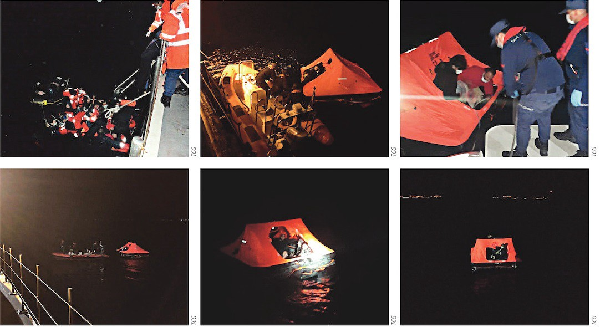
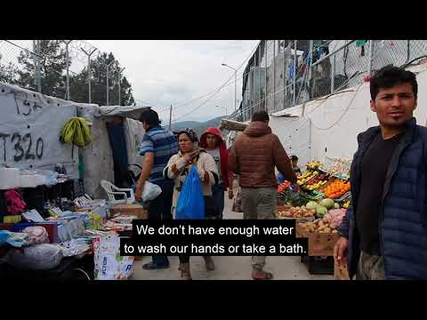
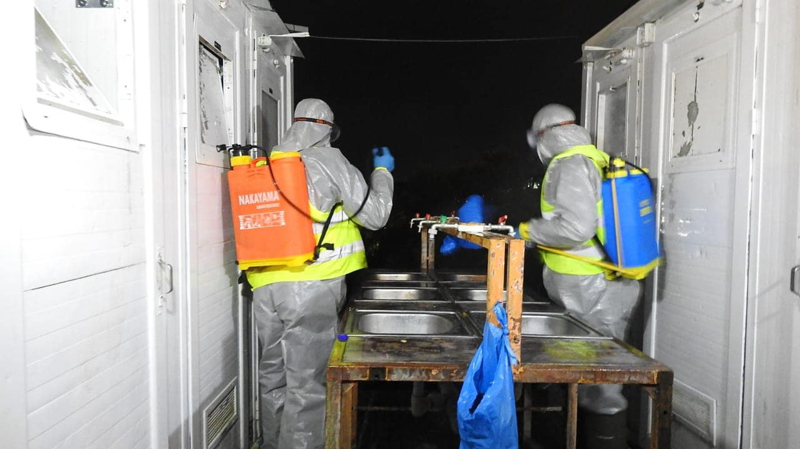
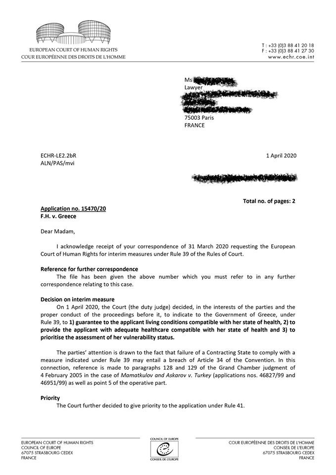
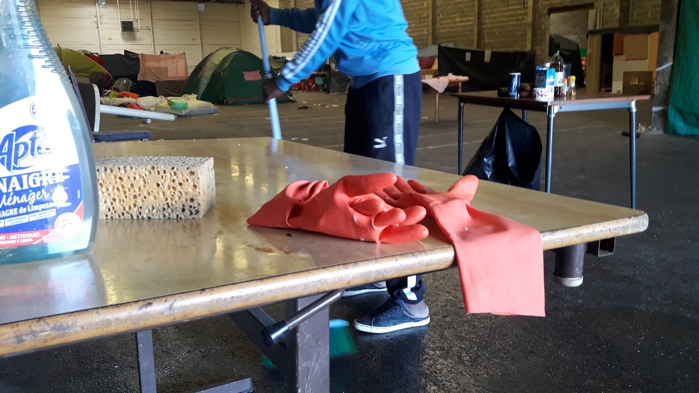

### AYS Daily Digest 07/04/20 Luxembourg and Germany agree to take in small number of children from Greece

_80 people still stranded at sea because of Italy and Malta // blackout in Libya // hunger strike in Moria // police brutality in Croatia // helpful resources you can use to support refugees during COVID\-19 // and more…_

](assets/e18dfc824a00/1*8h8LvnagaAhZq9PJjvDsfQ.jpeg)

“Keep distance\! Wash your hands\! This is what the posters say how to behave in Corona times\. This is our reality at the few stations where you have water\. How should we follow what the posters say?” Photo by [MCAT/ Aman Hussaini](https://www.facebook.com/MoriaCoronaAwarenessTeam/?eid=ARC1eKtIEpcD26YQ9OevfVZpRJe_zbE_B-9YvWXY3-rc7WA2GBgOklSbuUeSniide7q67SytVNmQ3k2n)
### FEATURE Luxembourg and Germany are finally going to take in some children suffering in Greece’s island camps\.

Germany is going to take in 50 and Luxembourg will take in…12\. There are at least [5,500 unaccompanied minors](https://abcnews.go.com/International/wireStory/eu-states-1600-migrant-children-greece-69584512) currently in Greece\. A group of countries decided last week to collectively bring in 1,600 of these unaccompanied children, but COVID\-19 has slowed this process\.

Luxembourg is the first country escort any these children; their 12 being on Lesvos and Chios currently\. Their relocation will happen sometime next week\. At least 5,488 unaccompanied children will remain living in horrid conditions afterwards\.

■■■■■■■■■■■■■■ 
> **[Verity Grace Glendenning](https://twitter.com/verityglendenn) @ Twitter Says:** 

> > Over 40,000 migrants on the Greek Islands which have a maximum capacity for 6000. And 8 EU states have said they can collectively relocate 1600. Seriously? One has said they'll take 12. 12? What even is that? I could take 12! Do better Europe. #EuropeMustAct #Refugeesgr #Greece 

> **Tweeted at [2020-04-07 12:33:10](https://twitter.com/verityglendenn2/status/1247502678923579393).** 

■■■■■■■■■■■■■■ 

#### LIBYA

](assets/e18dfc824a00/1*iuFUglvurQB92guTjkU0ZA.jpeg)

“Western and Southern Libya are in a power blackout, and Tripoli’s water supply has been cut off since yesterday\. It’s not easy to social distance in a war zone\.” By [Andrea Gagne](https://www.facebook.com/andrea.gagne?__tn__=%2Cd*F*F-R&eid=ARAJ43kSjZ8fC3RO3XZ3Xh2FW0o9HTvAauqp9U9dhB7b253f8P2yaVmDIjU8CJJwOqasy7RJvgfDBZvc&tn-str=*F)
#### SEA
### 80 people have been at sea for over 40 hours and neither Malta nor Italy are making any moves to rescue

[AlarmPhone](https://timesofmalta.com/articles/view/80-migrants-awaiting-rescue-at-sea-ngo-says.784037?fbclid=IwAR1jnvt1gxQQ2c075hcOf-1yLhz2DH8kiEpYBfK5NUg7vzIoZmNi3FC0VyI) sounded the alarm yesterday, but the response from governments is lagging, putting people’s lives on the line\.

■■■■■■■■■■■■■■ 
> **[Alarm Phone](https://twitter.com/alarm_phone) @ Twitter Says:** 

> > At 16:38h CEST we spoke to the people one last time. Our call was interrupted &amp; we received only half of a GPS position: N 34° 52'. Since then we have not been able to re-connect. They can’t spend another night at sea - #Italy &amp; #Malta need to coordinate a rescue operation! 

> **Tweeted at [2020-04-07 15:50:50](https://twitter.com/alarm_phone/status/1247552421469061122).** 

■■■■■■■■■■■■■■ 

Alarm Phone warns of Malta’s mishandling of their COVID\-19 response:

![“ **In recent months we have seen how Malta repeatedly failed to carry out Search and Rescue activities in adequate and lawful ways\.** We experienced how the Armed Forces of Malta risked people’s lives by delaying rescues and how they collaborated with Libyan authorities to intercept boats within Malta SAR\. We fear that the approx\. 80 people who are still at sea — now for over 40 hours — will also have to endure unnecessarily long in acute distress or that they are at risk of being illegally returned to the hell of Libya\. They have been spotted by a European asset from the air\. We call on authorities in Malta and the EU: rescue the ~80 people without further delay\! Do not return them to the Libyan warzone\! Do not breach maritime law, international law, and human rights conventions\! Do not use the [\#Covid19](https://www.facebook.com/hashtag/covid19?epa=HASHTAG) pandemic as an excuse to violate human rights\!” Photo by [AlarmPhone](https://www.facebook.com/watchthemed.alarmphone/photos/a.1526182797655958/2630422740565286/?type=3&theater)](assets/e18dfc824a00/1*pl7ak-Q_uTbaI0u3TjXi6w.png)

“ **In recent months we have seen how Malta repeatedly failed to carry out Search and Rescue activities in adequate and lawful ways\.** We experienced how the Armed Forces of Malta risked people’s lives by delaying rescues and how they collaborated with Libyan authorities to intercept boats within Malta SAR\. We fear that the approx\. 80 people who are still at sea — now for over 40 hours — will also have to endure unnecessarily long in acute distress or that they are at risk of being illegally returned to the hell of Libya\. They have been spotted by a European asset from the air\. We call on authorities in Malta and the EU: rescue the ~80 people without further delay\! Do not return them to the Libyan warzone\! Do not breach maritime law, international law, and human rights conventions\! Do not use the [\#Covid19](https://www.facebook.com/hashtag/covid19?epa=HASHTAG) pandemic as an excuse to violate human rights\!” Photo by [AlarmPhone](https://www.facebook.com/watchthemed.alarmphone/photos/a.1526182797655958/2630422740565286/?type=3&theater)
### On Monday, the rescue mission Alan Kurdi rescued 150 people\. On Tuesday, Malta and Italy refused to disembark the rescue ship due to COVID\-19 fears\.

To add to the severity of the situation, the Libyan Coast Guard fired shots in the air towards the first 68 people rescued on Monday\. It was quite a feat just to get them on the Alan Kurdi to begin with\. [This did not persuade](https://www.maltatoday.com.mt/news/national/101526/malta_tells_germany_it_will_refuse_disembarkation_to_rescued_seaeye_migrants#.Xo0TIMhKg2x) Italy and Malta\. After hearing those countries’ refusals, Germany said to Sea\-Eye and other rescue missions to bring in their boats and not to carry out any more missions for the time being\. [Gorden Isler](https://sea-eye.org/en/alan-kurdi-rescues-150-people-from-two-wooden-boats-in-one-day/?fbclid=IwAR3oR_nkO0ndz-tTwIJMhfDPHkMvgxQaul65PFzHMzfEdmBbZmube5whORQ) , chairman of Sea\-Eye e\. V, responded with:

> “Every human life is valuable\. We are sure, that the German Federal Foreign Minister will succeed in taking on additional responsibility for 150 people\. After all, Germany is our flag state\. During the past few days, the Federal Government has successfully repatriated 200\.000 of its own citizens from abroad in an immense effort\. It must be imaginable and humanly possible to send an aircraft for 150 safety\-seeking people to Southern Europe in order to immediately evacuate these people\. In Germany, there are approximately 150 cities in the Coalition of Safe Ports who declared their readiness to receive people on the move” 

#### GREECE → ISLANDS

Yes these pictures are of what you might be thinking…Greece is increasingly carrying out deportations to Turkey from the islands\. Photos by Ef\.Syn

Greek media is reporting that the Greek Coast Guard is located people, sending them off to sea until the “disappear” and the Turkish Coast Guard can take them back:

> “The “Ef\.Syn\.” has managed to identify specific refugee figures and today brings to light for the first time revealing documents, which not only prove the deportations, but also show that they are now being carried out with special lifeboats, which look like scenes on the sea\.” 

More [here](https://www.efsyn.gr/ellada/koinonia/238226_epanaproothoyn-prosfyges-sta-nisia-me-eidikes-thalassies-skines) \.

**A statement from inside Moria** \( [where food lines](https://twitter.com/HIASGreece/status/1247607702466985987) are 2 hours long, people are afraid to get in the line for fear on contracting the virus; there is no running water; police are absent except to guard the gates, where they only let people out for medical emergencies; people testify that there has been increased violence since the lockdown; people have not received any updated information on asylum services…\):

### 3rd day of hunger strike in Moria Prison

On April 5th, the prisoners in Moria’s pre\-removal detention centre went on strike for their immediate removal\. [No Border Kitchen Lesvos](https://www.facebook.com/NBKLesvos/posts/1700242050115577?hc_location=ufi) explains:

> “These days governments across the world have been releasing people with short sentences from prison, while **the Greek state continues to insist that no migrant detainees will be released\.** The men here in the prison are held in administrative detention and have committed no crime\. They are detained only because of their status\. Some because of their nationality, some because their asylum claim was rejected, some because they tried to leave the islands, some even because they signed up for supposed “voluntary return”\. Many of those with rejected claims haven’t even had the opportunity to apply for asylum, because of recent legal changes discriminating against people who don’t speak the colonialist language of the country they fled from\. They are awaiting deportation to Turkey, despite there being no deportations scheduled for the foreseeable future\.” 

](assets/e18dfc824a00/1*91c6xOm19ZSF7DnXsWQkpQ.jpeg)

Hunger Strike in Moria Photo by [No Border Kitchen Lesvos](https://www.facebook.com/NBKLesvos/photos/a.722870371186088/1700242016782247/?type=3&theater)

[Migration Minister’s](https://www.mitarakis.gr/gov/migration/1987-dt-yma-proslipsi-dioikitwn-symvasiouxwn?fbclid=IwAR1Gw2atNg2O1LFOyakp1r_Db9SFUi3sqLUHF9PTdLobpnMQwpGI_uUK0hM) page says medical staff is recruited for detention centres:

> “today began\(…\) recruitment of emergency staff\(…\), lasting three \(3\) months to meet the extraordinary needs of the Reception and Identification Centers and Temporary Supply and Supply Structures for Hosting Services\. A total of 150 people will be hired at the KYT of Lesvos, Chios, Samos, Leros and Kos, as well as at the Structures of Malakassa and Sintiki” and Evros prison outpost\. \*” 

> “new arrivals from March 1 have not been taken to the Reception and Identification Centers of the Islands but in separate quarantine areas, however there are difficulties to do so\(…\) \. So far, the Ministry has not received a positive response from the municipalities for hotel rentals for the removal of vulnerable groups from the KYT to the islands\. “The European Commission has offered to cover hotels for the most vulnerable for a short time now due to the crisis, we have a written response from the local municipality that it refuses to use hotels to get the most vulnerable out of Moria\. What some are calling for a mass decongestion of Moria, that is, for 15,000 people to come from Moria to mainland Greece amid the crisis of the corona \(…\) \.there are no 15,000 vacancies in the hinterland and if there were they would be in structures like Ritsona\. And in the end, it is not a given which place is safer “, the Minister stressed\. 

 Photos by [Salaam Aldeen](https://www.facebook.com/sk.aldeen.3/posts/1656490364509453?hc_location=ufi)](assets/e18dfc824a00/1*4hZBKWTls7nDpnUrTU8ZzA.jpeg)

“Every night Team Humanity take preventive measures against COVID\-19 by disinfecting common areas within Moria camp \(water stations and bathrooms\) \. **Please help us to continue this effort\.** Support our COVID\-19 campaign to let the refugees know the world cares about their health and safety” [https://gogetfunding\.com/team\-humanity\-hope\-peace\-center/](https://gogetfunding.com/team-humanity-hope-peace-center/) Photos by [Salaam Aldeen](https://www.facebook.com/sk.aldeen.3/posts/1656490364509453?hc_location=ufi)

■■■■■■■■■■■■■■ 
> **[Franziska Grillmeier](https://twitter.com/f_grillmeier) @ Twitter Says:** 

> > On the 28th of March 1 medical centre was set up outside of #Moriacamp to treat #refugeesgr showing #COVID_19 symptoms. Flu + cold however is common among 19,000 residents —&gt; difficult to determine who gets tested. Without emergency evacuation = no way to avoid mass contagion. 

> **Tweeted at [2020-04-07 14:38:30](https://twitter.com/f_grillmeier/status/1247534218411827204).** 

■■■■■■■■■■■■■■ 

![“ **Please help us build an extra emergency food line and feed an additional 1,500 residents in a safe, hygienic and dignified way\.** The current foodline located inside the walls of Moria camp has become increasingly more chaotic due to the tensions of \#COVID19\. That’s why we recently decided to relieve some of the food line\-related pressures by introducing a new distribution point in our Olive Grove campUs\. And now, we want to double our impact by building an extra emergency food line in another zone, a project that will be designed, constructed and fronted by our resident volunteer team\! And this is where we need you to step in\. Please help us to make this plan a realisation\. We need your help to raise €2,000 for food line building materials in order to improve the lives of an additional 1,500 residents in a safer and more hygienic way\.” [Help Movement on the Ground here\.](https://www.facebook.com/movementontheground/posts/1672091099633862?hc_location=ufi)](assets/e18dfc824a00/1*yhhuMQfKrFBc9QYb2jwgnQ.jpeg)

“ **Please help us build an extra emergency food line and feed an additional 1,500 residents in a safe, hygienic and dignified way\.** The current foodline located inside the walls of Moria camp has become increasingly more chaotic due to the tensions of \#COVID19\. That’s why we recently decided to relieve some of the food line\-related pressures by introducing a new distribution point in our Olive Grove campUs\. And now, we want to double our impact by building an extra emergency food line in another zone, a project that will be designed, constructed and fronted by our resident volunteer team\! And this is where we need you to step in\. Please help us to make this plan a realisation\. We need your help to raise €2,000 for food line building materials in order to improve the lives of an additional 1,500 residents in a safer and more hygienic way\.” [Help Movement on the Ground here\.](https://www.facebook.com/movementontheground/posts/1672091099633862?hc_location=ufi)

In an update on the Europe Must Act petition:

> “Our campaign is producing results\! Tomorrow a delegation of Europe Must Act will have a meeting with the EU Commissioner for Home Affairs, Ylva Johansson\. We look forward to having a constructive dialogue with the Commissioner\. We will stress the need for immediate action to ensure the safety of the 39,500 people trapped on the Aegean Islands\. There can be no compromise on human rights\. The islands must be decongested\.” 

In some new arrivals reports:

■■■■■■■■■■■■■■ 
> **[Lighthouse Relief](https://twitter.com/LighthouseRR) @ Twitter Says:** 

> > 130 people are still stranded on the north shore of Lesvos despite rain &amp; wind last week. 3 groups who arrived on 3/22 &amp; 3/23 have been living in precarious conditions for over 2 weeks &amp; 39 people arriving on 4/1 completed the 1st week of what has been called a quarantine period. 

> **Tweeted at [2020-04-07 21:03:43](https://twitter.com/lighthouserr/status/1247631162543157248).** 

■■■■■■■■■■■■■■ 

■■■■■■■■■■■■■■ 
> **[Lighthouse Relief](https://twitter.com/LighthouseRR) @ Twitter Says:** 

> > People, incl. 49 children are sleeping in rudimentary tents, w/o access to electricity or sanitary facilities. Our team has coordinated w/other actors to provide clothes &amp; hygiene products, though our direct access is limited due to COVID-19 measures. Photo: Attika Human Support https://t.co/6abLuPPtvq 

> **Tweeted at [2020-04-07 21:03:43](https://twitter.com/lighthouserr/status/1247631163348393993).** 

■■■■■■■■■■■■■■ 

![“We are happy to share this positive decision from the European Court of Human Rights, following our request for interim measures\!
The Court obliges Greece to provide adequate healthcare and appropriate living conditions to a vulnerable applicant\. Our beneficiary is a pregnant woman who is living in a tent in the so\-called “jungle” area of the refugee camp in Samos, altough she is about to give birth\. Her living conditions can be seen in the pictures \(above\) \. The Court is also warning Greece to implement adequate measures to counter the corona virus in the European Hotspots\. ASF France welcomes this decision, and wishes to continue its legal aid work for asylum seekers in this complex times\.” Photos by [Legal Centre Samos](https://www.facebook.com/LegalCentreSamos/posts/531932034417345?hc_location=ufi)](assets/e18dfc824a00/1*iXUp_A6IeHZAXdeLGJwx3A.jpeg)

“We are happy to share this positive decision from the European Court of Human Rights, following our request for interim measures\!
The Court obliges Greece to provide adequate healthcare and appropriate living conditions to a vulnerable applicant\. Our beneficiary is a pregnant woman who is living in a tent in the so\-called “jungle” area of the refugee camp in Samos, altough she is about to give birth\. Her living conditions can be seen in the pictures \(above\) \. The Court is also warning Greece to implement adequate measures to counter the corona virus in the European Hotspots\. ASF France welcomes this decision, and wishes to continue its legal aid work for asylum seekers in this complex times\.” Photos by [Legal Centre Samos](https://www.facebook.com/LegalCentreSamos/posts/531932034417345?hc_location=ufi)
#### GREECE → MAINLAND

](assets/e18dfc824a00/1*asGU_UIrih1jH3wtoTyLeQ.jpeg)

Photo by [YANNIS KOLESIDIS / EPA\-EFE / Shutterstock](https://www.spiegel.de/politik/ausland/coronavirus-in-griechenlands-fluechtlingslagern-helft-uns-es-ist-nicht-sicher-hier-a-11dd6dea-946b-4f32-9a1c-5ee7a057eca2?fbclid=IwAR3oR_nkO0ndz-tTwIJMhfDPHkMvgxQaul65PFzHMzfEdmBbZmube5whORQ)
### Ritsona camp has been in lock down for 5 days now

…no asylum seeker in or out since at least 23 out of 2,700 people living in the camp have tested positive for COVID\-19\.

[The 23 people](https://www.spiegel.de/politik/ausland/coronavirus-in-griechenlands-fluechtlingslagern-helft-uns-es-ist-nicht-sicher-hier-a-11dd6dea-946b-4f32-9a1c-5ee7a057eca2?fbclid=IwAR3oR_nkO0ndz-tTwIJMhfDPHkMvgxQaul65PFzHMzfEdmBbZmube5whORQ) who tested positive for the virus continue to live with their families, who most likely will contact it soon, and none of them show any symptoms of the virus as of yet\. Therefore, they are said to feel discriminated by the tests and are refusing to move to the camp’s designated quarantine areas\.

All 23 persons are from African nations, which is unfortunately increasing acts of racism in the camp\. One of the residents said that the other refugees are avoiding African nationals\.

Testing has stalled in the camp because the medical professionals can only go in to conduct the tests with police, but fewer police are willing to enter now\.

![“CALL FOR SOLIDARITY WITH DETAINED WOMEN AT PETROU RALLI PRISON: Visits to the Petrou Ralli detention centre have now been banned due to measures relating to the COVID\-19 pandemic\. Nonetheless, all the essential items that you donated were packaged and delivered to the detained women on Thursday, March 26th\. The same will be done, wherever possible, throughout April and May… until the detention centre empties\! We are calling on you, individuals and self\-organized communities from the fighting solidarity network from below; on you who always stand by the vulnerable and marginalized\. If you would like to assist by donating items from the list below, you can send us a message at our Facebook inbox/messenger or email: [spiti\.gynaikon@gmail\.com](mailto:spiti.gynaikon@gmail.com) to co\-ordinate and discuss where to deliver donations\. We have 6 different addresses in various areas of Athens, where they can be delivered or collected\.” Post made on and find out more here at [athens\.indymedia\.](https://athens.indymedia.org/post/1604243/)](assets/e18dfc824a00/1*UXTFI-zY5UjrY5X4g0fANw.png)

“CALL FOR SOLIDARITY WITH DETAINED WOMEN AT PETROU RALLI PRISON: Visits to the Petrou Ralli detention centre have now been banned due to measures relating to the COVID\-19 pandemic\. Nonetheless, all the essential items that you donated were packaged and delivered to the detained women on Thursday, March 26th\. The same will be done, wherever possible, throughout April and May… until the detention centre empties\! We are calling on you, individuals and self\-organized communities from the fighting solidarity network from below; on you who always stand by the vulnerable and marginalized\. If you would like to assist by donating items from the list below, you can send us a message at our Facebook inbox/messenger or email: [spiti\.gynaikon@gmail\.com](mailto:spiti.gynaikon@gmail.com) to co\-ordinate and discuss where to deliver donations\. We have 6 different addresses in various areas of Athens, where they can be delivered or collected\.” Post made on and find out more here at [athens\.indymedia\.](https://athens.indymedia.org/post/1604243/)
#### CROATIA
### Croatian police brutality…

](assets/e18dfc824a00/1*TCAisUDb_EjsZoRgaso7ew.jpeg)

“Another nightmare\. It will never end\. Last night a refugee was brutally beaten by the Croatian police\. His friends had to build a stretcher with wood to transport him back to Bosnia\. A local called the Bosnian police because the ambulance refused to pick him up on the border in Sturlic\. The Bosnian police transported the boy to the hospital\.” Photo by [Beja Kudic](https://www.facebook.com/photo.php?fbid=1150418218645492&set=a.152333821787275&type=3&theater)
#### FRANCE

In a new PSM brief, they provide brief camp and security updates on Cherbourg, Dieppe, Lille, the side of Norrent Fonts, Ouistreham, Steenvoorde, and of course Calais\.

> “In Calais, between 800 and 1000 people live on the different jungle, and have not been confined\. From the beginning of the health crisis, and as it went, several associations had to withdraw, including Refugee Community Kitchen as of March 24, leaving only Salam and Active Life for food distribution\. The forced evictions of camps continued despite the health crisis, even when the police forces themselves were leaving and demanding to stop the daily evictions\! Police violence has grown on the exiled; law enforcement has sanctioned several associations with tickets, for one of them, police saying that people were “not vulnerable enough” for volunteers to use the certificate derogating from that capacity\. At the level of the authorities, a solution on the basis of volunteer s’ volunteering was set up a first time on Friday, March 27 \(86 people safe\), and on Monday, April 6, a similar operation took place in the same format\. On the health response, the Red Cross, Doctors of the World and the PASS are best involved in its coordination: joint maraudes are put in place to inform, raise awareness and guide the people who are living\.” 

[Read the full update here\.](https://www.facebook.com/chiara.lauvergnac/posts/10157582797059092?hc_location=ufi)

Photo by Collectif Action Logement 14\\09

In an update from Collectif Action Logement 14\\09 they lament the ways the state has failed to relocate people during the pandemic:

> “One week for the day after the start of a housing and accommodation operation aimed at “safe” in an epidemic environment, more than 180 people still living at the squat of the Veyettes in Rennes, the balance sheet without being totally negative, fortunately, is more than mixed\. A few crucial points are even ineligible\. 

> First, some data: more than 130 people were more or less welcomed in various structures and in various places of the Ille\-et\-Vilaine\. There are about thirty residents left in the Veyettes, of which at least 80 % of people scattered, ran away\. A number of people don’t have requisitioned places with or without the Collective Action Collective 14 09\. The negotiations are continuing with the state, that is to say with its social services the SIAO, the Abbé Pierre Foundation, a roof is a right, the Red Cross to get the accommodation of the 30 people still on site\. The best delays would be 48 H…” 

They continue on with how the state has continued to assert positions under the cover of COVID\-19 against actors helping homeless refugees and asylum seekers\. Find out more [here](https://www.facebook.com/113624680024756/photos/a.113755160011708/235166701203886/?type=3&theater) \.

In an update on their AIDA \(The Asylum Information Database\) 2019 report on France, ECRE added some details concerning the country’s decisions during the pandemic and the consequences for refugees in France:

> Subsequently measures have been taken to limit access to the asylum procedure for newly arrived asylum seekers…On 31 March 2020 the following measures were being applied: 

> **“Access to the procedure** : Registration activities have been temporarily suspended following the closure of the single desks for asylum seekers \(Guichet unique pour demandeur d’asile — GUDA\) \. Subsequently, access to the asylum procedure and to reception conditions is suspended\. 

> → This measure has no legal basis and mainly resulted from the lack of available civil servants within State agencies\. No derogations are foreseen for applications lodged at borders, although it should be noted that the implementation of the existing legal framework already faces challenges \(see in particular Access at the Italian land border\) \. 

> → An instruction has been published by the French Prime Minister on 18 March 2020 with the aim to limit the spread of Covid\-19 at borders, but it makes no reference to the right to seek asylum\. 

> **Reception conditions** : Asylum application certificates have been extended for three months, thus ensuring access to reception conditions during that time\. 

> → Reception centres have been instructed to not remove asylum seekers that are currently being accommodated, including rejected\-asylum seekers and beneficiaries of international protection\. Asylum seekers who registered their application for international protection prior to the closure of GUDAs are being accommodated gradually by the OFII in the remaining reception places\. The remaining reception capacity amounts to 3% to 5%\. 

> → Asylum seekers who are not provided accommodation may resort to emergency accommodation which are currently being established in accordance with the Ministry for Territorial Cohesion\. 

> \* \* \*It should be further noted that the declaration of a state of health emergency has enabled the suspension of time limits for appeals in many areas, including appeals against decisions taken by the determining authority \(i\.e\. appeals in front of the CNDA and/or other appeals\) \.” 

[Read the full report here](https://www.asylumineurope.org/sites/default/files/report-download/aida_fr_2019update.pdf?fbclid=IwAR2Mn8cDlxUByk_7_YnykOFVS6O6CXERijwCJR1G6a5HeUmkwr-_6ZAqzT0) \.
#### GENERAL

[Josephine Goube](https://techfugees.com/tfblog/how-is-coronavirus-affecting-refugees/?fbclid=IwAR3jRN5NafQzu713uzygUUPeLrQkGDeY7oHAJcluYfnU24QWUAAcy5ldruQ) wrote a poignant piece on Tech Refugee’s blog about tracking COVID\-19 among refugee populations and some helpful steps:

> “The facts speak for themselves; the message is clear\. Compassion is a strength, one that brings tangible material benefits to native and migrant populations alike\.” 

> “But it’s not all bad news\. Anyone can help refugees in need, using practical technologies which Techfugees have helped support over the past five years from their homes\. Here are a few of our favorites; you can find more on [our Covid\-19 collective doc](http://bit.ly/covidtechfugees) \. 

> Services like [NaTakallam](https://natakallam.com/) let you take language classes from refugees, supporting them and learning a new language in the process\. In times of lockdown and economic hardship, this is a particularly vital financial lifeline for many\. 

> If you know healthcare workers or immigrant families who need translation or interpretation to fight Covid\-19, share [Tarjimly](https://www.tarjim.ly/en) with them to get free immediate help\. This app is a translation service helping refugees overcome language barriers, providing them with on\-demand interpretation and translation for health matters right now\. 

> If you’re a doctor yourself faced with [coronavirus related patient issues](https://en.medshr.net/covid) , [MedShr](https://en.medshr.net/) is an app which lets medical professionals exchange information and enables peer\-to\-peer learning around the world\. In areas with limited hospital infrastructure, like camps, this app can literally make the difference between life and death\. You can also [participate in their initiative to collect data on Covid\-19](https://letsbeatcovid.net/) \. 

> [Audiopedia](https://www.audiopedia.org/corona-volunteer) has started building a library of coronavirus health information delivered as audio whatsapp messages in a number of languages spoken by refugees, and they’re looking to get more\. You can [get involved](https://basefugees.org/en/projects/corona-whatsapp-audio-campaign) and help them expand\. 

> Finally, [Habibi\.Works](https://habibi.works/) supports local communities and medical actors by providing 3D\-printed materials for humanitarians and health workers\. Where resources are scarce, being able to print vital parts out of thin air is another life\-saving idea\. 

> **In a world that’s getting scarier by the day, the response from a handful of well\-organised tech\-for\-good activists should serve as a message of hope\. The tools are there, all we need is the will to use them before one crisis falls prey to another\.”** 

_Converted [Medium Post](https://medium.com/are-you-syrious/ays-daily-digest-07-04-20-luxembourg-and-germany-agree-to-take-in-small-number-of-children-from-e18dfc824a00) by [ZMediumToMarkdown](https://github.com/ZhgChgLi/ZMediumToMarkdown)._
