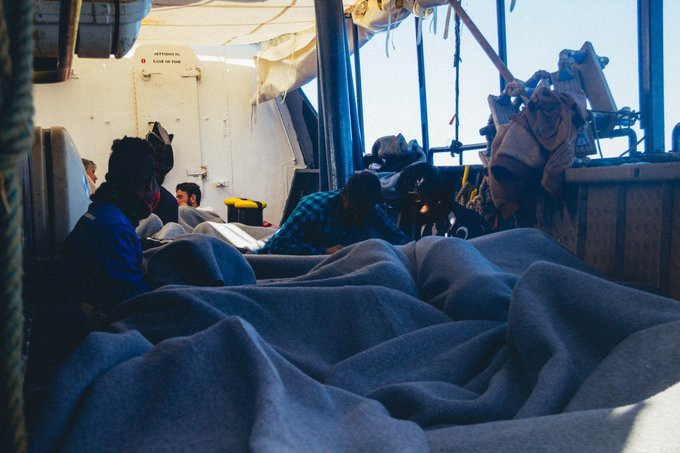
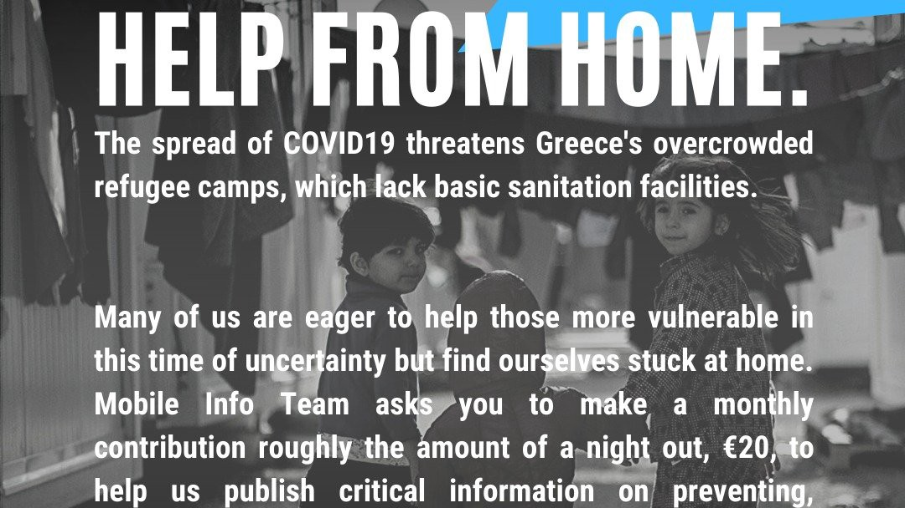

### AYS Daily Digest 08/04/20: Will working restraints now be lifted so that refugees can save the European agricultural sector?

New regulation concerning the work permit for refugees in Spain // Overview on measures with effects on access to asylum system // Updates from Libya and Cyprus // ALAN KURDI is searching for a safe port // Italy and Malta declared their ports “unsafe” because of national health crisis // New police brutality in Greece

Once again the ALAN KURDI is looking for a safe port\. Copyright: Sea Eye
### FEATURE: In times of crisis, refugees are suddenly good enough to work on Europe’s fields

Under the slogan “I Was a Foreigner” a new campaign has been started in Italy in order to call on the government to issue stay permits for undocumented migrant workers in Italy\. Since many foreign field workers are not able to enter Italy due to travel restrictions, a high number of field workers is missing to keep the agricultural sectors working\. It is assumed that this lack will cause many farmers to rely on the illegal work of undocumented migrants\. They in turn would not be protected against exploitation and deportation and would be exposed to health danger\. To grant them stay and work permits would allow the farmers to rely on their work but at the same time enable better protection for the workers\. 
Italy is not alone in looking for new ways to deal with the shortage of seasonal workers\. Germany and Spain also saw a discussion in the resent weeks on whether or not to use migrants to work on the fields in order to compensate for the lack of foreign workers\. In Germany there is a shortage of up to 300,000 foreign workers, most of them usually come from Poland and Romania and have been working on the same farms for years\. 
In both countries it was proposed that groups of refugees and migrants who are usually barred from working because, for example, they receive state benefits, could be given a limited work allowance in order to work on the fields\. In Spain this decision was taken just now\. 
Although this would be an important step in the current times in order to avoid illegal and therefore unprotected labour, it is a humanitarian disaster that Europe would only allow people to stay and work for them when they are needed in order to protect European wealth\. This is not an act of solidarity or of humanitarian values but of pure selfishness\. If migrants are officially used to work on the fields and remedy the shortage of foreign workers, this must result in stay permits, access to labour protections, and proper recognition\. It must be guaranteed that all measures that protect from the spread of corona virus amongst the workers are put into place\.

For more information about the campaign in Italy see:

For more information on the situation in Spain, see:

### GENERAL

The European Council on Refugees and Exiles \(ECRE\) published a paper that collects the measures which have an effect on the situation of asylum seekers who have been taken by European countries relating to the corona pandemic\. It comprises measures regarding access to asylum, detention, Dublin transfers, reception conditions and integration, and access to health care and public services\. The paper gives a good overview on the current situation, showing that the right to apply for asylum has effectively been suspended in most countries, either officially or de facto\. 
You can find the paper in the link in this tweet:

■■■■■■■■■■■■■■ 
> **[ECRE](https://twitter.com/ecre) @ Twitter Says:** 

> > INFORMATION SHEET 8 APRIL 2020:
COVID-19 MEASURES RELATED TO ASYLUM AND MIGRATION ACROSS EUROPE - info from @ECRE, #AIDA, #ELENA, @PICUM and @[JRSEurope](https://twitter.com/JRSEurope): [bit.ly/39V0f7A](https://bit.ly/39V0f7A) https://t.co/y6u5Lk6OeS 

> **Tweeted at [2020-04-08 15:39:45](https://twitter.com/ecre/status/1247912020873281540).** 

■■■■■■■■■■■■■■ 

### LIBYA

Some 200,000 Libyans are currently displaced, as new data published by IOM indicates\. This week one of the few functioning health facilities in the capital Tripoli was damaged\. The Al Khadra hospital has been treating COVID\-19 patients\. 
Besides the displaced people, there are many more people in Libya living under unbearable conditions\. At least 1,500 are being held in detention facilities and many more are in the hands of smugglers and traffickers\. They are out of the reach of any humanitarian support\. 
For more information on the current situation from IOM see here:

Here you can find a map of Libya that indicates the effect of the measures taken amidst the corona crisis for people on the move\.

■■■■■■■■■■■■■■ 
> **[OCHA Libya](https://twitter.com/OCHA_Libya) @ Twitter Says:** 

> > New @[IOM_Libya](https://twitter.com/IOM_Libya) map shows how airport closures, restricted land borders, maritime boundaries and domestic movement affect people on the move: [dtm.iom.int/reports/libya-…](https://dtm.iom.int/reports/libya-%E2%80%94-mobility-restriction-dashboard-1-08-april-2020) #COVID19 https://t.co/1FSlvvWfWF 

> **Tweeted at [2020-04-08 17:13:57](https://twitter.com/ocha_libya/status/1247935727402352643).** 

■■■■■■■■■■■■■■ 

### CYPRUS

On Cyprus, the head of UNHCR is worried about the fact that asylum seekers do not have proper access to information about the current situation or how to access asylum procedures in times of restrictive measures\. The obligation to allow access to asylum procedures must be met\. 
Information from UNHCR about the situation on Cyprus for asylum seekers can be found here:

For more information on the statement of the head of UNHCR Cyprus see:

### SEA

This morning the fourth day started on board of the ALAN KURDI for 150 people who have been rescued from two wooden boats on Monday by the crew of the Sea\-Eye ship\.

■■■■■■■■■■■■■■ 
> **[sea-eye](https://twitter.com/seaeyeorg) @ Twitter Says:** 

> > The third night on board the #ALANKURDI begins.
We have medically examined all of the rescued, many are exhausted.

150 guests on board need a safe port.

Europe must not forget them.
#LeaveNoOneBehind https://t.co/Gq6UtUrCMJ 

> **Tweeted at [2020-04-08 19:28:00](https://twitter.com/seaeyeorg/status/1247969460800999425).** 

■■■■■■■■■■■■■■ 

A speedboat under the Libyan flag has tried to intervene in the rescue operation by firing bullets in the air, which obviously caused panic amongst the people on board\. 
The Maltesian and Italian Ministries declared that their ports cannot be considered safe ports due to the health emergency caused by the corona virus\. A decree issued on Tuesday by the Italian ministries says:

> “For the entire duration of the national health emergency, due to coronavirus, Italian ports cannot be classified as ‘safe places’ for the landing of people rescued from boats flying a foreign flag\.” 

■■■■■■■■■■■■■■ 
> **[Sara Creta](https://twitter.com/saracreta) @ Twitter Says:** 

> > #Italy New decree signed to declare seaports unsafe &amp; avoid disembarkations. “For the entire duration of the health emergency, due to #coronavirus, Italian ports cannot be classified as ‘safe places’ for the landing of people rescued from boats flying a foreign flag.” https://t.co/DRwipgTiYu 

> **Tweeted at [2020-04-08 10:46:32](https://twitter.com/saracreta/status/1247838229048549377).** 

■■■■■■■■■■■■■■ 

The national health emergency is set to last until 31 July, but might be extended, depending on the situation\. Following the publication of the decree, the German Ministry of the Interior called for the ALAN KURDI crew and other rescue ships to stop their operations\. The Sea\-Eye ship ALAN KURDI is operating under the German flag\.

For the Press release from Sea Eye in German see:

After three weeks without any landings on **Lampedusa** , one boat with 34 people landed on the coast\. Eleven of the arrivals were women, two of them pregnant\. They were immediately brought to the reception centre where they will be placed under quarantine\.
For more information see:

### GREECE

A very important and helpful list of places that still offer help amid the corona lock\-down:

The European Court of Human Rights ordered the Greek authorities to transfer an old man with underlying health issues out of Vial Camp in Chios\. According to the Court the man must be granted living conditions which are not an inhumane and degrading treatment, hence a violation of Art\. 3 ECHR\. The man was living in a tent without a mattress, together with members of his family\. He was not able to shower for weeks because he was not physically able to queue up for hours in order to wait in front of one of the few showers\. Instead he had to use his drinking water to wash himself, and that is limited to 1\.5 litres per day\. Especially for elderly people, the WHO advises self\-isolation so they can protect themselves from infection with corona virus\. At Vial camp, as at almost all other camps all across Europe, this is impossible\. 
For more information and the full decision see:

Police violence against asylum seekers is on the rise amidst the corona lock\-down and often occurs in the context of patrols for movement restrictions\. Three recent cases have been collected by anti\-fascist groups in Greece\. Two of them took place in Athens, another on Samos\. On Samos, a man from Cameroon who was waiting with other people in a queue outside of a super market was checked for his documents of movement based on racial profiling\. The police reacted brutally when it turned out he did not have all the required documents\. They started to beat him, tried to push him into a police car and later forced him to sign a document in Greek, which he did not understand\. No copy has been given to to him\. 
In all three cases a criminal complaint has been filed against the police officers\.

According to eyewitnesses, four people tried to set an abandoned building on Lesvos on fire in which refugees are living\. The building is near a LIDL supermarket in the area of Kara Tepe\. The aggressors halted their plans when they realized that people were in the building, but threatened to come back\.

A sixteen\-year\-old Afghan boy has been stabbed to death in Moria by a young adult\. The boy lived with members of his family in a tent outside the main camp of the Moria Identification Centre\. After his death became known, fights broke out amongst teenagers, leading to the injury of four youngsters\.
This event is tragic\. But if we consider the circumstances the people and especially the kids live under in Moria, it is a wonder that there aren’t more escalations of violence\. Every death in Moria is Europe’s responsibility\. Europe is responsible for the overcrowding, the fact that unaccompanied minors stay with no protection, and that mental health issues are not being properly treated\.

The Mobile Info Team started a campaign to raise funds for legal aid for refugees in Greece\. Under the slogan “help from home” they ask people to donate the money one would usually spend going out to dinners, bars or movies\.

Copyright: Mobile Info Team

Support them here:

**Find daily updates and special reports on our [Medium page](https://medium.com/are-you-syrious) \.**

**If you wish to contribute, either by writing a report or a story, or by joining the info gathering team, please let us know\.**

**We strive to echo correct news from the ground through collaboration and fairness\. Every effort has been made to credit organisations and individuals with regard to the supply of information, video, and photo material \(in cases where the source wanted to be accredited\) \. Please notify us regarding corrections\.**

**If there’s anything you want to share or comment, contact us through Facebook, Twitter or write to: areyousyrious@gmail\.com**

_Converted [Medium Post](https://medium.com/are-you-syrious/ays-daily-digest-08-04-20-will-working-restraints-now-be-lifted-so-that-refugees-can-save-the-ebaac9ac01a5) by [ZMediumToMarkdown](https://github.com/ZhgChgLi/ZMediumToMarkdown)._
