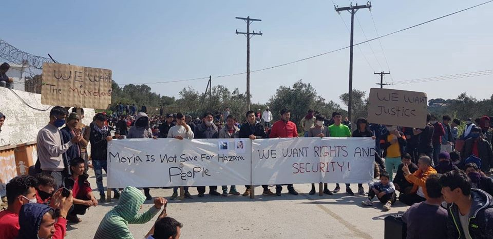
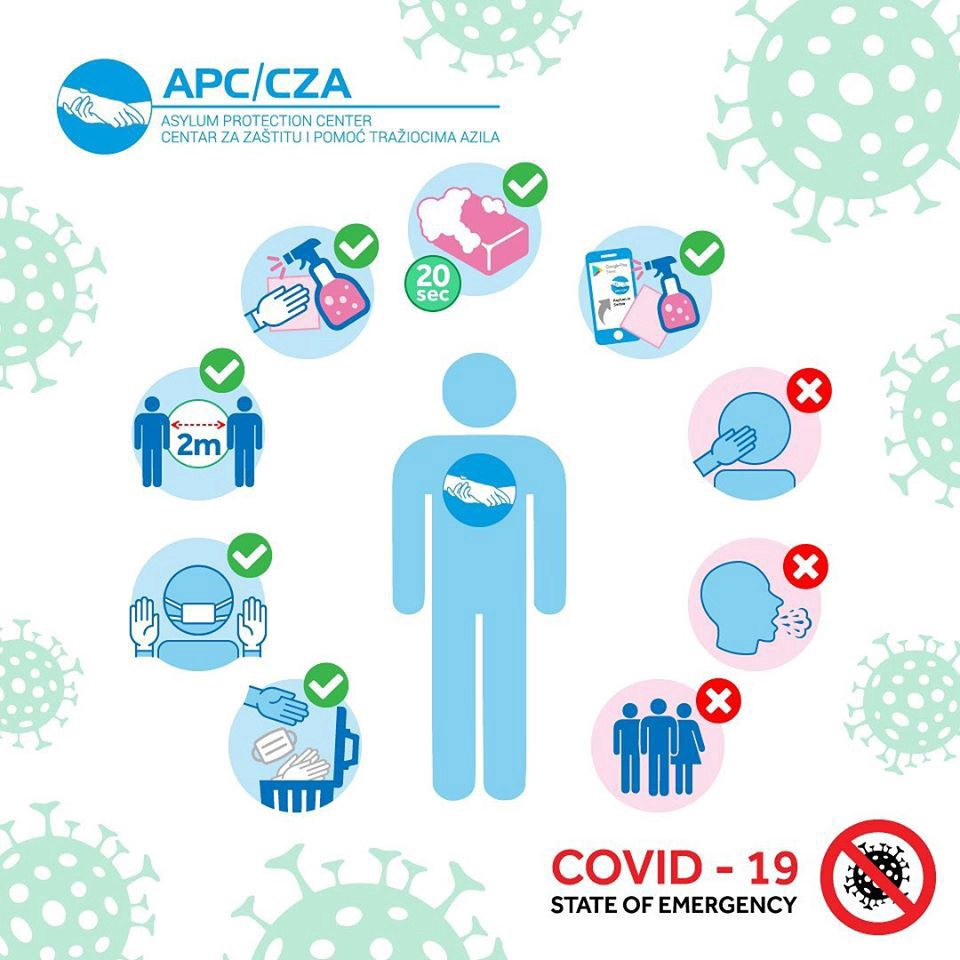

### AYS Daily Digest 10/04/2020: Police violence in Serbian refugee camp

[Are You Syrious?](@AreYouSyrious?source=post_page-----71f045fa5531----------------------)

[Apr 11](ays-daily-digest-10-04-2020-police-violence-in-serbian-refugee-camp-71f045fa5531?source=post_page-----71f045fa5531----------------------) · 9 min read

Assault on a 14\-year\-old boy in Krajaca refugee camp // Peaceful protest in Moria // Frustration in Berlin at the government’s handling of the coronavirus crisis // More lockdowns in Greece // Boats in distress off the coast of Tripoli

### Feature

The Asylum Protection Center in Serbia reports that a 14\-year\-old boy from Syria approached camp administrators at the Krajaca refugee camp, located 10km from Belgrade, to request his pyjamas but was then physically assaulted by the employee\.

The news of the young boy’s assault by the staff at the refugee camp angered many of the camp’s residents, who headed to the gate of the camp to complain and wait for the police under the belief that the police would assist them in seeking justice\.

At 3 pm a large group of police officers arrived at the camp entrance, with initial reports indicating the arrival of 10 police cars\. An announcement rang out across the camp demanding that everyone return back to their rooms\.

The police marched through the camp and started to arrest people\. It is believed they were using a list provided by the camp officials to find and locate individuals\. [Reports from inside the camp](https://www.facebook.com/brigitte.holzinger.7/posts/3025975967460854?hc_location=ufi) indicate the police used gas and excessive violence resulting in multiple injuries including a suspected broken arm\. The videos show people including women and children running from their buildings coughing and covering their faces because of the gas, with one woman fainting outside the building\.

The Asylum Protection Center reports the camp residents did not get an explanation of what the gas was and why the use of this gas and violence was necessary\. Two buses of people were taken from the camp, but it is unclear as to why or where they were taken\.
### Germany

A video published online from inside a refugee centre in Berlin indicates the growing frustration and fear at the German government’s decision to continue to house individuals who have tested positive for COVID 19 at these centres\. The video shows people from inside the centre trying to stop the police from transporting a coronavirus patient into the centre\.

[Speaking to German news outlet DW](https://www.dw.com/en/panic-in-germanys-refugee-centers-amid-coronavirus-quarantine/a-53086465?fbclid=IwAR3_IuEMgA9cFo-BhsY4yQpg7FY54Vg1Dz3yQPvoSl8F-sabFepIsUIs3mo) , a woman explained that _“We had just got used to those infected with coronavirus in our centre, we’d calmed ourselves\. But then new families were brought here and the situation escalated\. I’m worried about the children\. Why are they bringing infected people here? They’ve locked us in and on top of that they’re bringing infected people”\._ Continuing to explain the frustration with the government’s decision to transfer infected or potential infected individuals between refugee centres the woman explained “ _people panicked because nobody had given us any warning\. We couldn’t do any shopping in advance\. There were no sanitary towels left or other special products\. Everyone was aggressive and angry\.”_

The Berlin Office for Refugees \(LAF\) confirmed that in total four people \(one person who has tested positive for COVID\-19 and three other people who have been in close contact with the individual\) were transferred\. The LAF claim that the decision to move the four people was taken by a doctor at very short notice and thus the residents of the refugee centre wouldn’t have been able to be informed\.

Refugee rights organisations routinely criticise the conditions in the refugee centres, often citing cramped facilities and the inability for people to maintain their privacy\. People are forced to share bathrooms and kitchens, which is clearly exacerbating the current public health crisis\. An anonymous source from the public health authority spoke to DW and expressed concern that the complete or partial quarantine that many of these centres were being placed in without warning could act as a trigger for an individual already traumatised\. The source said that it would have made more sense if the German government had accommodated people in empty hotels but _“the problem was that everyone else was too worried about their own situation to think about what was happening to refugees”_ \. There are plans by the Berlin Health Department to open a centre where people who have been infected or in contact with someone infected can be housed, but as with the general coronavirus response, little has been done to ensure that the non\-German\-speaking population is fully informed\.
### Greece

After placing two refugee and migrant camps into lockdown, the Greek health authorities have additionally placed quarantine measures onto a Roma settlement in Larissa\. The Roma settlement houses an estimated 3,000 people of which 18 people have so far tested positive\.

Speaking to the state\-run Athens\-Macedonian News Agency, Mayor Apostolos Kalogiannis said this incident “confirms the worst\-case scenario”\.

[Info migrants](https://www.infomigrants.net/en/post/23948/help-for-refugees-and-undocumented-migrants-in-greece?fbclid=IwAR1KNeONQTaWq7QcfISXRxnFO93__a525mOSJs80uUCgbYncKr0ZnmincQ0) have recently published a list of helpful services, NGOs and aid groups that migrants and refugees can turn to in times of need\. The full list includes organisations that can assist unaccompanied minors, help facilitate medical care for people without documents, provide food distribution and general outreach\.

> **_Caritas Greece_** _: [The Catholic charity](https://www.caritas.gr/) provides social support services to migrants and refugees\. Their activities include the distribution of food and clothes as well as educational and psychological support services\. The main office is in Athens, and 10 additional regional offices are spread throughout Greece\. Contact them on Facebook — [CaritasHellas](https://www.facebook.com/CaritasHellas) — or call \+ **30 210 52 47879** \._ 

> **_Médecins Sans Frontières_** _\(MSF\) has expanded its activities in Greece in response to COVID\-19\. The organization is active on **Lesbos** and **Samos** as well as in **Athens** \. Their activities include “vaccinating migrant children against common childhood diseases, providing sexual and reproductive healthcare, treating chronic diseases and providing care for victims of torture and sexual violence\.” Contact [MSF on Facebook](https://www.facebook.com/msf.greece) or call **\+30 21 0520 0500**_ 

> **_Solidarity Clinics \(KIFA\):_** _The solidarity clinics operate throughout Greece and are funded by NGOs and private donations\. They offer free treatment and medicines to undocumented migrants as well as to people who have insurance but still cannot afford medication\._ 

For a full list of organisations please follow the link:
### [Help for refugees and undocumented migrants in Greece](https://www.infomigrants.net/en/post/23948/help-for-refugees-and-undocumented-migrants-in-greece?fbclid=IwAR1KNeONQTaWq7QcfISXRxnFO93__a525mOSJs80uUCgbYncKr0ZnmincQ0)
### [Many migrants and refugees are struggling to get by in Greece\. The coronavirus pandemic has made things even worse, as…](https://www.infomigrants.net/en/post/23948/help-for-refugees-and-undocumented-migrants-in-greece?fbclid=IwAR1KNeONQTaWq7QcfISXRxnFO93__a525mOSJs80uUCgbYncKr0ZnmincQ0)
#### [www\.infomigrants\.net](https://www.infomigrants.net/en/post/23948/help-for-refugees-and-undocumented-migrants-in-greece?fbclid=IwAR1KNeONQTaWq7QcfISXRxnFO93__a525mOSJs80uUCgbYncKr0ZnmincQ0)

Following the death of a young boy in the Moria camp, hundreds of people have decided to peacefully protest against the camp’s current security situation\. Demonstrators held banners saying “Moria is not safe for Hazara people” and “We want rights and security”\. The anger and frustration of the camp residents come after a continuing deterioration of the situation within the camp, with three tents having caught fire and one young boy tragically dying within the last 24 hours\.

Videos uploaded by the Moria Corona Awareness team show people peacefully sitting on the ground\. One participant of the protest explains: 
“We are here together to make a peaceful demonstration, as there are a lot of problems inside the camp\. So we don’t want any more fighting, war and anarchism inside the camp\. So our demand from the Greek organizations, the Greek government, from UNICEF and other organizations that are all working for the refugees, our demand is that Moria is not safe for every refugee from every camp\. Last night we lost a young boy, a minor aged 16 because we didn’t have good medical care here, the boy was bleeding a lot\. Because of the bleeding, he died\.”
### Malta

NGO alarm phone has raised the alarm because of a boat with 47 people in distresses floating off the coast of Malta after running out of fuel\. Alarm phone report that they informed the relevant Maltese authority of the distress call on 10th April at 22:59 CEST , affirming that it was the duty of the Maltese military to send a rescue vessel, but as of this morning its believed the boat is still adrift\.

Following yesterday’s report by Are You Syrious, citing data from NGO Alarm Phone, the boat with people in distress off the coast of Malta was rescued and disembarked 41 hours after the first alert\.

Yesterday, we reported that there was a boat of 70 \(now confirmed to be 66\) people who had contacted Alarm Phone claiming that the Maltese military had come and cut the cable of their boat mortar, leaving them adrift at sea\. They claimed that the Maltese military had told them that they would leave them to die in the water and said that ‘ _nobody will come to Malta_ ’\.

The alleged attacks on refugee boats by the Maltese military and the announcement from Malta’s government has led NGOs to release a joint statement criticising this decision and furthermore the decision to continue to detain hundreds of migrants\.

The statement signed by 16 NGOs working with migrants and refugees says that _“Migrants are also being detained in breach of their fundamental human rights, the public health emergency further strengthening a detention regime that was last year declared to be illegal by Malta’s courts\.”_ The joint statement concluded by saying “ _we express our serious concern at the way migrants are treated as disposable members of our community\. Whilst we appreciate Malta’s current challenges, we nonetheless insist that migrants must not be sacrificed for the nation’s well\-being\._ ”
### Sea

Alarm Phone has recorded two boats in distress off the coast of Tripoli\. A total of 55 people are drifting in international waters \(33°47, 13°35\) and one boat with 85 people had lost contact with Alarm Phone before they were able to get their GPS\-position\.

The ongoing work by Alarm Phone to document the dangers of sea crossing and to continuously pressure governments and local authorities to ensure that all those in distress at sea are rescued is valuable work\.
### Serbia

The Asylum Protection Centre \(APC\) has updated their advice on the coronavirus in Serbia\. APC regularly share useful information about the news related to the state of Serbia, as well as health care tips during the pandemic\. The material available on their mobile application is available in Serbian, English, Arabic and Persian\.
### Italy

In addition to publishing information for Greece, Info migrants have also compiled a list of helpful services, NGOs and aid groups that migrants and refugees in Italy can turn to in times of need\. These include both civic and church associations:

> _The **UNHCR** has launched [this website](https://coronavirus.jumamap.com/en/home/) along with the **Italian Recreative and Cultural Association ARCI** , where migrants can find information on how the coronavirus might affect them in particular\. They can also be reached on this toll\-free number: **800 905570** \._ 

> _People in the southern cities Naples and Salerno of can also receive qualified assistance by psychologists and social workers by contacting the [**LESS Cooperativa Sociale**](http://www.lessimpresasociale.it/) This is a service that reaches out in particular to people in quarantine or isolation, the elderly, dependent persons, single persons and foreign citizens\. Their services include food deliveries, legal assistance and linguistic help\. You can also reach them daily during business hours on the toll\-free number **800 119477** \._ 

For the full list please visit the link below:
### [Help for migrants in corona\-hit Italy](https://www.infomigrants.net/en/post/23879/help-for-migrants-in-corona-hit-italy)
### [Italy is one of the worst\-hit countries in the ongoing global crisis with the novel coronavirus\. Being also on the…](https://www.infomigrants.net/en/post/23879/help-for-migrants-in-corona-hit-italy)
#### [www\.infomigrants\.net](https://www.infomigrants.net/en/post/23879/help-for-migrants-in-corona-hit-italy)
### UK

Fergal Keane for the BBC reports on how the coronavirus pandemic is affecting refugees and migrants who have fled to the UK escaping persecution and poverty\. The short documentary highlights how many charities have had to cease operations due to the ongoing coronavirus crisis, reducing support for large numbers of vulnerable people, plunging thousands more deeper into poverty and desperation\. The UK government claims that it provides support for people who need it, but as the documentary shows, this clearly isn’t being accessed or simply the level of support is not enough\.
### [‘We’re afraid of the virus but we can’t do anything’](https://www.bbc.com/news/av/world-europe-52234123/coronavirus-virus-deepens-struggle-for-migrants?fbclid=IwAR0zKYNQryIuSeU2fqQsnhD0xgX1PHQXCfF5l2U-z8jbrQAXyhOfTaRzks0)
### [Migrants in Calais and the UK say the Covid\-19 pandemic is deepening the struggles they face\.](https://www.bbc.com/news/av/world-europe-52234123/coronavirus-virus-deepens-struggle-for-migrants?fbclid=IwAR0zKYNQryIuSeU2fqQsnhD0xgX1PHQXCfF5l2U-z8jbrQAXyhOfTaRzks0)
#### [www\.bbc\.com](https://www.bbc.com/news/av/world-europe-52234123/coronavirus-virus-deepens-struggle-for-migrants?fbclid=IwAR0zKYNQryIuSeU2fqQsnhD0xgX1PHQXCfF5l2U-z8jbrQAXyhOfTaRzks0)

**Find daily updates and special reports on our [Medium page](https://medium.com/are-you-syrious) \.**

**If you wish to contribute, either by writing a report or a story, or by joining the info gathering team, please let us know\.**

**We strive to echo correct news from the ground through collaboration and fairness\. Every effort has been made to credit organisations and individuals with regard to the supply of information, video, and photo material \(in cases where the source wanted to be accredited\) \. Please notify us regarding corrections\.**

**If there’s anything you want to share or comment, contact us through Facebook, Twitter or write to: areyousyrious@gmail\.com**

_Converted [Medium Post](https://medium.com/are-you-syrious/ays-daily-digest-10-04-2020-police-violence-in-serbian-refugee-camp-2f968c4f7657) by [ZMediumToMarkdown](https://github.com/ZhgChgLi/ZMediumToMarkdown)._
