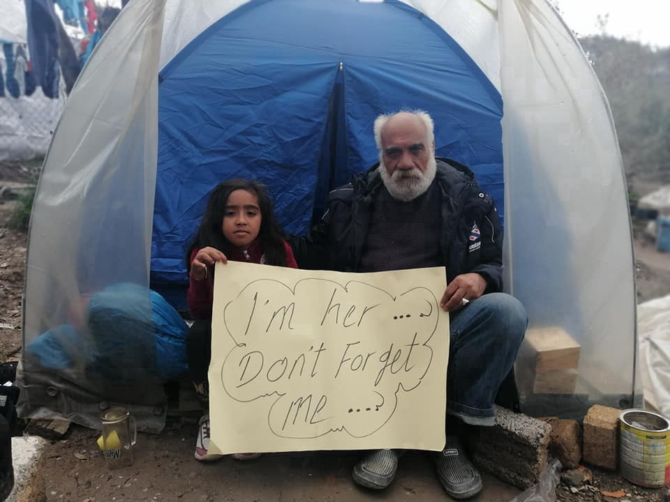

### کسی را فراموش نکنیم
#### AYS Weekly News Summary in Persian, March 30–April 5

### **اتحادیه اروپا**

او گفت : “ هرگز کسی پشت این تعهد را نخواهد گذاشت که احساس فوریت بیشتری داشته باشد \. همانطور که کشورها در سراسر جهان اقداماتی را برای کنترل گسترش ویروس کرونا ، از جمله فراز و نشیب‌های قفل و محدودیت‌ها در جنبش‌های افراد اجرا می‌کنند ، آن‌ها باید به تعهدات جهانی آن‌ها توجه کنند \. زمانی که کشورهای عضو دستور کار توسعه پایدار سازمان ملل را برای توسعه پایدار به تصویب رساندند، آن‌ها قول دادند که اطمینان حاصل کنند که هیچ‌کس از آن جا نخواهد رفت \. در میان آسیب‌پذیرترین مردم جهان ، پناهندگان و مهاجران هستند \. بحران ۱۹ — ۱۹ این گروه‌ها را در معرض خطر عظیمی قرار می‌دهد \. با این وجود ، تلاش‌های جهانی همه‌گیر در وظایف خود نسبت به پناهندگان و مهاجران ناکام بوده‌است \. کمیسیون اروپا تایید کرده‌است که هشت کشور عضو اتحادیه اروپا که ۱،۶۰۰ کودک را به خود اختصاص می‌دهند عبارتند از: لوکزامبورگ ، آلمان ، فرانسه ، پرتغال ، فنلاند ، لیتوانی ، کرواسی و ایرلند \.

قرار است جابجایی این هفته آغاز شود \.
### **ترکیه**

دو نفر از مهاجران در مرز ترکیه — یونان کشته شدند — سازمان عفو بین‌الملل \(رویترز\) — دو نفر از مهاجران ماه گذشته هنگامی که سعی کردند از ترکیه وارد یونان شوند ، کشته شدند \.

براساس تحقیقات سازمان عفو بین‌الملل ، پس از اینکه هزاران نفر در ماه فوریه به پازارکوله منتقل شدند ، دست‌کم دو مرد در مرز ترکیه و یونان کشته شده‌اند \. یک زن هنوز پیدا نشده است که نیروهای یونانی مهمات جنگی و گاز اشک‌آور به مردم شلیک کردند \. و افراد بیشتری مورد ضرب و شتم قرار گرفته و مجروح شده‌اند \.
### **یونان**
#### از آنجا که وضعیت در اردوگاه‌های پر جمعیت یونان غیر انسانی باقی می‌ماند ، وزارت مهاجرت و مهاجرت یونان دسترسی به مراقبت‌های بهداشتی را کاهش داده‌است \.

در عین حال ، صاحبان هتل‌ها در لیسووس از گروه‌های آسیب‌پذیر میزبان خودداری می‌کنند \. پیش از این، کمیته لیبه پیشنهاد حمایت مالی از این انتقال را ارائه کرده بود \. این امر تقریبا ً ۲۰،۰۰۰ نفر را در شرایط بدی قرار می‌دهد که در آن فاصله فیزیکی تقریبا ً غیر ممکن است چون مردم باید در یک منطقه کوچک گرد هم آیند و ساعت‌ها برای غذا آماده باشند \. ساکنان شکایت دارند که هیچ پیش‌گیری وجود ندارد \. در این میان ، هشت کشور عضو اتحادیه اروپا توافق کرده‌اند که ۱،۶۰۰ نفر از نوجوانان بدون استثنا یونان را تشکیل دهند و مقامات یونانی حدود ۲،۰۰۰ کودک را شناسایی کرده‌اند که در سن حاضر ارزیابی شده‌اند و آماده ترک هستند \.

او گفت : “ ما هیچ ماسک یا دستکش نداریم \. هیچ فاصله اجتماعی وجود ندارد \. ما هنوز منتظر ساعت‌ها در صف برای وعده‌های غذایی خود هستیم \. ما این وضعیت را متفاوت از بقیه دنیا تجربه می‌کنیم \. یک مرد پناهنده که از آفریقا ، اردوگاه واتی ، ساموس دارد وجود ندارد \.
### **اسپانیا**

وضعیت اضطراری جریان مهاجرت از تنگه جبل‌الطارق و دریای آلبوران را متوقف می‌کند اما نه در جزایر قناری \. از ۲۵۱ نفر که با قایق در نیمه دوم مارس وارد اسپانیا شدند ، ۲۴۷ تن به جزیره رسیده اند\.
### **بوسنی و هرزگووین**
#### ویروس کرونا “ تاثیر بر مردم در “ انتقال در بوسنی “

این بیماری همه‌گیر باعث افزایش سطح بالای بیگانه هراسی در بوسنی نسبت به مردم در این حرکت شده‌است \. مردم برای همیشه به اردوگاه‌ها محدود می‌شوند که در نهایت پس از سال‌ها تلاش سازمان‌ها برای حمایت از بس‌ترهای بیشتر افزایش پیدا کرده‌است \. حتی افزایش ۱۰۰۰ تخت در بلازووی به تنهایی کافی نیست \. مردم از اردوگاه‌های پر ازدحام خارج می‌شوند تا به شدت توسط پلیس دستگیر شوند و این چرخه ادامه دارد \.

برخی از گروه‌های داوطلبان مانند میگریت / کمک بلگراد به تامین تدارکات ادامه می‌دهند \. آن‌ها خواستار کمک مالی برای حمایت از کارشان هستند \.
### **فرانسه**
#### **شرایط غیرانسانی در کمپ اصلیه سینته**

منابع اردوگاه اعظم داستان‌هایی از بیماری , بی‌توجهی و خشونت دولت را بازگو می‌کنند \. در شب گذشته , مردی باید به بیمارستان برده شود تا تنگی نفس شدیدی را درمان کند \. اگر گروه درمانی در اردوگاه وجود داشته باشد , شرایط شلوغ در بالا به سرعت گسترش می‌یابد \. آمبولانس از قرن‌ها پیش زمان می‌برد و داوطلبان می‌گویند که درمان پزشکی کنداست و یا اصلاً وجود ندارد \. شب قبل , بهیاران از برخورد با پسری که توسط پلیس کتک زده شده‌بود , خودداری کردند \.

این خشونت و غفلت دولت باید پیش از مرگ مردم متوقف شود \. رد درمان پزشکی در طول یک اپیدمی مرگبار غیر انسانی است \!

دیوان اروپایی قوانین دادگستری علیه لهستان , مجارستان و جمهوری‌چک

دادگاه حکم داد که این سه کشور نتوانسته اند “ تعهدات خود را تحت قانون اتحادیه اروپا “ انجام دهند \. “ اقدام بیشتر توسط کمیسیون اروپا اتخاذ خواهد شد که اقدامات قانونی را علیه این سه کشور آغاز کرد \. هر سه دولت ملی به مخالفت خود و امتناع از پذیرش مردم در این حرکت اظهار داشته‌اند \.
### **بلژیک**

**در پی بحران جاری بهداشت و درمان , انجمن‌های کمک مهاجر بلژیکی در مورد عدم تداوم اقدامات دولت در محل برای حفاظت از مهاجران از شیوع بیماری صحبت کرده‌اند\.**

اجرای اقدامات مربوط به اقدامات پیشگیرانه به حقوق مهاجران در داخل کشور زیان رسانده‌است \. بسته شدن اداره خارجی‌ها در ماه مارس به این معنی است که اکنون درخواست پناهندگی در بلژیک غیرممکن است \. این امر علاوه بر این به این معنی است که تمام کمک‌های دولتی به پناهجویان جدید از جمله کمک‌های مالی , مسکن و مراقبت‌های پزشکی حذف شده‌است \.

به دلیل تداوم حمایت دولت , سازمان‌های غیردولتی در کشور باید خدمات خود را افزایش دهند \. مرکز پلتفرم شهروندان در “ پورت د “ در حال حاضر ۴ ساعت در روز باز است و با ظرفیت کامل کار می‌کند \. این پایگاه همچنین شبکه‌ای برای تسهیل اسکان مهاجران در هتل‌ها و خانه‌های خصوصی در بروکسل ایجاد کرده‌است که تعداد کل افرادی را که قادر به کمک به اسکان خود بوده‌اند , به ارمغان آورده‌است \.

الشرق‌الاوسط “ مگیدوبلوک \( وزیر امور اجتماعی , بهداشت عمومی , آسایشگاه و مهاجرت \) در مورد مسائل پناهندگی سکوت اختیار کرده‌است \. “
### **دانمارک**

در مخالفت مستقیم با دستورالعمل‌های ارائه‌شده توسط کمیسیونر حقوق بشر اتحادیه اروپا , دولت دانمارک تایید کرده‌است که آن‌ها هیچ برنامه‌ای برای آزاد کردن پناهجویان در حال حاضر در کشور ندارند \. این کمیسیون اظهار می‌دارد که در مواجهه با همه‌گیری جهانی بهداشت جهانی , بسیاری از کشورها مجبور به تعلیق برنامه خود از اخراج شده‌اند و تحت قانون حقوق بشر بین‌المللی , بازداشت موقت تنها تا زمانی مجاز است که بازگشت امکان پذیر باشد \. این چیزی است که تحت شرایط فعلی برآورده نمی‌شود \.
### **سوئد**

بسیاری از پناهندگان و مهاجران ممکن است حق پیوند مجدد خانواده به دلیل بحران در حال پیشرفت را از دست بدهند \. دفتر اشتغال دولتی سوئد سطوح بالایی از اعلان و اخراج را با ارقام ملی تلفات شغلی ثبت کرده‌است که در ماه مارس و در حال افزایش است \. زیان‌های شغلی در حال پیشرفت مربوط به بحران اقتصادی — اجتماعی , به ویژه برای هر کسی که متکی به درآمد ثابتی برای تحقق نیازهای اتحاد خانواده , الزامات اقامت یا تجدید مجوزهای کاری آن‌ها باشد , تاثیرگذار است \.

بسیاری از این پناهندگان اجازه اقامت موقت داده شده‌اند \. مگر اینکه آژانس پناهندگی تایید کند که نیازهای حفاظت آن‌ها منقضی شده‌است ، پس از انقضای مجوز اقامت موقت همه افراد اگر بخواهند در سوئد بمانند ، نیاز به کار داشته باشند \.

برای آن‌هایی که اجازه اقامت دائم دارند ، دشوارتر می‌شود ، نه گفتن غیرممکن است، تا با خانواده خود به عنوان قوانین فعلی متحد شوند که فرد باید بتواند هم خود و هم اعضای خانواده که می‌خواهد آن را به ارمغان بیاورد ، تامین کند \. میزان پولی که فرد پس از پرداخت اجاره هر ماه به آن نیاز دارد بسته به اندازه خانواده متفاوت است \.

هنوز مشخص نیست که چه تعداد از مردم تحت‌تاثیر قرار خواهند گرفت و عواقب آن چه خواهد بود \. به گفته پر اک ، رئیس مطبوعات در آژانس مهاجرت ، آن‌ها از آغاز شیوع تب ، سوالات زیادی از پناهجویان و دارندگان انواع مختلف مجوزهای اقامت دریافت کرده‌اند \. آن‌ها به عواقب آن پی می‌برند که می‌تواند برای موارد فردی داشته باشد — اما مشخص نیست که این امر تصمیمات را تغییر داده یا تحت‌تاثیر قرار می‌دهد \.

مورگان جانسون ، وزیر مهاجرت ، مصاحبه با رادیو سوئد را رد کرد ، اما گفت که هیچ برنامه‌ای برای بررسی یا تغییر قوانین فعلی وجود ندارد \.
### **قبرس**
#### پس از امتناع قبرس از پذیرش آن‌ها به علت ترس از ۱۹ سال ، دست‌کم ۱۷۵ نفر در دریا گرفتار شده‌اند \.

به عنوان بخشی از یک قانون جدید ، تنها قبرسی ها و سایرین با مجوزهای ویژه اجازه ورود به کشور در هنگام بیماری همه‌گیر شدن را دارند \. قایق پلیس به قدری نزدیک بود که برای یک مترجم پلیس به زبان عربی در مورد قوانین جدید صحبت کند \.

الجزیره با چند نفر سوار کشتی صحبت کرد و یکی از آن‌ها گفت : “ بسیار شلوغ بود ، امواج بلند بودند و قایق زیاد حرکت می‌کرد \. بچه را محکم در آغوش گرفتم \. پلیس گفت که شما نمی‌توانید به دلیل ویرووس کرونا وارد شوید ، ما گفتیم که ما به شوهر و خانواده مان ملحق می‌شویم و اگر از کرونا ویرووس وحشت داشته باشید می‌توانید ما را در کمپ تنها یا قرنطینه بگذارید \. اما آن‌ها امتناع کردند و سپس قایق‌ها شروع به چرخیدن کردند “ اکنون گفتند که پناهندگی در برابر قانون بین‌المللی است \. ما باید از آسیب‌پذیرترین افراد در برابر ابتلا به این ویروس محافظت کنیم \.
### **اسلوونی**

در سال ۲۰۱۹ به روز رسانی در سیستم پناهندگی در اسلوونی ، آن‌ها مروری بر تغییرات اساسی از زمان گزارش ۲۰۱۸ دادند :
### **روند پناهندگی**

افراط موثر در روند پناهندگی همچنان در سال ۲۰۱۹ به مساله اصلی تبدیل شد \.

استفاده از این روش به میزان قابل‌توجهی افزایش یافت \. در پایان سال ، بیش از ۳۰ % افراد بیش از شش ماه برای اولین بار صبر کرده بودند \.

تنها ۸۵ نفر در سال ۲۰۱۹ مورد حمایت بین‌المللی قرار گرفتند \. برای اولین بار ، جویندگان پناهندگی از کشور اریتره تصمیمات منفی در مورد درخواست پناهندگی خود صادر کردند \.

پذیرش شرایط پذیرش … استانداردهای بهداشتی کم‌تر و خطرات بهداشتی \.

یک راه‌حل سیستماتیک برای نوجوانان بی‌مصرف در سال ۲۰۱۹ پیدا نشد \.

به دلیل افزایش تعداد پناهجویان و تعداد پرونده‌ها ، متقاضیان به طور بالقوه در محل پرورشگاه یا شعبه آن بازداشت شدند در حالی که منتظر اعلام درخواست خود برای حفاظت بین‌المللی بودند \.

با این وجود تصمیم دادگاه عالی در مورد مقررات آی\.پی\.ای در مارس ۲۰۱۹ بازداشت پناهجویان را به علت فقدان مقررات تعریف “ خطر ناپدید شدن “ تعلیق کرد \. گزارش کامل را در اینجا بخوانید \.
### **نروژ**

در تظاهرات خارج از اسلو در روز سه‌شنبه ، ۷۴۹۹ جفت کفش در ساحل اولوایا جای گرفتند \.

هر جفت کفش نشان‌دهنده کودک یا جوانی است که در موریا زندگی می‌کند و به عنوان پناهنده در لیسووس زندگی می‌کند \.

در اصل ، این کفش‌ها قرار بود در جلوی پارلمان نروژ گذاشته شوند ، اما برنامه‌هایی به خاطر این بیماری همه‌گیر تغییر کرد \. یک جفت کفش در روز چهارشنبه در همبستگی با یکدیگر قرار خواهد گرفت \. یک تظاهرات آنلاین در همان زمان در بعد از ظهر اتفاق خواهد افتاد \. در این تظاهرات در فیس بوک ، ۹،۰۰۰ نفر در حال شمارش هستند \. این را در این جا پیدا کنید \.

**اخبار بیشتری به انگلیسی در صفحه رسانه ما در دسترس است \. در مواردی که شما سوالاتی دارید و یا مایلید برخی اطلاعات مربوط به روند پناهندگی شما یا کشور مورد نظر را منتشر کنید , لطفا ً برای نوشتن پیغام روی فیس بوک یا نوشتن یک ایمیل به آر\.یو\.س تردید نکنید**

[**areyousyrious@gmail\.com**](mailto:areyousyrious@gmail.com)

_Converted [Medium Post](https://medium.com/are-you-syrious/%DA%A9%D8%B3%DB%8C-%D8%B1%D8%A7-%D9%81%D8%B1%D8%A7%D9%85%D9%88%D8%B4-%D9%86%DA%A9%D9%86%DB%8C%D9%85-69a3c18ea96e) by [ZMediumToMarkdown](https://github.com/ZhgChgLi/ZMediumToMarkdown)._
