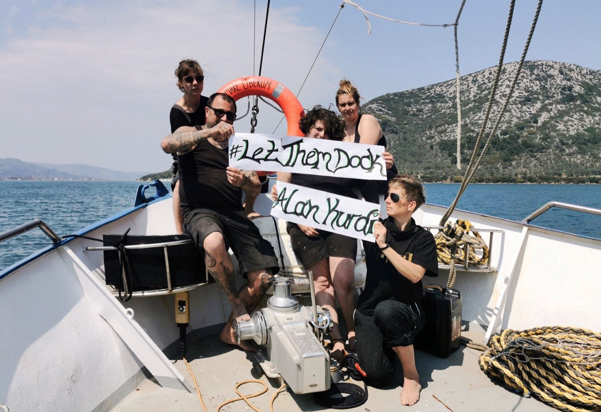
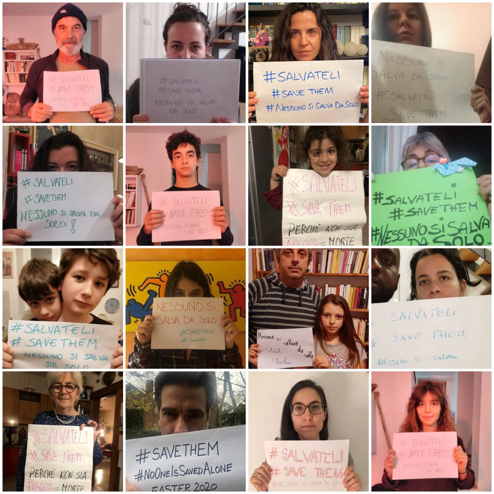
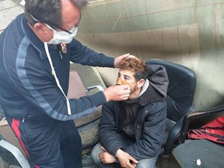
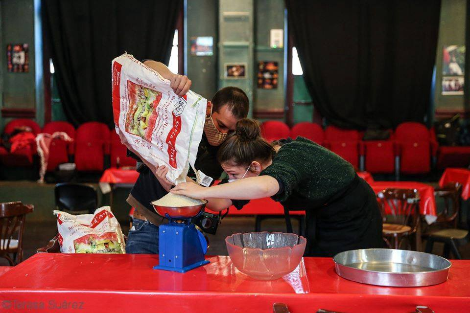

### AYS Weekend Digest 11–12/04/2020: How many have to die for Europe’s sins?
#### _4 boats in distress and one feared tragedy in the Central Med / Turkey: Reports of people on the move abandoned on the coast / Greece: Criminal complaint filed against coast guard / Cases of Covid\-19 confirmed among people on the move in Northern France and in detention centre in Schipol airport, The Netherlands\._

From Lesvos to the Central Med: We stand in solidarity with [\#AlanKurdi](https://twitter.com/hashtag/AlanKurdi?src=hashtag_click) \! \(Photo by [Mare Liberum e\.V\.](https://twitter.com/teammareliberum/status/1249292530979672070) \)
### Feature story — How many have to die for Europe’s sins?

The Covid\-19 pandemic is finally showing — now more clearly than ever — the essence of EU migratory policies\. As we have been reporting for the last years, such policies are built on [death as deterrence](https://alarmphone.org/en/2020/04/11/the-covid-19-excuse) , violence and brutal conditions as ways to convince people to “voluntary return” to their home countries\.

We’ve seen it all in the last weeks, all over Europe\. Camps and reception centres in lockdown\. No measures for the isolation of those who are tested positive\. More people being sent into detention\. European institutional racism at its worst\.

Everything else is just words\.

While Catholics celebrate Easter Sunday, at least 4 boats are reported to in distress in the Central Med\. Alarm Phone has tirelessly been in touch with them\.

SeaWatch [report](https://twitter.com/seawatch_intl/status/1249310505505886208) of a possible shipwreck\. They believe it could be one of the boats with which Alarm Phone had lost contact\.

From information gathered by journalist Sergio Scandura, it seems that Frontex was well aware of the positions of the boats in distress, not only because of the various calls to the authorities by Alarm Phone volunteers:

Alarm Phone has been able to keep in touch with one of the four boats throughout the 80 hours they have been at sea so far\. This boat seems to have left Libya with 47 people on Thursday night\. Since Saturday morning they are adrift in the Maltese SAR, without fuel and with conditions on the raft deteriorating by the minute\.

At the time of writing, it is reported that 5 people are unconscious\. Maltese and Italian authorities do not pick their phone or — when they do — refuse to comment\. Salvamento Marítimo Humanitario [report](https://twitter.com/smhumanitario/status/1249587100233740289) that Aita Mari, civil rescue ship, is going to the rescue of this raft\.

In the last week, direct shelling was reported at the port of Tripoli in Libya, and Libyan authorities are [refusing](https://twitter.com/sallyhayd/status/1248964872009850880) to let people intercepted by their own coast guard to disembark\. Both Italy and Malta declared that [their ports could no longer be considered safe](https://www.maltatoday.com.mt/news/national/101610/malta_cabinet_declares_island_is_no_longer_safe_port_for_asylum_seekers?fbclid=IwAR34QjETrYkpk1WC9rXKyBvLKwS9DgUte2IY9IqbaDLgbZbKLL7h7W4b5CQ#.XpSiPG5Fy0E) , due to the Covid\-19 pandemic\. As if stating that would end wars and persecution… Well, it doesn’t\. As it doesn’t stop the need for safety and better life conditions\.

Despite the lockdown measures, people have tried to raise their voices on such events in both Italy and Malta\.

In Malta, young people are [protesting against the](https://lovinmalta.com/news/watch-youths-protest-outside-castille-for-migrants-stranded-in-maltese-waters-you-cant-let-people-die/?fbclid=IwAR3R1U1YJ9UX1J4bPu-qFPWtWiHovbtNuu2nH34DHrTnuj4N5pLK_qSrFMg) government decision and are asking the government to provide assistance immediately\.

> _You cannot let people die on Easter Sunday or any day_ 

In Italy, Mediterranea — Saving Humans launched a [digital flash mob](https://twitter.com/RescueMed/status/1249417560682115073) :

\#Savethem \#Leavenoonebehind \( [Mediterranea — Saving Humans](https://twitter.com/RescueMed/status/1249417560682115073) \)

At the same time, The Alan Kurdi rescue boat is [still waiting](https://twitter.com/seaeyeorg/status/1249312210519719946) for a port of safety with 149 people and 101 people have arrived in Pozzallo, Sicily\. In the last few days, as we have been reporting, 152 people made their way to Lampedusa, Linosa and Pantelleria \(small Italian islands south of Sicily\) \.

The Western Mediterranean route does not provide a better picture\. As Oscar Camps [states](http://in%20the%20atlantic%20we%20continue%20at%20the%20rate%20of%203%20deaths%20on%20average%20a%20day%2C%2017%20shipwrecks%20in%20total%2C%2012%20of%20them%20on%20the%20route%20to%20the%20canary%20islands.%20tragedies%20that%20have%20continued%20since%20the%20arrival%20of%20the%20confinement%2C%20and%20that%20not%20even%20the%20closing%20of%20borders%20has%20prevented%20it%20from%20continuing/) , “In the Atlantic we continue at the rate of 3 deaths on average a day, 17 shipwrecks in total, 12 of them on the route to the Canary Islands\. Tragedies that have continued since the arrival of the confinement, and that not even the closing of borders has prevented it from continuing\.”

TURKEY

**Worrying reports from Turkey as refugees abandoned by coast and told to buy dinghies**

Josoor is actively reporting on the confusing situation in Western Turkey\. From Friday, when the quarantine finished in several Turkish camps, it seems that hundreds of people have been rounded up and moved to different locations\. Some have been taken to pre\-deportation camps, some have been abandoned in the middle of nowhere\. Others were brought to the coast near Izmir\. At the same town, 31 cities in Turkey have been put under a 48\-hour lockdown, with complete restriction of movement\.

Here, you can find a [timeline of the events of last few days](https://www.josoor.net/post/timeline-of-events-from-friday-april-10th-until-noon-of-sunday-april-12th?fbclid=IwAR32y_NIpEJC9niYAzESDIQuJb8FtV2G5jnluEYmJwIkZMdkzjsZbraeDYU) \.

From [Josoor English](https://www.facebook.com/josoor.english/posts/2303076996653646) :

> _250 people from a camp close to Izmir were just dropped off at the coast with the recommendation to buy dinghies and cross the sea to Europe\._ 

> _…\[people\] are currently still stranded on the coast without water or food, and the COVID\-19 travel ban makes it incredibly difficult if not impossible for local NGOs to reach them — or for them to go anywhere\._ 

> _10 buses, 200 people arrived in Çanakkale from Osmaniye camp, locals confirmed that refugees are walking around town\. People are not allowed to camp around the neighbourhoods of Çanakkale\. Volunteer lawyers took them to the local center of migration management\. People do not want to go on boats\._ 

> _Another group from Osmaniye was taken directly to a camp in Çanakkale, might be moved somewhere else soon\._ 

We will continue to update on this situation as it evolves in the next digests\.

LIBYA

Even before there was direct shelling at the port in Tripoli, Libya was already a humanitarian disaster zone…

GREECE
### Coast guard ordered to prevent any crossing from Turkey

Following news from Turkey \(see above\), Greek media went into a frenzy on a possible second wave of what they like to call “the Turkish invasion”\. According to these racist and colonial rhetorics, people on the move are nothing more than pawns used by Turkey to destroy Greek and European civilisation\. The Greek coastguard has received orders to stay alert, “prevent any vessel carrying migrants from entering Greek territorial waters” and avoid any crossing from Turkey “on grounds of national security and public health”, Giorgos Christides [reports](https://twitter.com/g_christides/status/1249258656962666498) \.

Since early February, Greek media have embraced war\-like rhetoric and fake news in their coverage of people on the move in the country\. Not only have they been described as ‘ [biological weapons](https://twitter.com/maledictus/status/1249278702317441024) ’ armed by Turkey, but the number of positive Covid\-19 tests are constantly given in separate figures for “citizens” and “non\-citizens”\. A racist attitude that is expanding to other groups:
### Criminal complaint filed against Greek coast guard for push\-backs from Samos coast

Greece: CHIOS
### No running water in Vial camp, Chios

[From Jenny Zinovia Kali, in the Solidarity in Chios group](https://www.facebook.com/groups/1508309029486384/permalink/2531501900500420) :

> _Μessages keep coming from the residents of Vial about the unacceptable conditions they are experiencing in the camp despite the pandemic\._ 

> _As of yesterday, VIAL does not have running water\. People can neither shower nor wash their hands\. The mothers have no water to clean the little ones\._ 

> _Even worse, the administration has also banned the distribution of basic necessities to voluntary groups outside Vial, but no distributions have taken place since the pandemic started from Vial’s first reception\. So the residents do not have any sanitary ware, diapers, sanitary napkins, etc\._ 

> _How do you ask 6000 people — roughly — to follow the protection measures when they don’t provide them with the basics ??????_ 

Greece: LESVOS
### Hunger strike in Moria’s PRO\.KE\.KA carries on

As reported by [Deportation Monitoring Aegean](https://dm-aegean.bordermonitoring.eu/2020/04/08/we-are-here-to-die-or-to-obtain-freedom-hunger-strike-in-moria-pre-removal-detention-centre-2/?fbclid=IwAR2ortBX1b1YXvQVh9VT9cAkf0fyJrHwlunetr1NMnOBhl7iHD783_4VRhM) , the prisoners detained in Moria pre\-removal detention centre \(PRO\.KE\.K\.A\) in Lesvos have been on hunger strike since 5th April 2020\. The PRO\.KE\.K\.A hunger strikers demand their immediate release to avoid the disastrous consequences of a virus outbreak in the prison\.

Read more about it [HERE](https://dm-aegean.bordermonitoring.eu/2020/04/08/we-are-here-to-die-or-to-obtain-freedom-hunger-strike-in-moria-pre-removal-detention-centre-2/?fbclid=IwAR2ortBX1b1YXvQVh9VT9cAkf0fyJrHwlunetr1NMnOBhl7iHD783_4VRhM) \.

As we previously reported, this week one boy was killed in Moria camp\. Violence and fights [erupted](https://twitter.com/f_grillmeier/status/1249100230844239874) in the following hours\. Nonetheless, the self\-organised [Moria White Helmets and the Moria Corona Awareness team](https://www.facebook.com/permalink.php?story_fbid=125553029087765&id=106807430962325&hc_location=ufi) are continuing to do what they can to improve the conditions in the camp\. People are reportedly [scared to line in queues for food and water](https://twitter.com/f_grillmeier/status/1249256854192037888) and on Friday they held a l [arge peaceful protest demanding safety, protection and the evacuation of everybody](https://twitter.com/teammareliberum/status/1248908176336044032) \.

While UNHCR is [reportedly](https://www.tornosnews.gr/en/greek-news/society/39711-un-seeks-hotels-and-ships-to-house-vulnerable-refugees-on-greek-islands.html?fbclid=IwAR0PvRuLcYu9TOQKxMT_tjBJxGJOTqbOlM4R7-WatGIr1y-bJL3KLowW1gA) looking for hotels and ships on the eastern Greek islands to house vulnerable people from RICs, it is also [reported](https://www.ekathimerini.com/251601/article/ekathimerini/news/west-lesvos-grudgingly-designates-facility-for-migrant-quarantine) that West Lesvos Municipality “grudgingly” accepted to restore and reopen the “old” Stage\-2 transit camp in Skala Sykamnias as a quarantine facility to house new arrivals\. This was used until the beginning of the year, but it was closed following a decision of the same municipality\. It was later attacked by arsonists in March\.

GREECE: Samos
### Med’EqualiTeam is looking for doctors and nurses on Samos

> _We need your help\!_ 
 

> _[Med’EqualiTeam](https://www.facebook.com/MedEqualiTeam/photos/a.1300865246715901/1866161400186280/?type=3&theater) is the only medical NGO on the Greek island of Samos offering primary healthcare to the 7000\+ refugee population\. Focusing on triage, treatment and wound care, the team sees currently up to 100 patients per day\._ 
 

> _The team are urgently looking for doctors and nurses who can stay 1 month or more\._ 
 

> _\(All new team members must self\-isolate for 2 weeks upon arrival to ensure safety of patients\. \)_ 
 

> _Please apply on [https://www\.medequali\.team/de/volunteer/application/](https://www.medequali.team/de/volunteer/application/?fbclid=IwAR2o7f1FhigoB0bQSvG1INiTDzgOf46UPBncF3EZV7u4Zbn0EHza_nFw-pU)_ 

GREECE: Athens
### More reports of racial profiling and police violence during so\-called Covid\-19 checks

One young man was stopped, beaten, humiliated and had his papers destroyed in Athens\. Read the full report \(in Greek and English\) [HERE](https://athens.indymedia.org//post/1604287/)

BOSNIA

**Violence Continues in camps and at border**

[Local groups report](https://web.facebook.com/permalink.php?story_fbid=219571839458787&id=108916427190996) that workers from the private security agency that is involved in the camp in Blažuju have physically attacked people on the move\. When people stood up against this violence, the police were brought in\.

These camps are paid for by the EU\.

When people try to leave these conditions and cross over into Croatia, further violence meets them\.

\(Photo Credit: [Linea d’Ombra ODV](https://web.facebook.com/lineadombraODV/?__tn__=kC-R&eid=ARBGky458zJyw_Ws0UZ9du8dn4oGhuEt5aTcJrBK9lrK3gbmJX6vg2Mw-cX2wTTn1y7UONI9s5xb09bh&hc_ref=ARQln0zf_meBiGTijK7RlRF_MAtEmOewOqKI61RF_rOY3z5Ou1qNLyi8innlkwmjQB8&fref=nf&__xts__%5B0%5D=68.ARA-Vvzj5tlxS5oacHRC7URTzeawZ5GzimQeSsBO5kzPomHGfcrd0c79xcBa8evCBcjSsbeC_ckfidQj9t1gkUzz0g6fuQ-2cHK1ROJygvIU1Ty9soSa2JK1oEybXtXOhiaR3uBo9D57CrUCexnHYvoVHUFjFFg-UZkdc89kdTL6945AtqfnmO2rwVNrp5qsVeQJ1jVuhxjhTofzPx15p8FXeucHCvJRnZwiRnZFny2hrrJl4g8JaaFxnaX7zbFfZhPQqtOvyIjmnomKAsKq3ZBjFFREz1JVFctWfz8e1hCHscX7X4aa3zpUMvLDZyJYSb_TIHc3ZfHMoVT-wqFObEo) \)

COVID\-19 is not the only disease Europe suffers from\.

SERBIA

People are once again being placed in [Miratovac](https://twitter.com/APC_CZA/status/1248622106700468229?s=19&fbclid=IwAR0X9X4jWirjhtmO-aW6ThkkGTbmvbqNxwajPpfJuTNiR3fUrbrwSgHn5dg) and Krnjaca camps\.

[A local solidarity group reports](https://transbalkanskasolidarnost.home.blog/umjesto-sapuna-policijske-batine/?fbclid=IwAR3qLr22heXDDylUvwYoWr-I3m4XyPBmz8RliJ6g6fyXUdgxiAUiayJmz9s) that the situation in Serbia is increasingly tense\. Corona virus has allowed the Government to close the camps, turning them into jails\. The army is stationed outside while inside there are the Comisariat, a department of the police\. There are [reports](https://web.facebook.com/groups/1157057194369287/permalink/3655573237850991/?hc_location=ufi) that a child was hit by one of the workers this week, which was followed by the presence of armed police using tear gas as we [reported last week](https://medium.com/are-you-syrious/ays-daily-digest-10-04-2020-police-violence-in-serbian-refugee-camp-2f968c4f7657?source=rss-------1) \. Local activists are calling on people to spread the news of what is happening\.

NETHERLANDS

[Local groups report](https://web.facebook.com/MeldpuntVreemdelingendetentieLOS/posts/2600979666780490) that two detainees are infected with Corona in Schiphol detention centre as confirmed by a spokesperson from the Ministry of Justice and Security\.

> _The two detainees have been quarantined in a separate department in the detention centre\. No new detainees are currently being placed in the departments where they were previously\. Lawyers of detainees have been trying to insist on release their clients for weeks due to risk of contamination, but unfortunately judges usually don’t go into that\._ 

BELGIUM

[Local media report](https://www.hln.be/nieuws/binnenland/297-uitgeprocedeerde-asielzoekers-vrijgelaten-uit-gesloten-centra-om-aan-coronaregels-te-voldoen~a492328e/?utm_medium=twitter&utm_content=Nieuws&utm_source=dlvr.it&referer=https%3A%2F%2Ft.co%2F3cStq6soTu&fbclid=IwAR2ExktV_Pr6e8SFjltw1wmFF_mK7iUOOCQJ4esHwZ0GYqk9qx-mdzw9gA8&referer=https%3A%2F%2Fl.facebook.com%2F) that the Belgium Immigration Office has had to release 297 asylum seekers, who have exhausted all legal channels, from the closed reception centers where they were they were being held, in order to comply with hygiene measures regarding the Corona virus\.

FRANCE

**COVID\-19 cases confirmed**

[RCK report](https://web.facebook.com/refugeeCkitchen/posts/3464366326914046) that there are now confirmed cases of Covid\-19 amongst people on the move in Northern France while the government still only offers accommodation to some\.

> _The conditions have become even more desperate as people are being tear gassed and evicted daily\. Giving them no chance to abide by any hygiene and distancing\. Little or no support networks remain in place\. This is the time government should prioritise these vulnerable people and reduce the risk of loss of life\._ 

They call for the use of empty hostels and hotels to house the most vulnerable during this time\.

**Solidarity Support needed in Paris**

\(Photo Credit: [Solidarité migrants Wilson](https://web.facebook.com/Solidarit%C3%A9-migrants-Wilson-598228360377940/?__tn__=kC-R&eid=ARCUNOyAh43VwIYQcoxpL0O6bTklWmxS0apDBusnGj8rAfLxu6lhSksE8TJMLP7_poCcgoF_EHa4Bxwd&hc_ref=ARQhFrHsxTGLDouwvZxTa0DsBkjRv5Ktya5D2qIVixzWHEGOO7DnzIDFt-uqjbo35og&fref=nf&__xts__%5B0%5D=68.ARBdJ632WouE58jiojscohT9WVpKrRIfy0jK4U91HNYhnrhFaGi5dlx3n-ziyUCPscckjuV2gUAz84Cpnc-K3NmJbLYkXMsbDt42lwDANcMg3ey4eRizmJ3FADynU6fLq_ycRdVwN_xFZpqtHWTBpAjvciJt0ge81dHjzGUYMf-VMQD0Ps8vrR0ltCzJpOxqScsGtorflT0H8imv4kzA8hSZSCLxjHbl_b5ykbWW3mCGHxHZHrSmdPzboGxUfXF85XyVkjIqVjI64yez_-jtn41GCl0X6enVN9SbF1uWlfuttguvLW4LpgJKniSrp-_9W5kkbixoSmUXzsRXtmC32v_mAg) \)

[Solidarité migrants Wilson](https://web.facebook.com/Solidarit%C3%A9-migrants-Wilson-598228360377940/?__tn__=kC-R&eid=ARCUNOyAh43VwIYQcoxpL0O6bTklWmxS0apDBusnGj8rAfLxu6lhSksE8TJMLP7_poCcgoF_EHa4Bxwd&hc_ref=ARQhFrHsxTGLDouwvZxTa0DsBkjRv5Ktya5D2qIVixzWHEGOO7DnzIDFt-uqjbo35og&fref=nf&__xts__%5B0%5D=68.ARBdJ632WouE58jiojscohT9WVpKrRIfy0jK4U91HNYhnrhFaGi5dlx3n-ziyUCPscckjuV2gUAz84Cpnc-K3NmJbLYkXMsbDt42lwDANcMg3ey4eRizmJ3FADynU6fLq_ycRdVwN_xFZpqtHWTBpAjvciJt0ge81dHjzGUYMf-VMQD0Ps8vrR0ltCzJpOxqScsGtorflT0H8imv4kzA8hSZSCLxjHbl_b5ykbWW3mCGHxHZHrSmdPzboGxUfXF85XyVkjIqVjI64yez_-jtn41GCl0X6enVN9SbF1uWlfuttguvLW4LpgJKniSrp-_9W5kkbixoSmUXzsRXtmC32v_mAg) need support cooking and distributing in Paris\. More info [HERE](http://xn--solidarit%20migrants%20wilson-juc/) \.

[**Solidarity in Rennes**](https://web.facebook.com/DIDA.Rennes/posts/1115818138798740?hc_location=ufi)

> _NEED HELP?_ 
 

> _Do you need help during the health crisis or would you like to help vulnerable people during this time?_ 
 

> _Check out the Rennes Covid Solidarity website: [https://rennescovidsolidarite\.info/](https://rennescovidsolidarite.info/?fbclid=IwAR0d8YRAyCGPUIBb3GiiQhEJSOmRFYKkMw1PQ8lOmLa0uNHCcYM3jgnqQ24)_ 
 

> _— Emergency accommodation_ 
 

> _— Meet of the day_ 
 

> _— Maraudes_ 
 

> _— Administrative, legal and social approaches_ 
 

> _— Food aid_ 
 

> _— Health and health_ 

> _GET THE NEWS\!_ 

GENERAL

[Europe Must Act](http://www.europemustact.org/citiesmustact?fbclid=IwAR3WDgoxDck-8s8rUTkRGwHXk09-Fn0WcYY7W1k6qir5oDv7XsMtmZ03HEA) have now launched the [Cities Must Act Campaign](https://web.facebook.com/europemustact/posts/127832588829444) which calls on citizens, councils and mayors of European towns and cities to pledge their support for the immediate relocation of asylum seekers on the Greek islands\.

> _Cities all over Europe have demonstrated willingness to resettle the 40,000 refugees that are currently facing Covid\-19 in overcrowded and unsanitary camps on the Aegean islands\. \#CitiesMustAct aims to bring these voices of solidarity together, to give a loud and clear signal to EU leaders that Europeans want them to act on humanitarian values and provide shelter to those who seek refuge from war and persecution\._ 

> _GET INVOLVED, GET YOUR CITY INVOLVED\!_ 

> _Join or set up a city chapter to demand that your city mayor pledges to resettle an exact number of refugees\._ 

> _MAIL to onboardme@europemustact\.org and get on board with our campaign\!_ 

**Find daily updates and special reports on our [Medium page](https://medium.com/are-you-syrious) \.**

**If you wish to contribute, either by writing a report or a story, or by joining the info gathering team, please let us know\.**

**We strive to echo correct news from the ground through collaboration and fairness\. Every effort has been made to credit organisations and individuals with regard to the supply of information, video, and photo material \(in cases where the source wanted to be accredited\) \. Please notify us regarding corrections\.**

**If there’s anything you want to share or comment, contact us through Facebook, Twitter or write to: areyousyrious@gmail\.com**

Following
- [Refugees](https://medium.com/tag/refugees)
- [Digest](https://medium.com/tag/digest)
- [Mediterranean](https://medium.com/tag/mediterranean)
- [Sar](https://medium.com/tag/sar)
- [Greece](https://medium.com/tag/greece)

_Converted [Medium Post](https://medium.com/are-you-syrious/ays-weekend-digest-11-12-04-2020-how-many-have-to-die-for-europes-sins-bfbc380424d9) by [ZMediumToMarkdown](https://github.com/ZhgChgLi/ZMediumToMarkdown)._
