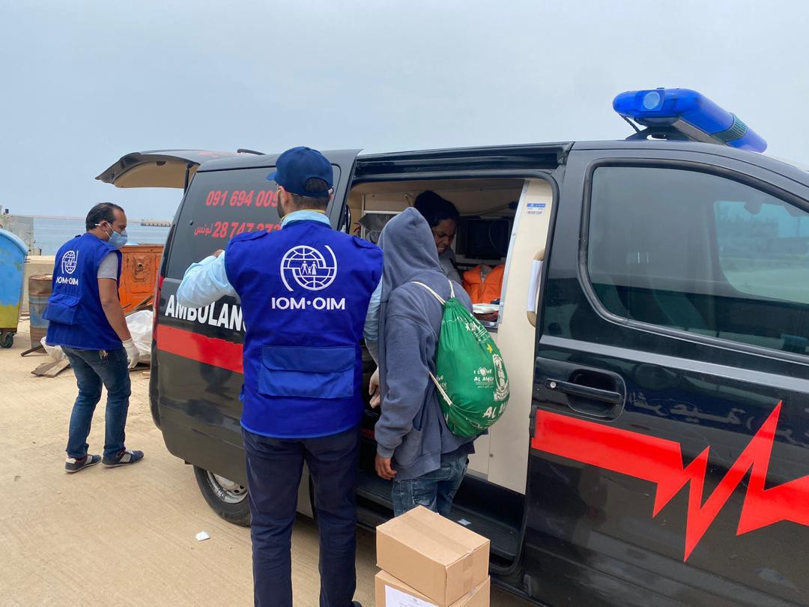
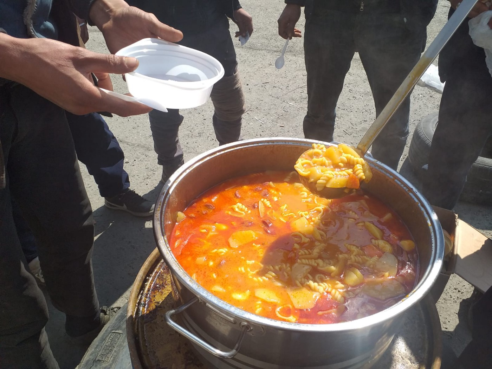

### AYS Daily Digest 15/04/20 Controversy when Italy orders people rescued at sea to quarantine on ships

_51 people back in Libya after entering Maltese waters // Luxembourg receives 12 transferred from Greece // Germany to transfer 50 kids over weekend // and more…_

](assets/54faecdca321/1*-9aQyT8963thXqNCJ_qZEA.jpeg)

Photo by [Frontex](https://euobserver.com/justice/121794)
### FEATURE: The Italian government has ordered that people rescued at sea must spend an appropriate amount of time quarantined on ships before being disembarked\.

Since the government has deemed the country not to be a “place of safety for rescued migrants,” it has closed its ports to people fleeing, primarily from Libya\. [The government has told its civil protection service to “create facilities or areas on land or ships able to admit” people](https://www.infomigrants.net/en/post/24102/migrants-quarantined-on-ships-controversy-in-italy?preview=1586943650093&fbclid=IwAR2AGnpEc_RosEDloLXTno4g2nW9xZgZuTOyxnaVwAAvDwV26MLWYpGxCXA) who reached Italy rescued at sea by an NGO or otherwise\. People who reach Italy not by sea will be able to quarantine on land\. On Sunday, civil protection head Angelo Borrelli said:

> “There’s the need to guarantee health oversight — that is, quarantine or isolation — also for migrants who disembark\. For this the department will create facilities or areas on land or ships where migrants can be admitted\.” 

This measure has not pleased many NGOs, who say this is unequal treatment\. Filippo Miraglia, national director for the organisation ARCI, said:

> “The Italian government, through a decree by the head of civil protection, Angelo Borrelli, separates the fate of those who disembark independently on Italian shores \(the large majority\) from those who are rescued at sea \(very few\): the former will be welcomed in special quarantine shelters; the latter, on the other hand, will be confined to ships at sea, awaiting, perhaps, relocation to a country more generous than ours\. 

> Too bad that an Italian ship, even in international waters, is already national territory, and therefore, the responsibility — both for the eventual presentation of an asylum request and for the subsequent accommodation — remains with our country\. Moreover, carrying out quarantine operations at sea with Italian personnel is clearly less safe than doing it on land\. The government’s intervention is therefore purely symbolic: it serves to dissuade NGOs from rescuing those human lives that seem to matter less, or not at all, in the eyes of the government\.” 

#### LIBYA

 [@Armed\_Forces\_MT](http://twitter.com/Armed_Forces_MT) , Italian & European governments all refusing to rescue, deporting and paying the Libyan torturers\.” Update and photo by [Giulia Tranchina](https://www.facebook.com/photo.php?fbid=10157564815598621&set=a.10150438475713621&type=3&theater)](assets/54faecdca321/1*-dARC3Mkcb-RQaoY9XLR9w.jpeg)

“47 survivors including women and children taken to \#TariqAlSikka detention centre after this horrific ordeal and 12 persons killed by \#CriminalEurope [@MaltaGov](http://twitter.com/MaltaGov) [@Armed\_Forces\_MT](http://twitter.com/Armed_Forces_MT) , Italian & European governments all refusing to rescue, deporting and paying the Libyan torturers\.” Update and photo by [Giulia Tranchina](https://www.facebook.com/photo.php?fbid=10157564815598621&set=a.10150438475713621&type=3&theater)

> “Refugees evacuated from Libya to the Gashora transit mechanism in Rwanda are facing a new, deep pain after a police commander allegedly assaulted a 16\-year\-old Eritrean boy, so far with no visible repercussions\.” 

The community being transferred to Rwanda is already under immense trauma from their time spend in Libya, being tortured and living through a civil war\. Read more on the allegations, that need to be taken seriously, [here](https://www.facebook.com/photo.php?fbid=10100206416466768&set=a.519559581498&type=3&theater) \.
#### SEA

 : **51 people finally disembarked in Tripoli** … [We have reason](https://twitter.com/IOM_Libya/status/1250431126528602116) to believe that this is the boat reported missing a few days ago in the Maltese search and rescue zone\. All migrants were transferred to detention in Tripoli\. ” Photos and update by IOM Libya](assets/54faecdca321/1*nilZPXsWC6z8A9OPpSN1zQ.jpeg)

“ [Update](https://twitter.com/IOM_Libya/status/1250431119805169669) : **51 people finally disembarked in Tripoli** … [We have reason](https://twitter.com/IOM_Libya/status/1250431126528602116) to believe that this is the boat reported missing a few days ago in the Maltese search and rescue zone\. All migrants were transferred to detention in Tripoli\. ” Photos and update by IOM Libya

[The 51 people](https://timesofmalta.com/articles/view/five-migrants-die-after-being-left-stranded-in-maltese-waters.785795?fbclid=IwAR1excKsTVR7lhBFU_13dqA81ssWnwwecHDQhxkHl9AUvc_aMZoRW69JTns) from above were found with five people who regrettably died stranded in a boat in Maltese waters\. The survivors say that seven people are missing, presumably dead\.
#### MALTA

In a _Times of Malta_ Editorial, they make the point that with the civil war in Libya and the COVID\-19 pandemic, the waters of the Mediterranean could become even more deadly than they were in 2015/2016\. They argue that Malta needs assistance from the EU now more than ever, as, with their peak of COVID\-19, **Malta and Italy can no longer be considered “places of safety for rescued migrants\.”** While Malta has made some regrettable decisions in ignoring human rights during this pandemic, the editorial argues that Malta and Italy:

> “are trying to force other EU leaders from understanding this crisis cannot be handled by two countries alone\. It is a source of great concern to Malta, which is Europe’s frontline state, that Europe appears to be lacking the plans, mechanisms or, indeed, political will to act\. Clearly, EU leaders need to come to the aid of Libya before the sea around us turns into a watery grave\. 

> Pope Francis said on Easter Sunday that the future of Europe is hanging in the balance\. He warned in his Easter address that coronavirus poses a risk so great that it could mark the end of the EU if mishandled\. Europe was facing ‘an epochal challenge, on which will depend not only its future but that of the whole world’\. He urged political leaders to show solidarity and concern for the common good, with a particular focus on the needs of the poor, the homeless and refugees\. 

> In 2015, EU leaders only came together when it was too late, when hundreds of asylum seekers had drowned\. We simply can’t afford history to repeat itself\.” 

It’s worth noting that [the EU Commission](https://euobserver.com/migration/148058) says they are not in a position to comment on Italy and Malta closing their ports, as it is a legal matter, at this time…
#### GREECE
### Luxembourg welcomed 12 children from Greece camps on Wednesday\.

Nine [of the children](https://today.rtl.lu/news/luxembourg/a/1501684.html?fbclid=IwAR2ZdNysgohoUgLpwotHNFi2WVLlVkO9_W84T8UMiTwyVc7y9Wsx6Ba6wLI) were from Lesvos, two from Chios, and one from Samos who was transferred to the Grand Duchy\. Fifty other children are expected to fly from Athens to Germany on Saturday the 18th, in an effort to move the 1,600 people EU countries have promised to relocate from Greece’s camps\. [France,](https://www.facebook.com/AegeanBoatReport/posts/812369199286186?hc_location=ufi) Portugal, Finland, Lithuania, Croatia and Ireland have also said that they will participate\.

■■■■■■■■■■■■■■ 
> **[Mare Liberum e.V.](https://twitter.com/teammareliberum) @ Twitter Says:** 

> > Yesterday 50 minors were evacuated from #Moria. We are very happy for these children that they can escape from hell Moria. However, it is a farce that the German government &amp; #NotMyEU are celebrating themselves as humanitarian helpers!

#WirHabenPlatz
#LeaveNoOneBehind
📸 ML https://t.co/41QQ8TD1g0 

> **Tweeted at [2020-04-15 12:42:57](https://twitter.com/teammareliberum/status/1250404244068478976).** 

■■■■■■■■■■■■■■ 

As [Sea\-Watch](https://twitter.com/seawatch_intl/status/1250457137488236544) reminds us, the number of children who have been evacuated so far still only represents about 0\.1% of the people trapped on the Greek islands\. \#LeaveNoOneBehind
### Almost 1000 vulnerable people will be transferred to hotels in Greece\.

This is in an effort to ease the camps, [Ylva Johansson](https://www.infomigrants.net/en/post/24112/nearly-1-000-vulnerable-migrants-to-be-transferred-to-hotels-in-greece?fbclid=IwAR3-1UdmVZSA2qz3xMGVGgn0oboGZAN5LvixWxeBa4O2EOvLUWCh3iC5YXE) , the EU commissioner for home affairs, announced on Tuesday\. AYS will continue to follow closely\.

Authorities in Greece are very worried that potentially 2,000 people are entering coastal Turkish towns and are going to try and cross over to the islands\. During the quarantine, the Turkish government closed the camps along the northern Greek border and transferred a lot of people to coastal cities like Izmir\. Many were transferred beyond their control\. Learn more [here](https://www.infomigrants.net/en/post/24110/greece-fears-new-influx-of-refugees-from-turkey?fbclid=IwAR2CkXNZLF2hdI9Id4oWreT-2KMpwPRcNL9gwGsi8LhWP4XnWnFhIHqS0as) \.

[Katie Emm](https://www.facebook.com/groups/refugeereliefactionforum/permalink/2972794422778982/?hc_location=ufi) provides a comprehensive Lesvos update:

> “ **GOOD NEWS\!** 

> 1\) People are generally respecting the movement restrictions…and some transfers have been made\. 

> 2\) According to data released yesterday, there have been no new confirmed cases for two weeks on Lesvos\. This is a major milestone, as it suggests that there are no new infections here and Lesvos has contained COVID\-19\. Of course, there are still possibilities of infection emerging, and we still have to remain vigilant, but it sure feels nice to have hit this point\. According to public data, there have been eight cases, and one death\. In Greece overall, there are approximately 100 deaths, and about 2200 cases \(as of today\) \. There have been no confirmed cases in Moria, Kara Tepe, or Pikpa\. 

> 3\) No new fascist attacks — there have so far been no recent reports of attacks on NGO workers or refugees or locals\. 

> **HARD NEWS\!** 

> 1\) There are reports of Turkey planning to send refugees en masse to the Aegean Islands\. This falls somewhere on the spectrum between propaganda and something legitimate\. There’s no way to know what will happen, but it does raise some major questions, notably: Where will people go if they reach the shores, especially with a mandatory 14\-day quarantine? Will there be a repeat of what happened the last time Turkey sent people en masse? Will rights be respected? Will lives be put in \(further\) danger? 

> 2\) Greece voted to extend the lock down\. While originally things were going to open back up on 6 April \(maybe\), the government extended the restriction of movement until at least 27 April\. \(Perspective: that is less than two weeks away, and we’ve already successfully navigated this for three weeks\) \. 

> 3\) Most NGOs remain working with a bare\-bones team, as they are unable to get new volunteers to the island\. \(This is also likely a major reason why Lesvos has been able to keep numbers of infections down though, so while difficult, there is definitely an upside to this\! \)” 

### \#FreeTheKids

[Human Rights Watch](https://www.hrw.org/FreeTheKids?fbclid=IwAR1YB3ou4JGIBZSp70G9Xa4H8dKm8JLXL6G6lSoHQ0SYGMqyTLM1qtFQ7dY) is starting a campaign to free refugee children who are living in detention during COVID\-19:

> “Kids should be in safe, child\-friendly housing with the freedom to learn, play and thrive\. Yet, hundreds of migrant children in Greece without a parent or relative are sitting behind bars in police jails and immigration detention\. Their conditions create a heightened risk for contracting COVID\-19\. The Greek government has the ability to move these kids into child\-friendly housing where they can receive medical treatment, psychological counseling, education and legal aid\. Childhood happens only once in a lifetime — we need your help to make sure they get theirs\.” 

[Mobile Info Team](https://www.mobileinfoteam.org/newsletter) provided this update on how they are helping to spread vital information about COVID\-19:

> “Since the middle of March, Mobile Info Team has been providing important information to asylum seekers and refugees in Greece about various issues surrounding the coronavirus: We tried to reach as many people as possible to communicate appropriate precautions against transmission, like washing hands or social distancing\. We also answered commonly asked questions about the virus, like how somebody can get infected and what to do if somebody shows symptoms\. Additionally, we notified our audience of the various interruptions to public life in Greece, especially the lock\-down the government introduced on 23 March and its consequences for refugees, or the closure of the Greek Asylum Service\.” 

#### BOSNIA AND HERZEGOVINA

](assets/54faecdca321/1*1YFOIO1oSnsQ9w2Ofd0faA.jpeg)

Photos by [No Name Kitchen](https://www.facebook.com/NoNameKitchenBelgrade/posts/960278791037072)

In an update from No Name Kitchen on their current food services in Velika Kladuša:

> “No Name Kitchen continues to be present daily in Velika Kladuša\. Our main objectives are to give people food and clean clothes…\.In order to meet the needs of many people with the few available hands, we have been working on a new plan that is already paying off\. 

> We started last week, associating NNK to a bakery\. Money is given to this bakery and people who live in the abandoned houses are given vouchers\. Each of these squats has a representative and is also connected, thanks to social networks, to an international volunteer who has previously been in Velika Kladuša\. Twelve volunteers are currently involved in this task, being the ones who send the vouchers to the squats\. On those vouchers, there is a code that is also registered at the bakery so that the workers know how many breads and bureks they have to give\. This also allows us to have a better view of the situation and the needs to be covered\. 

> One day a week, the representative of each squat must go to the bakery to collect food for everyone\. This project covers, from Monday to Saturday, 70 people with a large piece of bread and a burek \(typical Bosnian food with meat or cheese\) \. This project is more expensive than what we did before when we used to only give food for people to cook \(something that also continues\), but evaluating the options with the local volunteers, we found that this solution is the most convenient\. We are working on getting more financial support so that each person can receive this meal twice a week\.” 

#### BALKANS

Transbalkan Solidarity Group provide this update on the Balkan route and need for solidarity:

> “Tens of thousands of refugees and other migrants in the Balkans are only partially accommodated in official collective centers, while a large number of people fall outside the system, surviving through the help of the local population\. With the spread of the COVID\-19 virus, the already difficult situation is becoming detrimental and demands urgent action of local and international actors — and solidarity from all of us\. 

> The state of emergency now in force in many countries of the region reinforces social inequalities… 

> We, therefore, call for an end to all official and unofficial discriminatory and dehumanizing practices, for the legalization of everyone’s existence, for the closure of all forms of detention and collective centers that restrict freedom of movement and fail to secure humane and hygienic conditions… 

> More, we demand of the member governments of the European Union, the states of the region, and all relevant institutions and international organizations…that all people be equally afforded critical information on pandemic and unrestricted access to the health care system, that refugees and migrants are treated without discrimination, and that concrete measures for their protection are made part of all measures for the protection of the population as a whole\.” 

#### UK

■■■■■■■■■■■■■■ 
> **[Choose Love](https://twitter.com/chooselove) @ Twitter Says:** 

> > The UK has made it harder for refugees to claims asylum, even during this pandemic when safety is needed more than ever.

We're supporting @Refugee_RE's call for real solutions to human suffering at the UK border in France.

[refugee-rights.eu/wp-content/upl…](https://refugee-rights.eu/wp-content/uploads/2020/04/RRE_PP_NewWaysAccessUKAsylum-2020.pdf)

#RefugeeRightsAreHumanRights https://t.co/1vDJzvs1ml 

> **Tweeted at [2020-04-15 09:36:00](https://twitter.com/chooselove/status/1250357193620303872).** 

■■■■■■■■■■■■■■ 

The “Policy Proposal: New Ways to Access UK Asylum” report details that since the situation for refugees in Northern France has only gotten worse in the time of COVID\-19, Refugee Rights Europe is proposing:
1. “The development of a mechanism for individuals to make an asylum claim from UK offshore sites of juxtaposed border control, where the UK places its border control facilities and wields legal powers, in line with rights enshrined in the 1951 Geneva Convention and the Universal Declaration of Human Rights \(Art\. 14\) \.”
2. “The introduction of measures to identify and accelerate transfers of particularly at\-risk groups, in collaboration with French counterparts and partners\. These at\-risk groups would include victims of trafficking, unaccompanied minors, LGBTQ\+ persons and people with disabilities, victims of physical, mental or sexual abuse, among others, for whom delays in accessing protection systems pose even greater dangers\.”

Read the full report [here](https://refugee-rights.eu/wp-content/uploads/2020/04/RRE_PP_NewWaysAccessUKAsylum-2020.pdf) \.

**Find daily updates and special reports on our [Medium page](https://medium.com/are-you-syrious) \.**

**If you wish to contribute, either by writing a report or a story, or by joining the info gathering team, please let us know\.**

**We strive to echo correct news from the ground through collaboration and fairness\. Every effort has been made to credit organisations and individuals with regard to the supply of information, video, and photo material \(in cases where the source wanted to be accredited\) \. Please notify us regarding corrections\.**

**If there’s anything you want to share or comment, contact us through Facebook, Twitter or write to: areyousyrious@gmail\.com**

_Converted [Medium Post](https://medium.com/are-you-syrious/ays-daily-digest-15-04-20-controversy-when-italy-orders-people-rescued-at-sea-to-quarantine-on-54faecdca321) by [ZMediumToMarkdown](https://github.com/ZhgChgLi/ZMediumToMarkdown)._
