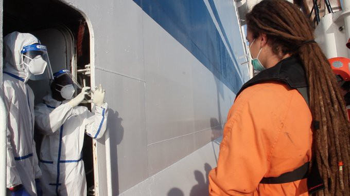
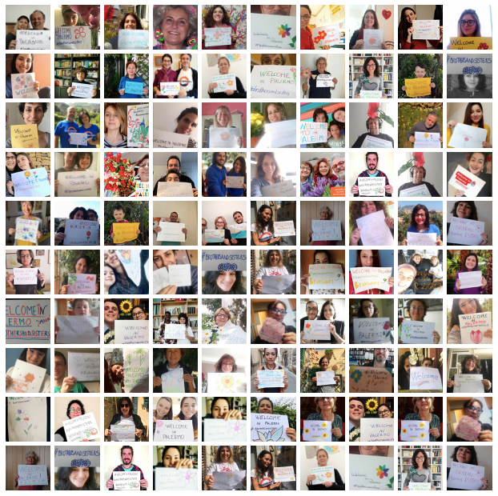
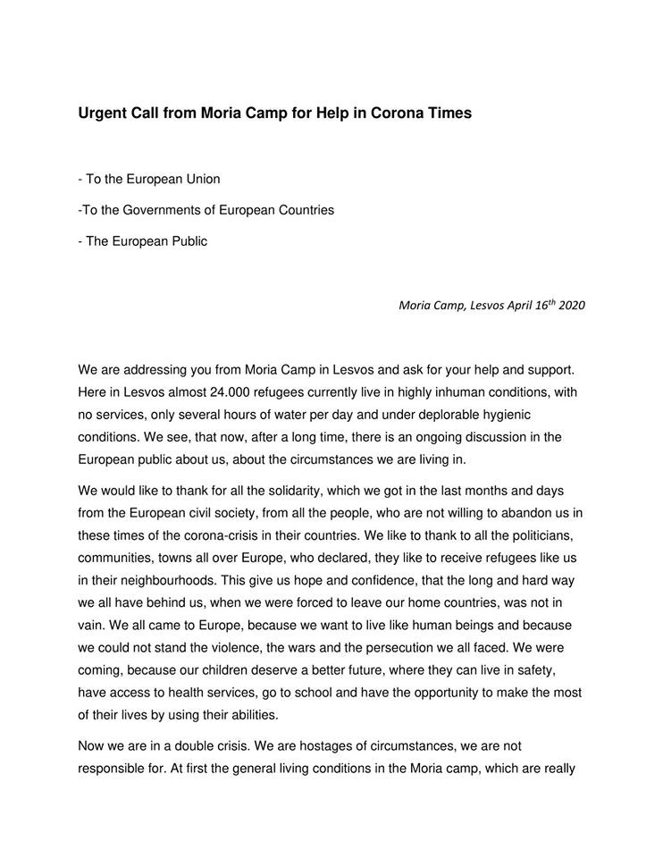
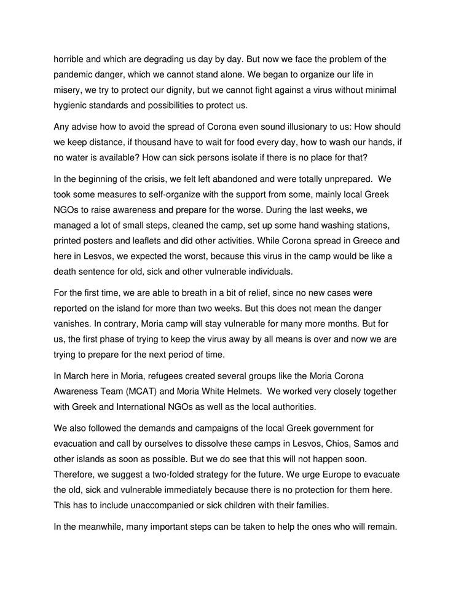
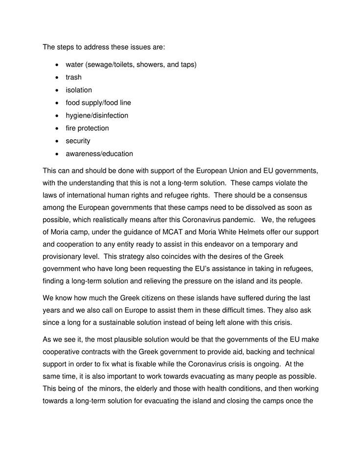
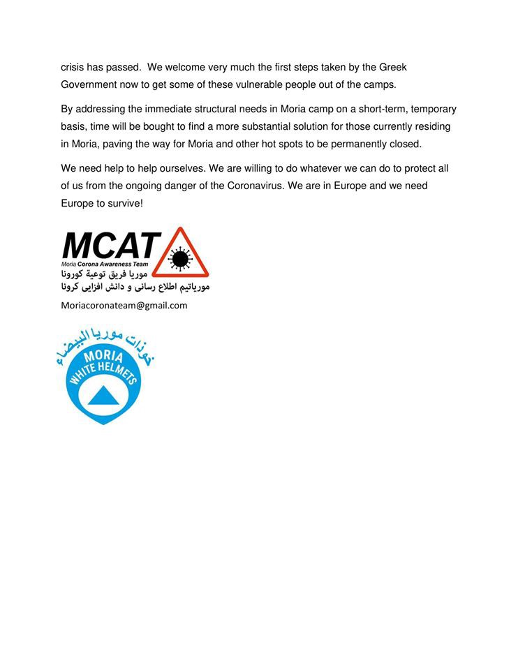

### AYS Daily Digest 17/04/20: At least some of the people who have been rescued while Europe was celebrating Easter are finally allowed to disembark
#### People rescued by ALAN KURDI transferred to a bigger ship for quarantine // No safe harbour assigned for AITA MARI yet // IOM Statement on the case of the unanswered calls from boats in distress in Maltese SAR zone // End of cooperation between MSF and SOS Mediteranee // Greek emergency plans for Covid\-19 pandemic in camps // threats against journalist by Greek politician // letter to EU from Moria Corona Awareness Team and Moria White Helmets // More News from Slovenia, Croatia, BH, Austria, UK, Spain

Red Cross says thank you to ALAN KURDI Crew after disembarkation\. Copyright: Gordon Isler, Sea Eye
### FEATURE: GOOD NEWS, finally\!

After 12 days at sea, the 146 people rescued by the ALAN KURDI are finally allowed to disembark — by embarking on another ship\.

On Friday morning the transfer to the ferry Raffaela Rubbatino took place in the gulf of Palermo\. The rescued people will have to stay on the ferry for a 14 day quarantine\. The ship is bigger and better equipped for the quarantine of almost 150 people than the rescue ship ALAN KURDI\. Thanks goes out to the mayor of Palermo, Leoluca Orlando, who constantly tried to find a solution for the people on board the ALAN KURDI, while the government in Rome declared Italy’s ports as unsafe\. But the transfer to the bigger boat is only a temporary solution; no long\-lasting solution has been found yet\.

From the Sea Eye’s press release:

> “So far, it is still unclear how it will go on for the people afterwards\. Italy has temporarily closed its ports for the disembarkation of people rescued from distress at sea, due to the general health emergency\. To date, the authorities have not published any plans about a port of disembarkation and the distribution of refugees\.”

Also, the crew will have to go into a 14 day quarantine, but the organization still hopes to be able to continue its operations in May\. The organisation Sea Eye, which operates the ALAN KURDI, has experienced a decrease in donations in the last weeks\. Please consider supporting them\.

■■■■■■■■■■■■■■ 
> **[sea-eye](https://twitter.com/seaeyeorg) @ Twitter Says:** 

> > ❗️BREAKING
It's over.
After 12 days the 146 rescued are safe on board the ferry RAFFAELE RUBBATINO.

Italy supported us despite its own difficulties in the country and pushed for a solution.
Our press release:
[sea-eye.org/en/odyssey-of-…](https://sea-eye.org/en/odyssey-of-the-alan-kurdi-rescue-ship-ends/) https://t.co/Vs14xhNCiD 

> **Tweeted at [2020-04-17 18:35:00](https://twitter.com/seaeyeorg/status/1251217613784571905).** 

■■■■■■■■■■■■■■ 

Press release:

In non\-pandemic times the group Mediterranea Saving Humans Palermo would have been in the port to give a warm welcome to the arrivals\. These days they decided to at least send a virtual welcome card:

Copyright: Mediterranea Saving Humans Palermo

The people who were rescued by the ALAN KURDI had been on one of several boats in distress, drifting for days in the Mediterranean Sea, at times within the Maltese SAR zone and under surveillance by Frontex planes\. One other boat has been rescued by the Spanish rescue ship Aita Mari\. One has been returned to Libya\. On this boat five people died and another seven have gone missing and have most probably drowned\. The survivors are now back in Libya, where they have probably been, and they are likely to be subject to torture and inhuman treatment\. Apparently they are locked up in the Tarik al Sikka detention Centre in Tripoli, a city that is regularly hit by shelling and whose port was attacked not long ago\.

IOM is calling on Libya and the EU to put an end to this situation in which the calls of people in distress are not responded to and the people are eventually refouled into unsafe circumstances\.

■■■■■■■■■■■■■■ 
> **[IOM - UN Migration 🇺🇳](https://twitter.com/UNmigration) @ Twitter Says:** 

> > In the past week, four boats in distress have been left stranded at sea for days.

We remind states that saving lives at sea is the number one priority and that distress calls must be responded to in line with international law.

Our @[msehlisafa](https://twitter.com/msehlisafa) explains: https://t.co/Y6LNv300Ug 

> **Tweeted at [2020-04-17 13:41:15](https://twitter.com/unmigration/status/1251143688736006147).** 

■■■■■■■■■■■■■■ 

The Spanish boat Aita Mari has not yet been assigned a safe port to let the rescued people disembark\. Apparently they have been directed to sail to a position west of Sicily\. The people on board are very weak and need to disembark as soon as possible to the nearest safe harbour\.

According to the Times of Malta, the civil society group “Repubblika” has instituted legal action against the cabinet of Malta\. They want “ministers to face criminal action for their decision to close the county’s ports and ignore people in distress at sea”, the newspaper reported\. The lack of action to protect the lives of refugees violates national and international law, the group says\. The group also filed an urgent request to the European Court of Human Rights against Malta and Italy with the aim to stop the two countries from not doing what is necessary to protect the lives of people at sea\.

Read Sally Hayden’s story about two young men who have been on two of the boats here:

The Council of Europe’s Commissioner for Human Rights Dunja Mijatović stated:

> “Despite the unprecedented challenges European countries face due to COVID\-19, saving lives at sea and disembarking survivors in a safe port must continue”

In the statement it is further said that:

> “Mindful of the hardship faced by Italy and Malta, the Commissioner calls on all Council of Europe member states, including flag states, to provide effective support and assistance in finding quick solutions \(including temporary ones, where necessary\), and to ensure that coastal states are not left to tackle this alone\. The COVID\-19 crisis cannot justify knowingly abandoning people to drown, leaving rescued migrants stranded at sea for days, or seeing them effectively returned to Libya where they are exposed to grave human rights violations\.”

For the full statement see:

Also the EU Commissioner for Home Affairs, Ylva Johansson, pointed out that:

> “Even in a health emergency, we need to guarantee individual fundamental rights\. Any measure taken in the area of asylum, resettlement and return should also take full account of the health protection measures introduced by the member states to prevent the spread of coronavirus”\. 

See:

MSF published a plea to the EU on Twitter:

■■■■■■■■■■■■■■ 
> **[MSF Sea](https://twitter.com/MSF_Sea) @ Twitter Says:** 

> > This is an urgent plea to European governments: 

STOP using #COVID-19 as an opportunity to enforce deadly migration control policies, and lift the obstacles preventing NGOs from saving lives in the Central #Mediterranean 

> **Tweeted at [2020-04-17 14:25:08](https://twitter.com/msf_sea/status/1251154734150369289).** 

■■■■■■■■■■■■■■ 

### SEA

MSF and SOS Mediteranee \(OceanViking\) have announced that they have ended their cooperation in rescuing boats in distress\. As to what can be understood from their press releases, the two organizations differ on the question of how to conduct rescues in times of the corona pandemic, in which Malta and Italy have declared their ports as unsafe\.

Press release SOS Mediteranee:

> “In this context, the difficulties for the _Ocean Viking_ to set sail with a minimum level of clarity to be able to conduct safe operations are a particularly challenging reality for emergency organisations such as SOS MEDITERRANEE and its medical partner Médecins sans Frontières \(MSF\) \. As both organisations differed in how to approach the resumption of activities, last week MSF informed us of their decision to withdraw from the partnership\.”

Press release MSF:

> “Although both MSF and SOS MEDITERRANEE agree on the vital need for our lifesaving work at sea, SOS MEDITERRANEE felt further assurance from states regarding a place of safety was necessary before sailing,” says Loof\. “For MSF, the humanitarian imperative to act was immediate, with or without such assurances: we could not stand by with a fully equipped search and rescue ship in port as people continue to flee Libya and risk drowning\.”

### GREECE

An article has been published in the German newspaper DER SPIEGEL that gives **insight into the Greek government’s plans to handle an outbreak of COVID\-19 in the camps** on the mainland and the islands\. The plan is called Agnodike and comprises three levels: 
_1\. Preventive measures:_ Lockdown and partial curfew, controlled by police\. A special area will be assigned in which new arrivals can be tested and cases of infection can be isolated\.
_2\. First cases inside the camp:_ complete curfew\. NGOs are only allowed in with special permission\. Health stations will be erected with space for 30 people\.
_3\. The virus spreads, evacuation:_ complete separation of healthy and infected people\. The smaller of the two groups will be evacuated and accommodated in hotels, ships or gyms\.

See the article in German:

**A total of 2,300 most vulnerable people will be transferred from the islands to the mainland** \. These people are above 60 years of age or have chronic diseases\. They will be transferred together with their families\. The transfers are supposed to take place after the Orthodox Easter celebrations on April 19th\. The people will be housed in camps, apartments, and hotels\.

**The Moria Corona Awarness Team and the Moria White Helmets** , two volunteer refugee groups, wrote a dramatic appeal to the European Union\.

> “While Corona spread in Greece and here in Lesvos, we expected the worst, because this virus in the camp would be like a death sentence for old, sick and other vulnerable individuals”

Copyright: Moria White Helmets, Moria Corona Awareness Team

**Three groups of people are still camping rough on the northern coast of Lesvos, without any substantial aid or support\.** They have been there for some 25 days now\. The people told Mare Liberum: “different people tell us different things, and that changes day by day”\. Apparently it is clear now that they will stay on the island and will eventually be able to apply for asylum\. The local authorities are apparently fighting about who should take care of them\. According to a new law, the communes in which the people are should take care of them, but they seem to be lacking the political will\.

■■■■■■■■■■■■■■ 
> **[Mare Liberum e.V.](https://twitter.com/teammareliberum) @ Twitter Says:** 

> > Three groups of migrants are still forced to camp outside at the North shore of #Lesvos without proper access to supplies or information . Some of them have been there for 25 days now, even though their #COVID19 quarantine is long over.

➡️[facebook.com/MareLiberumOff…](https://www.facebook.com/MareLiberumOfficial/posts/611773222884918) https://t.co/U6brnRXUvQ 

> **Tweeted at [2020-04-17 13:59:45](https://twitter.com/teammareliberum/status/1251148347680804873).** 

■■■■■■■■■■■■■■ 

**IOM** is proud to present a video of the **distribution of food baskets and hygiene kits in the Malakasa camp in central Greece** \. The camp is run by IOM and hosts 1,600 people, including 620 children\. The camp has been under quarantine since April 5th\. If people have been without hygiene kits since that time, there is nothing to be proud of\. “Immediate response” to a contagious disease for people who are not allowed to leave a facility and take care for themselves should not take almost two weeks\.

■■■■■■■■■■■■■■ 
> **[IOM - UN Migration 🇺🇳](https://twitter.com/UNmigration) @ Twitter Says:** 

> > 🥼 @[IOMGREECE](https://twitter.com/IOMGREECE) is distributing food and hygiene kits in Malakasa camp following an outbreak of #COVID19: https://t.co/jHKvELQ5C9 

> **Tweeted at [2020-04-17 14:15:00](https://twitter.com/unmigration/status/1251152182633627657).** 

■■■■■■■■■■■■■■ 

The **journalist Mortaza Behboudi** , who is an indispensable source on the ground who covers the living conditions in Moria for the French /German TV channel ARTE, has been attacked and exposed to threats of physical violence on Twitter by the Greek right wing politician Thanos Tzimeros\. Reporters without borders is concerned about Mortaza’s security and calls on the politician to refrain from smearing journalists\.

■■■■■■■■■■■■■■ 
> **[Mortaza](https://twitter.com/mortazabehboudi) @ Twitter Says:** 

> > Je suis journaliste, et  j'ai été menacé de représailles par un député grec. Mon tort selon lui ? Informer sur la situation des réfugiés. Informer n'est pas un délit ! Je ne fais que mon métier, celui d'informer sur les conditions de vie désastreuses des migrants dans ce camp. https://t.co/qnn2Q2BxtJ 

> **Tweeted at [2020-04-16 10:41:30](https://twitter.com/mortazabehboudi/status/1250736066551779329).** 

■■■■■■■■■■■■■■ 

Movement on the Ground donated 8,000 pieces of essential soap to the Vathy camp management on Samos\. About 6,900 people live in and around the camp\. The soap was distributed to all of them during the week\.

Copyright: Movement on the Ground

Recognized refugees in Greece face big challenges after their asylum process is completed\. The UNHCR ESTIA program \(Emergency Support to Integration and Accomodation\) is not designed for recognized refugees\. Since it is very difficult for them to find a job or receive state benefits, many of them become homeless\. This is especially problematic for families, as homeless shelters do not accept them at all\.

■■■■■■■■■■■■■■ 
> **[Franziska Grillmeier](https://twitter.com/f_grillmeier) @ Twitter Says:** 

> > Recognized #refugeesgr face a dire housing situation also during #covid_19. The UNHCR ESTIA program (Emergency Support to Integration + Accommodation) is not designed for recogn. refugees, which means that families can quickly become homeless + be forced out of accomodation. /1 

> **Tweeted at [2020-04-17 16:42:32](https://twitter.com/f_grillmeier/status/1251189310445027328).** 

■■■■■■■■■■■■■■ 

The US Ambassador to Greece Geoffrey Pyatt announced that US will support Greece with 500,000 $ to support COVID\-19 response efforts for migrants and refugees\.

This February 2020 Factsheet from UNHR gives a good overview on what UNHCR is doing in Greece\.

About 50 minors who are being transferred to Germany from the Greek islands will arrive in Germany today, on April 18th\. We falsely reported that they had already arrived yesterday\.
### CROATIA

Violent push\-backs from Croatia to Bosnia continue in the time of the pandemic, as No Name Kitchen reports:

> “Over the last several weeks, we have continued to receive reports and news updates of the violent push\-back of people\-on\-the\-move by Croatian authorities to the borderlands surrounding Velika Kladusa, Bosnia \(the men in the pictures above experienced this brutality within the last week\) \. These testimonies of violence include stories of individuals being beaten with batons, thrown into cold rivers, and having their clothing stolen\.”

### BH

The Red Cross in Bihac and the Civil Protection Headquarters of Bosnia’s Federation have set up a new camp, consisting of 50 tents with 200 beds in total\. The camp is supposed to accommodate the people on the move who are currently in the northwestern Una\-Sana Canton\. 
For more information see:

About 7,000 people are currently stranded in the Bihac region\. About 3,300 are accommodated in closed camps, the rest live in abandoned buildings and shelters\. During the corona pandemic resentment against the people is rising; at the same time their life is getting even harder, as they are not allowed to use public transport, cannot be seen in groups, some shops won’t let them in to buy groceries and the police gets more violent towards them every day\. 
For a longer article in German, see:

### SLOVENIA

Slovenia is planning to put up more fences at its border with Croatia in order to prevent refugees from crossing the border\. As the interior Ministry explained on Tuesday, 40 kilometres of fence will be erected in 2020, in addition to the 196 kilometres that already exist\. Until now it has not officially been stated where exactly the fences will be installed\. 

For more information, see:

And:

### AUSTRIA

The initiative “Close return centers” has the following information: despite the fact that deportations cannot be carried out, over 100 people are currently in detention pending deportation\. Despite Covid\-19 and the impracticability of deportations, no releases have been carried out for weeks\. For 7 days now, more than 10 people have been on hunger strike in the PAZ Rossauer Lände, some of whom have taken drastic measures and have sewn their mouths shut\. Several prisoners are also on hunger strike in the PAZ Hernals\. All those affected have been in detention pending deportation for several months and have not yet been deported\. Visitors have not been allowed since a month ago\. Also, a daily round in the courtyard is not always possible, due to a lack of staff\. 
More information in German:

### UK

As have Spain and Germany, the UK has now also introduced a fast track to make it easier for international medical graduates to receive accreditation and to be able to work as a medic or a nurse in the current corona pandemic\. Hundreds of international medics and nurses, amongst them many refugees, have signed up for the program\. 
For more information, see:

### SPAIN

Last night a boat arrived at the Port of Arguineguín, Mogán, Gran Canaria\. The 29 people on board are apparently in good condition\.

■■■■■■■■■■■■■■ 
> **[1-1-2 Canarias](https://twitter.com/112canarias) @ Twitter Says:** 

> > Anoche,  llegada de patera al Puerto de Arguineguín, Mogán, #GRANCANARIA . #SUC y @[CruzRojaLP](https://twitter.com/CruzRojaLP) asistieron a 29 migrantes (16 varones y 13 mujeres) en buen estado. No se realizaron traslados a centros sanitarios. 

> **Tweeted at [2020-04-17 06:04:59](https://twitter.com/112canarias/status/1251028867344670725).** 

■■■■■■■■■■■■■■ 

Since the state of emergency was declared, the Spanish coasts have received 745 immigrants in Patera, 551 of them in the Canary Islands alone\.

### GENERAL

Amnesty International has published its annual report 2019 on Eastern Europe and Central Asia\.

> “Many governments in the region pursued an extensive offensive\. The rights to freedom of expression, association and peaceful assembly were routinely suppressed, economic and social rights neglected, refugees pushed back, left stranded in or returned to destinations where they remained at risk, while discrimination against women, ethnic and other minorities and marginalised groups continued unabated\. In tune with global trends, nonetheless, and often at deep personal cost, ordinary people across the region joined peaceful protests to demand respect for their human rights and better and more dignified lives for themselves and their societies\. “ 

For the full report with sections on different countries, see:

**Find daily updates and special reports on our [Medium page](https://medium.com/are-you-syrious) \.**

**If you wish to contribute, either by writing a report or a story, or by joining the info gathering team, please let us know\.**

**We strive to echo correct news from the ground through collaboration and fairness\. Every effort has been made to credit organisations and individuals with regard to the supply of information, video, and photo material \(in cases where the source wanted to be accredited\) \. Please notify us regarding corrections\.**

**If there’s anything you want to share or comment, contact us through Facebook, Twitter or write to: areyousyrious@gmail\.com**

_Converted [Medium Post](https://medium.com/are-you-syrious/ays-daily-digest-17-04-20-at-least-some-of-the-people-who-have-been-rescued-while-europe-was-68f7c7c0687) by [ZMediumToMarkdown](https://github.com/ZhgChgLi/ZMediumToMarkdown)._
