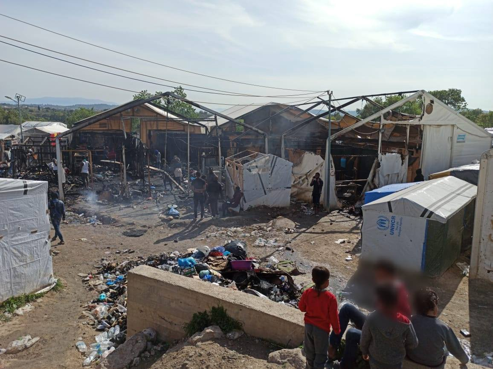
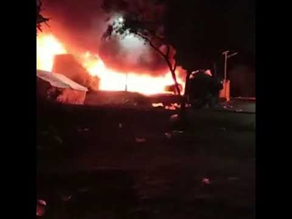
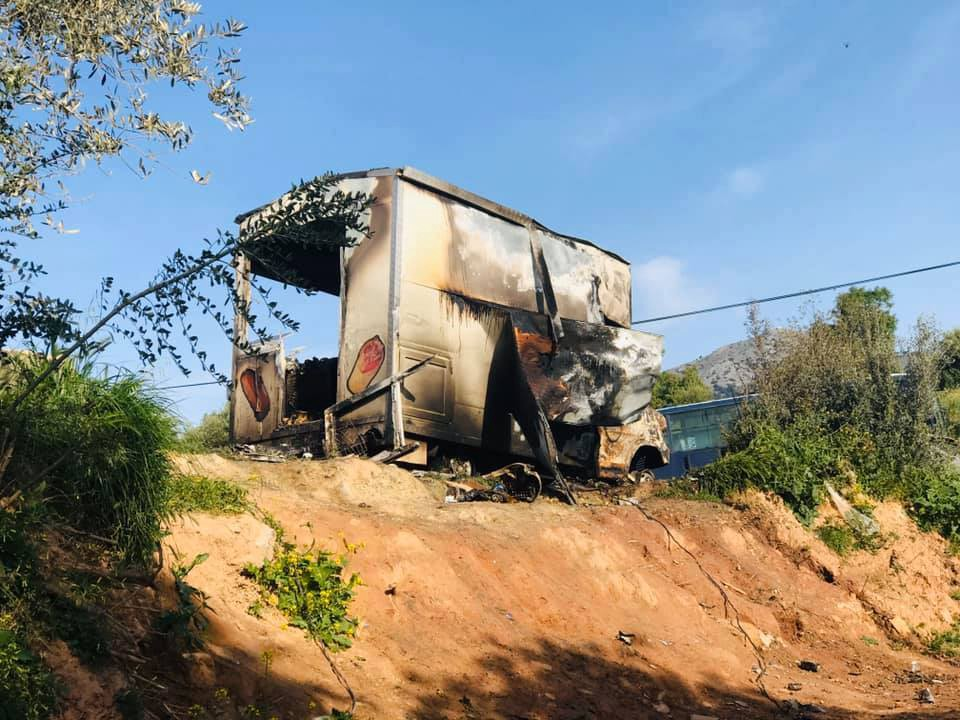
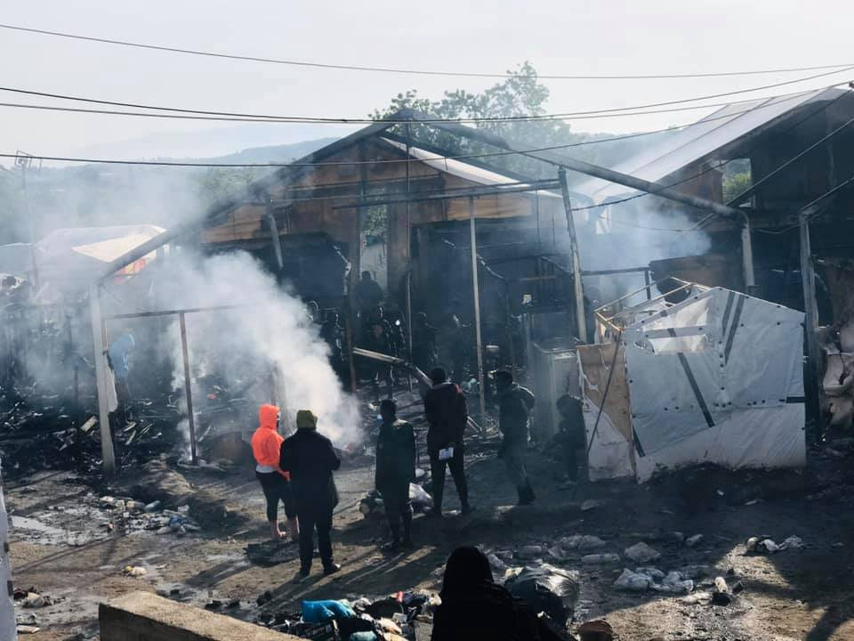
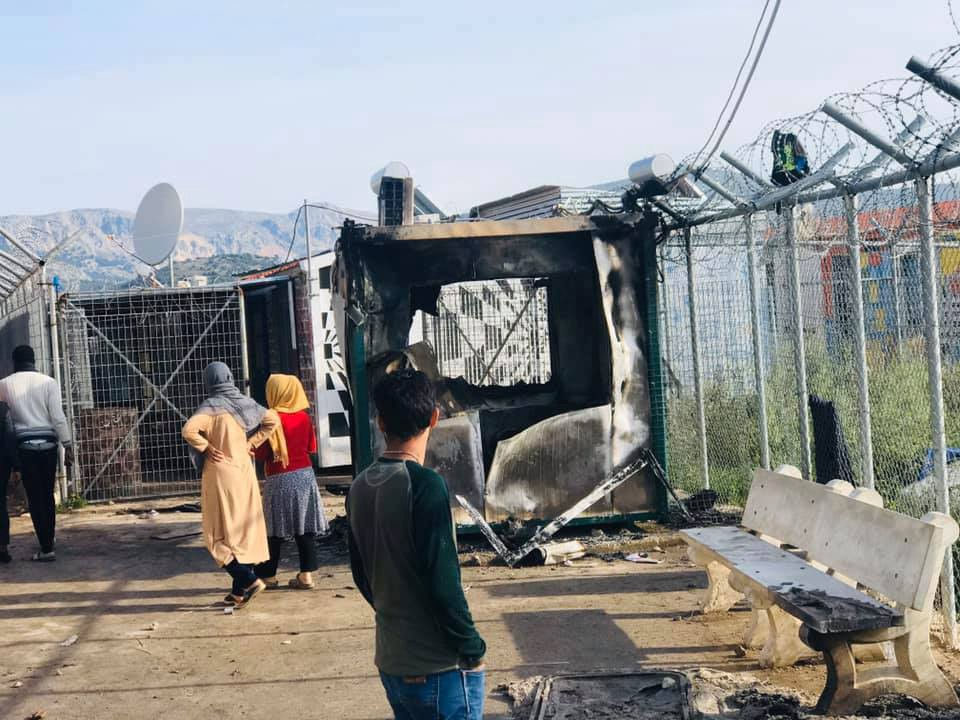
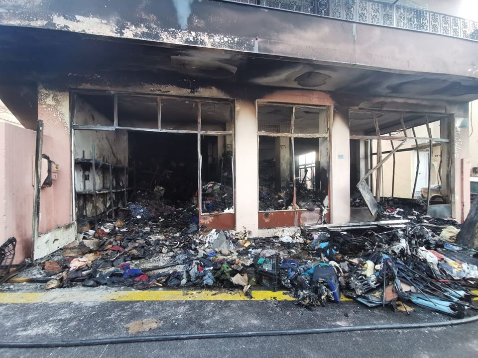

### AYS Special from Chios: Fire swallows up makeshift homes of hundreds
#### **The results of last night’s huge fires and damages in Vial camp are laid bare this morning\. The protests happened after the tragic death of a 47 year\-old who was locked up in a container\.** What has happened last night is the physical manifestation of the huge number of injustices conducted against the people living there\.

Trash, burnt down tents and despair: aftermath of last night’s riots\. Photo: camp resident

The results of last night’s fire in Vial camp, Chios, are laid bare this morning\. It appears that there were big fires in a number of different areas\.

One was near the front of the camp where the shop, the police kiosk and at least two police cars were burned down\. In the middle of the official camp the information & food distribution point were set ablaze, as well as the food stores\. At the back of the camp, perhaps the most devastating fire occurred\. At least three of the larger ‘Rubb Hall’ enclosures, which can accommodate well over 40 people, were burned down\. People’s homes have been completely destroyed, almost all of their personal belongings aside from what they could salvage are gone\.

> Protests began after a 47 year\-old woman from Iraq died, reportedly from either a heart attack or an obstruction\. She had been to hospital two days previous with bradycardia and arrhythmias\. They tested her for COVID\-19 and gave her medication **\. Once she returned to Vial, she was locked in one of the new containers outside the camp, as an isolation precaution, and had a panic attack\.** She was helped by the medical NGO, who calmed her down\. Yesterday morning at 10 am a doctor checked on her\. At 12 o’clock when her husband came to see her, he found her dead\. 

There are rumours spreading through the camp that this death was a result of neglect\. While nothing can be confirmed until the autopsy is completed on Tuesday, the conditions and the lack of adequate medical support in the camp may very well have been a large contributing factor in the loss of her life\.

There are several reports that as the police arrived, they began using tear gas to break up the protests that were ongoing\. At this point some of the camp residents retaliated by throwing stones in the direction of the riot police\.

Many people, reportedly in their hundreds, fled from their tents to nearby fields as the fires were ongoing\. Many others will have taken refuge in the unaffected tents and containers of their friends and family\. Amidst the chaos, people were afraid to go too far from Vial, for fear of €150 fines and arrest\. 
It is still unconfirmed, but there are reports of at least one person being taken to hospital with head injuries\.

According to [local media](https://www.politischios.gr/koinonia/sullepseis-kai-prosagoges-gia-ta-sobara-epeisodia-sto-k-u-t-tes-bi-al?fbclid=IwAR3OFBFK4KmrraXf9F9r9XNgHhdg5AhsLFiKtLZ-q_x-MqiO_WxGupBz_wY) , police officers have arrested three people who they believe are responsible for the incidents last night\.

> Today, one account claims that the staff who provide the food have arrived, but no food is being distributed as of yet\. People fear that there will be no food from the camp today, after the food stores were damaged and decimated by the fire\. 

Food trucks have been destroyed by fire\. Photo: camp resident
#### The pictures tell a thousand words\.

Why did this happen? In short, this level of violence is waged against the over 6000 people, who are resident in the camp, every single day\. It is not always as visible or as visceral as the events of last night, but it is ever present\. What has happened is the physical manifestation of the huge number of injustices conducted against the people living there\.

The camp has an official capacity of 1014 people\. Even when the camp was at this level, resources were stretched\. It is now over six times that\. There is not enough medical support, with the authorities relying heavily on a small NGO\. There is intermittent running water, in the last weeks people in the jungle have dug wells, in a desperate search for running water\.

There are reports that sometimes there is not the legal minimum \(1\.5 Litres per person per day\) of drinking water provided to families in the camp\. There is no basic waste management, particularly of the so\-called ‘jungle’, the overspill of the official camp resident to approximately 4000 people\.

How to rebuild a life in a camp six times over its capacity? Photo: camp resident

The cash card payments have been delayed this month, and it is unclear when they will restart\.

People are afraid to leave the camp, as they fear facing fines from the police if they go to the city to withdraw money from ATMs, which were supposed to be installed beside the camp, but as of yet have not been\.

There are snakes and scorpions in the fields and in the camp, one 9 month\-old baby was bitten a few days ago and rushed to hospital\. There is no information of what steps the authorities have taken to combat this issue\.

Only official camp actors have been able to work inside the camp, since the implementation of the COVID\-19 restrictions\. This means that all of the smaller NGOs have not been able to provide the important supports and gap filling services for many weeks\. This is in spite of the offers and willingness of these NGOs to compromise and support the authorities with supplies and volunteers\.

Lacking bare necessities and afraid to leave the camp: reality even before the fire\. Photo: camp resident

At present, NGOs and volunteers are attempting to provide support, but due to the nature of the situation and the even stricter COVID\-19 rules for the Easter celebrations \(which occur this week in Greece\), the authorities have been unwilling to accept their support and will not allow anyone to pass the police check points to the camp\.

All of these pressures, one by one, day by day, with everything else make the camps the most cruel and harsh of environments\. The people continue to suffer, and our thoughts and our solidarity is with them today as it is every day\.

The solidarity crisis encompasses not only the people on the move, but also the people of the Greek islands, who have been completely shut out by successive European governments, as well as their own\. For many locals on the Aegean islands the plan to build both very large and very permanent detention centres was one step too far\.

Chios People’s warehouse was burnt down on 3rd of March\. Photo: CPW

People from Chalkios, the village of about 300 people beside Vial camp, have organised a road block since Sunday the 1st of March, primarily in place in order to prevent the newest arrivals from being transferred to the camp, where they would normally have been registered after they arrive\.

A small group of people on the island have taken this action many steps too far when they burned down the Chios People’s warehouse \(CPW\) in the early hours of 3rd of March\. The warehouse had been used by many groups and individuals, local and international, to store NFIs for those in need, that is asylum seekers and various local communities\.

The overwhelming majority of the Chios community has utterly condemned this senseless act\. [A protest organised by locals](ays-daily-digest-3-3-20-deliberate-cruelty-as-official-policy-a2290587bd6c) in solidarity with CPW was held on the main Street of Chios town on 4th of March\.

The road block from the locals lasted until late last month, although now it’s the police blocking due to COVID\-19 restrictions\.

](assets/2cf8808d3106/1*FVUbfubnAMMwTsQ7XwfYJw.jpeg)

Local people protest in support of refugees and volunteers after the Chios People’s warehouse was burnt down in early March 2020\. Photo: [Katerina Anastasiou](https://www.facebook.com/lll.KAT.lll?__tn__=%2Cd%2AF%2AF-R&eid=ARAQqnbxPe5V_vW5Dqq0I6uRSmDxZSXa5QNm9B4t04WMfFDEaglCx3Gsy8EshCjsSuSfkL1_7xrnFtB4&tn-str=%2AF)

Local people on the island are not the issue\. Many of them have rescued people from the sea themselves and have helped people on the move here over the years\. They have also protected them against the small anti\-refugee groups\. The issue is the total lack of care and painful indifference consistently demonstrated by Greece’s European ‘partners’, day after day\. All of the islands have been in crisis for 5 years\. Over 42 000 people are stuck on the islands\. It is a humanitarian disaster and the only reason that any European authorities come to the table is to discuss how to prevent any further migration into Europe\. No one is listening to any of the people on the Aegean islands\.

This is an entirely artificial and man\-made catastrophe\. These are the pictures of today and of the every day suffering at the hands of abstract EU policies, which are far removed from the human reality witnessed in overcrowded refugee camps throughout the Aegean islands and the mainland of Greece\.

**_This special report was written for AYS by a volunteer on site\._**

**Find daily updates and special reports on our [Medium page](https://medium.com/are-you-syrious) \.**

**If you wish to contribute, either by writing a report or a story, or by joining the info gathering team, please let us know\.**

**We strive to echo correct news from the ground through collaboration and fairness\. Every effort has been made to credit organisations and individuals with regard to the supply of information, video, and photo material \(in cases where the source wanted to be accredited\) \. Please notify us regarding corrections\.**

**If there’s anything you want to share or comment, contact us through Facebook, Twitter or write to: areyousyrious@gmail\.com**

_Converted [Medium Post](https://medium.com/are-you-syrious/ays-special-from-chios-fire-swallows-up-makeshift-homes-of-thousands-2cf8808d3106) by [ZMediumToMarkdown](https://github.com/ZhgChgLi/ZMediumToMarkdown)._
