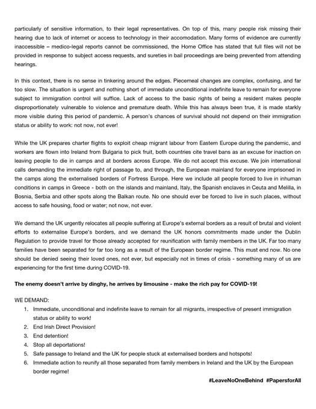

### AYS Weekend Digest 18–19/4/20: Vial fire latest in line to confirm that evacuation to safety is the only solution
#### People detained in unsanitary prisons under the disguise of coronavirus protection / More people lost lives in Maltese SAR area, Mediterranean neglected even more / Denmark to send people back to the dangers of countries of origin after the measures imposed due to Covid\-19 weaken / & more info from other areas

### FEATURED

During this weekend a tragic incident happened at the Vial camp on Chios\.
Please, read about it in our latest [AYS Special](ays-special-from-chios-fire-swallows-up-makeshift-homes-of-thousands-2cf8808d3106) , based on the statements and accounts by people on the ground at the time and residents of the camp\.
### [AYS Special from Chios: Fire swallows up makeshift homes of thousands](ays-special-from-chios-fire-swallows-up-makeshift-homes-of-thousands-2cf8808d3106)
### [The results of last night’s huge fires and damages in Vial camp are laid bare this morning\. The protests happened after…](ays-special-from-chios-fire-swallows-up-makeshift-homes-of-thousands-2cf8808d3106)
#### [medium\.com](ays-special-from-chios-fire-swallows-up-makeshift-homes-of-thousands-2cf8808d3106)

There were big fires in a number of different areas\. One was near the front of the camp where the shop, the police kiosk and at least two police cars were burned down\. In the middle of the official camp the information & food distribution point were set ablaze, as well as the food stores\. At the back of the camp, perhaps the most devastating fire occurred\. At least three of the larger ‘Rubb Hall’ enclosures, which can accommodate well over 40 people, were burned down\. People’s homes have been completely destroyed, almost all of their personal belongings aside from what they could salvage are gone\.
Three asylum seekers were arrested under a suspicion they are responsible for the violent incidents that broke out on Saturday following the start of the fire\. Reportedly, the police said that a large number of people are detained\.
### [Fire on Chios \| Open Letter to EU Commission \| Europe Must Act](https://l.facebook.com/l.php?u=http%3A%2F%2Feuropemustact.org%2Fchios-fire%3Ffbclid%3DIwAR0AFn5afgGtnRDbRi_mXaMwQHUrm9vcDRPDVa-pSAZ0cf8q0yh_nz6yT2k&h=AT2OkvELNRA8rUDaRijt_KFmCBM98r78fUstDJgPdxUBTN4m1xBRG5bT6qeo-OKkz4g-eOKoc4-ScS7UQDI8gTOK0M_HdGgMAu4C4IdL-j0xGWnVb7-Z0l6FkX50L94kHNggCcLyXjfaBA)
### [On 18th April 2020, another needless tragedy unfolded on the Aegean islands\. Late a night, a fire swept through parts…](https://l.facebook.com/l.php?u=http%3A%2F%2Feuropemustact.org%2Fchios-fire%3Ffbclid%3DIwAR0AFn5afgGtnRDbRi_mXaMwQHUrm9vcDRPDVa-pSAZ0cf8q0yh_nz6yT2k&h=AT2OkvELNRA8rUDaRijt_KFmCBM98r78fUstDJgPdxUBTN4m1xBRG5bT6qeo-OKkz4g-eOKoc4-ScS7UQDI8gTOK0M_HdGgMAu4C4IdL-j0xGWnVb7-Z0l6FkX50L94kHNggCcLyXjfaBA)
#### [l\.facebook\.com](https://l.facebook.com/l.php?u=http%3A%2F%2Feuropemustact.org%2Fchios-fire%3Ffbclid%3DIwAR0AFn5afgGtnRDbRi_mXaMwQHUrm9vcDRPDVa-pSAZ0cf8q0yh_nz6yT2k&h=AT2OkvELNRA8rUDaRijt_KFmCBM98r78fUstDJgPdxUBTN4m1xBRG5bT6qeo-OKkz4g-eOKoc4-ScS7UQDI8gTOK0M_HdGgMAu4C4IdL-j0xGWnVb7-Z0l6FkX50L94kHNggCcLyXjfaBA)

Countries across the Middle East have imposed measures to isolate their people to prevent the spread of coronavirus, but attention has turned to the region’s overcrowded, unsanitary prisons, where detainees often face a more punishing form of lockdown\.

Some Middle Eastern governments [have released](http://www.syriahr.com/en/?p=160539&fbclid=IwAR1UhJgJNpWp8Pu-zNHd1PDBzU9M-BcHPLnnYz700gycUrx4W-tAQ0aGJH0) prisoners as part of their response to the pandemic, while others have ignored pressure to do so\.

In Syria, despite the tremendous dangers still existing in their cities, at least 119,000 camp residents are now returning to where their homes were in Idlib and Aleppo\.
### LIBYA

If conflict in Libya is not stopped, COVID19\+intensifying fighting could lead to a humanitarian catastrophe\. Refugees in awful, overcrowded conditions in detention, with little to no access to healthcare are particularly at risk\.
The country has announced 10 days lockdown\. “The intensification of the war, the lockdown, the loss of livelihoods, the suspension of resettlement for refugees, the impunity enjoyed by traffickers west of Tripoli create conditions for more sea departures\.”
### SEARCH AND RESCUE AT SEA

5 years after the largest massacre in the Mediterranean, with more than 750 deaths, the EU and Italy operate in the same way, turning their back to the tragedy of Libya’s concentration camps and war\. We demand a European search and rescue program\.

After days with life at risk, all the people saved by the Aita Mari of [Salvamento Marítimo Humanitario](https://www.facebook.com/smhumanitario/?__tn__=KH-R0.g&eid=ARBjBwnLJT9Ng_otijDr9e5ZD6a6CwsDPPyZHpwTDggkeuAxZcLGuLY9Hd-6DnK1T5pnWW-qvN_EhxOF&fref=mentions&__xts__%5B0%5D=68.ARA_Df73P6r9nnzhFktTL_EXWAbOrmiBwqP8mEP3n0GyFMsJt3hqwJxW6QUq1koGHNxZIpYK5wdVyRnI2kIHclmVVp63oY6mVrH-KhrcQaLUzQCVre5ujYSENqYDMg5PNzCAWysrxcfftNpueJKfSYEO4KEGF6Hm9vA0BM9pIpaa4EQwr7bnqpDuuroo1sS_pRaaLEpWb-h4PpT90SGWjIBgq9MKUCYJTbARJV4Lb2zzQ87crw_4R7aUtE9s0RuvcH22EZUxp-cwtknTy4AEaO7jh9abeivFrBYLMSTj6Yg-lX5XSmIFEJRRCRg) have been finally transferred to the passenger ship Rubattino of Tirrenia\. Together with them and those rescued by the [sea\-eye](https://www.facebook.com/seaeyeorg/?__tn__=KH-R0.g&eid=ARAKFG7w9AzodlZEzNQIXzalXQ-z1aMmwv3sHFPi9gToa2Vdr9pM7kuoIfHpwJ7lj-hM62kKPLRWM93L&fref=mentions&__xts__%5B0%5D=68.ARA_Df73P6r9nnzhFktTL_EXWAbOrmiBwqP8mEP3n0GyFMsJt3hqwJxW6QUq1koGHNxZIpYK5wdVyRnI2kIHclmVVp63oY6mVrH-KhrcQaLUzQCVre5ujYSENqYDMg5PNzCAWysrxcfftNpueJKfSYEO4KEGF6Hm9vA0BM9pIpaa4EQwr7bnqpDuuroo1sS_pRaaLEpWb-h4PpT90SGWjIBgq9MKUCYJTbARJV4Lb2zzQ87crw_4R7aUtE9s0RuvcH22EZUxp-cwtknTy4AEaO7jh9abeivFrBYLMSTj6Yg-lX5XSmIFEJRRCRg) , the two crews of the civil society rescue ships, [Mediterranea Saving Humans](https://www.facebook.com/Mediterranearescue/?__tn__=%2CdkCH-R-R&eid=ARAJATJ6t78V5DzjgP1aR4gJodz7hFdcmdWE1iC_pOaq8u1UjajVQfGfStYW_u5RPfNTHS-sCJn98OwG&hc_ref=ARSXTv35HpneywqqqIWYWTVAvavNq_7ZyD6PWGCpmfikLx_D7X7TB4lOqrBO8cCAgrA&fref=nf&hc_location=group) reported\.

In fact 12 people died, AlarmPhone reports: 7 drowned in Malta SAR\.
5 more died of thirst & hunger, of which at least 3 died on board of the vessel that brought them to Libya\.

In Lampedusa, on Sunday 32 people were reported arriving by boat, 15 men, 18 women \(two in late stages of pregnancy\) \. People who had previously landed are reportedly left on the ground at Favaloro pier\. The local mayor asked for the maritime hot spot to be installed offshore, Italian media report\.
### BOSNIA AND HERZEGOVINA

There are many people still scattered across the country’s towns and villages, without a proper reception facility, those who are outside the system due to the system’s capacities find their own way of going through every day\. They sleep in abandoned houses, outside in the open, in train wagons, whatever is at hand in these difficult days when everyone sees another person as a possible life threat\. The current situation in many places still seeks a proper, humane and realistic \(in terms of capacities and conditions\) coordinated approach in order to be sure it is assessed and approached in the best way\. It is not about the international standards, at this point, it is still about people needing food, and their basic rights met and their dignity respected\.

The first people were planned to be taken to the provisional tent settlement near Bihać, Lipa, built with the support and management of the international organisations, a project we wrote previously about and we will report about the plan being put into practice\.

Although many see it as a step forward, we like to always remind that “international standards” stand for a MINIMUM level of standards when it comes to international aid and protection and it should serve as a warning of a line never to be reached, or even crossed, and not as a goal, as it seems to be interpreted more and more by those deciding and putting things into place\.
### FRANCE

There are around 1,500 people stuck in cramped unofficial camps in Calais and Dunkirk but the pandemic has ‘ripped a gaping hole’ in NGOs’ ability to help\. Reportedly, there are now less than a dozen frontline volunteers remaining — down from at least 100\. Grassroots organisations have had to pack up and leave due to a lack of funds or safety fears\. Travel bans have stopped volunteers getting to the camps, donations have dried up and the French Government has cut food rations by half to mostly a piece of bread and ham a day\.

We are preparing a full report on the current situation in France which we will publish soon as an AYS Special story\. Contributions are welcome\.
### DENMARK
### “After the end of the Corona situation the migrants in question must be sent home”

The Danish minister of immigration and integration Mattias Tesfaye does not intend to meet the critics who believe the government should introduce a temporary free housing scheme for migrants without legal residence in Denmark infected or suspected with COVID\-19\. A [new interview](https://www.information.dk/indland/2020/04/tesfaye-afviser-frit-lejde-illegale-migranter-coronakrisen-danmark-retsstat?fbclid=IwAR2PQWemwya-P4ZIpp_4maAEx7_PpTwJRKaf9_homUoMDN2Dr2L-kNAkInY) with the minister confirms this standpoint\.

After the issue was brought forward by Danish daily information recently, the Ministry of Immigration and Integration announced in a press release that migrants will be “offered quarantine accommodation at asylum centers at two different locations\.” In the press release, the minister makes it clear that “after the end of the Corona situation” the migrants in question must “be sent home”\.

> _Mattias Tesfaye states that he “has a hard time seeing that it can be any different,” as he says\. “The Danish society is making a good effort in this area”\._ 

He points out that everyone in Denmark has the option of being tested and admitted to hospital if necessary\. “If people are quarantined and have no place to live, we also provide a bed, food and health services\. I think that’s good,” he says\. But at the same time, it is important for Mattias Tesfaye to emphasize that “we live in a legal system\. This also means that if you do not have legal residence, then we should not just turn a blind eye\. The authorities cannot just see through fingers with illegal behaviour and action\.”

> _“The recommendations given to all Danes are the same as given to foreigners\. But I recognize that if people do not live up to those recommendations, then there is a huge risk\. “_ 

### UK

**Follow [Demands from a Pandemic](https://twitter.com/pandemicdemands) for more information on :**

**Find daily updates and special reports on our [Medium page](https://medium.com/are-you-syrious) \.**

**If you wish to contribute, either by writing a report or a story, or by joining the info gathering team, please let us know\.**

**We strive to echo correct news from the ground through collaboration and fairness\. Every effort has been made to credit organisations and individuals with regard to the supply of information, video, and photo material \(in cases where the source wanted to be accredited\) \. Please notify us regarding corrections\.**

**If there’s anything you want to share or comment, contact us through Facebook, Twitter or write to: areyousyrious@gmail\.com**

Following
- [Digest](https://medium.com/tag/digest)
- [Greece](https://medium.com/tag/greece)
- [Refugees](https://medium.com/tag/refugees)
- [Human Rights](https://medium.com/tag/human-rights)
- [Denmark](https://medium.com/tag/denmark)

_Converted [Medium Post](https://medium.com/are-you-syrious/ays-weekend-digest-18-19-4-20-vial-fire-latest-in-line-to-confirm-that-evacuation-to-safety-is-the-e4d326777807) by [ZMediumToMarkdown](https://github.com/ZhgChgLi/ZMediumToMarkdown)._
