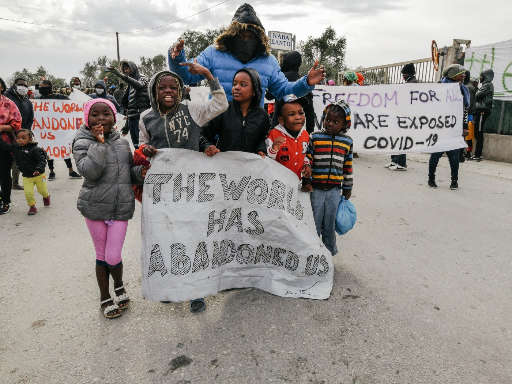

### AYS Daily Digest 22/04/20 ~300 people protest in Moria for safety against COVID\-19
#### Updates from France, Serbia, Germany and more…

](assets/f90461d3fe37/1*mGotJDyvtdY7CqFGpQBu_A.jpeg)

Protest in Moria on Wednesday\. Photos by [Mare Liberum e\.V\.](https://twitter.com/teammareliberum/status/1252942109293850624?fbclid=IwAR1L4OC_sp7aykr6LIjufoOcvzeAB4x051jEodjmr6S-HnbbD0MuLDlF5bE)
### FEATURE: About 300 people took to the streets of Moria on Wednesday to protest for their safety

Franziska Grillmeier outlined their demands:

■■■■■■■■■■■■■■ 
> **[Franziska Grillmeier](https://twitter.com/f_grillmeier) @ Twitter Says:** 

> > In early morning members of African community - women, men &amp; children - were protesting outside #Moria demanding:
1. end to overcrowding + fear of total insecurity for ppl + their property
2. End of health + food insecurity
3. End of total exposure to contam. of #COVIDー19 /1 

> **Tweeted at [2020-04-22 08:04:08](https://twitter.com/f_grillmeier/status/1252870789608509443).** 

■■■■■■■■■■■■■■ 

■■■■■■■■■■■■■■ 
> **[Franziska Grillmeier](https://twitter.com/f_grillmeier) @ Twitter Says:** 

> > 4.End of rejection, imprisonment + deportation of #refugeesgr
5.End the racial discrimination against Africans following convoys + relocations of refugees 
6.Recognise vulnerability
7.Liberty, nothing but freedom! /2 

> **Tweeted at [2020-04-22 08:04:08](https://twitter.com/f_grillmeier/status/1252870791374368771).** 

■■■■■■■■■■■■■■ 

More from the protests:

■■■■■■■■■■■■■■ 
> **[Mortaza](https://twitter.com/mortazabehboudi) @ Twitter Says:** 

> > Message des réfugiés du camp surpeuplé de #Moria ce matin : « nous sommes abandonnés ici avec des bébés. Nous voulons l’évacuation urgente. #COVIDー19 est une menace et nous vivons au milieu des ordures ». Plus de 19 000 réfugiés vivent ce confinement sans eau, sans savons,... https://t.co/o1jQLwSOm6 

> **Tweeted at [2020-04-22 07:14:40](https://twitter.com/mortazabehboudi/status/1252858343506325504).** 

■■■■■■■■■■■■■■ 

[Mare Liberum e\.V\.](https://twitter.com/teammareliberum/status/1253049860997120005) adds context to the racism many face on Lesvos:

> “The \#Lidl supermarket near \#Moria camp has now established the racist procedure of denying residents of Moria to enter\. This is making it even harder for them to get food\. At todays demonstration protesters shouted ‘We are hungry’\!” 

#### TURKEY

According to Greek media, Turkey’s secret service has been conducting scouting missions in Greece for critics of the Turkish government\. They especially want information on supporters of self\-exiled cleric Fethullah Gulen, who is currently in Greece\. More [here](https://www.ekathimerini.com/251888/article/ekathimerini/news/turkish-secret-services-target-refugee-camps) \.
#### SEA

[The Mayor of Lampedusa](http://www.mediterraneocronaca.it/2020/04/22/hotspot-galleggianti-da-40mila-euro-al-giorno-la-soluzione-per-i-migranti-del-governo-conte/) is making arrangements for a ship to quarantine new arrivals\. “The ship must accommodate a maximum of 250 people to be placed in isolation on board\.” More details seem to be forthcoming, so AYS will continue to follow…

In a [Migeurop update](http://www.migreurop.org/article2984.html?lang=fr) on deaths at sea, they poignantly address that:

> “While policies aimed at containing the spread of the virus are justified, they do not make acceptable the policies of non\-assistance at sea that the EU has been pursuing for years, even temporarily and supposedly on an ‘exceptional’ basis\. Under no circumstances can the COVID\-19 pandemic justify the suspension of States’ obligations in terms of rescue at sea and the solidarity that should exist between them to organize collectively the reception of these people in need of protection\. Nor can it justify the suppression of the fundamental rights of migrants, in particular the ’right to escape’ of those who seek at all costs to escape the Libyan chaos\. It can never be tolerated that lives are sorted, prioritized and despised\.” 

#### GREECE

**There is reporting that [Wednesday evening two people were shot](https://greekcitytimes.com/2020/04/23/shooting-at-moria-camp-with-two-migrants-injured/) after guns were fired at the camp\. The two people were taken to the hospital\. AYS will continue to follow these unfolding developments…**

Wednesday marks the second year anniversary of the \*Sappho Square Racist Attack\* in Mytilene, Lesvos\. HIASGreece remarks:

> “Today marks second years after the \*Sappho Square Racist Attack\* in Mytilene, Lesvos\. On 22 April 2018, c\.150 persons attacked c\. 200 protesting refugees with stones, petards and bottles, while at the same time insulting them for their religious and ethnic background\. In 11/2018, 26 persons were identified as suspects for the attack & in February 2019 criminal charges were pressed\. However, until now none of the 26 had been summoned for the judicial interrogation\. HIAS Greece which is representing a number of the victims of the attack, as civil party in the criminal proceedings, condemns the unjustified delays in the criminal investigation of the racist attack and calls on the competent authorities to proceed with the full and timely investigation of the case without any further delay\.” 

[**Refugee Support Aegean \(RSA\) and PRO ASYL**](https://rsaegean.org/en/quot-in-this-place-we-have-to-help-ourselves-quot-malakasa-camp/?fbclid=IwAR349TTj5NKKq9j4DdoZs4NmhPPPQfIfQgGmG03Xy2ugIThSitlZLlP36Y0#vulnerable) released a report on Malakasa camp and the government’s lack of a response to COVID\-19:

> “Over 1,600 refugees and asylum\-seekers are locked\-up in Malakasa refugee camp during Covid\-19 quarantine with more than half of the residents unregistered \[1\] and near 250 of them living in common areas and make\-shift shelters\. 

> **Throughout last year, the refugee camp in Malakasa, has been extensively used by homeless refugees to find emergency shelter — most of them newcomers from the Evros region** \. As of February 2020, near 250 people resided in common areas and makes\-shift shelters in dire conditions and more than half of the camp’s population were not registered as residents by the Ministry of Migration and Asylum\. In the midst of this situation, on 5 April 2020, the first Covid\-19 case was detected in Malakasa and the camp has been locked down for a 14\-day quarantine\. Refugee Support Aegean \(RSA\) and PRO ASYL have documented 27 cases of asylum\-seekers who sought shelter in the camp without official referral\. The vast majority of the interviewees arrived from the Evros region and some from the islands\. They described vividly the harsh living conditions and the challenges they face during the pandemic\. The failure of the Greek authorities to refer those arriving in the Evros region to a shelter following their release from detention means that many remain unregistered and in precarious accommodation for some time and face more risks for their mental and physical welfare particularly at the time of the pandemic\.” 

### Human Rights Watch published a detailed report on how Greece is not ready to handle COVID\-19 in refugee camps\.

You can read [the full report here](https://www.hrw.org/news/2020/04/22/greece-island-camps-not-prepared-covid-19?fbclid=IwAR0anY1sJZVlLoNVNMaT6uL_RiPfUbls1Krqd1xqLKIJ6sNsyduPm7805fg#) \.

> “Ultimately Greece, with the support of EU institutions and countries, should end its inhumane containment policy and facilitate the transfer of asylum seekers from the Aegean islands on a regular basis and provide them with fair and efficient asylum procedures\. 

> ‘Covid\-19 exposes that the lack of EU solidarity on addressing the congestion in the Greek islands has not only made the situation worse but is now putting thousands of lives at risk,’ Wille said\. ‘The Greek government and the EU should show they can win this race against the clock while addressing in a humane way the massive overcrowding that has been a problem for years\.’” 

HRW also interviewed a pharmacist, who’s lived in Moria the past five months\. [See a video here](https://www.facebook.com/HumanRightsWatch/videos/686914575391747/) of their interview with him while he explains the efforts to protect and educate people in the camp about the virus\.

[This guide](http://stayhome.camp/?fbclid=IwAR2HSWsTNEMloQNVxMvuiEOaSupRz6B78oDciElQwthz56fhA3SrIj-CZGA) on COVID\-19 is not perfect, but that’s because the situation many refugees find themselves in doesn’t allow for strict adherence\. Yet it’s available in Arabic and French and can provide useful, basic information\.

[Here is another guide](https://www.aparttogetherstudy.org/?fbclid=IwAR2GgqPvlnpDdqI1HOTPz82BdZWhiDvIy9BL5ke_YVMcS8gJarXfHgUzTE4) in even more languages\.

Three amazingly helpful organizations need your support now to help people in Greece from COVID\-19:

_“ **Greek Forum of Refugees** is trying to raise some funding and collect some supplies for the most vulnerable people who suffer the most the COVID19 pandemic consequences\. We need your support in this effort so we can keep up being useful for the people in need\.”_ Donate [here](https://www.facebook.com/Greekforumofrefugees/?eid=ARDAD07mNusQ1Y7rlAFFO8u4YMTSMIReSFrvw1oePalVjP4Ac7QM7c3JvI6aCiEPOOnTdGrB5DP-F6JY) \.

_“ **Mobile Info Team is asking you to help out, without having to leave your house\!** Unable to leave the overcrowded camps, refugees in Greece are vulnerable to the spread of COVID19 and are without the protection of the states and societies they once knew\. Our work is more is more critical than ever\. We publish regular updates on Greek asylum services and information on detection of and protection from COVID19, as well as the pandemic’s presence in Greece\. Now more than ever, information is power and Mobile Info Team is working day and night to equip vulnerable migrant communities with the facts they need to protect themselves\.”_ [Donate here](https://www.mobileinfoteam.org/donate) \.

Join **Movement on the Ground’s campaign** to help the 2,000 people living in the olive groves outside of Moria\! They are trying to raise money to improve their resources\. [Join here](https://www.facebook.com/movementontheground/posts/1686993981476907?__tn__=-R) \.
#### ITALY

■■■■■■■■■■■■■■ 
> **[Sara Creta](https://twitter.com/saracreta) @ Twitter Says:** 

> > #Italy 180 people - previously rescued by #AlanKurdi &amp; #AitaMari ships - are now on a 'floating hotspot' called #RaffaeleRubattino off #Palermo (quarantined on a private ferry).

I hope this 'solution' has nothing to do with an old idea proposed by Italy ➡️[europarl.europa.eu/doceo/document…](https://www.europarl.europa.eu/doceo/document/P-8-2016-004213_EN.html?redirect) https://t.co/qxshZ6Ht7H 

> **Tweeted at [2020-04-21 23:14:46](https://twitter.com/saracreta/status/1252737572905848832).** 

■■■■■■■■■■■■■■ 

■■■■■■■■■■■■■■ 
> **[Sara Creta](https://twitter.com/saracreta) @ Twitter Says:** 

> > #Italy 180 people - previously rescued by #AlanKurdi &amp; #AitaMari ships - are now on a 'floating hotspot' called #RaffaeleRubattino off #Palermo (quarantined on a private ferry).

I hope this 'solution' has nothing to do with an old idea proposed by Italy ➡️[europarl.europa.eu/doceo/document…](https://www.europarl.europa.eu/doceo/document/P-8-2016-004213_EN.html?redirect) https://t.co/qxshZ6Ht7H 

> **Tweeted at [2020-04-21 23:14:46](https://twitter.com/saracreta/status/1252737572905848832).** 

■■■■■■■■■■■■■■ 

#### SERBIA

 of their food distribution in Velika Kladuša](assets/f90461d3fe37/1*1YFOIO1oSnsQ9w2Ofd0faA.jpeg)

Photo by [NoName Kitchen](https://www.facebook.com/NoNameKitchenBelgrade/posts/960278791037072?__xts__[0]=68.ARC2fdLoKHiZneWEYxFuSlHUrIuPG-0y93n5WpDilCXFVIJ3XS1N4K0Ivs3uFDAp-_okXgSRq8xDpTqiM0j2syQmhnKRq4l9iMkQxA9QCp83bhrW5sH2fqQqxq1Xe3_hCgDBNUkGjUyA_ttt6coSTRf4hnZgQ9WgQWPTjxexZg_xFrgh8tjXaYlI9-BKKQyr9nMdGyIC3JZGI-9ewxO-25x2NJJguop6x6WLo2k2JnJkVbV2yTzbyFJ_Zc7P_xQmOssvbHVXngoYZeKgqjiwXc7Bk5M7xZ4xg2-EoAJtF2EpOEaFuWiXYq9Ycdxf4g7rNn_zsz3MwVT6hsQUvyyksxM&__tn__=-R) of their food distribution in Velika Kladuša

In an update from NoName Kitchen:

> “Upon the arrival of the coronavirus, the government limited the movement of migrants and left the detention of those who lived outside the official camps to the police and the military\. Since then, no one can leave and there are members of the army guarding the perimeter of each property\. Meanwhile, the police are stopping foreigners on the streets of Belgrade on suspicion that they are migrants based on their faces, skin colour, clothing… and asking where they come from and where they are staying\. 

> Good news in this scenario is that there were no registered cases of Covid\-19 contagion in any of the camps\. Further good news is that at least 35 young people who tried The Game in recent days were able to cross the border and are healthy and safe in different European countries\. In contrast, we heard from three people who were unable to do so and suffered pushbacks to Bosnia by the Croatian police\. 

> Seven weeks after the arrival of the virus, the number of infected people is growing by about 400 cases daily average, much higher than registered during March\. Serbia has become the country with the most cases on the entire Balkan route, second only to Romania in the region\.” 

#### GERMANY

The government is changing one of its labor laws to allow asylum seekers the ability to work in agriculture\. During the pandemic there has been a shortage of farm workers\. This opportunity will run through October\. More [here](https://www.infomigrants.net/en/post/24276/germany-to-allow-asylum-seekers-to-work-in-agriculture-until-october?fbclid=IwAR0hxrNL15D1psUBfSgZ-MT_9Ur3nK2LBVkTCX4QohVPQFAIL5gDkjyYa-4) \.
#### FRANCE

 \! Photo by [Care4Calais](https://twitter.com/Care4Calais/status/1253017072315097088?fbclid=IwAR2CTgFEDB1Xs9qTlhumJMat1_-1-XD3zzpzUE9DhJZ02kWOFV3zTv0fNKU)](assets/f90461d3fe37/1*-IxGzAKiCaRZvr_sWpC0kQ.jpeg)

Took a few packs to a small site with no government food, showers, toilets\. They were playing cricket and welcomed the food with joy\. One man said he told his aunt back home and she wept that someone cared so much to do that for him\.
[Our appeal is here](https://care4calais.org/emergency-appeal/) \! Photo by [Care4Calais](https://twitter.com/Care4Calais/status/1253017072315097088?fbclid=IwAR2CTgFEDB1Xs9qTlhumJMat1_-1-XD3zzpzUE9DhJZ02kWOFV3zTv0fNKU)
#### DENMARK

According to the Danish media, [asylum in Denmark has slowed](https://www.kristeligt-dagblad.dk/danmark/naesten-ingen-soeger-asyl-i-danmark-laengere-alligevel-afviser-samtlige-partier-i-blaa-blok?utm_source=rss_nyheder&fbclid=IwAR3avYUn0ZgB1DzBT49VPgz61ybTRtATd8L85dA2gBuE0RKHUUPqi1qUSPk) , even though it was very low to start with:

> “Yesterday, new figures from the Ministry of Immigration and Integration, showed that only 38 refugees have sought spontaneous asylum in Denmark since the outbreak of the corona crisis\. Even before the corona crisis, the influx to Denmark was low, and so far only 295 people have applied for asylum in 2020\. Despite asylum numbers close to zero, none of the center\-right and right\-wing parties in the Danish parliament \(Folketinget\) wants for Denmark to accept new UN quota refugees\. 

> During the recent election campaign, the then Prime minister and chairman of the Liberals \(Venstre\), Lars Løkke Rsmussen contrary claimed that Denmark was “close” to being able to take quota refugees again, just as Conservative People’s Party \(Konservative\) have previously spoken warmly in favour of such a scheme\.” 

Also the Danish minister of immigration and integration, Mattias Tesfaye, according to the daily Politiken is refusing to accept any of the children from Greece’s refugee camps\. Other political parties keep pressing, however\. More [here\.](https://www.kristeligt-dagblad.dk/danmark/partier-vil-hente-uledsagede-born-hjem-fra-flygtningelejre?fbclid=IwAR2FY0r21lzhpwr2rwrVx60pc8Wcr5r0217m81Ng8V2h2pCbFQqmbrP5hcM)
#### SWEDEN

[Human Rights Watch](https://www.hrw.org/news/2020/04/22/ngos-urge-swedish-minister-justice-and-migration-morgan-johanson-welcome?fbclid=IwAR0STrL2UyMDlIWshFC9BQLq7oktyXu0V6Hq3ZMPbQzSb96TA_8eOEsrI10) released a letter **“NGOs Urge Swedish Minister of Justice and Migration Morgan Johanson to Welcome Unaccompanied Children from Greece\.”**

_“We call on your government to demonstrate its leadership and commit to welcome to your territory unaccompanied children from Greece in the weeks to come, or as soon as possible given the difficult context created by the COVID\-19 pandemic\. Sweden’s government has repeatedly stated its intention to embrace humane migration policies; joining the initiative to relocate unaccompanied migrant children from Greece would put Sweden once again at the forefront of this laudable effort\.”_
#### GENERAL

Here is [an eye\-opening piece](https://thediplomat.com/2020/04/covid-19-is-a-test-for-climate-migration-and-the-world-is-failing/?fbclid=IwAR03kPhr34lj0n43U3ifVXw-NzoWHZ2ZxOP6u56xj-XCaC29ZDK7R02ZafA) by refugee law experts on how COVID\-19 is a test for the climate refugee crisis to come\. They say:

> “The loss of life and economic chaos wrought by COVID\-19 serve as a forewarning for how the world might cope with mass migration as a result of climate change\. The inevitable emergence of climate migration poses a great risk to many nations, and, now more than ever, governments and international institutions must begin contingency planning\. 

> The world’s failure to effectively react to a rapidly spreading virus offers a grim outlook for its ability to collectively prepare for climate migration, but the consequences of inaction have never been clearer\. The distinction between COVID\-19 and climate change is that flattening the curve for the latter will require decades of consistent action rather than mere weeks\.” 

■■■■■■■■■■■■■■ 
> **[Legal Centre Lesvos](https://twitter.com/lesboslegal) @ Twitter Says:** 

> > We join @[stopthewall](https://twitter.com/stopthewall) in calling on the #EU to stop buying Israeli drones used to commit war crimes against Palestinians - now being used as part of EU's anti-migration policies. Please sign and share! [petition.stopthewall.org](https://petition.stopthewall.org/)
#HealthcareNotWarfare
#DefendLives
#SpreadSolidarity https://t.co/QkYKn8QbMi 

> **Tweeted at [2020-04-22 16:12:38](https://twitter.com/lesboslegal/status/1252993726215008260).** 

■■■■■■■■■■■■■■ 

[The Quarterly Mixed Migration Update](http://www.mixedmigration.org/wp-content/uploads/2020/04/qmmu-q1-2020-me.pdf) is out in the Middle East\. They speak directly to the effect of COVID\-19 in many parts of the region\. Here is one:

> “Idleb ceasefire while COVID\-19 adds to needs in Syria 13 March marked the ‘grim’ tenth anniversary of conflict in Syria\. A ceasefire between Turkey and Russia in relation to the Idleb area came into effect on 6 March, and hostilities reportedly decreased significantly in the northwest\. However, needs on the ground remain severe and the COVID\-19 pandemic has complicated the provision of aid\. February marked a stark increase in internal displacement, with about 752,130 movements across Syria, including around 454,000 IDPs from Idleb governorate\. However, 103,459 Syrians had reportedly returned to their home towns in the northwest between the ceasefire and 12 April\.” 

**Find daily updates and special reports on our [Medium page](https://medium.com/are-you-syrious) \.**

**If you wish to contribute, either by writing a report or a story, or by joining the info gathering team, please let us know\.**

**We strive to echo correct news from the ground through collaboration and fairness\. Every effort has been made to credit organisations and individuals with regard to the supply of information, video, and photo material \(in cases where the source wanted to be accredited\) \. Please notify us regarding corrections\.**

**If there’s anything you want to share or comment, contact us through Facebook, Twitter or write to: areyousyrious@gmail\.com**

_Converted [Medium Post](https://medium.com/are-you-syrious/ays-daily-digest-22-04-20-300-people-protest-in-moria-for-safety-against-covid-19-f90461d3fe37) by [ZMediumToMarkdown](https://github.com/ZhgChgLi/ZMediumToMarkdown)._
