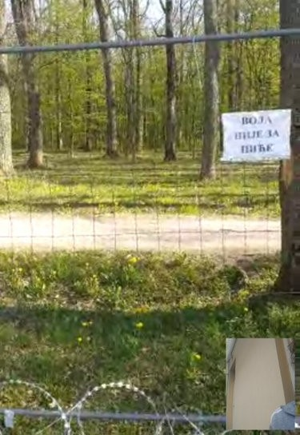

### AYS Daily Digest 23/4/20: Will Austria be deporting to Serbia?
### The Netherlands refuses to take in children from Greek camps / Additional dangers of confinement in times of pandemic / Court ruling in Germany in favour of people in asylum centres being allowed to leave if centres don’t respect physical distancing during coronavirus / Denmark sending financial support to minors in Greece

[Are You Syrious?](@AreYouSyrious?source=post_page-----5e65d5c1b22e----------------------)

[Apr 24](ays-daily-digest-23-4-20-will-austria-be-deporting-to-serbia-5e65d5c1b22e?source=post_page-----5e65d5c1b22e----------------------) · 7 min read

### FEATURED

A secret agreement signed between Austria and Serbia a year ago, on April 24, 2019, has caused some excitement in Austria in recent days as details only became public knowledge through a parliamentary inquiry which was answered by the Interior Minister Karl Nehammer\. The agreement allows Austria to send refugees whose asylum applications were turned down in Austria to Serbia if “sufficient connection to Serbia” can be established, independent of their country of origin\.

> _This means, any refugees who came through Serbia along the Balkan route and cannot be deported back to their countries of origin, can now be sent to Serbia where they are supposed to be held in open camps more or less indefinitely\._ 

Given the balance of power in the region and Austria’s important role as an advocate for Serbian membership in the EU, it remains to be seen how liberally this term of “sufficient connection” will be applied, Border Crossing Spielfeld group reports\. We have already seen this in the case of Dublin cases sent back to Croatia, where Austria sent by far the highest numbers, and Croatia accepted all these applications tacitly, as AYS reported a number of times\.

The Serbian public was also not informed about this deal, and the Serbian government was quick to point out that no one has yet been sent back under this agreement and that with camps already full and COVID 19 travel restrictions, this was unlikely to change soon\. However, the Austrian Interior Minister insisted that despite a change in government since the agreement was signed by his right\-wing predecessor Kickl, Austria still believes in this agreement, a statement which has alienated the Green party, current junior partner of Nehammer’s conservative party ÖVP\.

> _The agreement is well in line with the general policy pursued by Austria which amounts to a categoric refusal of any new arrivals\._ 

Despite calls by many sections of civil society, Austria will not take in any children from Greece and has opted for “on\-site\-assistance” in the form of Austrian police officers helping out at the Greek\-Turkish border and living containers for the isolation of COVID cases in Greek camps\. While deportations have been halted for the moment, hardly anyone detained pending deportation has been released\. Any refugees presenting themselves at the border and asking for asylum without a valid COVID health certificate are turned back, a de facto refusal to accept asylum applications Austrians report\.
### GREECE
### Lesvos — While some get shot at, others fear going for food

The two people who had been shot while the recent peaceful protest was on, were reportedly shot about seven kilometers away from Moria, with a hunting rifle\. They claimed they had been “going for a walk,” unrelated to the events at the camp\.

As InfoMigrants stated, “although the motive for this attack has not been clarified, _dpa_ also reported that in March anti\-migrant extremists had been known to attack migrants and humanitarian workers on the island\.

They also said that theft had increased around the Moria camp in recent years and is often reported\. Again though, there is no clear link to what the migrants may, or may not, have been doing when they were shot at\.”

Reaching food presents a daily fear and a problem for thousands in Moria\. Many people reportedly choose to cook themselves if they can get supplies of food, while others fear to queue for food in the camp due to the risk of Covid\-19 infection\.

In the Malakasa camp, quarantine continues\. At the same time in Corinth and Grevena, camps run by the IOM, apparently there are no doctors available, thus no healthcare provided for the people held inside the camps under the internationally agreed standards, whose minimums define the number of health workers available, and define health care as one of the basics available to the people\. As we heard this information from a number of different sources, we hope for some clear scrutiny and reporting on such practices that are present in different places not only in Greece, but along the Balkan route, namely in Bosnia and Herzegovina as well\.
### Thessaloniki — fines issued to homeless people

Many fines have reportedly been issued to homeless people across Thessaloniki due to breaking the rules during the coronavirus pandemic, [Mobile Info Team](https://twitter.com/mobileinfoteam) reported\. At the same time, we hear that the police in different areas have been allowing people to gather in small churches for worship, thus bringing into danger everyone they later meet, with no warnings or precaution from the authorities\.
### BOSNIA AND HERZEGOVINA
### Forcing deportations, regardless of what others think

The minister of security of Bosnia and Herzegovina announced at the press conference that the plan to deport migrants currently in Bosnia and Herzegovina is ongoing\. He stated that “many of those people are terrorists _sleepers_ and that almost everyone hides their real identity”\. Therefore, Bosnia and Herzegovina intends to deport all of them, and he said that, instead of providing funds for keeping the people inside the country, he wishes the EU would help them send those people back\. He is aware that “some countries in the EU might not be in favour” of his idea, but that is the official plan\. He also stated that the Pakistani ambassador will be named _persona non grata_ because he seems to be against the idea\. The Bosnian “diplomacy” is yet to receive any real criticism from the international community, and it will be interesting to see which country or organisation will feel blameless enough to point their finger first… The situation for people on the move across Bosnia and Herzegovina has only been worsening, if that is still possible, and we hope that the support for the opening of the Lipa camp in the middle of nowhere will not be considered the maximum the international community can do and the optimal solution for all those people stuck in the area\.
### HUNGARY

News from the European courts say that, according to the Advocate General , the accommodation of asylum seekers in the Röszke transit zone at the Hungarian\-Serbian border must be classified as ‘detention’\. Read more [here\.](https://curia.europa.eu/jcms/upload/docs/application/pdf/2020-04/cp200050en.pdf?fbclid=IwAR2agglHlA69pukzsKBZfn-gS9fDKHZKRYM3idkKKWpGtWjx6duFIyKBSzs)
### GERMANY
### Quarantine at the reception centre in Bremen

The whole reception centre in Bremen is in quarantine now, after 120 of 370 residents were tested positive for Corona\. A total of 69 tests are still pending\. Authorities still refuse to close the camp, although a couple of people have [reportedly](https://l.facebook.com/l.php?u=https%3A%2F%2Fwww.neues-deutschland.de%2Fartikel%2F1135839.fluechtlinge-und-corona-bremer-fluechtlings-erstaufnahme-unter-quarantaene.html%3Ffbclid%3DIwAR24fe4sxM1a-A2w28qRzbrDWCX3gSca0HH9IIv4r3qMsI1D5ZRkSIYfjus&h=AT1HNjGdYWwHebvKi70MU6GJ8CiCa58YNjzF8IX0lEDtAmVnBMSVMuePGP7S_uL4hhfxJdnZF5GhjUcMaFqVtAzY_TE9SADwxidwrJgpzvu8HSQhga4E-V642xCi3GBwMZVsbbHxffoSUg) already been transferred to other locations\.

Bremen is the federal state with the lowest number of Corona cases\. The total is 672 \(349 are estimated to be cured already\) \. This means, more than 1/6 of the cases in the city come from one address with 370 people — in a city with more than 500\.000 people\. 
This potentially proves just how dangerous such centralized accommodation and confinement is in times of crisis\.
### [Der fehlende Abstand wird zum tödlichen Risiko](https://l.facebook.com/l.php?u=https%3A%2F%2Ftagesspiegel.de%2F25766136.html%3Ffbclid%3DIwAR2e21DCHvEQkAemRG-xCvuFUl29yh1pC9hWIv_Es3fkuLs2GVBFdqhelJQ&h=AT1_75KYyXF_-55koH2V_K8KBiddHCTslppdxtqiQYuItO61nypiAIOnOwT5H55eXJahLZpf_7rdqlEcbst-iMhtJn7Zfi2SSykfnxz2IODAJEI0FlX-i47u0sM1kPbuMBem4fe2tl4pRw)
### [Er wurde 60 Jahre alt, hatte mehrere Vorerkrankungen und gehörte damit zu den Risikogruppen, die es besonders zu…](https://l.facebook.com/l.php?u=https%3A%2F%2Ftagesspiegel.de%2F25766136.html%3Ffbclid%3DIwAR2e21DCHvEQkAemRG-xCvuFUl29yh1pC9hWIv_Es3fkuLs2GVBFdqhelJQ&h=AT1_75KYyXF_-55koH2V_K8KBiddHCTslppdxtqiQYuItO61nypiAIOnOwT5H55eXJahLZpf_7rdqlEcbst-iMhtJn7Zfi2SSykfnxz2IODAJEI0FlX-i47u0sM1kPbuMBem4fe2tl4pRw)
#### [l\.facebook\.com](https://l.facebook.com/l.php?u=https%3A%2F%2Ftagesspiegel.de%2F25766136.html%3Ffbclid%3DIwAR2e21DCHvEQkAemRG-xCvuFUl29yh1pC9hWIv_Es3fkuLs2GVBFdqhelJQ&h=AT1_75KYyXF_-55koH2V_K8KBiddHCTslppdxtqiQYuItO61nypiAIOnOwT5H55eXJahLZpf_7rdqlEcbst-iMhtJn7Zfi2SSykfnxz2IODAJEI0FlX-i47u0sM1kPbuMBem4fe2tl4pRw)
### Court rules social distancing must be respected in centres

It is a groundbreaking decision, which the Leipzig Administrative Court made on 22\.04\. In a press release, the court announced that the social distance regulations of the Saxon Corona Protection Ordinance must also apply in reception facilities\. In other words, an asylum seeker should be allowed to leave the holding centre where he was staying after he argued it was too crowded to respect coronavirus distancing rules, a decision refugee campaigners in different sides called “ground\-breaking”\.

The man in question said he had to share a room of four square metres \(43 square feet\) with another person and had to share toilets, showers and a kitchen with 49 other residents\.

The Infobus Leipzig and the SFR explained:

> _“In Saxony [around 2,000 people live in the reception centers of the state](https://www.saechsischer-fluechtlingsrat.de/de/2020/04/01/pm-asyl-und-corona-in-sachsen-der-aktuelle-stand-die-ausbleibenden-massnahmen/) \. This decision means nothing else than that the country must immediately dissolve the mass accommodations\! It will be exciting to see how the counties and independent cities will now deal with with the approximately 5,000 people in the shared accommodation\. ”_ 

### THE NETHERLANDS
### Refusing to take in unaccompanied minors

The Netherlands has refused to take in any of the children, despite repeated appeals, and the willingness of 43 separate local authorities to house them\.
Over 100 politicians, celebrities and local authorities have urged the Dutch government to take in some of the 2,500 children who are living in squalid refugee camps on Greek islands without parents or guardians, Dutch media [report](https://www.dutchnews.nl/news/2020/04/new-appeal-to-dutch-to-take-in-child-refugees-from-greek-camps/?fbclid=IwAR0oPc7vdaaQpeCvtPm57kbD-_xRt_5v38LNGIVSlr-CpKMu0Qw_dnnanyw) \.
### DENMARK
### Supporting the children stuck in Greek camps

On the other side, in order to establish housing and better conditions in general for unaccompanied minors and children across Greek camps, Denmark is sending DKK 22\.4 million directly to Greece, as Danish sources report\. The money will go towards improving the conditions of several thousand unaccompanied children in the country, as announced by the Danish Minister of Development Rasmus Prehn\.
### First cases of coronavirus in asylum centres

The corona virus has been detected for the first time at an asylum center in Denmark\. This is stated by the Immigration Service in a p [ress release](https://www.kristeligt-dagblad.dk/danmark/forste-gang-er-beboere-pa-asylcenter-smittet-med-corona?fbclid=IwAR2bgv0wCm7ZOWPOPkHGwkaTSBLCu7r94_4N_IzPjFkD7eWmlA0a4NiTLUw) \. Two residents of an undisclosed asylum center have been tested positive\.

There are approximately 2,500 asylum seekers as well as employees distributed across 14 asylum centers in Denmark\.

**Find daily updates and special reports on our [Medium page](https://medium.com/are-you-syrious) \.**

**If you wish to contribute, either by writing a report or a story, or by joining the info gathering team, please let us know\.**

**We strive to echo correct news from the ground through collaboration and fairness\. Every effort has been made to credit organisations and individuals with regard to the supply of information, video, and photo material \(in cases where the source wanted to be accredited\) \. Please notify us regarding corrections\.**

**If there’s anything you want to share or comment, contact us through Facebook, Twitter or write to: areyousyrious@gmail\.com**

_Converted [Medium Post](https://medium.com/are-you-syrious/ays-daily-digest-23-4-20-will-austria-be-deporting-to-serbia-95fc284c019f) by [ZMediumToMarkdown](https://github.com/ZhgChgLi/ZMediumToMarkdown)._
