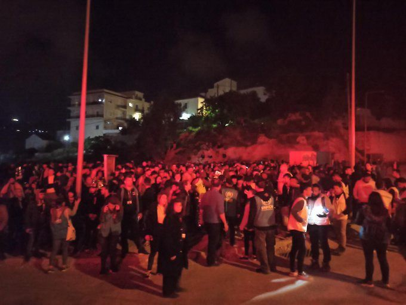

### AYS Weekend Digest 25–26/4/2020 — Fires at Vathi, Samos

Libya: left in a warzone without water / Italy: protests in CPRs / BiH: Updates on government mass deportation plan

 \)](assets/4e61e8457b1f/1*mwSn8cVuD2N25J-sOCOe3Q.jpeg)

Vathi, Samos \(photo by [Pfützen hüpfen](https://twitter.com/PHupfen) \)
#### Featured: FIRES AT VATHI, SAMOS

Many reports confirm that at least two separate fires broke out within Vathi camp on Samos on Sunday evening and one more this morning \(Monday\) \.

[As Samos Volunteers report](https://www.facebook.com/samosvolunteers/posts/1555226127988875) , the first fire, which started around 7pm, “was located in the area directly behind the medical facilities at the lower end of the unofficial jungle, which function as temporary shelters for potential Corona patients\. An unknown number of tents were burnt before the local fire brigade managed to control and finally extinguish the fire\.”

■■■■■■■■■■■■■■ 
> **[Europe Must Act](https://twitter.com/EuropeMustAct) @ Twitter Says:** 

> > UPDATE: VISUALS FROM VATHY CAMP (2/2)

This vid was taken by our team on the ground in #Samos. It shows the extent of damage from the 1st fire & we can see that all tents/containers in this area are decimated.

🗣 #DecongestTheAegeanIslands https://t.co/GM1PaOrvHZ 

> **Tweeted at [2020-04-26 20:55:02](https://twitter.com/europemustact/status/1254514347164012544).** 

■■■■■■■■■■■■■■ 

After that, it seems that there were other repeated fires at 8pm and 10pm\. A fire “reached the centre of the official camp\. Several containers have caught fire\. Besides housing most of the camp’s facilities, including the asylum service, the containers provide shelter for many camp residents, who share a container with as many as sixty people”\.

As MSF report, at least 100 people are left without shelter:

■■■■■■■■■■■■■■ 
> **[MSF Sea](https://twitter.com/MSF_Sea) @ Twitter Says:** 

> > A fire broke out in #Vathy camp, #Samos an hour ago leaving around 100 people without shelter. MSF teams are close to the camp & ready to offer medical care & psychological support to those affected by the fire. We cannot confirm any information regarding the cause of the fire. https://t.co/oVQKS0eEyD 

> **Tweeted at [2020-04-26 17:19:46](https://twitter.com/msf_sea/status/1254460173957111808).** 

■■■■■■■■■■■■■■ 

Throughout the night, evacuation operations have been going on\. It is not yet clear the extent of the damage\. Most people left the camp and gathered on a empty plot of land\. While solidarians and organisations on the ground tried to assist residents providing shelter, tents, medical assistance, food and water, fights and [moments of tensions broke out](https://twitter.com/MSF_Sea/status/1254686785659158528) and [riot police entered the camp multiple times](https://www.facebook.com/samosvolunteers/posts/1555226127988875) \. In the night police stopped any kind of assistance or distribution\.

Evacuation at Vathi \(Samos\) — Photo by AYS

A new fire broke out this morning\.

Despite the fires, we have confirmed reports that police continue to stop every kind of distribution, and are not letting anybody get into town\.

■■■■■■■■■■■■■■ 
> **[Arghawan Farsi - ارغوان](https://twitter.com/ArghawanF) @ Twitter Says:** 

> > A huge fire in the middle of the #Refugeecamp on the greek island of #Samos broke out yesterday night. The camp which was initially made for 800 people, is hosting more than 8 thousand refugees now. Its time for the #EuropeanUnion to finally act and support those who seek help!! https://t.co/OoWJKrFvM2 

> **Tweeted at [2020-04-27 12:02:37](https://twitter.com/arghawanf/status/1254742747552120833).** 

■■■■■■■■■■■■■■ 

Around 700 people are being held in a bit of empty land in front of the camp, without adequate access to food or water, women and children included\.

This fire followed the ones in Moria \(Lesvos\) and Vial \(Chios\) in the last weeks\. [As of April 23](https://infocrisis.gov.gr/8656/apotyposi-tis-ethnikis-ikonas-katastasis-gia-to-prosfygiko-metanasteftiko-zitima-tin-23-4-2020/) , 6869 people were recorded living in Vathi camp, with a capacity of 648 people\. The population density is the highest in the centre of the camp, where the fire burned most intense\.

These fires are nothing other than the natural consequence of Greek and European policies: keeping people crammed in overcrowded spaces, using the fear of the pandemic to implement widespread detention for all people on the move, stripping them even more of their basic rights, and barring them from participating in society\.

LIBYA

**Left in a war zone without water**

Approximately 460 people are being held under the COVID\-19 curfew in Zitan detention centre and their water is running out\.

■■■■■■■■■■■■■■ 
> **[Andrea Gagne](https://twitter.com/AndreaGagne) @ Twitter Says:** 

> > In the Zintan detention center in Libya, the water is drying up. Because of the ongoing war, combined with the new coronavirus curfews, fewer water trucks are coming and now the tap only runs for 10 minutes a day. The water that comes out of the tap is salty and hard to drink. https://t.co/pqt4URf2bT 

> **Tweeted at [2020-04-25 17:56:09](https://twitter.com/andreagagne/status/1254106941833576449).** 

■■■■■■■■■■■■■■ 

SEA

**49 people rescued off the Canary Islands**

[Local media reported](https://www.cope.es/emisoras/canarias/las-palmas/gran-canaria/noticias/migrantes-una-patera-arguineguin-20200426_695784?fbclid=IwAR2KaAQi-B8T7vaJaeUUS3iviOcUqNLmLzQXw-M2tzwSgztLOnlKqGcwa8g) that a boat with 49 people was saved off the coast of the Canary Islands over the weekend and arrived on the morning of the 26th to the Arguineguín dock, Gran Canaria\. Having had health checks it is believed all people onboard are in good health\.

**Sea arrivals increased from 2019**

■■■■■■■■■■■■■■ 
> **[Refugee Rescue](https://twitter.com/_refugeerescue) @ Twitter Says:** 

> > IOM reports that 16,724 migrants and #refugees have entered Europe by sea through almost four months of 2020, a 16 per cent increase from the 14,381 arriving during the same period last year. Nearly half of all arrivals have been to #Greece, this year’s busiest destination. 

> **Tweeted at [2020-04-26 12:28:32](https://twitter.com/refugeerescueuk/status/1254386879140691969).** 

■■■■■■■■■■■■■■ 

GREECE
#### **LESVOS: Updates from Moria**

In Moria, the situation is not getting any better\. After the halt to the plan to transfer the most vulnerable residents to empty hotels, no other solution has been proposed to decongest the camp\. 18293 is the official population \(as of April 23rd\) \. [Food lines take hours](https://www.facebook.com/sk.aldeen.3/videos/1672879552870534/) , at least 1000 people don’t get food because there is not enough\. There is also not enough water\.

With the limitations of movement outside the camp and the racist policies of supermarkets around Moria which are now prohibiting camp residents from going in, people can only shop in the one supermarket inside the camp, with waiting times of up to three days:

■■■■■■■■■■■■■■ 
> **[Mare Liberum e.V.](https://twitter.com/teammareliberum) @ Twitter Says:** 

> > Residents of #Moria can only shop in one supermarket inside the camp. The result? Waiting time to finally get the chance to go inside can be up three days! 

We were on site and talked to people about the situation.

#ShutDownAllCamps
#NotMyEU 
#ActNow https://t.co/SVvkO4WxZK 

> **Tweeted at [2020-04-26 11:11:45](https://twitter.com/teammareliberum/status/1254367557685051393).** 

■■■■■■■■■■■■■■ 

Team Humanity is crowdfunding to distribute 3,500 food packs\. They are doing food distribution for those who cannot stay in the food lines\. Support hem [HERE](https://gogetfunding.com/food-for-moria-refugee-camp) \.

Residents are doing what they can to improve the situation, [the Moria Corona Awareness Team are starting to recycle water bottles to reduce the amount of waste in the camp\.](https://www.facebook.com/MoriaCoronaAwarenessTeam/posts/130254348603744)

■■■■■■■■■■■■■■ 
> **[Mortaza](https://twitter.com/mortazabehboudi) @ Twitter Says:** 

> > Des rats, des poubelles partout... plus de 19 000 réfugiés passent le confinement et le #Ramadan sans eau, sans produits hygiène et parfois sans l’électricité dans ce camp surpeuplé de #Moria. https://t.co/pOdPFUpYYA 

> **Tweeted at [2020-04-25 13:55:40](https://twitter.com/mortazabehboudi/status/1254046422439264256).** 

■■■■■■■■■■■■■■ 

#### KOS: ATM installed inside the camp

■■■■■■■■■■■■■■ 
> **[Katy Fallon](https://twitter.com/katymfallon) @ Twitter Says:** 

> > Photo from Kos of the new Alpha Bank ATM installed, with a message from a friend who lives there “it shows the lockdown for refugees will not end soon.” https://t.co/vK9u7OQLw2 

> **Tweeted at [2020-04-25 15:26:23](https://twitter.com/katymfallon/status/1254069250433658880).** 

■■■■■■■■■■■■■■ 

#### MAINLAND: Suicide in police detention

A young man, who was detained in Komotini police station \(Northeastern Greece\) hanged himself over the weekend\. He had been reportedly sentenced to several years in prison for people smuggling\. According to the [report](https://www.coe.int/en/web/cpt/-/council-of-europe-anti-torture-committee-publishes-report-on-gree-3) authored by the European Committee for the Prevention of Torture and Inhuman or Degrading Treatment or Punishment \(CPT\) on conditions of detention in Greece: “ [ill\-treatment by the police\. \. against foreign nationals\. \. remains a frequent practice](https://twitter.com/VassilisTsarnas/status/1254493150653091842) ”\. Around 6,000 people on the move, including minors, are under arrest in the country\.
#### Updates from Thessaloniki

Medical Volunteers International published an update on their work with homeless people in the northern city in these times of coronavirus:

#### From the Mothers of Malakasa

There are reports of frequent water cuts in [\#Malakasa](https://twitter.com/hashtag/Malakasa?src=hashtag_click) camp \(in Attica\), which worsen the conditions during quarantine\. Refugees report additional sanitary infrastructure for the more than 400 newcomers living in tents was installed but has not yet been connected\.

> “How should we wash our hands without water,” a mother asks\. 

Read the call for help from mothers in the quarantined Malakasa refugee camp [HERE](https://www.facebook.com/notes/noborders/%CE%B3%CF%81%CE%AC%CE%BC%CE%BC%CE%B1-%CE%AD%CE%BA%CE%BA%CE%BB%CE%B7%CF%83%CE%B7-%CE%B1%CF%80%CF%8C-%CE%BC%CE%B7%CF%84%CE%AD%CF%81%CE%B5%CF%82-%CF%80%CF%81%CE%BF%CF%83%CF%86%CF%8D%CE%B3%CF%89%CE%BD-%CF%83%CF%84%CE%B7-%CE%BC%CE%B1%CE%BB%CE%B1%CE%BA%CE%AC%CF%83%CE%B1-call-for-help-from-mothers-in-/2950018488399357/?hc_location=ufi) \.
#### White Cards and residence permits extended for 4 months

Mobile Info Team posted an update confirming that all white cards and residence permits while asylum offices are closed \(from March 13th until May 15th, for now\) are extended for 4 months from the expiration date\.

> We are still waiting to hear further clarifications from the Asylum Service on how this decision will be implemented and how all the registration and interview appointments that couldn’t happen because of the closure will be rescheduled\. We will inform you as soon as this announcement is out\. 

> As we received a lot of questions about this topic, we would also like to let you know that at the moment you cannot give fingerprints for a residence permit or a travel document\. The foreigners police, which is responsible for that, will not be open to the public until at least the 15th of May\. 

Read the full post in Arabic, Farsi, French, Urdu and English [HERE](https://www.facebook.com/mobileinfoteam/posts/2737466943148684) \.

MALTA

Further updates on Malta’s involvement with illegal push backs at sea and resulting deaths\.

> SAR operation with 7 \( \+5\) dead people & return of 51 survivors to Libya \(not a place of safety\), all done by a private “ghost boat” under the coordination of a EU MS \+ another EU country involved \+ Frontex \+ another cargo ship\. Where is the EU Commission? — _@TihomirSabchev_ 

■■■■■■■■■■■■■■ 
> **[Tihomir Sabchev](https://twitter.com/TihomirSabchev) @ Twitter Says:** 

> > In addition, according to IT media, two weeks ago Malta also lobbied the EU to support financially Libya with additional 100 million EUR and to recognize the Libyan ports as "place of safety" 
[avvenire.it/amp/attualita/…](https://www.avvenire.it/amp/attualita/pagine/lettera-di-malta-riconoscere-libia-porto-sicuro?__twitter_impression=true&fbclid=IwAR3nHmeOBaVaiQdehJslURfNppulVchcfm5cXZFxhWqkiYbWbTPpoF6JHMY) 

> **Tweeted at [2020-04-26 19:06:43](https://twitter.com/tihomirsabchev/status/1254487088164220931).** 

■■■■■■■■■■■■■■ 

ITALY
#### 56 people arrive in Lampedusa

News from the Med report that on Saturday night a group of 56 people landed on Lampedusa\. They were spotted one mile off the island coast, and were caught up by a coastguard patrol boat and by one of the Guardia di Finanza and then escorted to the Favaloro pier, where they were immediately subjected to the first health checks, both routine and anti\-coronavirus checks\. The boat is believed to have taken off from Tunisia\. Sixteen of the people on board are women, another four are minor, three of them are unaccompanied\.

They are expected to be moved to Sicily during the course of the day as the hotspot in Imbriacola district already houses another 116 people — twenty more than the expected capacity — who have arrived in recent weeks and are currently under quarantine\. The 56 will then be taken to the ferry that runs between Lampedusa and Porto Empedocle and then to a reception station in Sicily where they have to spend the quarantine\.
#### Around 26 people intercepted near Trieste\.

Local media [report](https://triestecafe.it/it/news/cronaca/grande-viabilita-rintraccio-mattutino-di-un-gruppetto-di-migranti-26-aprile-2020.html?fbclid=IwAR0MVT1VPLCU16pGWf4wDifH4_u6k35yeVyy_ZnyCP8vgphhykqkYVVlTCE) that two groups of people on the move \(one of 6, the other of around 20\) were located near Trieste by local residents, who called the police\. They were all taken to the temporary tent set up in Fernetti, Trieste\.
#### Protests in Ponte Galeria, Rome and in Gradisca D’Isonzo detention centres

LasciteCIEntrare published a [report](https://www.lasciatecientrare.it/il-25-aprile-nei-cpr) of the protest within the detention centre\. Despite appeals and denounces, no CPR has closed for Covid\-19\. In Ponte Galeria there are 30 detainees\. In Caltanissetta, which had to be shut down in the past months, there are 2\.

> On Friday, first day of Ramadan, a protest started due to the lack of food\. Police intervened immediately, beating two of the protestors\. One has to go back to the medical post of the CPR because of the pain caused by the beating\. 

> \[…\] 

> We demand the closure of all CPRs\. 

> We demand papers for everybody\. 

[L’Altra voce report](https://www.facebook.com/permalink.php?story_fbid=2946793162080297&id=1245970425495921&hc_location=ufi) on another revolt, which happened at the CPR in Gradisca d’Isonzo \(northeastern Italy\) \. Around 9 pm on Friday night the alarm sounded that made the police and the Fire Brigade arrive at the Centre\. Some of the detainees started a fire by setting mattresses alight\. Nobody was injured or intoxicated\.
Detainees protested about the conditions in which they have to live and to have information about the 4 people who tested positive to the new virus\.

BiH

[Local media has published](https://balkaninsight.com/2020/04/23/bosnia-compiles-list-of-illegal-migrants-due-for-deportation/?fbclid=IwAR0LxO-_7cLvPhCQf-9shqNOHoMRFm0W9RhWTNk3fCTAZ1_xe8SRj3FGBdM) a further update on the Bosnian Government’s aim to deport all people on the move\. They wish to compile a list of 9000–10,000 people to be deported and are once again framing this as a security crisis rather than a humanitarian one\. They have also made it clear that they are struggling to identify the people currently in Bosnian territory meaning that they can not have gone through a proper asylum process\. As we know, everybody has the right to claim asylum regardless of where they come from or the recognition rate of their country\.

Meanwhile, as usual it is local people and grass roots groups, not the government, who are actually supporting people on the move\.

GENERAL

Info migrants have published an overview of services currently open for people on the move across Europe\. Read it [HERE](https://www.infomigrants.net/en/post/23524/which-migrant-services-in-europe-are-suspended-or-reduced-due-to-covid-19?fbclid=IwAR2-uGMk-uey-mUT_oOSEcaDUgqWFQcyMqosVXUZDCCqmGQFY8-ynBwBKok) \.

**Find daily updates and special reports on our [Medium page](https://medium.com/are-you-syrious) \.**

**If you wish to contribute, either by writing a report or a story, or by joining the info gathering team, please let us know\.**

**We strive to echo correct news from the ground through collaboration and fairness\. Every effort has been made to credit organisations and individuals with regard to the supply of information, video, and photo material \(in cases where the source wanted to be accredited\) \. Please notify us regarding corrections\.**

**If there’s anything you want to share or comment, contact us through Facebook, Twitter or write to: areyousyrious@gmail\.com**

_Converted [Medium Post](https://medium.com/are-you-syrious/ays-weekend-digest-25-26-4-2020-fires-at-vathi-samos-4e61e8457b1f) by [ZMediumToMarkdown](https://github.com/ZhgChgLi/ZMediumToMarkdown)._
