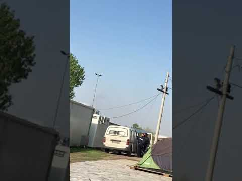
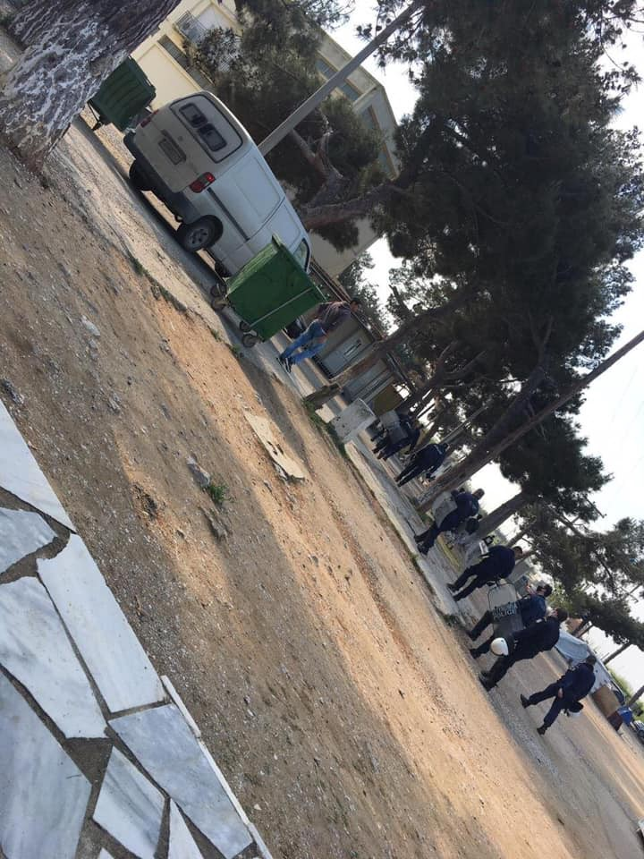
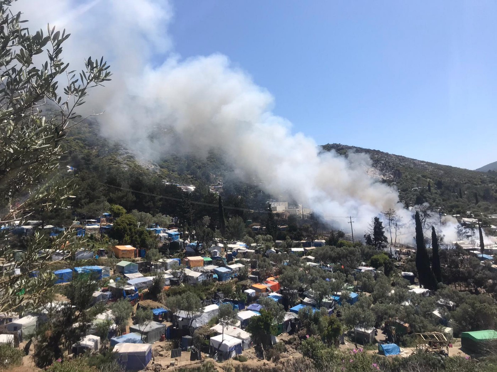

### AYS Daily Digest 28/04/20 Police raid in Diavata camp near Thessaloniki, fear of pushbacks to Turkey

_update on Samos fires // deportations in Sweden slowing // deadly shooting in Turkey under curfew // and more…_
#### FEATURE

### Camp residents from Diavata camp near Thessaloniki sent AYS footage of a police raid

They took over 30 people to an unknown location, after entering the camp in riot gear and forcing people into vans\. They targeted the people who were camping in tents and improvised shelters in the grounds of the centre\.

There is serious concern that new legislation for the Covid\-19 pandemic, as well as the recent asylum suspension, has resulted in an increase of people being removed from camps in Greece in April, and more pushbacks being conducted to Turkey\. It is expected that this is the probable fate for 30 people from Tuesday morning\.

Eye witnesses inside Diavata camp report the use of violence to arrest those 30 people\. Many others in the camp fled fearing capture and possible removal\. Volunteers spoke to one man who alleges his friend was taken and had still not heard from him\.

Photo by camp residents
#### TURKEY

In the southern city of Adana, [police shot and killed](https://english.alaraby.co.uk/english/news/2020/4/28/turkey-police-shoot-syrian-refugee-dead-during-coronavirus-curfew?fbclid=IwAR07wNRNeFp2FyI4d0E3DfrI5wqXZWJfnKKW6gH4bhVnWdUeVBpS7Dh8Quk) Ali El Hamdan \(aged between 17 to 19 years but still unconfirmed\) for breaking Covid\-19 curfew\. According to Turkish media:

> “Residents of Turkey under 20\-years\-old are currently prohibited from leaving their homes \(unless they have documentation with a job\) as part of ongoing restrictions on movement to prevent the spread of the novel coronavirus\. El Hamdan was on his way to work despite the curfew and ran away from police officers who asked him to stop as he was scared of receiving a fine he could not afford” 

This underscores the problem with refugees’ precarious situation, many of whom are working undocumented and informally in Turkey\. A situation that was already putting vulnerable people at risk has been made even more dangerous by the Covid\-19 pandemic and measures put in place to contain it\.
#### GREECE
### Update on fires in Samos

](assets/646b3958e029/1*YAQ3SpCE5nMGKnLDzIvm6w.jpeg)

Photos by [Europe Must Act](https://www.facebook.com/europemustact/posts/134097271536309?hc_location=ufi)

On Sunday, fires broke out in Samos’s Vathy camp\. Frances, a volunteer for Action for Education, documented what happened:

> “Tensions peaked at 6pm, it was then the **first fire** began to blaze\. After dark, a **second fire** started, it burned 6 containers\. The next morning a **third fire** began\. Estimations suggest 500 people lost everything, they now have no place to stay\. MSF went outside the camp to set up a medical first response with psychosocial support\. NGOs started distributing blankets before being stopped by police\. 

> The next day \(Monday\), police prevented camp residents from entering town\. Authorities continue to have limited communication with NGOs but tent distributions have been able to take place\. Displaced people have been left to sleep on the ‘football pitch’ outside the camp\. This is really just a gravel square\. There are rumours that people escaped to the beaches to sleep\. Tensions continue to be high in the camp, there are rumours that the ‘war’ is not over\. This ‘war’ refers to community in\-fighting as people struggle for supplies\. Limited resources result in a power imbalance that fuels tensions\. 

> The atmosphere has calmed now, but many camp residents still live in fear\. We have heard reports from NGOs that **minors in camp are pleading for shelter as they are worried they will be ‘mixed up in the war** ’…” 

In an update from Samos Volunteers, they say the causes of the fires are still unclear, but tensions between various communities living in the camp have risen due to overcrowding conditions on top of Covid\-19 fears\. More [here](https://www.facebook.com/samosvolunteers/posts/1556830701161751?hc_location=ufi) \.

](assets/646b3958e029/1*1ExoQ3KsbgDTZbEPAUTWeg.jpeg)

Photo by [Europe Must Act](https://www.facebook.com/europemustact/posts/134097271536309?hc_location=ufi)

Mission Lifeline has raised 55,000 euros in donations in order to fly 150 refugees currently in Lesvos to Germany\. Lifeline’s spokesperson Axel Steier said:

> “With this sum, one could finance two Boeing 747–300 flights and get around 150 people from the Moria refugee camp in Lesbos…The association has a total of 110,000 euros available for the planned construction of a civil airlift between Lesbos and Berlin\.” 

All they are waiting for is permission from the Interior Minister since negotiations with the Greek service provider have concluded well\. More [here](https://www.bild.de/regional/dresden/dresden-aktuell/seenotrettung-mission-lifeline-will-fluechtlinge-von-lesbos-holen-70319144.bild.html?fbclid=IwAR1wk2zf-SYBzNJgmuzhU_2XR5WcylLqspHAX8XVZwh3SoOd93fqWhoFT1M###wt_ref=android-app%3A%2F%2Fcom.google.android.googlequicksearchbox%2Fhttps%2Fwww.google.com&wt_t=1588072834705###wt_ref=https%3A%2F%2Fwww.facebook.com%2F&wt_t=1588118163629) \.

In an update from [Legal Centre Lesvos](https://www.facebook.com/LesvosLegal/posts/3130066510365374?hc_location=ufi) on the gunman’s trial who shot two people living in Moria last week:

> “At the gunman’s two pre\-trial hearings, yesterday and last Friday, tens of people — including known members of the far\-right, one of whom had been convicted in February 2020 for making online threats against a Lesvos Solidarity — Pikpa coordinator — stood outside the court to support him\. The police made no effort to disperse the group, despite Covid\-19 measures which prohibit leaving one’s house except for state\-sanctioned reasons such as for essential shopping, exercise, and doctor visits, and prohibit any public gatherings\. When journalists arrived to the scene and were harrassed by the gunman’s supporters, police instructed them — but not those insulting them — to leave for their own safety\. 

> At his pretrial hearing, the gunman, who admitted to having shot at the two migrants, was released from detention on pre\-trial bail and was charged with attempted premeditated murder\. Migrants who have been charged with lesser and non\-violent crimes — such as alleged stealing of sheep — have been ordered by the same court to wait in pre\-trial detention, which is sometimes up to a year of imprisonment, demonstrating the discriminatory use of pre\-trial detention to punish and further criminalize migrants\. 

> The authorities’ open tolerance of fascist violence in Lesvos and the discriminatory application of the law to target migrants — by the police, the municipal government, and the court — now means that members of the far\-right act with impunity, while migrants face punishment for the legitimate exercise of their rights\.” 

The Ministry meeting on Tuesday confirmed efforts to relax social distancing restrictions\. The plan will have three phrases from mid May to mid June and will be flexible according to the data they receive:

> “ → On May 4, small retail shops and hair salons will be allowed to open\. Also the SMS system for venturing outside the home will also be scrapped\. Next Monday will also see the lifting on the movement of people within their prefecture of residence, but not outside\. Churches will reopen for individuals to pray alone, and with strict rules for the maximum number of worshippers allowed inside the church at ant one time\. Services are still banned\.
 

>  →On May 11, senior high schoolers will be able to return to their classes and all retail stores will reopen and on May 17 churches will be allowed to resume services and sacraments, but will have to adhere to strict social distancing rules\.
 

>  →A further relaxation will come a week later on May 18, when schools will open for lower grades of high school\. On the same day, archaeological sites will open for visitors\. Malls, cafes and restaurants \(only with outside sitting\) will be back in business on June 1, following social distancing rules\. Mitsotakis noted that the progressive reopening will be reviewed every 24 hours by a panel of experts\.” 

For more information look [here](https://www.keeptalkinggreece.com/2020/04/28/greece-lifting-lockdown-roadmap/) \.
#### SWEDEN
### A man in the the Migration Board’s detention center in Märsta just died of Covid\-19\.

The man’s [infection](https://www.aftonbladet.se/nyheter/a/4qewQV/coronautbrott-pa-migrationsverkets-forvar--en-dod?fbclid=IwAR0jVDxCoTLI4LAdQOvW9Apiz6oPlwfAYnjbVtaZWpBOHp_M0fOni14cCUU) was confirmed on March 18th: he was 60 years old\. Other residents, who had just been [released](https://www.aftonbladet.se/nyheter/a/dO1ozO/slappt-fran-forvaret--sover-i-elrum?fbclid=IwAR3PKK5wLWbuP8_5oz0ZkKJKvL4ne8yCD8Ed1Gh4I6maiRzESXWoTE5P3e0) from the centre, report being very scared of a spread\. Many of them have no where to go and no access to food\. They were awaiting deportation, but now their fate is even more uncertain\. One man reported he was sleeping in an electrical room\.

The government has not been able [to deport](https://sverigesradio.se/sida/artikel.aspx?programid=mp%3B83&artikel=7459794&fbclid=IwAR1TV6iX_auie24zPXtdR2-h9ExbrBN4UiqHClrSEpCEKAQDvEdRDBjM7Bo) as many people as it aimed to, due to Covid\-19\. There has been a sharp decline in recent weeks compared to numbers last year\. Many countries have closed their borders, which makes it hard to enforce scheduled deportations and plan new ones\.

While this may be a small blessing from the shutdown, many refugees and migrants are [finding it harder to find work](https://www.svt.se/nyheter/inrikes/hade-tva-jobb-innan-corona-nu-riskerar-han-att-utvisas?fbclid=IwAR1KM2Yrn-3eJiBpAxCdHAAZc4wGHNLK8zxWMU17_QtwQdlWLIRZ_cLlzc8) during the pandemic, even having job offers cancelled\.

**Find daily updates and special reports on our [Medium page](https://medium.com/are-you-syrious) \.**

**If you wish to contribute, either by writing a report or a story, or by joining the info gathering team, please let us know\.**

**We strive to echo correct news from the ground through collaboration and fairness\. Every effort has been made to credit organisations and individuals with regard to the supply of information, video, and photo material \(in cases where the source wanted to be accredited\) \. Please notify us regarding corrections\.**

**If there’s anything you want to share or comment, contact us through Facebook, Twitter or write to: areyousyrious@gmail\.com**

_Converted [Medium Post](https://medium.com/are-you-syrious/ays-daily-digest-28-04-20-police-raid-in-diavata-camp-near-thessaloniki-fear-of-pushbacks-to-646b3958e029) by [ZMediumToMarkdown](https://github.com/ZhgChgLi/ZMediumToMarkdown)._
