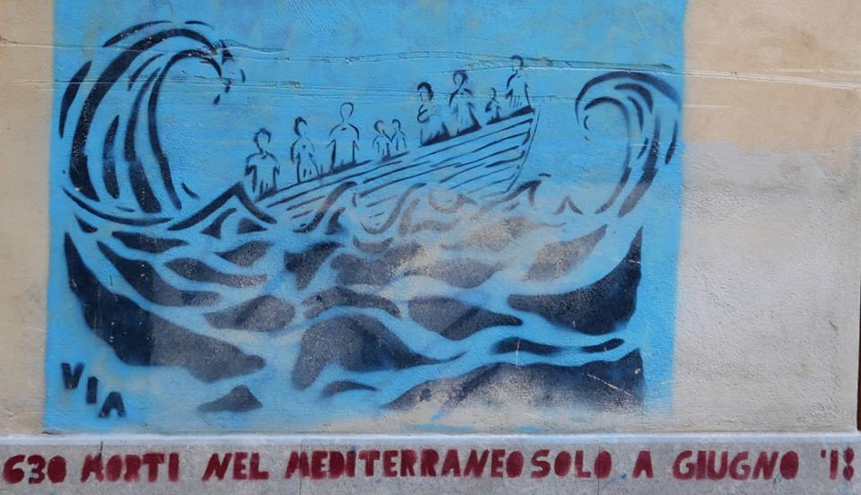

### AYS Daily Digest 01/05/2020: Malta’s government has been involved in the push\-backs on Easter Weekend
### 57 rescued persons will stay on a ship off the coast of Malta until EU can rehouse them // Refugees intercepted at sea have been brought back to Libyan detention centre // NGOs submitted a complaint against EU for ignoring budget laws when funding the Libyan Coast Guard // UNHCR calls for stop of returns to Libya and solidarity in EU with border states // Support website for foreigners launched in Tunisia // Legal report from RSA on administrative treatment of people who arrived in Greece after March 2nd // More news from Greece, Spain and France

[Are You Syrious?](@AreYouSyrious?source=post_page-----e82a24c83c18----------------------)

[May 2](ays-daily-digest-01-05-2020-maltas-government-has-been-involved-in-the-push-backs-on-easter-e82a24c83c18?source=post_page-----e82a24c83c18----------------------) · 9 min read

### FEATURE: Malta’s Prime Minister admits involvement in pushbacks to Libya, but claims it was a rescue mission

Malta says it will keep 57 migrants on a ship anchored at sea, 30 nautical miles \(55 kilometers\) off the cost of Malta, until the EU can rehouse them\. The 57 migrants were picked up at sea earlier this week inside Malta’s search and rescue zone by a commercial fishing boat chartered by the Maltese government to pick up asylum seekers\. The men were then moved to a vessel that is normally used for tourist harbor cruises\. Prime minister Rober Abela said the EU had agreed to cover the cost of the operation until a decision had been reached as to where the individuals should go\. Malta is standing firm in its declaration to keep ports closed\.

> _“We closed our ports and airport to cruise passengers and tourists and it does not make sense to then let migrants in,”_ 

he said, referring to measures in place since March intended to halt the spread of the coronavirus\.

This occurred on the same day the Prime Minister admitted that a second group of asylum seekers had been returned to Libya, potentially breaking international law\.

Also on Friday, Prime Minister Robert Abela admitted commissioning a boat that returned migrants to war\-torn Libya over Easter weekend, but insisted it was a “rescue mission” and not an illegal pushback — a crime under international law\. In yesterday’s digest we already reported that the Maltese government official Neville Gafa admitted that he had coordinated the push\-backs on the Easter Weekend, on orders of the Office of the Prime Minister\.

The Prime Minister now declared:

> _“There was a rescue of migrants\. Had the Maltese government not coordinated, tens of lives would have died, because a \[EU coastguard\] Frontex plane just flew overhead and kept on going\.”_ 

Abela defended using a private boat, saying that the Search and Rescue Convention stipulates the legal obligations of individual states, which are not obliged to carry out the actual rescues but to coordinate such rescues\. He added that the migration problem should not be “Malta’s alone” and called for the EU to intervene\.

For more information, see:
### [Abela admits coordinating private boats that returned migrants to Libya](https://timesofmalta.com/articles/view/abela-admits-coordinating-private-boats-that-returned-migrants-to.789362?fbclid=IwAR30gOx42dlHcLYJ9N0tPgfye3E7Zn06GnIQXAX6E0jAPHX0R0ZgjFKdf7I)
### [Prime Minister Robert Abela has admitted commissioning a boat that returned migrants to war\-torn Libya on Easter…](https://timesofmalta.com/articles/view/abela-admits-coordinating-private-boats-that-returned-migrants-to.789362?fbclid=IwAR30gOx42dlHcLYJ9N0tPgfye3E7Zn06GnIQXAX6E0jAPHX0R0ZgjFKdf7I)
#### [timesofmalta\.com](https://timesofmalta.com/articles/view/abela-admits-coordinating-private-boats-that-returned-migrants-to.789362?fbclid=IwAR30gOx42dlHcLYJ9N0tPgfye3E7Zn06GnIQXAX6E0jAPHX0R0ZgjFKdf7I)
### LIBYA

On the morning of the first of May, three groups of people were caught at sea and returned to Libya by the Libyan Coast Guard and taken to the Zawiyah detention centre, as IOM and Human Rights Activists reported\. The centre has been infamous for torture, human smuggling and inhuman treatment in the last years\. Apparently some people managed to flee\. IOM staff apparently went to the centre to provide the people with emergency support\.

The Global Legal Action Network \(GLAN\) together with Italian partner NGOs submitted a complaint to the European Court of Auditors in which they demonstrate that EU’s financial support enables Libyan authorities to commit violations of international refugee law\. 
GLAN explains its action:

> _“We now seek to break new legal ground, by linking the EU’s financial policy and ongoing funding programmes to its human rights obligations\. The European Court of Auditors has previously pronounced upon the risk in such funding programmes\. Rather than being mitigated, the risks have been realized\. It is high time to suspend the relevant funding programme\.”_ 

In question is a programme in which the EU has supported the Italian and Libyan authorities with 90 million Euros since 2017\. The money is meant to be used for border control projects like the Libyan Coast Guard, which is involved in illegal interceptions and returns of refugees in the Mediterranean Sea\.

The complaint focuses on the point that the money for the ‘Integrated Border Management programme’ \(IBM\), from which the Libyan Coast Guard’s activities are financed, comes from the European Trust Fund for Africa and thus, in turn, from development funds\. To use this money not for development projects but for projects for illegal push backs is, according to the opinion of different EU budget and development law experts, a breach of the EU’s own budget laws and external actions obligations, including the EU Charter of Fundamental Rights\.

The complaint is an interesting and promising approach to hold the EU accountable for the crimes that are committed by the Libyan Coast Guard and financed by EU tax payers\.

For more information see here:
### [EU Financial Complicity in Libyan Migrant Abuses](https://www.glanlaw.org/eu-complicity-in-libyan-abuses)
### [EU Financial Complicity in LibyaN migrant abuses GLAN has previously sought judicial remedies against such policies in…](https://www.glanlaw.org/eu-complicity-in-libyan-abuses)
#### [www\.glanlaw\.org](https://www.glanlaw.org/eu-complicity-in-libyan-abuses)

UNHCR is once again calling for greater coordination, solidarity and responsibility\-sharing in regard to the situation of refugees in the Mediterranean Sea\.

With regard to the inhuman situation that people are facing in Libya, UNHCR reiterates that:

> _“no one should be returned to Libya after being rescued at sea\.”_ 

UNHCR is therefore urging “stronger intra\-EU solidarity with the EU Mediterranean coastal States receiving refugees and migrants and calling for other Member States to show greater responsibility\-sharing in the form of relocation support\.”
For the full news comment, see here:
### [News comment on search and rescue in the Central Mediterranean by Gillian Triggs, Assistant High…](https://www.unhcr.org/news/press/2020/5/5eac53214/news-comment-search-rescue-central-mediterranean-gillian-triggs-assistant.html?fbclid=IwAR2nm28eqXza84iOC3phhVhU3PPC11_wcHgEr836rNCCG2GgJZa65DDfMPI)
### [01 May 2020 \| Español \| عربي UNHCR, the UN Refugee Agency, is calling for greater coordination, solidarity and…](https://www.unhcr.org/news/press/2020/5/5eac53214/news-comment-search-rescue-central-mediterranean-gillian-triggs-assistant.html?fbclid=IwAR2nm28eqXza84iOC3phhVhU3PPC11_wcHgEr836rNCCG2GgJZa65DDfMPI)
#### [www\.unhcr\.org](https://www.unhcr.org/news/press/2020/5/5eac53214/news-comment-search-rescue-central-mediterranean-gillian-triggs-assistant.html?fbclid=IwAR2nm28eqXza84iOC3phhVhU3PPC11_wcHgEr836rNCCG2GgJZa65DDfMPI)

As fighting in Libya intensified in recent weeks, the country reported its first cases of coronavirus at the end of March\. The Libyan people are being forced to choose between flight and confinement\. For migrants trapped in this desperate situation, life has never been so difficult\. Migrants face a difficult choice: stay where they are and risk being hit during a bombing raid or move and risk being infected with coronavirus\. In Tripoli and its surroundings, migrants and the Libyan population find themselves with few options\. Against this backdrop, GNA Health Minister Ehmaid Bin Omar announced on March 24 that the first confirmed case of COVID\-19 had been detected\.

Here you can find a feature by infoMigrants on the current situation for refugees in Libya:
### [Migrants in Libya trapped between war and coronavirus](https://www.infomigrants.net/en/post/24440/migrants-in-libya-trapped-between-war-and-coronavirus?ref=tw&fbclid=IwAR1YZuGOsK78Ua_vVBSE-GVyfctIWNfqcCIl-nvVSSUwbk0IQET-ijMJyEg)
### [As fighting in Libya intensified in recent weeks, the country reported its first cases of coronavirus\. The Libyan…](https://www.infomigrants.net/en/post/24440/migrants-in-libya-trapped-between-war-and-coronavirus?ref=tw&fbclid=IwAR1YZuGOsK78Ua_vVBSE-GVyfctIWNfqcCIl-nvVSSUwbk0IQET-ijMJyEg)
#### [www\.infomigrants\.net](https://www.infomigrants.net/en/post/24440/migrants-in-libya-trapped-between-war-and-coronavirus?ref=tw&fbclid=IwAR1YZuGOsK78Ua_vVBSE-GVyfctIWNfqcCIl-nvVSSUwbk0IQET-ijMJyEg)
### TUNISIA

In Tunisia, a website has been launched by the government that provides information for foreigners stranded in Tunisia due to Corona travel restrictions\. The site especially addresses students, migrants and asylum seekers and offers, inter alia, information on how to send a request to receive assistance\.

See here:
### [Accueil](http://www.aide-covid19.tn/index.php?id=86)
### [Skip to main content République Tunisienne Présidence du Gouvernement Services des Droits de l’homme, de relation avec…](http://www.aide-covid19.tn/index.php?id=86)
#### [www\.aide\-covid19\.tn](http://www.aide-covid19.tn/index.php?id=86)
### GREECE

On 2 March 2020, the Greek government adopted an emergency legislative decree stripping persons arriving undocumented in the country of the right to seek asylum during that month\. Recently, the NGO Refugee Support Aegean \(RSA\) has produced a report on the situation for refugees in Greece and what they experienced in March 2020\. As a result of the Decree, individuals who entered Greece with the aim of seeking international protection in March 2020 were automatically and indiscriminately detained for the purpose of return and were denied access to the asylum procedure and a series of rights provided by national, European and international legislation\. According to UNHCR statistics, 2,927 persons entered Greece via land and sea in the course of that month\. These persons were automatically and arbitrarily placed in detention under abhorrent conditions and continue to remain in closed facilities without effective judicial protection, despite ultimately being allowed to express the intention to lodge an asylum application with the Asylum Service\. In Refugee Support Aegean \(RSA\) Legal Report examines the administrative treatment and policy of detention applied to persons falling within the scope of the Decree, the conditions in which they have been detained and the response adopted thus far from the different fora approached by individuals in search of judicial redress at domestic and European level\. Read More [Here](https://rsaegean.org/wp-content/uploads/2020/05/RSA_LN_AsylumSuspension.pdf) \.

On Friday, at least 50 asylum seekers were moved by the police from Diavata refugee camp in Thessaloniki on April 27\. Their tents were destroyed\. Some of them had already been in Greece for 10 months\. All the asylum seekers are afraid of secret pushbacks to Turkey\.

A total of 60 new containers have been sent to Greece from Austria\. They are bound mainly to the eastern Aegean Islands, especially Samos, were fires destroyed tents and containers earlier in the week\. The containers are meant for housing and sanitary purposes\. Another 120 are supposed to arrive within the next week\.

According to Refugee Support Aegean new sanitary containers arrived in Malakasa camp, but according to the residents they are still locked and cannot be used yet\.

A video has been published by Mare Liberum in which two women speak about their experiences and the dangers they are exposed to every day in Moria camp\.

The Corona Awareness Team in Moria has set up a system to reduce the amount of plastic bottle waste in the camp\. For every six empty bottles one person returns she will get one full bottle\. By this, the team hopes to reduce the amount of waste in the camp, provide more drinking water and support the environment\.

Solidarity Now and UNHCR produced a short audio piece together in which they explain the measures to gradually ease the Corona lockdown restrictions\. The audio is available in 6 languages\.
### [State Measures for COVID\-19 \(audio in 6 languages\) — Solidarity Now](https://www.solidaritynow.org/en/unhcr_audio/?fbclid=IwAR3P3thDMrPfz05iOccFyyIsOPfp_QtDldIP8ydq1yL0pBHUgIN4IqCqtYg)
### [The following message is brought to you by UNHCR and Solidarity Now\. On April 28th the Greek state announced the…](https://www.solidaritynow.org/en/unhcr_audio/?fbclid=IwAR3P3thDMrPfz05iOccFyyIsOPfp_QtDldIP8ydq1yL0pBHUgIN4IqCqtYg)
#### [www\.solidaritynow\.org](https://www.solidaritynow.org/en/unhcr_audio/?fbclid=IwAR3P3thDMrPfz05iOccFyyIsOPfp_QtDldIP8ydq1yL0pBHUgIN4IqCqtYg)
### CROATIA

Croatian Police once again attacked people on the move on Friday in the BiH border town Velika Kladusa\. This is the testimony of one of those attacked:

> _“The police intercepted our group\. After being seized from our phones and personal belongings, a member of the group, who was taller than the others, was ordered to sit down\. They thought he was the leader of the group\. One officer called another, who soon brought the police\. The police dog was given the command to attack the sitting man\. A friend was roaring with pain and fear\. We stood motionless\. One cop was recording the video and laughing loudly like the others\. After that we had to take all our clothes off\. We went barefoot without our clothes back to Bosnia and there was a car in Bosnia that read SOS Bihac and they gave us clothes\._ 
 

> _I will always ask myself, why are they doing this to us? “_ 

### SPAIN

The situation of field workers in the southern Spanish regions Almeria and Huelva are getting increasingly worse through the enforcement of the lockdown measures\. Most of these workers are undocumented migrants who live in shelters without running water\. Adhering to minimum hygienic principles is almost impossible under these circumstances\. Additionally, no health security procedures have been implemented by their employers\. The region plays a key role in the European food supply market\.

For a longer article in the Guardian, see here\.
### [‘No food, water, masks or gloves’: migrant farm workers in Spain at crisis point](https://www.theguardian.com/global-development/2020/may/01/no-food-water-masks-or-gloves-migrant-farm-workers-in-spain-at-crisis-point?fbclid=IwAR0Urm1nRJuh_dHTl2tCBnJb4mwgCs80OhWVe6oNlo4N3KFlLJfj2aq6D1g)
### [Migrant workers on Spanish farms that provide fruit and vegetables for UK supermarkets are trapped in dire conditions…](https://www.theguardian.com/global-development/2020/may/01/no-food-water-masks-or-gloves-migrant-farm-workers-in-spain-at-crisis-point?fbclid=IwAR0Urm1nRJuh_dHTl2tCBnJb4mwgCs80OhWVe6oNlo4N3KFlLJfj2aq6D1g)
#### [www\.theguardian\.com](https://www.theguardian.com/global-development/2020/may/01/no-food-water-masks-or-gloves-migrant-farm-workers-in-spain-at-crisis-point?fbclid=IwAR0Urm1nRJuh_dHTl2tCBnJb4mwgCs80OhWVe6oNlo4N3KFlLJfj2aq6D1g)
### FRANCE

BBC has covered a story about Hossein Ahmadi, an Iraninan refugee, who came to the UK illegally to seek asylum\. Now, with a removal order, he must return to the Calais Jungle, which was previously his home for nearly a year\. [Read More here](https://www.bbc.co.uk/programmes/m000h1lt?fbclid=IwAR2vVsRuLRJJwDqqcA8zVzvK-0dck8WG9kUGiQl14tqf9wfA6kCrCWqNpEk) \.

Care4Calais desperately needs donations to keep their team running and distributing clothing and vital food supplies\.

**Find daily updates and special reports on our [Medium page](https://medium.com/are-you-syrious) \.**

**If you wish to contribute, either by writing a report or a story, or by joining the info gathering team, please let us know\.**

**We strive to echo correct news from the ground through collaboration and fairness\. Every effort has been made to credit organisations and individuals with regard to the supply of information, video, and photo material \(in cases where the source wanted to be accredited\) \. Please notify us regarding corrections\.**

**If there’s anything you want to share or comment, contact us through Facebook, Twitter or write to: areyousyrious@gmail\.com**

_Converted [Medium Post](https://medium.com/are-you-syrious/ays-daily-digest-01-05-2020-maltas-government-has-been-involved-in-the-push-backs-on-easter-cbb267099401) by [ZMediumToMarkdown](https://github.com/ZhgChgLi/ZMediumToMarkdown)._
