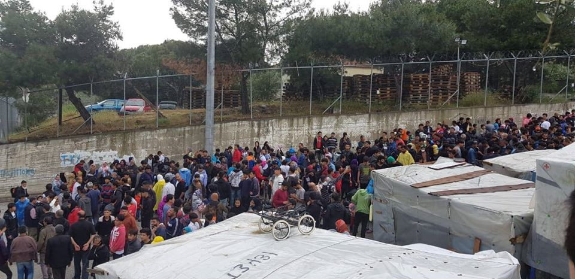
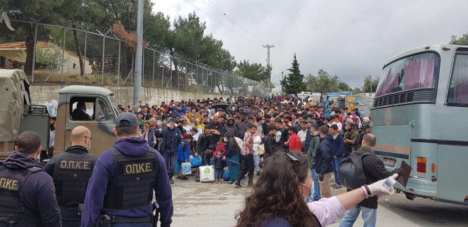
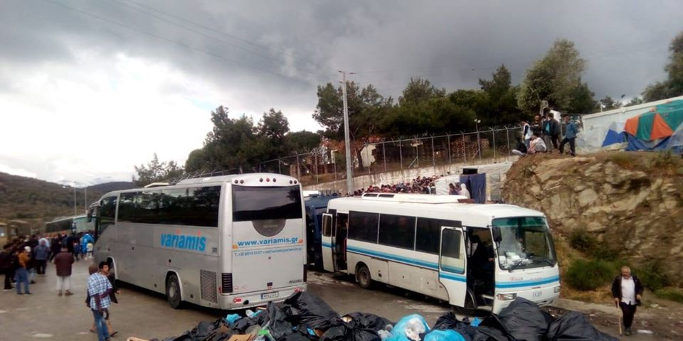

### AYS Weekend Digest 2–3/5/2020–392 people evacuated from Moria, but where to?

Deportations to NIGER carry on despite border closures / Afghan workers found drowned on the river at the border with IRAN / Updates from local activists in FRANCE and SWITZERLAND / Rescues and arrivals in the Mediterranean / Rising violence again on LESVOS?

 \)](assets/af35c3ba5383/1*Je5zT1lFYZgqJP1plTR6aQ.jpeg)

In total 120,000 refugees reside in Greece at the moment\. Many remain trapped in closed structures within highly re\-traumatizing & understaffed structures such as Vathi, Moria or Malakasa \(Photo and text by [Franziska Grillmeier](https://twitter.com/f_grillmeier/status/1255198361533190144) \)

_In the last few months AYS have teamed up with Eric Maddox from Latitude Adjustment Podcast\. As a result a four part podcast series on the refugee crisis was produced, featuring interviews and analysis on the situation on both the islands and the mainland\._

_The final episode is now out\! Please listen to it\._

_And if you’ve missed the past episodes, find them on [LAP’s website](https://www.latitudeadjustmentpod.com/) \._
#### FEATURED: 392 people on their way from Moria to the mainland

On Sunday, while migration and asylum minister Mitarakis visited Moria camp on the island of Lesvos, 392 people were [bussed](https://twitter.com/f_grillmeier/status/1256912049323507712) from Moria to the port of Mytilini\.

Queueing for transfers to mainland, Moria, Lesvos 3/5/2020 \(Photo by MCAT: Amani Hussaini/Atawallah Mostafawi\)

As confirmed by several sources, they had all a ticket to Athens but it is still not clear where they will be taken on the mainland\. They reached Pireaus port in Attica, on [two](https://twitter.com/amna_newseng/status/1257201169883115525) different [ferries](https://twitter.com/amna_newseng/status/1257237862900289536) this morning\.

Queueing for transfers to the mainland, Moria, Lesvos 3/5/2020 \(Photo by MCAT: Amani Hussaini/Atawallah Mostafawi\)

While the evacuation of the Greek eastern islands has to carry on, transfers to mainland camps are not the solution, especially if these are closed structures, where ‘residents’ find themselves even more cut off from the rest of society\.

NIGER
#### Deportation from Libya and Algeria carries on despite border closures

> As [reported](https://alarmephonesahara.info/en/news/migrants-and-refugees-deported-to-niger-despite-corona-crisis-and-stranded-in-iom-camps-protests-sparked-by-unbearable-conditions?fbclid=IwAR3ZAMhPM4MtRvIfjhWoMin0Nk5-ULOcOzrWT8Q4yHZIt-ydE86e2BgSScA) by Alarm Phone Sahara, with the Covid\-19 pandemic, “many borders between African countries have been closed for travellers, including Algeria’s and Libya’s borders with Niger\. The crisis threatens not only the health, but also the livelihoods of many people who are already living in precarious conditions\.”

> At the same time, Algeria and Libya are maintaining their policy of deportation, at least partially, despite the Corona crisis and thousands of migrants and refugees are currently stranded in transit countries such as Niger in unbearable conditions\. 

> According to a report by journalist Sofian Philip Nacer, about a hundred people were deported from eastern Libya to Sudan at the end of March\. In the first half of April, the Libyan authorities in the east of the country sent at least 236 people back to Sudan, Mali, Somalia, Nigeria and Ghana\. 

> Pushbacks and deportations from Algeria to Niger also continued despite the closure of the border between the two countries\. Nigeria, for its part, is also pushing back citizens of Niger who were living on its territory\. 

Read the full report [HERE](https://alarmephonesahara.info/en/news/migrants-and-refugees-deported-to-niger-despite-corona-crisis-and-stranded-in-iom-camps-protests-sparked-by-unbearable-conditions?fbclid=IwAR3ZAMhPM4MtRvIfjhWoMin0Nk5-ULOcOzrWT8Q4yHZIt-ydE86e2BgSScA) \.

AFGHANISTAN / IRAN BORDER
#### Afghan migrant workers reportedly pushed back and drowned in the Harirud river

Media outlets [report](https://www.aljazeera.com/news/2020/05/afghanistan-probes-report-iran-guards-forced-migrants-river-200503092623834.html?fbclid=IwAR0WHbaLPhHxtoiebWVeqSnO_DQHeMiMpKkYX3gwcc91GEg9rFQnide8FXc) that Afghanistan authorities have retrieved bodies of Afghan migrants from a river in a western province after reports that Iranian border guards tortured and threw them into the river to prevent their entry into Iran\.

Afghanistan’s foreign ministry in a statement on Saturday said an inquiry had been launched and a senior official in the presidential palace in Kabul said initial assessments suggested that at least 70 Afghans who were trying to enter Iran from bordering Herat province were beaten and pushed into Harirud River, which is shared by Afghanistan, Iran and Turkmenistan\.

The Iranian consulate in Herat denied the allegations of torture and subsequent drowning of dozens of Afghan migrant workers by border police\.

SEA

On Saturday May 2nd, aboat in distress [reached](https://twitter.com/alarm_phone/status/1256683758641655810) Alarm Phone from the Maltese SAR zone\. The boat was carrying 78 people and was drifting\. On Sunday, Alarm Phone reported that “78 people are on board the merchant vessel “Marina” which awaits further instructions by RCC Malta\.

As of last night, the vessel Marina was still not moving\.

■■■■■■■■■■■■■■ 
> **[Alarm Phone](https://twitter.com/alarm_phone) @ Twitter Says:** 

> > The Marina merchant vessel is still not moving to a Port of Safety. The 78 rescued people on board need to be immediately disembarked – they have suffered enough! Malta and Italy, stop playing these cynical games and let them land! https://t.co/tNqgJerIc4 

> **Tweeted at [2020-05-03 21:41:55](https://twitter.com/alarm_phone/status/1257062858694819847).** 

■■■■■■■■■■■■■■ 

They are technically in Maltese SAR, but much closer to the Italian island of Lampedusa than to Malta\. The two countries are [playing another irresponsible blame game](https://twitter.com/scandura/status/1257078675952074753) , while the rest of Europe keeps looking the other way\. As it was widely reported over the last weeks, Maltese authorities have admitted their involvement in illegal pushbacks to Libya via proxy merchant vessels, despite calling them rescues\. Is this going to happen again?

Several boats arrived in Italy\. One wooden boat was found in distress south of Lampedusa, after Alarm Phone [alerted](https://twitter.com/alarm_phone/status/1256497168883605506) Italian authorities, with [67](https://twitter.com/alarm_phone/status/1256521903445082112) or [69](https://www.lastampa.it/cronaca/2020/05/02/news/doppio-sbarco-di-migranti-a-lampedusa-1.38796730?utm_source=dlvr.it&utm_medium=twitter) people on board\. They were rescued by the Italian coast guard and brought to the island on Saturday\. In the same hours, news outlets [report](https://www.lastampa.it/cronaca/2020/05/02/news/doppio-sbarco-di-migranti-a-lampedusa-1.38796730?utm_source=dlvr.it&utm_medium=twitter) that 9 people reached autonomously the Italian island from Tunisia\. One rubber boat was instead ‘escorted’ by the coast guard to Lampedusa, carrying 44 people on board, on Sunday\.

This is a recap of the situation on the island on Sunday night:

■■■■■■■■■■■■■■ 
> **[Sergio Scandura](https://twitter.com/scandura) @ Twitter Says:** 

> > #migranti UPDATE/5 via Radio Radicale 23:24 🔴

Lampedusa

122: 44 oggi + 69 e 9 di ieri. Una cinquantina ca. sottratti all'adiaccio dal parroco di Lampedusa; gli altri, ancora in porto.

116 in hotspot (da diverse settimane) attendono ancora l'esito tamponi fatti giovedì scorso. 

> **Tweeted at [2020-05-03 21:24:35](https://twitter.com/scandura/status/1257058497692413952).** 

■■■■■■■■■■■■■■ 

#### Quarantine has ended for the people saved by the \#AlanKurdi and \#AitaMari and for their crews\.

On Sunday the compulsory quarantine period imposed by Italian authorities to the 183 people rescued at the beginning of April by the Sea Eye rescue vessel Alan Kurdi and by the Aita Mari vessels and to their crews [has ended](https://www.br.de/nachrichten/deutschland-welt/alan-kurdi-heute-endet-die-corona-quarantaene,RxqDijZ) \.

After the rescues, people had to wait on board of the humanitarian rescue ships for two weeks before being transferred to an Italian ferry where they stayed for two more weeks in quarantine\. All in all, they had to stay at sea for almost one month\.

At the time of writing, the Italian ferry is [heading](https://twitter.com/scandura/status/1257208633114472449) towards the port of Palermo to finally disembark all people on board\.

GREECE
#### Tension rises again on Lesvos due to minister Mitarakis visit

Refocus Media Lab reports of new moments of tension and violence against NGO workers on Sunday\. Locals protested and held road blocks against the visit of minister Mitarakis in Moria\.

■■■■■■■■■■■■■■ 
> **[refocusmedialabs](https://twitter.com/refocusmedialab) @ Twitter Says:** 

> > Once again windows smashed, tires slashed, police standing by while locals defy isolation rules to protest Migration minister and attack NGO worker at roadblock in broad daylight. None of us forgot how dangerous it was on #lesvos before #Covid_19. 7 weeks later it starts again! https://t.co/CeowCvzJ03 

> **Tweeted at [2020-05-03 12:07:48](https://twitter.com/refocusmedialab/status/1256918377823600643).** 

■■■■■■■■■■■■■■ 

#### Update on Samos fires

#### Lockdown is lifted, but not for all

From today, Monday 4th of May, lockdown measures are gradually lifted throughout Greece\. This means that as of today, it is not necessary to text or write a note to go outside\.

This measure is applied to everyone in Greece, refugees and citizens, with the exception of the residents of the RICs on the islands of Lesvos, Chios, Samos, Leros and Kos and the structures under lockdown on the mainland due to outbreaks of coronavirus \(Ritsona camp, Malakasa camp, Kranidi accommodation\) \.

Still, some measures are in place for the next weeks\. Mobile Info Team has published an overview about the lifting of the measures and what will reopen when: [https://www\.mobileinfoteam\.org/lifting\-restriction](https://www.mobileinfoteam.org/lifting-restriction?fbclid=IwAR0NGqD9k7dCD6_906SlsQlFujaiZjy5HgGeDd2nvzYErFKAy0cg1GrHf4I)

Also, from today, masks are compulsory in public indoor spaces, read more in English and French below, or follow the links for [Arabic](https://www.facebook.com/mobileinfoteam/posts/2744528885775823) , [Farsi](https://www.facebook.com/mobileinfoteam/posts/2744525385776173) and [Urdu](https://www.facebook.com/mobileinfoteam/posts/2744521785776533) versions\.

#### Athens Food Collective fundraiser

Four organisations providing food in Athens \(Khora, SGYF, Pampiraki and Steps\) have come together to provide food for the people in Athens\.

> Our collective includes people with diverse backgrounds, experiences and motivations\. We work with refugees, displaced people and people with street connections in Athens to get food to everybody who needs it\. 

> Some of us have a lived experience of hunger from war, displacement and financial crisis\. We all believe that wellbeing is not a dream and we act in solidarity\. 

> With COVID\-19, we’ve seen a massive increase in demand for our food collective\. Public services have stopped, reduced or become unreliable\. People are isolated and support networks are under threat\. 

> We’re in the gap, providing access to 52,000 meals a month for the people who need it\. 

> But we still have requests for over a 1,000 meals a day on our waiting lists\. Lockdown measures will be in place at least until June\. And the social and economic effects of it will be felt by our communities long after that\. 

Support them [HERE](https://donate.helprefugees.org/campaigns/athens-food-collective-covid-19-response/?fbclid=IwAR0FcrJmcRw935GGZYxWG0QxKjB4j9MZWMvIfylBbvg2181lMmD-TMGnFgU) if you can\!

SWITZERLAND
#### Updates from April

Local activists and AYS info team members collected information on the situation in Switzerland in the second half of April:

Over the last weeks 6 asylum seekers tested positive to COVID\-19\. They are now in isolation\. 25 others are also in isolation because they had symptoms for the virus\. According to authority’s data, federal asylum centres are 40% full, which means that it should be possible to respect social distancing and sanitary measures\. The old barracks in Boltigen will be used as a federal asylum centre for up to one year in order to have more space for asylum seekers while respecting sanitary measures\.

Asylum claims in April decreased in numbers and due to the border closures, no transfers now can be done to and from Switzerland in the Schengen area\.

The Swiss government promised to give 1\.13 million Swiss francs \(around 1 million Euro\) to finance health measures in Greek camps\. Different groups are pressuring federal authorities to step up and do more to support people stranded on the Aegean islands\.

All over the country, associations and informal groups have stepped up to supply aid \(especially food\) for people in need\. In Geneve, the [Caravane de la solidarité](https://www.facebook.com/caravane.de.solidarite/) had to temporary stop its distribution of food because the police said the association does not have an official authorisation, but the situation has been solved and they could re\-start their distribution\.

FRANCE
#### Update on the situation for people on the move and homeless people during the pandemic

Local activists and AYS info team members collected information on the situation in France in the second half of April:

Over the last weeks, the situation for people on the move has become increasingly difficult\. In areas with a high concentration of homeless people and people on the move — like Calais, Dunkirk or the Paris region — associations are struggling to maintain their activities because of anti\-coronavirus measures\. At the same time, police violence is becoming increasingly brutal, particularly in Calais\. However, many support actions are taking place all over France, with appeals for donations being successful, or even occasional help from citizens\. At the political level, concrete actions on the ground are struggling to be implemented\. The government encourages citizens to donate\.

More than 10,800 additional hotel places to isolate homeless people have been opened in France\. 95 specialised accommodation sites have been opened for homeless people suffering from COVID\-19\. This is in addition to the 157,000 places already opened, including the 14,000 winter places extended until the end of May\.

Throughout France, associations are appealing for donations, to be able to continue their activities\. The French government has released 39 million Euros for food aid for the most destitute\. This will provide assistance to associations active in the field and provide emergency aid to the most affected territories\.

At a legal level, residence permits \(long\-stay visas, residence permits and provisional residence permits\) which are due to expire between 16 March and 15 May 2020 are automatically extended by 3 months because of the current health crisis\.
#### Mobile Refugee Support is back in Dunkirk

UK
#### End All Cages banner drop

On Sunday, Demands of a Pandemic held their fourth [banner drop](https://www.facebook.com/events/644337163088936/?active_tab=discussion) \.

](assets/af35c3ba5383/1*JZO5YKh0KJn3Dy8Km5s4Dg.jpeg)

Demands from a Pandemic — End All Cages — Photos by Filippah Metcaarf & [Keira Nightly](https://www.facebook.com/keira.dignan/posts/10215428618181349:0)

> This action is in solidarity with those stuck in the cages of our racist immigration and prison systems across the UK, Ireland and Europe, both before, during and after this pandemic\. 

> \#EndAllCages 

**Find daily updates and special reports on our [Medium page](https://medium.com/are-you-syrious) \.**

**If you wish to contribute, either by writing a report or a story, or by joining the info gathering team, please let us know\.**

**We strive to echo correct news from the ground through collaboration and fairness\. Every effort has been made to credit organisations and individuals with regard to the supply of information, video, and photo material \(in cases where the source wanted to be accredited\) \. Please notify us regarding corrections\.**

**If there’s anything you want to share or comment, contact us through Facebook, Twitter or write to: areyousyrious@gmail\.com**

_Converted [Medium Post](https://medium.com/are-you-syrious/ays-weekend-digest-2-3-5-2020-392-people-evacuated-from-moria-but-where-to-af35c3ba5383) by [ZMediumToMarkdown](https://github.com/ZhgChgLi/ZMediumToMarkdown)._
