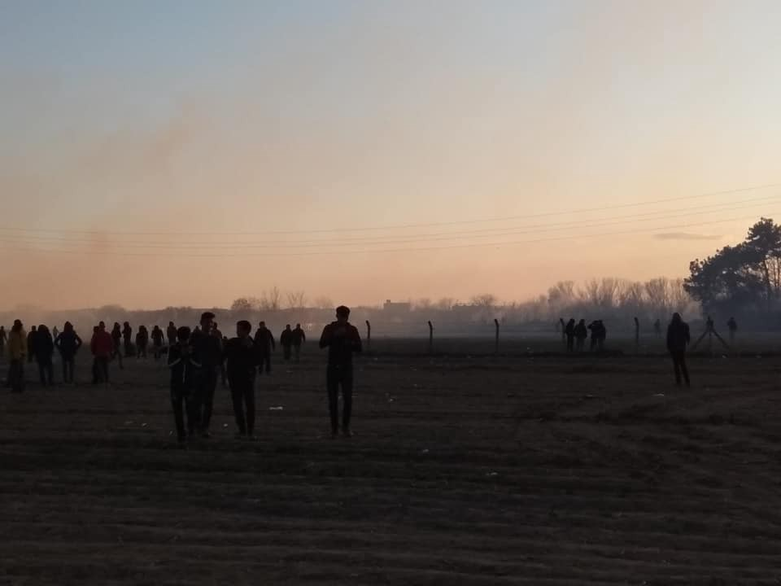
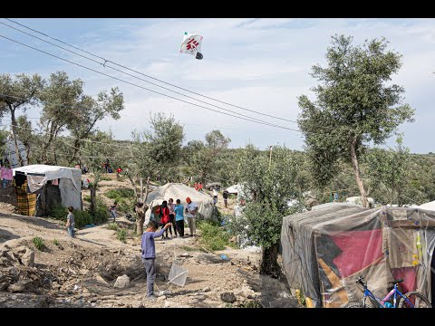

### AYS Daily Digest 08/05/20: Evidence indicates that Muhammad Gulzar has been shot by bullets fired from the Greek side of the border
#### Forensic architecture’s new analysis on killing in the Evros Border region // No access to health care for Syrian refugees in Jordan border region // Libya in times of civil war, corona pandemic and human rights violations // Updates from Moria // Safe port found for people saved by merchant vessel

Turkish\-Greek border, where Muhammad Gulzar has been shot, at the beginning of March\. Copyrights: Ruhi Loren Akhtar
### FEATURE: The Killing of Muhammad Gulzar

> Who killed Mohammad Gulzar? What exactly happened on the 4th of March 2020 at the Greek\-Turkish border? 

These were the guiding questions for the investigations undertaken by Forensic Architecture, Der Spiegel, Lighthouse Reports and Bellingcat\. 
The team of investigators tried to reconstruct the events of 4th March by collecting testimonies of eyewitnesses, video and photo material and news articles\. From this they constructed a digital 3D\-model of the events\. 
The chain of events that eventually led to the death of Muhammad Gulzar started to unfold on February 27th, when Turkey declared its borders with Greece open for people on the move\. Subsequently about 13,000 people travelled to the border in the hope of making it into Europe\. They were refused entry by the Greek Border Guards, with an immense use of teargas\. On 3rd March, high\-ranking EU officials, among them the President of the European Commission Ursula von der Leyen, visited the region by helicopter\. Von der Leyen later thanked Greece for its efforts to stop people from entering and for being the “shield” of Europe\. 
One day later, the situation on the border escalated\. The people on the move became increasingly frustrated and were incited by the Turkish authorities to get past the border\. Turkish officials accused the Greek Border Control of using live ammunition, and the Greek authorities rejected this claim as fake news\. At the end of the day, seven people were injured and one was killed by a bullet\.

FA has now established, on the basis of its analysis, that

> “\. \. it is highly probable that the shots that killed Gulzar and, in all likelihood, wounded the remaining six casualties were fired from the Greek side of the border\.” 

They explain that the killing might still have been an accident, but definitely a predictable and avoidable one\. 
The evidence gathered will be handed over to investigating authorities, once investigations are opened\. Lawyers representing the family of Gulzar requested Greece to launch investigations\.

Find the full reports on the investigations here:

### SYRIA/JORDAN

Amensty International has published a statement in which it urgently calls on the Jordanian government to provide access to health care for Syrian refugees stuck in the border area between Syria and Jordan\.

> “At the time of writing, at least 10,000 people remain there, with no access to sanitization and other materials to protect against the spread of COVID\-19\. The camp’s only medical centre has no doctors, a few nurses and one midwife\.” 

Maternity health care is the most urgently needed, since the UN\-run medical centre in the camp closed in mid\-March due to fears of spreading the coronavirus\. Right now, pregnant women who need a caesarean section have no other option than to travel into Syria for the operation and are then often prevented from rejoining their families in the camp\. 
The Jordanian Foreign Minister Ayman Al\-Safadi had announced in April that, due to corona pandemic measures, Jordan will not allow aid for refugees in Syria to pass through the Hashemite Kingdom\.

For the full statement see:

### LIBYA

The situation in Libya is once again worsening, especially for migrants as one of the most vulnerable groups in the country\. In recent days, fighting has continued\. Forces affiliated with Khalifa Haftar have continued the shelling of residential neighbourhoods in the suburbs of Tripoli\. Safa Msheli, a UN Migration spokeperson tweeted that the Tripoli main port was hit by shelling while IOM staff were waiting for the disembarkation of some 25 people intercepted at sea\. IOM evacuated the place and the people remained on the Coast Guard vessel\. Later, Msheli tweeted:

■■■■■■■■■■■■■■ 
> **[Safa Msehli](https://twitter.com/msehlisafa) @ Twitter Says:** 

> > ‼️ Alarming update: the migrants were disembarked last night and taken to a detention facility to which we do not have access. 

@[UNmigration](https://twitter.com/UNmigration) has raised the alarm over hundreds of disappearances from this facility over the past months. 

> **Tweeted at [2020-05-08 09:57:39](https://twitter.com/msehlisafa/status/1258697563831701504).** 

■■■■■■■■■■■■■■ 

> No words left for what happens to people according to the will of the EU and its financial support\. 

At the same time, the cost of living in Libya has increased dramatically in the past months\. In some places the price of tomatoes saw an increase of 200–300%\. According to IOM Libya, in 93% of locations assessed by IOM across Libya, migrants who rely on daily labour were reported to have been negatively affected by the COVI\-19\-induced slowdown in economic activities\.

For more details on the increase in costs, see [here](https://www.impact-repository.org/document/reach/a67a3694/REACH_LBY_Situation-overview_JMMI_April-2020-Week-1.pdf) \.

For more details on the movement restrictions and other consequences of the COVID\-19 pandemic, see:

For more information on the ongoing fighting in Libya and the destruction of health infrastructure, see an HRW report here:

For a longer article on the situation in Libya at the moment, see here:

### TUNISIA

Also in Tunisia, migrants suffer under the consequences of the measures taken against the spread of COVID\-19\. According to IOM, 53% of the people on the move who had jobs in Tunisia lost them in the time period of the lockdown\. 
Meanwhile two interceptions took place off the coast of Tunisia, with 52 people in total being returned to Tunisia\. According to this article, legal action will be taken against these people\.

### TURKEY

According to a news article from infomigrant, the Turkish interior minister Suleyman Soylu stated that Turkey will not hinder people who want to leave for Greece at its border, once the corona pandemic is over\. 
At the end of February Turkey had declared its borders with Greece open and thereby stopped the commitment agreed on under the EU\-Turkey deal that says Turkey will try to hinder people from leaving for the EU\. This step led to dramatic scenes at the northern borders, when thousands of people where denied entrance by the Greek Border Guards\. It is very likely that in this instance live rounds were being used by Greek Border Guards, killing one person \(see Feature above\) and injuring seven\. After the first confirmed death due to coronavirus, Turkey ordered the closure of all borders as a measure to stop the spread of the virus\. In this context, the northern border was also closed again and the people who remained there were brought back to the centre of Turkey\. It is quite unclear what happened to them later\. It was reported that many of them were just dropped off a bus without any support\. The article states that

> “However, the Turkish interior minister Suleyman Soylu \[said, AYS\] that the evacuation of the migrants did not reflect a change in policy and that they would be free to return\. “When this epidemic is over we would not prevent whoever wants to leave,” he told NTV television\.” 

This led Frontex to anticipate an increase of people trying to enter the EU, once the corona measures are lifted\. In an internal Frontex document that has been provided to the German newspaper Die Welt, an additional 262 Frontex officers have been sent from Greece to the northern Evros River border zone\.

For the full article, see:

[This](https://www.rudaw.net/english/middleeast/turkey/lockdown-solidarity-tarlabasi-refugees-08052020?fbclid=IwAR1arz1yPvPY7_4aDHqM5EZ_a3DIMcV6xRLWuz6UejmMIaVNyTJHswe8fH8) article gives a good account of the situation at the border at the end of February and the hard life of the people who did not make it into Greece, but also of the solidarity networks established amongst refugees in Turkey\.
### GREECE
#### Updates from Moria

The Moria Corona Awareness Team posted an update on the bottle recycling project they started some weeks ago\. People from the camp can bring ten empty plastic bottles and exchange them for one bottle of cold drinkable water\. The video shows a line of mostly young children waiting to exchange their empty bottles\. It can be seen on the Moria Corona Awareness Team’s Facebook channel\. 
The fact that the people in the camp are basically left alone with the garbage and have to build their own infrastructure in order to get rid of it is another sign of how the EU is making the camps extraterritorial sites\.

This video gives an insight into people’s life in Moria and the fight for joy and some kind of normality\.

A new piece of work by the Afghan journalist Mortaza Behboudi has been published by the French\-German TV channel Arte\. Behboudi is in Moria as a correspondent\. His newest video is on the situation of women in the camp\.

■■■■■■■■■■■■■■ 
> **[Mortaza](https://twitter.com/mortazabehboudi) @ Twitter Says:** 

> > Enfermées, sans aide, certaines d'entre elles ont pu être contraintes à des relations sexuelles ou à des mariages forcés. Rapports d'expérience d'une congolaise, d'une syrienne et d'une afghane dans ce camp surpeuplé de Moria à Lesbos. @[ARTEInfo](https://twitter.com/ARTEInfo) @[ARTEfr](https://twitter.com/ARTEfr) 

[arte.tv/fr/videos/0942…](https://www.arte.tv/fr/videos/094279-058-A/camp-de-moria-les-femmes-particulierement-vulnerables/) 

> **Tweeted at [2020-05-08 19:55:08](https://twitter.com/mortazabehboudi/status/1258847924030758913).** 

■■■■■■■■■■■■■■ 

Aegean Boat Report reported that a new camp to quarantine newly arrived people will be set up in the north of Lesvos\. The new facility will be set up within the old structure of the International Rescue Committee \(IRC\), on the dirt track between Eftalou and Skala Sikamineas\. Some people on the ground comment that the former Skala Sikamineas stage 2 camp would have been a much better choice, as the road to the now chosen location is a dirt track that becomes dangerous to drive when it rains\. The new camp is meant to be a temporary facility, only for the time of the corona pandemic to host people for quarantine after their arrival\.

This article gives an insight into the work of on\-the\-ground NGOs in times of the corona pandemic\.

### SEA

After five days, the people rescued by the merchant vessel Marina are finally allowed to disembark:

■■■■■■■■■■■■■■ 
> **[Alarm Phone](https://twitter.com/alarm_phone) @ Twitter Says:** 

> > Finally, after a 5 days standoff, the merchant vessel #Marina is allowed to disembark the 78 survivors in #Sicily. We are very relieved that 5 days after rescue the people reach a place of safety! We thank the crew for supporting them the last days. 

> **Tweeted at [2020-05-08 14:12:22](https://twitter.com/alarm_phone/status/1258761664670941188).** 

■■■■■■■■■■■■■■ 

The Spokesperson for the UN High Commissioner for Human Rights, Rupert Colville, expressed the agency’s deep concerns about the current practices of Malta and other EU states of pushbacks and restriction of private sea rescue\.

> “We call for a moratorium on all interceptions and returns to Libya\. In accordance with our recently published guidelines on COVID\-19 and migrants we reiterate that States must always comply with their obligations under international human rights and refugee law\.” 

For the full statement, see here:

### EU

Travel into the EU will be restricted for another month\. The EU Commission proposed to the Member States that they keep the current restrictions in place at least until mid\-June\. At the moment all unnecessary travels are forbidden\. At the same time, travel restrictions within the EU should slowly be dismantled\. Many of the Schengen area member states started border controls and restrictions in an attempt to stop the virus from spreading\.

So far, only 59 of the 1,600 most vulnerable people who are supposed to be relocated from Greek islands to European countries have actually been transferred\. Seven EU Member states announced in March that they would allocate these people, amongst them mostly children, many of them unaccompanied minors\. As we already reported, many of the children who were relocated to Germany in mid\-April did in fact have family members there\. Their relocation to Germany was therefore far from being a humanitarian act, but instead a right they had been deprived of until now\.
### GENERAL

The European Council on Refugees and Exiles \(ECRE\) has published a new, non\-exhaustive list of measures taken by European States in reaction to the corona pandemic with an impact on the situation of refugees and people on the move\. The list covers the following topics: Access to Asylum and Access to Health Care/Public Services, Reception Conditions and Integration, Dublin Transfers, Detention and Return, Broad political Measures and Further useful information\. 
For the full list, see [here](https://www.ecre.org/wp-content/uploads/2020/05/COVID-INFO-5-May-.pdf) \.

**Find daily updates and special reports on our [Medium page](https://medium.com/are-you-syrious) \.**

**If you wish to contribute, either by writing a report or a story, or by joining the info gathering team, please let us know\.**

**We strive to echo correct news from the ground through collaboration and fairness\. Every effort has been made to credit organisations and individuals with regard to the supply of information, video, and photo material \(in cases where the source wanted to be accredited\) \. Please notify us regarding corrections\.**

**If there’s anything you want to share or comment, contact us through Facebook, Twitter or write to: areyousyrious@gmail\.com**

_Converted [Medium Post](https://medium.com/are-you-syrious/ays-daily-digest-09-05-20-evidence-indicates-that-muhammad-gulzar-has-been-shot-by-bullets-fired-4cf7fb60518b) by [ZMediumToMarkdown](https://github.com/ZhgChgLi/ZMediumToMarkdown)._
