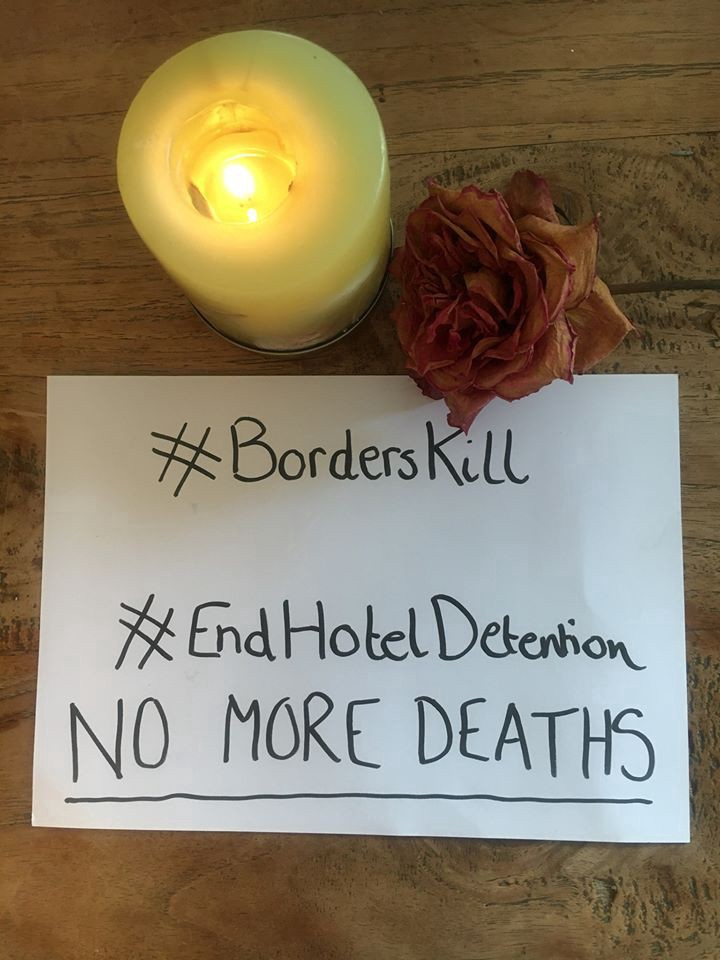
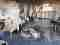
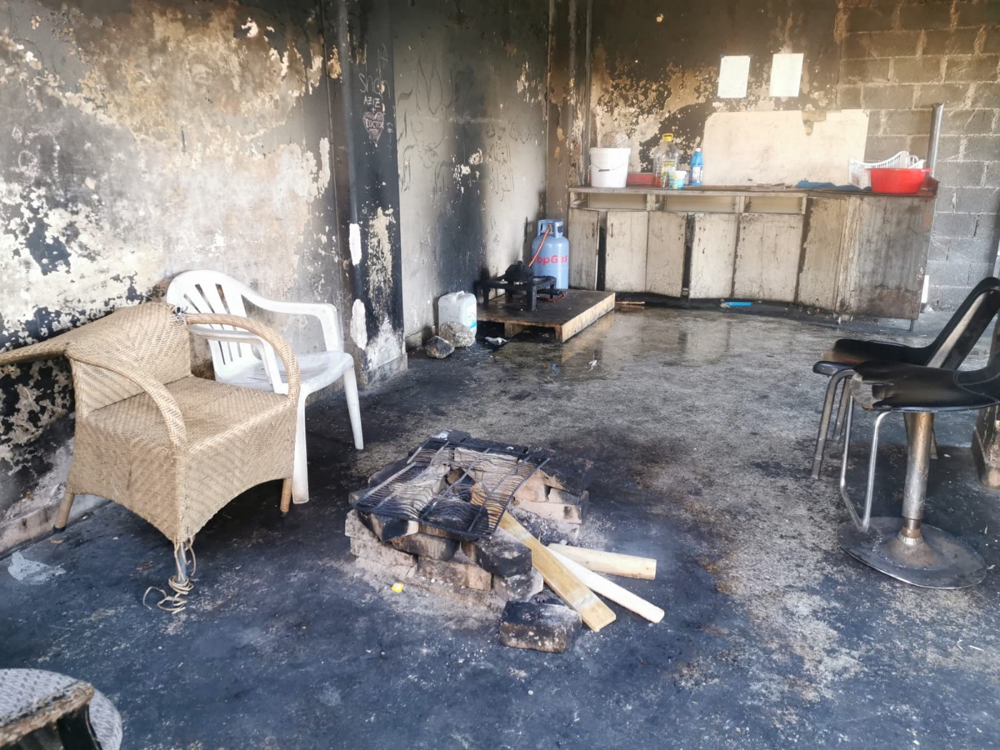
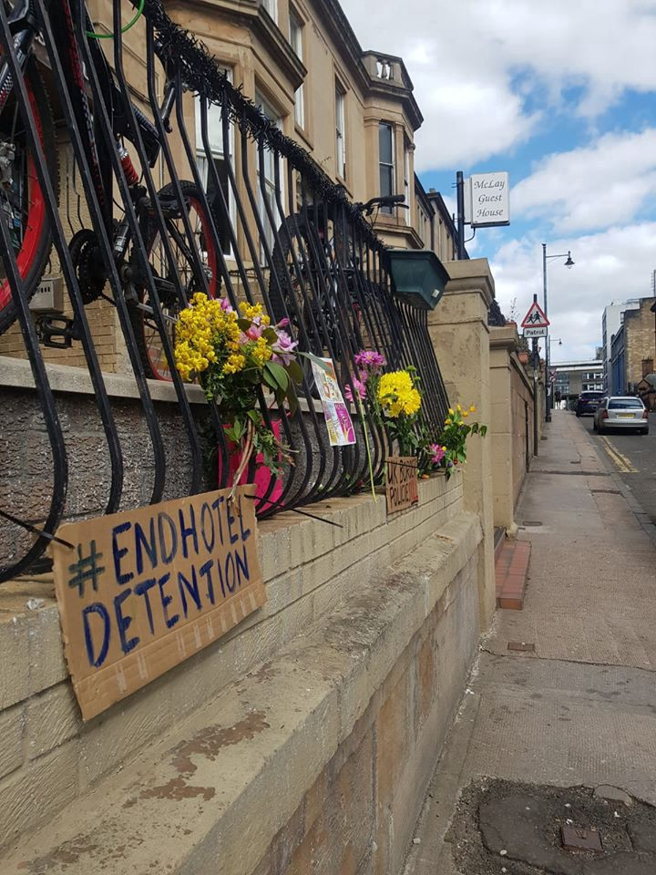

### AYS Weekend Digest 09–10/05/2020: The Libyan SAR zone is a deadly illusion
#### One man found dead in asylum seekers hotel accommodation in Glasgow, UK / Police violence in Patras, Greece / LIDL on Samos force people on the move into separate queues / More pushbacks in the Aegean

A man was found dead on Tuesday in a Glasgow hotel accommodation, Scotland\. He had asked for mental health support but was asked to wait\. Together with hundreds of other asylum seekers, he had been evicted from his flat and moved into a hotel as part of ambiguous COVID\-19 measures\. \#borderkills \#endhoteldetention \(Photo by [No Eviction Glasgow](https://twitter.com/no_evictions/status/1259526746761723904) \)
### Feature: The Libyan SAR zone is a deadly illusion\. It’s time to cancel it\.

In March, a case was submitted to the International Maritime Organisation \(IMO\) in London, to cancel the Libyan Search and Rescue Zone not only because it is purely nominal, but especially because since its notification, it has put more lives in peril at sea than it has contributed to saving\. It was filed by Open Arms, the Comitato Nuovi Desaparecidos, Progetto Diritti and a team of lawyers specialising in migration, alongside independent Italian MP Gregorio De Falco\.

[A new report by State Watch](http://statewatch.org/analyses/no-360-malta-italy-eu-libya-pushbacks.pdf?fbclid=IwAR0kgcu90hRnZHJD6hcxNkgbQmdsmYKEQVOY9c0VMLqJ08rcLXyvpERcey8) analyses the reasons behind this request\. These have been common knowledge since the notification of the Libyan SAR zone in December 2017:

> _Libya does not fulfil the essential requirements to control a maritime search and rescue area as it lacks an operative centre for receiving distress calls and organising and co\-ordinating sea rescues,_ 

> _\[it\] does not have adequate radio communications capabilities on the coast or in secondary sites\._ 

> _\[Libya does not\] have an adequate fleet, helicopters or aerial vessels for carrying out monitoring or rescues_ 

> _not to mention the fact that Libya cannot be considered a place of safety, as confirmed by the Italian Court of Cassation’s sentence in the case of Carola Rackete and Sea Watch 3, which reaffirmed that rescues must end in a place of safety\._ 

The fiction around the Libyan SAR zone is useful to the EU’s unspoken policy of push\-backs by proxies, and it is set within a [wider framework of EU\-inspired action throughout the African continent](https://thecorrespondent.com/240/war-of-the-words-how-europe-is-exporting-its-migration-philosophy/31739576880-b506ad0d) , where funding for development is becoming conditional upon the implementation of measures to curb migration fluxes\.

It is a convenient fiction “for the EU because it allows Italy and Malta to relinquish their duties to rescue and receive migrants who may be in danger during sea crossings\.”

> _The submission was also sent to the International Criminal Court \(ICC\), which was recently contacted by the International Organisation on Migration \(IOM\) due to continuing refoulements enacted by Libyan coastguards coordinated by European actors\. Striking off the Libyan SAR zone from international registers would contribute to dismantling an alibi which the EU as a whole, with Italy at the forefront, has used to justify policies and practices of closure and refoulement\._ 

As we said above, the reasons to strike off the Libyan SAR zone were pretty evident at the very moment of its declaration\. Nonetheless, nothing has been done at a governmental level \(or by the intergovernmental agencies responsible for such matters\) \. Indeed, things only got worse, with a civil war spreading around Libya, with Italy using COVID\-19 as an excuse to declare itself an ‘unsafe country’ \(while declaring Libya a safe one\), with Malta illegally coordinating push\-backs to Libya\.

This comes while even UNHCR is calling for the immediate lifting of any restrictions to NGO rescue ships and for the declaration of Libya as an unsafe country, media [report](https://www.europapress.es/internacional/noticia-onu-pide-medidas-inmediatas-ong-puedan-seguir-rescatando-migrantes-mediterraneo-20200508125415.html?fbclid=IwAR3MFkyav1OOdKL2y86Olhm1lkDrw6F7c1HbrpSmCOs5zjouvNbuWelzvfY) \.

It is worth remembering that between 2008 and 2009 [Italy had already carried out push\-backs from Italian waters to Libya](http://www.zalab.org/projects/mare-chiuso/) , and — for that reason — the country was found guilty of human rights violations by the ECHR in 2011\.

12 years later, Italy is continuing to act against the basic human rights of people on the move, refusing a port of safety and, last week, [impounding both the Alan Kurdi and the Aita Mari for grotesque reasons](https://sea-eye.org/en/harassment-of-rescue-ship-alan-kurdi-prevents-next-mission/) \.

In a normal world, it would be a wonder how the so called ‘Democratic Party’, that is now in the Italian government coalition, in the last few years, managed to go back and forward on its own policies and electoral promises:
- in 2017, they promoted the code of conduct for humanitarian sea rescue, limiting de facto the ability to conduct rescue missions\.
- in the same year, they promoted the institution of the Libyan SAR zone and funded the country’s coast guard,
- for the following year and a half — once they lost the election — they managed to present themselves as the forefront of the protests against Salvini’s policies of closed ports and as NGOs supporters
- Now, back on the government seats, they refuse to let boats dock, enforce quarantine on rescue ships and, once they have been allowed to dock, impound them for “technical” reasons\.

Evidently, there is nothing normal in this world\.

GREECE
### Arrivals

[ABR report](https://web.facebook.com/AegeanBoatReport/posts/829664920889947?hc_location=ufi) that a boat carrying 19 people landed in Lapsarna, Lesvos north west 06\.30 Sunday morning carrying 4 children, 3 women and 12 men\.

> _This is the second boat this week in this area, last one was on Wednesday, when 51 people landed in Kalo Limani\._ 

> _All new arrivals have been taken to the new quarantine site, at the old IRC camp on the dirt\-track between Eftalou and Skaka Sikamineas\._ 

### Illegal pushbacks continue in the Aegean

People’s lives are continuing to be put at risk in the Aegean as boats are attacked by vessels without flags which are likely to be the Greek Coastguard\. The steep drop in arrivals has a very clear explanation\.
### Moria Corona Awareness Team Update

The group has been continuing their flyer distribution in different languages to fellow residents but now wish to emphasise the responsibilities of any new volunteers, workers or journalists coming to the camp:

> _Evacuation and transfer will happen for some of us, but many still have to stay here\. If coronavirus comes then where will we go?_ 
 

> _So please everyone planning to come you must do your quarantine\._ 

> _Moria is still coronafree so please help us keep coronafree\._ 

A video report of the current situation \(in German\) can be found [HERE\.](https://www.arte.tv/de/videos/090637-059-A/re-quarantaene-auf-lesbos/?fbclid=IwAR2XwMrhlPTtD4tjagSj2BQ2Mo8vNzP-aMZAOV65suV8bEy1YM1ioNXw-3M)

And a thread \(in English\) describing conditions and local feeling can be found [HERE](https://twitter.com/f_grillmeier/status/1259444290331303937) \.
### Samos sees COVID\-19 Apartheid
### Fundraiser for Chios Warehouse

Open Arms are trying to fundraise 10,000 euro for their new warehouse project\.

> _With a distribution warehouse, we will be able to respect the government restrictions, and continue to distribute safely\. With conditions at Vial camp and its overflow always in decline, the threat of the spread of the virus, and fires becoming more commonplace, where many people lose their homes and all of their belongings — this project will aim to slightly ease these hellish conditions\._ 

You can support them [HERE](https://web.facebook.com/donate/702675327191474/2868063619929470/) \.
### Police Violence Escalates in Patras

\(Photo Credit: José Vicente Carro\)

[No Name Kitchen report](https://web.facebook.com/NoNameKitchenBelgrade/posts/977404592657825?hc_location=ufi) that police violence against people on the move is increasing in the port of Patras as people once again try to play the “game” — escaping on board a boat to a safer future\.

> _We have seen broken teeth and severe marks on the bodies these days\._ 

### 2 children freed from detention after two months

After two months in detention in Malakasa camp, [ProAsyl reports](https://www.proasyl.de/en/news/two-children-transferred-out-of-malakasa-protection-still-denied-to-many/?fbclid=IwAR3GZs6WKHcOFlhvCR5ofsXEoANGIg1WLJtfTO36fRBkWv2axEanyxRWtsA) that two unaccompanied children were finally placed in appropriate housing last week, but only after legal procedures were undertaken\.

> _While welcoming the applicants’ recent transfer to a shelter for minors, RSA regrettably notes that demanding litigation procedures and recourse before the Strasbourg Court for interim relief have become necessary to secure the consideration and protection of even the most basic rights of children\. Recourse to the ECtHR is not accessible in every case of children at risk and cannot substitute a reliable and well\-functioning child protection system, which remains a pressing need for Greece\._ 

### Mutual Aid Group supports people in Malakasa

A [collective of solidarity groups](https://web.facebook.com/%CE%9F%CE%BC%CE%AC%CE%B4%CE%B1-%CE%91%CE%BB%CE%BB%CE%B7%CE%BB%CE%BF%CE%B2%CE%BF%CE%AE%CE%B8%CE%B5%CE%B9%CE%B1%CF%82-%CF%83%CE%B5-%CE%B5%CF%85%CF%80%CE%B1%CE%B8%CE%B5%CE%AF%CF%82-%CE%BF%CE%BC%CE%AC%CE%B4%CE%B5%CF%82-%CE%B5%CE%BD%CE%AC%CE%BD%CF%84%CE%B9%CE%B1-%CF%83%CF%84%CE%BF%CE%BD-Covid-19-101106411539049/?__tn__=kCH-R&eid=ARB3KZkGmkNP05fadz-HpkH7Hx8IoUaVoPF7pf3nCcyqu-xxG-y3HZeqrYxV4FoTGvaPIYvCpRrKPwIY&hc_ref=ARQPYlaG1qhubrD9lezVUXqUCXaUI2MioCTIwJnstn0imNmJQVoCoEuCN6-hTt17cyA&fref=nf) has formed to make food and dry food packs for people under quarantine in Malakasa while also supporting social clinics with medication\.

You can support them with both [physical](https://web.facebook.com/%CE%9F%CE%BC%CE%AC%CE%B4%CE%B1-%CE%91%CE%BB%CE%BB%CE%B7%CE%BB%CE%BF%CE%B2%CE%BF%CE%AE%CE%B8%CE%B5%CE%B9%CE%B1%CF%82-%CF%83%CE%B5-%CE%B5%CF%85%CF%80%CE%B1%CE%B8%CE%B5%CE%AF%CF%82-%CE%BF%CE%BC%CE%AC%CE%B4%CE%B5%CF%82-%CE%B5%CE%BD%CE%AC%CE%BD%CF%84%CE%B9%CE%B1-%CF%83%CF%84%CE%BF%CE%BD-Covid-19-101106411539049/?__tn__=kCH-R&eid=ARB3KZkGmkNP05fadz-HpkH7Hx8IoUaVoPF7pf3nCcyqu-xxG-y3HZeqrYxV4FoTGvaPIYvCpRrKPwIY&hc_ref=ARQPYlaG1qhubrD9lezVUXqUCXaUI2MioCTIwJnstn0imNmJQVoCoEuCN6-hTt17cyA&fref=nf) and [financial](https://www.gofundme.com/f/mutual-aid-to-the-vulnerable-against-covid19?utm_source=customer&utm_medium=copy_link&utm_campaign=p_cf+share-flow-1&fbclid=IwAR0FVhBkGgGqoacHaPN41ipT12GqUMa0ULYQt5udaRMJDI4seihitDZFrVA) donations\.
### The truth about transfers to the mainland from Moria

Vulnerable people “rescued” or vulnerable people hidden from the public eye?
### Portugal to welcome 60 minors from the Greek islands

Media [report](https://www.reuters.com/article/us-health-coronavirus-portugal-migrants/portugal-to-take-up-to-60-unaccompanied-migrant-children-from-greek-camps-idUSKBN22L0T7?il=0&fbclid=IwAR2isQRUuEFkphJbrPqx4MxVMsm9z661cT1jKEPlPLTDOQXCB9ADJ-BUV4o) that Portuguese president announced the decision and that the transfers should be expected for the coming weeks\.
### Movement restrictions extended for RICs

According to the [Greek Ministry for Migration and Asylum](https://web.facebook.com/migrationgovgr.info/?__tn__=%2CdkCH-R-R&eid=ARAzZFW1w13oIEh620pJB7lNZEnjp8y5mqXXukLh6-P2OWicmstr3E7oeVCR3NzbaUDlpZUl9hGnhhHi&hc_ref=ARS9OaSteOcnfV6eCj7ieeeUQ74LENGW85QTCelAvYpGO0ZrdGiQQYpp6TcWaCDb3Q0&fref=nf&hc_location=group) movement restrictions regarding COVID\-19 will be extended until May 21, 2020 for people living in Reception and Identification centres and other camps throughout Greece\. The original announcement was [only published in Greek](https://twitter.com/Refugees_Gr/status/1259517105566867456?fbclid=IwAR19tfhJKW-1tLqlASuv2-LwOSddPHrgLipgNdJnkUfRi7hkbG3bDSoIqAA) , not particularly helpful for those actually living in RICs who have been purposefully removed from Greek society and any form of integration including language learning\. For those still under restrictions it is of course also possible to continue handing out fines if they are breached while a person is trying to buying food or nappies etc… Further reports [HERE](https://www.aljazeera.com/news/2020/05/greece-extends-coronavirus-lockdown-refugee-camps-200510203054274.html?fbclid=IwAR1R4aB8o1xs9jjtcsgFbF6KSQh1PDApGkp390edzAoy7baW7vy0z3uzZpI) \.
### Family Reunification Flight to go ahead despite restrictions

52 people will be [flown from Athens to London](https://www.theguardian.com/global-development/2020/may/10/exclusive-family-reunion-rescue-flight-to-leave-athens-for-uk?fbclid=IwAR0B7ot0h3cVOkBkB5015tn4rJGc2KL0t0v7aHc8zLP90X29tNVWyDR6D_4) under the Dublin III agreement and despite travel restrictions\. While we are overjoyed for those who will soon get to see their loved ones, this is an existing mechanism which should be routinely followed and not constantly wrangled over, with COVID\-19 being only the latest in a long line of reasons to delay such a flight\.

During the long, drawn out application process, often involving rejection and appeal, many of these people, including children, have been forced to live in the diabolical conditions of Greek camps, known to harm a person’s mental and physical health\. The only people that deserve to be congratulated in this scenario are the asylum seekers who have survived in Europe long enough to make this flight, despite Europe’s best efforts to inflict harm upon them\.
### May Heat Wave

[Local media report](https://www.keeptalkinggreece.com/2020/05/10/may-heat-wave-greece-temperature-39c-sahara-dust/) that temperatures will reach 39 degrees this weekend in Greece, for people with limited access to drinking water in Greek Camps this is particularly worrying news\.

UK
### One man died in hotel accommodation in Glasgow

Tuesday last week, a 30 year old man from Syria was [found dead](https://theferret.scot/covid-19-syrian-man-dies-asylum-seeker-hotel/?fbclid=IwAR1MVxFdHjvQ48HLYU3Gq3nfba5IPujjmqL2Es9DUNuEX__lUoWAnYb9IOg) in his room at the McLay’s Guesthouse in Glasgow\. Authorities are treating his death as unexplained\.

> _Speaking on condition of anonymity, one fellow Syrian told how he had accompanied \[him\] to appointments in which he had asked for mental health support\. The friend said: “He had suicidal thoughts and told the Home Office that\. I went to the hospital with him, he was seeking help\. He tried many times\. They would ask, ‘can you wait a few days?’”_ 

Campaigners have long criticised hotel detention, especially since Maers, a contractor group for the Home Office, moved hundreds of people housed in flats into hotels, as part of its COVID\-19 response\. At the same time the 35\-pound\-a\-week cash support was replaced by three meals a day served in common spaces\. Moves that raised concerns about welfare, safety and social distancing\.

Flowers outside McLays Guesthouse in Glasgow \(Photo by [Glasgow No Eviction Campaign](https://www.facebook.com/noevictions/?__tn__=kCH-R&eid=ARDRj24ob5wRzG036wepeX13lPVfEMFTreiyoFpW5Y3gVo_195iKZqwq9GCTLm5aoCscIh07--ydbYiH&hc_ref=ARQEH9TBIRcqW4PbEJrn75y5pt-DBXX7XtvaItXvk7ARNqeotAa-0EH7daK3tna7Jp0&fref=nf) \)

On Sunday, friends and solidarians left flowers and banners outside the hotel\. They were soon removed by hotel staff\.
### “We Demand A Safer Way” petition, while at least 244 people crossed the Channel over the weekend

Media [report](https://www.theguardian.com/uk-news/2020/may/10/charities-call-for-safe-routes-for-migrants-to-claim-asylum-in-uk?CMP=Share_iOSApp_Other) that, at least 244 people have crossed the Channel from France to the UK over the weekend\. “The Home Office has confirmed 145 people, including 51 onboard an inflatable boat, were brought ashore on 8 May … A further 82 people were picked up on Saturday … On Sunday, Border Force was alerted to another boat at 3\.20am that was found to be carrying 17 people… Since lockdown was announced in Britain on 23 March, at least 853 migrants have been intercepted by UK authorities and brought ashore\.

With the warming weather and the dismal conditions of makeshift camps in northern France, worsened by the lockdown measures, numbers are expected to increase\.

> _“When you are stuck at the UK border your future is one big blank\. You feel full of hope, but also full of problems\. During the COVID\-19 crisis, it is only getting worse\. If people could apply at the border, then nobody would risk their life to get here irregularly\.” Michael\*, former Calais camp resident\._ 

Several organisations are asking the UK government to implement a safe way to apply for asylum in the country\. Please sign [Refugee Rights Europe petition HERE](https://www.change.org/p/priti-patel-home-secretary-we-demand-asaferway) \. And read more about it [HERE](https://refugee-rights.eu/calling-for-change/northern-france/) \.

**Find daily updates and special reports on our [Medium page](https://medium.com/are-you-syrious) \.**

**If you wish to contribute, either by writing a report or a story, or by joining the info gathering team, please let us know\.**

**We strive to echo correct news from the ground through collaboration and fairness\. Every effort has been made to credit organisations and individuals with regard to the supply of information, video, and photo material \(in cases where the source wanted to be accredited\) \. Please notify us regarding corrections\.**

**If there’s anything you want to share or comment, contact us through Facebook, Twitter or write to: areyousyrious@gmail\.com**

Following
- [Digest](https://medium.com/tag/digest)
- [Refugees](https://medium.com/tag/refugees)
- [Glasgow](https://medium.com/tag/glasgow)
- [Libyan Sar](https://medium.com/tag/libyan-sar)
- [Lidl](https://medium.com/tag/lidl)

_Converted [Medium Post](https://medium.com/are-you-syrious/ays-weekend-digest-09-10-05-2020-the-libyan-sar-zone-is-a-deadly-illusion-cbdfe87d0404) by [ZMediumToMarkdown](https://github.com/ZhgChgLi/ZMediumToMarkdown)._
