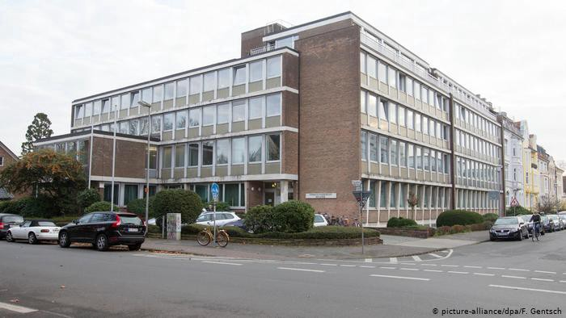
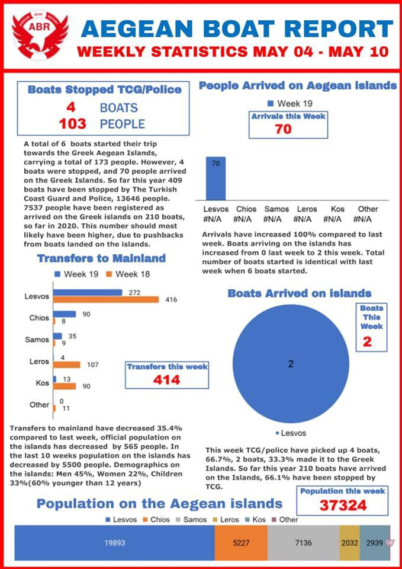

### AYS Daily Digest 11/05/20: German Reception Centers ‘Inadequate’ During Pandemic, Court Rules
### In Serbia, police replaced the army guards / Possible food poisoning at the Lipa camp in BiH, beating as an official reaction / French Court of Auditors called the country’s asylum system outdated and insufficient / & more news

[Are You Syrious?](@AreYouSyrious?source=post_page-----67e97711010f----------------------)

[May 12](ays-daily-digest-11-05-20-german-reception-centers-inadequate-during-pandemic-court-rules-67e97711010f?source=post_page-----67e97711010f----------------------) · 10 min read

The court in Munster\. Photo credit: [picture\-alliance/dpa/F\. Gentsch via DW](https://www.dw.com/en/german-court-covid-19-protection-inadequate-at-refugee-home/a-53395710?fbclid=IwAR2XB8HvNbv5XeBvihs0_89_5rUgy9SVYdYKpao4omExY20Jh-h-G2TP7Ao)
### FEATURE
### Germany’s Shared Accommodation for Asylum Seekers Is Inadequate During Pandemic

The Administrative Court in Munster [ruled](https://www.dw.com/en/german-court-covid-19-protection-inadequate-at-refugee-home/a-53395710?fbclid=IwAR1w3_HQ7rlUD10iM2OTWHJR1yHegngwtWy30u-RJCEC46B9yAPDJ279VeM) that a pregnant woman and her husband did not have to live in a shelter, located in the town of Rheine, because the local government was not providing adequate protection\. The woman appealed for the right to be released from the shelter, saying that she feared for her health\.

The court found that crowded conditions inside shared accomodation centers, where people often share rooms with complete strangers, make it impossible to follow social distancing guidelines that are necessary to stop the spread of COVID\-19\. Residents also do not have access to cleaning supplies\. Last week, _Anker\-watch_ shared [a letter](https://www.anker-watch.de/brief-einer-bewohnerin-aus-dem-anker-zentrum-geldersheim/?fbclid=IwAR0alCe9kiLYH9Do7pzm-qFCdtJclHMhXPW1RfpgEDk6VEEZ8E2FSUYcWQ4) from a resident which detailed many of the same problems in a different shelter, showing that this is a systematic problem\.

In its decision, the court said that the conditions inside reception centers create “double standards” where Germans are able to \(and expected to\) follow social distancing guidelines for their own safety, but asylum seekers cannot\. It is a requirement that people seeking asylum in Germany must live in these reception centers while their applications are processed, and if they leave without permission it cann affect their application\. Either the German government must provide safe and healthy living conditions, or allow people to choose where they live\!
### GREECE
### Greek Government Continues to Deny Shooting of Muhammad Gulzar

Even after an [investigation](https://www.bellingcat.com/news/uk-and-europe/2020/05/08/the-killing-of-muhammad-gulzar/) by Bellingcat, Der Spiegel, Sky News and several other independent news sources proved that the Greek army was responsible for shooting Muhammad Gulzar on March 4th, the government continues to call it “fake news\.” Government spokesman Stelios Petsas repeated his denial that nobody was killed or injured and blamed the Turkish government for spreading fake news\. Immigration minister Mitarakis used a similar tactic of blatant denial when confronted with evidence about illegal pushbacks and “disappeared” arrivals on the Greek islands\. He said, “those facts that you say you read on local websites do not exist as facts\.”

The fact that the government continues to lie even after photo and video evidence, even after dozens of witnesses said Greek soldiers fired live bullets into the crowd, even after the bullet found in Gulzar’s body was matched to the kinds of bullets used by the Greek army, is despicable\. It also raises an important question — if the government can lie so blatantly even when confronted with evidence, what other events that have less documentation are they lying about or hiding?

The Greek government [approved](https://www.infomigrants.net/en/post/24643/funding-boost-for-islands-lifting-refugee-burden-in-greece?fbclid=IwAR1G6EzIK6pHEFtqXsZJk6DUWpoTXvYTrJL1Ld_dYDGoPJiHlnkrhCZyIEA) an extra € 2\.7 million in funding for Lesvos, Samos and Chios to help with the “burden” of the asylum camps\. Some hope that the extra money will used to improve conditions in the camps and ease the tension between the national government and local governments, who feel abandoned by the national government\. However, political spats will likely continue despite the funding boost — for example, currently there is a conflict in the village of Sykamia on Lesvos, which is refusing to play host to a quarantine site for new arrivals\.

How much of that money will trickle down to the people who actually need it, and whether it will be used in a way that meets their needs, is another question\. Moria White Helmets [raised the issue,](https://www.facebook.com/MoriaCoronaAwarenessTeam/videos/550298692351272/?v=550298692351272) saying that already, most NGOs do not consult people living there on what they need\. For example, 40,000 rolls of toilet paper were donated when the fragile sewage systems cannot handle toilet paper\! For any relief money to actually go where it’s needed, people who live in the camps should be the ones to decide how it is used\.

Vandals [smashed](https://www.facebook.com/greg.kavarnos/posts/2453303988301178?hc_location=ufi) the car windows of a worker from Moria’s clinic on Monday, as well as the windows of the car parked beside his\. Reportedly, even though he had objects of value in his car, nothing was stolen, although the insurance paper & driver’s registration were stolen from the other car\. This is very suspicious, particularly in light of the recent attacks on NGO workers and volunteers across Greece\.

The Greek Helsinki Monitor filed a [criminal complaint](https://twitter.com/VassilisTsarnas/status/1259906218258239490) against the Lidl in Samos, where two lines in front of their store were created: one for Greeks and one for people on the move\. Blatant segregation like this cannot be acceptable\! This has also been reported to have happened at the Lidl on Chios a few weeks ago\.

Unicorn Riot wrote [this article](https://unicornriot.ninja/2020/mutual-aid-to-detained-refugee-women-grows-coronavirus-in-greece-part-3/?fbclid=IwAR1X-5ZLsYSpqRBpksIYTGDR9U2Hfcyg0s-pe32l1RZQ4_VNeASb-pblacc) about a mutual aid group in Athens, _The House of Women_ , organizing in solidarity with women in detention\. They work mostly with women detained in Petrou Ralli, where conditions have become even more demoralizing during this pandemic, as there is no end to their detention in sight\. The article has information about many other solidarity groups like _The House of Women_ that raise money and collect supplies to donate to detainees\. Unfortunately, their solidarity work is all too necessary as the Greek state continues to neglect people in detention centers\.

Another important initiative is _Metadrasi’s_ “Mobile Street\-Work Unit for Homeless\.” There are several hundred homeless children living alone on the streets of Athens, and they are working to distribute basic necessities and support\. You can read more about their work [here](https://www.facebook.com/metadrasi/posts/2965457340262304?hc_location=ufi) \.

Source: [Aegean Boat Report](https://www.facebook.com/AegeanBoatReport/posts/830268937496212?hc_location=ufi)
### SERBIA
### Double Standard for People on the Move

Serbia has mostly lifted its emergency measures to stop the epidemic, including limits on freedom of movement, but most asylum seekers are still [closed inside detention camps](https://twitter.com/APC_CZA/status/1259853382535319553?s=20&fbclid=IwAR1SdfT2kZNdyCUx0PHts-rGVKrxzMKRSTmDFUbkSjr-9bqevOIYAC9_lR8) \. The only difference is that the police have replaced the army guards\. Asylum Protection in Serbia called on the government to investigate this double standard\.
### BOSNIA AND HERZEGOVINA
### Food poisoning at IOM camp?

In spite of the “relaxed measures” on the general population, the people staying in Lipa camp, close to Bihać, are still not free to move responsibly, as everyone else has been advised to\. The past evening there was an incident that perhaps best depicts some of the flaws of the imaginary solution seen in forming the camp\. A group of some 30 people was feeling intensely sick and threw up after having been served food in the evening \(rice and meat\), and in spite of having asked for medical help, nothing happened until they protested as they were worried about their health and nobody had reacted to their calls for help\. Then, after they started protesting, the security called the police, who reportedly “solved” the situation by applying force, beating the boys who were still feeling sick after the initial nausea that seemed to have been caused by something in the food they ate\. They were eventually driven \(after 1 a\.m\. \) to the hospital in Bihać where, according to statements from some of them, they were sent back to Lipa, without having been examined or given any medical documents that would confirm what caused the problem or confirm if they were in good health or not\. We have not found any official statements regarding this, no apologies, explanations, reports or reassurances that the people are ok\.
### CROATIA
### Preparing projects of support

At the Reception centre in Zagreb, there are 383 people at the moment\. In alignment with the current phase of measures for COVID\-19, people are free to move as usual, but they are recommended not to go to places where there are many people, if they don’t have to, so as to avoid any unnecessary physical contact with people while the measures imposed nationally are still in place\.

During the pandemic, AYS was among the people who were asked to not have their volunteers circulate in the Reception centre Porin so as to weaken the possibility of potentially letting someone in who is COVID\-19 positive, and during that time we were finding ways to support people as much as we could, still having volunteer teachers working with children online, daily; buying internet cards for people who wanted to continue language classes so they could join the online classes still taking place; preparing packages to lift the spirits of those who had to go to self\-isolation within the centre; weekly supplying families across the city who now find themselves in very difficult situation, and many of whom relied on our Free Shop for extra support in their households, but also as a social place with friendly atmosphere\. We were asked not to distribute any hygiene products, cleaning products or clothes to the people in camp as their needs are officially being met by what is provided via _The Red Cross\._ However, we will now inform the people in the centre that they can start letting us know what they need in order for us to find and prepare everything that we can, as we intend to reopen our Free Shop again\. Unfortunately, for the time being, it will not be a place of gathering and socializing, as it was until recently, because we need to respect the measures defined by the national civic protection authority\. We will make sure everyone in need, regardless of their status as a person on the move/ refugee/ asylum seeker, is informed and able to receive what they need, to the best of our capacities\. We are working on a voluntary basis, and as always, we welcome those who live in the country to join our volunteers in Croatia and those abroad to contact us if they want to be active in some other way\.
We also intend to support those people hit, on top of everything, with the consequences of the pandemic and of the earthquake in Zagreb, and we will publish our call for action very soon\. We hope for support from all sides\!
### SLOVENIA
### More Traffic on the Balkan Route

The Italian government said that they are seeing [an increase in arrivals](https://www.infomigrants.net/en/post/24639/not-just-migrant-disembarkations-balkan-route-resumes?fbclid=IwAR3XZMuIxYMIJQ-aUKWfEIZzBcVH6q9PLppqYJC-hw4toPmtX01v2Xy4f-s) in northern Italy on the border with Slovenia\. The four quarantine facilities in the region around Trieste are already overwhelmed and the government is setting up ‘tent cities’\. The Italian government also said they need to “restart dialogue with the Slovenian government,” which usually means governments will cooperate on repressive measures at the border\.
### MALTA
### Government Spending € 3000 a Day On…Captain Morgan Ships

Instead of accepting arrivals into its ports and fulfilling its obligations under international law, Malta is chartering private vessels to hold people rescued at sea\. Almost 200 people [are currently held](https://timesofmalta.com/articles/view/captain-morgan-vessels-housing-migrants-costing-3000-each-daily.791378?fbclid=IwAR2Bg-qAZq2Nzw-G_0adhB5UxA4yqsVPf1sxDyLsaU8eLVor5TnnfAcaSlI) on two different Captain Morgan cruise ships and there’s no word on when they will be allowed to set foot on land\. The Maltese government even applied for funding to cover the cost of chartering private ships, but it’s unclear if it will be approved\. The practice violates international law in several ways because there’s no clear way for people to actually apply for asylum and the conditions are inadequate\.

The Council of Europe’s Commissioner of Human Rights [issued a l](https://twitter.com/SavingHumansUSA/status/1259801509090516993?fbclid=IwAR2a8-_jXWFyM7S7vGWbwRA6Dyt05NMz4d9cqzZChoxeqjVW7d4WU0z-N2E) etter criticizing Malta for ignoring its obligations to people in distress at sea, reminding the government that Libya cannot be considered a safe port\. She also called on the government to [investigate reports](https://timesofmalta.com/articles/view/dont-deny-stranded-migrants-human-rights-coe-commissioner-tells-abela.791303?fbclid=IwAR14LZZLRiUBQgerN6Flok2rRJNI7BasK7LmgsTyDsAJ9ZXllTG1ShRKhdo) of foul play, such as illegal pushbacks or deliberate delays in response to a distress call\.
### FRANCE
### France Needs to Modernize Asylum System, Court of Auditors Says

In a [public report](https://www.ecre.org/france-court-of-auditors-urges-modernisation-of-migration-and-asylum-system/?fbclid=IwAR0ciRh8G4hbFP190VvWyb5rhh9dEfcSmh-o5o0pwUzNflA9MGmQNoW3AvE) , the French Court of Auditors called the country’s asylum system outdated and insufficient\. While asylum applications have steadily risen in the past few years, funding has not and people are not receiving adequate housing or integration services\. Official time limits for decision\-making and permit renewal are purposefully unrealistic in order to deter people from applying\.
### BELGIUM
### Belgium Accepts 18 Unaccompanied Minors From Greece

The Minister for Asylum and Immigration Maggie De Block says it is an “ [expression of solidarity](https://www.grenzecho.net/35766/artikel/2020-05-10/belgien-nimmt-18-junge-asylsuchende-auf?fbclid=IwAR3hdDfGGBIMZ_vpM4Rc1wRw8Jslk4gdUSxtGm--bt4M_J2dgQH7DNFBBbc) ” with Greece and that the minors are very vulnerable children that need to be protected, but that this is a temporary solution\. She called for a structural policy in the EU with shared distribution of housing across the bloc\.
### UK
### Glasgow No Evictions Releases Statement After Man Found Dead in Hotel

In the [weekend digest](ays-weekend-digest-09-10-05-2020-the-libyan-sar-zone-is-a-deadly-illusion-d234eefb1146) , we shared the story of a man who was found dead in hotel accomodation in Glasgow\. _Glasgow No Evictions_ released their official statement:

> _We are deeply saddened by the situation, and utterly outraged by the lack of humanity, dignity, or consideration shown to asylum seekers by Mears, the Home Office, and the UK Government\. They have failed to comply with basic duties and to treat human life with respect\. This situation was entirely avoidable\. Despite this, pleas for change made by both individuals and organizations have been ignored\. We have lost a young life\._ 

You can read the full statement [here](https://www.facebook.com/noevictions/photos/a.2344350372508447/2608253186118163/?type=3&theater) \.
### GENERAL
### Assorted Updates

_NoNameKitchen_ published a [video update](https://www.facebook.com/watch/?v=2288336808141638) on what the coronavirus epidemic means for people on the move, especially the strict restrictions they face along the Balkan route\.

_Euractiv_ published an [extensive article](https://www.euractiv.com/section/global-europe/news/coronavirus-or-not-african-migrants-push-on-toward-europe/?fbclid=IwAR0hv9RszyBS6pCsmPSjhDkakUg58naKjJk63pVILLmYXshcXDEi18Bufz0) on people migrating from Africa to Europe\. Increased border restrictions due to the coronavirus epidemic and EU’s externalization of its borders to Niger mean people are taking different routes to cross the Sahara, although many are still transiting through Niger\. Thousands of people are now stuck in holding facilities across Niger and the Sahel, hoping they can slip through the cracks in the system and reach Europe\. Not even the fear of death at the border or of coronavirus is stopping people who are desperately fleeing their places of origin\.

The EU’s Agency for Fundamental Human Rights published a [report on best practices](https://fra.europa.eu/en/publication/2020/relocation-unaccompanied-children?fbclid=IwAR2Ex7qxAqOGqo_aTiYD3y6K_BPOX9ZH0tRuXvg57Yb70YSPbCFcckTAFeU) for relocating unaccompanied children\. This will be useful [now](https://twitter.com/Refugee_RE/status/1259800689741611008?fbclid=IwAR0sFNWiwJoS-nPBg8G-kRCrtmr1Atp-z_9csu4lNTYL37d8mxDxomHnt5o) as hopefully relocations from the Greek islands to the EU mainland continue\.

**Find daily updates and special reports on our [Medium page](https://medium.com/are-you-syrious) \.**

**If you wish to contribute, either by writing a report or a story, or by joining the info gathering team, please let us know\.**

**We strive to echo correct news from the ground through collaboration and fairness\. Every effort has been made to credit organisations and individuals with regard to the supply of information, video, and photo material \(in cases where the source wanted to be accredited\) \. Please notify us regarding corrections\.**

**If there’s anything you want to share or comment, contact us through Facebook, Twitter or write to: areyousyrious@gmail\.com**
### [Are You Syrious?](https://medium.com/are-you-syrious?source=post_sidebar--------------------------post_sidebar-)
#### Daily news digests from the field, mainly for volunteers…

Following
- [Digest](https://medium.com/tag/digest)
- [Germany](https://medium.com/tag/germany)
- [Greece](https://medium.com/tag/greece)
- [Balkans](https://medium.com/tag/balkans)
- [Refugees](https://medium.com/tag/refugees)

_Converted [Medium Post](https://medium.com/are-you-syrious/ays-daily-digest-11-05-20-german-reception-centers-inadequate-during-pandemic-court-rules-16cc237c6f4d) by [ZMediumToMarkdown](https://github.com/ZhgChgLi/ZMediumToMarkdown)._
