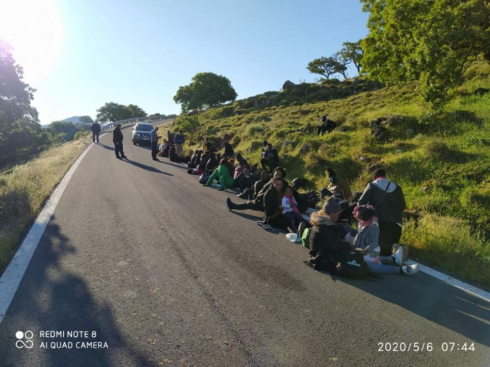
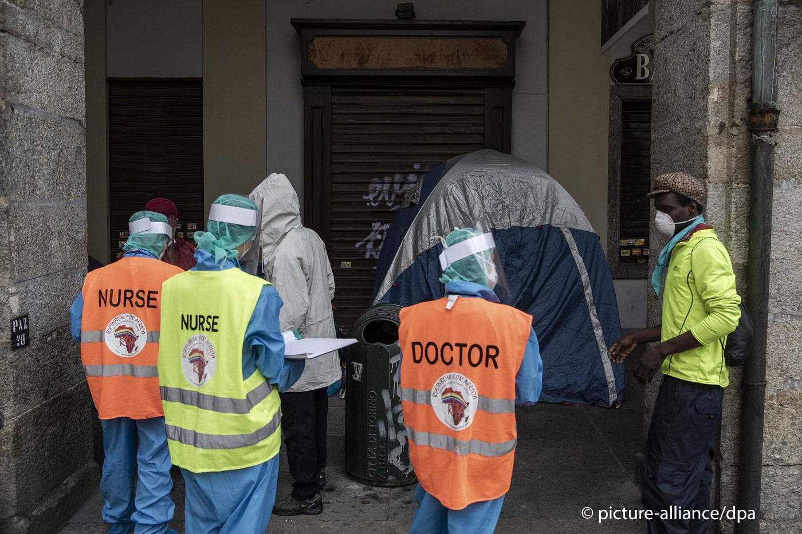
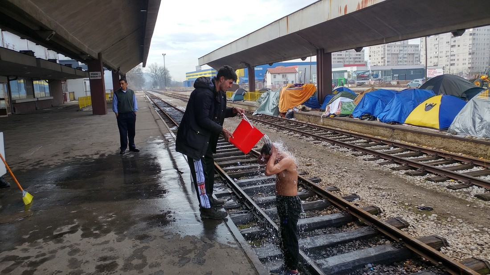

### AYS Daily Digest 12/05/20 Over 100 European Parliament members call for investigations into Greek shootings

](assets/7f182f014511/1*Prh-ub5n_BfmgVGsO2RDnA.jpeg)

People carrying away a shooting victim back in March; one of them died later on\. Photo by [Sky News](https://news.sky.com/story/they-shot-us-with-rifles-migrants-blame-greek-authorities-for-border-bloodshed-11949747)
### FEATURE: More than 100 European Parliament members have called for investigations into the shooting of migrants on the Greek\-Turkish border

The Greek government has responded with outrage to what it calls “fake news” \(sound familiar?\) but [SPIEGEL with teams](https://www.spiegel.de/politik/ausland/schuesse-an-griechischer-grenze-europaparlamentarier-fordern-eu-untersuchung-a-c9f01a22-ede4-415e-9dd1-4b9be309095d?fbclid=IwAR2It3YqYGuRNlO_tqhGiqIFnS_l7RO9obBLiszFbrJXtgdAi7fAKAqmQbk) from Forensic Architecture, Bellingcat and Lighthouse Reports have reported:

> [“\(We\) reconstructed](https://www.spiegel.de/politik/ausland/grenze-zwischen-griechenland-und-tuerkei-der-todesschuss-fall-muhammad-gulzar-a-75942fba-6caa-429c-9450-1d2251a5d96a) the death of the Pakistani migrant Muhammad Gulzar \. The researchers were able to view Gulzar’s autopsy report, talk to eyewitnesses and analyze around eight hours of video material\. 

> The reconstruction of March 4 shows in detail that live ammunition was fired, most likely by Greek border guards\. In all likelihood, Gulzar was hit by a Greek soldier’s bullet\. Six other migrants were wounded at the border fence within 37 minutes that day\. Several eyewitnesses reported that Greek border guards shot them\.” 

Most of the signatories are from left\-leaning parties, while more conservative parties are calling for a Greek government investigation, not an EU one\. AYS will continue to see how these calls for proper investigations play out\.

■■■■■■■■■■■■■■ 
> **[Tineke Strik](https://twitter.com/Tineke_Strik) @ Twitter Says:** 

> > More than 100 Members of European Parliament joined my call on the European Commission to immediately investigate the shootings at the Greek-Turkish border. We cannot tolerate that these findings are simply ignored by the responsible authorities. https://t.co/3xBF6eXSGJ 

> **Tweeted at [2020-05-12 11:58:42](https://twitter.com/tineke_strik/status/1260177579815899137).** 

■■■■■■■■■■■■■■ 

#### SEA
### IOM just released a report called “COVID\-19 Control Measures, Gap in SaR Capacity Increases Concern About ‘Invisible Shipwrecks’”

> “Measures implemented by governments in response to COVID\-19 including port closures, delays in disembarkation, and the reduced presence of search and rescue vessels on the increasingly busy Central Mediterranean route are [**raising serious concerns about the fate of vessels in distress and so\-called ‘invisible shipwrecks’\.**](https://www.iom.int/news/covid-19-control-measures-gap-sar-capacity-increases-concern-about-invisible-shipwrecks?fbclid=IwAR1ympBbuMLeviQ-oz__nnRNQoc9pYKFObLnhVkhIKBnoipMefCX2p1cFdA) 

> “We are seeing a steady increase in the number of vessels on the water that we are aware of, and the absence of dedicated state and NGO\-led search and rescue operations makes it difficult to know all that is happening at sea,’ said Frank Laczko, Director of IOM’s Global Migration Data and Analysis Centre\. 

> “The response to COVID\-19 has had a definite impact on our ability to collect accurate data\. The Central Mediterranean route remains the most dangerous maritime migration route on earth and in the current context, risks that invisible shipwrecks are occurring far from the view of the international community have grown\.’” 

 
 in East Med in April — 99% fewer than March\. Detections in EU lowest since 2009\. Record low numbers were mainly due to effects of \#Covid\_19, which have also delayed reporting of border crossing data by national authorities” Photo by [Giorgos Christides](https://twitter.com/g_christides/status/1260204458149064705)](assets/7f182f014511/1*Vb_51hnJS6z-CYLlwgPD6g.jpeg)

“Only c\. 40 migrant crossings were detected by [@Frontex](http://twitter.com/Frontex) 
 in East Med in April — 99% fewer than March\. Detections in EU lowest since 2009\. Record low numbers were mainly due to effects of \#Covid\_19, which have also delayed reporting of border crossing data by national authorities” Photo by [Giorgos Christides](https://twitter.com/g_christides/status/1260204458149064705)
#### GREECE

![**“Two refugees who arrived in Kalo Limani, Lesvos north west on May 6th, has tested positive for COVID\-19\.** They arrived last Wednesday together with 49 others, 9 people out of 51 was routinely tested, two was positive, but without any symptoms\. They where taken to the new quarantine site in Megales Thermis, between Eftalou and Skala Sikamineas on Lesvos north, where they were supposed to stay in quarantine for 14 days\. **The 19 people who arrived on Sunday in Lapsarna was also taken to the same quarantine area\. It’s unknown if people arriving on different dates are being held separately instead the quarantine area\.** All 70 residents in quarantine facility will now be tested for COVID\-19, alongside with coast guard officials and workers who may have come in contact with the new arrivals\. **It’s clear that there must be found a second quarantine structure on the island, for new arrivals, if a new boat arrives now, they can’t be quarantined in the existing structure due to the virus\.** The existing quarantine area in the old IRC structure took months to find, it’s crucial that this second area is found immediately\.” By [Aegean Boat Report](https://www.facebook.com/AegeanBoatReport/posts/830853427437763?hc_location=ufi)](assets/7f182f014511/1*OMvm4imwkL1hM0rr9bf1Xw.jpeg)

**“Two refugees who arrived in Kalo Limani, Lesvos north west on May 6th, has tested positive for COVID\-19\.** They arrived last Wednesday together with 49 others, 9 people out of 51 was routinely tested, two was positive, but without any symptoms\. They where taken to the new quarantine site in Megales Thermis, between Eftalou and Skala Sikamineas on Lesvos north, where they were supposed to stay in quarantine for 14 days\. **The 19 people who arrived on Sunday in Lapsarna was also taken to the same quarantine area\. It’s unknown if people arriving on different dates are being held separately instead the quarantine area\.** All 70 residents in quarantine facility will now be tested for COVID\-19, alongside with coast guard officials and workers who may have come in contact with the new arrivals\. **It’s clear that there must be found a second quarantine structure on the island, for new arrivals, if a new boat arrives now, they can’t be quarantined in the existing structure due to the virus\.** The existing quarantine area in the old IRC structure took months to find, it’s crucial that this second area is found immediately\.” By [Aegean Boat Report](https://www.facebook.com/AegeanBoatReport/posts/830853427437763?hc_location=ufi)

[Samos Volunteers](https://medium.com/@communications_72867/three-fires-in-samos-camp-open-letter-to-the-european-commission-566e737c9d75) along with 15 other NGOs have signed and written a letter to the European Commission calling for a serious response to the chaos after the three fires in Samos camp\. They report:

> “The three fires that broke out two weeks ago are recent examples of existing tensions reaching their boiling point\.” 

> “ **Once again, we stand together in calling upon the European Commission to urgently assist Greece in evacuating the 38,700 people living in the camps of the Aegean Islands to appropriate facilities of sufficient sanitary standards, starting with those most at risk to COVID\-19\.** 

> Sustainable political solutions involving Member State responsibility and relocation mechanisms are required to achieve long\-term decongestion of the islands\. But now is the time for emergency action\.
 

> The response of European Member States to COVID\-19 shows how quickly policy can change to protect society’s most vulnerable\. The EU must act now to ensure the safety of the 38,700 asylum\-seekers living on the Aegean Islands in accordance with the European Convention on Human Rights\.” 

 \. The majority of the population are from [\#Afghanistan](https://twitter.com/hashtag/Afghanistan?src=hashtag_click) \(78%\), [\#Syria](https://twitter.com/hashtag/Syria?src=hashtag_click) \(8%\) \+ [\#Somalia](https://twitter.com/hashtag/Somalia?src=hashtag_click) \(4%\) \. Women account for 23% of population \+ children for 41%\( \! \) \. According to UNHCR approx\. 11% of children are unaccompanied\.” Photo and info by [Franziska Grillmeier](https://twitter.com/f_grillmeier/status/1260135605561942016?fbclid=IwAR3_fI872maMjQgHyuf8ByFY7I6WdZrG6xVfW0zm5qWWmRd15-HblIXNyDY)](assets/7f182f014511/1*9s8GuKIdpOL-X7JpotLf-g.jpeg)

“Recent numbers: ~ 19,000 refugees are seeking asylum on [\#Lesbos](https://twitter.com/hashtag/Lesbos?src=hashtag_click) \. The majority of the population are from [\#Afghanistan](https://twitter.com/hashtag/Afghanistan?src=hashtag_click) \(78%\), [\#Syria](https://twitter.com/hashtag/Syria?src=hashtag_click) \(8%\) \+ [\#Somalia](https://twitter.com/hashtag/Somalia?src=hashtag_click) \(4%\) \. Women account for 23% of population \+ children for 41%\( \! \) \. According to UNHCR approx\. 11% of children are unaccompanied\.” Photo and info by [Franziska Grillmeier](https://twitter.com/f_grillmeier/status/1260135605561942016?fbclid=IwAR3_fI872maMjQgHyuf8ByFY7I6WdZrG6xVfW0zm5qWWmRd15-HblIXNyDY)

Here is an insightful piece from Mare Liberum’s new interview with activists from Welcome2Europe titled “Lesvos 2020 — A retrospective on the developments on the island over the past few months” \(check out in full [here](https://mare-liberum.org/en/news/lesbos-2020-ein-rueckblick-auf-die-entwicklungen-der-letzten-monate) \) \.

> “Q → Which events were decisive?
 

> A → The joint resistance by different parts of society against the attempts to enforce the construction of the new prison by police force was decisive and successful\. This made the fascists and racists believe, strengthened through the resistance of the many, that they can now take everything into their own hands\. They reacted with road blockades around Moria, attacks on refugees, NGOs and cars, and then further road blockades\. They have been cheered on and encouraged by the mayor and have not been stopped by the justice system for far too long\.” 

](assets/7f182f014511/1*WKrVEJJGCJdRT_qeoLanIg.jpeg)

“A friend living in the Kos camp has just sent this to me, it’s a poster which has been put up around camp\.
 
I am wondering how it’s acceptable to deny people food and shelter for not registering? 3 days to register & after checks by police & food & shelter forfeited if not?” Photo by [Katy Fallon](https://twitter.com/katymfallon/status/1260180135946354688)

](assets/7f182f014511/1*NGc27SeJTGMmAAvPAvtddA.png)

“Today is the international day of nurses and we all should thank and commemorate the great job nurses in Lesvos and the other islands did during these difficult times\. They worked day and night and helped that none of our islands was hit hard from the virus\. They and all the medical staff did a great almost impossible work for everyone on the island\. This is a picture from Mytillini Hospital taken by Stonisi\.” Photo and words by [Stand by me Lesvos](https://www.facebook.com/www.standbymelesvos.gr/photos/a.246519512607745/630504914209201/?type=1&theater)

Three NGOs in Athens were raided by Greece’s National Transparency Authority and the Economic Police for investigations concerning economic wrong doing\. These NGOs assist refugees and manage shelters\. Greek media reports that _“\(The NGOs\) also say that the Greek state is being taken to court for breaching an agreement on the funding of the two shelters\.”_ More [here\.](https://www.ekathimerini.com/252583/article/ekathimerini/news/transparency-watchdog-investigates-three-ngos?fbclid=IwAR2zcrfgJEfhSL-pJ3-V9QcQq8DB03xWy_52tfZ3D-VG_B4AzUEYQyxSCIA)

](assets/7f182f014511/1*Ty0y-eNCi5dSki_QCdmxUA.jpeg)

“The Ministry of Migration and Asylum publishes the April 2020 newsletter, with data on immigration flows, the total number of people staying at the Reception and Identification Centers \(RIC\), transportation to the mainland, and data related to the examination of asylum applications and appeals\.” Photo by [Migration Greece Info](https://www.facebook.com/migrationgovgr.info/posts/1615543421933090?hc_location=ufi)

Want to listen to a good summary podcast about what’s been going on in Greece with new arrivals? Check out this episode of [Darnell Responds](https://www.buzzsprout.com/883435/3725354-a-humanitarian-crisis-how-is-greece-handling-the-impact-of-migration-to-europe?fbclid=IwAR0wsWIFMXHvYkYzocW6aXh0QinAbAAch7q2S6rewysYoJRlgnPj6qxNoJw) 
“A Humanitarian Crisis: How is Greece handling the impact of migration to Europe?”
#### ITALY

![“A hundred migrants and homeless people who were hosted until 3 May at the Emergenza Freddo facility in Piazza d’Armi in Turin, Italy, are now without a roof over their heads\. Since the day of closure, some of them have been sleeping in front of city hall, camped under the arcades\. On May 11, some migrants are seen holding up banners, asking for ‘sanatoria’ \(amnesty\) \. One sign read: ‘There is no worse virus than the lack of humanity’; another read ‘We are not invisible’\.” By InfoMigrants and photos by Marco Alpozzi/LaPresse via ZUMA Press](assets/7f182f014511/1*GZyaDRWN0pg6vDlazIcWdg.jpeg)

“A hundred migrants and homeless people who were hosted until 3 May at the Emergenza Freddo facility in Piazza d’Armi in Turin, Italy, are now without a roof over their heads\. Since the day of closure, some of them have been sleeping in front of city hall, camped under the arcades\. On May 11, some migrants are seen holding up banners, asking for ‘sanatoria’ \(amnesty\) \. One sign read: ‘There is no worse virus than the lack of humanity’; another read ‘We are not invisible’\.” By InfoMigrants and photos by Marco Alpozzi/LaPresse via ZUMA Press
#### BALKANS
### Border Violence Monitoring Network just published a special report entitled: ‘COVID\-19 AND BORDER VIOLENCE ALONG THE BALKAN ROUTE\.’

[No Name Kitchen](https://www.facebook.com/NoNameKitchenBelgrade/posts/979660695765548?hc_location=ufi) \(a prominent aid organization in the region\) stresses that some of the most important things that this report covers are:

“\-Paint tagging of transit groups by Croatian police and infected officers working in the border area
\-Army garrisoning of camps in Serbia and the proposed militerisation of the Slovenian border
\-Pushbacks from camps on the Greek mainland to Turkey
\-Chain expulsions from Serbia
\-Sealed camps and inadequate conditions in Bosnia”

[The network](https://www.borderviolence.eu/special-report-covid-19-and-border-violence-along-the-balkan-route/?fbclid=IwAR2C0zpFVLEx9cSSeGm90sXVfFkUFcRgxRL-sOxOD80c6vZR3U_hOiSUuXw) also stresses that:

> “This new report shares first hand testimony of people\-on\-the\-move who are experiencing the COVID\-19 lockdown in transit\. Its scope looks at the way restrictive measures disproportionately affect vulnerable persons in camps and at borders\. Further, analysis of various countries from the region shows how COVID\-19 measures have also been utilised to shape and erode the fundamental rights of these communities\.” 

](assets/7f182f014511/1*QGgODBhQC68uFRjgcLJPPw.jpeg)

Photo by [Border Violence Monitoring Network](https://www.borderviolence.eu/special-report-covid-19-and-border-violence-along-the-balkan-route/?fbclid=IwAR2C0zpFVLEx9cSSeGm90sXVfFkUFcRgxRL-sOxOD80c6vZR3U_hOiSUuXw)
#### BOSNIA AND HERZEGOVINA

Refugees camping in the open in Tuzla, Bosnia and Herzegovina\.

[The international aid organization CARE](https://www.care-international.org/news/press-releases/stranded-and-forgotten-bosnias-migrants-and-refugees-left-to-themselves?fbclid=IwAR19ho68BkLIA14uUeL5NJXJDgr5G9Xcp_SGQbrnP6D6c9e9JbHLD7lHyMk) expresses their concern over the refugees currently in Bosnia and Herzegovina:

> “CARE is deeply concerned about the safety and health for over 7,000 refugees and migrants in Bosnia and Herzegovina\. The situation is particularly dire for those who live outside of the official camps\. **A field study by CARE has shown that in Tuzla, in Northern Bosnia, over three\-quarters of refugees and migrants do not have sufficient access to clean drinking water\.** There is also no adequate access to sanitation and basic hygiene\. The study shows that for the majority of men, women and children, the absolute minimum standards of safe shelter and basic nutrition aren’t met\. **In January, Bosnia and Herzegovina recorded 30 per cent more arrivals of refugees and migrants than in the same period the year before\.** 

> ‘A camp with capacity for 1,600 people is now housing over 3,000 people\. Social distancing is impossible here’, reports Tim Clancy, from Promiz\.ba, a partner organization of CARE\. ‘Those outside of camps live in hiding, in constant fear of being sent to an overcrowded camp where the risk of infection would be much higher\. **The situation on the streets is also very difficult, only a handful of volunteers can reach the refugees** \.’” 

#### GERMANY

Human rights groups are calling for the closure of some prominent asylum seeker accommodation centers because of the immediate danger their residents face from COVID\-19\. In one centre, 78 our of 81 people have tested positive and are forced to wear wrist bands in public\. More [here](https://www.infomigrants.net/en/post/24699/germany-rights-and-health-of-asylum-seekers-under-threat-in-mass-camps?fbclid=IwAR28NA7yxKqrWIkYMay3jGWX8XgzKP0VPs_guvVdZ04D-C-a1iuva-xmtx0) \.
#### PORTUGAL

■■■■■■■■■■■■■■ 
> **[Daphne Tolis](https://twitter.com/daphnetoli) @ Twitter Says:** 

> > Portugal is to take in 500 unaccompanied minors from Greek refugee camps as soon as restrictions on movement imposed to contain the spread of the coronavirus outbreak are lifted, the country's Foreign Minister Augusto Santos Silva said on Tuesday - @[Reuters](https://twitter.com/Reuters) 

> **Tweeted at [2020-05-12 22:35:12](https://twitter.com/daphnetoli/status/1260337760591908864).** 

■■■■■■■■■■■■■■ 

#### GENERAL

](assets/7f182f014511/1*R-4YiNe4eIqWl1lUMzFEKQ.jpeg)

“The impact of \#Covid\_19 on the lives of \#refugees & \#migrants across West Africa, North Africa, & Latin America — in their own words” Photo by [Mixed Migration Centre](https://twitter.com/Mixed_Migration/status/1260157295729823744)

In [Mixed Migration Centre’s](http://www.mixedmigration.org/wp-content/uploads/2020/05/100_Covid_Snapshot_Global_2.pdf?fbclid=IwAR0_QHoeAEBYbSWGnhOVJPOWZSuHBX7RcJETZziL1SGCBMfF9jXPFWon2T8) COVID\-19 global update \#2 they found that:

> “→ Interviewed refugees and migrants across all three regions are well aware of the coronavirus\. A large majority considers they know how to protect themselves and others, though this proportion is lower among respondents in West Africa \(81%\), and particularly Burkina Faso \(75%\), than in Latin America \(98%\) and North Africa \(85%\) 

> → Protective measures taken by refugees and migrants vary widely across regions\. Staying at home and isolating from others is much more frequent in Latin America \(89%\) than in North Africa \(57%\) and West Africa \(11%\) \. Similarly, in Latin America 90% of respondents think they can keep 1\.5 metre distance from others, while in North Africa \(47%\) and West Africa \(34%\) these percentages are much lower\.” 

■■■■■■■■■■■■■■ 
> **[John T Psaropoulos](https://twitter.com/JTPsaropoulos) @ Twitter Says:** 

> > #EU recognition rates for protection of #asylum applicants are falling. In Q1 2020 the EU approved 28% of applications, down from 31% in Q4 2019 and 35% in Q1 2019. Source: #EASO (European Asylum Support Office). [easo.europa.eu/latest-asylum-…](https://easo.europa.eu/latest-asylum-trends) 

> **Tweeted at [2020-05-12 16:24:20](https://twitter.com/jtpsaropoulos/status/1260244426825371648).** 

■■■■■■■■■■■■■■ 

**Find daily updates and special reports on our [Medium page](https://medium.com/are-you-syrious) \.**

**If you wish to contribute, either by writing a report or a story, or by joining the info gathering team, please let us know\.**

**We strive to echo correct news from the ground through collaboration and fairness\. Every effort has been made to credit organisations and individuals with regard to the supply of information, video, and photo material \(in cases where the source wanted to be accredited\) \. Please notify us regarding corrections\.**

**If there’s anything you want to share or comment, contact us through Facebook, Twitter or write to: areyousyrious@gmail\.com**

_Converted [Medium Post](https://medium.com/are-you-syrious/ays-daily-digest-12-05-20-over-100-european-parliament-members-call-for-investigations-into-greek-7f182f014511) by [ZMediumToMarkdown](https://github.com/ZhgChgLi/ZMediumToMarkdown)._
