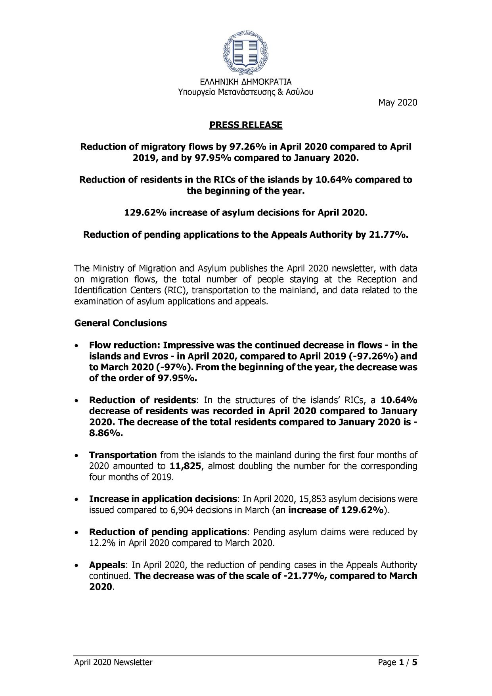
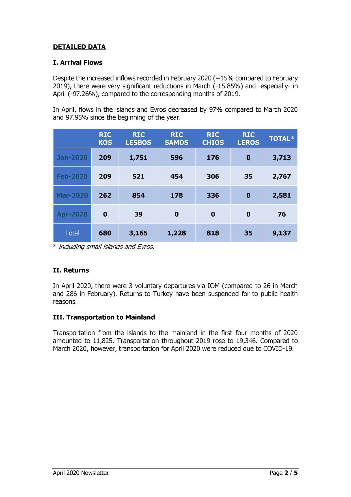
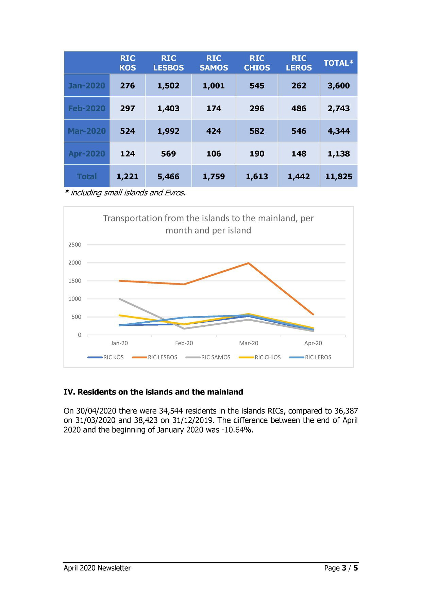
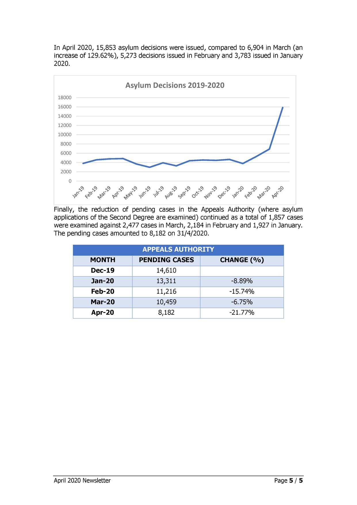
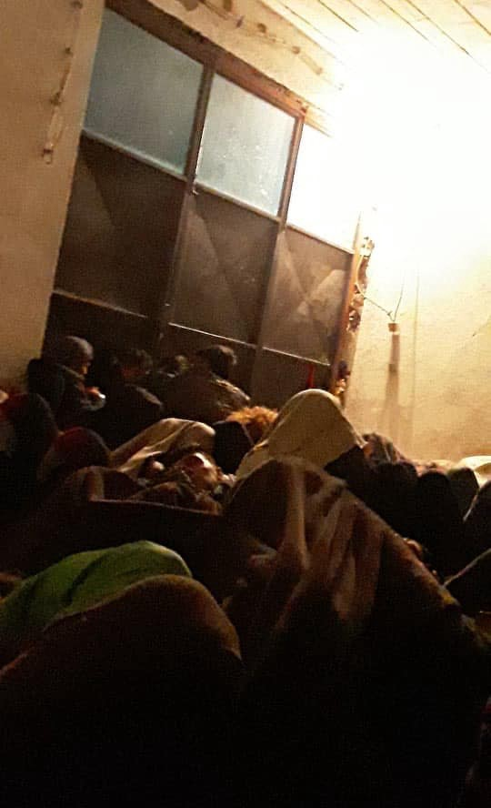

### AYS Daily Digest 13/5/20: Placement in transit zones is an unlawful detention, CJEU rules
#### MSF reports on the tragic attack at a maternity ward of a hospital in Kabul / The misleading UK excuses for not taking responsibility for UASCs from Greece / Portugal to take in 500 unaccompanied minors from Greece—children of immigrants living in Portugal for one year will be registered as Portuguese / & more news

](assets/5a5d074f1823/0*u05SkmEFBtHOs8Qa)

Photo via [Facebook user](http://Lagkadikia Camqu Hama)
#### FEATURED

**Hungary** — On the morning of publishing this News Digest, we learned that the Court of Justice of the European Union delivered its judgment today in [the joint cases](http://curia.europa.eu/juris/documents.jsf?num=C-924/19) concerning two asylum\-seeking families held in the transit zone in Röszke, at the Hungarian\-Serbian border, Hungarian Helsinki Committee \(HHC\) reported\. They represented the applicants in the cases that originate in preliminary ruling requests lodged by Hungarian judges in December 2019\.

> The Hungarian judges asked the CJEU to rule on whether placement in the country’s two land\-border transit zones constitutes detention, among other questions\. The judgment confirms the HHC’s legal position and leaves no doubt that a placement in the transit zone is, in fact, unlawful detention\. 

Read more [here\.](https://www.helsinki.hu/en/hungary-unlawfully-detains-people-in-the-transit-zone/)

■■■■■■■■■■■■■■ 
> **[HunHelsinkiCommittee](https://twitter.com/hhc_helsinki) @ Twitter Says:** 

> > CJEU: HU authorities unlawfully detain and deprive of a fair asylum procedure hundreds of people, many of them children in the transit zones. Thousands had to go through this unlawful and inhuman system since 2015, today hopefully marks the end of years of struggle &amp; suffering! 

> **Tweeted at [2020-05-14 07:57:20](https://twitter.com/hhc_helsinki/status/1260841613309468672).** 

■■■■■■■■■■■■■■ 

**Portugal** — Portugal will receive 500 unaccompanied minors from Greece after COVID restrictions end, as has been confirmed\. 
The first relocations took place last month when 12 minors were transferred to Luxembourg\. Since then, Germany has received around 50 children, although it turned out they didn’t respect the previously stated decision that they would take in the most vulnerable cases who have no other option, but instead took in children, many of whom were eligible to come to Germany anyway bthrough family reunification\. However, Portugal [now aims to take in](https://www.tsf.pt/portugal/sociedade/portugal-vai-receber-500-menores-da-grecia-12185778.html?fbclid=IwAR3K3BPIwHoyaA3VP0Sz_ckLUXeU-OMNgI0iAxJd-wAj4df1EBbGlHJ8BWI) approximately 10 percent of the estimated number of unaccompanied minors currently in the camps at the Aegean islands\.
In the meantime, it was also decided that children of immigrants living in Portugal for one year will be registered as Portuguese\. Read more [here](https://l.facebook.com/l.php?u=https%3A%2F%2Fwww.abola.pt%2FMundos%2F2020-05-12%2Frevista-de-imprensa-filhos-de-imigrantes-a-residir-ha-um-ano-em-portugal-serao-p%2F844169%3Ffbclid%3DIwAR0k47SZNTQc2LqgbbAPhuHuTpMqDKEFRJ3GitqeZ5PmyRf_EY3ORGJbQkQ&h=AT1i8iResmoEK5yOunYHZcW8qy1JLCvWr0J6-JJ3BdzC4qT11M53rVjZ3VLCtj_t981RpviYnrNbXNdok9kjYOINNPAUUZ80PbVpBttzOBc01Qi29FnEoEMMbSmC-2YVtA) \.
#### AFGHANISTAN
### MSF reports on the tragic attack at a maternity ward of a hospital in Kabul

An unknown number of attackers stormed our maternity ward at Dasht\-e\-Barchi Hospital in Kabul, reports the local MSF team\. Several patients have reportedly been killed and at least one MSF staff member is possibly also among the dead\. For the time being, medical activities in the maternity ward of Dasht\-e\-Barchi Hospital are suspended, but not closed\. Patients were evacuated to surrounding hospitals and the staff were brought to safety\.
Please, take time to read their entire report on the grisly chain of events in Kabul [here\.](https://www.msf.org/revolting-attack-maternity-ward-afghanistan?fbclid=IwAR1Sq7uwBRel3PReWUn0h7COR3ZPtxsSbbg0q-g8P7zFXclPhZwUblzgqoM)
#### EU

**A report by the European Asylum Support Office \(EASO\) establishes that there could be increases in asylum applications in the EU in the future\.** 
According to EASO’s findings, the countries that implemented the biggest number of emergency measures since March 2020 also had the largest fall in application numbers\. Countries like Greece even put a [temporary freeze on asylum applications](https://www.infomigrants.net/en/post/23810/greece-ends-month-long-freeze-on-asylum-applications) while addressing the pandemic situation\.

**EASO** and the Greek Government agreed to an amendment to the [Greek Operating Plan](https://easo.europa.eu/sites/default/files/EL_OP_2020_final.pdf) which allows for the Agency **to facilitate the relocation of 1,600 unaccompanied minors from Greece** to participating EU Member States in the [scheme](https://ec.europa.eu/commission/presscorner/detail/en/ip_20_406) \. Talking about the project, the EASO said this scheme will “not only show tangible European solidarity for Greece, but will also provide 1,600 vulnerable children with a chance for a safe new life\.” However, some of the states have since the initial announcement halted any further communication on that subject or concrete steps, while there are still countries that didn’t pledge to take a single child from the horrible camps of the Aegean islands\.
### IOM concerned about upholding human rights during COVID\-19

> The United Nations Network on Migration is concerned by reports of States in many regions using forced return of migrants as a measure in response to COVID\-19\. The Network calls on States to suspend forced returns during the pandemic, in order to protect the health of migrants and communities, and uphold the human rights of all migrants, regardless of status\. Successfully tackling the pandemic cannot be achieved without upholding human rights\. 

This is part of the [recent press release by IOM](https://www.iom.int/news/forced-returns-migrants-must-be-suspended-times-covid-19?fbclid=IwAR07gc9jCpbgbqTIbcHYvH74ypnouLiVDHNVsnT96eHhSLVKZKEJn37AFKA) , which comes as a surprise if we take into account the number of accusations of obstructing just, fair and humane treatment of people stuck in IOM\-run camps across the so\-called Balkan Route\. And while we agree that forceful returns should not only be suspended, but should not be a method at all for handling people’s requests for international protection, we find it hard to believe that an organisation with such funds, reach and power would be so oblivious to what takes place in their own camps and fail to address it publicly, leaving the small, worried and interested community among the nations paying for the UN agency’s work without any explanation, insight or transparency, during COVID\-19, before and very likely after the coronavirus crisis ends, but this one continues\.
#### GREECE
### Investigation into a death at the Greek\-Turkish border

Forensic Architecture has released a report \(in partnership with Spiegel, Lighthouse Reports and Bellingcat\) concerning the killing of Muhammad Gulzar, a Pakistani citizen who had until recently lived in Greece\. Lawyers representing the family of Muhammad Gulzar will request that Greece launch an investigation to establish who was responsible for his killing, as Forensic Architecture reports\. Find the entire investigation document [here](https://forensic-architecture.org/investigation/the-killing-of-muhammad-gulzar) \.

■■■■■■■■■■■■■■ 
> **[Forensic Architecture](https://twitter.com/ForensicArchi) @ Twitter Says:** 

> > Our latest investigation shows Greek forces likely fired live rounds at migrants at the Evros/Meriç border fence on the 4th March 2020, wounding several people and killing Mohammad Gulzar, from Pakistan. 
[vimeo.com/416133368](https://vimeo.com/416133368) 

> **Tweeted at [2020-05-08 13:31:28](https://twitter.com/forensicarchi/status/1258751373664976897).** 

■■■■■■■■■■■■■■ 

Their work prompted some reactions from the EU level:

■■■■■■■■■■■■■■ 
> **[Tineke Strik](https://twitter.com/Tineke_Strik) @ Twitter Says:** 

> > More than 100 Members of European Parliament joined my call on the European Commission to immediately investigate the shootings at the Greek-Turkish border. We cannot tolerate that these findings are simply ignored by the responsible authorities. https://t.co/3xBF6eXSGJ 

> **Tweeted at [2020-05-12 11:58:42](https://twitter.com/tineke_strik/status/1260177579815899137).** 

■■■■■■■■■■■■■■ 

### Pushbacks still present on land and at sea

> In the last weeks there were very few landings on the Greek islands, and more and more reports about pushbacks are coming to light\. While pushbacks have occurred from time to time, even with the presence of the EU border agency Frontex there are now three reports of pushbacks of people who had already landed \( [Simi 23rd March](https://www.facebook.com/AegeanBoatReport/posts/797480504108389) , [Samos 28th April](https://www.facebook.com/AegeanBoatReport/posts/797480504108389) \) \. Meanwhile, there are also reports about pushbacks on the mainland, which show that people have been illegally deported from inland camps back to Turkey \( [Report here](https://www.borderviolence.eu/press-release-documented-pushbacks-from-centres-on-the-greek-mainland/#more-14563) \) \. All together this marks a new quality of pushbacks in Greece\. — [_Read more\._](https://mare-liberum.org/en/news/pushbacks-in-the-aegean-reached-a-new-level-of-severity-pushback-of-14-people-documented-who-had-reached-the-shores-of-chios-already?fbclid=IwAR1xKE0j12PYaTwN-5r-7RsI3DEyM6k7ZpLK3OTrQgETL3nEbRG1QjyEWbE) 

■■■■■■■■■■■■■■ 
> **[Mare Liberum e.V.](https://twitter.com/teammareliberum) @ Twitter Says:** 

> > 🔴There is strong evidence that 14 #migrants were pushed back to Turkey by the @[HCoastGuard](https://twitter.com/HCoastGuard) after they had already arrived on the island of #Chios on April 30. 

We collected evidence &amp; testimonies of the circumstances in a detailed timeline of events:

[mare-liberum.org/en/news/pushba…](https://mare-liberum.org/en/news/pushbacks-in-the-aegean-reached-a-new-level-of-severity-pushback-of-14-people-documented-who-had-reached-the-shores-of-chios-already) 

> **Tweeted at [2020-05-13 14:45:45](https://twitter.com/teammareliberum/status/1260582005022035973).** 

■■■■■■■■■■■■■■ 

### Riots by young people at a centre in northern Evros

Young asylum\-seekers rioted on Tuesday morning at the Reception and Identification Center of Fylakio in northern Evros\. They set mattresses in the ward for unaccompanied minors on fire and the intervention of the fire service was required to extinguish the blaze, as the Greek media [report\.](https://www.keeptalkinggreece.com/2020/05/12/evros-asylum-seekers-riot) 
According to the locals and the local media, the living conditions are one of the reasons for the protest, including a recent slow\-down of procedures during which they are held in the squalid conditions of the area detention centre\. Find more on the story [here](https://www.keeptalkinggreece.com/2020/05/12/evros-asylum-seekers-riot) \.
### Official data

The Ministry of Migration and Asylum published their April 2020 newsletter, with data on immigration flows, the total number of people staying at the Reception and Identification Centers \(RIC\), transportation to the mainland, and data related to the examination of asylum applications and appeals\.

](assets/5a5d074f1823/1*bZsAH3Sez-23xBqCcRbFog.jpeg)

via [Migration Greece Info](https://www.facebook.com/migrationgovgr.info/?tn-str=k%2AF&hc_location=group_dialog)
#### BOSNIA AND HERZEGOVINA

In Bihać, those who managed to leave the Lipa camp and attempt to continue on their journey, are apparently being stopped by the Bosnian police who now hold them inside spaces such as the one shown on the picture sent to a Bosnian volunteer who reports having received several similar messages saying those caught outside official camps were detained \(with no information, food, water or other basic necessities\) inside such places and later taken to the Lipa tent campsite outside the city of Bihać\. There are so far no official comments on this report of more torture practices inside the limbo of the Bosnian\-Croatian border area and nearby towns\.

#### FRANCE
### The final decision of the Appeal Court of Lyon is to acquit Cédric Herrou

“The case against Cédric Herrou is emblematic of how acts of solidarity have become criminalized across Europe, therefore the significance of today’s decision will be felt far beyond this courtroom\.” Read the Amnesty International [statement](https://www.amnesty.org/en/latest/news/2020/05/france-acquittal-of-farmer-who-helped-asylum-seekers-shows-that-solidarity-is-not-a-crime/?fbclid=IwAR33yoPefUlRkRYYWst-g20odqSbbd8r5YywHItLWC_h8w62cQfew__ddG4) on the occasion of the final legal decision on the matter\.
### Interim measure by the ECHR in several cases on Samos

Our team has been petitioning the European Court of Human Rights for interim measures on behalf of several extremely vulnerable beneficiaries over the past few weeks, writes Legal Centre Samos\. This procedure is aiming to improve their poor living conditions, which have been made even worse by the recent fires in Samos camp\. The current situation can be witnessed in the images below, taken by our beneficiaries themselves and shared here with their permission\.

We’re happy to share this decision, concerning a pregnant woman living in the jungle area of the camp\. The Court decided to grant an interim order indicating to the Greek Government to at least guarantee to the applicant living conditions compatible with her state of health and provide the applicant with adequate healthcare\.
#### UK
### Distinguish between relocation and family reunification and proceed with concrete action

UK government officials have been willfully misleading the public by stating they would honour relocations by proceeding with family reunification, which is nowhere nearly the same thing\. 
However, written questions allow Members of Parliament to ask government ministers for information on the work, policy and activities of government departments\. Following the advocacy efforts by Safe Passage and others, the following two questions have been submitted in written form to the House of Lords by Lord Bishop of Durham:

> Lord Bishop of Durham to ask Her Majesty’s Government what steps they have put in place to ensure that children can continue to be transferred to the UK under Section 67 of the Immigration Act 2016 during the coronavirus pandemic? 

> Lord Bishop of Durham to ask Her Majesty’s Government what assessment they have made of the implications of successful transfers of separated children from Greece to other European Countries under the European Commission’s relocation scheme for transfers of separated children to the UK? 

Previously 47 people categorised as “highly vulnerable” have arrived in the UK on an “unprecedented” family reunion flight from Greece, it was [reported](https://l.facebook.com/l.php?u=https%3A%2F%2Fwww.theguardian.com%2Fglobal-development%2F2020%2Fmay%2F11%2Frefugee-families-reunited-in-uk-after-rescue-flight-from-greece%3Ffbclid%3DIwAR2GjVkO4fSl8G3heZenSMpxg-UkqPSS22YrhFzekDIrzNIX9nPGl2SPIY0&h=AT0-b4Bvv2-CnBIQVAQK-af-dYAV7jGfITvf3kKYIjV1p4FnC8ueVgeVofvfz41ThrHvArleRSfzskLbrt4oZ9AJYzy-0cglReYBYQpy7hbntDVoy5k4aYCimLn6jgjIVxk) \. The reunion was the result of two months of intense lobbying by the campaign group Safe Passage and the British peer Alf Dubs\.

**Find daily updates and special reports on our [Medium page](https://medium.com/are-you-syrious) \.**

**If you wish to contribute, either by writing a report or a story, or by joining the info gathering team, please let us know\.**

**We strive to echo correct news from the ground through collaboration and fairness\. Every effort has been made to credit organisations and individuals with regard to the supply of information, video, and photo material \(in cases where the source wanted to be accredited\) \. Please notify us regarding corrections\.**

**If there’s anything you want to share or comment, contact us through Facebook, Twitter or write to: areyousyrious@gmail\.com**

_Converted [Medium Post](https://medium.com/are-you-syrious/ays-daily-digest-13-5-20-placement-in-transit-zones-is-an-unlawful-detention-cjeu-rules-5a5d074f1823) by [ZMediumToMarkdown](https://github.com/ZhgChgLi/ZMediumToMarkdown)._
