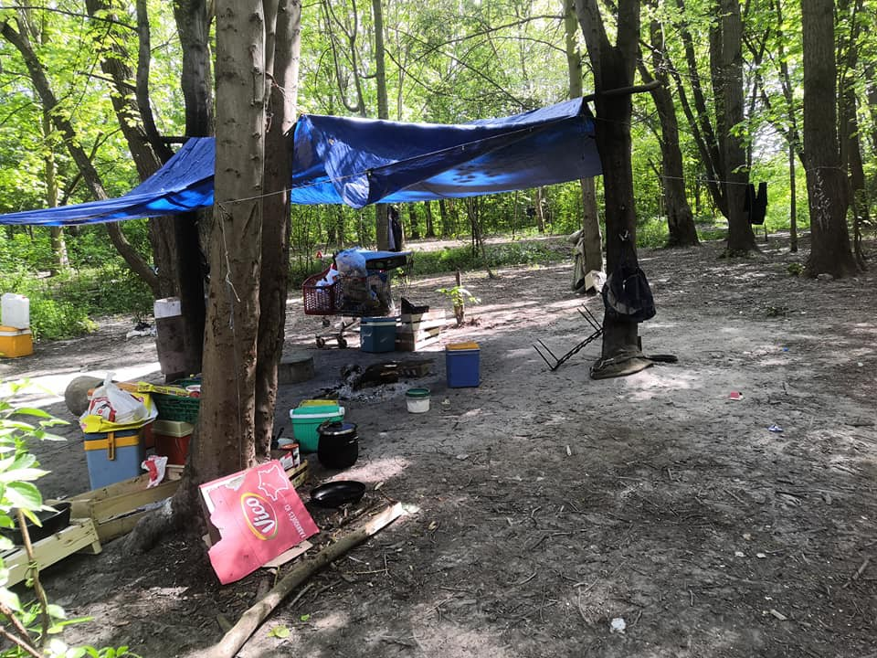
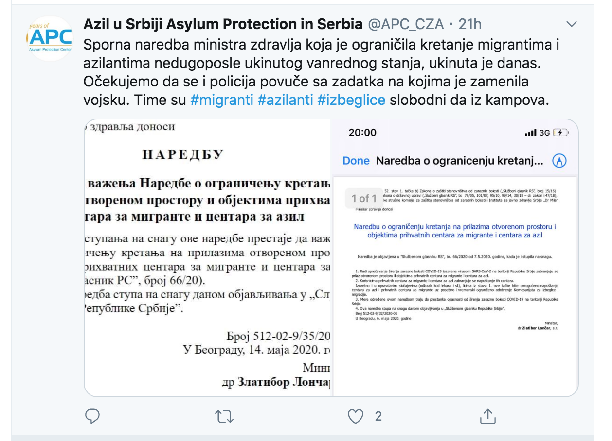

### AYS Daily Digest 14/05/20: Another death related to the official camps in Bosnia and Herzegovina
#### A boy died entering Miral camp in Velika Kladuša // Updates from Moria // Reports of pushbacks in Aegean Sea // Disappointing but foreseeable reaction by Croatia to allegations of violent pushbacks // Sanatoria for illegal field workers in Italy // conditions in CETIs in Melilla and Ceuta // & more news

This is how people live in Grande\-Synthe, France\. If you would like to volunteer, please see below\! \(Photo: Utopia 56\)
#### FEATURED
### Death of a minor who tried to enter a camp in Velika Kladuša

A boy whose name was Ahmed died last night trying to enter the camp Miral in Velika Kladuša\. Locals who knew the boy said he was trying to enter the camp in order to have a shower before attempting to leave Bosnia and Herzegovina: alone, unsupported and without a lot of money to buy him protection at the border or a passport to travel otherwise\. Since he didn’t have a ticket to enter through the camp’s main entrance, he used an alternative entrance, likely fearing both harsh treatment from camp security and the police who would have hassled him for sleeping rough on the street\.

Ahmed was fatally injured while trying to get through a fence into the camp\. He most probably suffocated between the bars, as the first reports said\. The exact cause of death will only be confirmed after an autopsy, if one is ordered\.

We don’t yet know details about this boy’s life, or his death\. But his fate seems to be another tragic example of what desperation and fear on behalf of a people left behind by governments and the E\.U\. can engender\. We call for more transparency and investigations into migrant camps in Bosnia and Herzegovina, both from local authorities and the international organisations in charge\.

When such tragic events occur, those in charge inevitably release a statement that doesn’t say or mean much\. However, what better report on the protection and treatment of the people on the move do you need than the death of a minor — within the fence of a UN\-agency\-managed camp he couldn’t enter through the main doors? It is likely that you, reader, come from one of the UN members whose agencies are funded by your money as well\. Don’t you wonder what’s going on?
### BVMN comments on the foreseeable reaction by the Croatian Ministry of Interior against allegations of violent pushbacks

After the Guardian published an article about the practice of spraying the heads of people who try to cross the border from Bosnia and Herzegovina into Croatia with orange paint, alongside an extensive use of violence, the Croatian Ministry of the Interior [reacted in a less than surprising manner](https://mup.gov.hr/news/response-of-the-ministry-of-the-interior-to-the-article-published-on-the-online-edition-of-the-british-daily-newspaper-the-guardian/286199?fbclid=IwAR1tsQCpLtK_W9uQg5TRTLwv3MbQiPekL74VYsVwiMKeXKrVFUhnEZaYLZw) \. Once again, it rejected all of the allegations outlined in the article, instead attempting to discredit NGOs like the Border Violence Monitoring Network and No Name Kitchen, both of which have collected evidence of police violence and pushbacks at the longest EU external border for many years now\.

In a response to this denial, the Border Violence Monitoring Network stated that:

> “Instead of dealing with these reports the Croatian MUP \[Ministry of Interior\] has fallen back on its traditional stance of denying all existence of violent removals from its territory, and ignoring the photographic evidence and witness accounts\. In it’s response, the MUP carried out further whitewashing, claiming no since incidents took place\. Yet these acts are hard to hide, and the violent marks left on the bodies of people removed from Croatia remain a testament to their regular occurrence\.” 

Beside the Border Violence Monitoring Network and local NGO’s, also big players like Amnesty International and Human Rights Watch have been reporting on the violent pushbacks in the past\. Kolinda Grabar\-Kitarović, who was president of Croatia until recently, admitted in a 2019 interview that some violence is certainly being used when pushbacks are conducted\. The summary return of asylum seekers without consideration of their asylum claims is contrary to European Union asylum law, the EU Charter of Fundamental Rights, and the 1951 Refugee Convention\.

For the article that was published in the Guardian, see [here](https://www.theguardian.com/global-development/2020/may/12/croatian-police-accused-of-shaving-and-spray-painting-heads-of-asylum-seekers) :

For the BVMN’s reaction to the denial of the allegations, see [here](https://www.borderviolence.eu/discrediting-ngos-will-not-hide-the-evidence-at-the-eus-external-borders/?fbclid=IwAR2aFeLOhxsH5rukalwcNAVenG-SDBf-bq9aowA8Ct54gJIZzJjdU6vAw3A#more-14604) :
#### GREECE
### Updates from Moria

The issue of garbage continues to be a pressing one in Moria, especially as the weather heats up and the waste strewn throughout the camp starts to smell\. 
The Moria White Helmets and the Moria Corona Awareness Team, both organizations installed and run by residents alongside Stand By Me Lesvos, continue their efforts to handle this issue\. Moria Corona Awareness Team installed a project to reduce garbage by inventing a recycling system for empty water bottles\. In order to keep the very successful system running, Stand By Me Lesvos is asking for donations:

> “This project is one which is really needed, implemented in cooperation between the refugees, the municipality and a local Greek company and has a huge impact\. “ 

Please consider supporting them [here](https://standbymelesvos.gr/support-us/?fbclid=IwAR25-bIiF2IMVBdQaH51o-HLe873szEfOEQVW7URMsJxf5ckW8xEoQ2Q1t8) \!

Moria White Helmets in turn expressed their concerns about an NGO that installed a medical center in a place that was formerly used as a garbage dump\. No new place for the garbage was assigned, which means that people waiting in line to see a doctor are forced to stand next to heaps of garbage\. 
From the statement:

> “Look: You want to go to this hospital and sometimes you wait a long time, because refugees in Moria wait for everything: Toilet, food line, water and hospital\. And how you wait? In garbage\! It is getting hot in Greece and this garbage smells and it is dangerous to wait like this, especially for children and sick and old people\.” 

Alarmphone published a report about recent pushbacks in the Aegean Sea, conducted by the Greek Coast Guards and/or affiliated groups, and often witnessed by the Turkish Coast Guards\. Since early March, Alarmphone has received 28 emergency calls, most of them directly following an attack\. In 18 cases, pushbacks were conducted\. In the report, the organization explains the attacks as follows:

> “They \[the people who were attacked\] reported of dangerous actions, such as circling around their boats and causing waves, threats with guns, theft of their petrol, destruction of engines and, also, the towing back of boats to Turkish waters where they were left adrift\. In some cases, they also reported Greek coastguard vessels ramming their boats, and Greek officers shooting with live ammunition in the water or air around them and beating them up\.” 

On May 10th, Greek Coast Guards attacked a boat of refugees in Turkish waters\. Read the disturbing testimony of a witness [here](https://alarmphone.org/en/2020/05/14/push-backs-the-new-old-routine-in-the-aegean-sea/?post_type_release_type=post&fbclid=IwAR3a4Ehj2SoiaWxgyyItbUR8bzx9kouUuYP-e31miBQhDktDauMn2nmzM_4) :
### SERBIA

All eyes are on the Serbian police, which must respect the new decision to let people confined within the camps move freely — although residents report that this is not the state of things at the moment\. Asylum Protection Centre also reacted:

Serbia will take in 50 unaccompanied minors from the Greek islands\.
### SEA

Last Thursday, the body of a woman washed up on the shores of Menorca, Spain\. According to a newspaper article, the body has been at sea for two to four months\. It is very likely that the woman drowned while trying to cross the Mediterranean\. Her identity is unknown; her loved ones will remain without any knowledge of her fate\.

The International Organisation for Migration \(IOM\) is concerned about the situation in the Mediterranean\. From a press release:

> “Measures implemented by governments in response to COVID\-19 including port closures, delays in disembarkation, and the reduced presence of search and rescue vessels on the increasingly busy Central Mediterranean route are raising serious concerns about the fate of vessels in distress and so\-called ‘invisible shipwrecks’\. “ 

Frank Laczko, Director of IOM’s Global Migration Data and Analysis Centre, said:

> “The Central Mediterranean route remains the most dangerous maritime migration route on earth and in the current context, risks that invisible shipwrecks are occurring far from the view of the international community have grown\.” 

The two private rescue ships, the Alan Kurdi and the Aita Mari, which have been present in the Mediterranean in the last months, are being held in the port of Palermo for “administrative reasons\.” Previously, both ships were forced to undergo a 14\-day quarantine after each rescue operation\. 
The numbers of attempted crossings in April and March via the Central Mediterranean route are much higher than in the same period last year\. This is once again proof that the theory of rescue operation as a pull factor is false\. Frank Laczko interprets the comparably low number of fatalities as a sign of a lack of correct data:

> “Our feeling is that this is not an accurate reflection of the current situation\.” 

For the press release, see [here](https://www.iom.int/news/covid-19-control-measures-gap-sar-capacity-increases-concern-about-invisible-shipwrecks?utm_source=IOM%20External%20Mailing%20List&utm_campaign=bb10a2b60b-EMAIL_CAMPAIGN_2020_05_12_05_28&utm_medium=email&utm_term=0_9968056566-bb10a2b60b-189236949) \.
### ITALY

In Italy, a ‘Sanatoria’ or amnesty for some undocumented workers has been put in place as part of a “relaunch decree” to boost the Italian economy\. In short, people can profit from this amnesty by gaining a six –month temporary stay permit that can eventually be extended into a longer stay permit\. Migrants who have been working without papers or a contract in the agricultural sectors or in the domestic work sector are eligible\. For an overview of the exact conditions and procedures, see [here](https://www.infomigrants.net/en/post/24755/helping-the-invisible-italy-s-amnesty-for-undocumented-workers-explained?fbclid=IwAR263hKnViZhXRZJ7f3V6i3q82U8OWoXxcm8upmkLOZru5dseH60ZAWj_Lc) :

Trieste saw an increase in arrivals of asylum seekers in the last days\. Between Monday and Tuesday, 140 people reportedly arrived from Slovenia within 12 hours\. These people came through the Balkan route\. After going through an identification process, they were placed in different facilities in the area in order to undergo a mandatory quarantine\.

For more information, see [here](https://www.infomigrants.net/en/post/24741/in-12-hours-140-migrants-arrive-in-trieste?fbclid=IwAR3KcozC-s_xhP1uDcOfMajnIBcR9cO_yLqG6IXyex9kHMFexerrKLsMu0) \.
### SPAIN

Tn the Spanish enclaves Melilla and Ceuta, the conditions under which people live in the ‘Centros de Estancia Temporal para Inmigrantes’ \(CETI\), or Temporary Immigrant Residence Centers, are horrendous\. People live in completely inadequate tents, exposed to the weather and without sufficient food\. The people in the center have applied for asylum in Spain, but have not received a reply\. An NGO now requested an investigation on the situation, suggesting that the camps’ overcrowding lack of care could constitute torture\. At the moment there are about 1,600 people living in CETIs in Melilla\. Every time it rains, beds and personal belongings are flooded\. The people demand to be transferred to the Spanish mainland\. Instead, the Spanish minister of Interior Fernando Grande\-Marlaska had plans to deport about 600 Tunisian citizens — during a pandemic\.

For more information in Spanish, see [here](https://cadenaser.com/ser/2020/05/14/sociedad/1589456148_085543.html?ssm=tw&fbclid=IwAR03aUu4Rj5dY9WG-5Yfpk296x9pA36_ihEjakS1SRQdJiHEN4GmziyXupI) \.

According to a newspaper article published in the German newspaper Die Welt, Spain surpassed Germany in the first months of 2020 in regard to the number of filed asylum applications\. The article refers to an unpublished document from EASO, the European Union’s Asylum Agency\. Spain is a destination for asylum seekers from Latin America, especially from Venezuela and Columbia\. The total numbers of asylum seekers in Europe significantly dropped in the last months, mainly due to the lockdowns imposed as a measure against the spread of Coronavirus\. In the first three months of the year, the number went down some 43% compared to the same time span last year\. 
For more information, see [here](https://www.infomigrants.net/en/post/24726/spain-eclipses-germany-as-top-destination-for-asylum-seekers-report?fbclid=IwAR1gtv0eq3Dz5h2WyHZQ54gYMYleVgIThFaG845E8sQuthXvkQBOEGG6nJ0) \.

**Find daily updates and special reports on our [Medium page](https://medium.com/are-you-syrious) \.**

**If you wish to contribute, either by writing a report or a story, or by joining the info gathering team, please let us know\.**

**We strive to echo correct news from the ground through collaboration and fairness\. Every effort has been made to credit organisations and individuals with regard to the supply of information, video, and photo material \(in cases where the source wanted to be accredited\) \. Please notify us regarding corrections\.**

**If there’s anything you want to share or comment, contact us through Facebook, Twitter or write to: areyousyrious@gmail\.com**

_Converted [Medium Post](https://medium.com/are-you-syrious/ays-daily-digest-15-05-20-another-death-related-to-the-official-camps-in-bosnia-and-herzegovina-e3f72a3222d) by [ZMediumToMarkdown](https://github.com/ZhgChgLi/ZMediumToMarkdown)._
