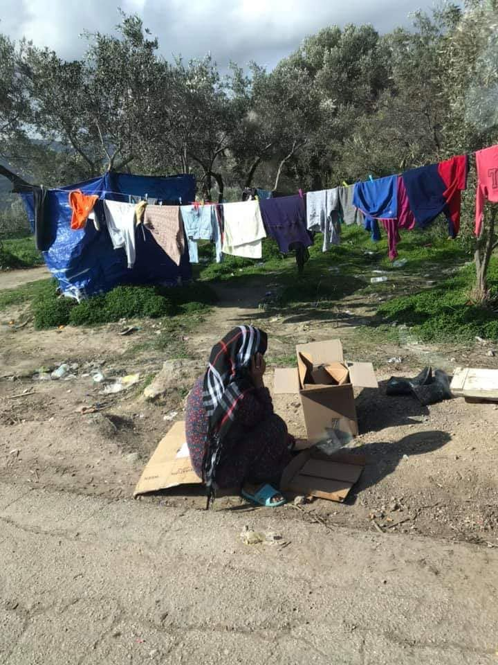
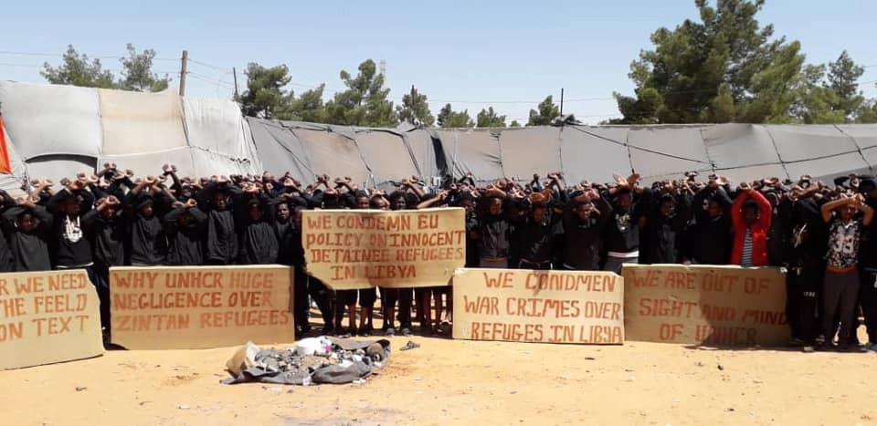

### AYS Weekend Digest 16–17/05/2020 Vial camp, Chios: the perfect place for self\-isolation…

The Central Med is a black hole / Serbia sends the army to camps again / Is Italian regularisation of migrant workers only a silver lining? / And more…

 \)](assets/f7f52fdebcf0/1*9cZqPXhNdBg1_SvYzmfVcg.jpeg)

BREAKING: This morning, Monday 18th May, the housing squat Themistocleous58 in Exarchia, Athens was evicted by the Greek Police\. It has been home for around 50 people since 2016\. This is what the Greek government means when talking about going back to normality\. \(Photo by [Marios Lolos](https://twitter.com/lolosmarios/status/1262256400958455808) \)

**Photo feature from Vial, Chios**

The perfect situation for hygiene and self isolation?

 ‎ [Αλληλεγγύη στη Χίο / Solidarity in Chios](https://web.facebook.com/groups/1508309029486384/?ref=gs&tn-str=%2AF&fref=gs&dti=1508309029486384&hc_location=group_dialog) \)](assets/f7f52fdebcf0/1*fZjbCFN1D-JDa-6FiNYYBw.jpeg)

\(Photo Credit: From residents of Vial via [Jenny Zinovia Kali](https://web.facebook.com/jenny.kali.1?fref=gs&__tn__=%2Cd%2AF%2AF-R&eid=ARAYWD8p1nO_kZR64d3L3XuHTMLzKfZgSr6txezr1LlyvRP-CfQA4POmbj9QS4gCMl6xqY4LHTRAu2jJ&tn-str=%2AF&dti=1508309029486384&hc_location=group_dialog) ‎ [Αλληλεγγύη στη Χίο / Solidarity in Chios](https://web.facebook.com/groups/1508309029486384/?ref=gs&tn-str=%2AF&fref=gs&dti=1508309029486384&hc_location=group_dialog) \)

[Refugee Biriyani & Bananas](https://web.facebook.com/RefugeeBiriyaniAndBananas/) are raising money for the approximately 5300 people in the camp to have food packs\. They are currently managing to provide for 2300 people\. You can support them and find out more [HERE\.](https://web.facebook.com/watch/?v=244677086766822)

SYRIA
#### Fire in al\-Baraka camp, Idlib area

On Saturday [a fire broke out](https://www.middleeastmonitor.com/20200517-syria-two-killed-in-idlib-refugee-camps-fires/) in al\-Baraka camp for displaced people in the village of Deir Hassam, near Idlib\. SOHR [report](https://www.syriahr.com/en/?p=165112&fbclid=IwAR1XSyJgLt9GJ3i5nqkZojwEZjQkd-_7es3ZDH1djzWvZCZa5JZ7vLHS5mM&__cf_chl_jschl_tk__=36398dffe3a0851f6f8ec6f39bbbf8c4ac8fbe47-1589790755-0-Aejk2jnouQB1oKHYczP_jfqZRf1RghegkjiBbVsXVt1AiSDC3x6nrNlauzNXSwTaL-b-ltPFZAvRNcuJxZHqDffsDGs03K3Yuus_Ie3STw1KMXZw4zSEQm-b8ORfegV1iKiamNoLwENw0fJt_TZ4P0cfWUSf47hZ4BqwYHfQ5qbTJWTvU1JQYNjDDGOnBRG8pPp2zi6X05N91XYUnynTjvdhdZaBMyHJCCsPIVhu4h2v8F5-wrrtICaVF_Fgq-JnOZRZw8sIg-ch31I8Ya3lnHtn1gSkIvqSlXWP4sMbUbkf0whUgWAoAiGMDTf2W7qCbeKNSsuynkeAYMjFrH2ofuY3IaGx8qTkRYWeBIEpP4T7iEYHQwqPJ6ethZq0_K8BWA) that at least 40 tents have been destroyed and around 100 families have fled for fear of the fire spreading further\. This is the 7th fire in the area in the last few weeks, which have caused the death of two people already\. It seems that these fires broke out during cooking in unsafe conditions\. The camps’ residents are suffering from a severe lack of water and many have no provisions at all\.

LIBYA

An Eritrean man died on Saturday in the Zintan ‘official’ detention centre, Giulia Tranchina [reports](https://www.facebook.com/rastajuly/posts/10157676074763621) \. He was the father of 3 children\.

> This is the 25th death in Zintan\. About 500 Eritrean and Ethiopian refugees, including many unaccompanied minors are being held by Libyan authorities in inhuman and overcrowded conditions without access to sufficient drinking water\. 

 \)](assets/f7f52fdebcf0/1*rWkKv2zxAvP_S3fvfirZnw.jpeg)

Zintan detention centre, Libya \(Photos via [Giulia Tranchina](https://www.facebook.com/rastajuly/posts/10157676074763621) \)

> The weather is very hot in this period and they are getting less than 1 litre of water each in over 24 hours\. They don’t have enough water to drink, but the EU\-funded UN agencies teach detained refugees ‘how to wash their hands’ to avoid Covid\-19\. 

> 23 people in Zintan, including women and children, died of starvation, dehydration and TB\. A 24th died in the fire of 3 months ago\. Abandoned and discriminated by UNHCR since 2018 in Zintan, many are detained since 2017\. They haven’t seen the face of a UNHCR employee in 6 months\. Even when they visit, they never bring food or water and never evacuate them\. 

> Today another human being died after years of torture, detention and suffering\. Another son, brother, husband and father who will never hug his family again\. May he rest in peace\. Europe’s crimes against humanity in Libya\. 

CENTRAL MED — Floating hotspots?

Three Maltese NGOs wrote a letter to the EU Commissioner for Home Affairs Ylva Johannson, urging the EU to intervene with the Maltese authorities and find a swift solution to the ongoing detention of 167 rescued migrants who are being held offshore on Captain Morgan boats, Maltese media [report](https://www.maltatoday.com.mt/news/national/102378/ngos_write_to_eu_commissioner_for_intervention_on_captain_morgan_migrants?fbclid=IwAR2BpCh5y0cpmWxW-57mlAPo9oSf0YktM_VnAQyLftJGJZyi9K9XFmANqVY) \.

We have already reported on the situation of the people basically detained on ships unfit for holding people for more than a day\. Maltese authorities are pushing this further, continuing to break EU and international laws, but at the same time asking the EU for funding to keep people on these ships for even longer\.

66 people [arrived](https://www.maltatoday.com.mt/news/national/102378/ngos_write_to_eu_commissioner_for_intervention_on_captain_morgan_migrants?fbclid=IwAR2BpCh5y0cpmWxW-57mlAPo9oSf0YktM_VnAQyLftJGJZyi9K9XFmANqVY) autonomously on Lampedusa on Sunday\. At the same time, as [Sergio Scandura](https://www.radioradicale.it/riascolta?data=2020-05-18) and [Angela Caponneto](https://twitter.com/AngiKappa/status/1261622728244834304) have reported over the weekend, the Italian SAR and the central Mediterranean are every day becoming more of a [black hole of information](https://twitter.com/scandura/status/1262326649611333632) \. Around [70 people](https://timesofmalta.com/articles/view/fresh-standoff-betwen-malta-and-italy-over-rescued-migrants.792851) \(other sources say [50](https://twitter.com/scandura/status/1262321710386348032) \) seem to have been ‘rescued’ by a fishing boat of the flotilla owned by Neville Gafa, who works for the Maltese government and was already the protagonist of a pushback by proxy to Tripoli in the past months\. There is now another standoff between Malta and Italy for the disembarkation of the people on board\. One 9\-month\-pregnant woman was [evacuated](https://twitter.com/MCronaca/status/1262320760615571456) with her husband\. She is now in Sicily, but at the moment of writing it is not clear if the husband is with her of if he was taken to a separate quarantine facility\. The position of the fishing boat is unclear, and it is reported that the boat is travelling with their transponder turned off\.

The ferry, Moby Zaza, is anchored outside Lampedusa with 121 people on board\. The ferry is being used by the Italian government as a quarantine facility and is costing between 40,000 and 45,000 Euro per day\. The ferry [should have already moved towards Porto Empedocle](https://twitter.com/scandura/status/1262089830739120128) , in Sicily, because the small port of Lampedusa is inadequate in case of medical emergency, but it hasn’t set sail yet\.

The Central Mediterranean has recently been described as the new Bermuda Triangle due to the lack of any official sources of information on what happens in the waters that divide Italy, Malta and the north African shoreline\. The COVID\-19 pandemic has worsened a situation that was already extremely concerning, allowing European authorities to classify information that should be public as matters of national security\. International agreements on co\-operation are violated on a daily basis, together with the human rights of people on the move\.

The use of private vessels as quarantine facilities for an indefinite period of time is a worrying step forward and it could be a precedent for the creation of floating hot\-spots\.

GREECE
#### **Arrivals**

36 people arrived to the north west of Lesvos on Sunday morning\. They will be taken to Megala Therma where [four people recently tested positive for COVID\-19](ays-daily-digest-15-05-2020-woman-found-dead-in-melilla-a74558e4d8d9) \.

■■■■■■■■■■■■■■ 
> **[Franziska Grillmeier](https://twitter.com/f_grillmeier) @ Twitter Says:** 

> > At 6 am this morning a boat arrived with 36 people in the northwest of #Lesvos. They will be #Covid_19 screened + moved to the Megala Therma for a 14-day quarantine without sufficient shelter, no electricity. In May 2020: 70 #reugeesgr have arrived from #Turkey to island so far. https://t.co/vdUVpJzmq2 

> **Tweeted at [2020-05-17 08:55:59](https://twitter.com/f_grillmeier/status/1261943537987436545).** 

■■■■■■■■■■■■■■ 

#### **Pregnant woman and her family to be evacuated from Kos Hotspot**

Equal Rights Beyond Borders have managed to secure the release of one pregnant woman and her family from Kos Hotspot on the grounds that the situation there amounts to degrading treatment\. We call for all people in both the detention centre and hotspot to be evacuated for the same reason\.

■■■■■■■■■■■■■■ 
> **[Vassilis Tsarnas](https://twitter.com/VassilisTsarnas) @ Twitter Says:** 

> > The #ECtHR adopted interim measures, requested by @[EqualRightsBB](https://twitter.com/EqualRightsBB), ordering #Greece to evacuate a pregnant woman &amp; her family from #Pyli &amp; provide them with adequate conditions &amp; healthcare, deciding that for her the conditions in the camp amount to degrading treatment
#RefugeesGr https://t.co/1nI4INuvQA 

> **Tweeted at [2020-05-16 15:13:14](https://twitter.com/vassilistsarnas/status/1261676088075464705).** 

■■■■■■■■■■■■■■ 

#### **Transfers to the mainland from Moria**

On May 3rd, the Greek government started evacuating the refugee camps on Lesvos\. Several hundred asylum seekers have been taken from Moria to the mainland, where they are temporarily staying in empty hotels\. [French/German channel ARTE](https://www.arte.tv/de/videos/094279-062-A/abreise-aus-moria-freud-und-leid/?fbclid=IwAR2Y81BlhZof-gr-sZl4B0rpecQxaLBJra0uRp7v4ruOupSCgQKfqrkeVw4) met happy departures in Moria, but also those who are left behind are in diabolical conditions in the camp\. A good account of the current situation on Lesvos can be read in German [HERE](https://perspective-daily.de/article/1256/a8n3xudL?fbclid=IwAR35Y8yRMJnpz_4LqhnwUFPThEZ1y3txmeahCB-8o4DRv52thGo3y5ZNyA4) \. Two further reports from the ground \(in English\) on the current tensions and living with the rising temperatures can be read [HERE](https://web.facebook.com/groups/informationpointforlesvosvolunteers/) and [HERE](https://web.facebook.com/MoriaCoronaAwarenessTeam/photos/a.120666896229156/138174337811745?hc_location=ufi) \.
#### **Racists Rallies on Crete but no legal action taken**

[The Observatory of racist crimes](https://racistcrimeswatch.wordpress.com/2020/05/17/1-1016/?fbclid=IwAR1Q1nqXFsXObQk3mdPiTfYehw36TVyy12cMEl8lp3ZM4G_HaYt-s_EQUVA) and Group of Silent Lawyers of Heraklion report that a series of offences were committed by the people who gathered, as well as by the Hellenic Police, on the 4th and 15th of May and yet no legal action has been taken against them\. They state that at least nine criminal offences were committed during the demonstration\.

> With hate speech against immigrants and all kinds of non\-believers, with fiery speeches against vaccines, against the use of a mask, against the “myth of the corona” and against the “world government”, about 200 participants in Freedom Square decorated their presence\. nationalist rally, on Friday afternoon in Heraklion\. 

> From the loudspeakers that had been set up in Eleftherias Square, the gathered people were calling for a nationwide resistance to the “Islamization” of Crete, while they were against the continuation of the program of hosting immigrants in Crete\. 

> At the end of the rally, a resolution was read that ended today’s proclamation as “the beginning of national polygenesis” and during the speeches there were direct threats even to the lives of politicians and those who are in solidarity with the rights of immigrants and refugees\. 

#### **Update from Inside Ritsona Camp**

[Donate4Refugees have published an interview](https://web.facebook.com/Donate4Refugees.org/posts/2640847672872203?hc_location=ufi) , translated from Italian, from a 16 year old girl currently living in the camp\.

> We were only looking for refuge\. And any place where we could feel safe would suit us\. We thought we could live in peace here in Greece\. But if we are mistreated in the very land where democracy was born, what will be the place where we refugees can finally feel safe? 

#### **Border Militarization along Evros escalates**

[According to local media](https://www.keeptalkinggreece.com/2020/05/17/greece-shields-evros-border-blades-wire-400-border-guards/) Greece is building a kilometre long fence with concertina barbed wire and deploying an additional 400 border guards along the Evros border with Turkey\. They will also install 11 additional border pylons **,** each one 50 meters high, equipped with cameras, surveillance systems, and telecommunications\. Large military vehicles which were confiscated five years ago while bound for Libya will also be employed\.

Given that there are currently [EU wide calls for an investigation](ays-daily-digest-12-05-20-over-100-european-parliament-members-call-for-investigations-into-greek-7f182f014511) in to the murder of Muhammad Gulzar by Greek security forces in this area, it is particularly worrying\. Each day it sounds more like a warzone than a border crossing\.
#### **Jail terms for protesters**

[Info Migrants reports](https://www.infomigrants.net/en/post/24789/greece-two-afghan-migrants-receive-jail-terms-following-riots?fbclid=IwAR0Ehcr_41hEnqbHFm_PMmPDdG-k5LzmIfzzolOyv9UGm4bGQ1bwBm1lGMk) that two Afghan men have been found guilty by Greek courts and sentenced to jail for six years and nine months each for participating in riots on the 12th of May in a detention centre in Northern Greece\. They are 22 and 23 years old and state that they did not take part in any violence\. They have both been fined €1,375\. 25 people were arrested in total\. Of the 250 housed there, about 150 are unaccompanied children\.

The Greek Government’s message — suffer in silence\.
#### **Patras Activists take action against Lidl**

In answer to the racists policies used by Lidl on Samos, during which people living in Vathy were made to queue separately from other people, [activists have completed an intervention](https://athens.indymedia.org/post/1605178/) with paint and pro refugee slogans at 3 Lidl supermarkets in Patras\.
#### **Greek asylum service to reopen on 18th of May**

Another reminder that GAS is soon to reopen, more info [HERE](https://www.keeptalkinggreece.com/2020/05/16/asylum-service-greece-operation-resumes/) and [HERE](https://web.facebook.com/migrationgovgr.info/posts/1618368941650538?hc_location=ufi) \.

ITALY

We reported in the last digests about the new government decree that allows migrant and local exploited workers in the agricultural, farming, fishing and domestic care sectors to regularise their positions, at least temporarily\.

[Elisa De Pieri](https://twitter.com/Elisa_De_Pieri) , researcher at Amnesty International Europe Regional Office, wrote about the limitations of this decree, that risk transforming it in to a “silver lining” of the COVID\-19 pandemic\. While this measure shines a light for the first time ever on tens of thousands of exploited workers, the limits to certain sectors and the requirements for registration are unfair, and defeat the very rationales of the decree, in a moment when the COVID\-19 pandemic requires everyone to be accounted for\.

Read the full thread [HERE](https://twitter.com/Elisa_De_Pieri/status/1261360352534704134) \.

BiH

On police violence, solidarity networks and the exposure of human rights violations:

SERBIA

■■■■■■■■■■■■■■ 
> **[NoNameKitchen](https://twitter.com/NoNameKitchen1) @ Twitter Says:** 

> > El gobierno serbio envía, de nuevo, tropas militares a custodiar campos de #refugiados. Alega que es para proteger a la población de los migrantes. Clara criminalización de las personas que solo están en busca de una vida segura.

[rs.n1info.com/Vesti/a600134/…](http://rs.n1info.com/Vesti/a600134/Mediji-Vucic-naredio-odlazak-Vojske-u-Sid-zbog-migranata.html) 

> **Tweeted at [2020-05-17 11:09:48](https://twitter.com/nonamekitchen1/status/1261977212800192519).** 

■■■■■■■■■■■■■■ 

FRANCE

A local volunteer and refugee rights advocate wrote an [update](https://www.facebook.com/permalink.php?story_fbid=2644805565846066&id=100009499466124) on the situation for people on the move in Paris — and especially in the area of Porte d’Aubervillers — in times of pandemic:

> Pandemic, lockdown, COVID\-19\. In refugee camps, things would almost go unnoticed, if it wasn’t for the constant criminalisation and abuse of volunteers and grassroots groups, the lack of resources and huge drop in foreign volunteers\. Dynamics in the camps have shifted, especially because some of the most present, local volunteers an help were not able to reach the camps due to the lockdown measures\. 

 \)](assets/f7f52fdebcf0/1*mFtXS6JnFHle-amwwMoLPA.jpeg)

Paris, May 2020 \(Photos by [Danika Jurisic](https://www.facebook.com/permalink.php?story_fbid=2644805565846066&id=100009499466124) \)

> Two evictions were made at the beginning of the lockdown, but despite promises of the government, many people were left on the street\. Now there are 2 camps north of Paris, not so far away from the edges of the city\. 40 tents or more in each, and many more refugees\. 

> At this point, it is mandatory to wear a mask in public transportation and if you don’t have one, you could be fined\. If you don’t have money or documents \(and this is the situation for many people on the move\), you will be arrested and taken to the police station\. 

With masks becoming important for both sanitary reasons and for avoiding police harassment, volunteers have been distributing reusable masks around the informal camps\. Other groups have started to produce masks, but 
“they lack space and resources”\.

> Food distributions work regularly, but there is a lack of shoes, tents, legal and medical support, \[…\] masks and disinfecting gel\. 

> There are no tests available , and we can’t eve tell if there is a spread of virus on the camps\. Most of those man are resilient and there’s no reports of covid 19 cases or deaths\. Still we have to presume that there is a danger and act accordingly\. 

Please read the full post [HERE](https://www.facebook.com/permalink.php?story_fbid=2644805565846066&id=100009499466124) for a detailed list of needs\. Support their fundraising [HERE](https://www.gofundme.com/f/refugees-in-paris-winter-2019?sharetype=teams&member=2768830&utm_medium=copy_link&utm_source=customer&utm_campaign=p_na+share-sheet&pc_code=ot_co_dashboard_a&rcid=d67a01eb9d1145ceb4f56b346982346c&fbclid=IwAR0zvhHhJ6XFxTSMlzli_4UssjSLpd7Ej5G4y3a4d0x0GEaY40UIvOZiZcg) if you can\. And if you live in Paris and can participate, contact [Danika on facebook](https://www.facebook.com/permalink.php?story_fbid=2644805565846066&id=100009499466124) \.

SWITZERLAND

23 unaccompanied minors, aged 10 to 17 arrived on Saturday in Switzerland from Greece, media [report](https://www.capital.gr/story/3453953/anaxorisan-simera-gia-elbetia-23-anilikoi-prosfuges-gia-na-epanenothoun-me-tis-oikogeneies-tous) \. They will have to stay in a quarantine facility for the next 14 days and then they will be moved to a Federal Asylum Centre\.

GERMANY

LeaveNoOneBehind protests

 , [Seebrucke Frankfurt](https://twitter.com/SeebrueckeFfm/status/1261656348623855621/photo/2) \)](assets/f7f52fdebcf0/1*YPo9TGbmpYSvIVVEfoKCEw.jpeg)

<\- Munster, Frankfurt \-> \(Photos from [Seebrucke Munster](https://twitter.com/MsSeebrucke/status/1261610331127844865/photo/2) , [Seebrucke Frankfurt](https://twitter.com/SeebrueckeFfm/status/1261656348623855621/photo/2) \)

Over the weekend, protests and banner drops in solidarity with people stranded on the Greek islands took place in [Munster](https://twitter.com/MsSeebrucke/status/1261610331127844865) , [Frankfurt](https://twitter.com/SeebrueckeFfm/status/1261656348623855621/photo/2) and in many centres of Lower Saxony\. They asked for local authorities to step up and declare German states [safe havens for people on the move](https://twitter.com/FlueRat_Nds/status/1261678249110880256) \.

Seebrucke is organising a [day of action](https://twitter.com/_Seebruecke_/status/1262089216571445251/photo/1) for Saturday May 23rd\.

**Find daily updates and special reports on our [Medium page](https://medium.com/are-you-syrious) \.**

**If you wish to contribute, either by writing a report or a story, or by joining the info gathering team, please let us know\.**

**We strive to echo correct news from the ground through collaboration and fairness\. Every effort has been made to credit organisations and individuals with regard to the supply of information, video, and photo material \(in cases where the source wanted to be accredited\) \. Please notify us regarding corrections\.**

**If there’s anything you want to share or comment, contact us through Facebook, Twitter or write to: areyousyrious@gmail\.com**

_Converted [Medium Post](https://medium.com/are-you-syrious/ays-weekend-digest-16-17-05-2020-vial-camp-chios-the-perfect-place-for-self-isolation-f7f52fdebcf0) by [ZMediumToMarkdown](https://github.com/ZhgChgLi/ZMediumToMarkdown)._
