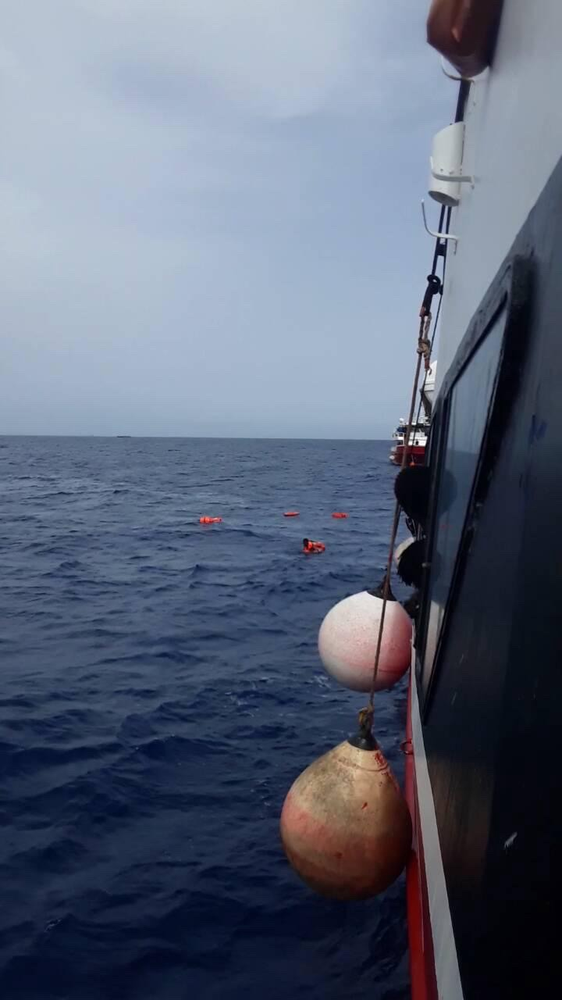
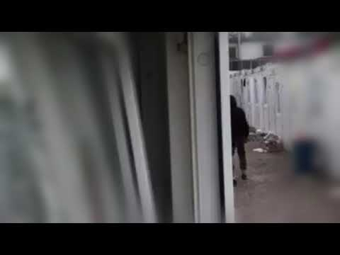

### AYS Daily Digest 19/5/20: Maltese offshore prisons
#### 1400 asylum rejections were given with the opening of Asylum service of Lesvos on May 18 / Openly abused and beaten at the official UN\-run camp in Bosnia and Herzegovina / Hypocritical international care for minors while they sleep rough / Some children cut out of the official distance learning programme in Croatia / & more news

#### FEATURED
### Push Backs: the new old Routine in the Aegean Sea

**The Greek coastguard systematically attacks migrant boats and exposes** 
**them to life\-threatening situations while Turkish authorities stand** 
**aside**

Over the past two weeks, Alarm Phone was contacted twice by people in
the Aegean Sea who found themselves in distress after being attacked and
sabotaged by the Greek coastguard and masked men\. Reportedly, this
occurred once in Greek and once in Turkish waters\. In the first
incident, the migrant boat was pushed back and, for hours, both Greek
and Turkish authorities stood aside, watching the distressed passangers bail water out of the boat with their shoes\. In the second incident, the
Greek authorities took the chance, with no other witnesses around, to
even sabotage the boat inside Turkish territorial waters and then
quickly escape the scene\.

Alarm Phone has reported being very concerned about the recent increase in reports of attacks on migrant boats:

> Since early March 2020, we have received 28 emergency calls from the Aegean Sea — in most of these cases, the distress resulted from attacks on boats carried out in Greek waters\. 
 

> In18 of these cases, survivors reported of push backs where vessels of the
 

> Greek coastguard were involved and “masked men” had attacked them\. They
 

> reported of dangerous actions, such as circling around their boats and
 

> causing waves, threats with guns, theft of their petrol, destruction of
 

> engines and, also, the towing back of boats to Turkish waters where they
 

> were left adrift\. In some cases, they also reported Greek coastguard
 

> vessels ramming their boats, and Greek officers shooting with live
 

> ammunition in the water or air around them and beating them up\. Alarm
 

> Phone is alarmed also by the dangerous lack of immediate intervention
 

> from the Turkish authorities to rescue a boat in distress\. In many of
 

> the reported cases, they simply stood aside for many hours, watching and
 

> documenting the actions of the Greek forces\. 

> Besides closing down legal pathways for people to find safety and seek
 

> asylum in Europe, national authorities on all sides fail in their
 

> obligation to rescue people in distress\. Even worse, they create
 

> life\-threatening situations and expose people to further dangers in
 

> order to deter people from reaching Europe or to use them for their
 

> political games\. 

> We call on the Greek and Turkish authorities as well as the governments and institutions of the EU who are involved in Frontex missions to militarise Aegean Sea borders, to stop playing cynical games with people’s lives\. 

### SOS\! Cries for help from Malta’s offshore prisons\!

> For weeks, people rescued are kept on private ships off Malta’s coast\. Some have found a way to reach out to us\. They say that some started a hunger strike, others attempted to take their own lives out of desperation\. 

> The prisoners say “anxiety, hopelessness and depression increased” & that there is no sufficient health care & food\. They have asked us to raise their suffering in public: “We are now in a deplorable situation\.” We call on Malta to immediately end this inhumane imprisonment\! 

> Europe, how can you let hundreds of vulnerable people be detained at sea along your external borders and by a EU member state? They need to land now and be relocated to where they want to be\. In Germany, and elsewhere, cities have agreed to relocate\. Stop these cynical games\! — [Watch The Med — Alarmphone](https://www.facebook.com/watchthemed.alarmphone/?__tn__=kC-R&eid=ARDG0mLwbhkSOKJqOR3SMknvRQXpG9EI4uKOIsXRc_js_Cpkj2ojUCeTvpPZXMWETZLreg6gtN6F2M9k&hc_ref=ARRm0q6Y7Qg2I5NN8dDNbbbH00fOVbG0rSp3Kq2eK6bUo2Rs6lRkoI4nJ7PdT7SZ19A&fref=nf&__xts__%5B0%5D=68.ARDuxn9a6jsVFhC5TWRgppHEYIKaC5HpCM0npjgTAz_ECpu7EkFz_ydjpp3wqLfku-ZrzuCPfZMBa48okI2Pj_g_Z5kw-pdEoXyEOjoeTkVnFmoD1hzaGfYnDgz7bDo4dmqFr3uyPqdOx1Ex5hq58e-sCSsg-jDCq4GEJXUqQ__dG_XO7hoGRf-cFd_KcOrkE4YLcvPz-yRbRx3ADUt1wHMD5ys4Q57jwYFwYXACRz_VA8MP21tCdDXe6zmBu6iKud9rRXWJadM_xSGSFBmbg11zMtBfxx2fj9xyHs3_LJz-cQGzP0WttiBEN7ZmhuPc-NWtlPqSA5yZ3mxNk0mC0wMMZ4K4) 

Malta [closed its ports to asylum seekers in April](https://timesofmalta.com/articles/view/malta-says-it-cannot-guarantee-migrant-rescues.784571) and told the EU it could not guarantee the resources needed to conduct rescues at sea, because of the COVID\-19 pandemic\. The evidence of Malta’s **strategy to push people back to the conflict zone of [Libya](https://www.theguardian.com/world/libya)** has been revealed by a woman who survived a Mediterranean crossing in which 12 people died\. Read more [here](https://www.theguardian.com/global-development/2020/may/19/exclusive-12-die-as-malta-uses-private-ships-to-push-migrants-back-to-libya?fbclid=IwAR167lw9gVYGxmsq30XSMtxKO2vKmn604OAo8J7nN7nv7Jmyv3peJZIVSrE) \.
#### GREECE
### Lesvos

Organisations report that **1400 asylum rejections** were given with the opening of Asylum service of Lesvos on May 18, 2020\.
During the [\#covid19](https://www.facebook.com/hashtag/covid19?hc_location=ufi) suspension, Lesvos Asylum service issued rejection decisions to 1,789 applicants for international protection \(at least 1,400 first grade\), who are required to appeal by a date as soon as May 28\.
Despite the contrary provision of Law 4636/2019 and relevant EU law, they have not been provided with free legal aid\. Police imposed fines of 150 euros on people who went to the city of Mytilene in search of free legal aid\.

Applicants must renew cards on predetermined dates in May, in derogation of the Ministerial Decision which provides six\-month extension of the cards for all asylum seekers under Covid19\.
Those who arrived in Lesvos from March 1st to 17th are invited to come daily at 8 am to the Regional Office, “although no measures have been taken to prevent the transmission of COVID\-19 and to avoid overcrowding outside its offices”\.
It is reported that these inhumane measures are part of the recent announcements of the Ministry of Immigration and Asylum regarding the intention to deport 11,000 asylum seekers to Turkey immediately\. “
#### SERBIA
### The regime in practice not following their own decisions, people remain under pressure

On 16 May Serbian President Aleksandar Vučić ordered Serbian Army deployment in municipality Šid with 3 centers: Adaševci, Principovac and Šid city\. Info Park reports in their weekly bulletin\.

Apparently, the decision is made following requests from the local municipality to prevent any incidents that occurred before corona epidemics, including petty crime, burglaries and illegal entry into abandoned buildings including farms or weekend houses in the area\. The units belonging to the elite 72 Brigade for Special Operations of Serbian army are deployed on the same day, guarding 3 centers and patrolling in the town\. According to the SCRM, the migrants are allowed to leave all of these camps, however their stay outside after the 10pm curfew is not tolerated, and they are forced to return to the camp\. Various representatives of civil society organisations criticised this decision heavily, claiming it is connected with the campaign for general elections in Serbia set for 21 June — especially given that no incidents are reported since lifting lockdown of Šid area camps\.

Nearly 1,500 people managed to leave the camps since the end the state of
emergency, despite strong SCRM efforts to slow down the outflow with the partial restriction of freedom of movement with a system of quotas \(for instance, in Krnjača AC **only 5 people per barrack were allowed to exit the premises** \) \. According to Serbian Commissar for refugees and migrations Vladimir Cucic, Serbian ACs and RCs currently “host” 7,700 people, with an estimation of at least 150 people on the move outside\. At the peak of the state of emergency, the camps had over 9\.100 accommodated people, Info Park reports\.
#### HUNGARY
### The government does not accept the ruling of the EU’s top court about the transit zones

We reported about the ruling of the ECHR last week, which confirmed the tranzit zones Hungary defined and installed between Hungary and Serbia are in fact detention, meaning that the four asylum\-seekers stuck in a transit zone on the Hungarian\-Serbian border should be released\.

> Hungary now said openly and clearly they will not accept the ruling\. 

They explain this because the transit zones were a part of Hungary’s system of border protection, also claiming that the people stuck on the Balkans route posed a “public health threat” amid the coronavirus outbreak\.
#### BOSNIA AND HERZEGOVINA
### Violent treatment at an IOM run camp in Una Sana canton captured on camera

A video capturing violent behaviour of the Bosnian police entering the official camp in Velika Kladuša has been shared, depicting the type of treatment people across the so\-called Balkan Route receive often, as a consequence of a general and repressive approach to running the official camps across the countries, with a special situation in Bosnia and Herzegovina that we and other activist groups often report about\.

In Tuzla, local activists at the end of their strengths report encountering at least 17 young people sleeping rough in their city, among them 4 unaccompanied minors\.

> Still humble, with no special requests, except to move on\. 
 

> Tired, wet, frozen\. 

](assets/fd3d5ed2b7ef/1*l2ggszkmg8_60uKQg8PcYw.jpeg)

Photo: [Dženeta Delić Sadiković](https://www.facebook.com/dzeneta.armin?__tn__=%2Cd%2AF%2AF-R&eid=ARD5K4hkH5CwXA9rWkY3EmV1Oo_xoGaSXjgeOveZlw2w_THhJhE4-d68QkWFMA2KF0Odx35DI69Vv60s&tn-str=%2AF)
#### CROATIA
### Some children cut out of the official distance learning programme

Are You Syrious is among organizations demanding answers from the authorities as to why some children are left at a “decent distance”, neglected and uncared for by the system, among them children who are in the country with families in a status of asylum seekers or asylees\.

Nine weeks since the start of the “distance schooling” in Croatia, the most vulnerable groups of children, among whom are children who arrived with their parents seeking international protection, are completely or partially excluded from the educational process, having their human right to education violated\.

Students and families living in poverty or at risk of poverty, as well as all other children belonging to marginalized and vulnerable groups, due to the closing of schools, have lost a number of different support mechanisms usually provided to them through the school system, such as a free meal for the child, psychological support, support in studying, etc\.

For this reason, the GOOD Initiative, Are You Syrious, Croatian Roma youth organisation, and the Serbian national council are filing a complaint to the UN Committee on the Rights of the Child\. The complaint is against the violation of the right to access to education and the discrimination of children whose first language is not Croatian, in the process of establishing the long\-distance school classes in Croatia\.

At the same time, AYS teaching volunteers have continued supporting children in their everyday class assignments via chatgroups, online teaching support and other ways of providing a safe way to learn and grow during the COVID\-19 measures defined by the state, but not followed up in other areas\.
### IOM continues sending people back

On the other side, the IOM has reported about their assisted voluntary return programme, their key activity in Croatia\.

In April, they encouraged the departure of 178 people from the ECS to 11 different countries, they report\. At the same time they took part in sending 8 people with health problems to their countries of origin\. Since the start of their programme in Croatia, they have helped send 20 people back to their countries of origin, reportedly “assisting their reintegration in 19 cases”\.

Our general view on how the programme is being conducted has not changed much\.

COMMENT

■■■■■■■■■■■■■■ 
> **[Tihomir Sabchev](https://twitter.com/TihomirSabchev) @ Twitter Says:** 

> > 115,000+ asylum applications in Spain in the last year. Rarely in the news. Almost all refugees come by plane from South America (Colombia, Venezuela, Honduras, etc.)

Italy &amp; Greece together had less asylum applications. They were on the news all the time though. Let's think why 

> **Tweeted at [2020-05-19 18:34:04](https://twitter.com/tihomirsabchev/status/1262813793563918336).** 

■■■■■■■■■■■■■■ 

**Find daily updates and special reports on our [Medium page](https://medium.com/are-you-syrious) \.**

**If you wish to contribute, either by writing a report or a story, or by joining the info gathering team, please let us know\.**

**We strive to echo correct news from the ground through collaboration and fairness\. Every effort has been made to credit organisations and individuals with regard to the supply of information, video, and photo material \(in cases where the source wanted to be accredited\) \. Please notify us regarding corrections\.**

**If there’s anything you want to share or comment, contact us through Facebook, Twitter or write to: areyousyrious@gmail\.com**

_Converted [Medium Post](https://medium.com/are-you-syrious/ays-daily-digest-19-5-20-maltese-offshore-prisons-fd3d5ed2b7ef) by [ZMediumToMarkdown](https://github.com/ZhgChgLi/ZMediumToMarkdown)._
