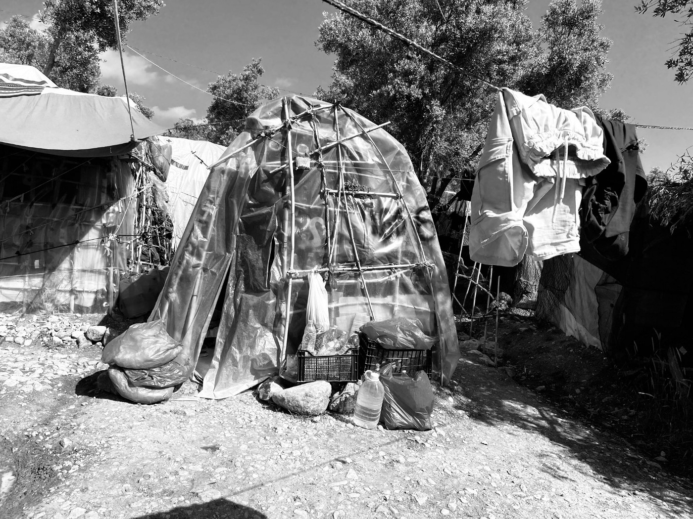
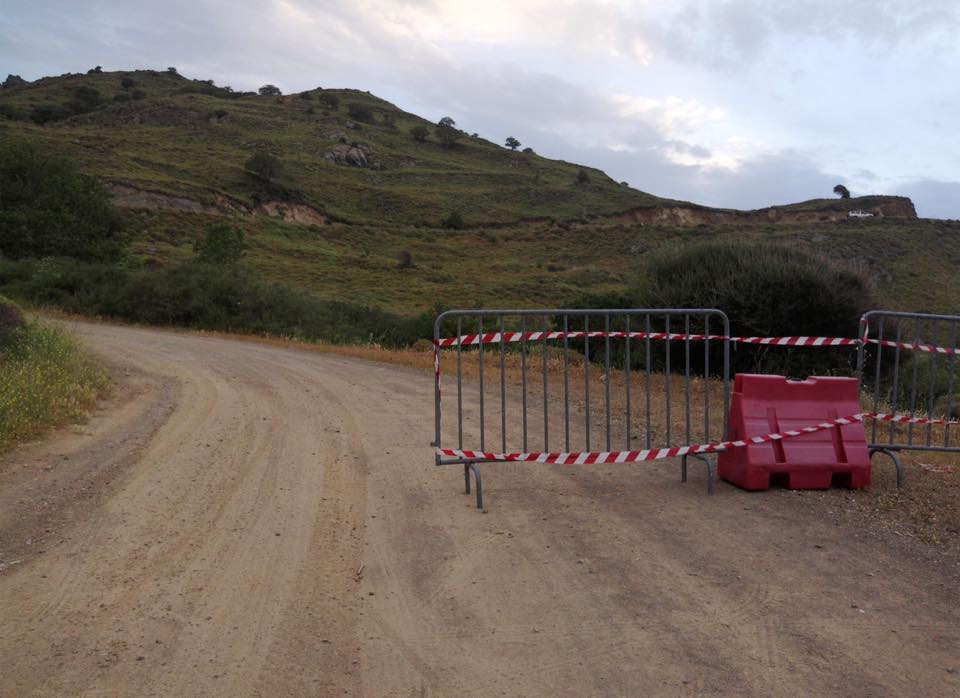
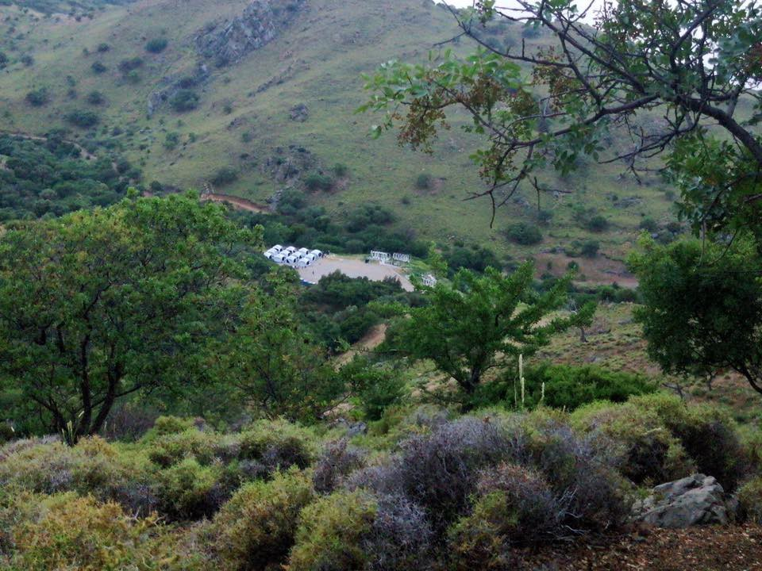

### AYS Daily Digest: 21/05/20: Hungarian Transit Zones closed
#### Proof of pushbacks from Greek territory // Amnesty International concerned about harassment of volunteers in France // New deportation operation in UK

The shelters of Europe\. Copyright: Franziska Grillmeier
### FEATURE: Legal disputes shows results: 300 people were released from arbitrary detention in Hungarian transit zones

On Thursday, the Hungarian Government informed the public that it will shut down the so\-called transit zones at the border with Serbia\. Following this decision, about 300 people — amongst them families and children — have been released from the facilities and relocated to open or semi\-open facilities\. This new development is the result of the hard work of NGOs, especially the Hungarian Helsinki Committee, which led the Court of Justice of the European Union to classify the transit zones as detention centers\. The judgment was made on May 14th\. In an [official press release](https://curia.europa.eu/jcms/upload/docs/application/pdf/2020-05/cp200060en.pdf) , the court stated:

> “The conditions prevailing in the Röszke transit zone amount to a deprivation of liberty, inter alia because the persons concerned cannot lawfully leave that zone of their own free will in any direction whatsoever\.” 

The statement continued:

> “Neither an applicant for international protection nor a third\-country national who is the subject of a return decision may be detained solely on the ground that he or she cannot meet his or her own needs” 

This shows that detention in the transit zones was arbitrary by nature\. Some people have been held in detention in the transit zones for more than 300 days\. In some cases, authorities denied people food in order to force them to leave the facilities when their first asylum claim was rejected, before their appeal was ever heard\. A ruling by the European Court of Human Rights in December last year came to a different conclusion than the Court of Justice of the European Union in its latest decision\.

While the release of asylum seekers from the transit zones is a great success for human rights, there is hardly cause for celebration\. A spokesperson from the Prime Minister’s Office made it very clear that Hungary will still do everything to prevent people from entering the European Union through Hungary\. Apparently a first step will be to only allow asylum claims to be filed from Hungarian diplomatic mission in other countries\. This means a step further in the externalisation of people’s right to asylum\.

■■■■■■■■■■■■■■ 
> **[HunHelsinkiCommittee](https://twitter.com/hhc_helsinki) @ Twitter Says:** 

> > Great news: Overnight, authorities released everyone -- about 300 people, many families with small kids -- unlawfully detained in the transit zones and transferred them to open or semi-open facilities!

This follows the @[EUCourtPress](https://twitter.com/EUCourtPress) ruling a week ago:
[helsinki.hu/en/hungary-unl…](https://www.helsinki.hu/en/hungary-unlawfully-detains-people-in-the-transit-zone/) 

> **Tweeted at [2020-05-21 09:04:26](https://twitter.com/hhc_helsinki/status/1263395213474779136).** 

■■■■■■■■■■■■■■ 

### GENERAL

The NGO Statewatch published an analysis of an internal Frontex report that was handed to EU governments’ delegations by Frontex at the end of April\. The report highlighted different issues encountered by Frontex in implementing its new legislations amid the Coronavirus pandemic\. 
From the analysis:

> “Despite the Covid\-19 pandemic, the agency is urging swift action to implement the mandate and is pressing ahead with the recruitment of its new ‘standing corps’\. However, there are legal problems with the acquisition, registration, storage and transport of weapons\. The agency is also calling for derogations from EU rules on staff disciplinary measures in relation to the use of force; and wants an extended set of privileges and immunities\. Furthermore, it is assisting with “voluntary return” despite this activity appearing to fall outside of its legal mandate\.” 

Find the full report and the original Frontex document here:

### GREECE
#### Proof of Pushbacks from Greek territory

A team of investigative journalists from Bellingcat, Deutsche Welle, Lighthouse Reports and Trouw did some very important research on pushbacks from Greek territory into Turkey\.

■■■■■■■■■■■■■■ 
> **[Lighthouse Reports](https://twitter.com/LHreports) @ Twitter Says:** 

> > THREAD: Asylum seekers have been disappearing from Greek refugee camps. New arrivals vanish from the islands. Allegations mount of 'deep pushbacks' &amp; new tactics in the Aegean. What's happening?

#BordersNewsroom investigates 

> **Tweeted at [2020-05-21 09:46:03](https://twitter.com/lhreports/status/1263405686463115264).** 

■■■■■■■■■■■■■■ 

A pushback is the term for the common practice of border police forcing asylum seekers back over a border without ever giving them the chance to claim asylum\.

In [this article by Bellingcat](https://www.bellingcat.com/news/uk-and-europe/2020/05/20/samos-and-the-anatomy-of-a-maritime-push-back/?fbclid=IwAR3rxxJK14DYBReZK6bohI-uhtNxrFNW53WZ9skWjiYuLgYNKVgFalT_p7g) , evidence is presented of two pushbacks, one from Samos and one from Chios, which were conducted on April 29th and April 30th\. The investigative team collected video material, matched images from the footage to google maps to find the precise locations in question, talked to witnesses, and reviewed local media and Facebook groups\. Through their work they were able to give evidence of a group of people who arrived to Samos and were later detained and pushed back to Turkey\. These practices are illegal — the European Convention for Human Rights clearly forbids them\. 

[Deutsche Welle reports](https://www.dw.com/en/migrants-accuse-greece-of-forced-deportations/a-53520642?fbclid=IwAR2ekNAT1h4--YqyDTqSXXgqzrRPwfGCu-cEaRrZhGyPa6zfd424KyHw5f4) on a young man who was deported from a camp called Diavata close to the northern Greece city Thessaloniki back to Turkey via the Evros river in late April\. He had arrived to Greece from the same route two months earlier\. His arrival was followed by his official registration with the Greek police, which is the first step in order to apply for asylum\. Despite this, he was later detained under false pretense and deported to the shore of the Evros border river, at which point he was shipped over the river together with many other people\. DW collected testimonies of 10 people in Turkey who reported having been pushed back via the Evros River and are able to provide proof of their stay in Greece\.

At the same time as more and more evidence of the practice of illegal pushbacks is being collected, the right\-wing mayors of Mytiline, Chios, and East Samos published a disgraceful joint statement, in which they endeavor to:

> “…express their gratitude and public gratitude to each and every one of the officers of the Coast Guard who serve in our islands, for the bravery, conscientiousness and self\-sacrifice that they show every day during the execution of their missions, guarding the sea borders of our homeland and preventing successfully the landing of illegal immigrants on our islands\.”
 

> \(see: Facebook Aegean Boat Report\) 

It is important to take into consideration that Europe does not provide Greece with the necessary support to facilitate a dignified and humane asylum system\. However, these three mayors are praising their coastguard for illegal and cruel behavior\. In Europe, this is how far we’ve come\.

The BBC recently published this video, which was filmed by an Afghan journalist currently on lockdown in a Greek refugee camp\. It gives very good insight into the life in the camps amid the coronavirus pandemic and the impossibility of adhering to basic hygiene and social distancing measures\.

Mare Liberum showed pictures of the new quarantine camp in Megala Therma in the north of Lesvos\. Apparently 4 of the 106 residents have tested positive for Covid\-19, but everybody still has to share the same facilities\.

Copyright: Mare Liberum

Borderline Europe issued a new interview with a member of the Legal Center Lesvos as part of its series “Raised Voices: People on the move and Corona\.” Every two days the team publishes short interviews with different people speaking about the situation of migrants and refugees in the light of the coronavirus pandemic\. Listen to the interview here:

\(The website is in German but many of the interviews are in English\. \)
### ALBANIA

Balkan Insight published a story at the beginning of May that speaks to the situation of refugees in Albania\. Even registered asylum seekers go hungry in the country and have to beg for food to survive\.

### SEA

■■■■■■■■■■■■■■ 
> **[Alarm Phone](https://twitter.com/alarm_phone) @ Twitter Says:** 

> > According to @angikappa a boat with 60ppl - earlier spotted in #Malta SAR at pos 35°16, 11°51 - was rescued by merchant vessel #MAREN, which seems to wait for further instructions. The people on board need a place of safety and this can only be #Europe! 
[twitter.com/AngiKappa/stat…](https://twitter.com/AngiKappa/status/1263194366111342594) https://t.co/6boRIccyEF 

> **Tweeted at [2020-05-21 12:49:00](https://twitter.com/alarm_phone/status/1263451726578880512).** 

■■■■■■■■■■■■■■ 

### MALTA

IOM and UNHCR released a joint statement in which they urge the European states and Malta to speed up the relocation of the 160 people in quarantine on board of the Captain Morgan vessels\. The two weeks are over now, but no disembarkation plans have been set\. It seems that Malta is trying to keep these people offshore in order to prevent them from filing asylum claims\. An IOM and UNHCR joint statement responded:

> “It is unacceptable to leave people at sea longer than necessary, especially under difficult and unsuitable conditions…IOM and UNHCR are also deeply concerned about reports that States have been ignoring or delaying responses to distress calls, especially amid a sharp decrease in state led and NGO search and rescue capacity\.” 

These days, the spectacle of IOM and UNHCR calling on Europe to comply with human right standards has become a semi\-regular practice\.

In [yesterday’s digest](ays-daily-digest-20-05-2020-greeces-authoritarian-slide-44b818da03df) we reported about a call from various NGOs to end the situation on the cruise vessel by letting people disembark\. We also reported about the accounts of survivors of the deadly Easter Weekend incident, indicating that the Maltese Armed Forces had not actually saved the boats, but rather endangered them through unsafe maneuverers, eventually directing them to sail into the Italian Search and Rescue zone\.

Video footage of this event:

■■■■■■■■■■■■■■ 
> **[Alarm Phone](https://twitter.com/alarm_phone) @ Twitter Says:** 

> > BREAKING: Malta's Dangerous Manoeuvres at Sea exposed!

Witness testimonies and video evidence gathered by #AlarmPhone suggest that the Armed Forces of Malta (@[Armed_Forces_MT](https://twitter.com/Armed_Forces_MT)) endangered the lives of 101 people in distress before facilitating their arrival in Italy. 1/12 https://t.co/6QU87PMffm 

> **Tweeted at [2020-05-20 06:29:02](https://twitter.com/alarm_phone/status/1262993717117452288).** 

■■■■■■■■■■■■■■ 

### SPAIN

NGOs have welcomed the government’s decision to automatically extend for six months the residence and work authorizations of foreign citizens that would otherwise expire during the State of Alarm decreed by the coronavirus pandemic\. This is an important first step in ending this uncertainty for all people whose residence permits are running out in the next weeks\. NGOs are asking for one step further: the regularization of undocumented people in Spain\. 
For more information in Spanish, see:

### GERMANY

This article gives a good overview over the situation in German refugee centers during the coronavirus pandemic\. One refugee center after the other is seeing a very high number of people infected with coronavirus these days\. Different courts in Germany already ruled that the accommodation in these centers during the pandemic is not suitable\. However, no other options are currently being provided\.

### FRANCE

Amnesty International expressed its concerns about instances of harassment and intimidation by the French authorities against human rights defenders who are trying to support refugees during the coronavirus crisis\.

Between March and April, there have been 180 evictions of camps around Calais, and another 12 around Grande\-Synthe\. These evictions are usually accompanied by the destruction and seizure of tents and other personal belongings\. Groups of volunteers try to monitor the often violent evictions and support the refugees, who are left without any possibility to protect themselves from infection by the coronavirus\.

In Grande\-Synthe, four members of the association Utopia 56 were arrested and placed in police custody on April 24; they had been documenting the violent evacuation of a makeshift camp for asylum seekers\. They were later released without any charges\.

For the full AI article, see:

### UK

This Guardian article details a new operation called Operation Sillath, which is supposed to bring people who arrived to the UK by boat from France straight back to France, before their asylum claims have been considered properly\. Under the Dublin Convention, people can be deported to other Schengen countries if there is evidence that they have already been fingerprinted or claimed asylum there\. The new operation, however, would not even start a so\-called Dublin\-procedure, but return people purely on the basis of them having arrived from France\.

> “This would be an egregious breach of European law that allowed many asylum\-seekers to be wrongly removed from the UK,” says Lily Parrott, a UK\-based lawyer\. 

The numbers of people who try to cross the channel by boat are increasing\. This year, 1,040 people have already tried to cross, compared to 1,890 last year and only 297 in 2018\. Since big merchant vessels routinely traverse the channel, the crossing is very dangerous\. The need for safe and dignified travel routes for people who want to claim asylum in the UK becomes clearer every day\.

The so called Dubs scheme, a scheme that was imposed in 2016 and was meant to relocate unaccompanied minors from European into the UK, is being closed\. 480 children came to the UK under this scheme\. Initially the scheme was meant to relocate about 3,000 children\. Local authorities have offered another 1,600 places for these children\.

■■■■■■■■■■■■■■ 
> **[Alf Dubs](https://twitter.com/AlfDubs) @ Twitter Says:** 

> > But I am heartbroken that the scheme has now been ended by the government, effectively ending Britain’s offer of protection for these children, though thousands still remain stranded in rapidly deteriorating camps.
2/5 

> **Tweeted at [2020-05-21 15:23:52](https://twitter.com/alfdubs/status/1263490702916423683).** 

■■■■■■■■■■■■■■ 

**Find daily updates and special reports on our [Medium page](https://medium.com/are-you-syrious) \.**

**If you wish to contribute, either by writing a report or a story, or by joining the info gathering team, please let us know\.**

**We strive to echo correct news from the ground through collaboration and fairness\. Every effort has been made to credit organisations and individuals with regard to the supply of information, video, and photo material \(in cases where the source wanted to be accredited\) \. Please notify us regarding corrections\.**

**If there’s anything you want to share or comment, contact us through Facebook, Twitter or write to: areyousyrious@gmail\.com**

_Converted [Medium Post](https://medium.com/are-you-syrious/ays-daily-digest-21-05-20-hungarian-transit-zones-closed-f40823575d13) by [ZMediumToMarkdown](https://github.com/ZhgChgLi/ZMediumToMarkdown)._
