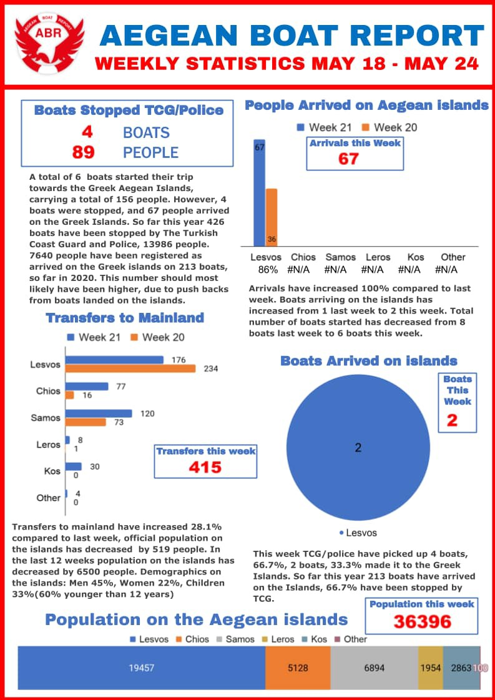

### AYS Daily Digest 27/5/20: As the violence continues, people risk homelessness even after obtaining international protection
#### Police and border violence on the rise / Contribute to the fight to support families in Croatia affected by COVID\-19 and consequences of the recent earthquake / Eviction in Rome / Why would someone board a dangerous raft and head across the Channel? / & more

](assets/afabb37caab9/1*wbAtSMcwT_fN4TfW0uN7GQ.jpeg)

Go to: [areyousyrious\.eu](https://hr.areyousyrious.eu/)
#### FEATURED

> Horrible psychological state 

— this is the expression used by Bosnian volunteers and activists across the country who encounter badly beaten people coming back from Croatia and the Una Sana canton, if they have already decided to go back to the eastern part of the country after having tried to move on, after having been rejected from the official camps or after having been traumatized and beaten so badly that they are hopeless\.

The police has reportedly been redirecting people from entering the city of Tuzla, making them go in another direction, most likely with the intention of combining these restrictive actions with a recent decision to stop issuing documents at the office that used to be the ‘go to’ place in the city for people to legitimize their stay in the country\. Now, this too has been made impossible for them\. The Office for Foreigners no longer registers people in their Tuzla office\. Surely, this must be a political decision, but as always, it is the overall people’s behaviour and reactions that shape the real state of things\. As in other countries and areas, the tourist part of the economy has lapsed, so people are becoming more open to rent their accommodation ‘even’ to the people on the move\. Only the people who managed to save police papers with the initial expression to seek international protection may try to seek such accommodation, provided they have any money, which — contrary to popular belief — the great majority doesn’t\.

However, solidarity continues unabated for those without the means to use public transport, as they walk through small villages on their way to Sarajevo\. The local people from the villages reportedly support them in any way they can, with some food, water, and other items if they happen to have them\. 
As implausible it might sound to many bureaucratic and political minds, you really cannot kill solidarity, people’s will to help and support their fellow humans who are in a more difficult place in life…

 \)](assets/afabb37caab9/1*elfhEn8TfmK1H-L9XD2t9g.jpeg)

This is a photo of one of the people from a group of badly beaten young men who arrived at Miral camp in Velika Kladuša\. Many other sources, from locals to people themselves, claim border violence has been on a rise in the past days \(Photo via: [Bejza Kudic](https://www.facebook.com/profile.php?id=100010319738101&__tn__=%2Cd%2AF%2AF-R&eid=ARD8Nts-uj3BVUxizT2KY6v8YHZCYwyGrjkfwFM2w5bfffPGw_6NWL2g-PBOttjM6V1ddLc5nK8SNk9V&tn-str=%2AF) \)

On the other side of the border, the fight for a decent life unfortunately doesn’t end\. The system does not take into account the rights of children whose first language is not Croatian, which is — as we previously wrote — why we addressed this issue with the Commissioner, hoping it will bring more light to the fact that Human Rights, like the discussion on a humanitarian approach to migration, fell far below any other topic addressed by the Croatian EU presidency which is now coming to its end\.
### Support AYS campaign

**_Along with the many problems they already had to face in a foreign country, the pandemic was the last straw because many lost their jobs because of it, and were left without a place to live due to the earthquake that hit the Croatian capital\. Now they face losing jobs, homes and potentially being separated from their children\._**

Many people who managed to reach Croatia and receive international protection in the country, creating a new home there after having been displaced or fleeing their home countries in order to save the lives and health of their families, now face losing their new homes, too\. While the pandemic has brought difficult times for many of us, those living in Zagreb also face the effects of the recent earthquake that hit Croatia’s capital, leaving many without safe homes, and with long\-term consequences to the entire city\. In this context, the refugees face all of these problems with even more difficulties in the foreign country they find themselves in\.

That is why Are You Syrious started an **emergency support fund** for the people who, due to the pandemic that resulted in losing jobs, and consequences of the earthquake, face homelessness and hunger\.

We are looking to raise 120,000 kn \( **£14,000\) to help assist 40 refugee households who are at risk of homelessness** \. All the money raised will go towards providing these families with rent, food and basic necessities for one month\.

> _The aim is to collect funds to support those most vulnerable among them through temporary covering one or two monthly rents and covering food expenses, all the while working on helping them find new jobs\. In that way, they would have a ‘safety net’ that the rest of us find in our family and friends during these tough times, something they, unfortunately, can’t count on\._ 

For information and **super\-easy way to scan and contribute** , please visit:

> [_areyousyrious\.eu_](https://hr.areyousyrious.eu/) 

#### GREECE

AIforGood Simulator project \( [aiforgoodsimulator\.com](http://aiforgoodsimulator.com/?fbclid=IwAR2b4rzPp5_WlaNpYzHUS2N2qmtoZdS99YsXcJJ_C9mi7xsKIM2ZpHv25X0) \) is moving on to the next phase of the project, aiming to model the impact of Covid\-19 in more camps around the world\.

**If you work in a refugee \(or IDP\) camp — please respond to this quick survey, which should only take 10 minutes: [https://forms\.gle/BFFNgf68cieVcstdA](https://forms.gle/BFFNgf68cieVcstdA?fbclid=IwAR2UEjKhQmW0qsB5PpAN_xxhRejL3htv5nBt72htoPvTaXA9HR3HJFkCJ8A)**
### Weekly arrivals

For more detailed statistics go to [aegeanboatreport\.com\.](https://l.facebook.com/l.php?u=http%3A%2F%2Faegeanboatreport.com%2F%3Ffbclid%3DIwAR0x8PjZuqUC2NxXbXcMNrWalcpHeDv8JF7_73flLqFlvsm5igtD-dg9odc&h=AT09aaU5vXaCMYyYpCybyyP6kWdtLS2G7YKKQ9QalraKtjcJxsCl6tmt5-4JN0nYPv-h0cswvEBbuwUjAzxKIB0q7aWKA1UwVbAvfG_XDek-zPJ25VcJLnwjSC5GVn3XLlfZZ6MRfRLx0gVYb_HWhWaPUG0L6ASer7BHzS1ifrG9ojvRj1H9Pq-_PxQs9o4reV1RaboGST6aoMOTNEvohDxWhkCPKnmT7hHYZBVI7eVLJuu7eKZJYdbLdcsn7ZeXpaVMEdzrZciiiAcdd2lj7GqAwTmiNx9q9-t5iCaYCMdJv6wvI5w3kvGUD0qCFeSYrXMSJCZo49XKqRVOkNFAMjYfNsgHTQn7yyxFEue1iAXETr6g-s5VHT5Ux9nBdN_HdhJKHkkGX8-2Qawv8l9KDBnOOE0-wPkQYwTiw3k3pqhEbNMMJtOfKBdbBNoX55BJUmQ9EQWrety6oIPV5EhuGttlTRNNqU3qFX0JzZsKQdiDDZ5p89Cqe_LLvdyVwSsAsjVGYTHtPGFytzr3VxCc4i0P7Eg9cgLg5nqDecfjuv4zkXLZbx2Ss7ID1ikMzcr2JcCd06NsoeUoj1-dsMQ4qrsSCIpmuvbPN290LG6OTDXXRbSmdeHxjR7Sh4YAEY8) / ABR Statistics\.
### The ECHR ordered Greece to ensure adequate health care and living conditions for a pregnant woman living in Pyli, Kos

Unfortunately, Moria is not the only overcrowded ‘camp’ in the Aegean, if you might have thought that\. It is [reported](https://www.hrw.org/news/2020/05/27/greece-migrant-camps-unfit-pregnant-people?fbclid=IwAR3w-VZcQUixohg_DdaXK_a7nE0f6FXD0keoK4xlHdVpNT19tRItQ5YJ0uo) that as of 25 May, [nearly 33,000 people](https://infocrisis.gov.gr/9040/national-situational-picture-regarding-the-islands-at-eastern-aegean-sea-25-5-2020/?lang=en) were held at sites with capacity for around 6,000\. Pyli is holding [nearly three times](https://infocrisis.gov.gr/8995/national-situational-picture-regarding-the-islands-at-eastern-aegean-sea-20-5-2020/?lang=en) its capacity\.

> Since late March, the Greek government has [arbitrarily detained](https://www.hrw.org/news/2020/03/31/greece-nearly-2000-new-arrivals-detained-overcrowded-mainland-camps) newly arrived migrants and asylum seekers on the mainland — including pregnant and other “vulnerable” people — and kept them in lockdown in [cramped, unsanitary, and unhygienic conditions](https://www.hrw.org/news/2020/03/24/greece-move-asylum-seekers-migrants-safety) in reception centers\. This flouts public health measures and recommendations for containment of COVID\-19\. While they lifted general lockdown measures, with shops opening and older students returning to classrooms, the government [extended](https://www.barrons.com/news/greece-extends-migrant-camp-lockdown-01590140708) lockdown in reception centers until 7 June _, as HRW reminds\._ 

Greece should make it a priority to ensure adequate living conditions and health care for _all_ pregnant women, HRW pointed out, adding that they must ensure decongestion and hygienic conditions for all residents of these sites before it’s too late\.
### Protesting homelessness

People were holding a sit\-in protest as their housing programme ended and they were left homeless in the middle of the coronavirus pandemic\. Many children among them, NB team reports\. People demand the immediate extension of the housing programme\. Meanwhile the state is also evacuating refugee squats\.

■■■■■■■■■■■■■■ 
> **[NoBorders](https://twitter.com/Refugees_Gr) @ Twitter Says:** 

> > #refugeesgr Athens, Greece 
Refugees and people in solidarity protest against gov evictions holding a sit-in protest as their housing programme ends and they  ll be left homeless, in the middle of the coronavirus pandemic. #antireport https://t.co/rHCJyb3520 

> **Tweeted at [2020-05-27 18:03:42](https://twitter.com/refugees_gr/status/1265705252021510144).** 

■■■■■■■■■■■■■■ 

“There are a number of local authorities in Greece that have done everything possible over the last years to support refugee integration locally\. With 0 mandate in reception, a limited one in integration, and few resources, some of them have achieved a lot\. They deserve more media attention”, [tweets](https://l.facebook.com/l.php?u=https%3A%2F%2Ftwitter.com%2FTihomirSabchev%2Fstatus%2F1265707734902718467%3Ffbclid%3DIwAR2cPJn7N0v0SrnDI2xCmmmWUGfd8O4YtISyGPwRHa3lJc9My0y-bphnpjA&h=AT1S-0UzrfkVDuqBBQQwqZgbhDs7-2dzLMExaVsmCQHpdg0jKe50U58WNT4w_teqkP-WQzU-X9bIRus65YcejLXOxuIr2dx418Ngge99Z9ukA40PnDnjCSnr6buIrXvaD6e4go2iR4ResA) Tihomir Sabchev\.
### Lesvos Legal Centre updates

> Police fines for people seeking legal aid, the prolonged lockdown on refugee camps, the detention of new arrivals at the Mytiline port \(again\), and government measures targeting organizations working with migrants are four recent threads in the Greek authorities’ growing hostility towards migrants and those working to support them\. 

Last week, the asylum services opened in Lesvos after two months’ closure due to COVID\-19\. During their closure, **at least 1400 individuals were issued with first instance rejections to their asylum claims,** as we already wrote in News Digest\. If they wish to challenge this negative decision, which is their right, they are required to file an appeal within the first 10 days after the asylum services reopen, according to the Lesvos Legal Centre\.
### More border guards

Greece’s Council of State has green\-lighted an increase in the number of the country’s border guards by 480, after considering a relevant Presidential Decree\.

According to the decree, this is described as imperative, “partly because it will help address the migrant\-refugee problem,” and partly because it will allow the return of a sufficient number of uniformed personnel to local police directorates and police stations throughout the country, [reports](https://www.ekathimerini.com/253132/article/ekathimerini/news/top-court-approves-hiring-of-480-border-guards?fbclid=IwAR0VBDh28BEkMBEUruQmH2iUeBRdzDJuYoBqLi0_RgY6BCuZvHEDooE_vX0) Ekathimerini\.
#### MALTA

■■■■■■■■■■■■■■ 
> **[Alarm Phone](https://twitter.com/alarm_phone) @ Twitter Says:** 

> > SOS! Tonight, we were informed by a relative about a boat in distress close to Malta SAR. ~80 people are on board and need help! Contact to the boat was lost several hours ago. Authorities are informed. Search for them before it is too late! 

> **Tweeted at [2020-05-27 21:32:38](https://twitter.com/alarm_phone/status/1265757833460621314).** 

■■■■■■■■■■■■■■ 

#### HUNGARY

A rapid analysis of the Bill on Terminating the State of Danger \(T/10747\) and the Bill on Transitional Provisions related to the Termination of the State of Danger \(T/10748\) by Hungarian Helsinki Committee is available here:

#### ITALY
### Baobab eviction — failure of the integration policies carried out by the city of Rome?

Italian police have cleared out a migrant camp managed by the Baobab Experience organization near the Tiburtina train station in Rome\. According to the organization, the was the 34th eviction carried out by police in Rome, InfoMigrants [reported\.](https://www.infomigrants.net/en/post/25012/police-evict-migrants-from-baobab-center-in-rome-1?fbclid=IwAR1HahmvpNAIqI6cczvOCUnKsnTKOXEBoo6Ng9Iz6fpsdidANyL5-eEuVoc)

> We wish to extend our support and solidarity to our friends at Baobab Experience \! 

#### UK
### What is the crossing really like?

> It’s bad enough to hear that people we know are risking their lives in unsuitable ‘dinghies’, but this vessel does not even deserve that name\. The boat was the flimsiest craft you can imagine\. Made of the thinnest strips of wood, half\-covered in flaking paint, a gaping hole in the stern\. 

> How could anyone decide to board such a fragile craft and take on a crossing of the English Channel — the world’s busiest shipping lane?The thought that a friend of mine was driven to those lengths moved me to tears\. 

> If you want to measure the desperation of people living in Calais’s refugee camps, ask yourself this: how terrified would you have to be to get onto a rickety raft and paddle out to sea, facing great metres of swell, thundering oil tankers and the very real possibility that you will drown to death? 

> Hundreds of people will make that unimaginable decision this summer\. 

[Read more\.](https://www.thelondoneconomic.com/opinion/the-truth-about-dangerous-channel-crossings-in-boats-like-this/27/05/)

■■■■■■■■■■■■■■ 
> **[Refugee Rescue](https://twitter.com/_refugeerescue) @ Twitter Says:** 

> > "How could anyone decide to board such a fragile craft and take on a crossing of the English Channel – the world’s busiest shipping lane? The thought that a friend of mine was driven to those lengths moved me to tears... People no different from you and I"
[thelondoneconomic.com/opinion/the-tr…](https://www.thelondoneconomic.com/opinion/the-truth-about-dangerous-channel-crossings-in-boats-like-this/27/05/?fbclid=IwAR0LBWwg3kxmPAiCDKtxMpw_Ayg1e3vuSJIgcc5gJxXhEtwWURjvDbEPBGA) 

> **Tweeted at [2020-05-27 10:36:43](https://twitter.com/refugeerescueuk/status/1265592766698061824).** 

■■■■■■■■■■■■■■ 

#### GENERAL

The third update on the situation for refugees and migrants on mixed migration routes around the world in light of the COVID\-19 pandemic, based on data collected by MMC in Asia, Latin America, North Africa and West Africa, is available here:

■■■■■■■■■■■■■■ 
> **[aditus foundation](https://twitter.com/aditusNGO) @ Twitter Says:** 

> > Well we find it hard to swallow that an EU Agency is so active in a #detention regime that is inhumane and illegal. This is not the kind of support that #refugees need you to be offering MS! #HumanRights 

> **Tweeted at [2020-05-27 10:03:46](https://twitter.com/aditusngo/status/1265584473095241728).** 

■■■■■■■■■■■■■■ 

**Find daily updates and special reports on our [Medium page](https://medium.com/are-you-syrious) \.**

**If you wish to contribute, either by writing a report or a story, or by joining the info gathering team, please let us know\.**

**We strive to echo correct news from the ground through collaboration and fairness\. Every effort has been made to credit organisations and individuals with regard to the supply of information, video, and photo material \(in cases where the source wanted to be accredited\) \. Please notify us regarding corrections\.**

**If there’s anything you want to share or comment, contact us through Facebook, Twitter or write to: areyousyrious@gmail\.com**

_Converted [Medium Post](https://medium.com/are-you-syrious/ays-daily-digest-27-5-20-as-the-violence-continues-people-risk-homelessness-even-after-obtaining-afabb37caab9) by [ZMediumToMarkdown](https://github.com/ZhgChgLi/ZMediumToMarkdown)._
