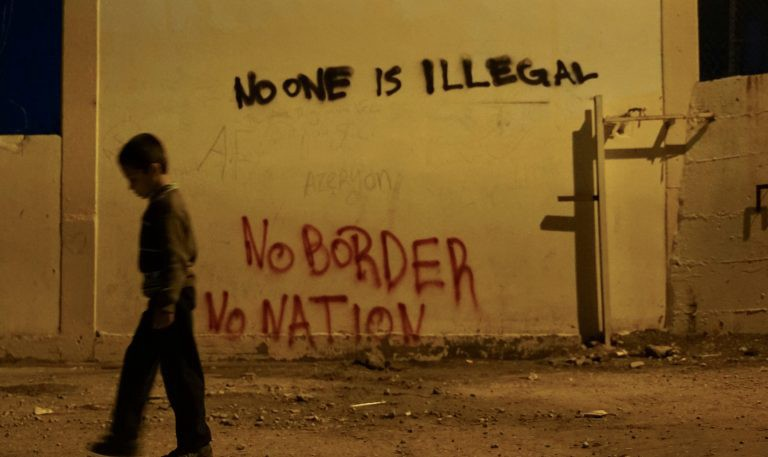

### AYS Daily Digest 28/05/2020: New testimonies of violent push backs
#### Boy gets bitten by a police dog during a push back // Indications of a push back after reaching Mytilene // Critic of Greek governments behaviour in crisis // 11\.000 recognized refugees in Greece face homelessness as of next Monday // Apology by Moria Corona Awareness Team// More details on the pushbacks from Croatia that involved the spraying of people’s heads // Thirty people on the move massacred in Libya

Copytright: No Border Kitchen Lesvos
### FEATURE: Border Violence in Slovenia

We would like to start todays digest by telling you about an incident that happened to a group of young boys in Slovenia\. 
The group made it into Slovenia after crossing Croatia where they hid in the forests in order not to be discovered and violently pushed back into Bosnia and Herzegovina, where they have been before\. In Slovenia the police eventually discovered the group\. They ordered them to sit down\. Then they brought a dog\. They incited the dog to attack the boys\. The dog bit the ear of one of the boys\. The policeman where standing around, laughing and making fun of them\. They took pictures\. Later, the police forced the boys into a police car and brought them to the police station, where somebody who apparently was a doctor sewed up the wound\. The boy was not brought to a hospital\. A piece of the ear of the boy was lost\. After that, the group was pushed back to Croatia and from there to Bosnia and Herzegovina\. In Velika Kladuša, they met a volunteer from SOS Balkanroute and told the story to her\. The boy who lost parts of his ear is 16 years old\.

■■■■■■■■■■■■■■ 
> **[NoNameKitchen](https://twitter.com/NoNameKitchen1) @ Twitter Says:** 

> > Some days ago, a 16 year old boy arrived in Velika Kladusa, Bosnia, with his ear like this. He told to the volunteers that he was just illegally pushed back from Croatia (and To Croatia he was pushed back from Eslovenia). With his ear broken. https://t.co/fyf1uLAlbQ 

> **Tweeted at [2020-05-28 18:57:04](https://twitter.com/nonamekitchen1/status/1266081068630900736).** 

■■■■■■■■■■■■■■ 

This story was first made public by SOS Balkanroute on May 13th\. No Name Kitchen managed to talk to the boy and was able to give more details on the incident yesterday\. 
The testimonies of this incident is gathered by the Border Violence Monitoring Network \(BVMN\), of which NoName Kitchen and Are You Syrious are part of amongst others\. 
On the Website of BVMN you can find 712 reports on push\-backs and border violence\.

### GREECE
#### More illegal push\-backs

Alarm Phone assumes that a push\-back happened from within Mytilene’s harbour to Turkey\. Alarm Phone has been contacted on Thursay morning by a person who claimed that a relative has been on a boat carrying 59 people\. The contact broke down, but the last GPS position was from the port of Mytilene\. The Greek authorities however claimed to not know anything about this boat\. Later that day, the Turkish Coast Guards informed Alarm Phone that a group of the same size has been pushed back by Greek authorities back to Turkey\. 
In recent weeks, testimonies of pushbacks from Greek territory are repeatedly reported\. This is a new development\. Before, push backs would mainly be conducted in the Aegean Sea and not after people actually set foot on Greek soil\. The fact that the current incident happened after the group has been in Lesvos capital city is a new stage of escalation\. Push\-backs are illegal\. People have the right to claim asylum after reaching European soil\. Every claim has to be reviewed individually\. European border authorities are acting in ways that are not complying with the law and are breaching the non\-refoulement law, one of the main principles of international law\.

■■■■■■■■■■■■■■ 
> **[Alarm Phone](https://twitter.com/alarm_phone) @ Twitter Says:** 

> > ++ Push-back to Turkey from within Mytilene harbour? ++

Earlier we reported on a group that had sent a GPS position from Mytilene harbour before disappearing. The Turkish CG have now told us that a group of the same size was pushed-back by the Greek CG and is back in Turkey. 

> **Tweeted at [2020-05-28 17:52:37](https://twitter.com/alarm_phone/status/1266064850037456897).** 

■■■■■■■■■■■■■■ 

Criticism on the way the Greek government is handling the corona pandemic in regards to transparency is getting louder\. 
The newspaper Kathimerini got insight into a confidential report by an international organisation that critically addresses several issues\. The main point are financial mismanagement when creating a new facility for refugees in Malasaka, the creation of a parallel system of unspecialised civil servants instead of competent administrative structures, heralding unrealistic measure like mass transfers of migrants to the mainland and the closure of reception facilities, not to have a plan for thousands of people who are facing homelessness because they will have to leave their accommodations soon, and the ministry’s falsely presentation of a positive picture of the whole situation\.

Just some weeks ago, the Migration Minister Mitarakis has been heavily criticised for setting up a black fund to finance projects on behalf of the Ministry for Migration\. The documentation of the fund will be destroyed every six months\. Only payments of more than 25\.000 € will be submitted to a special committee of the Greek parliament\. Some analysts fear that with the money from this fund, the Migration Ministry will try to pay off opponents of its policies, for example when it comes to the construction of new facilities to host refugees\. 
For more information on this black fund, see:

This and various other measures that have been taken in the last weeks seem to undermine parliamentarian control over the government’s action\. At the moment, only few new laws are legislated, while most of the government’s work is done through ministerial decisions and legislative decrees\. 
For more information on the lack of transparency in the Greek government’s current actions:

■■■■■■■■■■■■■■ 
> **[Mare Liberum e.V.](https://twitter.com/teammareliberum) @ Twitter Says:** 

> > Everyone that comes to #Greece is currently being checked for #COVID19. Travellers that land in Athens enjoy the full welcome package paid for by the government, whereas the group of 16 refugees that landed on #Lesvos is forced to live in a bus for one week already!
#refugeesgr https://t.co/Jw0O9y4LIi 

> **Tweeted at [2020-05-28 12:15:37](https://twitter.com/teammareliberum/status/1265980043639033856).** 

■■■■■■■■■■■■■■ 

\(This Tweet by Mare Liberum receives a lot of hatred and racist comments\. Consider leaving a comment of support, if you are active on twitter\. Being wealthy enough and able to enter the country “legally” or as a tourist is a privilege that is merely bound to possessing the “right” passport\. \)

As of next Monday, first of June, some 11\.000 people with recognized refugee statues will have to leave their accommodations on the mainland\. As included in the Greek Asylum legislation from February 2020, people with a positive decision of their asylum application will only be allowed to stay in camps and other subsidized facilities for one month\. Everybody who got his positive decision before May 2nd will therefore have to leave as of beginning of June\. It is argued that through this step, space is created to be able to transfer more people from the overcrowded camps on the islands\. But since Greece is doing little to nothing to integrate recognized refugees, the risk that many will face homelessness is extremely high\. Finding an apartment and a job to support oneself as a refugee in a country that’s economy is still struggling and now hit by the lockdown will be close to impossible for most refugees\. 
No Border Kitchen Lesvos gives an account on Facebook on what that actually means for people on the ground\. They reported about a house in Mytilene, Lesvos, that is run by the NGO Illaktida and supported by UNHCR and UNICEF\. The house is designed to host people who are regarded as most vulnerable for the time of their asylum procedure and, if necessary, beyond\. The facility costs the Greek government nothing, since Illaktida and UNHCR are paying the rent and the costs of the project\. Still, also people from this facility are supposed to be evicted\. Some of the people who are now supposed to travel to the mainland and live without any support did not even receive their travel documents yet and have appointments with official institutions on the island after the date of their eviction\. Again, all of them belong to the group of most vulnerable people\. 
No Border Kitchen Lesvos states in their post:

> “By mistreating even the people that have been able to prove their asylum claim as valid, it fits neatly into their policy of making greece an “unnatracitive” country for migration\. And this is a very nasty business\.“ 

For more information also see:

The Moria Corona Awareness Team published an apology on their Facebook account\. In an interview with a Norwegian Newspaper, one person has been citied with talking about the “Greek side of Lesvos Island”, when referring to the outside of Moria camp\. This prompted sharp criticism, as some people apparently read from this that the MCAT regards Moria as “their” non\-Greek side of Lesvos\. 
This is the apology published by MCAT:

> “Public Correction and Apology
 

> Herwith we want to make a public correction\. When one of our members spoke about the „Greek side of Lesvos Island“ in an interview with the Norwegian newspaper Verdens Gang \(VG\) on May 20th, we never wanted to give the impression that we believe any part of Moria Camp does not belong to Greece\. In contrary we are grateful to the Greek Government and the people of Lesvos to host us in Greece despite all the hardships they are facing\. 
 

> Since we know how the areas outside Moria Camp are looking and we wanted to express our admiration, since the situation in our camp is dominated by grief, lack of water, electricity and security\. The more our camp would look like other parts of Lesvos island the more we would appreciate it\. We are sorry if our statements was read wrong by Greeks who love their country and we apologize for this grave misunderstanding\. We learned the lesson and will not use this phrase again in any statements\.
 

> Moria Corona Awareness Team \(MCAT\), Moria, Lesvos May 27th 2020” 

### CROATIA

New details emerge about an incident of humiliating and violent actions against refugees that happened between the 6th and the 7th of May in Croatia\. The Guardian published an article about the newly gathered information\. The refugees were pushed back from Croatia to Bosnia and Herzegovina\. Testimonies from this article:

> “They \[the Croatian police\] made crosses on our heads and on some guys they coloured their moustaches or foreheads,” said an asylum seeker\. “They then made us take off our clothes and shoes, took our money and mobile phones and set fire to our clothes and belongings\. Around 10 of them stood in a line and made us walk past them while they beat us with wooden sticks and police batons\. After this they pushed us into the river and told us not to come back\.”
 

> … A family of two people \(father and son\) reported being forced to place their heads between the body and the door of a police vehicle, while police officers kicked the vehicle door\. The family further reported that the Croatian police fired at them \(7 shots\) after they had swum across the river to Bosnia and Herzegovina\.
 

>  “One group of 11 persons \(including an unaccompanied minor\) reported that police were drinking beer while ‘marking’ and beating them — beer which they had stopped to buy at a store while they were driving to the border,” said the DRC\.” 

For the full article see here:

### AFGHANISTAN

According to newspaper articles, some 350\.000 people returned back to Afghanistan in the last months, amid the corona pandemic\. Some 300\.000 came from Iran and the rest from Pakistan\. Iran is the country that has been hit hardest by the pandemic in the middle east\. In Afghanistan there are some 13\.659 cases of infection with corona virus and 246 cases of death, according to the Johns Hopkins University\.
### LIBYA

Thirty people on the move have been shot in Libya on May 27th\. According to IOM, the massacre took place in a smugglers warehouse near the City of Gharyan\.
Some sources say the killing of the thirty people was an act of revenge after one smuggler has been killed\. IOM calls on the Libyan authorities to launch an investigation\. Taking into account the current situation in Libya and the lack of interest in Europe, it is very unlikely that any proper investigations could be achieved\. Libya is not safe for people on the move\. 
Nevertheless, yesterday over 200 people were intercepted in the Mediterranean when trying to flee the country, according to Alarm Phone\. They were brought back to Libya\. Most of the people who are brought back end up in detention centers, were they are again subject to the arbitrary cruelty of smugglers and war lords\. 
For more information on what happens to people who are intercepted and brought back to Libya, see here:

The Mixed Migration Center published a report on the impact of Covid\-19 on the Mobility of refugees and migrants in Libya\. See [here](http://www.mixedmigration.org/resource/4mi-snapshot-the-impact-of-covid-19-on-the-mobility-of-refugees-and-migrants-in-libya/?fbclid=IwAR1fw-k8F_nX3tuY-CuPucalWlMX6HEMxCoizUi_Q1n9cXUCL6XfwSBrn4Q) \.
### SEA

Many boats tried to cross the Mediterranean yesterday\. These are the numbers from Alarm Phone:

■■■■■■■■■■■■■■ 
> **[Alarm Phone](https://twitter.com/alarm_phone) @ Twitter Says:** 

> > Since yesterday ~260 people on 4 boats called #AlarmPhone when in distress at sea &amp; bravely fighting for their #FreedomOfMovement:

🔸75 people were rescued to #Malta
🔸86 people reached #Lampedusa.
🔸52 people reached #Lampedusa.
🔸49 people reached #Lampedusa. 

> **Tweeted at [2020-05-28 22:18:29](https://twitter.com/alarm_phone/status/1266131757818155008).** 

■■■■■■■■■■■■■■ 

### MALTA

Maltese government apparently has chartered a forth tourist boat to hold people rescued by the Maltese authorities at sea\. It is still very unclear what is supposed to happen to the people on the boats\. Until now, they have not been allowed to disembark and file asylum claims\. There are now some 425 people being held offshore\. IOM and UNHCR called on Malta already one week ago to end the unlawful situation\. 
For more information, see:

### NETHERLANDS

Less people seem to try to cross to the UK via the Netherlands\. The numbers of stowaways decreased in the last months compared to the same time period last year\. This is probably due to travel restrictions and closed borders within Europe, which also affects people on the move who try to hide in vehicles in order to cross the channel\.
### UK

Following the decrease of arrivals in the UK, also the number of filed asylum claims have fallen sharply since the beginning of the pandemic\. In the first four weeks of the lockdown, only 800 applications were filed\. That’s a decrease of 69% compared to the four weeks before the lockdown came into force\. 
For more information, see here:

**Find daily updates and special reports on our [Medium page](https://medium.com/are-you-syrious) \.**

**If you wish to contribute, either by writing a report or a story, or by joining the info gathering team, please let us know\.**

**We strive to echo correct news from the ground through collaboration and fairness\. Every effort has been made to credit organisations and individuals with regard to the supply of information, video, and photo material \(in cases where the source wanted to be accredited\) \. Please notify us regarding corrections\.**

**If there’s anything you want to share or comment, contact us through Facebook, Twitter or write to: areyousyrious@gmail\.com**

_Converted [Medium Post](https://medium.com/are-you-syrious/ays-daily-digest-28-05-2020-new-testimonies-of-violent-push-backs-47c6167286b3) by [ZMediumToMarkdown](https://github.com/ZhgChgLi/ZMediumToMarkdown)._
