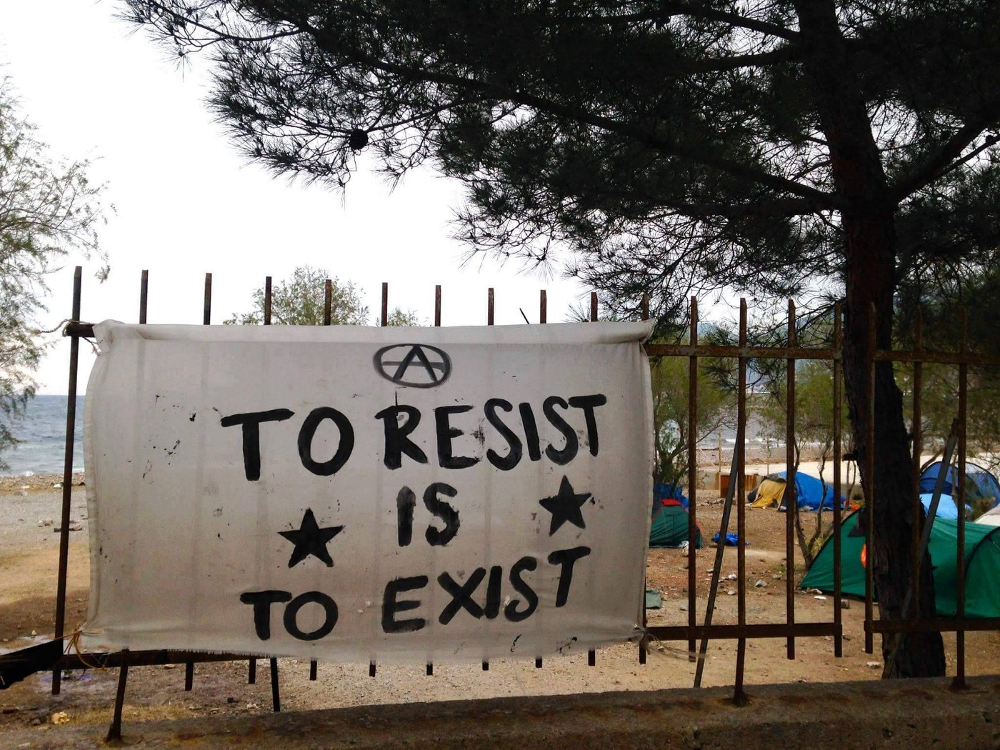
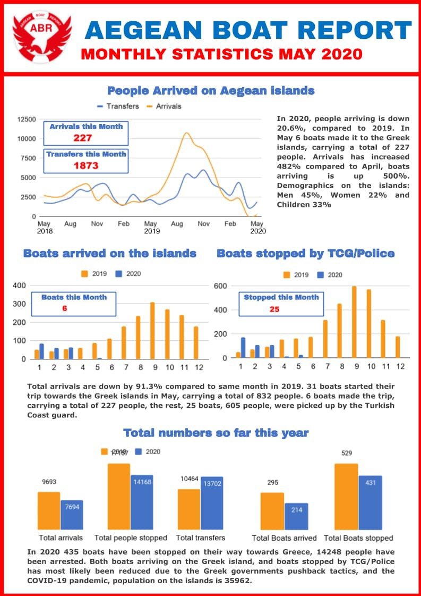

### AYS Daily Digest 2/6/20: Offering hypocrite solidarity while people in our midst suffer, starve and drown?
#### Reflecting on the endless and shameless hypocrisy in the context of BLM / Hunger in Athens knocking at the doors of helpless volunteers, directed by the UN agency officers / silent deaths at the EU border / 1000 more policemen at the Slovene\-Croatian border, propaganda maneuver and an extortion tactic of the government / the number of family reunifications in Germany under the country’s quota / & more news

#### FEATURED
### Concrete solidarity is the only way

US — On the occasion of Blackout Tuesday, the international team of AYS have considered how to show solidarity with the protests against racism and inequality\. The action has been spreading across the world from its outset in the United States following the tragic events in Minneapolis and in many other cities across the country\.

Letting screens go black in a display of solidarity, or letting the Tuesday Digest consist of a sole statement in support of the protests and the action came to mind, but, **in the light of the widespread examples of racism, othering and violence across the globe, the decision of keeping up the reporting and documentation of what is happening, daily, in other parts of the world is the only rational way to go\.**

While black people are killed by state forces in the United States, humans seeking refuge from their former homes throughout Africa and the Middle East are killed by drowning in the Mediterranean or the Aegean Sea, or across the land routes\. This is as a result of other varieties of state repression, and makes the global and international character and the connection between these incidents clear, pointing to the **necessity of universal solidarity as the only real answer\.**

Although we have seen an outpouring of international support for the movement in the US, speaking out and denouncing the murder of George Floyd and the continuation of racist oppression in the US,

> it can be easy for conversations to become distanced from addressing racism in Europe\. Many in Europe consider it to be exempt from these criticisms\. 

But this is simply a fiction that serves to comfort people into complacency\. If racism can be abstracted as an American problem then it in no way touches Europe\. Many Europeans feel comfortable with their police, but much of this is due to the fact that police violence is hidden from view\. Many people have been suffocated due to restriction on deportation flights\. In [this report](https://fra.europa.eu/sites/default/files/fra_uploads/fra-2019-being-black-in-the-eu-summary_en.pdf?fbclid=IwAR0SqDZu_XV6VYOocjzCTdbCsivvooGpSAvlu1cdpvQOtHXVK7pbRgFiWHs) on racially\-based discrimination, Black people in Europe are frequently the target of racially based police stops\. In Austria, for example, 67% of respondents had been stopped by police\. More than half of this number \(37% of the whole group\) feel that they were stopped on racially\-motivated grounds\.

**Employment discrimination against people of African descent in the EU is also telling, with the largest gap of paid work rate between those of African descent and the average being over 35%** in Denmark\. These two examples have been selected as a common retort or explanation that racism is not about colour but about economics\. There is another, also discriminatory, idea that poorer countries show more racist tendencies\. Yet Austria and Denmark lead the rest of the EU by significant margins, in spite of being considered economically stable countries\. One could argue that this might be due to higher reporting in general; however it remains a confounding factor\. What is not confounding, however, is that the investment and commitment to racism demonstrated in the US is not unique to the United States\.

> We must continue to monitor and show our solidarity with those standing up for their rights in the US, but we cannot ignore the lives of those in our neighborhoods\. 

As we can only expect an increased level of violence and repression, in the streets of the United States as well as in the border areas of the European continent, we choose not to follow the blackout, but instead to intensify our effort to cast a spotlight upon the events\. And with an awareness of the connection between the local and the global, from Atlanta to Aleppo, from Indianapolis to Idlib, the solidarity will prevail\.

■■■■■■■■■■■■■■ 
> **[Chris Avramidis](https://twitter.com/chris_avramidis) @ Twitter Says:** 

> > Demonstration in solidarity with #BlackLivesMatter 
#Thessaloniki #Greece https://t.co/MW4L1yAeoU 

> **Tweeted at [2020-06-02 20:42:21](https://twitter.com/chris_avramidis/status/1267919504270602241).** 

■■■■■■■■■■■■■■ 

■■■■■■■■■■■■■■ 
> **[Sally Hayden](https://twitter.com/sallyhayd) @ Twitter Says:** 

> > Read these personal accounts by refugees who are victims of EU policy. Their voices are important too.
1. [independent.co.uk/voices/libya-s…](http://independent.co.uk/voices/libya-strike-refugee-unhcr-tripoli-triq-al-sikka-italy-a9004961.html)
2. [theguardian.com/commentisfree/…](https://www.theguardian.com/commentisfree/2018/nov/08/refugee-libyan-camp-people-dying)
3. [newstatesman.com/world/middle-e…](https://www.newstatesman.com/world/middle-east/2018/12/lgbt-refugee-europe-s-deal-libya-has-left-me-fearing-my-life)
#BlackLivesMatter
[twitter.com/CaroRackete/st…](https://twitter.com/CaroRackete/status/1267337352524988417?s=20) 

> **Tweeted at [2020-06-02 11:34:33](https://twitter.com/sallyhayd/status/1267781646155239425).** 

■■■■■■■■■■■■■■ 

### Athens update from on the ground

GREECE — Since April, Khora Community Kitchen has delivered hot meals and fresh groceries to families around Athens, mainly refugees and asylum seekers, but also Greeks\. Khora has been working in collaboration with SGYF \(Syrian Greek Youth Forum\), Pampiraiki Warehouse, Steps, Manu Aperta and now Magic Kitchen in Exarcheia\. The programme has been an amazingly large\-scale response to a lack of services during the lockdown\. It has brought many grass roots groups even closer together than we already were and provided thousands of meals EVERY DAY to people who needed them\.

> The food delivery service was supposed to be a short\-term fix to cover the gap of services during lockdown, but Khora managed to continue throughout Ramadan as well, improving the walking, cycling and driving routes to cater to as many people as possible\. 

For 1000 euros per week, 300 people have been getting fresh vegetables and fruit, chickpeas, lentils, pasta, rice, oil and tomato sauce delivered across the city, from Piraeus to Pangrati\. It is designed to be supplementary, enough for one meal per day, but, as we have heard from personal experience, for some it is the only recourse to food that they have\.

The waiting list is more than 1,500 people\. No advertising, simply word of mouth\. People are still calling to register on numbers that they have got from other people in their communities\. **Volunteers regularly receive messages on their personal numbers** \(used to contact people to inform them of a delivery\) which have been passed onto other people\. In Dari, Arabic, French and English **they are** **all asking for the same thing: food\.**

Despite the cost\-effectiveness of the service, the long\-term cost for a small grass\-roots group like Khora \(all of whose volunteers are completely unwaged\) is too high\. More importantly, the view was that surely now, with lockdown over, more large\-scale services should be covering basic food needs\. However, this does not seem to be the case\. Today, **on the final grocery/dry food deliveries being made, people have been reaching out to volunteers, begging them to continue the deliveries** \.

> The experience of volunteers with Athens Food Collective has revealed the uncomfortable fact that many many people in this city are going hungry, with or without the lockdown\. 

Families who find it a challenge to come into the city centre and access services, people without shelter, registered and unregistered asylum seekers\. At the height of the lockdown [UN Refugee Agency](https://medium.com/u/75f2bdd89854) **was referring hungry people to Khora, not the other way round\.** Perhaps it still is\.

Now, people whose white cards were valid for 6 months and expired between 13th march and 31st May have just been told that they should not seek to renew them for another 6 months\. Essentially it’s an **automatic extension of the waiting time, already unbearably long for most\.**

> For the unknown thousands of unregistered people the Covid\-19 restrictions have meant no access even to the woefully inadequate UN cash card or any other official services\. 

Individuals are profiteering from this chaos, from lawyers charging huge sums to ‘help’ people with their delayed cases, to landlords charging a 3\-generation Afghani family of 10 an absurd 400 euros per month for one room in an apartment\. This should be the rough cost of an entire 2 or 3 bed apartment\. To make it worse, yesterday **thousands of people who have aslyum were evicted from their homes in the camps, many onto the street** \.

> During the lockdown they had been expected to somehow find alternative affordable accommodation whilst being forbidden to leave the camp, an almost impossible task even during normal times\. 

The only programme designed to support them, Helios, is little known, still small\-scale and only supports people previously in UN accommodation\. It seems that if you have been forced into private rental because of a lack of UN or other NGO accommodation, you are not eligible for housing support ever\. Combine this with your only source of money being cut \(the UN cash card\) and you find recognised refugees who have been in Greece for several years no better off than they were when they first arrived:

> No money, no home, no support to re\-start their lives, whether that is through stable accommodation and integration support\. 

Those that have been able to find work through more informal networks are often obliged to work on the black market, exploited, illegal and insecure\.

With few options, the natural next step is to wait for your travel documents, fly to northern Europe and take your chances there, hoping that you won’t be returned\. This is a Europe that turns a blind eye to the wilful mismanagement of the refugee situation in Greece and refuses to take responsibility for permanently re\-homing refugees in other EU member states\. In Greece it is widely understood that there is little point in trying to obtain Greek nationality, as there are entire migrant communities who have grown up in Greece who are unable to achieve this \(the older Sub\-saharan African community and Albanians to name just two\) \. The mantra of, ‘there is no future in Greece’ is not necessarily true; however **the Greek government’s perceived treatment of refugees convinces most of them that there is no dignified life for them here\.**

The lock\-down has been a cruel time for many and has exposed just how vulnerable people are in a system that is failing to provide even the bare minimum of adequate food and shelter\. One Arabic\-speaking service user, a regular at STEPS and Khora previously, was **found outside the Khora kitchen two days ago\. She had not eaten, her clothes were soiled and her arm was damaged\.** All she could say was that she needed a place to stay \(the people in the place she was sleeping were ‘not good,’\) and that it had been difficult during lockdown because she had had little contact with her support network\. The Greek government may congratulate itself on averting a crisis amongst most of its citizens, but for the most vulnerable it has exposed even more clearly the impossible situation faced by many in their quest for basic needs\.

> It seems laughable that a government that regularly claims to be unable to cover the financial ‘burden’ of the refugee situation has [announced that it will pay for hotel accommodation](https://www.ekathimerini.com/.../greece-to-pay-for...) for any tourist who tests positive for Corona during their time in the country\. 

Khora has been acting in solidarity with people whose needs should have been, and should be covered by the UN, the Greek government and the EU\. Many long\-term volunteers have observed that the situation on the ground has deteriorated over the past three or four years\.

> It is still the case that thousands of people arrive to Europe’s shores hoping for safety, security and shelter only to be met by indifference, political point\-scoring, racism, lack of stability and hunger\. 

#### GREECE
### Arrivals by sea

Here is the monthly report from Aegean Boat Report for May 2020 by ABR\. For more detailed statistics go to [aegeanboatreport\.com\.](http://aegeanboatreport.com/?fbclid=IwAR1JugKr45EuoanVjApTd4e04E_HO3KX12QoHf3HHFIWopKYJt0EHaiH1vs) / ABR Statistics\.

](assets/a24cc60cbff0/1*NRyvHkbjS_hA9z8yWNvVCA.jpeg)

Infographics by [Aegean Boat Report](https://www.facebook.com/AegeanBoatReport/?__xts__%5B0%5D=68.ARALs6C6mAHhyVonGx6iGr6ynIcQnerbVfRvSRNQ5RxV_Wa4NLL0OeC8ASEaBBiBSWb-LR1B34EwT6jxxsojHYsqwevEkB71w3EuEWFxPlzE2_8vG7q2sNoYXLmEkxXZ6jIgN5un7fmVj3qfIFLbwcee8HBqPITaWIzcCYhvIVIQ7Ac1GGOBxBx4hFtIUxiTCWhQNippAHYmSqr9LKllhDYRft7-L9ftXtWc16NcAkkoWvWUYXf8sLTtk-Gp6Dxr92Zicf2Qm8XEWd_ARAmUXx4UvsiItYfhNxOgITfZr7P6UCiCjU-xT37cMvdFgzMcj3DBGC6HBkwI_G4_NvbQ9pE&__tn__=k%2AF&tn-str=k%2AF)

The Turkish Coast Guard continues operating in Greek waters, Alarm Phone reports\.

■■■■■■■■■■■■■■ 
> **[Mare Liberum e.V.](https://twitter.com/teammareliberum) @ Twitter Says:** 

> > The @[alarm_phone](https://twitter.com/alarm_phone) was alerted to two boats drifting off #Lesvos. Accordingly, they can't move and thus need to be rescued, which the Turkish Coast Guard is now doing - in Greek territorial waters! 

> **Tweeted at [2020-06-02 11:23:14](https://twitter.com/teammareliberum/status/1267778800470896641).** 

■■■■■■■■■■■■■■ 

### Official complaint based on the BVMN report

The specific allegations, which are accompanied by photographic material, concern violence, humiliating treatment and torture, theft of personal belongings and the illegal repatriation of at least 194 people from the refugee camp in Diavata and from the pre\-departure center in Paranesti, Drama March 30 to April 28, 2020\.

> This practice is, of course, illegal, not only in general, but also during the period March 2020, when the country “suspended” the right of immigrants to apply for asylum without being granted it\. However, there is no such possibility under international law\. 

■■■■■■■■■■■■■■ 
> **[Vassilis Tsarnas](https://twitter.com/VassilisTsarnas) @ Twitter Says:** 

> > We filed a criminal complaint based on a report by @[Border_Violence](https://twitter.com/Border_Violence) and their member orgs in #Greece, @[mobileinfoteam](https://twitter.com/mobileinfoteam) and @[WaveThess](https://twitter.com/WaveThess), concerning violent, illegal #PushBacks by the Greek authorities of, at least, 194 #RefugeesGr by Diavata and Paranesti in the end of March &amp; April https://t.co/NNoHdgKt8C 

> **Tweeted at [2020-06-02 18:18:59](https://twitter.com/vassilistsarnas/status/1267883425718992897).** 

■■■■■■■■■■■■■■ 

Read more \( [in Greek](https://racistcrimeswatch.wordpress.com/2020/06/02/2-233/?fbclid=IwAR21hzx2xDFBWrrDD2JuWlEMXprkYgTAfu4qOv_aHNYoNFPRswEN5mA3h-U) \) \.
#### BOSNIA AND HERZEGOVINA

At a press conference to announce his resignation, the federal security minister cited a disagreement with coalition partners over the migrant crisis, BI reports\. Radončić had advocated the deportation of 9,500 people on the move currently registered in Bosnia and Herzegovina, who he claimed are a “major security risk to the country\.” Also, in April, he accused Pakistan’s ambassador to Sarajevo of refusing to cooperate with the Bosnian authorities in establishing the identities of migrants coming from Pakistan\.

Still, the overall situation is not changing\. Numerous reports of people being beaten for protesting the conditions inside the official camps, people being refused in the recently installed provisional camp Lipa, in the outskirts of Bihać, due to it being overcrowded, and many, many undocumented violent entries and pressure at the people hiding in squats and other unfit spaces, out of fear and desperation — none of that has changed\. There is little to no official communication on the number of accusations the international organisations have received from the local actors — groups and individuals, and in the meantime, there are just more reports on the wounds, traumas and lost lives of those who tried to move on\.

People are reporting drownings in the border area rivers Korana and possible drownings in Mrežnica, but nobody officially reports on these deaths, so in order to help those in search of their loved ones, each time, the chain of \(mis\)information is a long and dreadful process\. We are aware that the morgue in Croatian capital recently had up to a dozen unidentified bodies, possibly of people in transit\. However, with no one reaching out in order to find their relatives, organisations who are willing to help, or even to report such deaths, are unable to\.

#### SLOVENIA

Slovenian police has just \(June 2nd\) deployed an additional 1000 officers \(20% of all uniformed members\) with the aim of “strengthening the control Croatian frontier”, Info Kolpa reports\. The deployment of such an overwhelming force is a **temporary measure active from 2nd till 5th of June** \. The acting chief of police J\. Senica said that the aim of this deployment is: “To send a message to migrants and organizers of illegal crossings that the route through Slovenia in not worth it\.” He added that police will use all of its technical capacitates as well as service members from all branches including special forces\.

> Additional police will most likely be used for interception of people on the move and returning them to Croatia \(who in turn transport them in to Bosnia and Hercegovina\) without a right of appeal or a chance to apply for asylum\. 

During the epidemic, the Slovenian Ministry of Interior has, under the new right wing government, also started to build an additional 40 km of fence on the border with Croatia\. This will increase the total length of the fence on Slovenian\-Croatian border to 240 km\.

> **The practice of pushbacks to Croatia is still present and on the rise, this year by the end of April Slovenian police has apprehended 3112 people because of illegal border crossing, 1512 of them were returned to Croatia under the readmission agreement\. According to testimonies and due to the large number of returns, Slovenian police continues with the practice of systematic denial of the right to asylum and abuse of readmission procedures\.** 

This measure can be understood as an unapologetic propaganda maneuver and an extortion tactic as the government recently failed to gain support from the Defense committee by activating a controversial article of the Law on defence that would grant the army police authority as a measure to “relieve the police” during the epidemic\. Though the army \(without extra powers\) has been present at the border since 2015, this manoeuvre can be understood as a scare tactic to convince the public and the opposition that migrants do posses a threat to the national security\.

This display of determination came without warning but as no surprise, since the government is keen to demonstrate a show of force with unusual timing and unclear aims\. For instance, on Monday \(June 1st\) they arranged a fly over Slovenia of American F\-16 fighters as a celebration of victory” over Covid\-19 virus and a “salute to health workers”\. The health workers that got an expensive fly over of an F\-16 fighter in their honor did not receive their bonuses as they were promised\.

Please, take time to read our latest [**AYS Special: Italian Court Stops Deportation to Slovenia, Meanwhile Pushbacks Continue**](https://medium.com/are-you-syrious/ays-special-italian-court-stops-deportation-to-slovenia-meanwhile-pushbacks-continue-a0370c30cd02?source=collection_home---7------0-----------------------) , written by our friends from Slovenia, Info Kolpa activists, explaining how Italy has become the latest link in chain push backs where literally thousands of people, often violently, end up in the overcrowded camps of Bosnia and Herzegovina, and Serbia:

#### FRANCE
### Paris

The Break Poverty Foundation distributes computers to families whose children attend school at a distance\. These families are in precarious situations and often live below the poverty line\. Their goal is that the children can have a normal schooling in this period of crisis and distance learning\. About 60 people have been sleeping in tents on the quay of the Bassin de La Villette since May 26th\. They are mostly single women and children from 3 months to 12 years old, all of them exiled\. The association Utopia56 warns about the lack of sustainable solutions for these families\.
### Tarn

The Restos du Coeur have 40% more beneficiaries\. They’re going to open one day or two more than usual\. They fear a further increase in the number of beneficiaries\. In the Lot, Secours Populaire is making the same observation\. Other associations of the same type speak of an increase of between 20% and 60%\.

Read more on the recent developments in France in our upcoming AYS Special, focusing on what’s been going on across the country in recent months\.
#### GERMANY
### Thuringia the first federal state to formally decide to accept 500 refugees from the Greek islands

■■■■■■■■■■■■■■ 
> **[Erik Marquardt](https://twitter.com/ErikMarquardt) @ Twitter Says:** 

> > Endlich! Thüringen hat als erstes Bundesland formal beschlossen 500 Geflüchtete von den griechischen Inseln aufzunehmen. War ein langer Weg und wir sind lange nicht am Ziel. Jetzt müssen andere Länder nachziehen und den Druck auf Seehofer weiter erhöhen. #LeaveNoOneBehind 

> **Tweeted at [2020-06-02 11:33:24](https://twitter.com/erikmarquardt/status/1267781358836944896).** 

■■■■■■■■■■■■■■ 

At the same time, **the government quota of 1,000 visas per month was not reached\.** Around 1920 visas were issued during the first four months of this year, with a consecutive downward trend each month\. While 782 visas were issued in February, the number went down to 480 in March and dwindled to only 4 cases in April, according to figures by the interior ministry, InfoMigrants [reports](https://www.infomigrants.net/en/post/25115/family-reunification-in-germany-numbers-below-government-limit?fbclid=IwAR2Kv_lvpIH0iO3-aahMYKqA9dKjuaJcLaWg_WjsdRrgKAijk7BQ2AGj0nc) \.
#### UK

■■■■■■■■■■■■■■ 
> **[France-UK Border Research](https://twitter.com/FrUKBorder) @ Twitter Says:** 

> > Australia - which interns people indefinitely on islands like Manus - are advising the British government on border controls in an attempt to stop Channel crossings. [telegraph.co.uk/news/2020/05/3…](https://www.telegraph.co.uk/news/2020/05/31/channel-crossings-will-continue-long-illegal-migrants-allowed/) 

> **Tweeted at [2020-06-02 09:54:14](https://twitter.com/frukborder/status/1267756401499279368).** 

■■■■■■■■■■■■■■ 

**Find daily updates and special reports on our [Medium page](https://medium.com/are-you-syrious) \.**

**If you wish to contribute, either by writing a report or a story, or by joining the info gathering team, please let us know\.**

**We strive to echo correct news from the ground through collaboration and fairness\. Every effort has been made to credit organisations and individuals with regard to the supply of information, video, and photo material \(in cases where the source wanted to be accredited\) \. Please notify us regarding corrections\.**

**If there’s anything you want to share or comment, contact us through Facebook, Twitter or write to: areyousyrious@gmail\.com**

_Converted [Medium Post](https://medium.com/are-you-syrious/ays-daily-digest-2-6-20-offering-hypocrite-solidarity-while-people-in-our-midst-suffer-starve-a24cc60cbff0) by [ZMediumToMarkdown](https://github.com/ZhgChgLi/ZMediumToMarkdown)._
