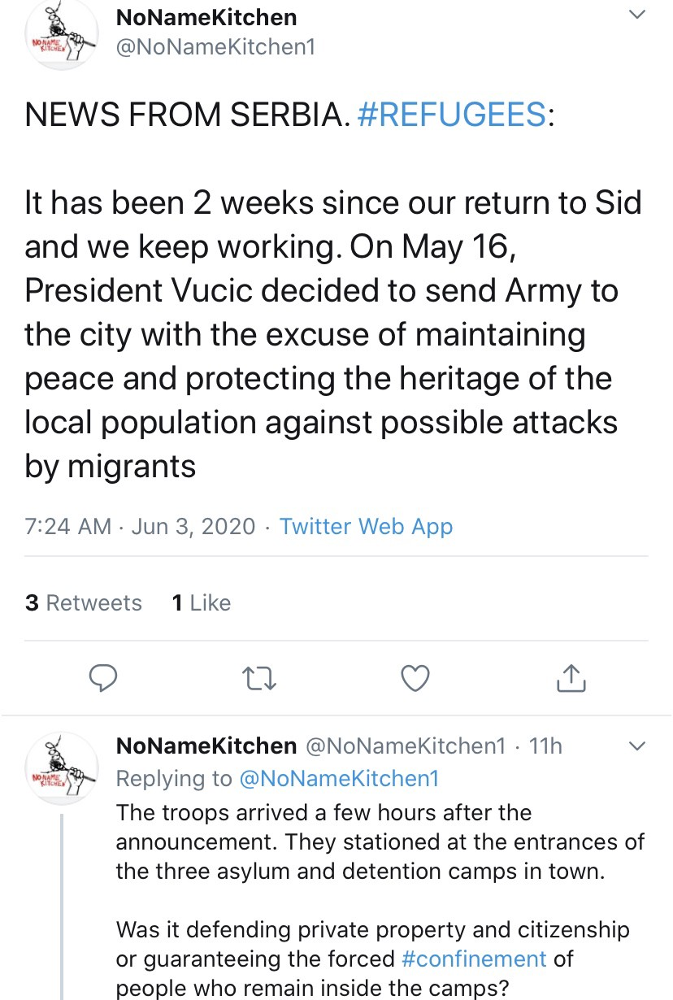

### AYS Daily Digest 3/6/20 ~400 people are stranded in ships off the coast of Malta
#### Demands for trafficking and murders in Libya // New laws harm NGOs in Greece // New housing in Germany for refugees // and more…

](assets/7c3ba81b2ca9/1*s_wZh72xx_tTEmL5JHHT4g.jpeg)

People stuck on a tourist ship, waiting for answers from sea\. Photo by [Jonathan Borg](https://timesofmalta.com/articles/view/young-men-sit-and-wait-aboard-maltas-offshore-detention-centres.796023?fbclid=IwAR2gBadpq_31eJTZ_yo6iiemzJymEYRgfajCrL3hPS3TIzi5gItefpDVUFI)
### FEATURE Over 400 people are stranded off the coast of Malta on cruise ships

Well it might sound luxurious, the reality is far from that\. [Malta Today](https://www.maltatoday.com.mt/comment/blogs/102694/illegal_floating_prisons__carla_camilleri?fbclid=IwAR2TuuRlN7VhHXecY6nGDd9HsPXkk4nF6tQ8g-pk-5xaZ8w8d5lzQWG-UoI#.XtgjhDpKg2w) emphasizes how this is breaking international law:

> “They have no contact with the outside world, no contact with the authorities and no contact with monitoring bodies or lawyers\. They cannot leave the place where they are being held, and in most probability, they have little or no contact with family members\. 

> This form of incommunicado detention, compounded by the lack of access to information, for an indefinite period of time constitutes the most serious violation of the norm protecting the right to liberty of human beings\.” 

[SOS Mediterranee](https://www.aljazeera.com/news/2020/06/400-rescued-migrants-stranded-malta-coast-200603161615932.html?fbclid=IwAR0a87bwovno9Nl0gGhp3XPJACQNnctBS2Nvj9V--nsvJg5WtMxHvq0M2hg) adds that:

> “Instead of disembarking them in a safe place as international law requires, those rescued at sea are being used for political negotiations with EU member states\.” 

[France](https://www.aljazeera.com/news/2020/06/400-rescued-migrants-stranded-malta-coast-200603161615932.html?fbclid=IwAR0a87bwovno9Nl0gGhp3XPJACQNnctBS2Nvj9V--nsvJg5WtMxHvq0M2hg) has already stepped up some and said that they will take in some of the people stranded\. But for now, with Malta’s ports still closed because of the pandemic, people are just having to wait\. More [here](https://www.maltatoday.com.mt/comment/blogs/102694/illegal_floating_prisons__carla_camilleri?fbclid=IwAR2TuuRlN7VhHXecY6nGDd9HsPXkk4nF6tQ8g-pk-5xaZ8w8d5lzQWG-UoI#.XtgjhDpKg2w) \.

](assets/7c3ba81b2ca9/1*3faTBttEPR-ca9qNrpLfVQ.jpeg)

Photo by [RENE ROSSIGNAUD](https://www.hickoryrecord.com/news/world/rescue-migrants-stranded-on-chartered-maltese-pleasure-boats/article_6ce9fca6-bcfe-513e-804f-cc2973c85d1a.html)
#### LIBYA

In a joint statement, **CHDRA and 41 Libyan organizations condemn the massacre of 30 migrants in Mizdah** :

First for context:

> “26 migrants from Bangladesh and four African nationalities lost their lives on Wednesday, 27 May 2020, and 11 other migrants were injured, some of whom were transferred to Tripoli for treatment, according to statement from the Ministry of Interior in the National Accord Government\. 

> The perpetrators surrounded the detention site for migrants, run by smugglers from the town of Mizdah, and fired intensively at the place where approximately 200 migrants of different nationalities were held according to reliable sources in Mazda…The sources added “The attack came after the killing of a well\-known human trafficker called ‘Youssef Mohamed’ by a group of migrants detained at the place\.’” 

The signers’ demands:

> “The signing organizations in this statement stress the necessity of following up and closing these ‘migrants warehouses’ that sell, smuggle and traffic migrants openly in many Libyan cities\. It is unacceptable for these crimes to be carried on by these criminal gangs of smuggling and trafficking who have taken advantage of the ongoing situation within the country, from armed conflicts, political and institutional division, which have killed hundreds of Libyans, not to mention the vulnerable migrants and asylum seekers\. 

> \(We demand that\) 1\) The Public Prosecutor’s Office to open a fast and transparent investigation into the mass killing of migrants in Mizdah, identifying those responsible for the crime, pursuing and punishing the perpetrators\. 2\) The local authorities to disclose the fate and whereabouts of the remaining migrants, asylum seekers and workers who escaped the massacre at the assaulted smuggling warehouse\.” 

Find out the longer list of demands [here](https://www.defendercenter.org/4716) \.
#### GREECE

And what is the response to the push backs, Frontex Chief Leggeri? \(below\)

■■■■■■■■■■■■■■ 
> **[RSA](https://twitter.com/rspaegean) @ Twitter Says:** 

> > Dietmar Koster MEP said yesterday that Frontex Chief Leggeri confirmed push-back cases by Greece after refugees had reached the coasts of some islands. #refugeesGR 

[facebook.com/dietmar.fuer.e…](https://www.facebook.com/dietmar.fuer.europa/?__tn__=kC-R&eid=ARCtjmwXwnoyCj7Ged5YvYLb0Iz_UoAbTUgXpW3KqsyEmqzcss_TBuF51_FYaLlymdB_2TpcSoi2PKhz&hc_ref=ARSmb8EKOSQ0CAAlyh8TIcs6MATs_v20UAZoiDUDmaMzvGxnbnSivCR7X9bJ_dPRXZs&fref=nf&__xts__[0]=68.ARChWRukJgpKk4Aa_glftPcijHatY4p17Y-nIIHdHVt-ln4r02MBuuLoJBerdIGAMZPKN39MpgLiPpphn2kMVu4d3uxrXlY0vxoyXwmG_7TyZ8BbX0O-OMXFlf98yaWCMxn47YKjXhSBBRJ7VCdmDUd4X3c15qNO-0xqdIHyw7qDw5Pmt3H4hQJ7BJnuxblDIElGv897zewBbxMecJVPeNIZuziEl2_YPZUydOqMjsc-42wjthWXbM2ON0cm4KH2QXHEOmGBdM3okgkZlzNzBCOL6LWxQRyY-UfGwiteOexxGLWpvfn_pKlObOmiNzNelY79QS8TSNZbEDj50ALm8LCipw) 

> **Tweeted at [2020-06-03 18:49:49](https://twitter.com/rspaegean/status/1268253573483319299).** 

■■■■■■■■■■■■■■ 

 would close 60 facilities for [\#refugees](https://twitter.com/hashtag/refugeesgr?src=hashtag_click) by the end of this year and to “secure“ existing camps by a controlled exit and entry systems and double fencing\. Picture taken today at [\#Moriacamp](https://twitter.com/hashtag/Moriacamp?src=hashtag_click) on [\#Lesbos](https://twitter.com/hashtag/Lesbos?src=hashtag_click) \.” Info and photo by 
[Franziska Grillmeier](https://twitter.com/f_grillmeier/status/1268135147121057792)](assets/7c3ba81b2ca9/1*p0X3-OUICDn_vJqkfWU3BQ.jpeg)

“The Greek Migration and Asylum Minister, Notis Mitarakis, announced that [\#Greece](https://twitter.com/hashtag/Greece?src=hashtag_click) would close 60 facilities for [\#refugees](https://twitter.com/hashtag/refugeesgr?src=hashtag_click) by the end of this year and to “secure“ existing camps by a controlled exit and entry systems and double fencing\. Picture taken today at [\#Moriacamp](https://twitter.com/hashtag/Moriacamp?src=hashtag_click) on [\#Lesbos](https://twitter.com/hashtag/Lesbos?src=hashtag_click) \.” Info and photo by 
[Franziska Grillmeier](https://twitter.com/f_grillmeier/status/1268135147121057792)

■■■■■■■■■■■■■■ 
> **[Izzy Ellis](https://twitter.com/_izzyellis) @ Twitter Says:** 

> > This morning, over 100 refugees or recipients of subsidiary protection were told to leave Vial camp on Chios. Above a list of names, a poster read: "all of them must leave immediately from the CAMP."

The latest in the increasing &amp; unchecked violence by Greek authorities. https://t.co/47azVNoiva 

> **Tweeted at [2020-06-03 17:52:50](https://twitter.com/_izzyellis/status/1268239231249514496).** 

■■■■■■■■■■■■■■ 

### **New Greek laws put pressure on grassroots NGOs and make starting new NGOs nearly impossible**

They are arguing for more transparency, however NGOs argue some will be impossible to implement\. There are more costs for registration, you need to show financial statements dating back to two years, etc\. Greece has 86 registered NGOs working on migration \(73 are national and 13 are international\) and the smaller ones or the ones that were recently created seem to have the most to lose from this\. More [here](https://euobserver.com/migration/148530?fbclid=IwAR1fxWhGbHl0doM6QNJUPTdOK_xukCqhH7uaHiwuTLlWWQj9P5bl1q-p4co) \.

■■■■■■■■■■■■■■ 
> **[Tihomir Sabchev](https://twitter.com/TihomirSabchev) @ Twitter Says:** 

> > Since late 2015 the migration ministers of two different governments in Greece have argued that the vast majority of arrivals are economic migrants and not refugees, justifying Moria &amp; the securitization approach. 

Is this true? Data shows exactly the opposite trend... https://t.co/aCjEyDskRS 

> **Tweeted at [2020-06-03 07:59:36](https://twitter.com/tihomirsabchev/status/1268089938878349312).** 

■■■■■■■■■■■■■■ 

 on these islands fail to adhere to these principles\. RRE calls for respect for the right of unaccompanied children to be placed in appropriate housing\.” Find the report here\. Photo of report by [Refugee Rights Europe](https://www.facebook.com/RefugeeRightsEurope/photos/a.1502441746729332/2311337429173089/?type=1&theater)](assets/7c3ba81b2ca9/1*yCrSGecQjv9nrWyCHcJQxQ.jpeg)

“Detention of children and families for purely migration\-related reasons is prohibited under various articles of the Convention on the Rights of the Child, a principle also recognized in Greek law\. ❗Our newly released report on Leros and Kos hotspots finds that detention practices, both before and during [\#Covid\_19](https://www.facebook.com/hashtag/covid_19?__eep__=6&epa=HASHTAG) on these islands fail to adhere to these principles\. RRE calls for respect for the right of unaccompanied children to be placed in appropriate housing\.” Find the report here\. Photo of report by [Refugee Rights Europe](https://www.facebook.com/RefugeeRightsEurope/photos/a.1502441746729332/2311337429173089/?type=1&theater)

Check out this interesting [documentary](https://www.facebook.com/AthensLiveGr/posts/2604775223127832?hc_location=ufi) “Unwanted Destination” on the intersection of housing and refugees in Greece\.

Racism, alive and well, world wide:

](assets/7c3ba81b2ca9/1*5iIPsC_PzsWQDI1ElRvZow.png)

“The Church of Greece donated defense material to the Ministry of the Nation for the construction of the fence in Evros as well as thermal cameras so that ‘not even Christ’ can pass through the refugees\.” Info and photo by [Stelios Nikitopoulos](https://twitter.com/stenikito/status/1268087603020148739)
#### MALTA

](assets/7c3ba81b2ca9/1*s_wZh72xx_tTEmL5JHHT4g.jpeg)

People stuck on a tourist ship, waiting for answers from the sea\. Photo by [Jonathan Borg](https://timesofmalta.com/articles/view/young-men-sit-and-wait-aboard-maltas-offshore-detention-centres.796023?fbclid=IwAR2gBadpq_31eJTZ_yo6iiemzJymEYRgfajCrL3hPS3TIzi5gItefpDVUFI)
### Over 400 people are stranded off the coast of Malta on cruise ships

While it might sound luxurious, the reality is far from that\. [Malta Today](https://www.maltatoday.com.mt/comment/blogs/102694/illegal_floating_prisons__carla_camilleri?fbclid=IwAR2TuuRlN7VhHXecY6nGDd9HsPXkk4nF6tQ8g-pk-5xaZ8w8d5lzQWG-UoI#.XtgjhDpKg2w) emphasizes how this is breaking international law:

> “They have no contact with the outside world, no contact with the authorities and no contact with monitoring bodies or lawyers\. They cannot leave the place where they are being held, and in most probability, they have little or no contact with family members\. 

> This form of incommunicado detention, compounded by the lack of access to information, for an indefinite period of time constitutes the most serious violation of the norm protecting the right to liberty of human beings\.” 

[SOS Mediterranee](https://www.aljazeera.com/news/2020/06/400-rescued-migrants-stranded-malta-coast-200603161615932.html?fbclid=IwAR0a87bwovno9Nl0gGhp3XPJACQNnctBS2Nvj9V--nsvJg5WtMxHvq0M2hg) adds that:

> “Instead of disembarking them in a safe place as international law requires, those rescued at sea are being used for political negotiations with EU member states\.” 

[France](https://www.aljazeera.com/news/2020/06/400-rescued-migrants-stranded-malta-coast-200603161615932.html?fbclid=IwAR0a87bwovno9Nl0gGhp3XPJACQNnctBS2Nvj9V--nsvJg5WtMxHvq0M2hg) has already stepped up and said that they will take in some of the people stranded\. But for now, with Malta’s ports still closed because of the pandemic, people are just having to wait\. More [here](https://www.maltatoday.com.mt/comment/blogs/102694/illegal_floating_prisons__carla_camilleri?fbclid=IwAR2TuuRlN7VhHXecY6nGDd9HsPXkk4nF6tQ8g-pk-5xaZ8w8d5lzQWG-UoI#.XtgjhDpKg2w) \.

](assets/7c3ba81b2ca9/1*DSLPYtIBqowoPZrlIYObgQ.jpeg)

People gathered outside the the Marsa migrant centre Tuesday morning protesting and demanding to “be free\.” Photo by [Mark Zammit Cordina](https://timesofmalta.com/articles/view/migrants-demand-freedom-at-marsa-centre-protest.795939?fbclid=IwAR35vWpF6UZm9P3mBKxVGUwFbYL-QMiUxqjyvJ9qbXGy3m6cIni1wGr6bSI)

The only detail on “the migrant deal” discussed during the meeting between Maltese prime minister Robert Abela and Libyan prime minister Fayez al\-Sarraj in Tripoli on 28 May, is that it might include two coordination offices, one in Malta one in Libya\.

As war goes on in Libya and COVID\-19 is escalating in a country without many means of prevention, a deal to possibly send back people who reached Malta to Libya would be completely inhumane\. More [here](https://euobserver.com/foreign/148518?fbclid=IwAR2k5LPK2ep56R9Fb2uyEGtHP7FkuClDkdT3zxot-Tmw4BzuXdfpCdNp-1Q) \.

■■■■■■■■■■■■■■ 
> **[Matthew Agius](https://twitter.com/mattagius) @ Twitter Says:** 

> > This is a group of students, unaffiliated to any group or organisation who have been protesting at the #migrant captain Morgan situation outside #Malta parliament  every day for the past few weeks. 
Give them some kudos, #Twitter https://t.co/HyIFNsvJ5Y 

> **Tweeted at [2020-06-02 14:48:11](https://twitter.com/mattagius/status/1267830376086376450).** 

■■■■■■■■■■■■■■ 

#### ITALY

On Wednesday morning two boats arrived on [Lampedusa](http://www.agrigentonotizie.it/cronaca/lampedusa-sbarchi-migranti-con-gatto.html?fbclid=IwAR0Ov8aV-dIwLvjauObZhxz3nFJ5hicUuqdDCchiXJJLjMpS_ztgnVJkJ8E) and 44 people in total arrived on the island on Wednesday\. One boat even had a cat\.
#### SERBIA

News from No Name Kitchen on the situation in Šid, two weeks after the President sent in the army:

](assets/7c3ba81b2ca9/1*uO_eJsCaBSRSMKo1HHVowA.jpeg)

Screenshots by AYS found at [No Name Kitchen](https://twitter.com/NoNameKitchen1/status/1268141562225139713)

Asylum Protection in Serbia tweeted about a pushback that happened on 26 May 2020:

> “A group of five people from Algeria and Syria, captured after crossing to Hungary, where they are surrounded by soldiers with weapons\. According to them, the soldiers shot at them and shot at the ground near their feet\. No one was injured, and after that they were pushed back to Serbia\.” 

#### GERMANY

Berlin is building dozens of new refugee homes, when COVID\-19 is putting further demand on housing\. InfoMigrants reports _“A total of 38 new accommodations, made of prefabricated concrete blocks and guaranteed to last 80 years, are to be built over the next few years\. Eight of these, with a total capacity of around 2,000, are expected to be completed by next summer\.”_ Some homes are also for expected new arrivals\. More [here](https://www.infomigrants.net/en/post/25130/berlin-builds-dozens-of-new-refugee-homes-despite-falling-numbers?fbclid=IwAR0cqeMTGbVwITNof85f0Vq-u6EAYnGXQV75A8z0C2d3Rhw4S1idYhjkbco) \.
#### EU

Danish Refugee Council’s thoughts on the EU’s upcoming Pact on Migration and Asylum and choosing another direction:

**_“The threat is NOT_** _the men, women and children fleeing persecution, conflict and violence who seek safety and protection at our borders\. **The threat is** the steady legitimization and justification of an undermining of rights for refugees and migrants, and for those who support and assist them\. **The threat is** the erosion of the global refugee system\. The gradual normalization of the extreme, witnessed over the past five years in the EU’s migration and asylum policies within its borders and in its external actions\._

_The DRC appeals to the EU leadership to use the pending new Pact to bring rights back to the center of its asylum and migration policies and to use the regained unity in the EU to find joint solutions to improve asylum systems and migration responses\. **DRC recommends for the EU legislators to agree on a new pact on migration and asylum that** :_
1. _Focuses on compliance with EU asylum, and limits reform of the asylum acquis to the Dublin system, including a permanent solidarity mechanism\._
2. _Ensures effective access to the asylum procedure for all who seek protection\._
3. _Supports integration of refugees with a view to long\-term solutions\._
4. _Supports responsibility\-sharing for providing protection — in the EU and beyond\._
5. _Promotes rights\-based and conflict\-sensitive migration cooperation and responses\.”_

**Find daily updates and special reports on our [Medium page](https://medium.com/are-you-syrious) \.**

**If you wish to contribute, either by writing a report or a story, or by joining the info gathering team, please let us know\.**

**We strive to echo correct news from the ground through collaboration and fairness\. Every effort has been made to credit organisations and individuals with regard to the supply of information, video, and photo material \(in cases where the source wanted to be accredited\) \. Please notify us regarding corrections\.**

**If there’s anything you want to share or comment, contact us through Facebook, Twitter or write to: areyousyrious@gmail\.com**

_Converted [Medium Post](https://medium.com/are-you-syrious/ays-daily-digest-3-6-20-400-people-are-stranded-in-ships-off-the-coast-of-malta-7c3ba81b2ca9) by [ZMediumToMarkdown](https://github.com/ZhgChgLi/ZMediumToMarkdown)._
