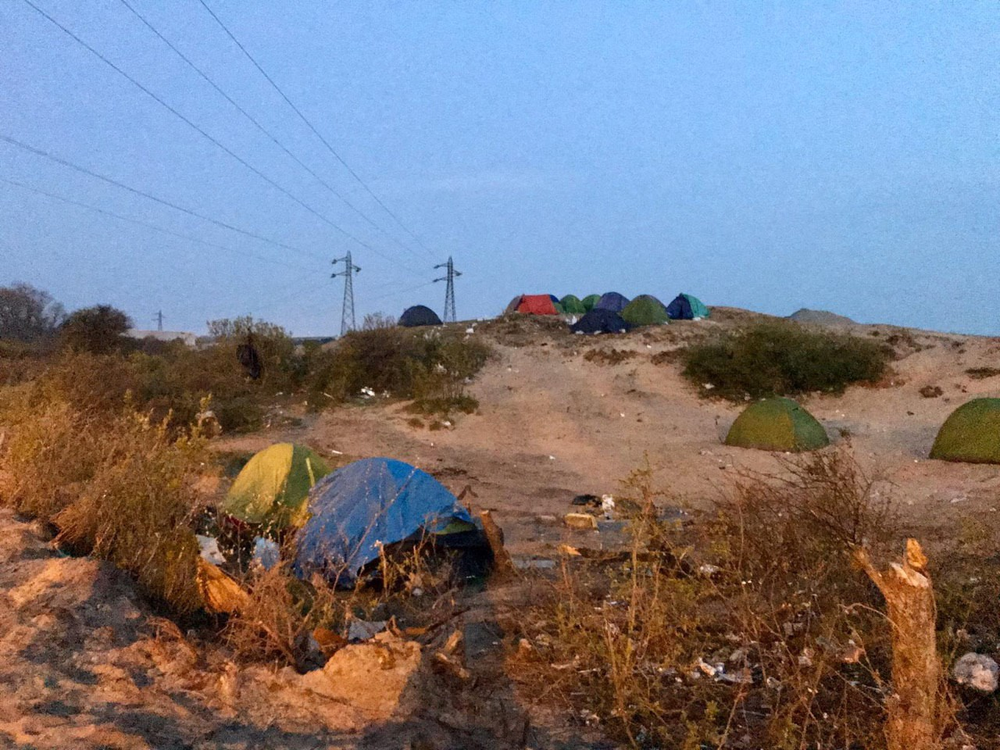
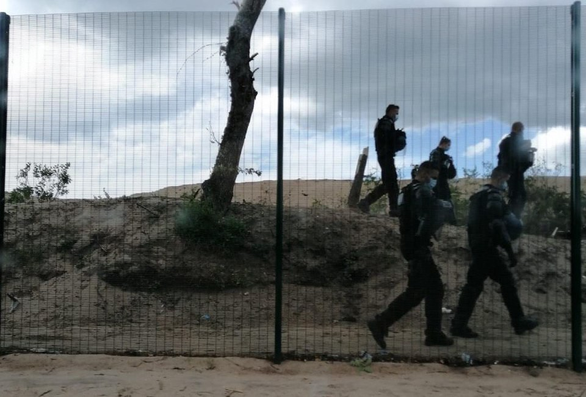

### AYS Special from France under Lockdown: Refugees systematically failed by authorities
#### Abandoned to the risk of Coronavirus, France thoroughly failed to provide a safe environment for people on the move throughout two months of lockdown\. With no shelter and nowhere to go, they still are facing the “invisible enemy”, as President Macron has called it, without sufficient protection

Photo courtesy of Collective Aid in Calais

Are You Syrious has been following the media coverage and reports from those on the ground in France for weeks now\. While implementing one of the harshest lockdowns in Europe, the French government managed to consistently neglect one of the weakest groups in their society\. The treatment of migrants living in their country during this time has been shambolic at best, and downright negligent at worst\.

> “In northern France, up to 1,500 displaced people, including unaccompanied minors, families, women and men, are living in camps and settlements, suffering from unequal access to health services, water and sanitation, food — and are left without adequate housing”, 

— wrote Refugee Rights Europe, Committee for Refugee Relief and 91 other organisations in a submission to seven UN Special Rapporteurs in the beginning of April\. The situation has shown little improvement in the month since then — due to a lack of resources, it is even more of a struggle for aid workers to provide necessary services, while the closure of the asylum offices has prevented any new registrations or progression in cases\. Residence permits and long\-stay visas have, at least, been extended for three months if they were due to expire by 15th May — which is the only real course of action due to the travel ban\.
### **Relocations**

The authorities have had other priorities\. From the evening of April 11th, 174,000 places, including 9,000 in hotels, were opened to homeless people, including refugees, all over the country\.

86 specialised COVID\-19 sites have been opened for homeless people with no serious symptoms, amounting to a total of 3,100 places\. Vouchers have been distributed, allowing the homeless to buy food and hygiene products during this crisis\. This scheme extends to 60,000 people, each of whom will receive 7 euros per day, i\.e\. a budget of 15 million Euro\. In all, the State is planning to spend 65 million Euro\.

France has an annual ‘winter truce’, which runs from November to March\. During this time, no one who rents their home can be evicted from it, in order to prevent people needing to sleep on the cold streets\. This year, the truce has been [extended until July](https://www.tellerreport.com/news/2020-05-07-in-france--the-winter-break-extended-to-end-in-july.ByxWXASb9U.html) , due to the exceptional circumstances\. 14,000 places were opened this winter for the homeless, and they will therefore remain available for another two months\.
### **Rising tensions**

In practice, however, this has not been such a smooth process\. The Refugee Community Kitchen reported on April 17th that people in Grand\-Synthe and Dunkirk “have been forcibly moved to centres across France” without assurances of being transferred to a safer site\. The organisation stated that “many of the single men & families forced to move will immediately make the dangerous journey back to what they see as safety”, making the relocations redundant or even harmful\.

Reports suggest that the conditions in these centres are as dire as in the jungle, causing even more frustration and despair\. This led to a riot in a Paris detention centre on the 13th April, in which the CRS was forced to intervene\.

> “We have heard reports of inedible food and crowded rooms\. The uncertainty of the accommodation centres, their location, and the police’s use of force is pushing families with children, young and old men to relocate in woodland further away, where aid is less accessible and where there are no water points”, _wrote [Root](https://www.facebook.com/charitableroots/posts/3334370956787490?__xts__%5B0%5D=68.ARAkX4m7aktGcPINZo5UfQMxu_WpgrYyyQ7DZY1v3KZ6HchzFvbShC_AJoztrWHOCSq5sFHzcuRWuva07kofc4vjCXNw9QcGB5Uevh_CFjyLiE0q9WN8FwvJ1mN3k6EzKCEpyz_LFwa3ETrc3XbtBQIdAV0y0R5o9Eg4gEObS8UYSPHJDeyZ25C3J5sqylPpTQzo9uXnmMgLJNIkQ-67Qi1wj0I-18eYI1TXDDXYiqoogqJRIGsZp1c1zFubDv3ARReRUPuUrinylXYwYjY-qFElLMCUZBno3CPFSjBVMDVUyOyzSUMds4rM2NchProcT8TvwkiNNspLNZ1HxxD95CfcgP4L&__tn__=-R)_ [s](https://www.facebook.com/charitableroots/posts/3334370956787490?__xts__%5B0%5D=68.ARAkX4m7aktGcPINZo5UfQMxu_WpgrYyyQ7DZY1v3KZ6HchzFvbShC_AJoztrWHOCSq5sFHzcuRWuva07kofc4vjCXNw9QcGB5Uevh_CFjyLiE0q9WN8FwvJ1mN3k6EzKCEpyz_LFwa3ETrc3XbtBQIdAV0y0R5o9Eg4gEObS8UYSPHJDeyZ25C3J5sqylPpTQzo9uXnmMgLJNIkQ-67Qi1wj0I-18eYI1TXDDXYiqoogqJRIGsZp1c1zFubDv3ARReRUPuUrinylXYwYjY-qFElLMCUZBno3CPFSjBVMDVUyOyzSUMds4rM2NchProcT8TvwkiNNspLNZ1HxxD95CfcgP4L&__tn__=-R) \. 

Due to the forced evictions, people are now moving away from La Liniere and hiding in other areas so that they will not be forced to go on buses\.

And, of course, with people remaining in the open sites, COVID\-19 has started to spread among them\. By 1st April, there were already a reported 9 cases in the Calais camp —the authorities haven’t released official figures since then, although we can presume the current number is much higher\. There have been reports of people presenting with symptoms of the virus and being referred to confinement centres, only to later return and say that they had been taken somewhere without food or shelter\.

> Police clearances and evictions are still happening almost daily\. 

According to the Human Rights Observers team, there have been 90 evictions in Calais in April alone\. Police brutality is still commonplace, with tear gas often being used\. The NGO [Solidarité migrants Wilson](https://www.facebook.com/Solidarit%C3%A9-migrants-Wilson-598228360377940/?__cft__[0]=AZX8LSiC7xsU7qf7ZU0tZwgGfSqCfwZekdn49gbCSf9kMUxc5Ko0Nq1j7GrJsT4sVKPXmJBQgungHOYqSRNgg9YDChAjsYrKi7uaO7Yaq4_BZmwefu6K5T5lRGKtsswwHMYSSgKT6bdhyxc5UxT1Gs2xVfCJ76UC1_wXft_JXV35vw&__tn__=-UC%2CP-R) reported that people sleeping rough in Paris, Saint\-Denis, Aubervilliers and Saint Ouen are **having their tents slashed or thrown away by authorities, despite having nowhere else to go** \. They are also being forced to move in the middle of the night, and the water is being frequently cut off\. They called for local residents of these areas to contact their local officials and demand fair treatment for these people, especially in the middle of a pandemic\.

In addition, the Eritrean community in the Calais jungle [reported and denounced](https://enoughisenough14.org/2020/04/15/police-violence-an-open-letter-from-calais/) physical and verbal violence against them by CRS in an open letter\. Utopia 56 reported **about 60 people, mainly single women and kids aged between 3 months and 12 years, sleeping in tents on the quay of the Bassin de La Villette since May 26th** \.

Tensions among the people escalated and culminated in an attack on police in [Calais on the 22nd April](https://www.facebook.com/AubergeMigrants/posts/10157851999190339) during yet another eviction\. Rocks were thrown at law enforcement and a van belonging to the NGO Collective Aid was set on fire \(it has since been replaced\) \. It seems to many on the ground that the authorities are using the virus to justify an increase in violence and evictions\. Locals in Calais are also voicing their displeasure at the ‘nuisance’ caused by migrants during this time, leading to an even greater unwillingness to help\. One member of parliament from Pas\-de\-Calais has called for the forced confinement of migrants in the area — while this motion has obviously been rejected due to being a clear human rights violation, the fact that the idea has been expressed at all is clearly worrying\.

> In May, the camps in the Dunes area of Calais have been evicted, and volunteers criticized the massive use of violence\. 

The constant upheaval and lack of consistency makes it obviously difficult to enforce social distancing or any kind of preventative measures\. There have been revolts in several French detention centres, with one man testing positive for the virus\. “The health and life of the people detained are endangered in these centres, where the health measures for prevention and protection against Covid\-19 are not, and cannot be put in place” says one NGO, which exercised its right to withdraw last month to protest against the continued detention against the backdrop of the pandemic, but which continues to operate “remotely”\.

Photo courtesy of Collective Aid in Calais
### **What are the NGOs doing?**

The pandemic has made life a lot more difficult not only refugees, but also those who work for NGOs\. Every NGO we spoke to reported a drastic reduction in volunteer numbers, for obvious reasons\. Fewer volunteers places even more pressure on the remaining volunteers, who are already having to adjust their operations due to the lockdown\. Care4Calais reported that they have only around a dozen volunteers left, and this skeleton crew is serving a population of up to 1,400 people, with little to no help from French authorities — rather, a lot of hindrance\. Other organisations operating in Calais include Collective Aid, who are distributing non\-food items like tents, bedding, clothes and hygiene\. A new organisation has also been set up called Calais Food Collective, who are supplying dry food, and also working with other teams in Grande\-Synthe\. There, they are joined by the Refugee Women’s Center, as well as smaller local NGOs\.

The remaining volunteers have needed to totally adapt operations, in terms of both social distancing and of hygiene measures\. Teams on the ground are wearing masks and gloves, and Care4Calais have described themselves as looking like ‘storm troopers’ in full PPE\. Hand\-washing stations are also being set up inside distribution vans\. Everyone must stand two metres apart in queues, meaning that distribution takes longer\. Due to limited resources, food and hygiene distribution was prioritised — however, the lack of clothing distribution led to people wearing the same clothes for weeks on end\. [Care4Calais started distributing clean clothes](https://care4calais.org/news/calais-update-ground-conditions-worse-than-ever/) along with food in late April, and expects to continue this\.

The work of the NGOs has been made even more difficult by the circumstances —the travel ban prevents new volunteers from arriving, and many donations are being channelled instead towards Covid\-19\. It is also now much more difficult to buy in bulk from the UK \(where many items are cheaper\) or receive donations from there, so volunteers have often found themselves relying on local supermarkets, which are more expensive and limited\. The reduction in services in the field also means that tensions are raised, as people are reasonably tired of having to wait so long for food or of not being able to receive clean clothes for weeks on end\.
### **A worsening relationship**

The relationship between the NGOs and authorities has deteriorated in recent weeks, and become actively hostile in many cases\. Up until recently, specific documents have been required to leave the house and go to work in France, and volunteers are understandably no exception to this rule\. However, the Pas\-de\-Calais Prefecture then requested extra documentation from aid workers with L’Auberge des Migrants and the associations working with them\. This restricted the hours that the team could work, and meant that the night crews frequently received fines for providing their necessary services that otherwise would not be replaced\. The NGO reported that they were contesting all the fines given\.

Volunteers with Utopia56 also experienced similar troubles, declaring that the authorities wanted to “restrict the freedom of action of associations in the name of containment measures”\. Growing tensions between Utopia56 and the authorities led the NGO to cease communication with the Calais Prefecture entirely, citing fines received, police violence and lack of a realistic plan for the coming health emergency\. Another incident occurred on the [24th April](http://www.utopia56.com/en/actualite/letat-durgence-sanitaire-autorise-t-il-violences-envers-exilees-intimidations-envers?fbclid=IwAR2-OXTUn6earoG37C4MefskGU8RYAKIKPlDsQwIxtCnNlfRXFsmdhvro18) , when four volunteers with Utopia56 were arrested, held and charged for having filmed the police eviction of a camp in Grande\-Synthe\. In a statement, also Amnesty International denounced “acts of harassment and intimidation” by French authortities towards humanitarians, speaking about “excessive use of force”\.

> The authorities are still also not acknowledging their reliance on grassroots volunteers\. 

On the 6th May, police took it one step further and actively prevented volunteers from the group Food Collective bringing essential donations over the border, saying they were [“not necessary”](https://www.facebook.com/AubergeMigrants/posts/10157906708725339?hc_location=ufi) , although reports from the field clearly said otherwise\.
### **Essential work**

Nevertheless, the work of the NGOs on the ground in France is more necessary now than ever\. The government has reportedly cut food rations by half to mostly a piece of bread and ham a day — completely insufficient for the dietary needs of a child, never mind of an adult\. This state of affairs means that yet more responsibility has fallen on the NGOs\. Refugee Community Kitchen was forced to suspend their operations in Calais and Grande\-Synthe at the end of March\. A new project called the Calais Food Collective \(a part of L’Auberge des Migrants\) was set up in response to the situation and has been distributing dry food packs daily, staffed by remaining volunteers\. The NGO Secours Populaire is doing the same in Grande\-Synthe three times a week\. The Ravitailleurs distributed 50,000 meals in eight weeks\.

There are also teams carrying out the necessary ‘ **maraude sanitaire** ’ \(or, hygiene round\-ups\) day and night among the migrant population, despite the measures and the health risks\. This involves triaging people with symptoms of Covid\-19 and potentially referring them to the Protection Civile for further symptom checking, from where they may be placed in a hospital or sent to a ‘confinement centre’\. Médicins du Monde and the Croix Rouge are operating in this capacity in Calais and Grande\-Synthe, with Samusocial de Paris working in the capital city, among others\. The NGO Solidarités International has implemented preventative measures, setting up a system to provide water access to the Paris slums\. This will allow residents to keep themselves clean and wash their hands, hopefully preventing further spread of the virus\.
### **Fleeing the country**

Due to the rudimentary conditions and raised threat of Covid\-19 in northern France, there has been an increase in crossings to the south coast of England\. [Since late March, over 800 refugees have made the journey successfully,](https://www.yeovilexpress.co.uk/news/national/18438346.record-number-migrant-crossings-uk-basks-bank-holiday-sun/) with April being the month with the highest monthly total ever recorded\. It is not known how many attempts to reach England have been made, but we can assume the number is far higher\. In April, 79 attempt were intercepted with an unkown number of people, 38 and French and 41 on British side\. This makes more than 230 this year\. 293 people were rescues by French authorities\.

On May 16th, 17 people including five children were brought back to the port of Calais while trying to cross the Channel after the engine of their boat crashed\. Another one was rescued from the English channel\. Without the proper equipment available, people have been undertaking the dangerous journey across the Channel using empty plastic bottles pulled together as an improvised life jacket\. In reality, this makeshift buoyancy aid would be useless in the case of an emergency\.

Public safety fears, however, have ensured that they will receive an even frostier welcome than usual\. Natalie Elphicke, the MP for Dover \(where most landings take place\), has responded to the increase in crossings by demanding that ‘Every illegal entrant must be immediately returned to France’ because of the risk they pose to public health\. This is partly due to the UK government’s refusal to enforce the standard 14\-day quarantine, in contrast to other countries experiencing landings such as the island of Lesvos in Greece\. Only those showing symptoms of Covid\-19 are being isolated, despite the fact that the virus is frequently asymptomatic, and therefore there is a risk that new arrivals could introduce it to a new group of vulnerable people at a UK detention centre\.
### **What happens now?**

On 11th May, France began gradually easing lockdown restrictions\. The country has been divided into ‘red’ and ‘green’ zones — designating where the virus is worse and where lockdown can be lifted slower\. The majority of camps are in the red zones, meaning that a return to ‘normal life’ will take more time\. But what is normal for someone who lives in these abhorrent conditions, constantly subject to evictions and police brutality? While many residents of France will start to go back to work and school wearing their masks and gloves, the refugees in these camps will continue to live with the threat of the virus hanging over their heads, knowing that they will not receive sufficient treatment if they get it\. The French Court of Audit has called on the State to modernise its migration policy, particularly in the time taken to register asylum applications\. However, we have not got our hopes up — France seems reluctant to act favourably or even fairly towards migrants\.

> The French authorities have shown time and again that, not only are they uninterested in providing sufficient care to the migrants driven to live in these conditions, they are also negligent when it comes to the spread of Covid\-19 among those who live in deprivation\. 

**Find daily updates and special reports on our [Medium page](https://medium.com/are-you-syrious) \.**

**If you wish to contribute, either by writing a report or a story, or by joining the info gathering team, please let us know\.**

**We strive to echo correct news from the ground through collaboration and fairness\. Every effort has been made to credit organisations and individuals with regard to the supply of information, video, and photo material \(in cases where the source wanted to be accredited\) \. Please notify us regarding corrections\.**

**If there’s anything you want to share or comment, contact us through Facebook, Twitter or write to: areyousyrious@gmail\.com**

_Converted [Medium Post](https://medium.com/are-you-syrious/ays-special-from-france-under-lockdown-refugees-systematically-failed-by-authorities-78835a8de472) by [ZMediumToMarkdown](https://github.com/ZhgChgLi/ZMediumToMarkdown)._
