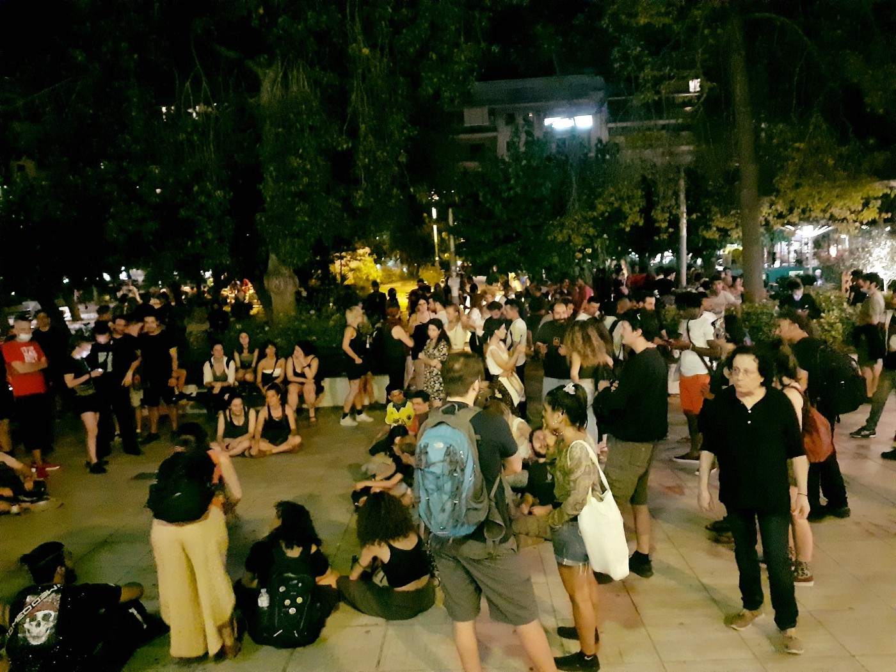
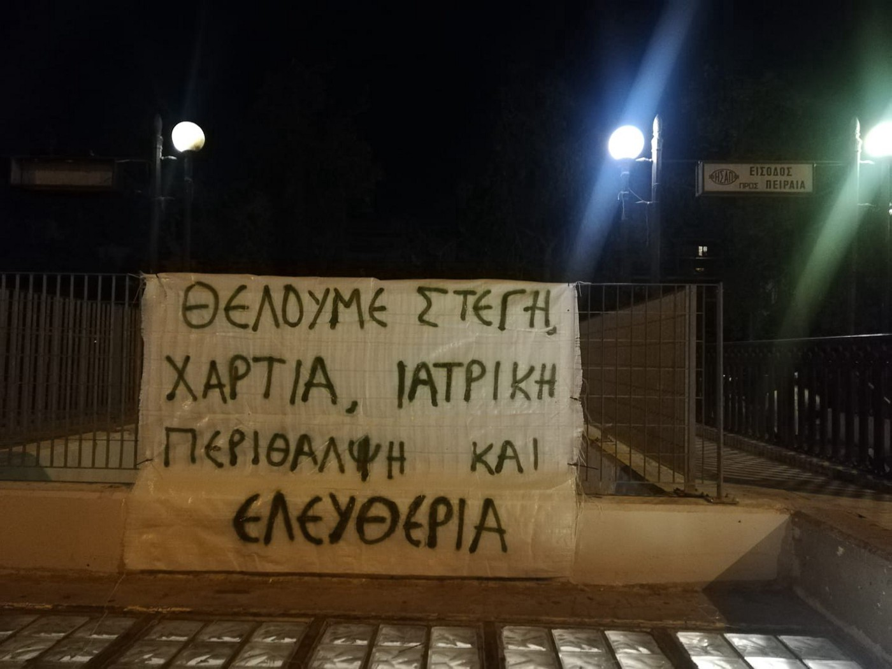
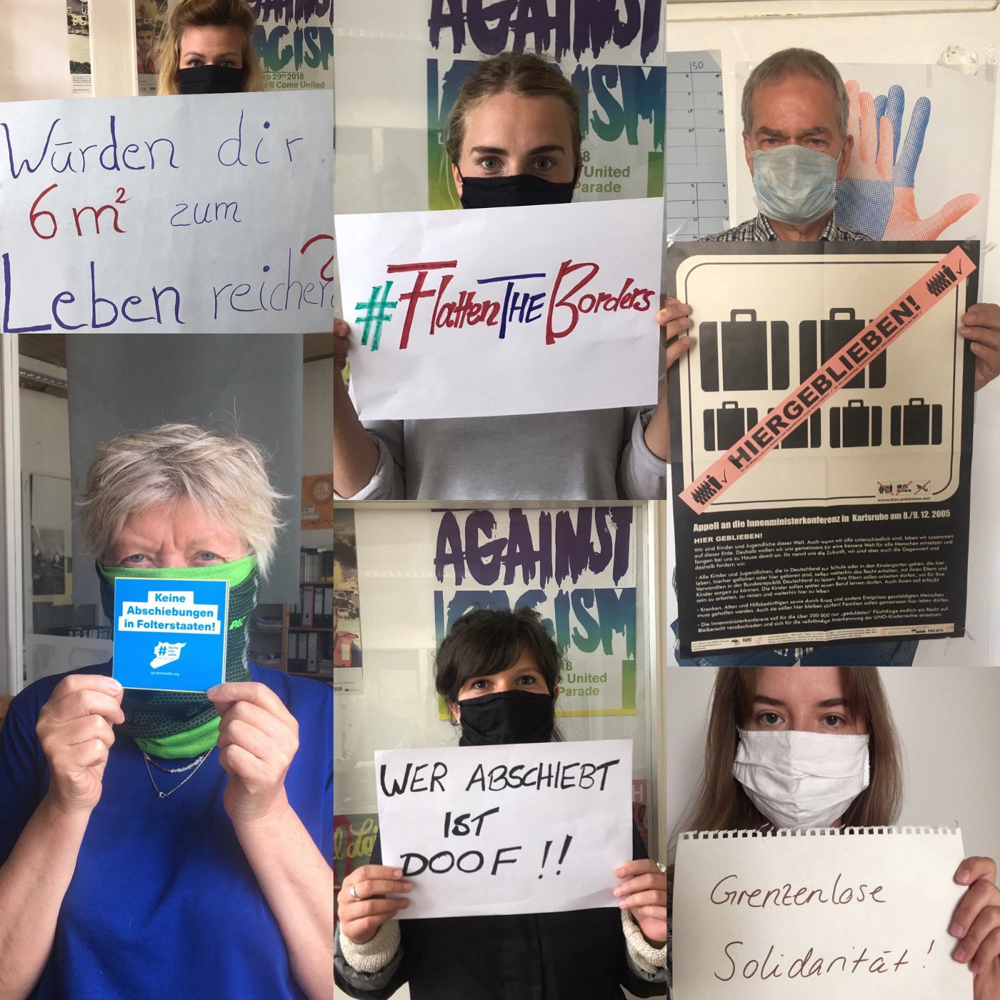

### AYS Daily Digest 15/6/20: “It takes people to stop it\!”
### Hundreds show solidarity with those evicted and those without homes in the centre of Athens / European Commission tacitly sides with Croatia’s misuse of funds intended for independent monitoring of the border, in the meantime — the tortures continue with the blessing of the entire EU / MSF halts psychological exams in Athens / AYS campaign for refugee families closing soon / Berlin Senate plans to accept a total of 300 people by next July / & more news

[Are You Syrious?](@AreYouSyrious?source=post_page-----de933755c4fe----------------------)

[Jun 16](ays-daily-digest-15-6-20-it-takes-people-to-stop-it-de933755c4fe?source=post_page-----de933755c4fe----------------------) · 8 min read

### FEATURED

**EU back doors/Croatia** — “The European Commission intends to send officials to monitor the Croatian border following fresh allegations of torture of migrants and asylum seekers, which it condemned”, the media report\.
These kind of sentences open up a lot of questions \(and rightful rage\) from anyone who has witnessed, reported, and/or been informed about the ongoing horrors at the neglected back door to the hypocritial EU, which hasn’t been able to get everyone to a table to agree to support their own fundamental documents, on which the entire project of the EU was founded some decades ago\. When one reads that the EC “condemed” the torture, one would think they actually did something to show their condemnation, but rest assured that nothing has yet changed and the Commission’s “condemnation” still amounts to nothing but their representatives reading out lukewarm words criticizing the violence IF it happened and WHEREVER it happened…\. We all know when it happens \(continuously\), by whom, with whose support and according to whose policies\. So we suggest organizing a fundraising campaign for the independent border monitoring mission, if there is a will within the EC and money is the only issue, given that Croatia seems to have spent their 6\+ mil\. on anything but independent monitoring of the treatment of people at the borders, which was a condition for them to receive the funds in the first place\.

> _The Commission spokesperson said a monitoring mission is planned “to ensure that the activities of the Croatian border guards remain fully compliant with the respect of fundamental rights\.” But no dates have been fixed, although the Commission says arrangements will be made as soon as the pandemic eases up\._ 

Now, after the documents leaked proving they were about to falsely report to the Commission about the spending, many Brussels officials seem to be surprised at the fact that what so many reports have published is very likely true, so they have decided to “condemn” it\. Eppur si muove, we are getting there\.

Here is the story:
### [EU ‘covered up’ Croatia’s failure to protect migrants from border brutality](https://www.theguardian.com/global-development/2020/jun/15/eu-covered-up-croatias-failure-to-protect-migrants-from-border-brutality?CMP=share_btn_tw&fbclid=IwAR0Kz0d4jzPs4ziU62H-PSj3GRDSCNBsOAz1HrK6GYe4UHrHjopso39mCvs)
### [EU officials have been accused of an “outrageous cover\-up” after withholding evidence of a failure by Croatia’s…](https://www.theguardian.com/global-development/2020/jun/15/eu-covered-up-croatias-failure-to-protect-migrants-from-border-brutality?CMP=share_btn_tw&fbclid=IwAR0Kz0d4jzPs4ziU62H-PSj3GRDSCNBsOAz1HrK6GYe4UHrHjopso39mCvs)
#### [www\.theguardian\.com](https://www.theguardian.com/global-development/2020/jun/15/eu-covered-up-croatias-failure-to-protect-migrants-from-border-brutality?CMP=share_btn_tw&fbclid=IwAR0Kz0d4jzPs4ziU62H-PSj3GRDSCNBsOAz1HrK6GYe4UHrHjopso39mCvs)

To explain in simple terms, the European Commission claimed to have in the past funded monitoring missions in Croatia to ensure rights were being respected\. According to the Croatian government, the UNHCR, under its own funding, and a local NGO carried out the monitoring\. However, this is not true\. They examined the documents of people who had been lucky enough to have their intention to seek asylum recorded and who managed \(by some miracle or statistical need\) to ask for international protection in one of the police stations, something that was impossible for thousands who entered police stations across the country\. Mind you, all of this is NOT at the border\. The UNHCR in Croatia, as well as the Croatian Law Centre, have had no access to the green border, nor have they had access to the places where push\-backs were actually happening\.

In fact, both were denied any access to the border, as was the Croatian ombudswoman earlier on, as we reported\.

In the meantime, the violence continues and not that many people really care\.

On the other side of the border, due to inefficient integration policies, citizens had to jump in and help dozens of refugee families under international protection not to become homeless, via a campaign organized by AYS in Zagreb\. It is drawing to its end, with three more households to cover\. You too can support the action, share or contribute — all the information is here:

> [_areyousyrious\.eu_](http://areyousyrious.eu/) 

**Athens** — They have been granted asylum and the geographical restriction on their travel has been lifted\. They have been able to leave the infamous Moria camp on Lesvos and come to Athens at their own expense\. This is a part of the programme of mass evictions of the host structures which the government has been implementing\. Now, dozens of families with children fear being taken away forcibly by the police to one of the camps, similar to the one they left behind\. Many people have gathered at the Victoria square in Athens in an attempt to prevent that from happening\. However, these are “only” some dozens of people in several groups of families, but the decision concerns more than 10 times this number of people\.

Refugee organizations and solidarity groups warn that the current situation in central Athens is nothing compared to the devastating effects of the government’s expulsion programme during its full implementation\. According to the [reports](https://www.imerodromos.gr/oi-astegoi-prosfyges-stin-plateia-viktorias/?fbclid=IwAR1zqmWIWUZwTKZgxyXxpHAhRU5G9iA91ZCGg_xGr90m7uKkC495O8oC5dc) and what the activists have been warning about, the government is basically leaving about 11,000 people in the streets without providing housing and without participating in their integration programmes\.

> _It is indicative that the refugees who have been in Victoria Square for the last 24 hours did not travel as part of an organized movement of an international organisation such as the UNHCR, nor do they have any other structure in the interior of Greece as their destination \(after being evicted\) \._ 

Further on, the bizzare situation people find themselves in is described:

> _Having been granted asylum by the Greek state, the refugees in Victoria Square are beneficiaries of the International Organization for Migration’s “SUN” program\. This is the program that provides for the subsidy of rent to recognized refugees for six months, provided that they have found the apartment they will rent\. And this is where the paranoia begins\! Many of the documents required for inclusion in social welfare programs require a mandatory declaration of residence address \( \! \), with the result that the beneficiaries enter a vicious bureaucratic cycle\._ 

In order to obtain a tax number, these people are required to have a house contract\. The very program they go to to find a home tells them that they must have a VAT number, as the Greek Refugee Forum director notes, adding that they basically must have “at least 800 euros to rent a house, get the contract, get a VAT number and in the end get the subsidy from the HELIOS program\.”

> _Specifically, a total of 12101 people, 6751 beneficiaries of the Estia program \(4003 in the Attica area\), 569 from various hotels \(71 in the Attica area\), 4781 from the camps \(1458 in total from Thebes, Ritsona, Lavrio, Schisto, Skaramagas, Olive Grove and Elefsina\) \. The state itself that had as a central slogan during the covid\-19 pandemic, “staying home”, now forces out thousands of recognized refugees — [Solidarity With Migrants](https://www.facebook.com/solidaritymigrants/?__xts__%5B0%5D=68.ARDFq1VW5-3RNcIQxcJJNOTJpH4cRBpMnz3MnQlHrxK1f14f4SYnuH7KS8uEcrHLt0vZ5eA-icPngXkKhTnjb2rUo85yCfcHcpIEjYJcMsyg5fM6BDVNd3wsx2IEaAaj7qxcNTLoi-VxrD5N75V8c6e4drtp1pGYuiZPSRDKeoF0nSNySG0dua5CvZeGStL89mnQIClVJSJZOuYfCYipzHoMKjtrZs8QnkAvmTZ17dRjYd3s2D3Rt50besHvng3QtrdcCZEvIVSIAycyrziE0XQWYiYJodAXGa1qdM9grNR0Viveqztdp4Cuk5JheRaDtb3SqmRE7cRlPSYZ7J6bQAlNvsq6ZU-fhrRBZUgXUcHjP5-pZ65ZpF11MWjRj7TxiHDh_fJj3AY4fBhkIluM18-E1Mj-BbUbcpTbBMz_TTN8M4UwiwkUMbJVpczKrw-bcRqizo9JPeMdelkMw5-IIdD_N109m6Uv8vXsapc4J-Ebjr2qu3I&__xts__%5B1%5D=68.ARBEPMPSvwmr6n5bB5B5ji_B9AZlA3i1scFWPuD7snRtGQXpqgF9ar-7EaHqb3nMHBGUg6Vt5TfQ-wcrgAqOBTfMlH44nA1h67p_QDzmIFjiOsd9NBRv84YFH6hwUugmMVoesh2VqUrZgzOXP0aIM9Jjt2gmuqPa3E5zwUlg0LUvgl3DkfU7Et5NfoY1VAtrwFYkE3Es2IHwSQ_fAyIa3U79sDcucc4yQIyaxA7nEwCbTQYiRdv6KkNLomqKU8K-6d10gNCgD_9-Uh4RSveT0Wjl16lTxgvBRiOnyRswWF9c8nwkpBbiAdtBGtENGSwOeI_gX-YGySfDqH_dTbnCSADi0x4sy4BAnocCE1QqE-GXSwsgieER7Rz08qvnoTS8KkmtCtKJZfgRmmujhlhqgEL1rIhbglrOo0Dcn5X7xFRhd3XfXHTexrIGC20Uj3-WhI8B2ChNSh8Cdhx7xerV3Yo8CSEbTY2FIwgJTo4shtEAmNkVM3Q&__tn__=kC-R&eid=ARDlxsTZYviRRHla6s5JYr8-TlQXj9YYfjfU_HLAu_75AqmxbXyLNgVOSETPSrBp1FPfNRvuN8qRxkPh&hc_ref=ARQoEG_xC-yWWZKREh-REVHunH0lXLuruo1mN9vGGDCLS1cnpKlXlq0TSJ-6-ZvPImQ&fref=nf) reports\._ 

Many children are among those who have gathered in the capital’s central square\. People who are in solidarity with them try to gather basic goods and water, and to organise activities for the children in the square while demanding a solution\.

[Greek Forum of Refugees](https://www.facebook.com/Greekforumofrefugees/?__tn__=K-R&eid=ARCN3EWUFivnQlXRhlq1GLsV4h6vsLBXdZWuSztNbKQ3BKlILRobpx_a3W7BJDtPaWIKRpFFLq6Uj2B-&fref=mentions&__xts__%5B0%5D=68.ARC766wmu_Dl3rD25EglJxom6_3jk_BBr5gkL950pzJ2qzfDM6iGaiZtUTk10W2owLrqIMueYydkO8BI8e3laiM_mqk4cXqzh66Ph5uS-lTRoAySrBUg9VMN5mTm38_DEG_GM6oEuWeOhTPWCRIvkWwcg9WevvNf6F07Kb_9z3FbAljb8jRR-aLDsY5_ix9J4jAcYFIqSeZYf39oL1C9PdPpoANIOwGIb0sUYDO8Q3u2cPRWEl4jWCvHnfdag2piFC347nFMp7TKNisNEfj38p0e2MRtzSsX4YjpeBxf4U33SQqGqW2bJkf6FP_7sHBwutkRznmhPwXkSX8y3nWBNoj2RyjjRYFIc9Sz1ZsAxdDeNHjaP76RHmKo4Dnj-8sHfHhYnhhiAR3QdDiLiZlpK2NN3_dmHrkTkkXroX7tEe-hSBx5uzYPS6humNycfndg62RmHVfitjDCFv24LqX9hvP33iW_VawWi2d5fQx2UHTgd2wWK5r2zUd7) along with its friends took part in the sit — in protest that was hold in Kypseli, Athens\.

> _It is our duty not to remain silent\. We must protect the right of every citizen to live without violence, prejudice and fear\._ 

### LIBYA
### A surge in crossings and lost lives

Sea crossings from Libya “continue to happen resulting in major incidents, loss of life and returns after interception, only to end up in detention\.”

As of Monday, 4231 persons were intercepted/rescued at sea while attempting to cross from Libyan shores, the UN agency reported\.

MSF reported that the measures resulting from Covid\-19 have led to “failed politics of aid to help migrants stranded in Libya” and worsened conditions for them\.” See more [here\.](https://www.infomigrants.net/en/post/25359/covid-19-has-aggravated-situation-for-migrants-in-libya-says-msf?fbclid=IwAR3ahjF6Hoq-ocmhBUk-Z4aDDZwzq3CZEhJzky_Qc-yM0j0a67VQDB5-wrQ)

> _The halt of UNHCR evacuation flights and IOM repatriation services in the wake of COVID\-19 related travel restrictions extinguish their only hope of finding a way out of a cycle of abuses and violence in Libya_ 

### GREECE
### Hunger strike in more places

Greek activists report that about 40 prisoners in Petros Ralli have started a hunger strike as of Monday, calling for a release and acceleration of the asylum procedures\.
### Islands

27children, 11 women and 12 men were among the people on board the vessel that landed in Thermi, south east Lesvos, the local team of Aegean Boat Report wrote on Monday morning\.
### Kos report

[Refugee Rights Europe](https://www.facebook.com/RefugeeRightsEurope/?__tn__=kC-R&eid=ARDxotmiKQ0m-I3zCh8PzHmzs3MGPTgVW-jYTAEJo71DlPVuTCor29kqOceVic-d-wfGMpCsu42BOkzJ&hc_ref=ARTnqhkH62edN8EoEdzwLYaMEmGah3sX9rygqHVTxy5t6lhxUpD4d9wqEqejdE8Cl00&fref=nf&__xts__%5B0%5D=68.ARCoFZtb_T8kJaPOQOQSlayixSY04W-_RdzUCMD_huPddrAMPMyYnR1_awbXg5ww_YHTJEtZNHcWzgBfnuAxQoj_lWhieir6z3wQBLkGsaIB_LsWeDzfWjJDZwo3ubnBQuTVn1r6u16sCe3cZuyV59JiNSPPbZf6iNAKqG_B39_vF556hP9YcksQm6A2VRFuSkjU_zVAGLTt3K0QaO1ev_WaED6r1uNX5OurXXVUDcbVqgqn9W9iI_-poWQzJsFsvSjJNpWKtqtf8qSCaVycSM9rFL_OTYIe7al8lG5uPxlWFEwuIsRrCuMKagdAfTRHQ4f4Y-PUmFXKCe7s4Zd0L3CDMF9G) have prepared a report on one of the important island first arrival spots, which we have also been reporting on\. Here is what they say:

> _While public attention tends to be directed at Lesvos, Chios and Samos, the smaller hotspot facilities on Kos and Leros are often forgotten\. Our latest report provides first\-hand insight into the situation in the hotspots on Kos and Leros in the spring of 2020\. It raises serious concerns not only regarding the material living conditions, but also the impact of Covid\-19 related restrictions and detention practices\._ 

Find their entire report [here\.](http://ow.ly/3ste50A2Piv)
### Athens

From June 15th, [MSF — Day Care Center Athens](https://www.facebook.com/daycarecenterathens/?__tn__=kC-R&eid=ARADaUwO76G-k0Ku6qy2-BI1SiMJlZiai4_bo4khd7opbiKhkDyPmcvSxkVqpcAI0RN8TkEAxYUPe4b5&hc_ref=ARQk0WJpXTULZq4Jcuha2_z18lLkav7eelAkVKvjRGsAyKFZlyoESlWDif6m9-zJNGk&fref=nf&__xts__%5B0%5D=68.ARCy39CZUbL1ISX6aRqiheQpJSFHOxRFje9fyKO3RNtcS1IyVM92dni9BUAE8bBo1h2Q1fW-NqOHTHe-VfI1X5yW320NbBBiCu1fCtEg4MEry2CrZapPnYviIEn83an-w-AB4_E-ntBZ0gNoJsdXNzzpIPxErGgAb_oJAgkTd00c0rUyURsyzI0FTlp1hXsxEJdRqrVY-WKm3crtkHZlqPEAJ5u85M8Gq3HiKJlqLXxw5n6l7MUHZ3K3sci3c_EsXroDxX2G2eOpWSkC0tn-f7bDhFv7z7ElKr4yb2z6J5tijh-Ovh5FS_2lLMv06kk_hqk84HfoSBNM9QTjp6Q5Aw) will not accept new mental health patients until further notice, due to a long waiting list\. They have also stressed that if somebody already has an appointment with the phycologist or the physiatrist, they should make sure to arrive on the scheduled date and time\.
### GERMANY
### Berlin Senate plans to accept a total of 300 asylum seekers in the capital by June next year

So far, only 47 refugee children have arrived in Germany, [eight of them](https://www.tagesspiegel.de/berlin/dramatische-zustaende-in-fluechtlingslager-acht-gefluechtete-kinder-aus-lesbos-in-berlin-angekommen/25800762.html) were admitted to Berlin in May\. The plans for the admission of refugees from the slum camps on the Greek islands in the capital have become concrete, the Germany media are [reporting](https://www.tagesspiegel.de/politik/elendscamp-moria-auf-lesbos-berlin-will-300-gefluechtete-aus-griechenland-aufnehmen/25916408.html?fbclid=IwAR30SCWyvMtjsvVxi9rAW6BQ5hmuOaL3s4leX2NwRDcmuhjXp-rfi6I4AaU) \. According to the plans, the selection \(sic\! \) of the beneficiaries is to be carried out by the Senate Department for Education\. It is an open question whether the state admission order will pass the Senate this Tuesday\.

In the meantime, PRO ASYL, state refugee councils and young people without borders are calling for a nationwide moratorium on deportation during the COVID 19 pandemic at the Interior Ministers’ Conference\.
### [Kein “business as usual” bei Abschiebungen während einer Pandemie\!](https://l.facebook.com/l.php?u=https%3A%2F%2Fwww.proasyl.de%2Fpressemitteilung%2Fkein-business-as-usual-bei-abschiebungen-waehrend-einer-pandemie%2F%3Ffbclid%3DIwAR2FiIUWipMmTqjt9Rz3-v31kASKTGIeFmzQulHu49XzaxJl7G2NEeFd0YI&h=AT1djUQDWQxuB1zvoAXK_ohx73eep0pGysRnxcC_ciw2rYcn6bMLl_bCq00iN36ktChpHm5ePOu5mFwc08KoZh0VDFHS73eYTpwLSQ3vkULgaWjqGmVkzRHTpRQed9BzLiuuv_JMA6NkfQ)
### [PRO ASYL, Landesflüchtlingsräte und Jugendliche ohne Grenzen fordern anlässlich der Innenministerkonferenz ein…](https://l.facebook.com/l.php?u=https%3A%2F%2Fwww.proasyl.de%2Fpressemitteilung%2Fkein-business-as-usual-bei-abschiebungen-waehrend-einer-pandemie%2F%3Ffbclid%3DIwAR2FiIUWipMmTqjt9Rz3-v31kASKTGIeFmzQulHu49XzaxJl7G2NEeFd0YI&h=AT1djUQDWQxuB1zvoAXK_ohx73eep0pGysRnxcC_ciw2rYcn6bMLl_bCq00iN36ktChpHm5ePOu5mFwc08KoZh0VDFHS73eYTpwLSQ3vkULgaWjqGmVkzRHTpRQed9BzLiuuv_JMA6NkfQ)
#### [l\.facebook\.com](https://l.facebook.com/l.php?u=https%3A%2F%2Fwww.proasyl.de%2Fpressemitteilung%2Fkein-business-as-usual-bei-abschiebungen-waehrend-einer-pandemie%2F%3Ffbclid%3DIwAR2FiIUWipMmTqjt9Rz3-v31kASKTGIeFmzQulHu49XzaxJl7G2NEeFd0YI&h=AT1djUQDWQxuB1zvoAXK_ohx73eep0pGysRnxcC_ciw2rYcn6bMLl_bCq00iN36ktChpHm5ePOu5mFwc08KoZh0VDFHS73eYTpwLSQ3vkULgaWjqGmVkzRHTpRQed9BzLiuuv_JMA6NkfQ)

### Find daily updates and special reports on our [Medium page](https://medium.com/are-you-syrious) \.

**If you wish to contribute, either by writing a report or a story, or by joining the info gathering team, please let us know\.**

**We strive to echo correct news from the ground through collaboration and fairness\. Every effort has been made to credit organisations and individuals with regard to the supply of information, video, and photo material \(in cases where the source wanted to be accredited\) \. Please notify us regarding corrections\.**

**If there’s anything you want to share or comment, contact us through Facebook, Twitter or write to: areyousyrious@gmail\.com**
### Sign up for AYS Daily Newsletter from Are You Syrious?
#### Daily news digests from the field, for volunteers, people on the move, journalists, and the general public\.

_Converted [Medium Post](https://medium.com/are-you-syrious/ays-daily-digest-15-6-20-it-takes-people-to-stop-it-d2534af6b7b5) by [ZMediumToMarkdown](https://github.com/ZhgChgLi/ZMediumToMarkdown)._
