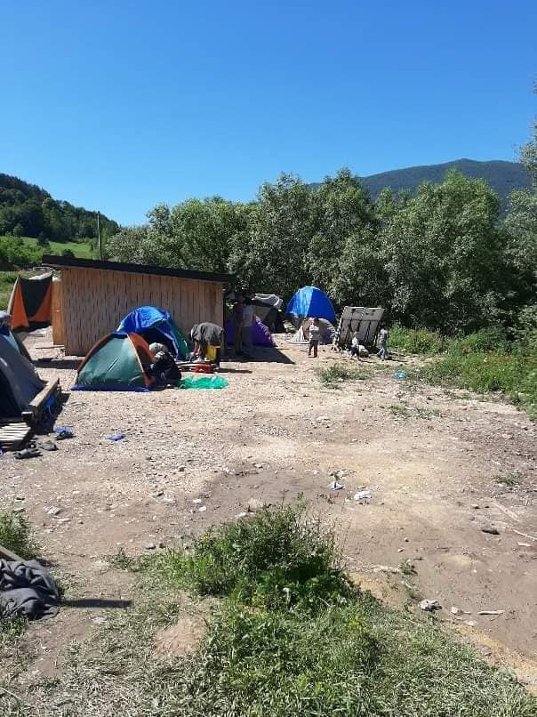
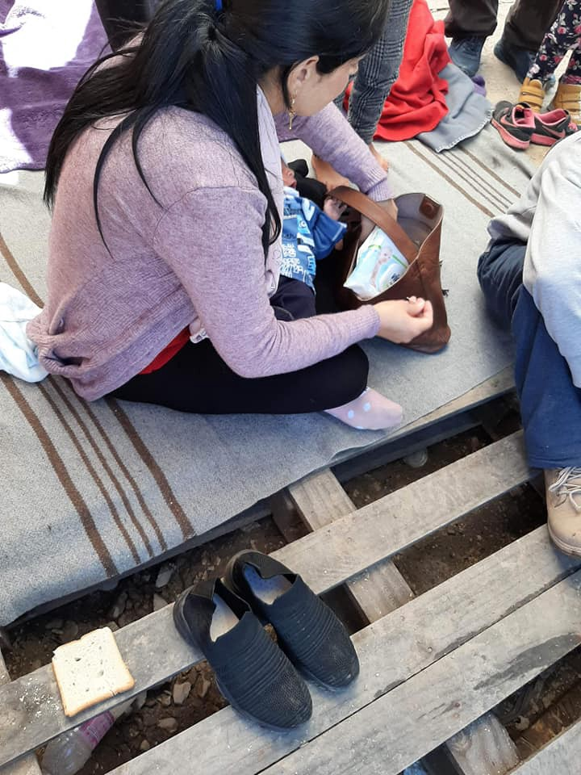

### AYS Daily Digest 17/6/20: Manipulations and police pressure across the Balkans
#### Germany: Eritreans under international protection can’t bring their families / Endless way from Moria to humane housing continues for people ‘from Victoria Square’ / Boats in distress in EU waters end up in Turkey — again / Como: People from Caritas housing left homeless for 10 days now / France: Precarious households fear homelessness across the country / & more news and updates

](assets/d8ceb017446b/1*eXUIDphiyyGjWUMzSJ_YXA.jpeg)

Eleonas camp, Greece — photo: [Solidarity With Migrants](https://www.facebook.com/solidaritymigrants/?__tn__=kC-R&eid=ARCZ9PRqU6B3O03vp87UAtAjdXudIjCEUJEpAMumzm3cJB0N1tcypC2ZbY3xZCKnnLqIG1CONBX6jKLG&hc_ref=ARToSMAljNG3pqaQ_N_GtcKDKIGnn8mkuxpwvEmS9-O2CmiWUN-cAsM2Bev92-9pK2g&ref=nf_target&__xts__%5B0%5D=68.ARDJ5iIQpfQqXJfyR5txH2Ldyr8-X7WQre20VLbsRu4Ilv4j97Te6oMaFBY4No6zk5Q0Ri2DoxskbRxMdwmcdy6hSsHFnE2hSEixDNbXn_JwDjF7_PSoARo6HtW8nmdXU8tn4tA4PqwWGv3SK_YY9bgvq-qMC92xTBfFUg8GFsK_lOxR8kJRgoAMsvnLB_eif3rU5nF0o5k86JpKhWyRcbV-dm4qo9nsk9yb7WfwfCKPScrvbx33lwigJelv5DhgWzs40OTk8GieEoBDI1oaA6oqu5E0mbkwK1gqbQ8w0pZyfQfIauHUGXhak98ih12sjAWZPJ7RagIcU45zCg6SLOVWm_UA-RyOWPjf3vHMvzrqOeX6DRrxXoOG3UNTJtT5iN2Zq05U79hu0ox2_ykFt2A_r-QE6zEIzzIyNEJNJSKr)
#### FEATURED

**Germany — Eritreans under international protection can’t bring their families**

Eritreans make up the biggest group of African refugees in Germany and along with the fact that Germany’s family reunifications have dropped beyond the quota set for the country, now it is this group who has a very particular issue in obtaining the needed documents to get their family members to join them in Germany\. Due to the fact that the German embassy in Eritrea has no visa office, German embassies in Ethiopia, Sudan, and Kenya received 1,645 visa applications from Eritreans for family reunification in the past year\. Due to the variety of document formats that exist to prove a matrimony, the people who fled Eritrea often end up having to ask the country they escaped for documents that would be a reliable way for German embassies abroad to verify the formal and textual accuracy of what they previously stated, as the media [reported](https://www.dw.com/en/eritrean-refugees-in-germany-struggle-to-reunite-with-family/a-53840858?fbclid=IwAR06ldELyWLAP4lvnt8nEHAz2-XmV_cqIL7Xy5onyo9K5uUyqsVfPurMvXo) \. Naturally, the people are reluctant to approach their own consular authorities\. Read more in the story by [DW](https://www.dw.com/en/eritrean-refugees-in-germany-struggle-to-reunite-with-family/a-53840858?fbclid=IwAR06ldELyWLAP4lvnt8nEHAz2-XmV_cqIL7Xy5onyo9K5uUyqsVfPurMvXo) \.

The country that more than half a million people left has been criticized in the reports as well —

> “Democracy and the rule of law are not guaranteed, the political system is repressive\. There is no free press and the civil society is marginalized\. Human rights are severely restricted,” says a Foreign Office report\. 

Still, many Eritreans encounter a lack of understanding and access to international protection, such as in the case of young Eritreans in Slovenia, that InfoKolpa reported about earlier\.

> Eritreans living abroad fear approaching consular services because of the threat of reprisals against their families at home\. 

**Bosnia and Herzegovina — Misery and threats while dispersion of responsibility continues**

The local team of the Red Cross in Ključ [Crveni Križ Općine Ključ](https://www.facebook.com/profile.php?id=100009318317491&__tn__=%2Cd%2AF%2AF-R&eid=ARBlDFzVlPquXqOBJEgA-4LcH0xra0jo2v57WgGVUpXt3nyISSvE_WWe6k9JQeHp8tka-Vu2Utk_ydXu&tn-str=%2AF&hc_location=group_dialog) , working alone and with some side support, has been reporting a surge in arrivals of families and other people to the spot where people have been kicked out from the public transport and left out there for many months now and, in spite of some futile words by the Ombudsman and some reporting, nothing much has changed\.

](assets/d8ceb017446b/1*ddkEX2BzZkODePufG693mQ.jpeg)

Photos: [Crveni Križ Općine Ključ](https://www.facebook.com/profile.php?id=100009318317491&__tn__=%2Cd%2AF%2AF-R&eid=ARBlDFzVlPquXqOBJEgA-4LcH0xra0jo2v57WgGVUpXt3nyISSvE_WWe6k9JQeHp8tka-Vu2Utk_ydXu&tn-str=%2AF&hc_location=group_dialog)

Across Bosnia and Herzegovina, the situation is heating up\. 
Some new information on the previously agreed set of responsibilities has surged from the recent communication between the Bosnian officials and the European Commission\. It also sheds light on the fact that it is the Bosnian side that apparently didn’t go through with the agreed plan\. This has been hard to read out from the poor media reporting up until now, and from criticism that unfortunately ended with this rather than providing a thorough analysis of the facts of the matter, beyond its results, which can, sadly, easily be seen and photographed in the streets, parks and squats\. Responding to recent critiques sent by the Una\-Sana canton prime minister to the European Commission, to Johann Sattler, chief of the delegation of the EU to Bosnia and Herzegovina, Sattler said that the Commission expects the cantonal authorities to respect the national laws and authority of the institutions responsible, to enable their work and the activities of their international partners\. “That is the only way to ensure the safety of the citizens of the particular canton in the current situation\. If that doesn’t happen, the Commission will re\-examine their support in the field of migration that has so far benefited Bosnia and Herzegovina, as well as the Una\-Sana canton\.” The functioning of the asylum system has been one of the key issues in the talks of Bosnia and Herzegovina’s accession to the EU\. A year ago they agreed on the plans to achieve these goals\. They cite the earlier conversation about the need for Bosnia and Herzegovina to take responsibility for the reception centres across the country, financed by the EU, and to establish additional locations suitable for reception across the country\. The EC reportedly welcomed the idea of BH identifying the assets in public ownership, and they are ready to continue providing technical and financial support, the EC answer states\. However, they say, they agree with the USC minister that little has been done, but claim this is not the EC’s part\. The prime minister continues with reactions in the media\. It is difficult to discern all the things that went wrong, but easy to see their horrific consequences, from the Lipa camp, to the conditions in the ‘official camps’ across the country, hopelessness among people in local communities trying to do something about the lack of care for the people on the move, and ultimately, the police and official treatment of these people\. We have experienced being taken away by the police and the inspector for foreigners \(even when we were simply visiting the country, being on public ground and doing nothing but taking photos of things around us\) a number of times, but now the police in Bosnia have been selectively treating their own citizens, activists, and others involved in helping\. Latest in the unprofessional and sadistic acts has been in Sarajevo, when the police were picking up refugees in the city for no particular reason, and while filming this, a journalist and activist from Sarajevo, Nidžara Ahmetašević, was documented and threatened with a misdemeanor charge because she was filming the brutal treatment of the people\. Reportedly, she saw police officers on the street who knocked several migrants and refugees down on the sidewalk, and then took them into a police vehicle where there were already several people inside\. Here’s what she said: “I recorded it all on my phone, they arrested people for no reason\. When they put them in the vehicle, the police officers came up to me and verbally attacked me\. They behaved very unprofessionally, threatening me with a misdemeanor charge\. I showed them my journalistic accreditation, but they did not want to accept it as a valid document and asked for my work permit\. In BH, journalists do not need such a permit, my accreditation is my work permit\. Then they carded me and a friend who was with me\. They were very uncomfortable and kept repeating that I would charged with a misdemeanor because I was interfering with their work\. I did not disturb anyone, I was just recording their actions “\.

We support her and all others who keep witnessing and experiencing similar treatment, and condemn all aggression in all forms by the police forces, both in the border areas, and within our countries, and ask for someone to examine Bosnia’s treatment of activist and volunteer organisations, individuals and groups from the country and abroad, as this was unfortunately one in a line of many attempts to silence free speech and the freedom of movement, both of which are universal human rights, something that’s been long ignored in these areas \(including by the international community that is rooted in the notion\) \.
#### SAR

Twenty women and 27 children were on board a vessel, and they had been in the water for more than seven hours at the time when [Watch The Med — Alarmphone](https://www.facebook.com/watchthemed.alarmphone/?__tn__=%2CdkCH-R-R&eid=ARA4N9L1vTl1XRmyQmTm2n9eW8Qj-XteIz7d2w1gg8hIJCTZTVr_A4LKnA6kIpmL-TG2gHLdvvMPZDLO&hc_ref=ARQSd2gBtUcA6DkV3eN_jKiTCRkIjJHgXFbVT_IHecYQCP2Gtw88VyewpCo7VCtcXCk&fref=nf&hc_location=group) reported about them and demanded that a competent official service organize a rescue\. They said a vessel with the number 1411 was nearby\. “Water is entering the boat & some of them are not wearing life\-vests\.”
A bit later, they published this update:

> Turkish authorities confirmed to us that they have picked up the group in distress\. The group’s last position was clearly in Greek waters\! The survivors have also confirmed their return to Turkey\. We condemn these systematic non\-assistance practices by the Greek authorities\. 

In another part of the Mediterranean, similar situations have been reported by the Sea Watch:

■■■■■■■■■■■■■■ 
> **[Sea-Watch](https://twitter.com/seawatchcrew) @ Twitter Says:** 

> > 🔴 UPDATE: Notstand auf dem #Mittelmeer. Die #SeaWatch3 ist aktuell auf der Suche nach zwei Booten in Seenot. Unser Flugzeug #Moonbird hat ein Weiteres im Zuständigkeitsgebiet #Malta's, nahe Lampedusa gemeldet. @[MaltaGov](https://twitter.com/MaltaGov) &amp; @[guardiacostiera](https://twitter.com/guardiacostiera) müssen die Rettung koordinieren! https://t.co/ajEv8KWmFp 

> **Tweeted at [2020-06-17 17:05:24](https://twitter.com/seawatchcrew/status/1273300726534504448).** 

■■■■■■■■■■■■■■ 

■■■■■■■■■■■■■■ 
> **[Sea-Watch](https://twitter.com/seawatchcrew) @ Twitter Says:** 

> > Seit 6 Std drängen wir @[MaltaGov](https://twitter.com/MaltaGov) &amp; @[guardiacostiera](https://twitter.com/guardiacostiera) 1 Boot mit ~70 Menschen zu retten. Erfolglos. "Wir sind beschäftigt, es gibt viele Fälle, wie Sie wissen".. Das Boot ist in Seenot, die Menschen ohne Rettungswesten, die Rettungsleitstelle zu beschäftigt zum Retten. Europa 2020. 

> **Tweeted at [2020-06-17 19:32:56](https://twitter.com/seawatchcrew/status/1273337855176310786).** 

■■■■■■■■■■■■■■ 

#### GREECE

On Thursday, 18 June at 6 pm, the Greek Refugee Forum is organizing an online dialogue on the housing issue\.

[](https://www.facebook.com/events/266270474581336/?acontext=%7B%22ref%22%3A%223%22%2C%22ref_newsfeed_story_type%22%3A%22regular%22%2C%22feed_story_type%22%3A%2222%22%2C%22action_history%22%3A%22null%22%7D&__xts__%5B0%5D=68.ARC6ClocBuu75av6j5vi9X_QJrZOWA85DNyo8lw0OnZhlOT2DwYxd_hlgEztm70nx40Pc-_5VUsPN-6L7PfrLRSJA8LEyzIzslbJ2s-syTDiJPBVG5bbFmvPohX8ULkm__Q2xLoJt0NOAwGAT-oUzgwuI4WyZjXQYijCAjdjXdbn0I8ZGS8IRpkxVKsbjGz1pZ4v0lshCwZg6inDizdhYWoTInGS9hszA37zCq7yqMJkt5lhRfE0kMOAN5GuTeq4qYx5GNU-k5BDG_TXeiDFK6i7kQmNaH-BhV0-ymOG6mcns483hlwWkLc5R3-8EQ_QHmzaiv5hePp6r1LqxptPJnqMUg&__tn__=HH-R)

It has been [reported](https://www.keeptalkinggreece.com/2020/06/17/greece-refugees-migrants-centers-ngos-minister/?fbclid=IwAR0rizIKYMa5zCn67Fl58AtS075y_6HTfNlcqmcHZQmiWS0fDq8U6nFBdFo) that **18 out of 40 non\-governmental organizations operating** in migrants and refugees hosting structures have applied to register in the new registry and have been granted the right to continue their work\.

Regarding the [refugees at Victoria Square](https://www.keeptalkinggreece.com/2020/06/15/greece-refugees-homeless-athens-victoria-square/) in downtown Athens, the Greek Migration Minister said that the approximately 60 people from the Moria camp on Lesvos “should have applied for the Helios program and tried to find a place to live\. It was their own choice to buy a ticket and go to Victoria Square because someone told them to go there\.” However, as we wrote before, there are a number of issues standing between these people and housing\. So, what he is saying in the media is an obvious deflection, as qualifying for the program is dependent on already having proof of address \(in form of a rental contract, for example\) together with tax and bank details information\. These are not readily available if you have been living in a camp or are in need of support for seeking accommodation in the first place\.

On the other hand, [Solidarity With Migrants](https://www.facebook.com/solidaritymigrants/?__tn__=kC-R&eid=ARCZ9PRqU6B3O03vp87UAtAjdXudIjCEUJEpAMumzm3cJB0N1tcypC2ZbY3xZCKnnLqIG1CONBX6jKLG&hc_ref=ARToSMAljNG3pqaQ_N_GtcKDKIGnn8mkuxpwvEmS9-O2CmiWUN-cAsM2Bev92-9pK2g&ref=nf_target&__xts__%5B0%5D=68.ARDJ5iIQpfQqXJfyR5txH2Ldyr8-X7WQre20VLbsRu4Ilv4j97Te6oMaFBY4No6zk5Q0Ri2DoxskbRxMdwmcdy6hSsHFnE2hSEixDNbXn_JwDjF7_PSoARo6HtW8nmdXU8tn4tA4PqwWGv3SK_YY9bgvq-qMC92xTBfFUg8GFsK_lOxR8kJRgoAMsvnLB_eif3rU5nF0o5k86JpKhWyRcbV-dm4qo9nsk9yb7WfwfCKPScrvbx33lwigJelv5DhgWzs40OTk8GieEoBDI1oaA6oqu5E0mbkwK1gqbQ8w0pZyfQfIauHUGXhak98ih12sjAWZPJ7RagIcU45zCg6SLOVWm_UA-RyOWPjf3vHMvzrqOeX6DRrxXoOG3UNTJtT5iN2Zq05U79hu0ox2_ykFt2A_r-QE6zEIzzIyNEJNJSKr) reports:

> We are now outside the concentration camp in Eleonas, the so\-called “open refugee accommodation structure”, where refugee families were forcibly relocated at dawn from Victoria Square\.
 

> At first, the guards closed the gate and did not allow the refugees to go out to talk to us and inform us about the conditions they faced after their transfer from Victoria\.
 

> After slogans and pressure from immigrants and solidarians, the doors opened\.
 

> We were told that from the moment they arrived in Eleonas camp, they had not been given any water, or food and had no place to sleep\. 

> An assembly is going to follow\. 

](assets/d8ceb017446b/1*iQC0nw5rX-wPJZxaTJYe8w.jpeg)

Eleonas, photo by: [NoBorders](https://www.facebook.com/nobordersnetwork/?__xts__%5B0%5D=68.ARA8D9JCkSr1y3aaTKWywKAGkX3-OHryPXvgn6Y-tbPjt7K1W85ZK7SHdAA3XR-cYi28apnJZRdg99nQtQuMVadjK4GgIwWJmDwvBMTszeEb47g1EGKpTEzvBQIfmQ6LKlbWm7f0pL5qpAQ28_9dVhM_gvl8NjKbmmMZ_TZuSoa5aA12P468heMM7_--vduqKJDhL_Ct-bDvpKB_q992KhGS0jpiBlp48bBHmqM6oSsyqorj43YNaKjtsx0CHkXeMpFErYs1L9rkv1VKsQqtP5QANdbpJvNnem0kgBuD4XMVdcN18OdE_hmI_ng-ifdMGlp4Nd-2B7O1Q5gLi6dtTujUfg&__tn__=k%2AF&tn-str=k%2AF)

At the same time, local protests in Norway are [calling for the relocation](ays-daily-digest-16-06-20-hundreds-of-people-transferred-to-athens-from-lesvos-with-nowhere-to-go-4a027911d312) of children from Moria to Norway\. It has officially been reported that Norway, Iceland, and Liechtenstein will provide €7,632,000 to finance new accommodation for 1,000 unaccompanied children and vulnerable asylum seekers in Greece until 2024\. It seems that, unlike in some other EU countries where the ministries of the interior run the whole story, in this case, the initial evaluation and scoring was carried out by a team of independent scorers and the selection process was completed with the participation of all stakeholders involved\.
Find more on this [here\.](https://www.norway.no/en/Greece/norway-greece/news-events/news/new-accommodation-places-for-1000-unaccompanied-children-and-vulnerable-asylum-seekers-in-greece-supported-by-the-eea-grants?fbclid=IwAR3ewjtEZuV-HGR_u11_Is2FltCTdra__JRORm9VG-CBejntQf3ofdKGMQo)
### Athens

[ECHO Refugee Library](https://www.facebook.com/refugeelibrary/?__tn__=kC-R&eid=ARC8U6xqNGvuEhHODpcT3f-jSiOi7KY0WglHNxD9ZOEfB3JkqlEXH_sN50MjCR3vEFgQ8OT6y8xinERq&hc_ref=ARSAEuezwrh-xNK_alwTNtAUfwzT0ihfjmr-tKM6l9mUQhPWFVPQj1tMRQbSrGdZIP4&fref=nf&__xts__%5B0%5D=68.ARCokj6ljb3js3SzhiL6QdxxBw6CsvfXRxvT1lH3gl7hKZYeUEqde7id7CM67hJjf7PfqGWdhGfCnzgsbscSxbNWyh2Qcg-ZIxmOwjI-iRZks4YHFp2TlAqjkB8b1BROyAf3vMAhSvCCXvAA8MQ0gkMVsJkBKz1eHko5_3p_r8n8ThEEEoReRSH3EczxFFF5_0MVkAuv3mMexo84wtF_ZQJtftYd7zQ-DFstNHFDK73bHMT1cQvIyn9-9dbC_p2i5znQAz8-8Y-qyKT5EeELNmmWDDBr4ZlpnWSid60k5tKDUh1-IF5n9MF5lgl4p06fYXb6IlOe0mcCsAD6JgdDfSW0sI5U) reports being back in action\. Here is what they shared:

> The end of the [Steps](https://www.facebook.com/stepsgr/?__tn__=%2CdK%2AF-R&eid=ARAX1okAuUEtZHNaY4zlzWVu47ZzFfIsbKDclubmBvvez5etXOEnurEtAYxmn5NcnDdvaW5GO9emHSPM&fref=tag) ’ One Stop for All in its current form has left a hole in our hearts as well as our schedule\. We’ve been taking the library to that street kitchen for over two years, and it wasn’t just a spot to get free food: it was a real community space\. Hot tea, somewhere to wash your clothes, games, a chat — the stuff of life\. We hope to work again with the Steps team somewhere else in the near future and find new ways to keep the community spirit going\. A big shout out to Tasos and the crew for all their efforts in recent times, the successful completion of their project and their continuing work in Athens\. 

> For now, catch us **in Exarcheia or Victoria on a Wednesday to get your books, your conversation practice and your learning resources** \! 

#### CYPRUS
### Speeding up the ‘unjustified applications’

The government in Cyprus reportedly plans on “shortening the time it takes to review asylum applications and especially to speed up dealing with unqualified applications\.” According to the officials, asylum applicants comprise 3\.8 per cent of the island’s total population of around 900,000\. Now, they intend to introduce the system endorsed elsewhere in the EU, citing a lot of “unfounded applications\.”
#### SERBIA
### Surge of arrivals in cities

The number of refugees in the camps is suddenly dropping after the measures for COVID\-19 have been taken down\. New people have been arriving in large numbers from Macedonia and Kosovo, as APC reports\. The parks in Belgrade have been filling up with new people from Iraq, Syria, Palestine and other countries\. APY continues providing information and delivering food and humanitarian aid\.
#### ITALY

The communes of Besozzo and Comerio have once again joined forces in a reception and integration operation\. They are waiting for their applications to be renewed\. This concerns people whose asylum status has been granted\.
### People from Caritas housing left homeless for 10 days now

With the closure \(announced a few weeks ago\) of the cold emergency spaces, run by Caritas inside Cardinal Ferrari, 90 homeless people were sent back to the streets on 8 June\. This is due to the situation with COVID\-19, which has caused sanitary and technical difficulties for receiving people\. To follow up on this, Don Giusto of the parish of Rebbio has taken care of some of these people but not all of them\. He speaks of the present emergency and also of a centre that should have been created but was not\.

Como will become one of the first Italian cities to use facial recognition, which poses ethical problems, especially for migrants\.
### A political game to close the reception centre?

In Tradate, the mayor has asked the prefecture to close the Melzi shelter\. The centre is currently receiving 34 migrants \(38 a few weeks ago\) \. The main problem is the new quarantine imposed on eight people seeking asylum\. Those who are healthy could go to Milan and would be in single rooms\. There has been an agreement between Milan and the prefectures of Varese\. The subject is controversial and one person denounced the fact that this is a political game being used to close the reception centre\.
### After a year and a half the Salvini security decrees are about to be amended

Several positive changes seem to be on the horizon, including broader protection, abolishing fines for the NGOs involved in search & rescue, and other important matters\. According to the [media](https://www.repubblica.it/cronaca/2020/06/16/news/conte_presto_in_consiglio_dei_ministri_le_modifiche_ai_decreti_sicurezza_-259400632/?fbclid=IwAR2jvU-b7qhwh1J2ekZpi-laB58dKQxfKK6qIwW05wKl9SnbPmw4Ep5-gWg) , the Lamorgese proposal ranges from reducing the original sanction of 10 to 50 thousand euros, and the confiscation of humanitarian ships to extend the cases of special protection to all people who have undergone inhumane and degrading treatment until the reconstitution of the second reception system\.

The Minister of the Interior reportedly wants to propose a return from four to two years for the process of granting citizenship and registration in the registry for asylum seekers\.
#### SWITZERLAND

A draft law provides for allowing the authorities access to asylum seekers’ smartphones, tablets or laptops for the purpose of establishing their identity and nationality\. This project divides\. Full access to personal information is a far\-reaching violation of the right to privacy, says the Office of the High Commissioner for Refugees \(UNHCR\) \.

In Morlon, the Saint\-Bernard du Cœur distributes hundreds of food bags every week\. They count more than 400 families in a precarious situation\.
### Solidarity initiatives

Since 2017, a couple has been organizing mutual aid actions via a Facebook group\. With the current crisis, this shows that many people have fallen into a precarious situation\. On 31 May, they distributed 500 bags of food and hygiene products in a concert hall in the city of Zurich\. More and more meals are being distributed, especially for undocumented people\.
### Region of Geneva

The distribution of food and basic necessities in the Vernets barracks continues each Saturday\. On the 30 May, 3280 bags were distributed\. On the 6 June, 3100 bags and 500 vouchers were distributed\. This was the last distribution there\. For the distributions to come, there will be not just one place for distribution but more throughout the city and the region\. This was necessary because of the number of people who came\. Food insecurity is increasing for many people and the issue of undocumented migrants is at the heart of the debates\. The homeless will remain in the Vernets barracks until the end of August\. The Department of Social Cohesion in the City of Geneva is asking for nearly seven million francs to extend the accommodation of the homeless in Les Vernets\.
#### FRANCE

According to Salam, there are about 350 people in Grande Synthe, but many are hiding after the police “sheltered” out of the area\.
In Saint\-Martin\-Boulogne, a temporary reception centre which opened at the beginning of the shutdown is now closed\. The Pas\-de\-Calais prefecture requisitioned the Première Classe hotel located in the Mont\-Joie area of Saint\-Martin\-Boulogne, on 9 April, to quarantine refugees there during the COVID\-19 epidemic\.

The Police Court of Boulogne released L’Auberge des Migrants, which was prosecuted for “depositing garbage in an unauthorized place”\. In fact, this refer to sacks of firewood for the migrants in a small wooded area in the industrial zone of the Dunes, on 4 April 2019\.
### Precarious households fear homelessness across the country

The associations fear the end of emergency accommodation for the homeless\. The government has postponed the end of the winter truce until 10 July\. Without any specific announcement, many open accommodation places for the homeless will have to close by this deadline\. Ouest\-France Solidarité launched an appeal for donations\. All donations it receives go to various works in favour of the most destitute in France and in certain regions of the world\. The General Delegate of La République en Marche has proposed a post\-shutdown check of €400 for 10% of the most precarious households\. He estimates the budget for this at €3 billion\. Action Logement and the Ministry of Housing have announced the payment of €150 per month for a maximum period of two months for employees and the unemployed facing difficulties with paying their rent or mortgage\.

In the department of Indre, eight associations, including the association Droit au logement 36 \(DAL36\), are concerned with the impact of the coronavirus epidemic on precarious households\. They appealed to put pressure on social landlords for a moratorium on rents\. The signatories of this appeal fear a wave of evictions in the event of non\-payment of rent\. Unpaid rents due to a drop or even total loss of income during the shutdown\.

In Châlons\-en\-Champagne, about 40 sponsorships are in progress and 20 host families are receiving people in their homes, via the Hésope association\. They provide assistance to young foreign minors and adults who are being quarantined in the form of sponsorship or solidarity accommodation\.
### Support needed across the country

Charities in **Grand\-Est** are calling for help with ending the shutdown\. They still have as many beneficiaries, as well as many requests, but they are being effected financially by the blow\. They are calling for the solidarity of people to help them\.

The Restos du cœur de **Loire\-Atlantique** is looking for wheelchairs to help people in precarious situations as well as volunteers to lend a hand\.
The Restos du Coeur of the region **Pyrénées\-Orientales** still has as many beneficiaries as they had during the shutdown\. The ending of the shutdown has not helped\. They will gradually resume their other activities, as everything was focused on food aid, to start offering the full range of services again within a while\.

The City of **Marseille** , which during the shutdown set up showers and toilets for the homeless in the Ruffi and Vallier gymnasiums, is now calling for donations for a collection of textiles \(clothes and shoes, blankets and duvets\), which will be distributed in these changing rooms\. More than 80 people, were evacuated on 8 June in the morning by firefighters after a fire in a squat occupied for more than a year in Marseille, before being relocated to two of the city’s gymnasiums\.

The Centre communal d’action sociale \(CCAS\) of **Roquebrune\-Cap\-Martin** is in crisis\. Reception has been able to restart in compliance with sanitary measures and with a limited number of people for meals\. The social grocery store will be able to reopen as of 9 June\.
#### SPAIN
### News from the Med reports several people were saved off Mallorca

This is the first boat to arrive in the Balearic Islands since the outbreak of the pandemic, they note\. The Guardia Civil intercepted seven people \(including a minor\) this Wednesday, when they arrived on the south coast of Mallorca in the Ses Salines area aboard a refugee boat\. This is the sixth refugee boat to arrive in the Balearic Islands this year\. 
In 2019, 41 boats with 507 people arrived on the Balearic coast\.
#### IRELAND

8 young people who have been staying in the Greek camps will be taken in by Ireland, brought under the International Refugee Protection Programme, which is managed by the country’s Department for Justice The resettlement had been postponed because of the COVID\-19 restrictions, but the planned arrival should happen in the coming days, according to the minister Zappone\.
#### UK

■■■■■■■■■■■■■■ 
> **[Ross Greer](https://twitter.com/Ross_Greer) @ Twitter Says:** 

> > Far right thugs just attacked a rally organised by asylum seekers in Glasgow to highlight the shocking conditions they are forced to live in.

Scotland has a fascism problem. We need to talk about it. 

> **Tweeted at [2020-06-17 17:06:51](https://twitter.com/ross_greer/status/1273301091468312578).** 

■■■■■■■■■■■■■■ 

#### GENERAL

ECRE’s Policy Note ‘No reason for returns to Afghanistan’ is now available in an updated version in Dari\! The Policy Note looks at the treatment of applications for international protection from Afghan nationals, considering recent policies and guidelines and the approach of national courts\.

New exclusive report “Remote Control: the EU\-Libya collaboration in mass interceptions of migrants in the Central Med” is [available here\.](https://eu-libya.info/img/RemoteControl_Report_0620.pdf?fbclid=IwAR0E2H87-l0cG3GhRhsZL66rdbtpmBZnh0R4TAKGs8Ti-3OSPzgpp5RH9vs)

Several refugees have complained before the European Court of Human Rights against the conditions in the “hotspots” on the Greek islands\. Many of the lawsuits have been successful\. What this means for the future of European asylum policy is uncertain\.
### Find daily updates and special reports on our [Medium page](https://medium.com/are-you-syrious) \.

**If you wish to contribute, either by writing a report or a story, or by joining the info gathering team, please let us know\.**

**We strive to echo correct news from the ground through collaboration and fairness\. Every effort has been made to credit organisations and individuals with regard to the supply of information, video, and photo material \(in cases where the source wanted to be accredited\) \. Please notify us regarding corrections\.**

**If there’s anything you want to share or comment, contact us through Facebook, Twitter or write to: areyousyrious@gmail\.com**

_Converted [Medium Post](https://medium.com/are-you-syrious/ays-daily-digest-17-6-20-manipulations-and-police-pressure-across-the-balkans-d8ceb017446b) by [ZMediumToMarkdown](https://github.com/ZhgChgLi/ZMediumToMarkdown)._
