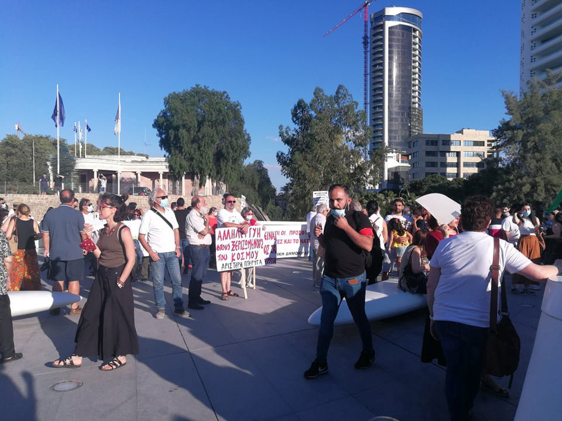

### AYS Daily Digest 19/06/20: Ripe for Corruption? The Greek Migration Ministry\.

[Are You Syrious?](@AreYouSyrious?source=post_page-----a73515dc8039----------------------)

[Jun 20](ays-daily-digest-19-06-20-ripe-for-corruption-the-greek-migration-ministry-a73515dc8039?source=post_page-----a73515dc8039----------------------) · 12 min read

Croatian police arrested for beating up asylum seekers // Asylum reform in Cyprus // Allegations of Frontex assisting in illegal pushbacks // Institutionalised racism at the Spanish border
### Feature

The Greek Migration Ministry has announced that The European Union\-funded ESTIA \(Emergency Support to Integration and Accommodation\) program for asylum seekers, which has been run by UNHCR since 2016, will come under the control of the ministry by the end of the year\. [By October 2019, the UNHCR](https://casework.eu/lesson/estia-the-unhcr-accomodation-scheme-greece/) had created 25,545 places in the accommodation scheme as part of the ESTIA programme\. These were in 4,475 apartments and 14 buildings, in 14 cities and 7 islands across Greece\. Since November 2015, more than 60,000 have benefitted from the ESTIA scheme now set to be taken over by the Greek Ministry\.

Whilst this move has been [defended by the government as part of efforts to reduce costs](https://www.ekathimerini.com/253846/article/ekathimerini/news/ministry-taking-over-un-accommodation-program) and increase transparency, due to previous allegations of the misconduct within refugee accommodation management this move to centralise the control of the ESTIA programme should be seriously questioned\.

As previously reported by Are You Syrious, it was discovered last month that a newly appointed manager of a [refugee accommodation centre in Pyrgos has extensive](https://www.efsyn.gr/ellada/koinonia/244453_synergatis-nazistikon-ekdoseon-o-dioikitis-tis-domis-pyrgoy) affiliation with far\-right and Nazi groups and has previously published a book titles ‘Minarets: The Speeches of Islam in Europe’\. Upon questioning, the Minister of Immigration and Asylum has failed to make pubic this person’s CV or necessary qualifications for his position as head of a refugee accommodation centre, leading many people to express concern as to why this person has received such an important appointment\.

In addition to the appointment of accommodation managers with far\-right and Nazi affiliation, the Greek newspaper [Efsyn](https://www.efsyn.gr/ellada/koinonia/244453_synergatis-nazistikon-ekdoseon-o-dioikitis-tis-domis-pyrgoy) alleged that it was common for the commanders of refugee structures to be persons with close relations with the ruling N\.D\. party\. Efsyn’s preliminary investigation had shown that the commanders of at least six refugee structures had extensive links with the party\.

As well as allegations being made of questionable appointments of management as commanders of these refugee structures, the Greek migration ministry was mired in controversy last month with the creation of a so\-called “black fund” for secret payments\. The “black fund” was implemented as part of the new asylum law, but due to the anger of opposition lawmakers, was introduced after the period of public consultation had ended\.

[Balkan Insight](https://balkaninsight.com/2020/05/13/transparency-concerns-in-greece-over-migration-ministry-black-fund/) reported that “ _Mitarakis will control spending from the “black fund” with the oversight of three public servants from his own ministry\. All documentation will be destroyed every six months and, in a change to the original proposal to appease critics, information on payments over 25,000 euros must be submitted to a special committee of the Greek parliament_ ”\.

In response to this “black fund” [Tasos Kostopoulos](https://balkaninsight.com/2020/05/13/transparency-concerns-in-greece-over-migration-ministry-black-fund/) , a researcher on the history of far\-right links to the state apparatus, said, “ _In the case of the Migration Ministry there might be a need for flexibility to handle emergencies but not at all a need for secret funds\. There is no defensible reason for destroying the evidence and this covering up points to the fact that its purpose is internal, which raises questions regarding its democratic credentials_ ”\.

The ability of any ministry to destroy all documentation of its actions, especially within a programme with no independent or impartial oversight, is a matter of grave concern\. Given the aforementioned, the justification for reducing costs and increasing transparency is questionable at best and thus the government’s motives for taking over this programme, which will extensively expand their current operations, should seriously be called into question\. If this programme is absorbed by the Ministry, a clear and transparent recruitment selection must be made, and the ability to misappropriate funds should be limited with the introduction of independent and impartial oversight\.
### Croatia

Following years of comprehensive documentation by civil society of the police violence, abuse and even torture directed at refugees and migrants, on Thursday [it was announced that two police officers](https://www.theguardian.com/global-development/2020/jun/19/croatian-police-officers-arrested-over-beating-of-afghan-asylum-seeker?fbclid=IwAR0_2VgMlnuCDDI091LwquhUHBWEFYXqjmT282e1OI7OWDATNOvRoG8KKY8) will be held to account and have been arrested over the beating of Afghan asylum seekers\.

Following the announcement of their arrest, the police officers have been removed from service, will remain detained for 30 days and have had disciplinary proceedings filed against them\. One police officer is currently being charged with ‘causing bodily harm’ and the other for failing to report a crime\.

It is imperative to point out that this is the first known arrest of a Croatian police officer related to the continued allegations of violence against migrants and refugees\. Early this week [Amnesty International published](https://www.amnesty.org/en/latest/news/2020/06/croatia-fresh-evidence-of-police-abuse-and-torture-of-migrants-and-asylumseekers/) a damning report on the horrific escalation of human rights violations by [Croatian police officers at the border with Bosnia after evidence emerged that these officers tied 16](https://www.theguardian.com/global-development/2020/jun/15/eu-covered-up-croatias-failure-to-protect-migrants-from-border-brutality) Pakistani and Afghan men to trees, slashed them with knives, electro shocked them, threatened them with firearms and then smeared food onto their bleeding heads\.

The arrest of these two police officers risks embarrassing the Croatian interior ministry, which typically denies all allegations of violence and abuse and often attempts to slander or defame any organisation that documents such treatment\. Similar allegations of a refusal to acknowledge or address the Croatian police’s human rights violations have also been directed at the Europen Commission\. Earlier this month, [The Guardian reported that internal European Commission](https://www.theguardian.com/global-development/2020/jun/15/eu-covered-up-croatias-failure-to-protect-migrants-from-border-brutality) documents revealed officials in Brussels had been fearful of a backlash when deciding against full disclosure of Croatia’s lack of commitment to a monitoring mechanism that ministers had previously agreed to fund with EU money\.

In a [public statement made on Friday, two UN Special Rapporteurs](https://www.ohchr.org/EN/NewsEvents/Pages/DisplayNews.aspx?NewsID=25976&LangID=E) stated that Croatia must immediately investigate reports of excessive use of force by law enforcement personnel against migrants, including acts amounting to torture and ill\-treatment, and sanction those responsible\. Felipe González Morales, special rapporteur on the human rights of migrants, and Nils Melzer, special rapporteur on torture and other cruel, inhuman or degrading treatment or punishment, said in a joint statement: “we are deeply concerned about the repeated and ongoing disproportionate use of force by Croatian police against migrants in pushback operations\. Victims, including children, suffered physical abuse and humiliation simply because of their migration status\.

Melzer said: “Such treatment appears specifically designed to subject migrants to torture and other cruel, inhuman or degrading treatment as prohibited under international law\. Croatia must investigate all reported cases of violence against migrants, hold the perpetrators and their superiors accountable and provide compensation for victims\.”

Whilst these reports reveal the disgusting actions of some members of Croatian society, the recent fundraising campaign by Are You Syrious shows the overwhelming warmth and generosity of the rest\. The fundraising campaign, aimed at providing support to refugee households in Croatia affected by the current COVID crisis and the recent earthquake, successfully raised HRK 181,531\.96 to help 60 households\. The campaign was supported by 623 donors, of which over 90% were Croatian\. [Speaking to h\-alter, Tajana Tadić said](http://h-alter.org/vijesti/gradjani-solidarno-stali-uz-izbjeglicka-kucanstva?fbclid=IwAR3RO_RuzavoGBr93_K4um9Lgsxl4guHULg5Ren4WDx4qCe-6aQ74Jvw8oU) : “\[this generosity\] is a welcome that citizens, organizations and companies in Croatia have shown to our new neighbours, and which really means a lot after the great life challenges they faced not only this year but in the past few years”\.
### EU

[Humanitarian groups operating across Europe](https://twitter.com/alarm_phone/status/1273607226222088193?ref_src=twsrc%5Etfw%7Ctwcamp%5Etweetembed%7Ctwterm%5E1273607226222088193&ref_url=https%3A%2F%2Fwww.infomigrants.net%2Fen%2Fpost%2F25494%2Feu-accused-of-using-aerial-surveillance-to-help-push-migrants-back-to-libya) and the Mediterranean have accused the EU of assisting illegal pushbacks of migrants and refugees to war\-torn Libya\. Alarm Phone, Borderline\-Europe, Mediterranean Saving Humans and Sea\-Watch said in a joint document that “tens of thousands” of migrants have been returned to Libya and prevented from reaching Europe because EU planes operating in the Mediterranean only supposedly contact Libya’s coast guard when they spot stranded migrants\.

[Within their report they assert that:](https://eu-libya.info)
- EU aerial assets are deployed to detect migrant boats from the air and guide the so\-called Libyan Coast Guard to the locations of escaping boats\.
- Aerial surveillance has led to the capture of tens of thousands of people and their return to the Libyan war zone\.
- Through both aerial surveillance and coordination activities in migrant interceptions, EU actors have violated their SAR obligations and facilitated interception activities of the Libyan authorities\. EU actors are thus complicit in the systematic violation of human rights\.

Similar recent allegations of EU cooperation in illegal pushbacks have also been made by the Border Violence Monitoring Network\. They report on the testimonies of a group of seven people who were caught, beaten, questioned in a police station in Bilisht, before being ejected through the green border into Greece without due process\. The testimony alleges that Frontex was reportedly involved in the apprehension, arbitrary detention and illegal collective expulsion\. These allegations, matched with the recent investigation by The Guardian that allege an attempted coverup by the EU commission of Croatia’s human rights abuses, are calling into question the integrity of the EU when dealing with the so called “refugee crisis”\.

The [European Commission for Human Rights](https://www.coe.int/en/web/commissioner/-/pushbacks-and-border-violence-against-refugees-must-end?fbclid=IwAR0lzbpeBQcjx98Vor82JoTKz2DwAeDbJ30rdL9vKrPLDOeFDHQTb2s6U8E) has published a statement ahead of world refugee day calling on Council of Europe member states to hold true to their obligations to refugees by stopping pushbacks and border violence on their own territories, and by holding each other to account for failing to protect refugees and their rights\.

The statement reads

> _“On 20 June, World Refugee Day will spotlight the hardship that refugees endure\. I pay tribute to the resilience of refugees and reiterate the call to protect them and uphold their rights”, said today the Council of Europe Commissioner for Human Rights, ahead of World Refugee Day\. “All too often, additional hardship is deliberately inflicted on refugees by many of the states to which they turn for protection, including in Europe\. This is inhumane and must stop\._ 

> _Governments should start with tackling the most blatant violations of refugees’ rights\. Pushbacks are a case in point\. They are becoming more normalised and are carried out in an increasingly violent way across Europe\. The illegal practice of pushbacks not only deprives those who may seek asylum from this opportunity\. It also eats away at the foundation of international human rights law which protects refugees\.”_ 

To view the full statement, please follow the link below:
### [Pushbacks and border violence against refugees must end](https://www.coe.int/en/web/commissioner/-/pushbacks-and-border-violence-against-refugees-must-end?fbclid=IwAR0lzbpeBQcjx98Vor82JoTKz2DwAeDbJ30rdL9vKrPLDOeFDHQTb2s6U8E)
### [Strasbourg Diminuer la taille du texte Augmenter la taille du texte Imprimer la page Imprimer en PDF “On 20 June, World…](https://www.coe.int/en/web/commissioner/-/pushbacks-and-border-violence-against-refugees-must-end?fbclid=IwAR0lzbpeBQcjx98Vor82JoTKz2DwAeDbJ30rdL9vKrPLDOeFDHQTb2s6U8E)
#### [www\.coe\.int](https://www.coe.int/en/web/commissioner/-/pushbacks-and-border-violence-against-refugees-must-end?fbclid=IwAR0lzbpeBQcjx98Vor82JoTKz2DwAeDbJ30rdL9vKrPLDOeFDHQTb2s6U8E)
### Spain

Following the judgement by the Grand Chamber of the European Court of Human Rights regarding the case of ND and NT v\. Spain, [Forensic Architecture, in partnership with ECCHR](https://forensic-architecture.org/investigation/pushbacks-in-melilla-nd-and-nt-vs-spain?fbclid=IwAR2xkAKqBawhPgOjYCZh4ZFFOSeLcanQLjA-VeREjqWxeASx6u6hOckE6Fg) , has published their latest investigation\. FA and ECCHR investigated whether the legal entry procedures presented to the Court by Spain were, in fact, available to Sub\-Saharan nationals, using spatial analysis, official data from the Spanish government, human rights reports, and testimonies\.

Their investigation demonstrates that both Spain’s claims and the Court’s conclusions that these pushbacks did not violate the European Convention on Human Rights \(ECHR\) are false\. The report demonstrates that the judgment by the Court that climbing the border fences was ‘culpable conduct’, and individuals should have used legal entry procedures instead is a flawed judgment, as Black people from Sub\-Saharan Africa are systematically discriminated against at the Melilla border\.

The report by FA and ECCHR states that the case of ND and NT reveals the mechanisms of structural racism embedded in Europe’s border policies\. They assert that the judgement by the Court is a gross distortion of the facts, and fails to acknowledge the realities at Europe’s borders\.

To read their full report and to watch their investigative video please follow the link below:
### [Pushbacks In Melilla: Nd And Nt V\. Spain](https://forensic-architecture.org/investigation/pushbacks-in-melilla-nd-and-nt-vs-spain?fbclid=IwAR2xkAKqBawhPgOjYCZh4ZFFOSeLcanQLjA-VeREjqWxeASx6u6hOckE6Fg)
### [The case of ND and NT v\. Spain was the first trial at the European Court of Human Rights to address pushbacks at…](https://forensic-architecture.org/investigation/pushbacks-in-melilla-nd-and-nt-vs-spain?fbclid=IwAR2xkAKqBawhPgOjYCZh4ZFFOSeLcanQLjA-VeREjqWxeASx6u6hOckE6Fg)
#### [forensic\-architecture\.org](https://forensic-architecture.org/investigation/pushbacks-in-melilla-nd-and-nt-vs-spain?fbclid=IwAR2xkAKqBawhPgOjYCZh4ZFFOSeLcanQLjA-VeREjqWxeASx6u6hOckE6Fg)
### Sea

Search and rescue organisations working across the Mediterranean have reported on numerous rescue missions conducted over the last 48hours\. In addition, Alarm Phone also reported on boats in distress being attacked and demobilised in the waters near Lesvos\. Alarm Phone contacted the Greek Coast Guard, but the boats were later rescued by the Turkish Coast Guard\.
### Morocco

[The Moroccan navy has claimed](https://www.infomigrants.net/en/post/25474/almost-100-migrants-intercepted-by-moroccan-navy?fbclid=IwAR2LDuifygidj1NaHqF9z8bQMvQmetoAnk7fbi1xeriIo70TyV246jcSFE4) that it saved 100 migrants from “drowning in the Mediterranean”\. It has been reported that the migrants were travelling on several boats in the direction of Spain\. A military source reportedly told MAP that they received care on board the navy vessels which then took them “safe and sound to the port of Nador” in northeastern Morocco\. It has yet to be ascertained if these groups were in distress or had instead been picked up by the Navy to stop them from reaching Europe, especially considering that Morocco receives aid money from the EU to stop migrants from reaching European soil\.

Previously, [Amnesty International](https://www.amnesty.org/en/latest/news/2018/09/morocco-relentless-crackdown-on-thousands-of-sub-saharan-migrants-and-refugees-is-unlawful/) had reported on an unlawful and “relentless crackdown on thousands of sub\-Saharan migrants and refugee” by Moroccan authorities\. In 2018, AI reported that the Moroccan police together with the Royal Gendarmerie and the Auxiliary Forces had been carrying out major raids on the neighbourhoods where refugees and migrants live\. They estimated that 5,000 people had been swept up in the raids, piled onto buses and abandoned in remote areas close to the Algerian border or in the south of the country\.

In light of these past allegations of human rights abuses, the interaction between Moroccan authorities and refugee communities should be carefully examined\.
### Libya

In 2018, when journalist Sara Creta first met James, he had survived a Mediterranean shipwreck, been shot and spent years being abused and tortured in Libya\. He is one of 81,000 migrants returned to home to Nigeria by the IOM sponsored by the EU commission\. This is James’s story:

To further understand the treatment that James is likely to have endured, MSF has published a short documentary showing the treatment of around 650,000 refugees, asylum seekers, like James, who are trapped in war\-torn Libya\. These people live in precarious conditions with limited access to health care and humanitarian assistance\.
### Cyprus

Over 1 [00 people attended a demonstration](https://cyprus-mail.com/2020/06/19/demo-held-in-nicosia-to-support-refugees/?fbclid=IwAR1tVF8SAVtuUV6BiGs1_Kyrm0g6CClR41kPU1JywamyDU_M7v718xyX9zU) in Nicosia on Friday marking World Refugee Day\. In the demonstration, the participants carried banners saying ‘Solidarity to refugees’ and ‘We can’t breathe’\.

These actions occurred against the backdrop of an upcoming [reform of the Cypriot migration policy](https://www.ekathimerini.com/253850/article/ekathimerini/news/cyprus-says-common-eu-migration-deal-imperative) \. With an upcoming constitutional amendment predicted to be approved next month, the time asylum seekers have to appeal their rejected claim is expected to be cut from 75 days to 15 days\. Its claimed that this change in policy is in an attempt to clear up the huge backlog of cases and slash the processing time of asylum applications\. Additionally, it has been reported that applications from citizens of 21 “safe” countries including Egypt, Nigeria, Bosnia the Philippines and Vietnam will be proactively considered “baseless” unless applicants can prove that their lives would be in danger if they returned\.
### France
### Bosnia and Herzegovina

The Women’s International League for Peace and Freedom has produced a written statement on Bosnia and Herzegovina for the 44th Session of the UN Human Rights Council regarding repression and violence against people on the move\.

The submission reads:

> _Most of the EU assistance to BiH has been channelled through international organisations \(IOs\), primarily the International Organization for Migration \(IOM\), which have consequently taken over the management of camps\. This has resulted in a de facto shifting of the responsibility to protect asylum seekers’ and migrants’ human rights from the State to IOs\. Lacking a mechanism for doing so, activists have been unable to hold the IOM or other IOs accountable for poor management of the camps, despite reports from those hosted in the camps, journalists and activists of, inter alia, inadequate living conditions, violence, poor and insufficient access to food and poor hygiene facilities\._ 

> _The submission further states that during the COVID\-19 outbreak, a “lockdown” of people on the move was further introduced in the whole of BH, with police rounding them up from squats, paid accommodation, and streets, and placing them in the already overcrowded camps of Ušivak and Blažuj near Sarajevo\. The full lockdown of people on the move was not in line with measures introduced for the rest of the population, a clear act of discrimination\. \[…\. \] After the official end of COVID\-19\-related measures, the BH authorities have not removed that ban on movement\. The Una\-Sana Canton authorities have even stepped up repressive measures, with a new set of Task Force conclusions in 18 May 2020\. These, inter alia, state that the restriction of movement for the Miral and Bira camps remains in place; owners of residential and abandoned buildings are required to physically protect the buildings, making it impossible for people on the move to seek shelter\. Moreover, any assistance, such as in food or clothes, by volunteers in Una\-Sana Canton is prohibited, effectively criminalising solidarity, without any legal grounds\._ 

In summary, the submission produced by the Women’s International League for Peace and Freedom urges the BH government to regain state control and responsibility over the management of migration in the country, ensuring that human rights are at the core of all responses; provide secure access to services such as free legal aid and healthcare within and outside camps; and stop investing in militarization of borders and police, and redirect funds into humanitarian management of migration\.

To read their full submission please [follow the link\.](https://www.wilpf.org/wp-content/uploads/2020/06/HRC44_BiH_WS-on-SR-on-migrants-report_18.06.2020.pdf?fbclid=IwAR3sHDy6GUugvnbS7PMlBTl2w2_MWFgL7badNmkrGnI3VT75yY0EfFdETEA)
### Find daily updates and special reports on our [Medium page](https://medium.com/are-you-syrious) \.

**If you wish to contribute, either by writing a report or a story, or by joining the info gathering team, please let us know\.**

**We strive to echo correct news from the ground through collaboration and fairness\. Every effort has been made to credit organisations and individuals with regard to the supply of information, video, and photo material \(in cases where the source wanted to be accredited\) \. Please notify us regarding corrections\.**

**If there’s anything you want to share or comment, contact us through Facebook, Twitter or write to: areyousyrious@gmail\.com**
### Sign up for AYS Daily Newsletter from Are You Syrious?
#### Daily news digests from the field, for volunteers, people on the move, journalists, and the general public
#### You’re an editor of AYS Daily Newsletter

_Converted [Medium Post](https://medium.com/are-you-syrious/ays-daily-digest-19-06-20-ripe-for-corruption-the-greek-migration-ministry-15a6c1629c89) by [ZMediumToMarkdown](https://github.com/ZhgChgLi/ZMediumToMarkdown)._
