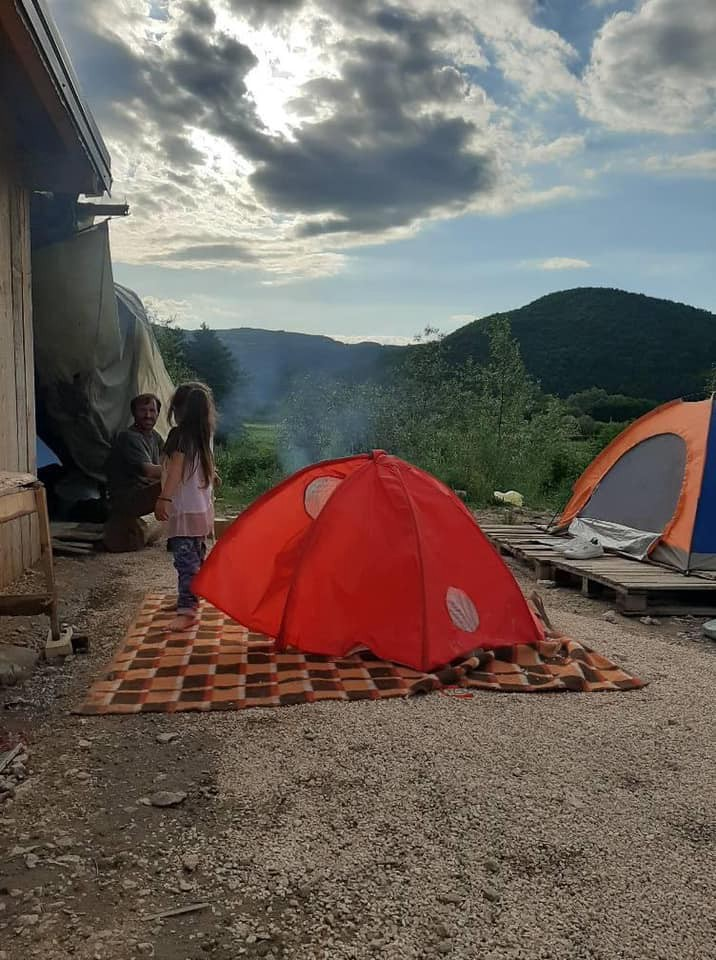
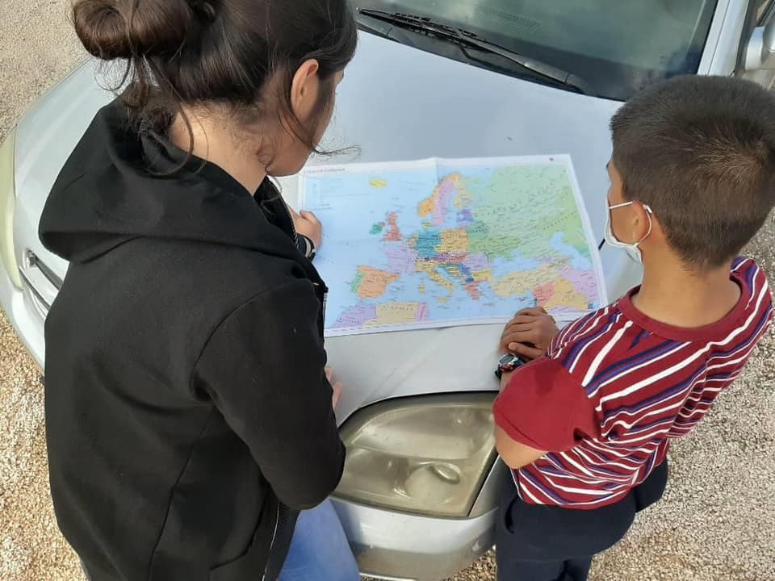
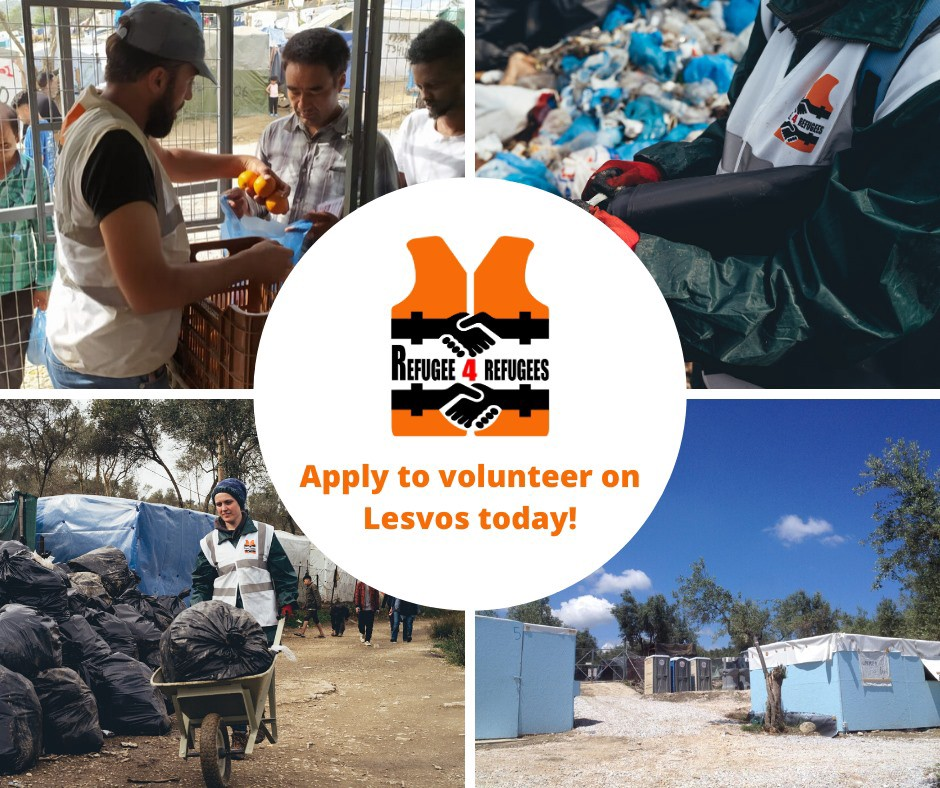

### AYS Daily Digest 23/6/20: Deaths along the Balkan Route go overlooked
#### People whose stories will never be heard have been losing lives across the so\-called Balkan Route even more in the past weeks and months, but somehow these tragedies draw little outrage and less action / more cases of collective expulsion in Greece; extensive reports / Sweden and Germany deport to Afghanistan in spite of reports of the “deadliest week in the 19 years of armed conflict in the country” / recommended reads from now on in each News Digest for getting deeper into what’s going on

Velčevo, Bosnia and Herzegovina — Photo by Selma Dzafic
#### FEATURED

One of the young men in transit in Bosnia and Herzegovina who sustained serious injuries in a recent fire in the house the two young people stayed in, lost his fight to survive at the hospital in Tuzla, where the local doctors did their best to save his life\. Another man with second\-degree burns was released from the hospital\. The family of the deceased has, of course, taken the news tragically and with great sadness\. They are currently contacting the embassies in neighboring countries in order to arrange for the body of their son to be brought back for a funeral at his home\. Unfortunately, these tragic events are no longer exceptions in what is turning into a deadly and tragic period for many en route to a safer and better future\. This is the second death in only two weeks in Tuzla\.

In the meantime, two more cases of serious self\-inflicted injuring have occurred in the _City of salt_ , where people on the move are left to survive\. There are still a few groups of individuals willing to assist them, but who, in spite of all the efforts, cannot see this through without any substantial organised and systemic support from the international community\. It is particularly their own government and officials who have been playing power games and dodging their responsibility for at least two years now and, in spite the recently much debated deals between the country and the EU, the situation — from the point of view of those on the move — very much remains the same\. In Tuzla, the first big town after one enters BiH from Serbia, there are no institutional or organized support services present\. Without the police documents that are issued at the Office for foreigners, people can’t take anyone to the doctor’s or to receive any other help This may have even been the goal of those deciding — to demotivate people in the worst way from staying in Tuzla and its surroundings\.

At the same time, the authorities in other areas also cling onto their ridiculous and illegal decisions: for example, the horrible practice of kicking people out of buses and trains near Ključ, where people are then left to the local team of the Red Cross of Ključ who try to help and shelter the people until they can move on to the border areas of the Una\-Sana canton in Bihać, where another dreadful chapter begins…

 \)](assets/7bb258367ef4/1*ntQ2jYb-jjOpYqigRSBjig.jpeg)

Velčevo, forcibly interrupted travel of families ends up with the few good people taking care of them until they can move on\. IN THE MIDDLE OF NOWHERE\. \(Photos: [Selma Dzafic](https://www.facebook.com/selma.duhovic?fref=gs&__tn__=%2Cd%2AF%2AF-R&eid=ARAbhwXChd_N4aXLEdgDhZwqxajbkNFAef3fygjH8wyrrIlnvEf5F-eP4icfcKGZzl8uXqL2BBPs4IK9&tn-str=%2AF&dti=2379336965459224&hc_location=group_dialog) \)

AYS has received more calls by people in Croatia who have encountered wounded people or speak of more victims at the borders\. The most recent call was as recent as today, from a woman in Croatia who is claiming they hosted a group of young, possibly underage people — two of the group are suspected to have drowned in the river Mrežnica\. Countless such reports often go ‘beyond the radar’ to the point that we are left wondering how many lives were lost and never identified due to fear and lack of basic human care for people, for human lives\. Unidentified people at the morgues, traumatized young boys who have experienced multiple beatings and violent treatment at the border, only to have seen their friends drown or dissappear… We hope sooner than later, the pressure by everyone who refuses to see this practice as normal, changes our policies and the common struggle results in more than a mock case of a single police officer, among so many who are forced to follow orders that go against any human rights or the basic urge to help others\.

In Austria, [Plattform für eine menschliche Asylpolitik](https://www.facebook.com/menschliche.asylpolitik/?__tn__=%2CdKH-R-R&eid=ARC946YayJuyCQPnp1HsWotd7D5mE0aC95cw4bWSp8kF3TI5SPh-tGakyiEari9TlMAVJ6zO2B9zE5dv&fref=tag&hc_location=group) has organized a protest [Weltflüchtlingstag\-Solidarisch durch jede Krise\!](https://www.facebook.com/events/2572909476294958/?acontext=%7B%22source%22%3A4%2C%22action_history%22%3A%22%5B%7B%5C%22surface%5C%22%3A%5C%22group%5C%22%2C%5C%22mechanism%5C%22%3A%5C%22surface%5C%22%2C%5C%22extra_data%5C%22%3A%5B%5D%7D%5D%22%2C%22has_source%22%3Atrue%7D&source=4&action_history=%5B%7B%22surface%22%3A%22group%22%2C%22mechanism%22%3A%22surface%22%2C%22extra_data%22%3A%5B%5D%7D%5D&has_source=1&__tn__=%2CdKH-R-R&eid=ARDA-o4FThKOUPWW4l-CEwTfFU1mT1moU7fscqI0RneFPik7kx_mZp09cnJgWKRvIwju4n6sCG_CMenZ&hc_location=group) against the violent practices across the Balkans\.

At first, the plan was to stage it in front of the Croatian embassy, due to the many reported violent pushbacks conducted by the Croatian police and instructed and funded by the EU\. However, they were not permitted to hold it there, so the more than a thousand protesters gathered in a different place, according to the activists\.
#### AFGHANISTAN
### In spite of the deadliest week in the 19 years of conflict, Germany and Sweden continue deportations — suicide of a man set to be deported from Germany

It is the sad climax of an unworthy election campaign on the backs of the weakest: one of the refugees, whose deportation Interior Minister Horst Seehofer proudly announced, committed suicide in Afghanistan\.
More on the story in the German [media\.](https://l.facebook.com/l.php?u=https%3A%2F%2Fwww.abendzeitung-muenchen.de%2Finhalt.seehofer-feierte-abschiebung-abgeschobener-fluechtling-23-erhaengt-sich-in-kabul.4b00e045-a947-45f6-9f1b-0a54a037c618.html%3Ffbclid%3DIwAR3pd9aVTOGeT7hH6zzHnMCz-2X09EpprNu7FW22JaDVcRtf4ANDaK6Xohs&h=AT1qJ1Egu9_CFkNz5tkO5ErCNZWDBGX32mMuxwUAon3VVRcqAz7HLy5xLRcEdu8a1hEioE0IpQD8xC4zJqEXx0yjrGo5aMjIj0pGB7RKKJE6XYHgYlEGpWEso2CUh88lQlh92KQaJgb6wQ)

According to the [Afghanistan Migrants Advice & Support Org](https://www.facebook.com/AmasoAfg/?__tn__=%2CdkCH-R-R&eid=ARA9iGCGeOEhqn7jDmfF81TokU8Y3ybafiLN9ISdcTMA3zQWclkZWgy77Tz1QcXMawlvLfDp26-OJpp3&hc_ref=ARSOSeVf_Mq13yL5GsNTGMT_pBK8f_6CIz8QB4LbhsFPglo1QUgQfJtmGCixpyQk-ng&fref=nf&hc_location=group) , Sweden is also planning to return an unconfirmed number of Afghan asylum seekers using a charter flight to send them back to Afghanistan today, Tuesday evening\. 
Many sources confirm those in detention are tricked into signing papers that indicate they are returning voluntarily\. Until the release of this Digest, we did not get any updates from the ground on the planned gathering or the flights\.

At the same time, the people returned to the country face a dangerous backlash for leaving by the system, as well as the growing number of escalations of violence across the country\. Official reports from Afghanistan claim that the Taliban carried out 422 attacks in 32 provinces during the past 2 weeks alone, “killing 291 security force personnel and wounding 550 others\.”

](assets/7bb258367ef4/1*1fWhimuNr4mK05x6L_SIGA.jpeg)

Photo: [SOS Balkanroute](https://www.facebook.com/SOSBalkanroute/?tn-str=k%2AF&hc_location=group_dialog)

> European Mayors not only want to show their willingness to accept refugees in their cities, they also want to have a say in the EU migration policies, which at the moment are mostly controlled by nation\-states\. 

■■■■■■■■■■■■■■ 
> **[European Alternatives](https://twitter.com/euroalter) @ Twitter Says:** 

> > European Mayors not only want to show their willingness to accept refugees in their cities, they also want to have a say in the EU migration policies, which are the moment are mostly controlled by nation-states. #sea2City @[zeitonline](https://twitter.com/zeitonline) 
[zeit.de/politik/2020-0…](https://www.zeit.de/politik/2020-06/europaeische-asylpolitik-eu-aussengrenzen-mittelmeer-humanitaere-katastrophe-kommunen-aufnahme-gefluechtete/seite-2) 

> **Tweeted at [2020-06-23 07:49:48](https://twitter.com/EuroAlter/status/1275335230212263936?s=20).** 

■■■■■■■■■■■■■■ 

#### GREECE
### Masked Men On A Hellenic Coast Guard Boat Involved In Pushback Incident — A thorough investigation

> In recent months, disturbing reports have emerged of unidentified masked men on high speed launches harassing or attacking boatloads of asylum seekers in the Aegean\. [Witness testimony gathered from multiple sources](https://www.spiegel.de/international/europe/videos-and-eyewitness-accounts-greece-apparently-abandoning-refugees-at-sea-a-84c06c61-7f11-4e83-ae70-3905017b49d5?utm_source=dlvr.it&utm_medium=twitter#ref=rss) has described a string of incidents where these launches, known as Rigid Hull Inflatable Boats \(RHIBs\), have approached vessels carrying men, women in children in the sea between Turkey and Greece and either driven them back, intimidated them or taken their engines, sometimes violently\. 

> These reports appear to be part of a broader alleged [pattern](https://www.bellingcat.com/news/uk-and-europe/2020/05/20/samos-and-the-anatomy-of-a-maritime-push-back/) of maritime pushbacks, in violation of national and international law\. 

> Until now it has not been possible to identify where the launches are coming from or who the masked men piloting them may be\. Video evidence from an incident on June 4 may prove critical in answering these questions\. 

### Volunteering

> As COVID\-19 restrictions continue to ease in Greece, we are now reopening applications for volunteers to join our team on Lesvos\! 

> We’re looking for dedicated [\#volunteers](https://www.facebook.com/hashtag/volunteers?__eep__=6&epa=HASHTAG) aged 20\+ with prior experience in a camp setting who can commit 3 months of their time to support our operations in the olive grove\. As a volunteer, you will have a vital role in ensuring we can continue to improve living conditions for people in Zone 12 through the following operations; 

> Food distribution: Every day, we distribute meals at breakfast, lunch and dinner for around 2000 people in Z12\. From receiving the deliveries, to handing out each meal and ensuring our distribution point remains clean, our team in the field works around the clock each day to run this operation\. 

> Camp clean\-ups \(resuming soon\): Our waste management operation has collected hundreds of bags of waste from around the olive grove in an effort to support more hygienic living conditions, improve safety and ensure access to the main roads\. 

> In April, we completed the construction of quarantine shelters in Mandala, to be used in the event of a suspected outbreak of COVID\-19 in the camp\. We will also be in need of team members to help maintain this facility and ensure it remains secure throughout the day over the coming months\. 

> We’d like to hear from anyone who is interested in joining the [Refugee 4 Refugees](https://www.facebook.com/Refugee4Refugees/?__tn__=%2CdK%2AF-R&eid=ARAAUlZJY1h_wSSa1nXj9k-2PH4ZxbS-amgJ5neZcye-NHCgzkUy5zrqennnyzS44eVoi2qyzi-cFMgI) team ASAP\! Send us an email at volunteer@refugee4refugees\.gr to apply today\! 

■■■■■■■■■■■■■■ 
> **[Lena K.](https://twitter.com/lk2015r) @ Twitter Says:** 

> > Contrary to popular far right fiction/wishful thinking, #PushbacksAreIllegal in international and European law, including the UN Refugee Convention, the European Convention of Human Rights and the Charter for Fundamental Rights. Lies need to be challenged.
[assembly.coe.int/nw/xml/XRef/Xr…](http://assembly.coe.int/nw/xml/XRef/Xref-XML2HTML-en.asp?fileid=28074&lang=en) 

> **Tweeted at [2020-06-23 20:04:48](https://twitter.com/lk2015r/status/1275520201258401795?fbclid=IwAR0pcBGyrPGVlg6r0aQLgtDGJvfnQmxTIDG6oMc2QpwgoWsGK-81Ww9ikdQ).** 

■■■■■■■■■■■■■■ 

### June 16th, 18\.00h — a case of collective expulsion

A recent case was shared by activists and we display it here in full:

> “On the night of June 15, 2020, a group of Syrians embarked on a dinghy to reach the island of Castelrosso in Greece\. At 10:30 pm on June 16, 2020 they manage to touch the ground safely and decide to head to the first police station to surrender to the Greek authorities\. Meanwhile, they walk into a bar to get water, then they ask a Greek woman named Elena who rents hotel rooms, to be able to rest in one of the rooms, but the woman in a very rude and aggressive way explains that they are illegal immigrants and therefore had no right to get a room\. The group continues to walk on foot to reach the police post after about 3 hours of travel\. At 13\.00 they turn themselves in to the police who bring them into a room where there are two beds and a bathroom without a door\. The police place where this room is located has blue walls and inside the room there are someone’s memories written on it ′′ Rim Al Homsy “, ′′ Hassan Shahade Aleppo “, ′′ Osama ′′ and so on…
 

> The group is starting to become aware of the danger, after the request to law enforcement to give them food and water, because one of the policemen strongly refused to bring food and told them that the only water they could drink was that of the bathroom\.
 

> At 18\.00h, that is, after five hours inside the police station, the group is put in the car and taken to the sea\. Men from the Coast Guard were waiting for them, dressed in black and with a small Greek flag on the upper arm and with a grey colored boat\.
 

> Suddenly police deliver boys to these four men, who with the use of force, put asylum seekers on board the vehicle\. The screams of the group and every attempt to escape was now in vain\. The boat started at a very high speed and right now, the only thing going through the boys mind was death\. They didn’t understand what was happening and after 10 minutes of navigation they start thinking that it was impossible for the Greek coastguard to enter Turkish waters like this and that something big was about to happen\. After about 20 minutes at sea, the four men of the coastguard had reached the Turkish coast and had thrown migrants into the water, beating them wildly in the middle of the sea, also unaware that one of them couldn’t swim\. The coast was rocky and the boys miraculously managed to save their travel companion\.
 

> After reaching the Turkish coast, the group walked for about 6 hours to find the first means to move\.
 

> Obviously it’s also important to talk about another type of violence and that is the fact that these people were denuded by everything they had on, phones, documents, money and even their shoes\. In fact, the kilometers travelled in Turkish territory were very difficult because their feet were discovered\.” — _via_ [Nawal Soufi](https://www.facebook.com/profile.php?id=100010425011901&__tn__=%2CdC-R-R&eid=ARBxrH08EHbpPShgS8__Dj1CSHbCGOAJmxY5lb0-pDZGTmzSshrwQqkvw5pjBqUZAVgl2e5b_Pc1rUiN&hc_ref=ARQ6jNFfWzX0lgvcA4NKjVHfUJ33CG9LUrQCBMqGZgkIQ8OihRU6liemZITrtI45iMM&fref=nf) 

### 𝗝𝗼𝗶𝗻𝘁 𝗦𝘁𝗮𝘁𝗲𝗺𝗲𝗻𝘁 𝗼𝗻 𝘁𝗵𝗲 𝗘𝘅𝘁𝗲𝗻𝘀𝗶𝗼𝗻 𝗼𝗳 𝗥𝗲𝘀𝘁𝗿𝗶𝗰𝘁𝗶𝘃𝗲 𝗠𝗲𝗮𝘀𝘂𝗿𝗲𝘀 𝗳𝗼𝗿 𝗔𝘀𝘆𝗹𝘂𝗺\-𝗦𝗲𝗲𝗸𝗲𝗿𝘀

More than 40 organisations have written a letter to Together with 40 NGOs, we have written a letter to
[Υπουργείο Μετανάστευσης & Ασύλου](https://www.facebook.com/migrationgovgr/?__tn__=K-R&eid=ARBIUbqjLEvDrKGgOQiJl0O5auTCElXwddmoMPOFqo3MEPPlSFcs9xlHPz3qmo7x5Sw_gSUOw-vC9Eks&fref=mentions&__xts__%5B0%5D=68.ARDWn9g5Y9plzCDlZpGuFnNWv_ENNRCb85kyumBHfiuIftAW1XUx9zQeGCZDJHYFlMSwdlWTD87tG7OWjadd0_FEKMaVAxN6UQyknLVmTnGBxe6lBQqLW3fLjjMEpNiwbvU2BtMdVAAvhy2aceTTPhkj1GMYtfXlHBQnrIkDemUEygmd_ho1-g0O-kjtK6gH4bqWBFKD45CH6Vmq6B500hN9Z7A6NrENf-FAQN6aqwV8hlbHqn0PAgcqbbWcUU7004_cYLAx0C59NuW1lSG98dYZ9V8oa9LtmoCAVNpAxZmIIATjDJWguXR3qs0TQPhm_pkwkvahQRHpceYe77eiefd5pQ) 
[Νότης Μηταράκης \(Notis Mitarachi\)](https://www.facebook.com/notis.mitarakis/?__tn__=K-R&eid=ARBT2wycrlCDeC_dEpFEWewssFYhCdqG_AuYLxHmFRpNbsxlsCRaC4SzwkYPiYlqm63F8cLhbJE86JLT&fref=mentions&__xts__%5B0%5D=68.ARDWn9g5Y9plzCDlZpGuFnNWv_ENNRCb85kyumBHfiuIftAW1XUx9zQeGCZDJHYFlMSwdlWTD87tG7OWjadd0_FEKMaVAxN6UQyknLVmTnGBxe6lBQqLW3fLjjMEpNiwbvU2BtMdVAAvhy2aceTTPhkj1GMYtfXlHBQnrIkDemUEygmd_ho1-g0O-kjtK6gH4bqWBFKD45CH6Vmq6B500hN9Z7A6NrENf-FAQN6aqwV8hlbHqn0PAgcqbbWcUU7004_cYLAx0C59NuW1lSG98dYZ9V8oa9LtmoCAVNpAxZmIIATjDJWguXR3qs0TQPhm_pkwkvahQRHpceYe77eiefd5pQ) 
[Γιώργος Κουμουτσάκος — Giorgos Koumoutsakos](https://www.facebook.com/gkoumoutsakos/?__tn__=K-R&eid=ARBfZkaIrNOzvC4-M4DT_DWl3Lx3Q20YhL5_SjYZeEniF0KQIa_y4wOJ03x7RO-TK3qSyNryU0PQj7pw&fref=mentions&__xts__%5B0%5D=68.ARDWn9g5Y9plzCDlZpGuFnNWv_ENNRCb85kyumBHfiuIftAW1XUx9zQeGCZDJHYFlMSwdlWTD87tG7OWjadd0_FEKMaVAxN6UQyknLVmTnGBxe6lBQqLW3fLjjMEpNiwbvU2BtMdVAAvhy2aceTTPhkj1GMYtfXlHBQnrIkDemUEygmd_ho1-g0O-kjtK6gH4bqWBFKD45CH6Vmq6B500hN9Z7A6NrENf-FAQN6aqwV8hlbHqn0PAgcqbbWcUU7004_cYLAx0C59NuW1lSG98dYZ9V8oa9LtmoCAVNpAxZmIIATjDJWguXR3qs0TQPhm_pkwkvahQRHpceYe77eiefd5pQ) 
[Γενική Γραμματεία Πολιτικής Προστασίας](https://www.facebook.com/CivilProtectionGreece/?__tn__=K-R&eid=ARD4CeZBqi9sMCY8PEOFtqQa_NR9Rfxl-Hjqh1lPjfJFJDp6ClGkD6w-5mIK8s9d-K4xSmJpBOhomkjh&fref=mentions&__xts__%5B0%5D=68.ARDWn9g5Y9plzCDlZpGuFnNWv_ENNRCb85kyumBHfiuIftAW1XUx9zQeGCZDJHYFlMSwdlWTD87tG7OWjadd0_FEKMaVAxN6UQyknLVmTnGBxe6lBQqLW3fLjjMEpNiwbvU2BtMdVAAvhy2aceTTPhkj1GMYtfXlHBQnrIkDemUEygmd_ho1-g0O-kjtK6gH4bqWBFKD45CH6Vmq6B500hN9Z7A6NrENf-FAQN6aqwV8hlbHqn0PAgcqbbWcUU7004_cYLAx0C59NuW1lSG98dYZ9V8oa9LtmoCAVNpAxZmIIATjDJWguXR3qs0TQPhm_pkwkvahQRHpceYe77eiefd5pQ) ​
[Μιχάλης Χρυσοχοΐδης — Michalis Chrisochoidis](https://www.facebook.com/chrisochoidis/?__tn__=K-R&eid=ARBEpZUMwHocyUwXtEU1FuV_utqbmQ3NcX083AKEWtZa1xv4cDxylCXH-9fPIZ9IYJumk8h0N503rESw&fref=mentions&__xts__%5B0%5D=68.ARDWn9g5Y9plzCDlZpGuFnNWv_ENNRCb85kyumBHfiuIftAW1XUx9zQeGCZDJHYFlMSwdlWTD87tG7OWjadd0_FEKMaVAxN6UQyknLVmTnGBxe6lBQqLW3fLjjMEpNiwbvU2BtMdVAAvhy2aceTTPhkj1GMYtfXlHBQnrIkDemUEygmd_ho1-g0O-kjtK6gH4bqWBFKD45CH6Vmq6B500hN9Z7A6NrENf-FAQN6aqwV8hlbHqn0PAgcqbbWcUU7004_cYLAx0C59NuW1lSG98dYZ9V8oa9LtmoCAVNpAxZmIIATjDJWguXR3qs0TQPhm_pkwkvahQRHpceYe77eiefd5pQ)

In the letter, they ask for justification of the decision to extend and maintain tight restrictions only for asylum\-seekers living in Reception and Identification Centres\.

Download PDF of it \(English & Greek\) here:
[https://samosvolunteers\.org/advocacy](https://samosvolunteers.org/advocacy?fbclid=IwAR2D_iSPY5pBO94xtPwzWqpqHn7a9mRPwD22V7nunrrmHGUuTCsdayG3EII)

Read the statement here:
[https://www\.europemustact\.org/…/joint\-statement\-on\-the\-exte…](https://www.europemustact.org/post/joint-statement-on-the-extension-of-restrictive-measures-for-asylum-seekers?fbclid=IwAR0rGXlAc7Y4bsHbMLynrzSt9orG9Acr_uamo9vfsGkTefkW8D-vyKBauWQ)
#### ITALY
### Roya still closed

Closed to new arrivals since April 18, the Roya transit camp in Ventimiglia has not reopened despite the deconfinement that began more than a month ago in Italy\. In the city, between 100 and 200 migrants now sleep on the street\. Read more [here](https://www.infomigrants.net/fr/post/25563/vintimille-malgre-le-chaos-dans-les-rues-le-camp-de-transit-roya-reste-ferme-aux-migrants?fbclid=IwAR3poZx0l4FRgL4u2XQiaZdU9_ZZFJQUuHdyhQMFgxZUcWyCuO2NnxHQfQc) \.
### Milano: Press conference on the Balkans, by Italian groups and initiatives

](assets/7bb258367ef4/1*zNGFlGBORy7WeVbeG3Fx9w.png)

For more information, see: [RiVolti ai Balcani](https://www.facebook.com/RiVoltiAiBalcani/?tn-str=k%2AF&hc_location=group_dialog)
#### SWITZERLAND
### Appeals for receiving more people

Amnesty International, Evacuate Now and Migrationscharta turned in their petitions to the Swiss government to take in more people in need, as their number grows in Europe’s south and southeast\. These petitions follow a similar call in April for Switzerland to take in more refugees\.
In May the country reported that they would take in 23 unaccompanied minors — from Afghanistan and the Democratic Republic of the Congo — who were later accepted by the country\.

At the same time, the UNHCR has been [calling the attention](https://www.unhcr.org/cy/2020/06/22/news-comment-on-the-discussion-at-the-human-rights-parliamentary-committee-on-the-situation-at-the-pournara-centre/?fbclid=IwAR0TVF9onHMo0ohzYdItFn1T3VEpdd6Y1WAvYFlNpdt41KxbwRzkZqs5KXw) of the competent authorities to the situation of unaccompanied children accommodated in the Pournara camp since the outbreak of the COVID\-19 epidemic\.

However, the situation is far from one in which we would be happy with 23 children leaving for Switzerland, when thousands of people are barely surviving while waiting for a consensus on a system to be put in by the EU and the Schengen countries, where things might run more smoothly and people wouldn’t have to suffer daily\.

> Switzerland applies more strictly than most countries the Dublin regulation by sending back asylum seekers to the country in which they first made their request\. 

> [14,269 asylum applications were made in 2019](https://www.sem.admin.ch/sem/fr/home/aktuell/news/2020/2020-01-31.html) , a 6\.5% decrease relative to the previous year, according to official figures\. Migration authorities expect to process about 15,000 new asylum applications in 2020, _the Swiss media [report](https://www.swissinfo.ch/eng/campaigners-push-swiss-to-take-in-more-refugees/45855872?fbclid=IwAR0leKFTkseK3A39XFb8I_qR-1XYjXWw5-mJoq_0gC4qgpxiPFUKECEg5kw) \._ 

#### GERMANY
### Hamburg

Various groups have been calling for the evacuation of the Greek camps for months — yet so far **only 290 minors** are planned to be taken nationwide\.

> That needs to change\! We have formed an alliance for this\. 
 

> Be curious, there will be more on that tomorrow\! 

■■■■■■■■■■■■■■ 
> **[Seebrücke Hamburg](https://twitter.com/SeebrueckeHH) @ Twitter Says:** 

> > #HamburgNimmAuf!
Seit Monaten fordern diverse Gruppen die Evakuierung der griechischen Lager - dennoch ist bisher nur bundesweit die Aufnahme von 290 Minderjährigen geplant. Das muss sich ändern! Dafür haben wir ein Bündnis gebildet. Seid gespannt, morgen gibt es mehr dazu! https://t.co/AyNfmRkAxf 

> **Tweeted at [2020-06-23 18:54:11](https://twitter.com/SeebrueckeHH/status/1275502431296782344?fbclid=IwAR1hfe6YDSgtjrlmczngNrzs9gxTl0k2bSwGEAIR0D07hW2BrqorXhevOME).** 

■■■■■■■■■■■■■■ 

#### FINLAND
### First children to finally arrive in Finland

25 unaccompanied children will be relocated to Finland next month from refugee camps in Greece, the first of around 175 children the government agreed to take\.

100 children in total will be brought to Finland from Greek refugee camps, mostly unaccompanied minors but single parents with children could also be relocated\. Later, other children will come from refugee camps in Cyprus and Malta and all new arrivals will have health checks, including coronavirus tests, and an interview to assess their needs as vulnerable asylum seekers, the Finnish media c [onfirmed\.](https://newsnowfinland.fi/domestic/unaccompanied-children-from-greek-refugee-camps-heading-to-finland-in-july?fbclid=IwAR3ea4s-g-j_5c04UGSMODJwRPz0hI-hD8XkdYajAU9DyKpY0PD7zsrYMLk)
#### FOR FURTHER READING

Integrate That\. A podcast about refugees by refugees:

Pushback policies and practice in Council of Europe member States

Violent clashes between rival groups of traffickers left at least a dozen dead last weekend in the Ténéré desert, north of Niger\. This area is a migration route frequently used by Africans seeking to reach Europe via Libya:

**Find daily updates and special reports on our [Medium page](https://medium.com/are-you-syrious) \.**

**If you wish to contribute, either by writing a report or a story, or by joining the info gathering team, please let us know\.**

**We strive to echo correct news from the ground through collaboration and fairness\. Every effort has been made to credit organisations and individuals with regard to the supply of information, video, and photo material \(in cases where the source wanted to be accredited\) \. Please notify us regarding corrections\.**

**If there’s anything you want to share or comment, contact us through Facebook, Twitter or write to: areyousyrious@gmail\.com**

_Converted [Medium Post](https://medium.com/are-you-syrious/ays-daily-digest-23-6-20-deaths-along-the-balkan-route-go-overlooked-7bb258367ef4) by [ZMediumToMarkdown](https://github.com/ZhgChgLi/ZMediumToMarkdown)._
