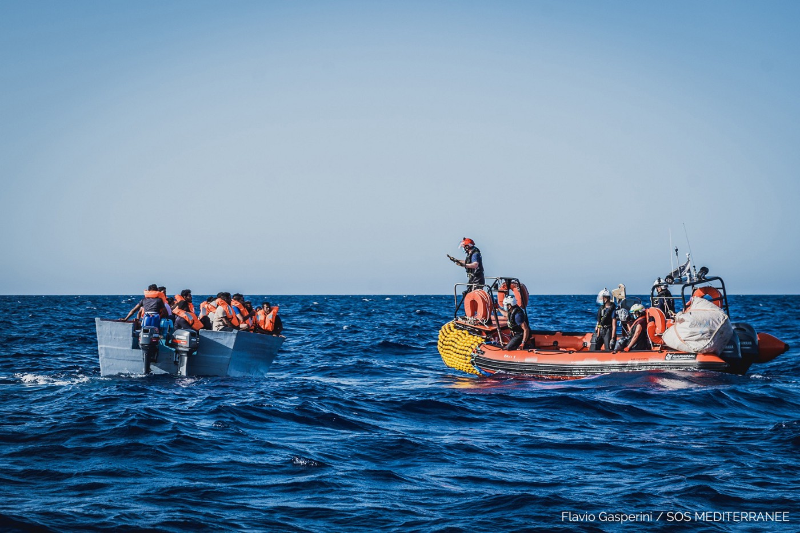
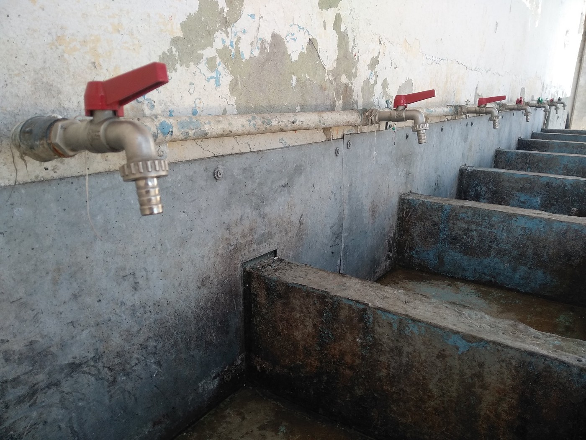

### AYS Daily Digest 25/06/20 Greece is set to assemble “2,7 km long floating fence” in Aegean
#### Bodies found in Croatia // Volunteers needed in France and Lebanon // refugees suing German authorities // and more…

](assets/843aea9f02d1/1*A8AmOtjzab2Wpp8wPFHcpQ.jpeg)

Life jackets left on Lesvos\. Photo by [Jim Black](https://www.dezeen.com/2020/02/10/greece-floating-sea-border-wall-news/)
### FEATURE: On July 6th, the “floating Stefanis dam” to keep people from crossing into Greece from Turkey will become a reality

Back in January, the Greek government announced that it would assemble a “ [2,7 km long floating fence](https://twitter.com/teammareliberum/status/1276215981191331843) ” along the Aegean to keep people from crossing from Turkey\. [Greek media](https://www.efsyn.gr/ellada/koinonia/249270_energopoieitai-ploto-fragma) reports:

> “According to information that is completely cross\-referenced, the Ministry of National Defense is ready to complete the procurement and receive on July 6 the 2,700 meters of floating dam against the outrageous price of 500,000 euros\.”

> “According to the same information, the floating dam is to be placed off the coast of Lesvos N / A, where, as all the latest arrivals data show, the only arrivals are located, with the exception of the illegal repatriations that take place along the entire length\. of borders\. 

> The floating anti\-pollution barrier is “inspired” by Undersecretary of Defense Alkiviadis Stefanis and was supplied to the Supreme Military Support Command \(ASDYS\) of the Ministry of National Defense by the Ministry of National Defense\.”

There are still many questioning the effectiveness of such a device, but it seems this might become reality yet\. The far right and their supporters like nothing more than building walls, fences, barricades, etc\. all in the name of protection \(and racism\) \. Whether these measures work for their intended purposes or not, we must always hold the perpetrators accountable, while working towards creating asylum systems that actually function in protecting human rights\.
#### LEBANON

The Lebanese Association for Development and Communication is looking for volunteers for when they might be able to resume their English and art classes\. Find out more [here](https://mobile.facebook.com/groups/1678012335777763?view=permalink&id=2661986347380352&ref=m_notif&notif_t=group_highlights) \.
#### ALGERIA AND TUNISIA
### 3x more people were arrested trying to depart by boat from Algeria in 2020 than in the same five month period in 2019\.

An expert says these are only the official numbers, the real number of people is probably 20x that to account for the people who made it to Europe\. The reasons for the increase:

> “A protest movement that started early last year and quickly toppled longtime president Abdelaziz Bouteflika had sparked young people’s hopes for a better future at home\. But as the unprecedented peaceful movement has been ever more harshly repressed and the oil\-dependent economy has tanked on low crude prices, illegal departures have ticked up again\. 

> Djamel \(a young Algerian\) said that with people being arrested for simply ‘posting opinions on Facebook’, making for the seas ‘has become a question of survival\.’ 

> “Mahrez Bouich, a professor of philosophy and politics in Bejaia in northeastern Algeria, agreed that the lack of hoped\-for changes, along with economic stagnation, were to blame\. The pandemic has ‘exacerbated social inequalities and injustices’, Bouich said\.”

**Tunisia has also seen a significant increase in departures** of Tunisians, 4x the number of people from the same period in 2019\. A Tunisian migrant said:

> “Living in a foreign country hit by the pandemic is easier than living here without money, without prospects and with the unemployment that strangles us\.”

#### SEA
### 118 people are onboard the Ocean Viking

 \. All of them are currently being looked after by our care and medical team and their health is being closely monitored\.†Photo by [SOS Mediterranee Germany](https://twitter.com/SOSMedGermany/status/1276236773912436738)](assets/843aea9f02d1/1*p1mvmqEt5jUAdcFVR5iJog.jpeg)

“On a second mission in the afternoon in the SAR zone in Malta, 67 more people were saved by our teams\. 118 people are now on board the [\#OceanViking](https://twitter.com/hashtag/OceanViking?src=hashtag_click) \. All of them are currently being looked after by our care and medical team and their health is being closely monitored\.” Photo by [SOS Mediterranee Germany](https://twitter.com/SOSMedGermany/status/1276236773912436738)
#### GREECE

Moria’s water access problem\. Photo by Watershed Foundation

The [Watershed Foundation](https://www.facebook.com/groups/informationpointforlesvosvolunteers/permalink/1457651471108962/) provided an update on the WASJ infrastructure in Moria:

> “For months, we have been facing our biggest challenge yet; the fact that there is simply not enough water coming into Moria, on a daily basis, to meet the needs of the thousands of people currently residing there\. At first, this meant that one of the two tanks \(the upper\) supplying the camp would run dry meaning unpredictable water cuts and causing understandable frustration\. We installed a float switch in the tank to cut off the pumps when this happened, allowing the tank to refill a certain amount before they came on again\. 

> In order to provide residents with some level of stability and to spread the availability of water throughout the day, we also installed timers to stop the pumps and allow refilling between certain hours\. A motorised valve was installed to prevent gravity feed into the camp when the pumps were stopped, thereby speeding up the refill process, and we data logged the performance so that we could see what was going on with tank in and outflow when we were not on site\. This has enabled us to maximise the use of water to the upper part of the camp and minimise disruption to the residents\.”

](assets/843aea9f02d1/1*fwk7VW2d7K_6CwLFg6wfmA.jpeg)

Violence and pushbacks in Greece\. Photo by [Philippe Dam](https://twitter.com/philippe_dam/status/1276095609582374912)

Philippe Dam of Human Rights Watch writes about what was wrong with the EU Home Affairs official Monique Pariat’s letter to the Greek Migration Minister:

> “\(Pariat\) fails to call for inquiries into serious allegations of illegal push\-backs at land and sea border\. Violent push\-backs have been documented for years at Greece’s sea & land borders, have become more intense since March\. We’re documenting more collective expulsions\. The EU Commission shouldn’t bury this reality but call for genuine inquiries\. 

> The letter also remains silent on continued discriminatory lock\-down imposed until July 5th to people in camps, while gradually lifted elsewhere in Greece\. This is discriminatory and makes already bad living conditions even worse\.”

[AlarmPhone](https://twitter.com/alarm_phone/status/1276225999680798720?fbclid=IwAR0AZtldZC-GqMk-98M_XIxN7BmNa1UCa7RFKeLGcjjT8a0DfHZgnp671IQ) and Mare Liberum e\.V are sounding the alarm of a distress call in the North of Lesvos\. 5 children and 3 pregnant women are onboard:

■■■■■■■■■■■■■■ 
> **[Mare Liberum e.V.](https://twitter.com/teammareliberum) @ Twitter Says:** 

> > Since several hours a boat is drifting off Molyvos in the North of #Lesvos. The Hellenic Coast Guard is on scene but apparently not rescuing yet. We urgently ask them to carry out a rescue operation now before it gets fully dark!

#refugeesGr
#LeaveNoOneBehind 

> **Tweeted at [2020-06-25 18:47:38](https://twitter.com/teammareliberum/status/1276225556040814596?s=19&fbclid=IwAR3i-IMbkZ-V0DGvpEWmVgWKtROrhFNeUWTYWHQqeF54w6dwThVGzzCzbTk).** 

■■■■■■■■■■■■■■ 

](assets/843aea9f02d1/1*nt7riuibGgJc1xcOo1Gcxg.jpeg)

In an antifascist protest on Lesvos on Thursday utside of the tax offices of Mytilini: “No to the deprivation of AFM to the refugees\. Accommodation and work for everyone\.” Photo by [Black Racoon](https://twitter.com/blackracoon16/status/1276091360882425857)

This article by the Guardian covers the lives of several people having to live in Victoria Square in Athens because they weren’t provided any accommodations after being transferred from the islands\. With the looming evictions of 11,000 people with refugee status in Greece, the rate and struggles of homelessness already in the Greek capital are giving a glimpse of what could possible come in the next few months\. Read it [here](https://www.theguardian.com/global-development/2020/jun/25/we-want-to-stay-refugees-struggle-to-integrate-in-greece-after-camp-life?fbclid=IwAR1tcvrx0gqw2X-p8wE19yvBZ3pLM42HdgVGAYadf7djCsQ39_80pUkUDK8) \.

In more news from the Kryptia trial, apparently “insanity” was to blame:

■■■■■■■■■■■■■■ 
> **[Vassilis Tsarnas](https://twitter.com/VassilisTsarnas) @ Twitter Says:** 

> > #Greece: During the 1st day of his trial, the leader of the #Nazi "Kryptia" -accused of beatings, arson attacks & other #HateCrimes incl. an attack against a #child refugee's home- pleaded not guilty by reason of insanity, stating he claimed attacks he never did...
#RefugeesGr 

> **Tweeted at [2020-06-25 20:43:23](https://twitter.com/VassilisTsarnas/status/1276254685104680960?fbclid=IwAR0Mcyo-QCQabkPxLj-cLGELifP1HBVTqeVBLCGXdzXx_TbDKeIBfJNMHZc).** 

■■■■■■■■■■■■■■ 

#### CROATIA

The bodies of two men were discovered in the Mrežnica River\. In the last three years, 25 people migrating have died on this route\. 6 bodies of people have been discovered in just June of this year\. More [here](https://www.jutarnji.hr/vijesti/crna-kronika/iz-rijeke-mreznice-izvucena-tijela-dvojice-muskaraca-po-svemu-sudeci-radi-se-o-migrantima-15004459?fbclid=IwAR2fCzMGIWsLOJWR3Yrqj0eI6UK5cX5IV_c7zGIqRaFI40jDo_52XtIS-38) \.
#### SERBIA

[CZA](https://m.facebook.com/story.php?story_fbid=1608219876004515&substory_index=0&id=181548432005007) provided a follow up on the violent pushbacks [No Name Kitchen](https://www.facebook.com/NoNameKitchenBelgrade/) reported on Tuesday from Romania to Serbia:

> “Our lawyers and psychological officers are monitoring the abuse against migrants \(on the border\)…In the past two weeks, Romanian police officers have striked migrants with batons, taking their mobile phones and money while pushing them back to Serbia\. 

In a follow up on the case of molested people at the camps in Serbia, [Radio Slobodna Evropa](https://www.slobodnaevropa.org/a/30686817.html?fbclid=IwAR3_5WowkLMCP3lBSYtJzhtV9C4wgP74iDrhLtfKcsq0kyuesTvCTHC5tQ8) is reporting that:

> “The Protector of Citizens determined that the Bogovađa Asylum Center and the Inter\-Municipal Center for Social Work for the municipalities of Ljig, Lajkovac and Mionica did not take appropriate measures regarding the physical violence of security workers against underage migrants who were accommodated in the center in Bogovađa\. 

> He asked the Ministry of Internal Affairs of Serbia \(MUP\) to determine all the circumstances of this case\. A statement from the Protector of Citizens states that the institution, acting on its own initiative, identified numerous omissions in the work of the two centers\.”

#### HUNGARY

In a press release on Thursday, a top EU Lawyer spoke on how the Court of Justice of the European Union should “uphold the Commission’s action” on Hungary’s treatment of asylum seekers\. Hungary was taken to court since 2018 for the horrible “transit zones” where it keeps people for 11–18 months without the ability to apply for asylum\. Find the full press release [here](https://curia.europa.eu/jcms/upload/docs/application/pdf/2020-06/cp200079en.pdf) \.
#### GERMANY
### More than 9,000 people are suing German authorities for suspending the 6 month time limit for returning people under the Dublin Agreement

Usually, after 6 months, people are no longer at risk for deportation\. But since the pandemic, in March Germany decided to suspend the program along with deportations for a few months\. But now that deportations are starting again and the time limit is still suspended, over 2,500 asylum seekers are at risk for deportation who wouldn’t have been otherwise\. [Learn more here](https://www.infomigrants.net/en/post/25609/thousands-sue-germany-for-suspending-time-limit-on-dublin-deportations?fbclid=IwAR1hXbJuOk0xsszGcdFs8PaYSgbzstXdG6F7tsG2QS8pzdGXz-NFHq69WGw) \.
#### FRANCE

](assets/843aea9f02d1/1*ngAUuZgJZjBnl4anf0J2oA.jpeg)

**Utopia is looking for volunteers\!** “Because it is important for us to promote the social rights and dignity of all\. you\. s, Utopia Grande\-Synthe teams cross the various camps of the city to offer social side and provide water, food, hygiene kits or access to legal and health services to the exilé\.e\.s\. 👉 Do you want to get involved? 👉 Do you have at least a month ahead of you? JOIN US\!” Photo by [Utopia 56 Grande\-Synthe](https://www.facebook.com/utopia56grandesynthe/photos/a.100522954994259/135123051534249/?type=3&theater)

In an update on English Channel crossings: _“Authors of the blog ‘JungleofCalais’ observe an increasing dynamic on the route from northern France to the southeast coast of England\. In the first six months of this year, as many migrants crossed the English Channel as they had in the entire year\. **In May alone, 681 people would have succeeded in crossing on small boats** \. In order to stop the passages or to bring boat passengers who have already landed back to France, the British home office has launched ‘Operation Sillath\.’”_ [Learn more here\.](https://ffm-online.org/channel-crossings-kleine-boote-grosse-bedrohung/?fbclid=IwAR0qwKFfbB-a_yyWn_Gjvhs97V3PYmv5XCbmSWggkPx4KOrmelRxs-Jf3nk)
#### THE NETHERLANDS

The Dutch government is still stalling on helping 500 children from Greek island camps\. This article breaks down some of the myths that have been perpetuated by the plan of State Secretary Ankie Broekers\-Knol\. They are calling for “structural solutions” instead of recognizing that they can provide temporary placement for children out of these horrible camps as well as advocating for better asylum structure\. Excuses, excuses\. More [here](https://www.trouw.nl/politiek/vier-mythes-over-de-hulp-aan-de-kinderen-in-griekse-opvangkampen-ontrafeld~b368fda5/?referer=https%3A%2F%2Ft.co%2FzM51U2spDA%3Famp%3D1) \.
#### GENERAL

It’s worth checking out this IOM post on how COVID\-19 is making it harder for refugees to find their loved ones\. Find it in full [here](https://medium.com/@UNmigration/covid-19-compounds-families-painful-search-for-missing-and-disappeared-migrants-257abb3ad6a5) \.

> “COVID\-19 and the mobility restrictions and border controls passed to prevent its spread affect everyone\. Despite the constraints, migrants continue to embark on clandestine journeys, fleeing violence and poverty and seeking to improve their lives\. COVID\-19 responses have increased the precarity of these journeys, pushing people into more perilous and deadly situations where humanitarian support and rescue may be unavailable\. \[1\] Families and communities of origin are also affected, including how they search for the missing and grieve for those who have died away from home\.”

Tech Refugees live session at 1pm CEST on Friday:

■■■■■■■■■■■■■■ 
> **[Techfugees](https://twitter.com/Techfugees) @ Twitter Says:** 

> > You're curious to know how journalists do their job inside #refugee camps in #Greece ? Join us tomorrow at 1pm CEST for an online discussion & meet @MortazaBehboudi, journalist covering the situation in Lesbos & Moria camps for @[ARTEInfo](https://twitter.com/ARTEInfo) 📹 Register here👇🏽
[bit.ly/TechfugeesLive…](https://bit.ly/TechfugeesLiveSession4) https://t.co/juYBXAkBni 

> **Tweeted at [2020-06-25 17:21:36](https://twitter.com/Techfugees/status/1276203904582246401?fbclid=IwAR0hVSSoGwwlw_D4ch6L_MFa-z-xN9P869WK9lIterSJSKWVPn1Ffc6Yv9w).** 

■■■■■■■■■■■■■■ 

**Find daily updates and special reports on our [Medium page](https://medium.com/are-you-syrious) \.**

**If you wish to contribute, either by writing a report or a story, or by joining the info gathering team, please let us know\.**

**We strive to echo correct news from the ground through collaboration and fairness\. Every effort has been made to credit organisations and individuals with regard to the supply of information, video, and photo material \(in cases where the source wanted to be accredited\) \. Please notify us regarding corrections\.**

**If there’s anything you want to share or comment, contact us through Facebook, Twitter or write to: areyousyrious@gmail\.com**

_Converted [Medium Post](https://medium.com/are-you-syrious/ays-daily-digest-25-06-20-greece-is-set-to-assemble-2-7-km-long-floating-fence-in-aegean-843aea9f02d1) by [ZMediumToMarkdown](https://github.com/ZhgChgLi/ZMediumToMarkdown)._
